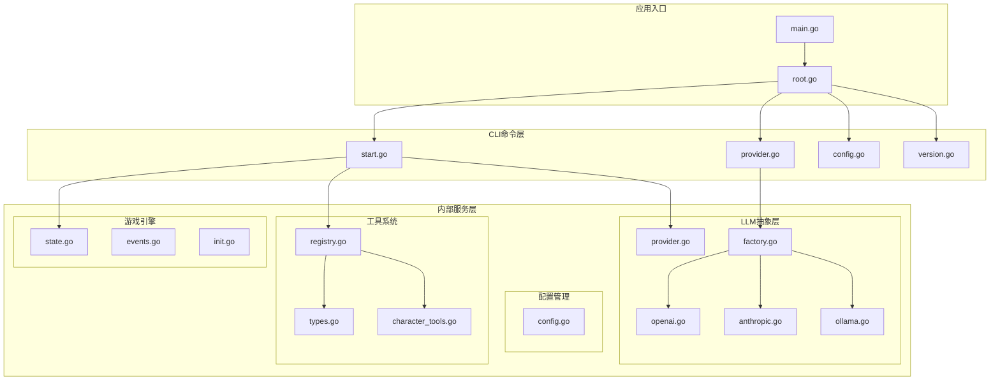
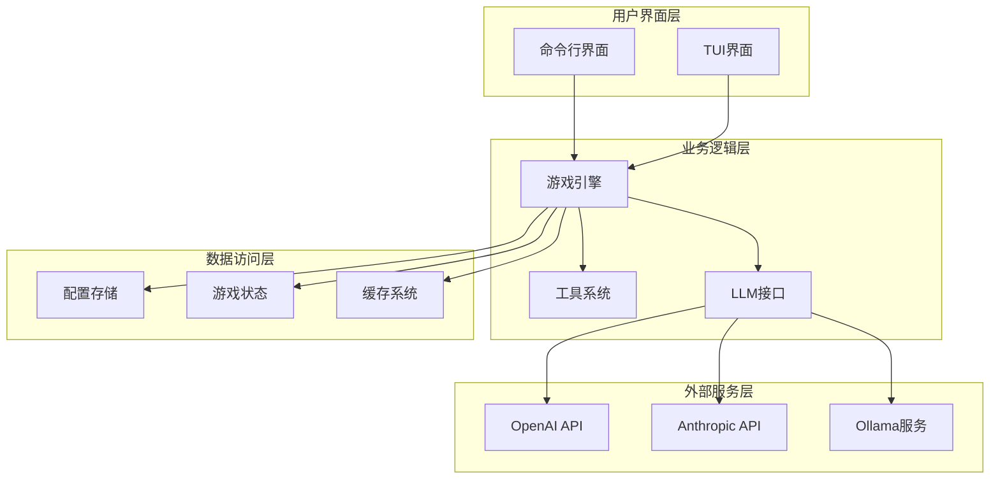
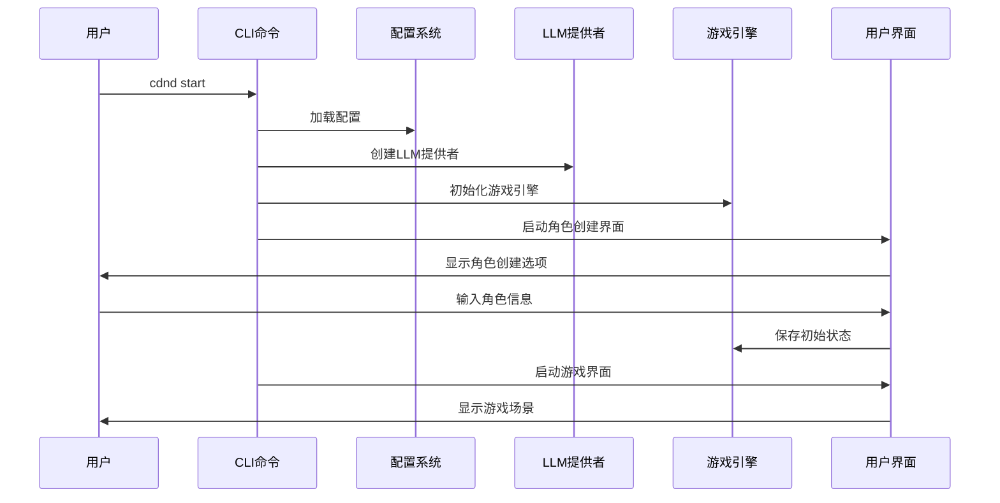
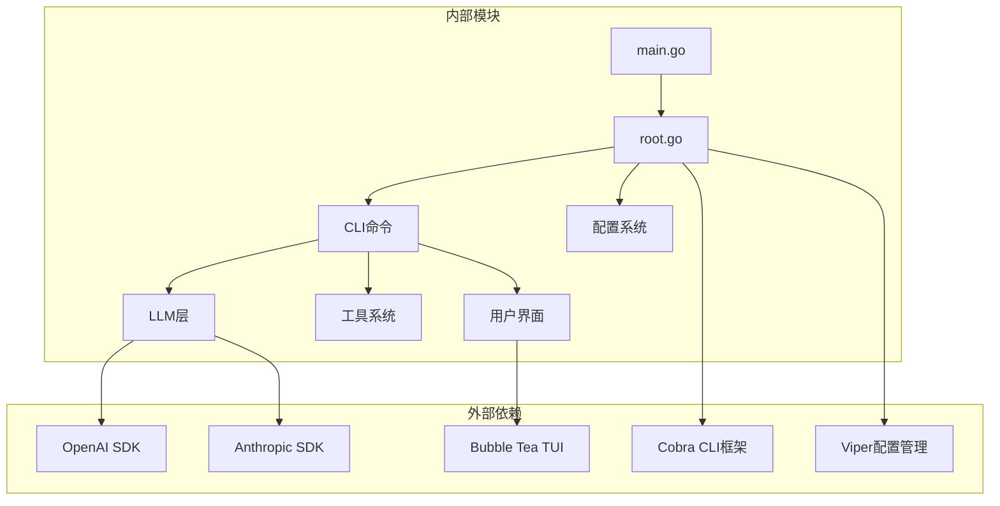

# API参考文档

<cite>
**本文档引用的文件**
- [main.go](file://main.go)
- [root.go](file://cmd/root.go)
- [start.go](file://cmd/start.go)
- [provider.go](file://cmd/provider.go)
- [config.go](file://cmd/config.go)
- [version.go](file://cmd/version.go)
- [config.go](file://internal/config/config.go)
- [provider.go](file://internal/llm/provider.go)
- [factory.go](file://internal/llm/factory.go)
- [openai.go](file://internal/llm/openai.go)
- [anthropic.go](file://internal/llm/anthropic.go)
- [ollama.go](file://internal/llm/ollama.go)
- [types.go](file://internal/tools/types.go)
- [registry.go](file://internal/tools/registry.go)
- [character_tools.go](file://internal/tools/character_tools.go)
- [config.example.yaml](file://config.example.yaml)
</cite>

## 目录
1. [简介](#简介)
2. [项目结构](#项目结构)
3. [核心组件](#核心组件)
4. [架构概览](#架构概览)
5. [详细组件分析](#详细组件分析)
6. [依赖关系分析](#依赖关系分析)
7. [性能考虑](#性能考虑)
8. [故障排除指南](#故障排除指南)
9. [结论](#结论)
10. [附录](#附录)

## 简介

CDND是一个基于大语言模型（LLM）驱动的命令行龙与地下城（D&D）角色扮演游戏。该项目提供了完整的CLI命令行接口、LLM提供商抽象层、工具系统和配置管理功能。

本项目的核心特性包括：
- 支持多种LLM提供商（OpenAI、Anthropic Claude、Ollama）
- 基于工具函数的AI代理能力
- 完整的游戏状态管理和角色系统
- 可配置的显示效果和游戏设置
- 命令行友好的交互界面

## 项目结构

CDND采用模块化架构设计，主要分为以下几个核心层次：



**图表来源**
- [main.go:1-8](file://main.go#L1-L8)
- [root.go:1-95](file://cmd/root.go#L1-L95)
- [config.go:1-54](file://internal/config/config.go#L1-L54)

**章节来源**
- [main.go:1-8](file://main.go#L1-L8)
- [root.go:1-95](file://cmd/root.go#L1-L95)

## 核心组件

### CLI命令系统

CDND提供了完整的命令行接口，通过Cobra框架实现。主要命令包括：

- `cdnd start` - 开始新游戏
- `cdnd provider` - 管理LLM提供商
- `cdnd config` - 管理配置设置
- `cdnd version` - 显示版本信息

### 配置管理系统

配置系统采用Viper实现，支持YAML配置文件、环境变量和命令行参数的组合。

### LLM提供商抽象

统一的LLM提供商接口，支持多种AI服务提供商的无缝切换。

### 工具系统

基于函数调用的工具系统，允许LLM与游戏状态进行交互。

**章节来源**
- [root.go:24-38](file://cmd/root.go#L24-L38)
- [config.go:1-54](file://internal/config/config.go#L1-L54)
- [provider.go:64-83](file://internal/llm/provider.go#L64-L83)

## 架构概览

CDND采用分层架构设计，确保各组件间的松耦合和高内聚：



**图表来源**
- [start.go:29-89](file://cmd/start.go#L29-L89)
- [factory.go:9-41](file://internal/llm/factory.go#L9-L41)
- [registry.go:10-132](file://internal/tools/registry.go#L10-L132)

## 详细组件分析

### CLI命令API

#### 根命令 (cdnd)

根命令负责初始化应用并设置全局配置。

**命令规范:**
- 语法: `cdnd [flags] [command]`
- 全局标志:
  - `--config`: 指定配置文件路径
  - `--debug`: 启用调试模式

**章节来源**
- [root.go:24-67](file://cmd/root.go#L24-L67)

#### 开始游戏命令 (cdnd start)

启动新的D&D冒险游戏。

**命令规范:**
- 语法: `cdnd start [flags]`
- 标志:
  - `-s, --save-slot`: 存档槽位编号 (1-10)
  - `-S, --scenario`: 剧本名称 (默认: "default")
  - `--skip-creation`: 跳过角色创建

**使用流程:**



**图表来源**
- [start.go:29-89](file://cmd/start.go#L29-L89)

**章节来源**
- [start.go:22-99](file://cmd/start.go#L22-L99)

#### LLM提供商命令 (cdnd provider)

管理LLM提供商配置和测试连接。

**命令规范:**
- 语法: `cdnd provider [subcommand] [flags]`
- 子命令:
  - `list`: 列出可用的LLM提供商
  - `test <provider>`: 测试提供商连接
  - `set-default <provider>`: 设置默认提供商

**提供商列表输出:**
- 显示所有配置的提供商
- 标识默认提供商
- 显示配置的关键参数

**章节来源**
- [provider.go:14-127](file://cmd/provider.go#L14-L127)

#### 配置管理命令 (cdnd config)

查看和修改应用配置。

**命令规范:**
- 语法: `cdnd config [subcommand]`
- 子命令:
  - `init`: 初始化配置文件
  - `get [key]`: 获取配置值
  - `set <key> <value>`: 设置配置值

**配置文件位置:** `~/.cdnd/config.yaml`

**章节来源**
- [config.go:13-124](file://cmd/config.go#L13-L124)

### LLM提供商API

#### Provider接口规范

所有LLM提供商必须实现统一的Provider接口。

**接口方法:**
- `Name() string`: 返回提供商名称
- `Generate(ctx, req) (*Response, error)`: 生成文本补全
- `GenerateStream(ctx, req) (<-chan StreamChunk, error)`: 生成流式补全
- `SetModel(model)`: 设置模型
- `SetMaxTokens(maxTokens)`: 设置最大令牌数
- `SetTemperature(temp)`: 设置温度参数

**数据结构:**

```mermaid
classDiagram
class Provider {
<<interface>>
+Name() string
+Generate(ctx, req) *Response
+GenerateStream(ctx, req) chan StreamChunk
+SetModel(model)
+SetMaxTokens(maxTokens)
+SetTemperature(temp)
}
class Request {
+Messages []Message
+Model string
+MaxTokens int
+Temperature float64
+Stream bool
+Tools []ToolDefinition
+ToolChoice interface{}
}
class Response {
+ID string
+Content string
+Model string
+Usage Usage
+ToolCalls []ToolCall
+FinishReason string
}
class Message {
+Role MessageRole
+Content string
+ToolCalls []ToolCall
+ToolCallID string
+Name string
}
Provider --> Request
Provider --> Response
Response --> Message
```

**图表来源**
- [provider.go:64-83](file://internal/llm/provider.go#L64-L83)
- [provider.go:27-46](file://internal/llm/provider.go#L27-L46)

**章节来源**
- [provider.go:1-114](file://internal/llm/provider.go#L1-L114)

#### OpenAI提供商实现

基于官方OpenAI SDK实现。

**配置参数:**
- `api_key`: API密钥
- `model`: 模型名称
- `base_url`: API基础URL
- `max_tokens`: 最大令牌数
- `temperature`: 生成温度

**章节来源**
- [openai.go:11-257](file://internal/llm/openai.go#L11-L257)

#### Anthropic提供商实现

基于官方Anthropic SDK实现。

**配置参数:**
- `api_key`: API密钥
- `model`: 模型名称
- `max_tokens`: 最大令牌数
- `temperature`: 生成温度

**章节来源**
- [anthropic.go:11-269](file://internal/llm/anthropic.go#L11-L269)

#### Ollama提供商实现

本地模型运行环境。

**配置参数:**
- `model`: 模型名称
- `base_url`: Ollama服务地址
- `max_tokens`: 最大令牌数
- `temperature`: 生成温度

**章节来源**
- [ollama.go:11-261](file://internal/llm/ollama.go#L11-L261)

### 工具系统API

#### 工具接口规范

工具系统允许LLM调用游戏功能。

**工具接口:**
- `Name() string`: 工具名称
- `Description() string`: 工具描述
- `Parameters() map[string]interface{}`: 参数定义
- `Execute(ctx, args) (*ToolResult, error)`: 执行工具

**工具结果:**
- `Success bool`: 执行是否成功
- `Data interface{}`: 返回数据
- `Narrative string`: 叙述文本
- `Error string`: 错误信息

**章节来源**
- [types.go:24-42](file://internal/tools/types.go#L24-L42)

#### 工具注册表

管理工具的注册、查找和执行。

**注册表功能:**
- `Register(tool, allowedPhases...)`: 注册工具
- `Get(name) (Tool, bool)`: 获取工具
- `Execute(ctx, name, args) (*ToolResult, error)`: 执行工具
- `GetToolDefinitions() []*ToolDefinition`: 获取工具定义
- `IsAllowedInPhase(name, phase) bool`: 检查阶段权限

**章节来源**
- [registry.go:10-132](file://internal/tools/registry.go#L10-L132)

#### 角色工具实现

##### 伤害工具 (deal_damage)

对目标造成伤害。

**参数定义:**
- `target` (string, 必需): 目标名称（"player"或NPC名称）
- `amount` (integer, 必需): 伤害值（最小值1）
- `type` (string, 必需): 伤害类型（枚举值）

**伤害类型枚举:**
- 强酸、钝击、冷冻、火焰、力场、闪电、黯蚀、穿刺、毒素、心灵、光耀、挥砍、雷鸣

**章节来源**
- [character_tools.go:8-101](file://internal/tools/character_tools.go#L8-L101)

##### 治疗工具 (heal_character)

治疗目标。

**参数定义:**
- `target` (string, 必需): 目标名称（"player"或NPC名称）
- `amount` (integer, 必需): 治疗量（最小值1）

**章节来源**
- [character_tools.go:103-184](file://internal/tools/character_tools.go#L103-L184)

##### 状态工具 (add_condition/remove_condition)

添加或移除角色状态。

**参数定义:**
- `target` (string, 必需): 目标名称
- `condition` (string, 必需): 状态名称
- `duration` (integer, 可选): 持续时间（回合数，默认0）

**状态类型枚举:**
- 失明、魅惑、耳聋、恐惧、擒抱、束缚、失能、隐形、中毒、倒地、震慑、昏迷

**章节来源**
- [character_tools.go:186-321](file://internal/tools/character_tools.go#L186-L321)

### 配置管理API

#### 配置结构

**全局配置 (Config):**
- `LLM LLMConfig`: LLM配置
- `Game GameConfig`: 游戏配置
- `Display DisplayConfig`: 显示配置
- `Advanced AdvancedConfig`: 高级配置

**LLM配置 (LLMConfig):**
- `DefaultProvider string`: 默认提供商
- `Providers map[string]ProviderConfig`: 提供商配置映射

**提供商配置 (ProviderConfig):**
- `APIKey string`: API密钥
- `Model string`: 模型名称
- `BaseURL string`: 基础URL
- `MaxTokens int`: 最大令牌数
- `Temperature float64`: 温度参数

**游戏配置 (GameConfig):**
- `Autosave bool`: 自动保存开关
- `AutosaveInterval time.Duration`: 自动保存间隔
- `MaxHistoryTurns int`: 最大历史回合数
- `Language string`: 语言设置

**显示配置 (DisplayConfig):**
- `TypewriterEffect bool`: 打字机效果
- `TypingSpeed time.Duration`: 打字速度
- `ColorOutput bool`: 彩色输出
- `ShowTokens bool`: 显示令牌

**高级配置 (AdvancedConfig):**
- `CacheEnabled bool`: 缓存开关
- `CacheTTL time.Duration`: 缓存TTL
- `LogLevel string`: 日志级别
- `LogFile string`: 日志文件路径

**章节来源**
- [config.go:8-54](file://internal/config/config.go#L8-L54)

## 依赖关系分析



**图表来源**
- [main.go:1-8](file://main.go#L1-L8)
- [root.go:4-11](file://cmd/root.go#L4-L11)

### 组件耦合分析

**低耦合设计:**
- CLI层与业务逻辑层分离
- LLM提供商接口抽象
- 工具系统独立于游戏状态
- 配置系统集中管理

**依赖注入:**
- 通过构造函数传递依赖
- 接口隔离原则
- 工厂模式创建提供商实例

**章节来源**
- [factory.go:9-69](file://internal/llm/factory.go#L9-L69)
- [registry.go:17-23](file://internal/tools/registry.go#L17-L23)

## 性能考虑

### LLM调用优化

**缓存策略:**
- 启用响应缓存减少重复调用
- 可配置的缓存TTL
- 智能缓存失效机制

**流式处理:**
- 支持流式响应提高用户体验
- 异步处理避免阻塞
- 分块传输优化网络性能

### 内存管理

**游戏状态优化:**
- 限制历史回合数
- 按需加载存档
- 及时清理临时数据

**工具执行:**
- 并发安全的工具注册表
- 适当的锁粒度控制
- 内存池优化频繁对象分配

### 网络性能

**连接池:**
- 复用LLM客户端连接
- 适当的超时设置
- 错误重试机制

**批量处理:**
- 合并相似的LLM请求
- 减少网络往返次数
- 智能请求队列管理

## 故障排除指南

### 常见错误及解决方案

**配置文件错误:**
- 检查配置文件格式
- 验证必需字段完整性
- 确认文件权限正确

**LLM提供商连接失败:**
- 验证API密钥有效性
- 检查网络连接
- 确认模型名称正确
- 检查基础URL配置

**工具执行错误:**
- 验证工具参数格式
- 检查工具权限设置
- 确认游戏状态可用性

### 调试技巧

**启用调试模式:**
```bash
cdnd --debug start
```

**查看详细日志:**
- 检查日志级别配置
- 查看缓存状态
- 监控LLM调用统计

**配置验证:**
```bash
cdnd config get
cdnd provider list
cdnd provider test openai
```

**章节来源**
- [root.go:31-37](file://cmd/root.go#L31-L37)
- [provider.go:58-93](file://cmd/provider.go#L58-L93)

## 结论

CDND项目提供了完整的CLI命令行游戏解决方案，具有以下特点：

**技术优势:**
- 模块化架构设计，易于扩展和维护
- 统一的LLM提供商抽象，支持多平台切换
- 基于工具函数的AI代理能力
- 完善的配置管理和状态持久化

**使用建议:**
- 根据需求选择合适的LLM提供商
- 合理配置游戏参数优化体验
- 利用工具系统增强AI交互能力
- 定期备份游戏存档

**未来发展方向:**
- 支持更多LLM提供商
- 增强工具系统的功能
- 优化性能和资源使用
- 扩展用户界面功能

## 附录

### API变更历史

**版本1.0.0 (初始发布)**
- 基础CLI命令实现
- OpenAI和Anthropic提供商支持
- 基础工具系统
- YAML配置文件支持

### 迁移指南

**从旧版本升级:**
1. 备份现有配置文件
2. 更新配置格式
3. 验证LLM提供商设置
4. 测试工具系统功能

**配置文件迁移:**
- 检查配置项名称变化
- 验证数据类型兼容性
- 更新缺失的默认值

### 安全考虑

**访问控制:**
- API密钥存储在配置文件中
- 支持环境变量覆盖
- 文件权限保护

**数据安全:**
- 游戏存档加密存储
- 敏感信息脱敏处理
- 审计日志记录

### 最佳实践

**配置管理:**
- 使用环境变量管理敏感信息
- 定期审查配置设置
- 备份重要配置文件

**性能优化:**
- 合理设置缓存参数
- 监控LLM使用量
- 优化工具执行效率

**开发指导:**
- 遵循接口设计原则
- 编写单元测试
- 文档同步更新

**章节来源**
- [config.example.yaml:1-72](file://config.example.yaml#L1-L72)