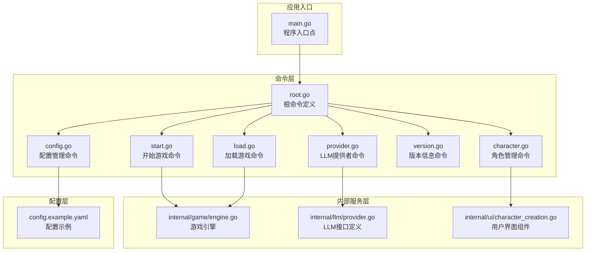
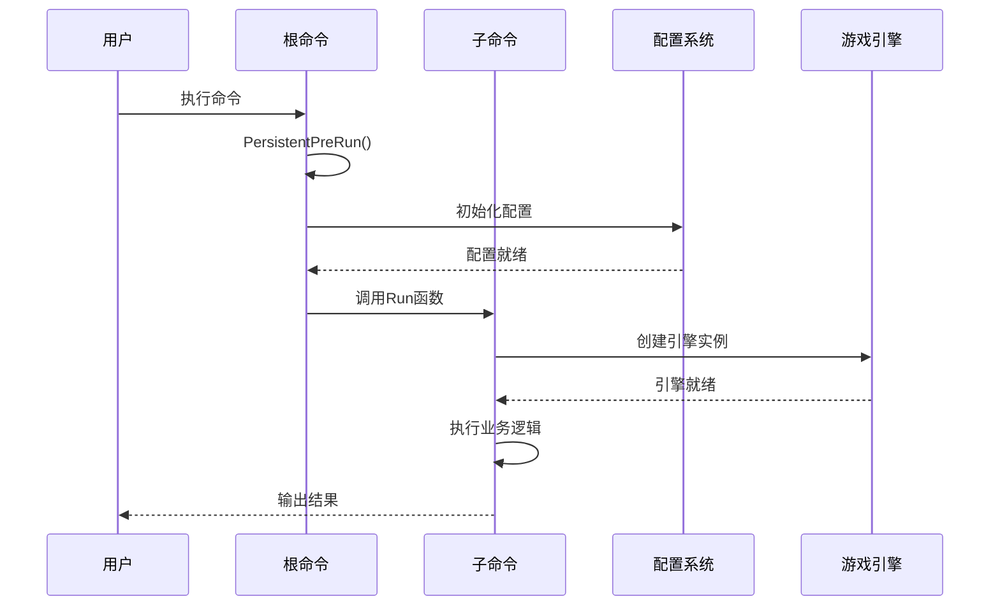
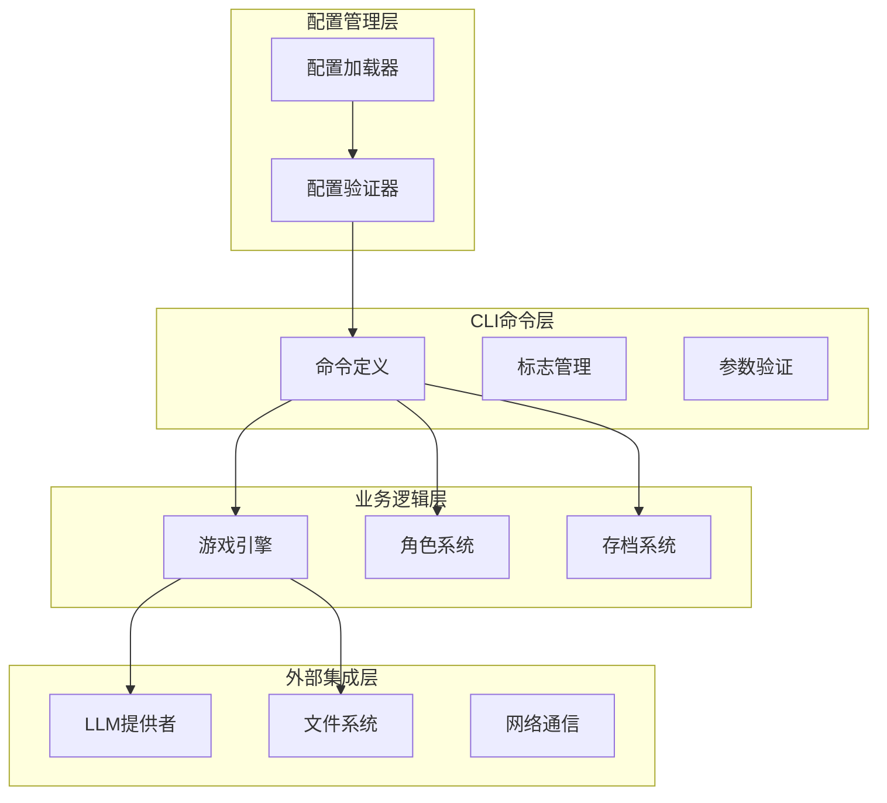
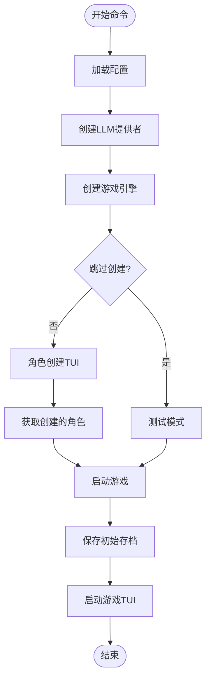
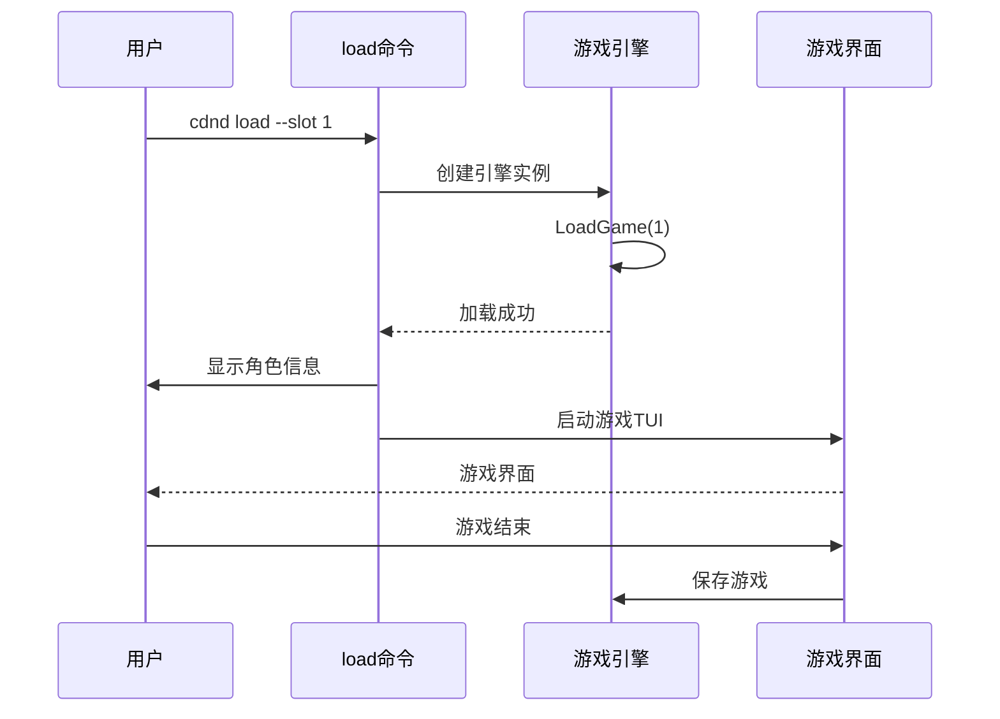
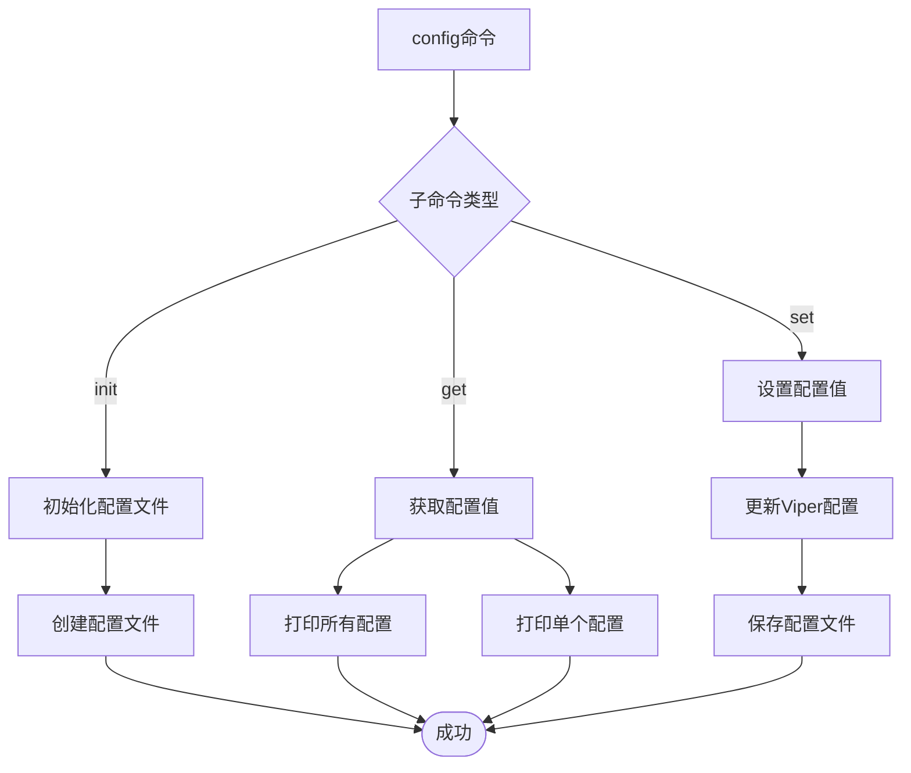
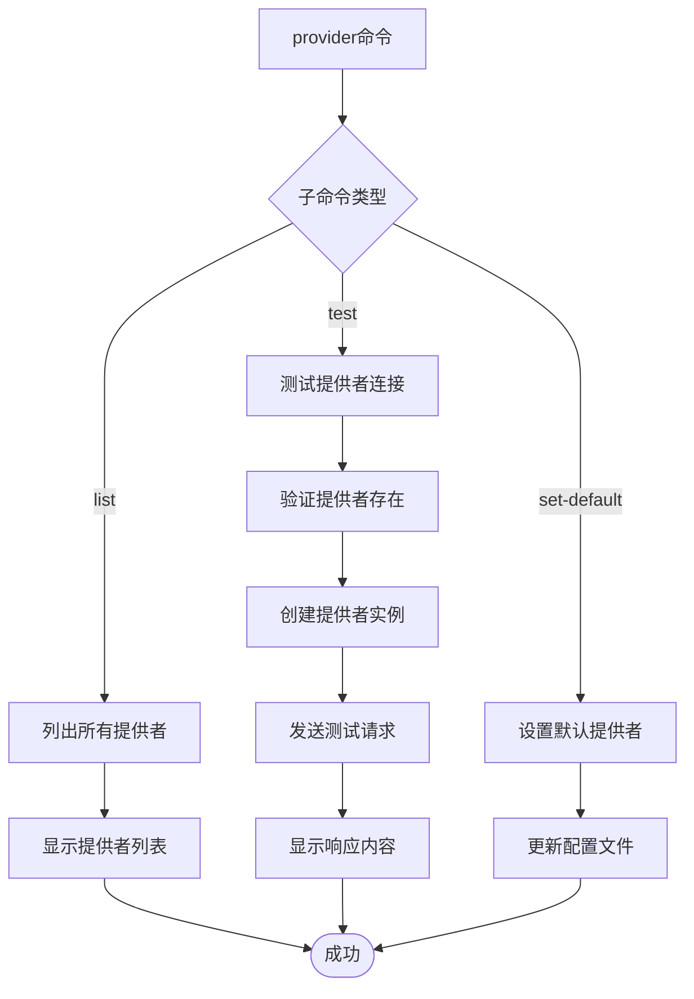
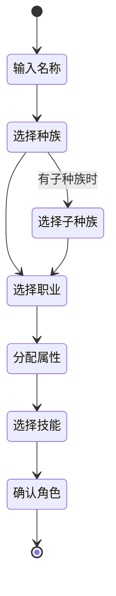
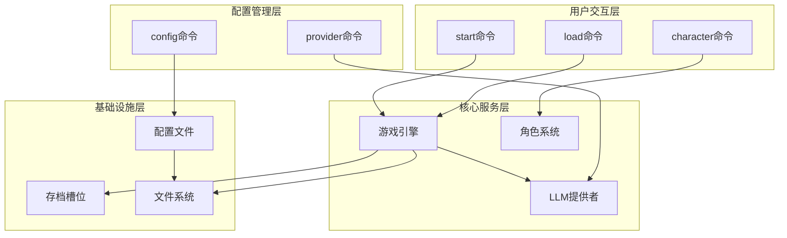
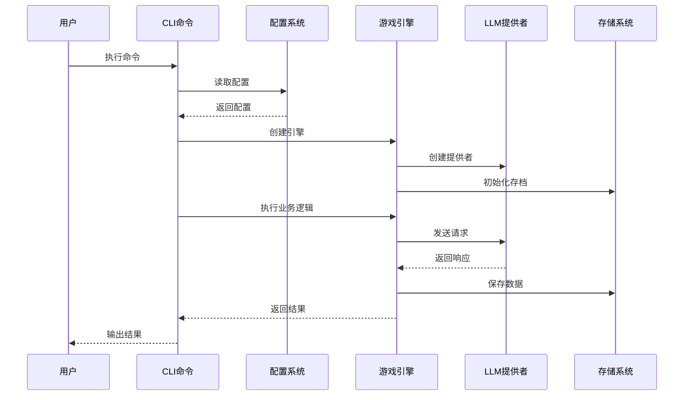

# CLI命令API

<cite>
**本文档引用的文件**
- [main.go](file://main.go)
- [root.go](file://cmd/root.go)
- [start.go](file://cmd/start.go)
- [load.go](file://cmd/load.go)
- [config.go](file://cmd/config.go)
- [provider.go](file://cmd/provider.go)
- [version.go](file://cmd/version.go)
- [character.go](file://cmd/character.go)
- [engine.go](file://internal/game/engine.go)
- [provider.go](file://internal/llm/provider.go)
- [character_creation.go](file://internal/ui/character_creation.go)
- [config.example.yaml](file://config.example.yaml)
</cite>

## 目录
1. [简介](#简介)
2. [项目结构](#项目结构)
3. [核心组件](#核心组件)
4. [架构概览](#架构概览)
5. [详细组件分析](#详细组件分析)
6. [依赖关系分析](#依赖关系分析)
7. [性能考虑](#性能考虑)
8. [故障排除指南](#故障排除指南)
9. [结论](#结论)

## 简介

CDND CLI命令系统是一个基于Go语言开发的命令行界面，专为Dungeons & Dragons（龙与地下城）角色扮演游戏设计。该系统通过大语言模型（LLM）提供智能的AI地下城主体验，支持多种LLM提供商，包括OpenAI、Anthropic Claude和Ollama本地模型。

该CLI系统提供了完整的命令行接口，允许用户：
- 开始新的D&D冒险游戏
- 加载已保存的游戏进度
- 管理配置设置
- 测试和配置LLM提供者
- 创建和管理D&D角色
- 查看版本信息

## 项目结构

CDND CLI命令系统采用清晰的分层架构，主要分为以下几个层次：



**图表来源**
- [main.go:1-8](file://main.go#L1-L8)
- [root.go:1-95](file://cmd/root.go#L1-L95)
- [engine.go:1-797](file://internal/game/engine.go#L1-L797)

**章节来源**
- [main.go:1-8](file://main.go#L1-L8)
- [root.go:1-95](file://cmd/root.go#L1-L95)

## 核心组件

### 根命令系统

根命令系统是整个CLI的核心，负责：
- 初始化全局配置
- 设置持久性标志
- 管理子命令注册
- 处理全局预运行逻辑

根命令具有以下特性：
- 使用`cdnd`作为基础命令名
- 支持中文帮助信息
- 提供调试模式支持
- 自动配置文件发现机制

### 命令执行流程

所有命令都遵循统一的执行模式：



**图表来源**
- [root.go:31-37](file://cmd/root.go#L31-L37)
- [start.go:29-44](file://cmd/start.go#L29-L44)

**章节来源**
- [root.go:24-67](file://cmd/root.go#L24-L67)

## 架构概览

CDND CLI系统采用模块化架构设计，各组件职责明确：



**图表来源**
- [engine.go:35-56](file://internal/game/engine.go#L35-L56)
- [provider.go:64-83](file://internal/llm/provider.go#L64-L83)

## 详细组件分析

### start命令 - 开始新游戏

start命令用于启动新的D&D冒险游戏，是用户与系统交互的主要入口点。

#### 命令语法
```
cdnd start [flags]
```

#### 参数选项
| 参数 | 短格式 | 类型 | 默认值 | 描述 |
|------|--------|------|--------|------|
| --save-slot | -s | 整数 | 1 | 存档槽位编号（1-10） |
| --scenario | -S | 字符串 | "default" | 要游玩的剧本 |
| --skip-creation |  | 布尔值 | false | 跳过角色创建（用于测试） |

#### 执行流程



**图表来源**
- [start.go:29-89](file://cmd/start.go#L29-L89)

#### 错误处理
- LLM提供者创建失败：退出码1
- 游戏引擎创建失败：退出码1
- 角色创建取消：正常退出
- 游戏运行错误：退出码1

**章节来源**
- [start.go:22-99](file://cmd/start.go#L22-L99)

### load命令 - 加载已保存的游戏

load命令用于从指定的存档槽位加载之前保存的游戏进度。

#### 命令语法
```
cdnd load [flags]
```

#### 参数选项
| 参数 | 短格式 | 类型 | 默认值 | 描述 |
|------|--------|------|--------|------|
| --slot | -s | 整数 | 1 | 存档槽位编号 |

#### 子命令
- `cdnd load saves` - 列出所有存档槽位

#### 执行流程



**图表来源**
- [load.go:26-69](file://cmd/load.go#L26-L69)

**章节来源**
- [load.go:18-120](file://cmd/load.go#L18-L120)

### config命令组 - 配置管理

config命令组提供完整的配置管理系统，支持配置文件的初始化、查看和修改。

#### 命令语法
```
cdnd config [subcommand] [flags]
```

#### 子命令
- `cdnd config init` - 初始化配置文件
- `cdnd config get [key]` - 获取配置值
- `cdnd config set <key> <value>` - 设置配置值

#### 执行流程



**图表来源**
- [config.go:28-84](file://cmd/config.go#L28-L84)

#### 配置文件结构

配置文件采用YAML格式，支持以下主要部分：

| 配置类别 | 关键字 | 类型 | 描述 |
|----------|--------|------|------|
| LLM设置 | llm.default_provider | 字符串 | 默认LLM提供者 |
| LLM设置 | llm.providers.[provider] | 对象 | LLM提供者配置 |
| 游戏设置 | game.autosave | 布尔值 | 启用自动保存 |
| 游戏设置 | game.autosave_interval | 持续时间 | 自动保存间隔 |
| 显示设置 | display.typewriter_effect | 布尔值 | 启用打字机效果 |
| 显示设置 | display.color_output | 布尔值 | 启用彩色输出 |
| 高级设置 | advanced.cache_enabled | 布尔值 | 启用缓存 |
| 高级设置 | advanced.log_level | 字符串 | 日志级别 |

**章节来源**
- [config.go:13-124](file://cmd/config.go#L13-L124)
- [config.example.yaml:1-72](file://config.example.yaml#L1-L72)

### provider命令组 - LLM提供者管理

provider命令组专门用于管理和测试LLM提供者配置。

#### 命令语法
```
cdnd provider [subcommand] [flags]
```

#### 子命令
- `cdnd provider list` - 列出可用的LLM提供者
- `cdnd provider test <provider>` - 测试LLM提供者连接
- `cdnd provider set-default <provider>` - 设置默认LLM提供者

#### 支持的提供者
- **openai**: OpenAI API提供者
- **anthropic**: Anthropic Claude提供者  
- **ollama**: 本地Ollama模型提供者

#### 执行流程



**图表来源**
- [provider.go:26-120](file://cmd/provider.go#L26-L120)

**章节来源**
- [provider.go:13-128](file://cmd/provider.go#L13-L128)

### character命令组 - 角色管理

character命令组提供D&D角色的创建、管理和查看功能。

#### 命令语法
```
cdnd character [subcommand] [flags]
```

#### 子命令
- `cdnd character create` - 创建新角色
- `cdnd character list` - 列出所有已保存的角色
- `cdnd character delete <name>` - 删除已保存的角色
- `cdnd character show [name]` - 显示角色详情

#### 角色创建流程



**图表来源**
- [character_creation.go:16-49](file://internal/ui/character_creation.go#L16-L49)

**章节来源**
- [character.go:12-99](file://cmd/character.go#L12-L99)
- [character_creation.go:51-537](file://internal/ui/character_creation.go#L51-L537)

### version命令 - 版本信息

version命令用于显示当前安装的CDND版本信息。

#### 命令语法
```
cdnd version
```

#### 输出格式
```
cdnd dev
  Git 提交: unknown
  构建日期: unknown
  Go 版本: go1.x.x
  系统/架构: darwin/amd64
```

**章节来源**
- [version.go:11-27](file://cmd/version.go#L11-L27)

## 依赖关系分析

### 命令间依赖关系



**图表来源**
- [engine.go:35-56](file://internal/game/engine.go#L35-L56)
- [root.go:31-37](file://cmd/root.go#L31-L37)

### 数据流分析



**图表来源**
- [engine.go:35-56](file://internal/game/engine.go#L35-L56)
- [provider.go:69-73](file://internal/llm/provider.go#L69-L73)

**章节来源**
- [engine.go:197-316](file://internal/game/engine.go#L197-L316)

## 性能考虑

### LLM调用优化

系统实现了智能的LLM调用策略：
- **工具调用循环**：最多10次迭代，避免无限循环
- **历史上下文限制**：限制历史消息数量，控制令牌使用
- **响应缓存**：可选的响应缓存机制
- **流式响应**：支持流式LLM响应处理

### 存档管理优化

- **增量保存**：只保存必要的游戏状态
- **内存管理**：合理管理历史记录大小
- **并发安全**：确保多线程环境下的数据一致性

### UI渲染优化

- **TUI优化**：使用Bubble Tea框架进行高效的终端UI渲染
- **状态缓存**：缓存计算结果，减少重复计算
- **异步处理**：后台处理长任务，保持界面响应性

## 故障排除指南

### 常见问题及解决方案

#### 配置文件相关问题

**问题**：配置文件无法读取
**原因**：配置文件路径错误或权限问题
**解决方案**：
1. 使用`cdnd config init`重新初始化配置文件
2. 检查`~/.cdnd/config.yaml`文件权限
3. 验证配置文件格式正确性

#### LLM提供者连接问题

**问题**：LLM提供者测试失败
**原因**：API密钥配置错误或网络连接问题
**解决方案**：
1. 使用`cdnd provider list`检查提供者配置
2. 使用`cdnd provider test <provider>`测试连接
3. 验证API密钥和网络连接

#### 游戏存档问题

**问题**：游戏无法加载或保存
**原因**：存档文件损坏或权限问题
**解决方案**：
1. 使用`cdnd load saves`查看存档状态
2. 检查存档文件完整性
3. 尝试使用其他存档槽位

#### 角色创建问题

**问题**：角色创建过程中出现错误
**原因**：输入验证失败或系统资源不足
**解决方案**：
1. 检查终端兼容性
2. 确保有足够的系统资源
3. 重新启动角色创建流程

**章节来源**
- [provider.go:58-93](file://cmd/provider.go#L58-L93)
- [load.go:45-48](file://cmd/load.go#L45-L48)

## 结论

CDND CLI命令系统提供了一个功能完整、架构清晰的命令行D&D游戏平台。系统的主要优势包括：

### 技术优势
- **模块化设计**：清晰的分层架构，便于维护和扩展
- **配置灵活**：支持多种LLM提供者和丰富的配置选项
- **用户体验**：直观的命令语法和详细的帮助信息
- **错误处理**：完善的错误处理和故障排除机制

### 功能特点
- **完整的D&D体验**：从角色创建到游戏进程的全流程支持
- **多平台兼容**：支持Windows、macOS和Linux系统
- **可扩展性**：易于添加新的命令和功能
- **性能优化**：针对CLI环境的性能优化设计

### 未来发展建议
1. **增强命令组合**：支持更复杂的命令链式调用
2. **插件系统**：引入插件机制支持第三方扩展
3. **云同步**：添加云存档同步功能
4. **多语言支持**：扩展国际化支持范围

该系统为D&D爱好者提供了一个强大而易用的命令行游戏平台，既适合新手入门，也满足资深玩家的深度需求。