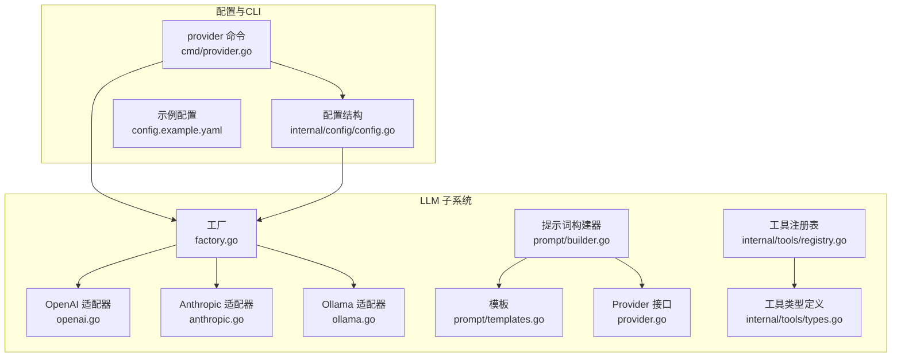
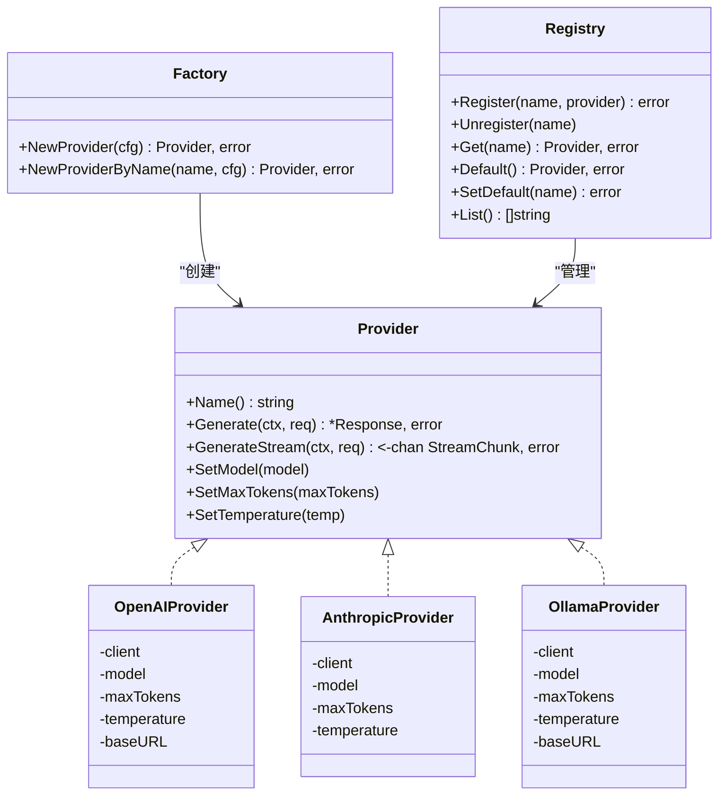
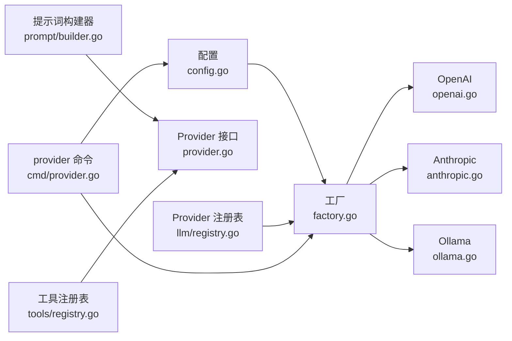

# LLM提供商API

<cite>
**本文引用的文件**
- [provider.go](file://internal/llm/provider.go)
- [factory.go](file://internal/llm/factory.go)
- [openai.go](file://internal/llm/openai.go)
- [anthropic.go](file://internal/llm/anthropic.go)
- [ollama.go](file://internal/llm/ollama.go)
- [registry.go](file://internal/llm/registry.go)
- [builder.go](file://internal/llm/prompt/builder.go)
- [templates.go](file://internal/llm/prompt/templates.go)
- [types.go](file://internal/tools/types.go)
- [registry.go](file://internal/tools/registry.go)
- [config.go](file://internal/config/config.go)
- [provider.go](file://cmd/provider.go)
- [config.example.yaml](file://config.example.yaml)
</cite>

## 目录
1. [简介](#简介)
2. [项目结构](#项目结构)
3. [核心组件](#核心组件)
4. [架构总览](#架构总览)
5. [详细组件分析](#详细组件分析)
6. [依赖关系分析](#依赖关系分析)
7. [性能考虑](#性能考虑)
8. [故障排查指南](#故障排查指南)
9. [结论](#结论)
10. [附录](#附录)

## 简介
本文件为 CDND 的 LLM 提供商集成系统的全面 API 文档，覆盖统一的 LLM 接口规范、Provider 接口方法定义、参数与返回值结构、OpenAI、Anthropic Claude、Ollama 等提供商的适配实现、消息格式与工具调用协议、响应处理机制、LLM 工厂模式使用指南、认证机制、速率限制与错误处理策略，并提供性能优化建议与最佳实践。

## 项目结构
LLM 子系统位于 internal/llm 目录，采用“统一接口 + 多提供商适配 + 工厂 + 注册表”的分层设计：
- 统一接口与数据结构：provider.go
- 工厂与提供商创建：factory.go
- OpenAI/Anthropic/Ollama 适配器：openai.go、anthropic.go、ollama.go
- 提示词构建与模板：prompt/builder.go、prompt/templates.go
- 工具系统与工具注册表：internal/tools/types.go、internal/tools/registry.go
- 配置与命令行：internal/config/config.go、cmd/provider.go、config.example.yaml

图表来源
- [provider.go:64-83](file://internal/llm/provider.go#L64-L83)
- [factory.go:9-41](file://internal/llm/factory.go#L9-L41)
- [openai.go:11-34](file://internal/llm/openai.go#L11-L34)
- [anthropic.go:11-34](file://internal/llm/anthropic.go#L11-L34)
- [ollama.go:11-38](file://internal/llm/ollama.go#L11-L38)
- [builder.go:51-61](file://internal/llm/prompt/builder.go#L51-L61)
- [templates.go:3-12](file://internal/llm/prompt/templates.go#L3-L12)
- [types.go:24-34](file://internal/tools/types.go#L24-L34)
- [registry.go:9-21](file://internal/tools/registry.go#L9-L21)
- [config.go:8-20](file://internal/config/config.go#L8-L20)
- [provider.go:13-20](file://cmd/provider.go#L13-L20)
- [config.example.yaml:5-39](file://config.example.yaml#L5-L39)

章节来源
- [provider.go:1-114](file://internal/llm/provider.go#L1-L114)
- [factory.go:1-69](file://internal/llm/factory.go#L1-L69)
- [openai.go:1-257](file://internal/llm/openai.go#L1-L257)
- [anthropic.go:1-269](file://internal/llm/anthropic.go#L1-L269)
- [ollama.go:1-261](file://internal/llm/ollama.go#L1-L261)
- [builder.go:1-273](file://internal/llm/prompt/builder.go#L1-L273)
- [templates.go:1-102](file://internal/llm/prompt/templates.go#L1-L102)
- [types.go:1-118](file://internal/tools/types.go#L1-L118)
- [registry.go:1-109](file://internal/tools/registry.go#L1-L109)
- [config.go:1-54](file://internal/config/config.go#L1-L54)
- [provider.go:1-128](file://cmd/provider.go#L1-L128)
- [config.example.yaml:1-72](file://config.example.yaml#L1-L72)

## 核心组件
- Provider 接口：统一的 LLM 调用入口，定义名称、同步生成、流式生成、模型/超参设置等方法。
- 数据结构：Message、Request、Response、Usage、StreamChunk、ToolDefinition、ToolFunctionDefinition、ToolCall。
- 工厂：根据配置创建指定提供商实例，支持按名称或默认提供商创建。
- 注册表：Provider 注册与默认提供者管理。
- 提示词构建器：基于模板与游戏上下文构建系统提示词、角色/场景/历史上下文等。
- 工具系统：工具接口、工具注册表、工具定义与执行流程。

章节来源
- [provider.go:64-114](file://internal/llm/provider.go#L64-L114)
- [factory.go:9-68](file://internal/llm/factory.go#L9-L68)
- [registry.go:8-140](file://internal/llm/registry.go#L8-L140)
- [builder.go:51-112](file://internal/llm/prompt/builder.go#L51-L112)
- [types.go:24-74](file://internal/tools/types.go#L24-L74)
- [registry.go:9-75](file://internal/tools/registry.go#L9-L75)

## 架构总览
统一接口 + 多提供商适配器 + 工厂 + 注册表 + 提示词构建 + 工具系统

图表来源
- [provider.go:64-83](file://internal/llm/provider.go#L64-L83)
- [openai.go:11-34](file://internal/llm/openai.go#L11-L34)
- [anthropic.go:11-34](file://internal/llm/anthropic.go#L11-L34)
- [ollama.go:11-38](file://internal/llm/ollama.go#L11-L38)
- [factory.go:9-41](file://internal/llm/factory.go#L9-L41)
- [registry.go:8-86](file://internal/llm/registry.go#L8-L86)

## 详细组件分析

### Provider 接口与数据结构
- 角色枚举：system、user、assistant、tool。
- 消息结构：包含角色、内容、工具调用数组、工具调用 ID、工具名。
- 请求结构：消息数组、模型、最大 token、温度、是否流式、工具定义、工具选择策略。
- 响应结构：ID、内容、模型、用量、工具调用、结束原因。
- 流式数据块：内容增量、完成标记、错误、工具调用、结束原因。
- 工具定义与调用：函数名、描述、参数 Schema；调用 ID、类型、名称、参数字符串。

章节来源
- [provider.go:8-114](file://internal/llm/provider.go#L8-L114)

### OpenAI 适配器
- 名称：openai。
- 同步生成：将内部消息转换为 OpenAI 消息，构造 ChatCompletion 请求，支持工具定义与工具选择；解析返回的 Choice、Usage、ToolCalls。
- 流式生成：启用流式，逐块读取 Delta 内容，EOF 时发送 Done 标记，错误时发送 Error。
- 超参设置：模型、最大 token、温度。
- 消息转换：处理 tool 角色消息的 ToolCallID；处理 assistant 消息中的 ToolCalls。

章节来源
- [openai.go:11-257](file://internal/llm/openai.go#L11-L257)

### Anthropic Claude 适配器
- 名称：anthropic。
- 同步生成：将内部消息转换为 Claude 的 MessageParam，支持 system、user、assistant、tool；解析 content blocks 文本与 tool_use；处理 StopReason 映射。
- 流式生成：使用 Streaming API，监听 content_block_delta 与 message_stop 事件。
- 超参设置：模型、最大 token、温度。
- 消息转换：分别转换 user、assistant、tool result 消息。

章节来源
- [anthropic.go:11-269](file://internal/llm/anthropic.go#L11-L269)

### Ollama 适配器
- 名称：ollama。
- 说明：Ollama 使用 OpenAI 兼容 API，因此直接复用 OpenAI 客户端与消息转换逻辑。
- 默认 BaseURL：http://localhost:11434/v1。
- 同步/流式生成：与 OpenAI 一致。
- 超参设置：模型、最大 token、温度。
- 消息转换：与 OpenAI 一致。

章节来源
- [ollama.go:11-261](file://internal/llm/ollama.go#L11-L261)

### 工厂模式
- NewProvider：根据配置中的默认提供商名称创建对应 Provider 实例。
- NewProviderByName：按指定名称创建 Provider 实例。
- 支持提供商：openai、anthropic、ollama。
- 配置映射：将 config.ProviderConfig 转换为 llm.ProviderConfig。

章节来源
- [factory.go:9-68](file://internal/llm/factory.go#L9-L68)

### Provider 注册表
- 注册/注销：并发安全，支持设置默认提供商。
- 获取默认：若未设置默认或默认不存在，返回错误。
- 列表：返回所有已注册提供商名称。
- 全局注册表：提供全局注册、获取、默认、设置默认、列表方法。

章节来源
- [registry.go:8-140](file://internal/llm/registry.go#L8-L140)

### 提示词构建与模板
- Builder：构建系统提示词、角色上下文、场景上下文、历史上下文、开场/战斗/对话/休息/玩家行动提示词；支持截断历史。
- Templates：默认中文模板，包含 DM 角色、规则、工具调用说明、各类提示词模板。
- 颜色标记：支持 {{type:内容}} 样式标记，渲染为带样式的文本。

章节来源
- [builder.go:51-273](file://internal/llm/prompt/builder.go#L51-L273)
- [templates.go:3-102](file://internal/llm/prompt/templates.go#L3-L102)

### 工具系统
- 工具接口：Name、Description、Parameters、Execute。
- 工具结果：Success、Data、Narrative、Error。
- 工具定义：Type、Function(Name, Description, Parameters)。
- 工具调用：ID、Name、Arguments(map)。
- 工具注册表：注册、获取、执行、从 JSON 执行、获取定义、权限检查、清空、计数。

章节来源
- [types.go:24-74](file://internal/tools/types.go#L24-L74)
- [registry.go:9-75](file://internal/tools/registry.go#L9-L75)

### 配置与命令行
- 配置结构：LLMConfig(DefaultProvider, Providers)、ProviderConfig(APIKey, Model, BaseURL, MaxTokens, Temperature)。
- 示例配置：包含 openai、anthropic、ollama 的示例项。
- provider 命令：list、test、set-default，支持测试连接与设置默认提供商。

章节来源
- [config.go:8-29](file://internal/config/config.go#L8-L29)
- [config.example.yaml:5-39](file://config.example.yaml#L5-L39)
- [provider.go:13-128](file://cmd/provider.go#L13-L128)

## 依赖关系分析
- Provider 接口被三个适配器实现，工厂负责实例化，注册表负责生命周期管理。
- 提示词构建器依赖模板与游戏上下文，最终生成符合 Provider 接口的消息数组。
- 工具注册表提供工具定义与执行，供 Provider 请求携带工具定义与工具调用处理。

图表来源
- [factory.go:9-41](file://internal/llm/factory.go#L9-L41)
- [openai.go:11-34](file://internal/llm/openai.go#L11-L34)
- [anthropic.go:11-34](file://internal/llm/anthropic.go#L11-L34)
- [ollama.go:11-38](file://internal/llm/ollama.go#L11-L38)
- [builder.go:51-112](file://internal/llm/prompt/builder.go#L51-L112)
- [registry.go:8-86](file://internal/llm/registry.go#L8-L86)
- [config.go:8-29](file://internal/config/config.go#L8-L29)
- [provider.go:13-20](file://cmd/provider.go#L13-L20)

## 性能考虑
- 流式响应：优先使用 GenerateStream 以提升交互体验，避免阻塞等待完整响应。
- 历史截断：在提示词构建器中对历史对话进行截断，减少上下文长度，提高响应速度与降低成本。
- 上下文适配：根据提供商的上下文窗口限制调整 MaxTokens 与历史长度。
- 并发安全：Provider 注册表使用读写锁，确保多协程下的安全访问。
- 缓存策略：配置中提供缓存开关与 TTL，可用于减少重复请求（需结合业务场景使用）。
- 本地推理：Ollama 适配器可作为本地替代方案，降低网络延迟与外部依赖风险。

## 故障排查指南
- 未知提供商：工厂创建失败时会返回“unknown provider”错误，检查配置中的默认提供商名称。
- 提供商未配置：当默认提供商为空或不存在于配置中时，创建失败。
- API 错误：各适配器在调用外部 API 时可能返回错误，需检查 API Key、BaseURL、网络连通性。
- 流式 EOF：流式接收遇到 EOF 时会发送 Done=true，表示流结束；若中途出现错误，会发送 Error。
- 工具执行：工具执行失败时返回 ToolResult.Error；参数解析失败会返回解析错误。
- 命令行测试：使用 provider test 命令快速验证连接与基本功能。

章节来源
- [factory.go:11-40](file://internal/llm/factory.go#L11-L40)
- [openai.go:89-92](file://internal/llm/openai.go#L89-L92)
- [anthropic.go:101-104](file://internal/llm/anthropic.go#L101-L104)
- [ollama.go:93-96](file://internal/llm/ollama.go#L93-L96)
- [registry.go:37-57](file://internal/tools/registry.go#L37-L57)
- [provider.go:53-94](file://cmd/provider.go#L53-L94)

## 结论
CDND 的 LLM 子系统通过统一 Provider 接口实现了对 OpenAI、Anthropic Claude、Ollama 的无缝适配，配合工厂与注册表实现灵活的提供商选择与生命周期管理。提示词构建器与工具系统进一步增强了与游戏世界的集成能力。建议在生产环境中优先使用流式响应、合理截断历史、正确配置 API Key 与 BaseURL，并结合缓存策略优化性能。

## 附录

### 统一接口规范（Provider）
- 方法
  - Name() string：返回提供商名称
  - Generate(ctx, req) *Response, error：同步生成
  - GenerateStream(ctx, req) <-chan StreamChunk, error：流式生成
  - SetModel(model)：设置模型
  - SetMaxTokens(maxTokens)：设置最大 token
  - SetTemperature(temp)：设置温度

章节来源
- [provider.go:64-83](file://internal/llm/provider.go#L64-L83)

### 请求/响应数据结构
- 消息(Message)：角色、内容、工具调用、工具调用 ID、工具名
- 请求(Request)：消息数组、模型、最大 token、温度、是否流式、工具定义、工具选择
- 响应(Response)：ID、内容、模型、用量、工具调用、结束原因
- 流式块(StreamChunk)：内容增量、完成标记、错误、工具调用、结束原因
- 工具定义(ToolDefinition)：类型、函数定义（名称、描述、参数 Schema）
- 工具调用(ToolCall)：ID、类型、名称、参数(JSON 字符串)

章节来源
- [provider.go:18-114](file://internal/llm/provider.go#L18-L114)

### 工具调用协议
- 工具定义：由工具注册表收集，转换为 Provider 请求中的 Tools。
- 工具调用：Provider 返回 ToolCalls，内部再由工具注册表执行，返回 ToolResult。
- 参数传递：工具调用参数以 JSON 字符串形式传递，执行时解析为 map[string]interface{}。

章节来源
- [types.go:44-74](file://internal/tools/types.go#L44-L74)
- [registry.go:37-66](file://internal/tools/registry.go#L37-L66)

### 认证机制与速率限制
- 认证：OpenAI/Anthropic 使用 API Key；Ollama 本地推理无需 API Key（可通过 BaseURL 指向代理服务）。
- 速率限制：各提供商的速率限制策略不同，建议在应用层进行限速与重试策略设计（如指数退避）。
- 配置：通过配置文件设置 API Key、BaseURL、模型、最大 token、温度等。

章节来源
- [config.go:16-29](file://internal/config/config.go#L16-L29)
- [config.example.yaml:13-38](file://config.example.yaml#L13-L38)
- [openai.go:22-25](file://internal/llm/openai.go#L22-L25)
- [anthropic.go:21-26](file://internal/llm/anthropic.go#L21-L26)
- [ollama.go:22-37](file://internal/llm/ollama.go#L22-L37)

### 工厂模式使用指南
- 初始化：从配置中读取默认提供商名称，创建对应 Provider 实例。
- 按名称创建：NewProviderByName(name, cfg) 直接创建指定提供商。
- 配置映射：将 config.ProviderConfig 转换为 llm.ProviderConfig 后传入构造函数。

章节来源
- [factory.go:9-68](file://internal/llm/factory.go#L9-L68)

### 命令行集成模式
- 列出提供商：provider list
- 测试连接：provider test <provider>
- 设置默认：provider set-default <provider>

章节来源
- [provider.go:13-128](file://cmd/provider.go#L13-L128)

### 提示词构建与消息格式
- 系统提示词：包含 DM 角色、规则、工具调用说明、角色/场景/历史上下文。
- 消息格式：支持 system、user、assistant、tool 四种角色；assistant 可包含工具调用；tool 角色需携带工具调用 ID 与工具名。
- 颜色标记：支持 {{type:内容}} 样式标记，渲染为带样式的文本。

章节来源
- [builder.go:75-112](file://internal/llm/prompt/builder.go#L75-L112)
- [templates.go:14-100](file://internal/llm/prompt/templates.go#L14-L100)