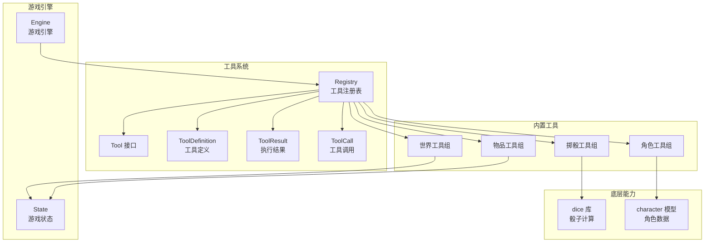
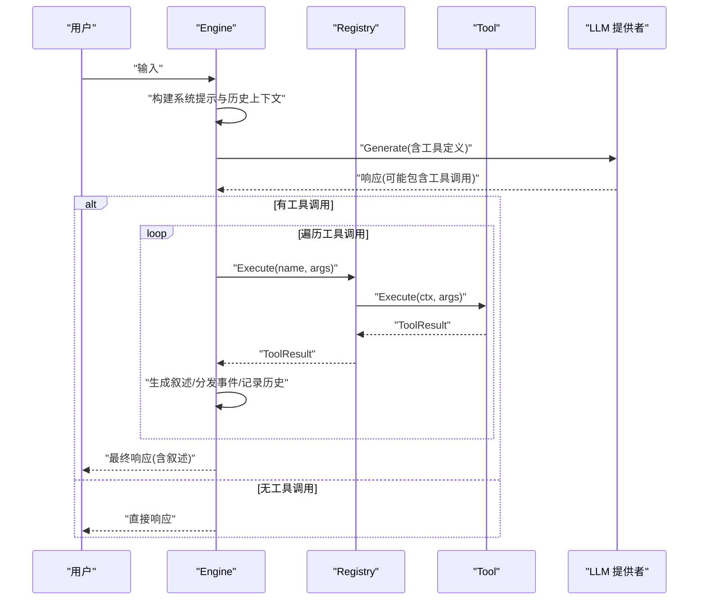
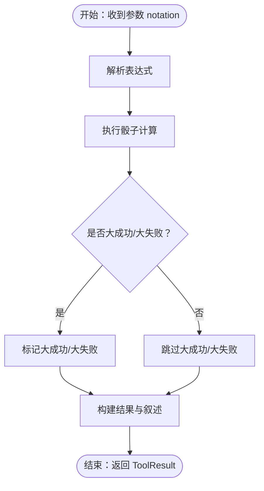
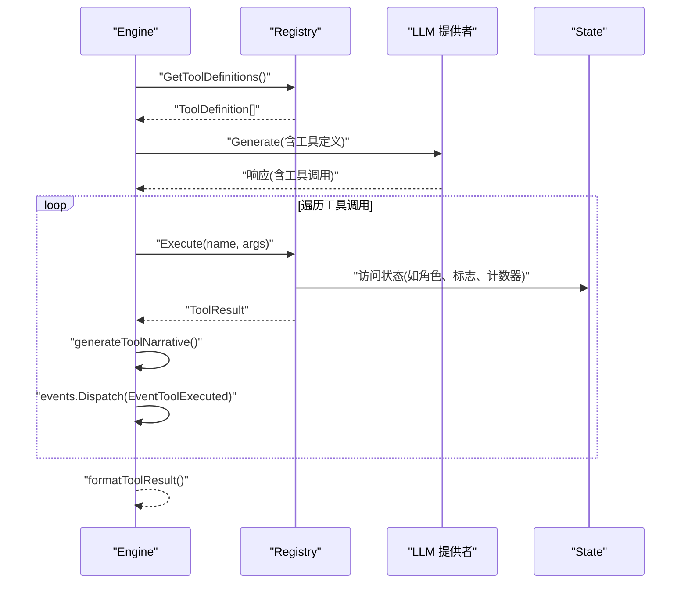
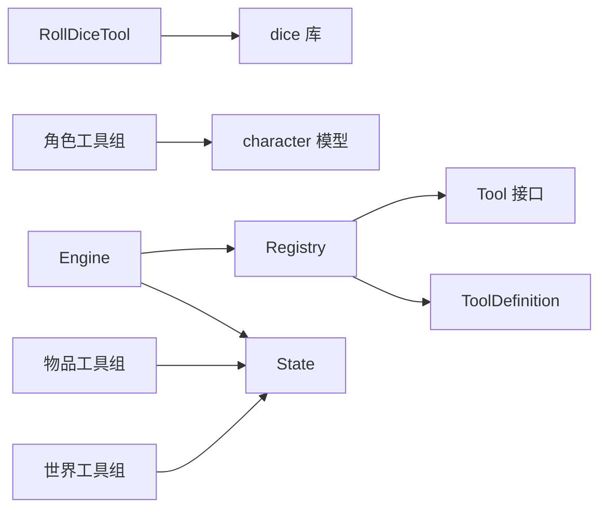

# 工具系统API

<cite>
**本文档引用的文件**
- [internal/tools/registry.go](file://internal/tools/registry.go)
- [internal/tools/types.go](file://internal/tools/types.go)
- [internal/tools/character_tools.go](file://internal/tools/character_tools.go)
- [internal/tools/dice_tools.go](file://internal/tools/dice_tools.go)
- [internal/tools/item_tools.go](file://internal/tools/item_tools.go)
- [internal/tools/world_tools.go](file://internal/tools/world_tools.go)
- [internal/game/engine.go](file://internal/game/engine.go)
- [internal/game/state.go](file://internal/game/state.go)
- [pkg/dice/dice.go](file://pkg/dice/dice.go)
- [internal/character/character.go](file://internal/character/character.go)
</cite>

## 目录
1. [简介](#简介)
2. [项目结构](#项目结构)
3. [核心组件](#核心组件)
4. [架构概览](#架构概览)
5. [详细组件分析](#详细组件分析)
6. [依赖关系分析](#依赖关系分析)
7. [性能考量](#性能考量)
8. [故障排除指南](#故障排除指南)
9. [结论](#结论)
10. [附录](#附录)

## 简介
本文件为 CDND 工具系统的详细 API 参考文档，涵盖工具定义的数据结构、参数规范与执行接口；说明工具注册表的工作机制（注册、查找与执行流程）；记录所有内置工具的功能规格（角色工具、掷骰工具、物品工具与世界工具的参数与返回值）；提供工具权限控制与安全机制说明；解释工具调用生命周期管理与错误处理；包含自定义工具开发的 API 规范与实现指南；并提供工具使用的最佳实践与性能考虑。

## 项目结构
工具系统位于 internal/tools 目录，围绕工具接口、注册表与多种内置工具展开，并通过游戏引擎集成到 LLM 驱动的代理循环中。



图表来源
- [internal/tools/registry.go:9-109](file://internal/tools/registry.go#L9-L109)
- [internal/tools/types.go:24-118](file://internal/tools/types.go#L24-L118)
- [internal/game/engine.go:22-56](file://internal/game/engine.go#L22-L56)
- [internal/game/state.go:13-42](file://internal/game/state.go#L13-L42)
- [pkg/dice/dice.go:33-41](file://pkg/dice/dice.go#L33-L41)
- [internal/character/character.go:8-61](file://internal/character/character.go#L8-L61)

章节来源
- [internal/tools/registry.go:1-109](file://internal/tools/registry.go#L1-L109)
- [internal/tools/types.go:1-118](file://internal/tools/types.go#L1-L118)
- [internal/game/engine.go:1-797](file://internal/game/engine.go#L1-L797)
- [internal/game/state.go:1-236](file://internal/game/state.go#L1-L236)
- [pkg/dice/dice.go:1-158](file://pkg/dice/dice.go#L1-L158)
- [internal/character/character.go:1-223](file://internal/character/character.go#L1-L223)

## 核心组件
- 工具接口与基础结构
  - Tool 接口：定义 Name、Description、Parameters、Execute 方法
  - ToolResult：统一的执行结果结构，包含 success、data、narrative、error
  - ToolDefinition/ToolFunctionDefinition：用于 LLM API 的函数定义
  - BaseTool：可选的基础实现，提供默认参数与执行行为
- 工具注册表
  - Registry：维护工具映射与权限映射，提供注册、查找、执行、定义导出、权限检查等方法
- 状态访问接口
  - StateAccessor：抽象游戏状态访问，解耦工具与具体游戏包

章节来源
- [internal/tools/types.go:10-118](file://internal/tools/types.go#L10-L118)
- [internal/tools/registry.go:9-109](file://internal/tools/registry.go#L9-L109)

## 架构概览
工具系统通过游戏引擎集成到 LLM 驱动的代理循环中：
- 引擎启动时注册所有内置工具
- 每次用户输入时，引擎构建系统提示与历史上下文，调用 LLM 获取工具调用建议
- 引擎执行工具调用，生成 D&D 风格叙述，分发事件并记录历史



图表来源
- [internal/game/engine.go:195-316](file://internal/game/engine.go#L195-L316)
- [internal/tools/registry.go:37-57](file://internal/tools/registry.go#L37-L57)

章节来源
- [internal/game/engine.go:195-316](file://internal/game/engine.go#L195-L316)

## 详细组件分析

### 工具注册表（Registry）
- 功能
  - 注册工具与权限映射
  - 查找工具与执行工具
  - 从 JSON 参数执行工具
  - 导出工具定义给 LLM
  - 权限检查（按游戏阶段）
  - 清空与统计工具数量
- 关键方法
  - Register(tool, allowedPhases...)：注册工具及允许的游戏阶段
  - Get(name)：按名称获取工具
  - Execute(ctx, name, args)：执行工具
  - ExecuteFromJSON(ctx, name, argsJSON)：从 JSON 参数执行
  - GetToolDefinitions()：导出工具定义
  - IsAllowedInPhase(name, phase)：检查工具在指定阶段是否允许
  - ListTools()/HasTool()/Clear()/ToolCount()：辅助查询与管理

```mermaid
classDiagram
class Registry {
-tools map[string]Tool
-permissions map[string][]string
+Register(tool, allowedPhases...)
+Get(name) Tool,bool
+Execute(ctx, name, args) ToolResult,error
+ExecuteFromJSON(ctx, name, argsJSON) ToolResult,error
+GetToolDefinitions() ToolDefinition[]
+ListTools() string[]
+HasTool(name) bool
+IsAllowedInPhase(name, phase) bool
+Clear() void
+ToolCount() int
}
class Tool {
<<interface>>
+Name() string
+Description() string
+Parameters() map[string]interface{}
+Execute(ctx, args) ToolResult,error
}
class ToolDefinition {
+string Type
+ToolFunctionDefinition Function
}
class ToolFunctionDefinition {
+string Name
+string Description
+map[string]interface{} Parameters
}
class ToolResult {
+bool Success
+interface{} Data
+string Narrative
+string Error
}
Registry --> Tool : "持有"
Registry --> ToolDefinition : "导出"
ToolDefinition --> ToolFunctionDefinition : "包含"
```

图表来源
- [internal/tools/registry.go:9-109](file://internal/tools/registry.go#L9-L109)
- [internal/tools/types.go:24-67](file://internal/tools/types.go#L24-L67)

章节来源
- [internal/tools/registry.go:1-109](file://internal/tools/registry.go#L1-L109)
- [internal/tools/types.go:1-118](file://internal/tools/types.go#L1-L118)

### 工具接口与基础结构（Tool、ToolResult、ToolDefinition）
- Tool 接口
  - Name/Description：工具标识与描述（LLM 可见）
  - Parameters：JSON Schema 形式的参数定义
  - Execute：执行工具并返回 ToolResult
- ToolResult
  - Success：是否成功
  - Data：任意结构化的返回数据
  - Narrative：D&D 风格叙述文本
  - Error：错误信息
- ToolDefinition/ToolFunctionDefinition
  - 用于将工具暴露给 LLM 的函数式调用接口
- BaseTool
  - 默认实现：Name/Description/Parameters/Execute
  - 可作为自定义工具的基类

章节来源
- [internal/tools/types.go:10-118](file://internal/tools/types.go#L10-L118)

### 掷骰工具组（RollDiceTool、SkillCheckTool、SavingThrowTool）
- RollDiceTool
  - 参数：notation（如 1d20+5、2d6、1d20adv、1d20dis）
  - 返回：total、dice、modifier、critical、roll_type 等
  - 叙述：包含大成功/大失败提示
- SkillCheckTool
  - 参数：skill（技能名）、dc（难度等级）、advantage（布尔）
  - 返回：roll、modifier、total、dc、success、critical
  - 叙述：根据成功/失败与大成功/大失败生成 D&D 风格文本
- SavingThrowTool
  - 参数：ability（属性）、dc、advantage
  - 返回：roll、modifier、total、dc、success、critical
  - 叙述：同上



图表来源
- [internal/tools/dice_tools.go:38-71](file://internal/tools/dice_tools.go#L38-L71)
- [pkg/dice/dice.go:115-143](file://pkg/dice/dice.go#L115-L143)

章节来源
- [internal/tools/dice_tools.go:1-314](file://internal/tools/dice_tools.go#L1-L314)
- [pkg/dice/dice.go:1-158](file://pkg/dice/dice.go#L1-L158)

### 角色工具组（DealDamageTool、HealCharacterTool、AddConditionTool、RemoveConditionTool）
- DealDamageTool
  - 参数：target（目标）、amount（伤害值）、type（伤害类型）
  - 行为：对玩家或 NPC 造成伤害，更新 HP，生成叙述
- HealCharacterTool
  - 参数：target（目标）、amount（治疗量）
  - 行为：对玩家或 NPC 治疗，更新 HP，生成叙述
- AddConditionTool/RemoveConditionTool
  - 参数：target、condition（状态名）、duration（可选）
  - 行为：通过状态标志存储状态，生成叙述

章节来源
- [internal/tools/character_tools.go:1-321](file://internal/tools/character_tools.go#L1-L321)
- [internal/character/character.go:102-133](file://internal/character/character.go#L102-L133)

### 物品工具组（AddItemTool、RemoveItemTool、SpendGoldTool、GainGoldTool）
- AddItemTool
  - 参数：item_id、name、quantity（默认 1）
  - 行为：通过计数器记录物品数量，生成叙述
- RemoveItemTool
  - 参数：item_id、quantity（默认 1）
  - 行为：检查数量后减少计数器，生成叙述
- SpendGoldTool/GainGoldTool
  - 参数：amount
  - 行为：检查金币余额后增减，生成叙述

章节来源
- [internal/tools/item_tools.go:1-287](file://internal/tools/item_tools.go#L1-L287)
- [internal/game/state.go:110-134](file://internal/game/state.go#L110-L134)

### 世界工具组（MoveToSceneTool、SpawnNPCTool、RemoveNPCTool、SetFlagTool、GetFlagTool）
- MoveToSceneTool
  - 参数：scene_id、scene_name、description
  - 行为：设置场景访问标志、计数器，生成叙述
- SpawnNPCTool/RemoveNPCTool
  - 参数：npc_id、name、role、description（生成）；npc_id、reason（移除）
  - 行为：通过标志控制 NPC 存在性，生成叙述
- SetFlagTool/GetFlagTool
  - 参数：key、value（可选，默认 true）
  - 行为：读写世界标志，生成叙述

章节来源
- [internal/tools/world_tools.go:1-330](file://internal/tools/world_tools.go#L1-L330)
- [internal/game/state.go:110-128](file://internal/game/state.go#L110-L128)

### 游戏引擎集成与生命周期
- 引擎初始化时注册所有内置工具
- Process 中：
  - 构建系统提示与历史上下文
  - 调用 LLM 获取工具调用
  - 执行工具调用，生成 D&D 风格叙述，分发事件
  - 最终返回响应与工具调用历史



图表来源
- [internal/game/engine.go:58-76](file://internal/game/engine.go#L58-L76)
- [internal/game/engine.go:195-316](file://internal/game/engine.go#L195-L316)
- [internal/game/engine.go:465-512](file://internal/game/engine.go#L465-L512)

章节来源
- [internal/game/engine.go:1-797](file://internal/game/engine.go#L1-L797)

## 依赖关系分析
- 工具注册表依赖工具接口与工具定义
- 内置工具依赖状态访问接口与骰子库
- 游戏引擎依赖注册表与状态，负责工具调用生命周期与叙述生成



图表来源
- [internal/tools/registry.go:9-109](file://internal/tools/registry.go#L9-L109)
- [internal/tools/types.go:24-67](file://internal/tools/types.go#L24-L67)
- [internal/tools/dice_tools.go:12-22](file://internal/tools/dice_tools.go#L12-L22)
- [internal/tools/character_tools.go:8-12](file://internal/tools/character_tools.go#L8-L12)
- [internal/tools/item_tools.go:8-12](file://internal/tools/item_tools.go#L8-L12)
- [internal/tools/world_tools.go:8-12](file://internal/tools/world_tools.go#L8-L12)
- [internal/game/engine.go:22-56](file://internal/game/engine.go#L22-L56)
- [internal/game/state.go:13-42](file://internal/game/state.go#L13-L42)
- [pkg/dice/dice.go:33-41](file://pkg/dice/dice.go#L33-L41)
- [internal/character/character.go:8-61](file://internal/character/character.go#L8-L61)

章节来源
- [internal/tools/registry.go:1-109](file://internal/tools/registry.go#L1-L109)
- [internal/tools/types.go:1-118](file://internal/tools/types.go#L1-L118)
- [internal/game/engine.go:1-797](file://internal/game/engine.go#L1-L797)

## 性能考量
- 工具执行路径短且轻量，主要开销来自 LLM 调用与叙述生成
- 骰子计算使用真随机源，保证公平性但可能带来轻微延迟
- 工具注册表采用哈希映射，查找与注册均为 O(1)
- 建议
  - 控制工具调用迭代次数上限，避免 LLM 陷入工具循环
  - 对频繁调用的工具（如掷骰）可考虑缓存结果或批量处理
  - 在高并发场景下，确保工具实现无共享可变状态或使用锁保护

[本节为一般性指导，无需特定文件来源]

## 故障排除指南
- 常见错误
  - 工具未实现：ErrNotImplemented
  - 无效参数：ErrInvalidArguments
  - 权限不足：ErrPermissionDenied
  - 工具不存在：ErrToolNotFound
  - 游戏状态不可用：ErrStateNotAvailable
- 排查步骤
  - 确认工具已注册且名称正确
  - 检查参数类型与必填项
  - 检查工具在当前游戏阶段是否允许
  - 检查状态访问器是否可用
  - 查看 ToolResult.Error 字段获取详细错误信息

章节来源
- [internal/tools/types.go:110-118](file://internal/tools/types.go#L110-L118)
- [internal/tools/registry.go:37-57](file://internal/tools/registry.go#L37-L57)

## 结论
CDND 工具系统通过清晰的接口设计与注册表机制，实现了可扩展、可组合的工具生态。结合游戏引擎的代理循环与 D&D 风格叙述生成，为 DM 提供了强大的自动化能力。内置工具覆盖掷骰、角色、物品与世界三大领域，满足常见游戏需求。通过权限控制与错误处理机制，系统具备良好的安全性与稳定性。开发者可基于 BaseTool 快速扩展自定义工具，遵循统一的数据结构与生命周期规范即可无缝集成。

[本节为总结性内容，无需特定文件来源]

## 附录

### 自定义工具开发指南
- 步骤
  - 实现 Tool 接口：Name/Description/Parameters/Execute
  - 如需状态访问，实现 StateAccessor 接口方法
  - 在引擎初始化时注册工具：engine.toolRegistry.Register(newMyTool)
  - 可选：为工具定义权限映射，限制在特定游戏阶段使用
- 数据结构
  - ToolResult：统一返回格式，便于叙述与事件处理
  - ToolDefinition：用于 LLM 函数式调用
- 最佳实践
  - 参数校验放在 Execute 内部，返回 ErrInvalidArguments
  - 优先使用 narrative 字段输出 D&D 风格文本
  - 避免在工具内直接修改外部状态，通过 StateAccessor 间接访问
  - 保持幂等性，多次执行不应产生副作用

章节来源
- [internal/tools/types.go:10-118](file://internal/tools/types.go#L10-L118)
- [internal/game/engine.go:58-76](file://internal/game/engine.go#L58-L76)

### 工具权限与安全机制
- 权限控制
  - Registry 支持为工具设置允许的游戏阶段
  - IsAllowedInPhase(name, phase) 用于检查工具在当前阶段是否可用
  - 未设置权限的工具默认允许
- 安全机制
  - 工具执行前进行参数校验
  - 状态访问器隔离工具与游戏状态，避免直接访问
  - 工具调用迭代上限防止无限循环

章节来源
- [internal/tools/registry.go:83-97](file://internal/tools/registry.go#L83-L97)
- [internal/game/engine.go:195-316](file://internal/game/engine.go#L195-L316)