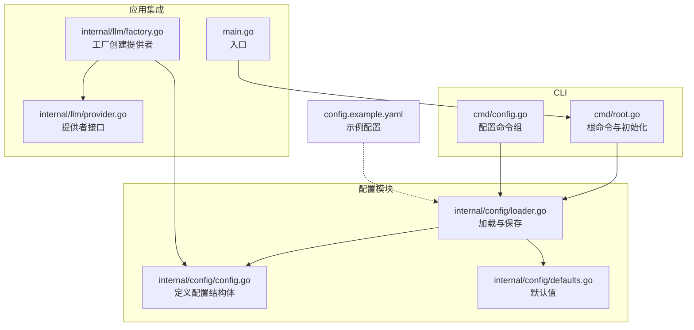
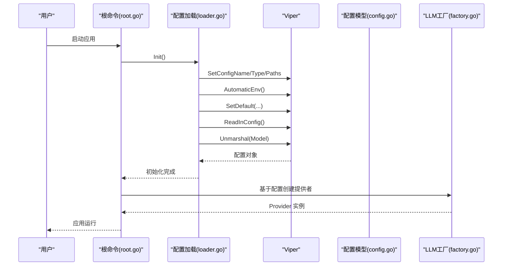
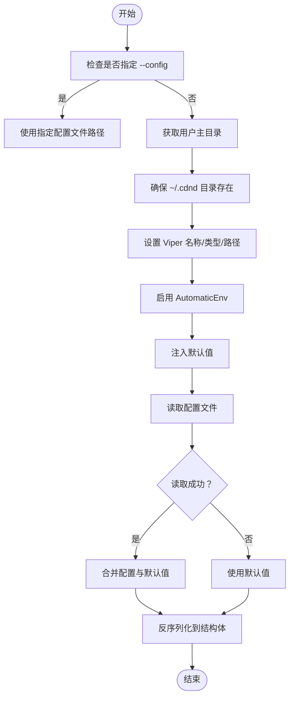
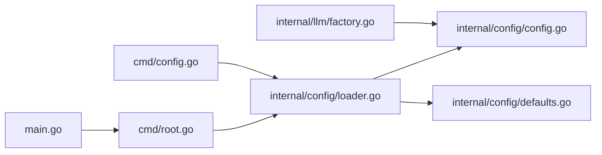

# 配置管理API

<cite>
**本文引用的文件**
- [config.go](file://internal/config/config.go)
- [loader.go](file://internal/config/loader.go)
- [defaults.go](file://internal/config/defaults.go)
- [config.example.yaml](file://config.example.yaml)
- [root.go](file://cmd/root.go)
- [config.go](file://cmd/config.go)
- [main.go](file://main.go)
- [factory.go](file://internal/llm/factory.go)
- [provider.go](file://internal/llm/provider.go)
</cite>

## 目录
1. [简介](#简介)
2. [项目结构](#项目结构)
3. [核心组件](#核心组件)
4. [架构总览](#架构总览)
5. [详细组件分析](#详细组件分析)
6. [依赖关系分析](#依赖关系分析)
7. [性能考量](#性能考量)
8. [故障排查指南](#故障排查指南)
9. [结论](#结论)
10. [附录](#附录)

## 简介
本文件为 CDND 配置管理系统的完整 API 文档，涵盖配置文件结构、字段定义、加载机制、环境变量绑定、配置合并策略、验证与错误处理、热重载与动态更新支持、优先级与覆盖规则、迁移与版本兼容性、模板与示例使用指南，以及安全性与敏感信息保护机制。读者无需深入技术背景即可理解并正确使用配置系统。

## 项目结构
配置管理位于 internal/config 目录，采用分层设计：
- 数据模型层：定义配置结构体与字段含义
- 加载器层：负责文件解析、默认值注入、环境变量覆盖、反序列化
- 默认值层：提供各字段的默认值
- CLI 层：提供配置初始化、查询、设置等命令
- LLM 工厂层：基于配置选择并创建 LLM 提供者实例

图表来源
- [config.go:1-54](file://internal/config/config.go#L1-L54)
- [loader.go:1-151](file://internal/config/loader.go#L1-L151)
- [defaults.go:1-52](file://internal/config/defaults.go#L1-L52)
- [root.go:1-95](file://cmd/root.go#L1-L95)
- [config.go:1-124](file://cmd/config.go#L1-L124)
- [main.go:1-8](file://main.go#L1-L8)
- [factory.go:1-69](file://internal/llm/factory.go#L1-L69)
- [provider.go:1-114](file://internal/llm/provider.go#L1-L114)
- [config.example.yaml:1-72](file://config.example.yaml#L1-L72)

章节来源
- [config.go:1-54](file://internal/config/config.go#L1-L54)
- [loader.go:1-151](file://internal/config/loader.go#L1-L151)
- [defaults.go:1-52](file://internal/config/defaults.go#L1-L52)
- [root.go:1-95](file://cmd/root.go#L1-L95)
- [config.go:1-124](file://cmd/config.go#L1-L124)
- [main.go:1-8](file://main.go#L1-L8)
- [factory.go:1-69](file://internal/llm/factory.go#L1-L69)
- [provider.go:1-114](file://internal/llm/provider.go#L1-L114)
- [config.example.yaml:1-72](file://config.example.yaml#L1-L72)

## 核心组件
- 配置结构体：包含 LLM、Game、Display、Advanced 四个主要部分
- 加载器：负责默认值注入、文件读取、环境变量覆盖、反序列化与保存
- 默认值：集中定义各字段默认值
- CLI 命令：提供初始化、查询、设置配置的能力
- LLM 工厂：依据配置选择并创建对应提供者实例

章节来源
- [config.go:8-53](file://internal/config/config.go#L8-L53)
- [loader.go:24-151](file://internal/config/loader.go#L24-L151)
- [defaults.go:7-51](file://internal/config/defaults.go#L7-L51)
- [config.go:12-124](file://cmd/config.go#L12-L124)
- [factory.go:9-69](file://internal/llm/factory.go#L9-L69)

## 架构总览
配置系统采用“Viper + 结构体映射”的架构：
- Viper 负责文件解析、环境变量绑定、默认值注入与写回
- mapstructure 标签将 YAML 键映射到结构体字段
- 应用启动前通过 PersistentPreRun 初始化配置
- CLI 命令通过 viper.Get/Set 与 WriteConfig 实现配置读写

图表来源
- [root.go:31-37](file://cmd/root.go#L31-L37)
- [loader.go:24-70](file://internal/config/loader.go#L24-L70)
- [config.go:8-53](file://internal/config/config.go#L8-L53)
- [factory.go:9-41](file://internal/llm/factory.go#L9-L41)

## 详细组件分析

### 配置数据模型
配置结构体定义了四个主要域及其字段与类型：
- LLM
  - default_provider: 字符串，用于选择默认提供者
  - providers: 映射，键为提供者名称，值为 ProviderConfig
- ProviderConfig
  - api_key: 字符串，API 密钥（可为空，优先使用环境变量）
  - model: 字符串，模型名称
  - base_url: 字符串，API 基础地址
  - max_tokens: 整数，最大生成 token 数
  - temperature: 浮点数，采样温度
- Game
  - autosave: 布尔，是否启用自动保存
  - autosave_interval: 持久化时长，如 5m、10m、1h
  - max_history_turns: 整数，内存中保留的历史回合数
  - language: 字符串，语言标识，如 zh-CN、en-US
- Display
  - typewriter_effect: 布尔，是否启用打字机效果
  - typing_speed: 持久化时长，如 30ms、50ms、100ms
  - color_output: 布尔，是否启用彩色输出
  - show_tokens: 布尔，是否显示 token 使用信息
- Advanced
  - cache_enabled: 布尔，是否启用缓存
  - cache_ttl: 持久化时长，如 1h、24h、7d
  - log_level: 字符串，日志级别，如 debug、info、warn、error
  - log_file: 字符串，日志文件路径（留空则仅输出到控制台）

字段默认值与有效范围：
- default_provider: 默认 openai；有效值为已注册的提供者名称
- providers.<name>.model: 默认随提供者而定；建议使用提供者官方推荐模型
- providers.<name>.base_url: 默认随提供者而定；本地 Ollama 默认 http://localhost:11434
- providers.<name>.max_tokens: 默认 4096；建议不超过提供者限制
- providers.<name>.temperature: 默认 0.7；范围 0.0~1.0
- game.autosave: 默认 true
- game.autosave_interval: 默认 5m；支持 1m、5m、10m、1h 等
- game.max_history_turns: 默认 100
- game.language: 默认 zh-CN
- display.typewriter_effect: 默认 true
- display.typing_speed: 默认 50ms
- display.color_output: 默认 true
- display.show_tokens: 默认 false
- advanced.cache_enabled: 默认 true
- advanced.cache_ttl: 默认 24h
- advanced.log_level: 默认 info
- advanced.log_file: 默认空字符串

章节来源
- [config.go:8-53](file://internal/config/config.go#L8-L53)
- [defaults.go:7-51](file://internal/config/defaults.go#L7-L51)
- [config.example.yaml:1-72](file://config.example.yaml#L1-L72)

### 配置加载机制
- 文件路径解析
  - 默认位置：$HOME/.cdnd/config.yaml
  - 支持通过 --config 指定自定义路径
  - 若未指定且未找到配置文件，将创建目录并生成默认配置文件
- 环境变量绑定
  - 启用 AutomaticEnv，自动读取匹配的环境变量
  - 环境变量命名规则：将点号替换为下划线，全部大写
  - 例如：llm.providers.openai.api_key 对应环境变量 OPENAI_API_KEY
- 配置合并策略
  - 默认值注入：先注入默认值，再读取配置文件，最后受环境变量覆盖
  - 反序列化：使用 mapstructure 将 YAML 映射到结构体
- 错误处理
  - 配置文件不存在时使用默认值
  - 其他读取错误直接返回
  - 反序列化失败返回错误

图表来源
- [loader.go:24-70](file://internal/config/loader.go#L24-L70)
- [root.go:69-94](file://cmd/root.go#L69-L94)

章节来源
- [loader.go:24-70](file://internal/config/loader.go#L24-L70)
- [root.go:69-94](file://cmd/root.go#L69-L94)

### 配置验证与错误处理
- 验证规则
  - 提供者名称必须存在于已注册列表
  - 默认提供者必须存在
  - 未找到配置文件时使用默认值
  - 反序列化失败返回错误
- 错误处理
  - 初始化失败时打印错误并退出
  - CLI 查询键不存在时打印错误并退出
  - 保存失败时打印错误并退出

章节来源
- [loader.go:57-67](file://internal/config/loader.go#L57-L67)
- [config.go:56-62](file://cmd/config.go#L56-L62)
- [factory.go:68-83](file://internal/llm/factory.go#L68-L83)

### 配置热重载与动态更新
- 现状
  - 当前实现不支持运行时热重载配置
  - CLI 提供 set 命令修改后立即保存到文件
- 建议方案
  - 增加配置变更监听：文件系统事件或定时轮询
  - 提供运行时刷新接口：重新加载并重建 LLM 提供者
  - 平滑切换：在新配置生效前保持旧配置可用

章节来源
- [config.go:66-84](file://cmd/config.go#L66-L84)
- [loader.go:108-116](file://internal/config/loader.go#L108-L116)

### 配置优先级与覆盖规则
- 优先级（从高到低）
  1) 环境变量（AutomaticEnv）
  2) 配置文件（YAML）
  3) 默认值（代码）
- 覆盖规则
  - 环境变量可覆盖配置文件
  - 配置文件可覆盖默认值
  - 未指定项使用默认值

章节来源
- [loader.go:50-56](file://internal/config/loader.go#L50-L56)
- [root.go:88-94](file://cmd/root.go#L88-L94)

### 配置迁移与版本兼容性
- 迁移策略
  - 新增字段：保持向后兼容，默认值填充
  - 删除字段：在加载时忽略，避免报错
  - 字段重命名：提供别名映射或迁移脚本
- 版本控制
  - 在配置文件中增加版本字段，便于识别与迁移
  - 提供迁移命令或工具，自动更新旧配置

章节来源
- [loader.go:57-67](file://internal/config/loader.go#L57-L67)

### 配置模板与示例使用指南
- 示例文件
  - config.example.yaml 提供完整字段示例与注释
  - 建议将示例复制到 ~/.cdnd/config.yaml 开始使用
- 使用步骤
  - 运行 cdnd config init 创建默认配置文件
  - 修改所需字段，保存后重启应用生效
  - 使用 cdnd config get/get <key> 查看当前配置
  - 使用 cdnd config set <key> <value> 动态设置并保存

章节来源
- [config.example.yaml:1-72](file://config.example.yaml#L1-L72)
- [config.go:21-84](file://cmd/config.go#L21-L84)

### 配置安全性与敏感信息保护
- 敏感信息
  - API 密钥建议通过环境变量设置，避免硬编码到配置文件
  - 环境变量命名遵循 AutomaticEnv 规则（大写+下划线）
- 安全建议
  - 配置文件权限设置为 600
  - 不将配置文件纳入版本控制
  - 定期轮换密钥并清理历史配置

章节来源
- [config.go:24-28](file://internal/config/config.go#L24-L28)
- [loader.go:50-51](file://internal/config/loader.go#L50-L51)

## 依赖关系分析
配置系统与应用其他模块的耦合关系如下：
- main.go 作为入口，调用 cmd.Execute()
- cmd/root.go 在 PersistentPreRun 中初始化配置
- internal/config/loader.go 负责配置加载与保存
- internal/llm/factory.go 基于配置创建 LLM 提供者
- cmd/config.go 提供 CLI 配置管理命令

图表来源
- [main.go:1-8](file://main.go#L1-L8)
- [root.go:31-37](file://cmd/root.go#L31-L37)
- [loader.go:24-70](file://internal/config/loader.go#L24-L70)
- [config.go:8-53](file://internal/config/config.go#L8-L53)
- [defaults.go:7-51](file://internal/config/defaults.go#L7-L51)
- [factory.go:9-41](file://internal/llm/factory.go#L9-L41)
- [config.go:12-84](file://cmd/config.go#L12-L84)

章节来源
- [main.go:1-8](file://main.go#L1-L8)
- [root.go:31-37](file://cmd/root.go#L31-L37)
- [loader.go:24-70](file://internal/config/loader.go#L24-L70)
- [config.go:8-53](file://internal/config/config.go#L8-L53)
- [defaults.go:7-51](file://internal/config/defaults.go#L7-L51)
- [factory.go:9-41](file://internal/llm/factory.go#L9-L41)
- [config.go:12-84](file://cmd/config.go#L12-L84)

## 性能考量
- 配置读取开销极小，通常在毫秒级
- 建议在应用启动阶段一次性加载，避免频繁 IO
- 大量环境变量可能影响启动时间，建议按需开启 AutomaticEnv

## 故障排查指南
- 配置文件未找到
  - 确认 ~/.cdnd/config.yaml 是否存在
  - 使用 cdnd config init 生成默认配置
- 配置解析失败
  - 检查 YAML 语法与缩进
  - 使用 cdnd config get 查看当前配置
- 环境变量未生效
  - 确认环境变量命名符合规则（大写+下划线）
  - 检查是否被配置文件覆盖
- LLM 提供者不可用
  - 确认 default_provider 是否为已注册名称
  - 检查对应提供者的 api_key、base_url、model 等配置

章节来源
- [config.go:28-35](file://cmd/config.go#L28-L35)
- [loader.go:57-67](file://internal/config/loader.go#L57-L67)
- [factory.go:68-83](file://internal/llm/factory.go#L68-L83)

## 结论
CDND 配置管理系统通过清晰的结构体定义、完善的默认值注入、灵活的环境变量绑定与可靠的文件读写机制，提供了稳定易用的配置能力。建议在生产环境中优先使用环境变量管理敏感信息，并结合 CLI 命令进行日常维护。未来可扩展热重载与动态更新能力，进一步提升运维效率。

## 附录

### 配置字段参考表
- LLM
  - default_provider: 字符串，默认 openai
  - providers.<name>.api_key: 字符串，API 密钥
  - providers.<name>.model: 字符串，默认随提供者
  - providers.<name>.base_url: 字符串，默认随提供者
  - providers.<name>.max_tokens: 整数，默认 4096
  - providers.<name>.temperature: 浮点数，默认 0.7（范围 0.0~1.0）
- Game
  - autosave: 布尔，默认 true
  - autosave_interval: 持久化时长，默认 5m
  - max_history_turns: 整数，默认 100
  - language: 字符串，默认 zh-CN
- Display
  - typewriter_effect: 布尔，默认 true
  - typing_speed: 持久化时长，默认 50ms
  - color_output: 布尔，默认 true
  - show_tokens: 布尔，默认 false
- Advanced
  - cache_enabled: 布尔，默认 true
  - cache_ttl: 持久化时长，默认 24h
  - log_level: 字符串，默认 info
  - log_file: 字符串，默认空

章节来源
- [config.go:8-53](file://internal/config/config.go#L8-L53)
- [defaults.go:7-51](file://internal/config/defaults.go#L7-L51)
- [config.example.yaml:1-72](file://config.example.yaml#L1-L72)