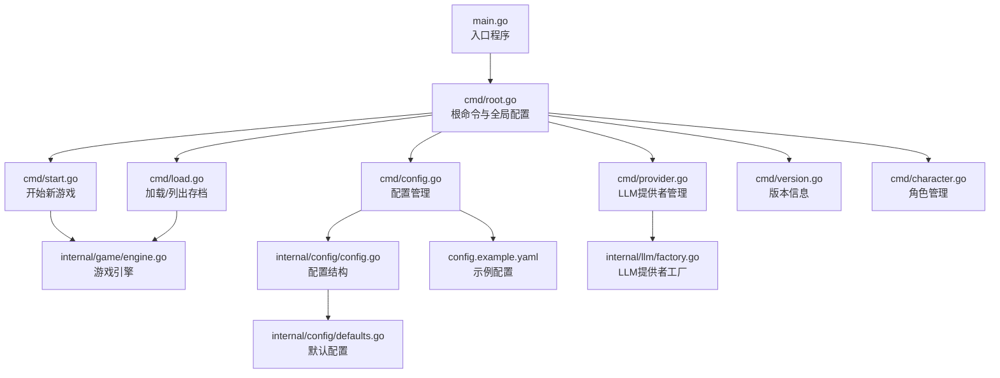
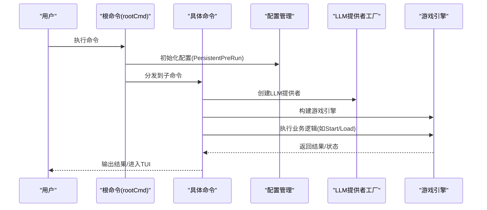
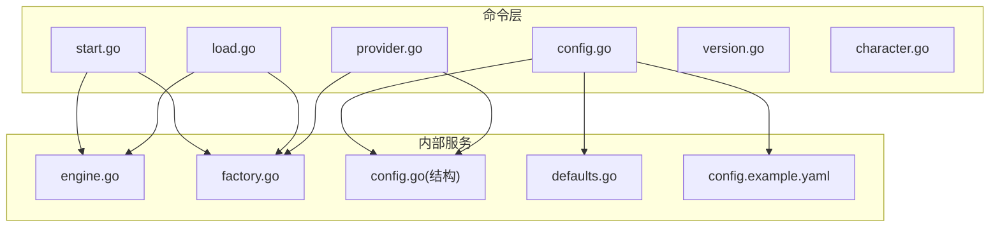

# CLI命令参考

<cite>
**本文引用的文件**
- [main.go](file://main.go)
- [root.go](file://cmd/root.go)
- [start.go](file://cmd/start.go)
- [load.go](file://cmd/load.go)
- [config.go](file://cmd/config.go)
- [provider.go](file://cmd/provider.go)
- [version.go](file://cmd/version.go)
- [character.go](file://cmd/character.go)
- [engine.go](file://internal/game/engine.go)
- [factory.go](file://internal/llm/factory.go)
- [config.go](file://internal/config/config.go)
- [defaults.go](file://internal/config/defaults.go)
- [types.go](file://internal/save/types.go)
- [manager.go](file://internal/save/manager.go)
- [config.example.yaml](file://config.example.yaml)
</cite>

## 更新摘要
**变更内容**
- 新增start和load命令的--no-autosave标志说明
- 添加自动保存资源清理机制的详细说明
- 更新配置文件中自动保存相关设置
- 增强自动保存功能的使用场景和最佳实践

## 目录
1. [简介](#简介)
2. [项目结构](#项目结构)
3. [核心组件](#核心组件)
4. [架构总览](#架构总览)
5. [详细组件分析](#详细组件分析)
6. [依赖关系分析](#依赖关系分析)
7. [性能考量](#性能考量)
8. [故障排除指南](#故障排除指南)
9. [结论](#结论)
10. [附录](#附录)

## 简介
本参考文档面向CDND的CLI命令系统，覆盖所有可用命令及其参数选项，包括start、load、config、provider、version、character等核心命令。文档旨在帮助初学者快速上手，同时为有经验用户提供权威参考，涵盖命令功能、使用场景、参数说明、示例、错误处理、输出格式、最佳实践与性能建议。

## 项目结构
CDND采用基于Cobra的CLI框架组织命令，入口程序通过main.go调用cmd.Execute()启动命令树；各命令位于cmd目录下，分别实现具体功能；内部逻辑集中在internal目录，如游戏引擎、LLM提供者工厂、配置管理等。

**图表来源**
- [main.go:1-8](file://main.go#L1-L8)
- [root.go:1-95](file://cmd/root.go#L1-L95)
- [start.go:1-114](file://cmd/start.go#L1-L114)
- [load.go:1-130](file://cmd/load.go#L1-L130)
- [config.go:1-124](file://cmd/config.go#L1-L124)
- [provider.go:1-128](file://cmd/provider.go#L1-L128)
- [version.go:1-27](file://cmd/version.go#L1-L27)
- [character.go:1-99](file://cmd/character.go#L1-L99)
- [engine.go:1-789](file://internal/game/engine.go#L1-L789)
- [factory.go:1-69](file://internal/llm/factory.go#L1-L69)
- [config.go:1-54](file://internal/config/config.go#L1-L54)
- [defaults.go:1-52](file://internal/config/defaults.go#L1-L52)
- [config.example.yaml:1-72](file://config.example.yaml#L1-L72)

**章节来源**
- [main.go:1-8](file://main.go#L1-L8)
- [root.go:1-95](file://cmd/root.go#L1-L95)

## 核心组件
- 根命令与全局配置：负责初始化配置、注册全局标志（如--config、--debug），以及设置帮助行为。
- 子命令：start、load、config、provider、version、character，分别对应游戏生命周期、存档管理、配置管理、LLM提供者管理、版本信息、角色管理。
- 内部引擎与工厂：
  - 游戏引擎：封装LLM调用、工具注册与执行、存档/读档、事件分发等。
  - LLM提供者工厂：根据配置动态创建OpenAI、Anthropic、Ollama等提供者实例。
  - 配置管理：提供默认配置、读取/写入配置文件、打印配置等。

**章节来源**
- [root.go:1-95](file://cmd/root.go#L1-L95)
- [engine.go:1-789](file://internal/game/engine.go#L1-L789)
- [factory.go:1-69](file://internal/llm/factory.go#L1-L69)
- [config.go:1-54](file://internal/config/config.go#L1-L54)
- [defaults.go:1-52](file://internal/config/defaults.go#L1-L52)

## 架构总览
CDND CLI命令系统以Cobra为核心，命令间通过共享配置与内部服务协作。命令执行流程通常包括：解析命令与参数、初始化配置、创建LLM提供者、构建游戏引擎、执行业务逻辑、输出结果或进入TUI界面。

**图表来源**
- [root.go:31-37](file://cmd/root.go#L31-L37)
- [start.go:29-89](file://cmd/start.go#L29-L89)
- [load.go:26-68](file://cmd/load.go#L26-L68)
- [factory.go:9-41](file://internal/llm/factory.go#L9-L41)
- [engine.go:35-56](file://internal/game/engine.go#L35-L56)

## 详细组件分析

### start 命令
- 功能：开始一场新的D&D冒险，支持跳过角色创建（测试用途）、指定存档槽位与剧本。
- 使用场景：首次开始游戏、测试角色创建流程、从特定剧本开始。
- 必需参数：无。
- 可选参数：
  - --save-slot/-s：整数，默认1，范围1-10。
  - --scenario/-S：字符串，默认"default"，指定剧本标识。
  - --skip-creation：布尔，跳过角色创建（测试）。
  - **--no-autosave：布尔，禁用自动保存功能**。
- 输出与返回值：成功时进入角色创建TUI，完成后进入游戏TUI；失败时输出错误信息并退出非零码。
- 错误处理：LLM提供者创建失败、引擎创建失败、角色创建取消、游戏启动失败、存档保存失败均会输出错误并退出。
- 示例：
  - 开始新游戏：cdnd start
  - 指定存档槽位：cdnd start -s 3
  - 指定剧本：cdnd start -S custom_scenario
  - 跳过创建：cdnd start --skip-creation
  - **禁用自动保存：cdnd start --no-autosave**
- 最佳实践：
  - 首次使用建议先配置默认LLM提供者与API密钥。
  - 使用--skip-creation进行自动化测试或快速验证。
  - 合理设置--save-slot避免覆盖重要进度。
  - **在长时间离线或不稳定网络环境中使用--no-autosave以避免自动保存失败。**
- 性能考虑：角色创建与游戏启动涉及TUI渲染与LLM调用，建议在稳定网络环境下使用；本地Ollama可降低延迟。

**更新** 新增--no-autosave标志，允许用户在命令行层面禁用自动保存功能。

**章节来源**
- [start.go:15-114](file://cmd/start.go#L15-L114)

### load 命令
- 功能：从指定存档槽位加载已保存的游戏，并进入游戏TUI。
- 使用场景：继续之前的D&D冒险。
- 必需参数：无。
- 可选参数：
  - --slot/-s：整数，默认1，指定要加载的存档槽位。
  - **--no-autosave：布尔，禁用自动保存功能**。
- 输出与返回值：加载成功后显示角色信息，进入游戏TUI；失败时输出错误并退出。
- 错误处理：LLM提供者创建失败、引擎创建失败、存档加载失败、TUI运行错误、存档保存失败均会输出错误并退出。
- 示例：
  - 加载默认槽位：cdnd load
  - 指定槽位：cdnd load -s 5
  - **禁用自动保存：cdnd load --no-autosave**
- 最佳实践：
  - 使用saves命令查看可用存档槽位后再加载。
  - 加载后及时保存，避免意外退出导致进度丢失。
  - **在需要完全控制存档时机时使用--no-autosave，仅在退出时手动保存。**
- 性能考虑：加载过程涉及序列化数据读取与状态重建，建议保持磁盘I/O稳定。

**更新** 新增--no-autosave标志，允许用户在命令行层面禁用自动保存功能。

**章节来源**
- [load.go:15-130](file://cmd/load.go#L15-L130)

### saves 命令
- 功能：列出所有存档槽位的简要信息，包括角色名、等级、职业、阶段、位置、游玩时间、最后更新时间等。
- 使用场景：查看可用存档、确认存档状态。
- 必需参数：无。
- 可选参数：无。
- 输出与返回值：打印存档列表，空槽位显示占位信息。
- 错误处理：引擎初始化失败或列出存档失败时输出错误并退出。
- 示例：cdnd load saves
- 最佳实践：结合--slot参数使用，明确目标槽位。

**章节来源**
- [load.go:82-121](file://cmd/load.go#L82-L121)

### config 命令组
- 功能：管理配置文件，支持初始化、查看、设置配置项。
- 子命令：
  - init：创建默认配置文件（~/.cdnd/config.yaml）。
  - get [key]：获取配置值；省略key时打印全部配置。
  - set <key> <value>：设置配置值并保存。
- 使用场景：首次安装、调整LLM参数、切换显示与日志设置。
- 参数：
  - get：可选键名。
  - set：必须提供键与值。
- 输出与返回值：
  - init：提示配置文件创建路径。
  - get：打印键值或全部配置。
  - set：提示设置成功。
- 错误处理：配置文件初始化失败、键不存在、保存失败时输出错误并退出。
- 示例：
  - 初始化配置：cdnd config init
  - 查看全部配置：cdnd config get
  - 查看特定键：cdnd config get llm.default_provider
  - 设置键值：cdnd config set llm.default_provider openai
- 最佳实践：
  - 使用config.example.yaml作为参考，按需修改。
  - 修改后可通过config get验证生效。
- 性能考虑：配置读取为轻量操作，无需额外性能优化。

**章节来源**
- [config.go:12-124](file://cmd/config.go#L12-L124)

### provider 命令组
- 功能：管理LLM提供者，支持列出、测试连接、设置默认提供者。
- 子命令：
  - list：列出所有可用提供者及默认标记、模型、基础URL、API密钥状态。
  - test <provider>：测试指定提供者连接，发送测试消息并输出响应。
  - set-default <provider>：设置默认LLM提供者。
- 使用场景：检查可用提供者、验证API密钥与网络连通性、切换默认提供者。
- 参数：
  - test：必须提供提供者名称（openai、anthropic、ollama之一）。
  - set-default：必须提供提供者名称。
- 输出与返回值：
  - list：打印提供者列表与关键配置。
  - test：打印测试消息与响应内容。
  - set-default：提示默认提供者已设置。
- 错误处理：未知提供者、创建提供者失败、测试请求失败、保存配置失败时输出错误并退出。
- 示例：
  - 列出提供者：cdnd provider list
  - 测试OpenAI：cdnd provider test openai
  - 设置默认：cdnd provider set-default anthropic
- 最佳实践：
  - 测试前确保API密钥与网络正常。
  - 本地Ollama无需API密钥，但需确保服务运行。
- 性能考虑：测试连接涉及一次LLM请求，建议在网络稳定时进行。

**章节来源**
- [provider.go:13-128](file://cmd/provider.go#L13-L128)

### version 命令
- 功能：显示版本信息，包括版本号、Git提交、构建日期、Go版本、系统/架构。
- 使用场景：诊断问题、报告缺陷时提供环境信息。
- 参数：无。
- 输出与返回值：打印版本与构建信息。
- 错误处理：无。
- 示例：cdnd version
- 最佳实践：在提交问题时附带版本信息。

**章节来源**
- [version.go:10-27](file://cmd/version.go#L10-L27)

### character 命令组
- 功能：管理D&D角色，支持创建、列出、删除、查看角色详情（部分功能待实现）。
- 子命令：
  - create：交互式创建新角色，进入TUI引导选择种族、职业、能力等。
  - list：列出已保存的角色（当前提示未实现）。
  - delete <name>：删除指定角色（当前提示未实现）。
  - show [name]：显示角色详情（当前提示未实现）。
- 使用场景：创建自定义角色模板、管理角色集合。
- 参数：
  - delete/show：必须提供角色名。
- 输出与返回值：create成功后打印角色基本信息；其他命令当前为占位提示。
- 错误处理：TUI运行错误时输出错误并退出。
- 示例：
  - 创建角色：cdnd character create
  - 删除角色：cdnd character delete 阿拉贡
- 最佳实践：创建角色后可结合start命令直接开始游戏。
- 性能考虑：TUI交互为本地操作，性能主要取决于终端渲染。

**章节来源**
- [character.go:12-99](file://cmd/character.go#L12-L99)

## 依赖关系分析
- 命令到内部模块的依赖：
  - start/load：依赖游戏引擎（internal/game/engine.go）与LLM提供者工厂（internal/llm/factory.go）。
  - config：依赖配置结构（internal/config/config.go）与默认配置（internal/config/defaults.go）。
  - provider：依赖配置与LLM提供者工厂。
  - character：依赖UI层（当前为占位）。
- 配置来源：
  - 默认配置来自internal/config/defaults.go。
  - 用户配置来自~/.cdnd/config.yaml，示例见config.example.yaml。
- 全局配置初始化：
  - 根命令在PersistentPreRun中调用config.Init()，确保配置可用。

**图表来源**
- [start.go:29-89](file://cmd/start.go#L29-L89)
- [load.go:26-68](file://cmd/load.go#L26-L68)
- [config.go:28-83](file://cmd/config.go#L28-L83)
- [provider.go:58-119](file://cmd/provider.go#L58-L119)
- [engine.go:35-56](file://internal/game/engine.go#L35-L56)
- [factory.go:9-41](file://internal/llm/factory.go#L9-L41)
- [config.go:8-54](file://internal/config/config.go#L8-L54)
- [defaults.go:7-52](file://internal/config/defaults.go#L7-L52)
- [config.example.yaml:1-72](file://config.example.yaml#L1-L72)

**章节来源**
- [root.go:31-37](file://cmd/root.go#L31-L37)
- [engine.go:35-56](file://internal/game/engine.go#L35-L56)
- [factory.go:9-41](file://internal/llm/factory.go#L9-L41)
- [config.go:8-54](file://internal/config/config.go#L8-L54)
- [defaults.go:7-52](file://internal/config/defaults.go#L7-L52)
- [config.example.yaml:1-72](file://config.example.yaml#L1-L72)

## 性能考量
- LLM调用开销：provider test与start/load均会发起LLM请求，网络延迟与模型响应时间为主要瓶颈。建议：
  - 优先使用本地Ollama（若硬件允许）以减少网络往返。
  - 合理设置temperature与max_tokens，平衡生成质量与响应时间。
- 存档读写：load/saves涉及序列化/反序列化与磁盘I/O，建议：
  - 使用SSD存储以提升读写速度。
  - 避免频繁小文件写入，合理利用自动保存策略。
- TUI渲染：start与load进入TUI界面，性能受终端渲染影响，建议：
  - 使用支持硬件加速的终端。
  - 关闭不必要的特效（如打字机效果）以降低CPU占用。
- 缓存与日志：配置中的缓存与日志级别会影响运行时性能，建议：
  - 生产环境开启缓存与合适日志级别。
  - 调试时提高日志级别，结束后恢复默认。
- **自动保存性能影响**：自动保存功能通过定时器实现，建议：
  - **在长时间离线或不稳定网络环境中使用--no-autosave避免自动保存失败。**
  - **合理设置AutosaveInterval配置项以平衡保存频率与性能开销。**

## 故障排除指南
- 配置相关
  - 问题：找不到配置文件或读取失败
    - 排查：确认~/.cdnd/config.yaml存在且格式正确；使用cdnd config init重新生成；使用cdnd config get验证键值。
  - 问题：默认提供者未配置或未知
    - 排查：使用cdnd provider list查看可用提供者；使用cdnd provider set-default设置默认提供者。
- LLM提供者相关
  - 问题：provider test失败
    - 排查：检查API密钥、网络连通性、模型名称与基础URL；尝试更换默认提供者。
  - 问题：start或load报LLM提供者创建失败
    - 排查：确认配置中默认提供者存在且参数正确；检查环境变量OPENAI_API_KEY等是否设置。
- 存档相关
  - 问题：load失败或角色数据缺失
    - 排查：确认槽位有效；检查存档完整性；必要时重新开始新游戏。
  - 问题：保存失败或覆盖存档
    - 排查：检查磁盘空间与权限；避免并发写入；使用不同槽位进行备份。
  - **问题：自动保存失败或异常**
    - **排查：使用--no-autosave禁用自动保存功能；检查AutosaveInterval配置；确认磁盘空间充足；查看日志文件。**
- TUI相关
  - 问题：TUI崩溃或无法退出
    - 排查：使用终端快捷键退出；重启终端；检查终端兼容性与字体渲染。
- 版本与环境
  - 问题：版本信息不一致或构建信息缺失
    - 排查：使用cdnd version查看构建信息；确认编译时ldflags传入版本参数。

**章节来源**
- [config.go:28-83](file://cmd/config.go#L28-L83)
- [provider.go:58-119](file://cmd/provider.go#L58-L119)
- [load.go:43-68](file://cmd/load.go#L43-L68)
- [engine.go:101-150](file://internal/game/engine.go#L101-L150)
- [version.go:15-21](file://cmd/version.go#L15-L21)

## 结论
CDND的CLI命令系统围绕"配置—提供者—引擎—TUI"的架构设计，提供了从角色创建、游戏启动、存档管理到LLM提供者配置与版本查询的完整工作流。通过本文档的参数说明、使用示例、错误处理与性能建议，用户可在不同阶段高效完成操作，并在遇到问题时快速定位与解决。新增的--no-autosave标志为用户提供了更灵活的存档控制方式，而自动保存资源清理机制确保了系统的稳定性和资源的有效管理。

## 附录
- 全局标志
  - --config：指定配置文件路径（默认$HOME/.cdnd/config.yaml）
  - --debug：启用调试模式
- 配置文件位置与示例
  - 默认位置：~/.cdnd/config.yaml
  - 示例文件：config.example.yaml
- 默认配置要点
  - 默认提供者：openai
  - 游戏设置：自动保存、历史回合数、语言
  - 显示设置：打字机效果、打字速度、彩色输出
  - 高级设置：缓存开关与TTL、日志级别
- **自动保存配置**
  - **Autosave：布尔值，默认true，控制是否启用自动保存**
  - **AutosaveInterval：持续时间，默认5分钟，控制自动保存间隔**
  - **AutosaveSlot：整数值，默认0，表示自动保存专用槽位**
- **命令行标志**
  - **--no-autosave：布尔值，默认false，禁用自动保存功能**
  - **作用于start和load命令，允许用户在命令行层面控制自动保存行为**

**章节来源**
- [root.go:64-67](file://cmd/root.go#L64-L67)
- [defaults.go:7-52](file://internal/config/defaults.go#L7-L52)
- [config.example.yaml:1-72](file://config.example.yaml#L1-L72)
- [config.go:32-37](file://internal/config/config.go#L32-L37)
- [types.go:14-15](file://internal/save/types.go#L14-L15)
- [start.go:112](file://cmd/start.go#L112)
- [load.go:128](file://cmd/load.go#L128)