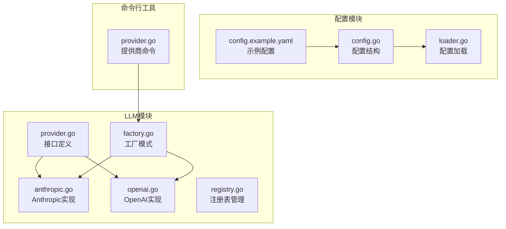
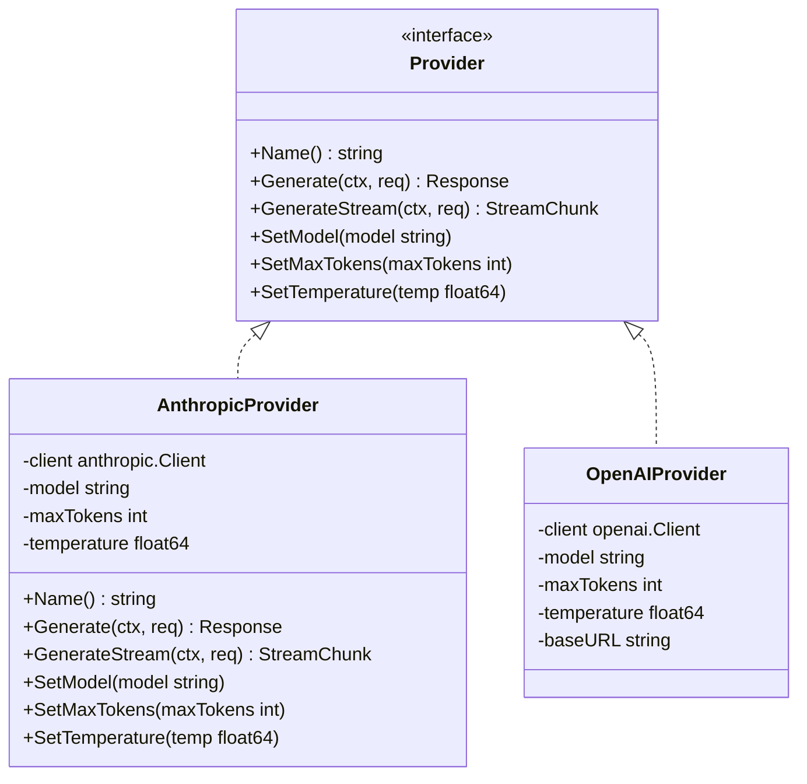
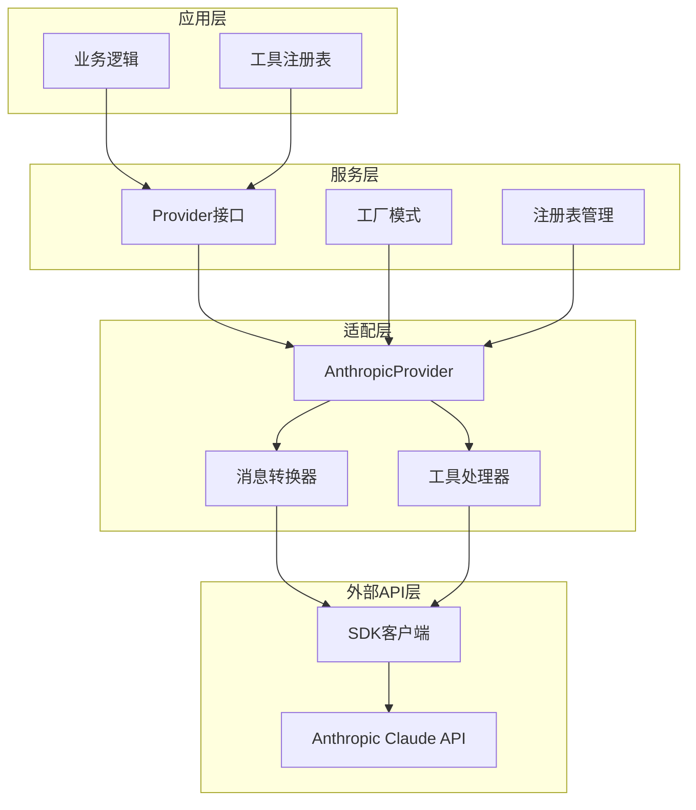
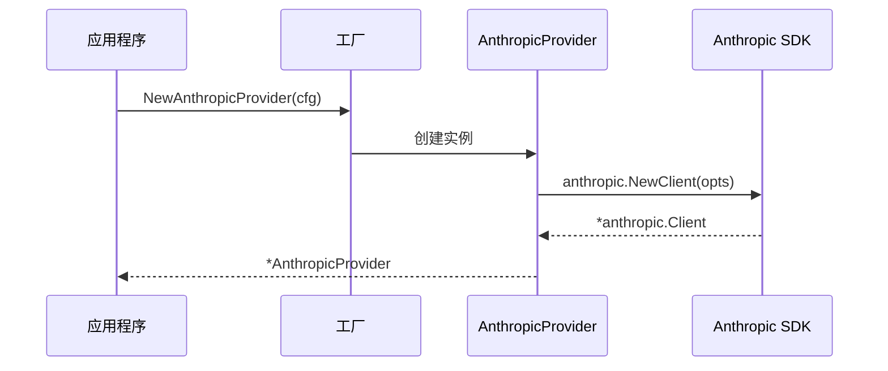
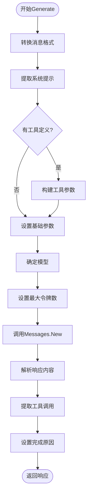
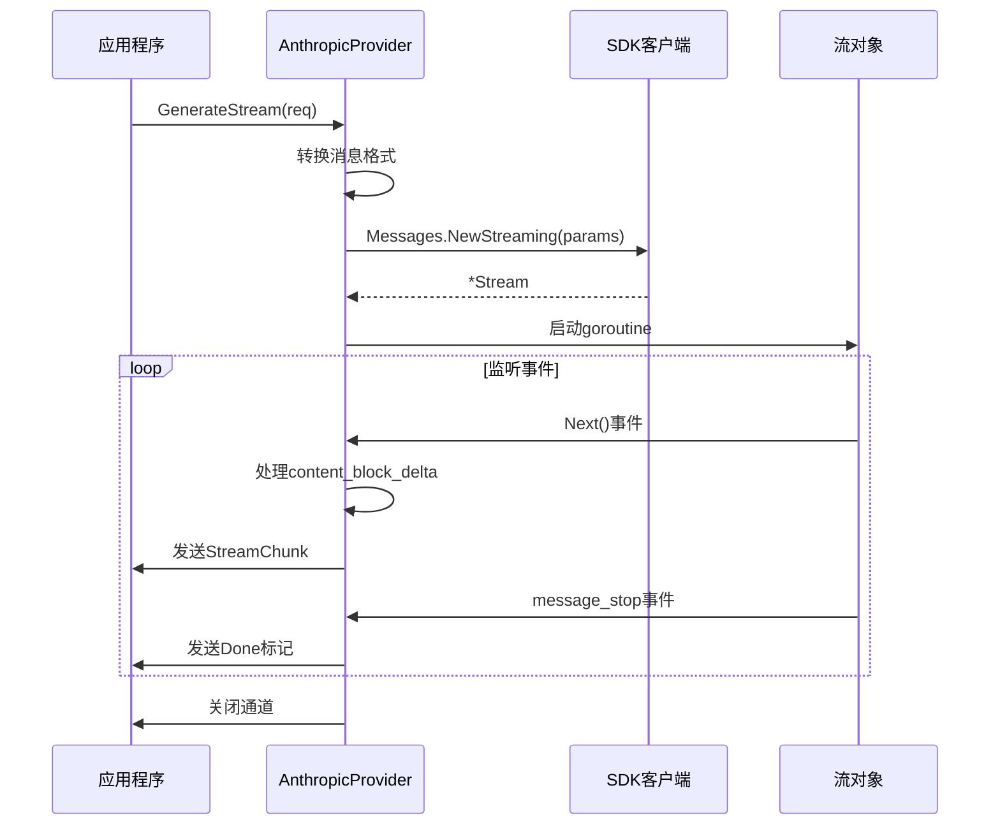
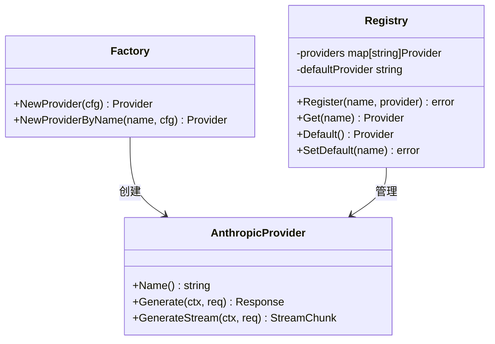
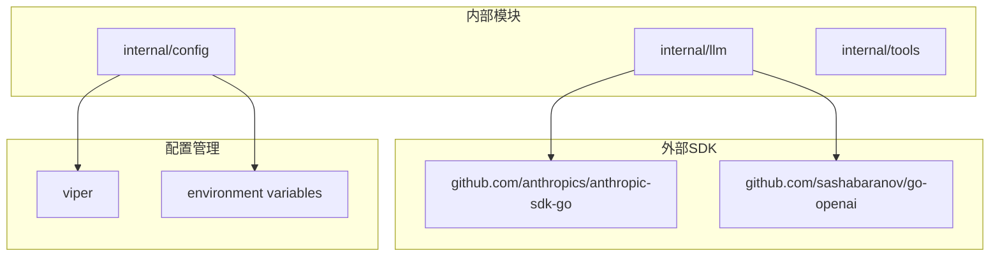
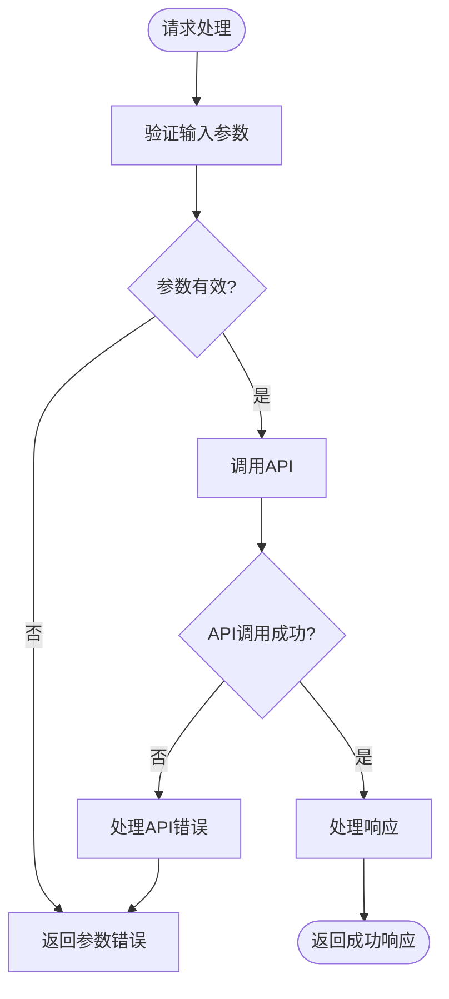

# Anthropic提供商

<cite>
**本文档引用的文件**
- [anthropic.go](file://internal/llm/anthropic.go)
- [provider.go](file://internal/llm/provider.go)
- [factory.go](file://internal/llm/factory.go)
- [openai.go](file://internal/llm/openai.go)
- [registry.go](file://internal/llm/registry.go)
- [config.go](file://internal/config/config.go)
- [loader.go](file://internal/config/loader.go)
- [config.example.yaml](file://config.example.yaml)
- [provider.go](file://cmd/provider.go)
</cite>

## 目录
1. [简介](#简介)
2. [项目结构](#项目结构)
3. [核心组件](#核心组件)
4. [架构概览](#架构概览)
5. [详细组件分析](#详细组件分析)
6. [依赖关系分析](#依赖关系分析)
7. [性能考量](#性能考量)
8. [故障排除指南](#故障排除指南)
9. [结论](#结论)
10. [附录](#附录)

## 简介

CDND项目中的Anthropic提供商实现了对Anthropic Claude API的完整集成，提供了与OpenAI兼容的统一接口。该实现遵循了项目的设计模式，通过Provider接口抽象，支持标准的消息格式转换、工具调用处理和流式响应处理。

Anthropic提供商的核心特性包括：
- 完整的消息格式转换（用户、助手、系统、工具消息）
- 工具调用的双向支持（定义和执行）
- 流式和非流式两种响应模式
- 配置驱动的API密钥认证
- 与OpenAI实现的高度一致性

## 项目结构

CDND项目采用模块化的架构设计，LLM提供商相关代码主要位于`internal/llm`目录下：



**图表来源**
- [anthropic.go:1-269](file://internal/llm/anthropic.go#L1-L269)
- [provider.go:1-114](file://internal/llm/provider.go#L1-L114)
- [factory.go:1-69](file://internal/llm/factory.go#L1-L69)

**章节来源**
- [anthropic.go:1-269](file://internal/llm/anthropic.go#L1-L269)
- [provider.go:1-114](file://internal/llm/provider.go#L1-L114)
- [factory.go:1-69](file://internal/llm/factory.go#L1-L69)

## 核心组件

### Provider接口抽象

Provider接口定义了LLM提供商的标准行为规范，确保不同提供商之间的兼容性：



**图表来源**
- [provider.go:64-83](file://internal/llm/provider.go#L64-L83)
- [anthropic.go:11-17](file://internal/llm/anthropic.go#L11-L17)
- [openai.go:11-18](file://internal/llm/openai.go#L11-L18)

### 数据结构设计

项目使用统一的数据结构来表示消息、请求和响应，确保跨提供商的一致性：

**消息角色定义**：
- system：系统提示消息
- user：用户输入消息  
- assistant：AI助手回复
- tool：工具执行结果

**工具调用结构**：
- ToolDefinition：工具定义
- ToolFunctionDefinition：函数定义
- ToolCall：工具调用请求

**章节来源**
- [provider.go:8-113](file://internal/llm/provider.go#L8-L113)

## 架构概览

Anthropic提供商的架构采用了分层设计，从上到下分别为应用层、服务层、适配层和外部API层：



**图表来源**
- [anthropic.go:19-34](file://internal/llm/anthropic.go#L19-L34)
- [factory.go:9-41](file://internal/llm/factory.go#L9-L41)
- [registry.go:8-139](file://internal/llm/registry.go#L8-L139)

## 详细组件分析

### AnthropicProvider实现

AnthropicProvider是Anthropic Claude API的主要适配器，负责将统一的请求格式转换为Anthropic SDK期望的格式。

#### 客户端初始化



**图表来源**
- [anthropic.go:19-34](file://internal/llm/anthropic.go#L19-L34)
- [factory.go:30-40](file://internal/llm/factory.go#L30-L40)

#### Generate方法实现

Generate方法处理非流式的完整响应生成：



**图表来源**
- [anthropic.go:41-139](file://internal/llm/anthropic.go#L41-L139)

#### GenerateStream方法实现

GenerateStream方法处理流式响应的实时生成：



**图表来源**
- [anthropic.go:141-227](file://internal/llm/anthropic.go#L141-L227)

#### 消息格式转换

AnthropicProvider实现了三种关键的消息转换方法：

**用户消息转换**：
- 输入：标准Message结构
- 输出：anthropic.NewUserMessage
- 特点：简单的文本块包装

**助手消息转换**：
- 输入：包含内容和工具调用的Message
- 输出：anthropic.NewAssistantMessage
- 特点：支持文本块和工具使用块的混合

**工具结果消息转换**：
- 输入：包含工具调用ID和结果的Message
- 输出：anthropic.NewUserMessage
- 特点：使用ToolResultBlock进行结果包装

**章节来源**
- [anthropic.go:244-268](file://internal/llm/anthropic.go#L244-L268)

### 与OpenAI实现的差异

尽管两个提供商都实现了相同的Provider接口，但在内部实现上存在显著差异：

| 特性 | Anthropic实现 | OpenAI实现 |
|------|---------------|------------|
| SDK库 | anthropic-sdk-go | github.com/sashabaranov/go-openai |
| API调用方式 | Messages.New/Messages.NewStreaming | CreateChatCompletion/CreateChatCompletionStream |
| 工具调用处理 | ToolUseBlock/ToolResultBlock | ToolCalls数组 |
| 流式事件类型 | content_block_delta/message_stop | choices/delta |
| 系统提示位置 | params.System字段 | messages数组中的system角色 |
| 温度参数类型 | float64 | float32 |

**章节来源**
- [openai.go:1-257](file://internal/llm/openai.go#L1-L257)
- [anthropic.go:1-269](file://internal/llm/anthropic.go#L1-L269)

### 工厂模式和注册表

项目使用工厂模式和注册表来管理不同的LLM提供商：



**图表来源**
- [factory.go:9-68](file://internal/llm/factory.go#L9-L68)
- [registry.go:8-139](file://internal/llm/registry.go#L8-L139)

**章节来源**
- [factory.go:1-69](file://internal/llm/factory.go#L1-L69)
- [registry.go:1-140](file://internal/llm/registry.go#L1-L140)

## 依赖关系分析

### 外部依赖

项目对外部依赖的管理体现了清晰的架构分离：



**图表来源**
- [anthropic.go:3-8](file://internal/llm/anthropic.go#L3-L8)
- [openai.go:3-8](file://internal/llm/openai.go#L3-L8)
- [loader.go:3-8](file://internal/config/loader.go#L3-L8)

### 内部耦合度

项目在内部模块间保持了较低的耦合度：

- LLM模块独立于其他业务模块
- 配置模块提供统一的配置访问接口
- 工厂模式解耦了具体的提供商实现
- 注册表模式支持动态提供商管理

**章节来源**
- [anthropic.go:1-269](file://internal/llm/anthropic.go#L1-L269)
- [config.go:1-54](file://internal/config/config.go#L1-L54)

## 性能考量

### 流式处理优化

Anthropic提供商在流式处理方面采用了多项优化措施：

- **缓冲区大小**：流式通道容量设置为100，平衡内存使用和吞吐量
- **异步处理**：使用goroutine处理流事件，避免阻塞主流程
- **错误处理**：及时传播SDK错误，防止资源泄漏
- **内存管理**：合理使用defer语句确保通道正确关闭

### 并发安全

注册表和工厂模式都实现了线程安全：

- 使用互斥锁保护共享状态
- 支持并发的提供商注册和获取
- 避免竞态条件和数据竞争

### 资源管理

- **连接复用**：SDK客户端实例在整个生命周期内复用
- **上下文取消**：支持优雅的请求取消和超时处理
- **错误恢复**：适当的错误处理和重试机制

## 故障排除指南

### 常见问题诊断

**API密钥问题**：
- 检查配置文件中的API密钥设置
- 验证环境变量是否正确配置
- 确认API密钥具有足够的权限

**模型选择问题**：
- 验证模型名称是否正确
- 检查模型是否在账户中可用
- 确认模型版本的兼容性

**工具调用失败**：
- 检查工具定义的JSON Schema
- 验证工具参数的类型匹配
- 确认工具名称的一致性

### 错误处理策略

Anthropic提供商实现了完善的错误处理机制：



**图表来源**
- [anthropic.go:101-104](file://internal/llm/anthropic.go#L101-L104)

**章节来源**
- [anthropic.go:204-224](file://internal/llm/anthropic.go#L204-L224)

## 结论

CDND项目中的Anthropic提供商实现展现了优秀的软件工程实践：

1. **架构设计**：通过Provider接口抽象实现了高度的可扩展性和可维护性
2. **实现质量**：代码结构清晰，注释完整，遵循了Go语言的最佳实践
3. **功能完整性**：支持消息转换、工具调用、流式处理等核心功能
4. **兼容性**：与OpenAI实现保持高度一致，便于迁移和比较
5. **配置管理**：提供了灵活的配置选项和环境变量支持

该实现为CDND项目提供了可靠的Anthropic Claude API集成，为后续的功能扩展和性能优化奠定了坚实的基础。

## 附录

### 配置示例

以下是最小化的Anthropic提供商配置示例：

```yaml
llm:
  default_provider: anthropic
  providers:
    anthropic:
      api_key: "sk-ant-api-key"
      model: "claude-3-opus-20240229"
      max_tokens: 4096
      temperature: 0.7
```

### 使用场景

**适合使用Anthropic提供商的场景**：
- 需要更强的推理能力的任务
- 对内容质量和安全性要求较高的应用
- 需要复杂工具调用的工作流
- 需要流式响应的实时交互

**与其他提供商的对比**：
- **OpenAI**：更适合通用对话和快速响应
- **Anthropic**：更适合复杂推理和工具调用
- **Ollama**：适合本地部署和隐私保护

### 最佳实践

1. **配置管理**：使用环境变量管理敏感信息
2. **错误处理**：实现适当的重试和降级策略
3. **监控指标**：收集使用统计和性能指标
4. **安全考虑**：限制API密钥权限和使用范围
5. **成本控制**：合理设置max_tokens和temperature参数