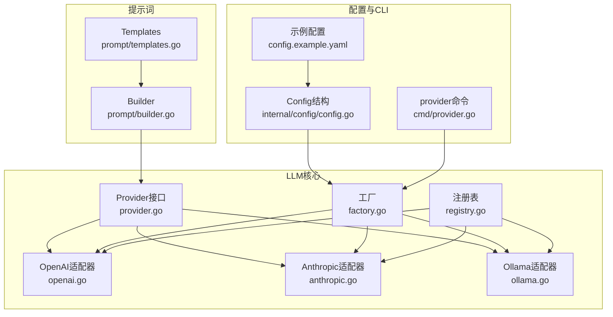
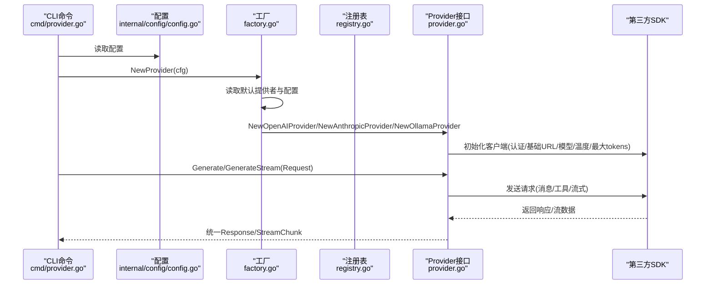
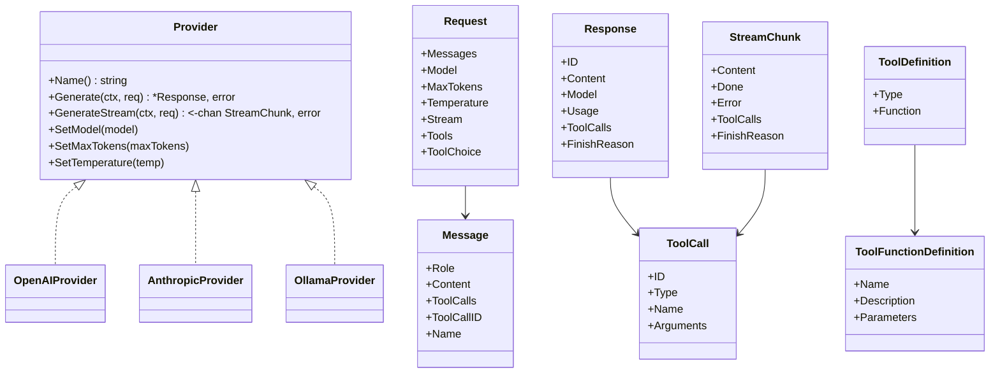
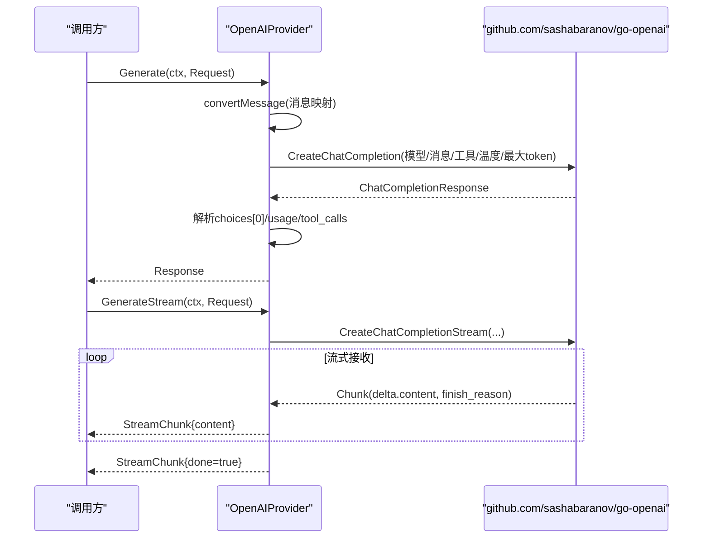
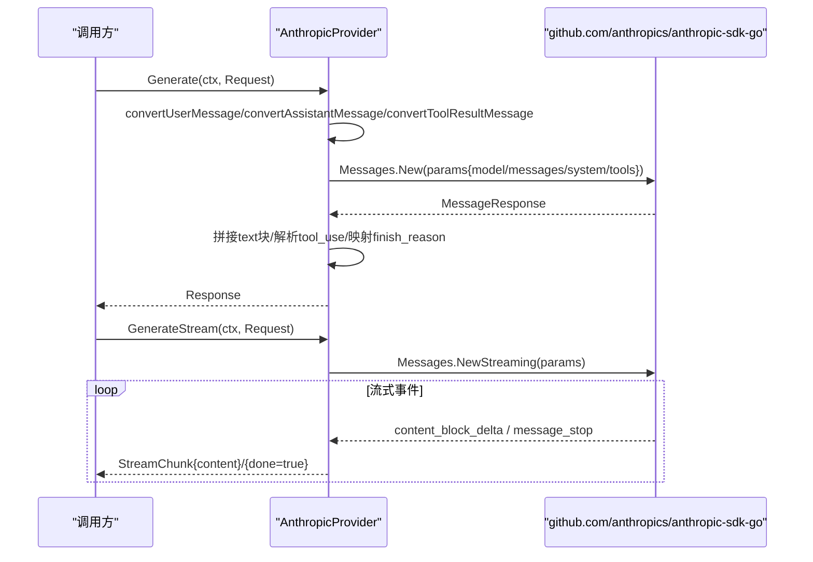
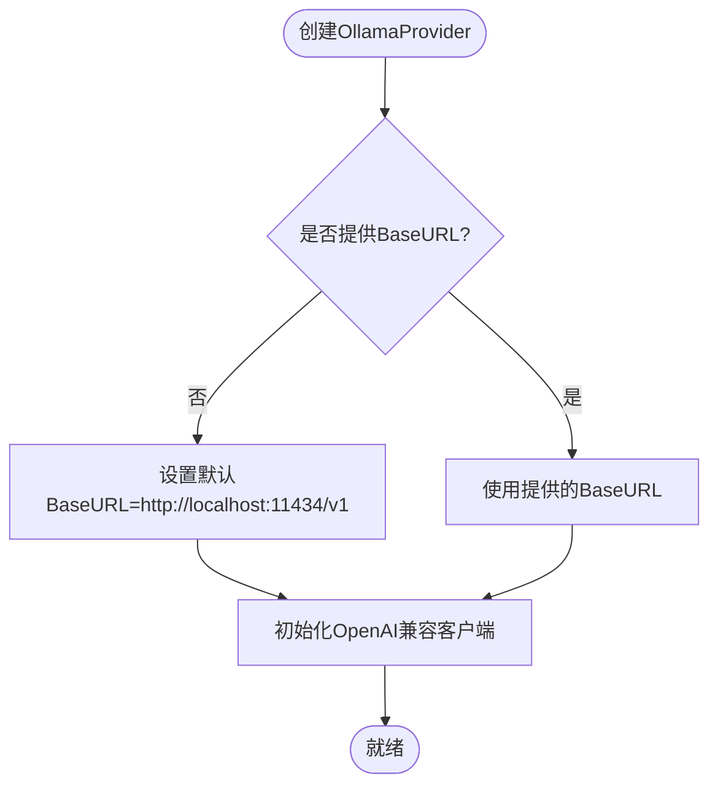
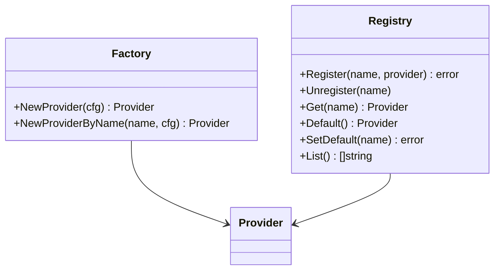
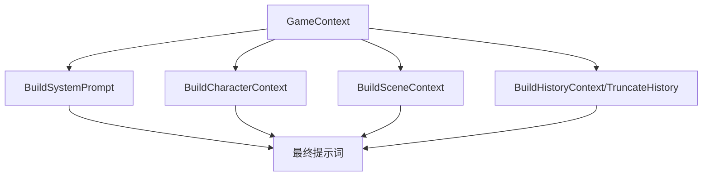
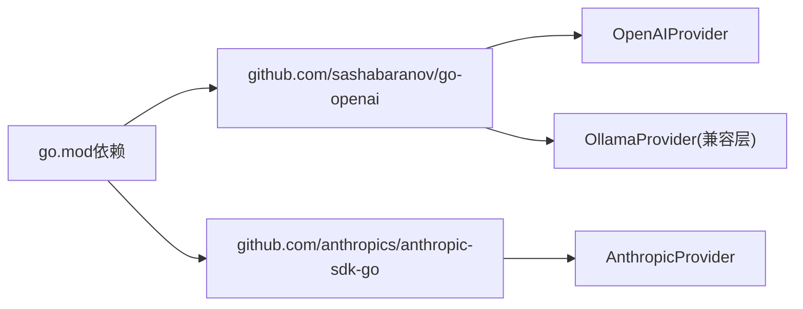

# LLM提供商实现

<cite>
**本文引用的文件**
- [provider.go](file://internal/llm/provider.go)
- [openai.go](file://internal/llm/openai.go)
- [anthropic.go](file://internal/llm/anthropic.go)
- [ollama.go](file://internal/llm/ollama.go)
- [factory.go](file://internal/llm/factory.go)
- [registry.go](file://internal/llm/registry.go)
- [builder.go](file://internal/llm/prompt/builder.go)
- [templates.go](file://internal/llm/prompt/templates.go)
- [config.go](file://internal/config/config.go)
- [provider.go](file://cmd/provider.go)
- [config.example.yaml](file://config.example.yaml)
- [go.mod](file://go.mod)
</cite>

## 目录
1. [简介](#简介)
2. [项目结构](#项目结构)
3. [核心组件](#核心组件)
4. [架构总览](#架构总览)
5. [详细组件分析](#详细组件分析)
6. [依赖分析](#依赖分析)
7. [性能考量](#性能考量)
8. [故障排查指南](#故障排查指南)
9. [结论](#结论)
10. [附录](#附录)

## 简介
本文件面向CDND项目的LLM提供商实现，系统性梳理OpenAI、Anthropic、Ollama三大主流LLM提供商的集成方式与适配层设计。文档覆盖认证机制、请求格式、响应处理、错误处理、配置项、性能特征与使用场景建议，并提供扩展新LLM提供商的实现指南与流程图示。

## 项目结构
LLM相关代码集中在internal/llm目录，围绕统一的Provider接口与适配器模式实现多提供商兼容；提示词构建位于internal/llm/prompt，配合CLI命令与配置模块完成从配置到调用的完整链路。

**图表来源**
- [provider.go:64-114](file://internal/llm/provider.go#L64-L114)
- [factory.go:9-69](file://internal/llm/factory.go#L9-L69)
- [registry.go:8-140](file://internal/llm/registry.go#L8-L140)
- [openai.go:11-38](file://internal/llm/openai.go#L11-L38)
- [anthropic.go:11-39](file://internal/llm/anthropic.go#L11-L39)
- [ollama.go:11-43](file://internal/llm/ollama.go#L11-L43)
- [builder.go:51-112](file://internal/llm/prompt/builder.go#L51-L112)
- [templates.go:3-12](file://internal/llm/prompt/templates.go#L3-L12)
- [config.go:16-29](file://internal/config/config.go#L16-L29)
- [provider.go:13-128](file://cmd/provider.go#L13-L128)
- [config.example.yaml:5-39](file://config.example.yaml#L5-L39)

**章节来源**
- [provider.go:1-114](file://internal/llm/provider.go#L1-L114)
- [factory.go:1-69](file://internal/llm/factory.go#L1-L69)
- [registry.go:1-140](file://internal/llm/registry.go#L1-L140)
- [openai.go:1-257](file://internal/llm/openai.go#L1-L257)
- [anthropic.go:1-269](file://internal/llm/anthropic.go#L1-L269)
- [ollama.go:1-261](file://internal/llm/ollama.go#L1-L261)
- [builder.go:1-273](file://internal/llm/prompt/builder.go#L1-L273)
- [templates.go:1-102](file://internal/llm/prompt/templates.go#L1-L102)
- [config.go:1-54](file://internal/config/config.go#L1-L54)
- [provider.go:1-128](file://cmd/provider.go#L1-L128)
- [config.example.yaml:1-72](file://config.example.yaml#L1-L72)

## 核心组件
- Provider接口：定义统一的Name、Generate、GenerateStream、SetModel、SetMaxTokens、SetTemperature方法，屏蔽不同提供商的差异。
- 数据结构：Message、Request、Response、Usage、StreamChunk、ToolDefinition/ToolFunctionDefinition/ToolCall等，支撑消息传递、工具调用与流式输出。
- ProviderConfig：封装APIKey、Model、BaseURL、MaxTokens、Temperature等通用配置项。
- 适配器实现：OpenAIProvider、AnthropicProvider、OllamaProvider分别对接对应SDK，完成消息转换、请求构造、响应解析与流式处理。
- 工厂与注册表：NewProvider/NewProviderByName按配置创建具体Provider；Registry支持注册、查询、默认提供者管理。
- 提示词构建：Builder与Templates负责系统提示词、角色设定、规则说明、工具指令与各类场景提示词的拼装与渲染。

**章节来源**
- [provider.go:64-114](file://internal/llm/provider.go#L64-L114)
- [openai.go:11-38](file://internal/llm/openai.go#L11-L38)
- [anthropic.go:11-39](file://internal/llm/anthropic.go#L11-L39)
- [ollama.go:11-43](file://internal/llm/ollama.go#L11-L43)
- [factory.go:9-69](file://internal/llm/factory.go#L9-L69)
- [registry.go:8-140](file://internal/llm/registry.go#L8-L140)
- [builder.go:51-112](file://internal/llm/prompt/builder.go#L51-L112)
- [templates.go:3-12](file://internal/llm/prompt/templates.go#L3-L12)

## 架构总览
下图展示从配置到调用的端到端流程，以及各Provider的适配关系。

**图表来源**
- [provider.go:54-94](file://cmd/provider.go#L54-L94)
- [config.go:16-29](file://internal/config/config.go#L16-L29)
- [factory.go:9-69](file://internal/llm/factory.go#L9-L69)
- [registry.go:71-86](file://internal/llm/registry.go#L71-L86)
- [provider.go:64-114](file://internal/llm/provider.go#L64-L114)
- [openai.go:20-34](file://internal/llm/openai.go#L20-L34)
- [anthropic.go:19-34](file://internal/llm/anthropic.go#L19-L34)
- [ollama.go:21-38](file://internal/llm/ollama.go#L21-L38)

## 详细组件分析

### Provider接口与数据模型
- 角色枚举：system、user、assistant、tool，用于消息路由与工具调用。
- 请求结构：包含消息数组、可选模型、最大token、温度、流式开关、工具定义与工具选择策略。
- 响应结构：统一content、model、usage、tool_calls、finish_reason；流式chunk包含content/done/error/finish_reason。
- 工具定义：ToolDefinition/ToolFunctionDefinition，支持参数schema与可选描述；ToolCall用于LLM返回的函数调用请求。

**图表来源**
- [provider.go:8-114](file://internal/llm/provider.go#L8-L114)

**章节来源**
- [provider.go:8-114](file://internal/llm/provider.go#L8-L114)

### OpenAI提供商实现
- 认证与初始化：通过ProviderConfig.APIKey与BaseURL配置客户端；若未指定BaseURL，默认使用OpenAI官方服务。
- 请求映射：将内部Message转换为OpenAI ChatCompletionMessage；当存在工具定义时，注入Tools与ToolChoice。
- 响应解析：提取choices[0]的消息内容、finish_reason、usage；若存在tool_calls，转换为统一ToolCall结构。
- 流式处理：开启Stream=true后，逐块接收delta.content，遇到EOF发送Done=true，错误时发送Error。

**图表来源**
- [openai.go:41-125](file://internal/llm/openai.go#L41-L125)
- [openai.go:127-211](file://internal/llm/openai.go#L127-L211)
- [openai.go:228-256](file://internal/llm/openai.go#L228-L256)

**章节来源**
- [openai.go:11-257](file://internal/llm/openai.go#L11-L257)

### Anthropic提供商实现
- 认证与初始化：通过ProviderConfig.APIKey配置客户端；支持自定义BaseURL（尽管默认行为由SDK决定）。
- 角色映射：将system消息作为独立字段传入；assistant/tool消息转换为Claude的ContentBlock结构。
- 工具定义：将ToolDefinition映射为Claude的ToolUnionParam，支持输入schema与可选描述；tool_use块转换为ToolCall。
- 响应解析：合并text块为content；根据stop_reason映射finish_reason。
- 流式处理：基于Messages.NewStreaming迭代事件，content_block_delta提取文本，message_stop结束。

**图表来源**
- [anthropic.go:41-139](file://internal/llm/anthropic.go#L41-L139)
- [anthropic.go:141-227](file://internal/llm/anthropic.go#L141-L227)
- [anthropic.go:244-269](file://internal/llm/anthropic.go#L244-L269)

**章节来源**
- [anthropic.go:11-269](file://internal/llm/anthropic.go#L11-L269)

### Ollama提供商实现
- 设计思路：Ollama提供OpenAI兼容的API，因此直接复用OpenAI客户端与消息转换逻辑，仅在初始化时设置默认BaseURL。
- 认证与初始化：若未显式配置BaseURL，默认指向本地11434端口；无需APIKey。
- 请求与响应：与OpenAI一致，便于无缝切换本地推理与云端服务。

**图表来源**
- [ollama.go:21-38](file://internal/llm/ollama.go#L21-L38)

**章节来源**
- [ollama.go:11-261](file://internal/llm/ollama.go#L11-L261)

### 工厂与注册表
- 工厂：根据配置中的默认提供者名称，将config.ProviderConfig转换为llm.ProviderConfig并创建对应Provider实例；支持按名称创建。
- 注册表：提供线程安全的Provider注册、查询、默认提供者设置与列表功能；全局注册表提供便捷访问。

**图表来源**
- [factory.go:9-69](file://internal/llm/factory.go#L9-L69)
- [registry.go:8-140](file://internal/llm/registry.go#L8-L140)

**章节来源**
- [factory.go:1-69](file://internal/llm/factory.go#L1-L69)
- [registry.go:1-140](file://internal/llm/registry.go#L1-L140)

### 提示词构建与模板
- Builder：根据GameContext动态拼装系统提示词、角色上下文、场景上下文、历史截断与各类场景提示词；支持颜色标记解析与渲染。
- Templates：内置中文模板，涵盖DM角色、规则、工具调用说明、开场、战斗、对话、休息等场景。

**图表来源**
- [builder.go:75-112](file://internal/llm/prompt/builder.go#L75-L112)
- [builder.go:114-179](file://internal/llm/prompt/builder.go#L114-L179)
- [builder.go:181-211](file://internal/llm/prompt/builder.go#L181-L211)
- [builder.go:213-273](file://internal/llm/prompt/builder.go#L213-L273)
- [templates.go:14-102](file://internal/llm/prompt/templates.go#L14-L102)

**章节来源**
- [builder.go:1-273](file://internal/llm/prompt/builder.go#L1-L273)
- [templates.go:1-102](file://internal/llm/prompt/templates.go#L1-L102)

## 依赖分析
- 外部SDK依赖：OpenAI SDK与Anthropic SDK分别用于OpenAI与Anthropic的API调用；Ollama通过OpenAI兼容端点接入。
- 内部耦合：Provider接口与适配器之间为低耦合；工厂与注册表解耦配置与实例创建；提示词构建与Provider解耦，通过Request/Response交互。

**图表来源**
- [go.mod:5-14](file://go.mod#L5-L14)
- [openai.go:3-9](file://internal/llm/openai.go#L3-L9)
- [anthropic.go:3-9](file://internal/llm/anthropic.go#L3-L9)
- [ollama.go:3-9](file://internal/llm/ollama.go#L3-L9)

**章节来源**
- [go.mod:1-55](file://go.mod#L1-L55)
- [openai.go:1-257](file://internal/llm/openai.go#L1-L257)
- [anthropic.go:1-269](file://internal/llm/anthropic.go#L1-L269)
- [ollama.go:1-261](file://internal/llm/ollama.go#L1-L261)

## 性能考量
- 流式输出：OpenAI与Anthropic均支持流式响应，降低首字延迟；Ollama复用OpenAI流式实现，具备相同体验。
- 上下文长度：Builder提供历史截断与简化实现，实际项目中应结合token估算优化上下文窗口。
- 本地推理：Ollama在本地运行，避免网络延迟与带宽限制，适合离线与隐私敏感场景；云端服务具备更强算力与更丰富模型生态。
- 工具调用：三提供商均支持工具调用，建议在提示词中明确工具约束与schema，减少LLM误用与重试。

[本节为通用性能讨论，不直接分析特定文件]

## 故障排查指南
- CLI测试：provider test <provider>会创建Provider并发送简短测试消息，便于快速验证连通性与配置正确性。
- 错误处理：各Provider在SDK调用失败时直接返回错误；流式场景在EOF时发送done=true，错误时发送Error。
- 常见问题定位：
  - API密钥缺失：OpenAI/Anthropic需配置APIKey；Ollama无需密钥。
  - BaseURL错误：OpenAI可通过base_url指向兼容服务（如DashScope）；Ollama需确保本地服务可达。
  - 模型不可用：确认配置的model在对应平台可用；必要时回退至默认模型。
  - 工具调用失败：检查工具定义schema与名称是否与提示词一致。

**章节来源**
- [provider.go:53-94](file://cmd/provider.go#L53-L94)
- [openai.go:89-92](file://internal/llm/openai.go#L89-L92)
- [anthropic.go:101-104](file://internal/llm/anthropic.go#L101-L104)
- [ollama.go:93-96](file://internal/llm/ollama.go#L93-L96)

## 结论
CDND通过统一的Provider接口与适配器模式，实现了对OpenAI、Anthropic、Ollama的无缝集成。工厂与注册表提供了灵活的实例化与管理能力；提示词构建模块将游戏语境与LLM能力有效结合。开发者可据此快速扩展新提供商，或在现有基础上优化性能与稳定性。

[本节为总结性内容，不直接分析特定文件]

## 附录

### 配置项与示例
- LLM配置项：default_provider、providers.<name>.api_key、model、base_url、max_tokens、temperature。
- 示例配置：包含OpenAI（兼容服务）、Anthropic、Ollama三类典型配置，便于快速上手。

**章节来源**
- [config.go:16-29](file://internal/config/config.go#L16-L29)
- [config.example.yaml:5-39](file://config.example.yaml#L5-L39)

### API差异与适配要点
- 认证：OpenAI/Anthropic需要APIKey；Ollama本地默认无需密钥。
- 基础URL：OpenAI支持自定义BaseURL；Anthropic默认行为由SDK决定；Ollama默认指向本地端点。
- 角色与工具：OpenAI使用tool_calls；Anthropic使用tool_use块；Ollama复用OpenAI格式。
- 流式：三方均支持流式，实现方式略有差异，但对外统一为StreamChunk。

**章节来源**
- [openai.go:20-34](file://internal/llm/openai.go#L20-L34)
- [anthropic.go:19-34](file://internal/llm/anthropic.go#L19-L34)
- [ollama.go:21-38](file://internal/llm/ollama.go#L21-L38)
- [provider.go:18-62](file://internal/llm/provider.go#L18-L62)

### 扩展新LLM提供商指南
- 实现步骤
  1) 定义Provider实现：遵循Provider接口，实现Name、Generate、GenerateStream、SetModel/SetMaxTokens/SetTemperature。
  2) 消息映射：将内部Message转换为目标SDK的消息结构；处理tool角色与assistant中的tool_calls。
  3) 工具定义：将ToolDefinition映射为目标SDK的工具定义；解析tool_use/tool_calls。
  4) 流式处理：在Stream=true时，逐块产出StreamChunk；EOF时done=true，错误时携带Error。
  5) 初始化：在NewProvider中读取ProviderConfig，配置认证、BaseURL、模型、温度、最大token。
  6) 注册与工厂：在factory.go中增加分支；在registry.go中注册实例；CLI中完善provider命令。
- 参考实现
  - OpenAI：消息转换、工具注入、流式接收。
  - Anthropic：system分离、content_block映射、事件驱动流式。
  - Ollama：OpenAI兼容端点复用。

**章节来源**
- [provider.go:64-114](file://internal/llm/provider.go#L64-L114)
- [openai.go:41-125](file://internal/llm/openai.go#L41-L125)
- [anthropic.go:41-139](file://internal/llm/anthropic.go#L41-L139)
- [ollama.go:45-129](file://internal/llm/ollama.go#L45-L129)
- [factory.go:31-40](file://internal/llm/factory.go#L31-L40)
- [registry.go:22-39](file://internal/llm/registry.go#L22-L39)