# Ollama本地提供商

<cite>
**本文档引用的文件**
- [ollama.go](file://internal/llm/ollama.go)
- [provider.go](file://internal/llm/provider.go)
- [factory.go](file://internal/llm/factory.go)
- [config.go](file://internal/config/config.go)
- [defaults.go](file://internal/config/defaults.go)
- [config.example.yaml](file://config.example.yaml)
- [registry.go](file://internal/llm/registry.go)
- [provider.go](file://cmd/provider.go)
- [openai.go](file://internal/llm/openai.go)
- [anthropic.go](file://internal/llm/anthropic.go)
</cite>

## 目录
1. [简介](#简介)
2. [项目结构](#项目结构)
3. [核心组件](#核心组件)
4. [架构概览](#架构概览)
5. [详细组件分析](#详细组件分析)
6. [依赖关系分析](#依赖关系分析)
7. [性能考虑](#性能考虑)
8. [故障排除指南](#故障排除指南)
9. [结论](#结论)
10. [附录](#附录)

## 简介

CDND项目中的Ollama本地LLM提供商实现了对本地大语言模型的完整支持。该实现基于Ollama提供的OpenAI兼容API，通过统一的Provider接口抽象，为CDND应用提供了无缝的本地模型推理能力。

Ollama提供商的核心优势在于：
- **完全本地化**：无需网络连接即可进行模型推理
- **成本效益**：避免了云端API费用
- **隐私保护**：所有数据都在本地处理
- **可定制性**：支持多种本地模型的选择和配置

## 项目结构

CDND项目采用模块化的架构设计，LLM提供商相关代码主要位于`internal/llm`目录下：

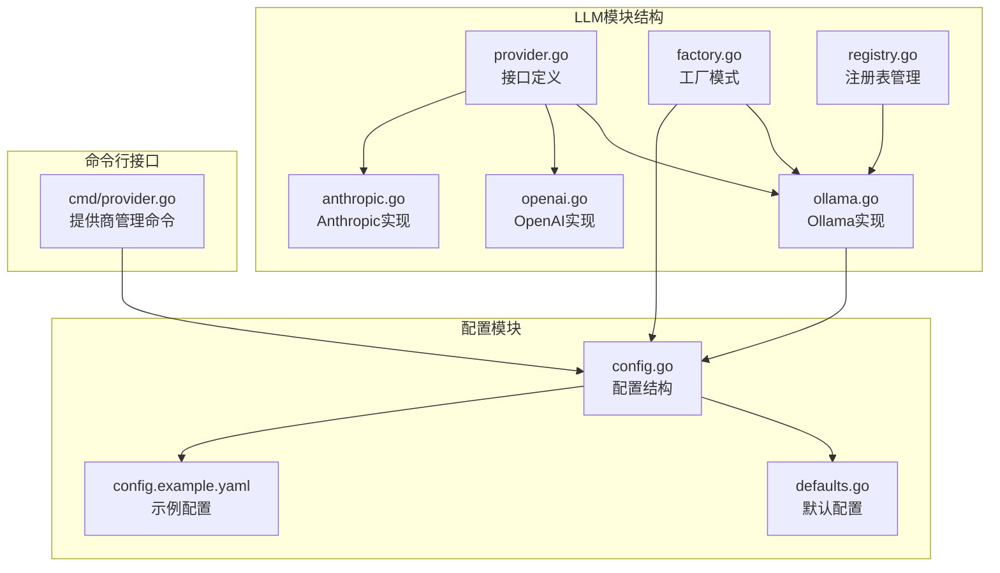

**图表来源**
- [provider.go:1-114](file://internal/llm/provider.go#L1-L114)
- [ollama.go:1-261](file://internal/llm/ollama.go#L1-L261)
- [factory.go:1-69](file://internal/llm/factory.go#L1-L69)

**章节来源**
- [provider.go:1-114](file://internal/llm/provider.go#L1-L114)
- [config.go:1-54](file://internal/config/config.go#L1-L54)

## 核心组件

### Provider接口抽象

Provider接口定义了LLM提供商的标准行为规范，确保不同提供商之间的互操作性：

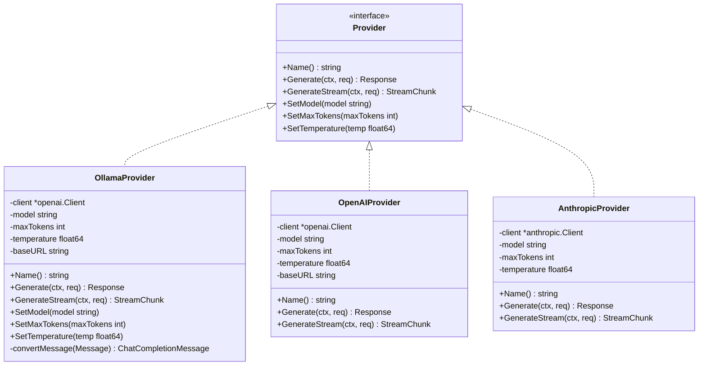

**图表来源**
- [provider.go:64-83](file://internal/llm/provider.go#L64-L83)
- [ollama.go:11-19](file://internal/llm/ollama.go#L11-L19)
- [openai.go:11-18](file://internal/llm/openai.go#L11-L18)
- [anthropic.go:11-17](file://internal/llm/anthropic.go#L11-L17)

### 数据模型结构

系统使用统一的数据模型来表示消息、请求和响应：

```mermaid
classDiagram
class Message {
+MessageRole role
+string content
+ToolCall[] tool_calls
+string tool_call_id
+string name
}
class Request {
+Message[] messages
+string model
+int max_tokens
+float64 temperature
+bool stream
+ToolDefinition[] tools
+interface{} tool_choice
}
class Response {
+string id
+string content
+string model
+Usage usage
+ToolCall[] tool_calls
+string finish_reason
}
class StreamChunk {
+string content
+bool done
+error error
+ToolCall[] tool_calls
+string finish_reason
}
class Usage {
+int prompt_tokens
+int completion_tokens
+int total_tokens
}
Message --> Request : "组成"
Response --> Usage : "包含"
StreamChunk --> Usage : "可能包含"
```

**图表来源**
- [provider.go:18-62](file://internal/llm/provider.go#L18-L62)

**章节来源**
- [provider.go:18-114](file://internal/llm/provider.go#L18-L114)

## 架构概览

### 整体架构设计

CDND的LLM架构采用了分层设计，确保了良好的可扩展性和维护性：

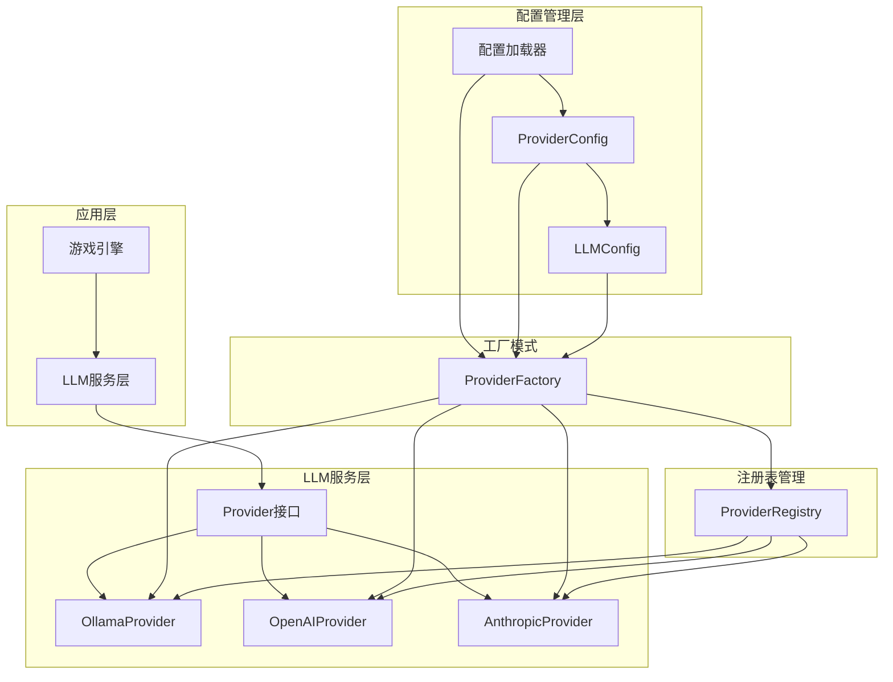

**图表来源**
- [factory.go:9-41](file://internal/llm/factory.go#L9-L41)
- [registry.go:8-140](file://internal/llm/registry.go#L8-L140)
- [config.go:16-29](file://internal/config/config.go#L16-L29)

### Ollama提供商实现架构

Ollama提供商的实现充分利用了其OpenAI兼容API的特点：

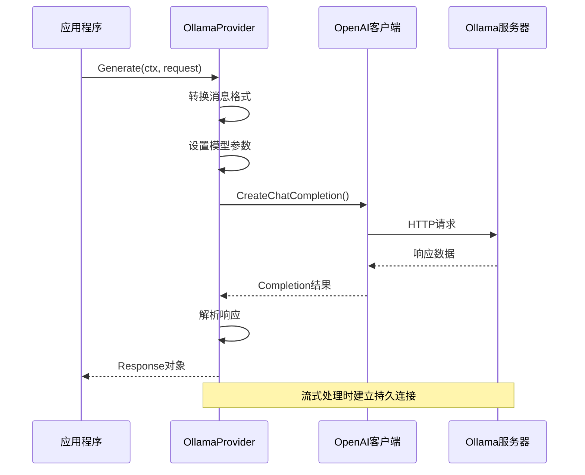

**图表来源**
- [ollama.go:45-129](file://internal/llm/ollama.go#L45-L129)
- [openai.go:41-125](file://internal/llm/openai.go#L41-L125)

**章节来源**
- [ollama.go:11-38](file://internal/llm/ollama.go#L11-L38)
- [factory.go:30-41](file://internal/llm/factory.go#L30-L41)

## 详细组件分析

### OllamaProvider类实现

OllamaProvider是本地LLM提供商的核心实现，它继承了Provider接口并实现了特定的功能：

#### 核心属性和初始化

| 属性 | 类型 | 描述 | 默认值 |
|------|------|------|--------|
| client | *openai.Client | OpenAI兼容客户端 | 新建实例 |
| model | string | 默认使用的模型名称 | 配置文件指定 |
| maxTokens | int | 最大生成令牌数 | 4096 |
| temperature | float64 | 生成温度参数 | 0.7 |
| baseURL | string | Ollama服务器基础URL | "http://localhost:11434/v1" |

#### Generate方法实现

Generate方法实现了同步的模型推理功能：

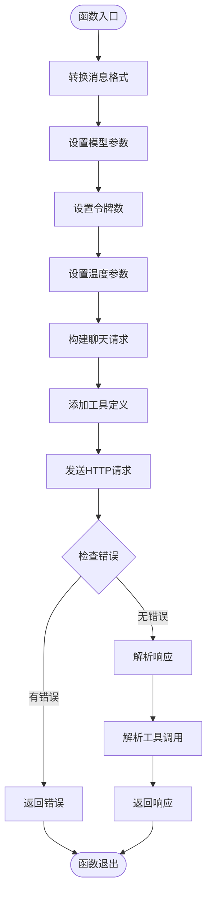

**图表来源**
- [ollama.go:45-129](file://internal/llm/ollama.go#L45-L129)

#### GenerateStream方法实现

GenerateStream方法实现了流式的模型推理功能：

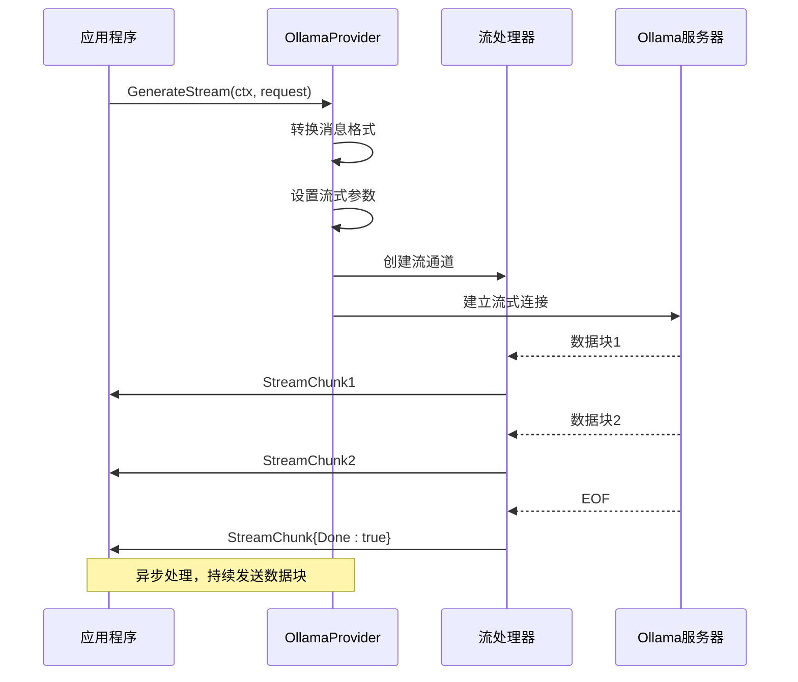

**图表来源**
- [ollama.go:131-215](file://internal/llm/ollama.go#L131-L215)

#### 消息转换机制

OllamaProvider实现了消息格式转换，以适配不同的消息角色：

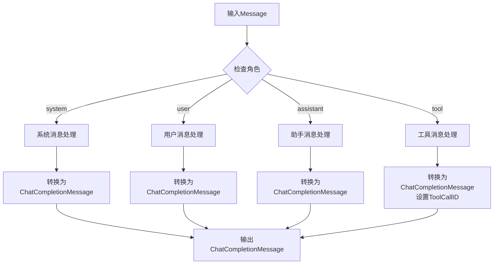

**图表来源**
- [ollama.go:232-260](file://internal/llm/ollama.go#L232-L260)

**章节来源**
- [ollama.go:11-261](file://internal/llm/ollama.go#L11-L261)

### 工厂模式和注册表

#### ProviderFactory工厂实现

工厂模式确保了提供商的创建过程标准化：

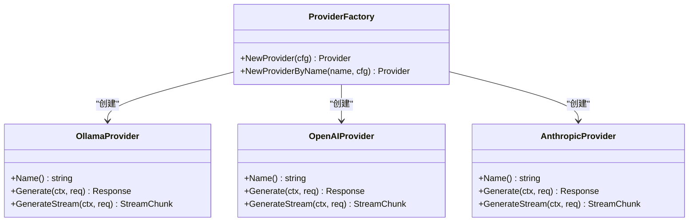

**图表来源**
- [factory.go:9-69](file://internal/llm/factory.go#L9-L69)

#### ProviderRegistry注册表

注册表提供了动态的提供商管理能力：

| 方法 | 功能 | 参数 | 返回值 |
|------|------|------|--------|
| Register | 注册提供商 | name, provider | error |
| Unregister | 注销提供商 | name | void |
| Get | 获取提供商 | name | Provider, error |
| Default | 获取默认提供商 | - | Provider, error |
| SetDefault | 设置默认提供商 | name | error |
| List | 列出所有提供商 | - | []string |

**章节来源**
- [factory.go:9-69](file://internal/llm/factory.go#L9-L69)
- [registry.go:22-140](file://internal/llm/registry.go#L22-L140)

### 配置管理系统

#### 配置结构定义

CDND使用结构化的配置系统来管理LLM提供商的各种设置：

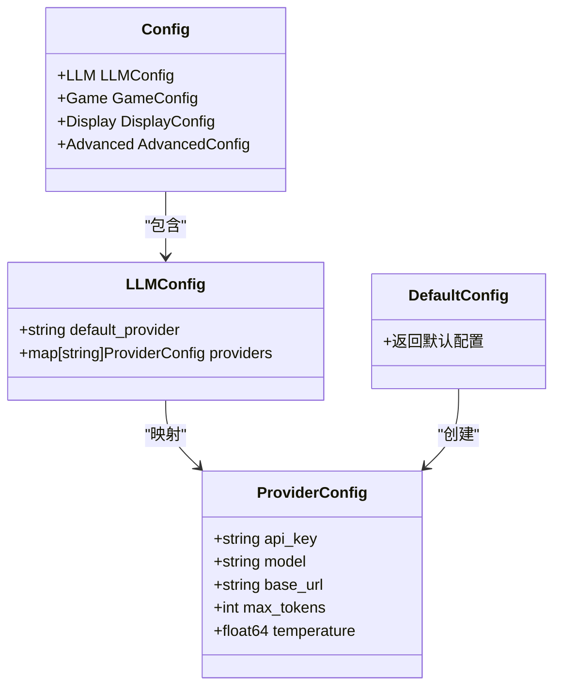

**图表来源**
- [config.go:8-29](file://internal/config/config.go#L8-L29)
- [defaults.go:7-51](file://internal/config/defaults.go#L7-L51)

#### 默认配置参数

| 配置项 | Ollama默认值 | 说明 |
|--------|-------------|------|
| model | "llama2" | 默认使用的本地模型 |
| base_url | "http://localhost:11434" | Ollama服务器地址 |
| max_tokens | 4096 | 最大生成令牌数 |
| temperature | 0.7 | 生成温度参数 |
| api_key | "" | 本地模型无需API密钥 |

**章节来源**
- [config.go:16-29](file://internal/config/config.go#L16-L29)
- [defaults.go:24-29](file://internal/config/defaults.go#L24-L29)
- [config.example.yaml:32-39](file://config.example.yaml#L32-L39)

## 依赖关系分析

### 外部依赖

Ollama提供商主要依赖于以下外部库：

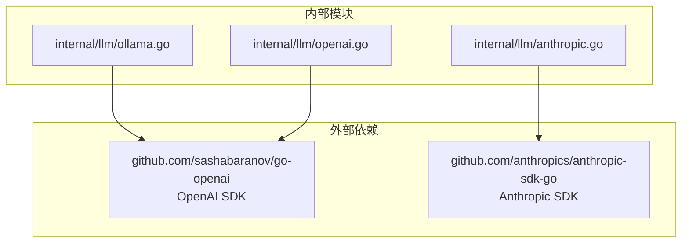

**图表来源**
- [ollama.go:3](file://internal/llm/ollama.go#L3)
- [openai.go:3](file://internal/llm/openai.go#L3)
- [anthropic.go:3](file://internal/llm/anthropic.go#L3)

### 内部依赖关系

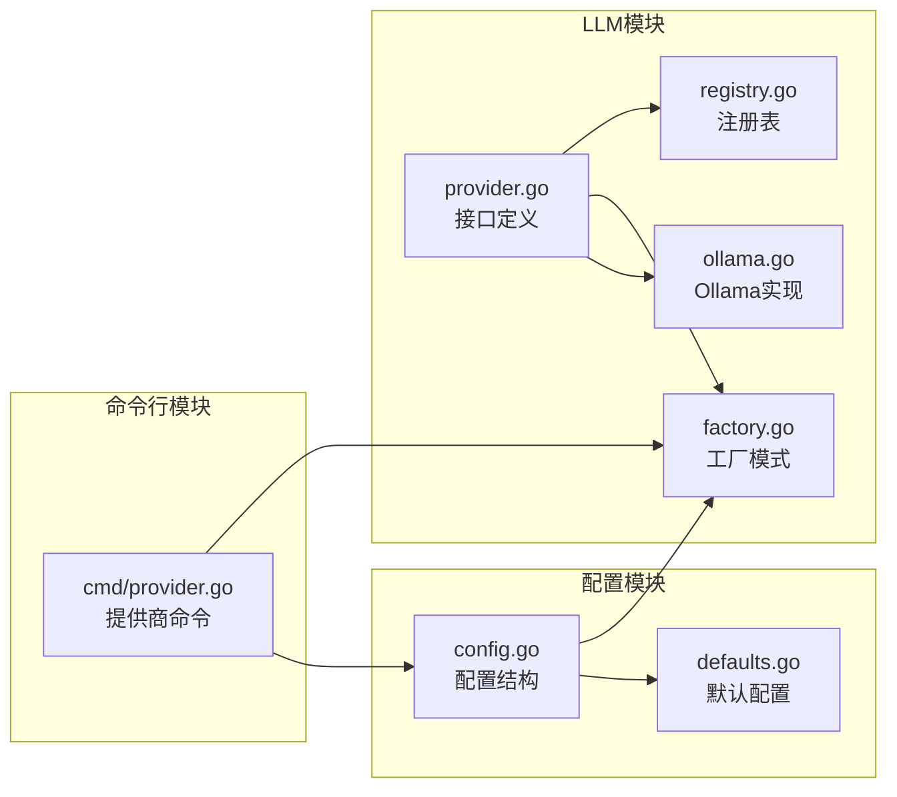

**图表来源**
- [provider.go:1-114](file://internal/llm/provider.go#L1-L114)
- [factory.go:1-69](file://internal/llm/factory.go#L1-L69)
- [config.go:1-54](file://internal/config/config.go#L1-L54)

**章节来源**
- [provider.go:1-114](file://internal/llm/provider.go#L1-L114)
- [factory.go:1-69](file://internal/llm/factory.go#L1-L69)

## 性能考虑

### 本地部署优势

1. **零网络延迟**：所有计算都在本地完成，避免了网络传输延迟
2. **高吞吐量**：本地硬件资源直接用于模型推理
3. **成本效益**：无需支付云端API费用
4. **隐私保护**：数据完全在本地处理，无外泄风险

### 性能特征

| 特征 | 说明 | 影响 |
|------|------|------|
| 响应时间 | 本地推理，延迟极低 | 用户体验优秀 |
| 内存占用 | 取决于模型大小和上下文长度 | 需要充足的RAM |
| 处理速度 | 受CPU/GPU性能影响 | 高端硬件性能更佳 |
| 并发处理 | 支持多线程流式处理 | 提升整体效率 |

### 优化建议

1. **模型选择优化**：根据应用场景选择合适的模型大小
2. **参数调优**：合理设置max_tokens和temperature参数
3. **内存管理**：监控内存使用情况，避免过度消耗
4. **并发控制**：合理设置流式处理的缓冲区大小

## 故障排除指南

### 常见问题及解决方案

#### 1. Ollama服务器连接失败

**症状**：无法连接到Ollama服务器，出现连接超时错误

**诊断步骤**：
1. 检查Ollama服务是否正常运行
2. 验证base_url配置是否正确
3. 确认防火墙设置允许本地连接

**解决方案**：
```bash
# 启动Ollama服务
ollama serve

# 检查服务状态
ollama ps

# 下载所需模型
ollama pull llama2
```

#### 2. 模型加载失败

**症状**：提示找不到指定的模型

**诊断步骤**：
1. 检查模型名称是否正确
2. 验证模型是否已下载
3. 确认模型文件完整性

**解决方案**：
```bash
# 查看已安装模型
ollama list

# 下载缺失模型
ollama pull <model_name>
```

#### 3. 流式处理异常

**症状**：流式响应中断或数据丢失

**诊断步骤**：
1. 检查网络连接稳定性
2. 验证流式处理缓冲区设置
3. 监控内存使用情况

**解决方案**：
- 增加流式处理缓冲区大小
- 优化内存管理策略
- 实施重连机制

### 错误处理机制

Ollama提供商实现了完善的错误处理机制：

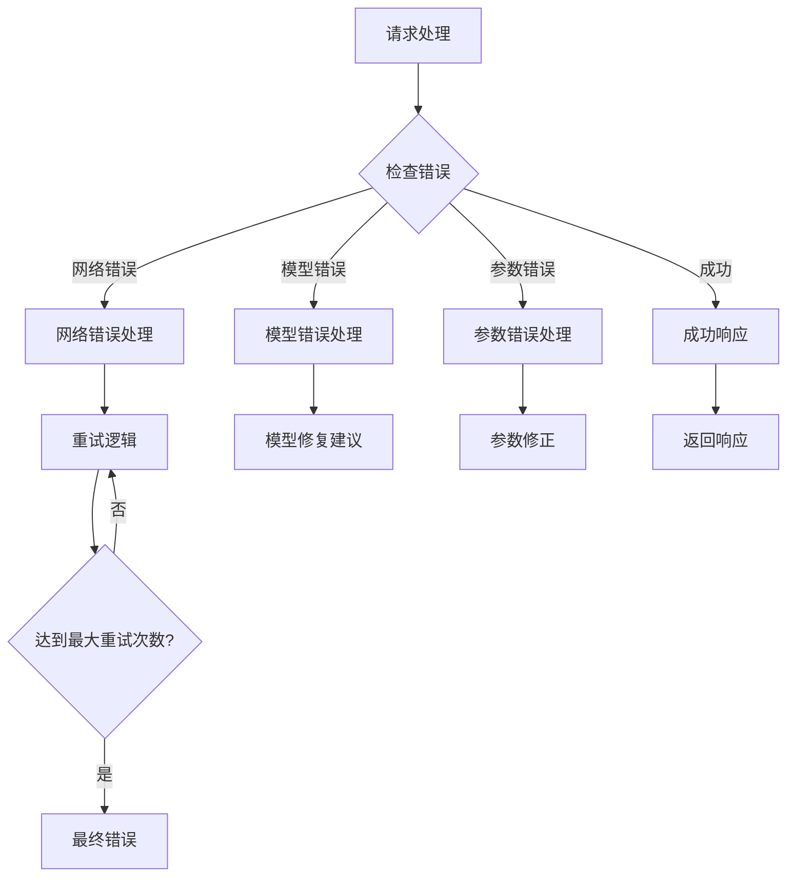

**图表来源**
- [ollama.go:180-215](file://internal/llm/ollama.go#L180-L215)

**章节来源**
- [cmd/provider.go:53-94](file://cmd/provider.go#L53-L94)

## 结论

CDND项目的Ollama本地LLM提供商实现展现了优秀的软件工程实践：

### 主要成就

1. **统一抽象**：通过Provider接口实现了多提供商的统一管理
2. **OpenAI兼容**：充分利用Ollama的OpenAI兼容API简化了实现
3. **流式处理**：支持实时的流式响应，提升了用户体验
4. **配置灵活**：提供了丰富的配置选项，适应不同场景需求

### 技术亮点

- **模块化设计**：清晰的职责分离和依赖关系
- **工厂模式**：标准化的提供商创建流程
- **注册表管理**：动态的提供商生命周期管理
- **错误处理**：完善的异常处理和恢复机制

### 未来发展方向

1. **性能优化**：进一步提升本地推理性能
2. **模型支持**：扩展对更多本地模型的支持
3. **监控增强**：增加详细的性能监控和日志记录
4. **配置热更新**：支持运行时配置的动态更新

## 附录

### 配置示例

完整的Ollama配置示例：

```yaml
# Ollama提供商配置
ollama:
  model: "llama2"           # 使用的本地模型
  base_url: "http://localhost:11434"  # Ollama服务器地址
  max_tokens: 4096          # 最大生成令牌数
  temperature: 0.7          # 生成温度参数
```

### 命令行工具

提供者管理命令：

```bash
# 列出所有提供商
cdnd provider list

# 测试提供商连接
cdnd provider test ollama

# 设置默认提供商
cdnd provider set-default ollama
```

### 开发最佳实践

1. **错误处理**：始终检查和处理可能的错误
2. **资源管理**：及时关闭流式连接和释放资源
3. **配置验证**：在使用前验证配置的有效性
4. **日志记录**：添加适当的日志记录以便调试