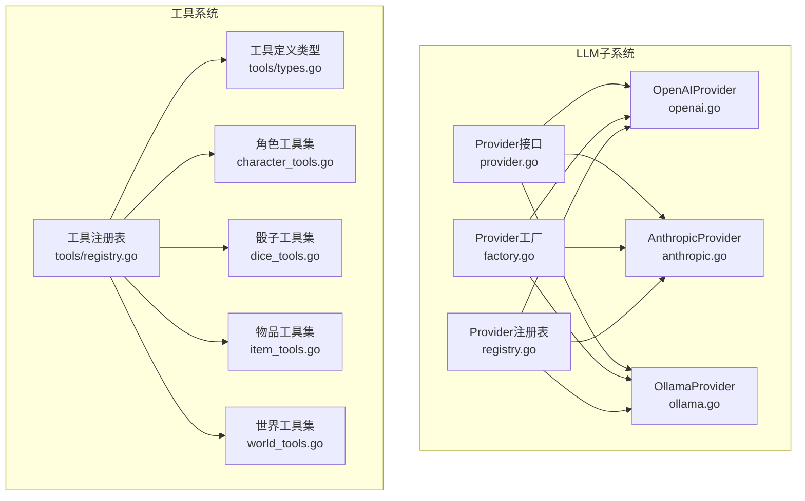
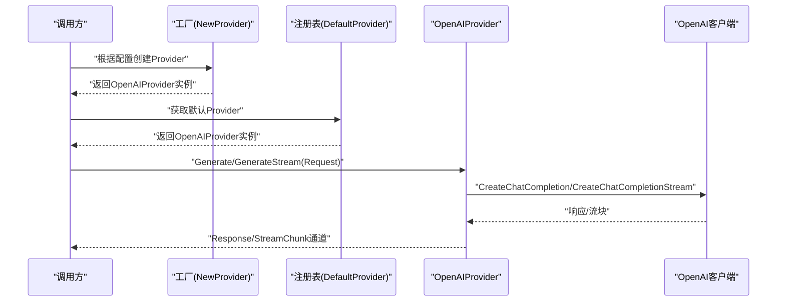
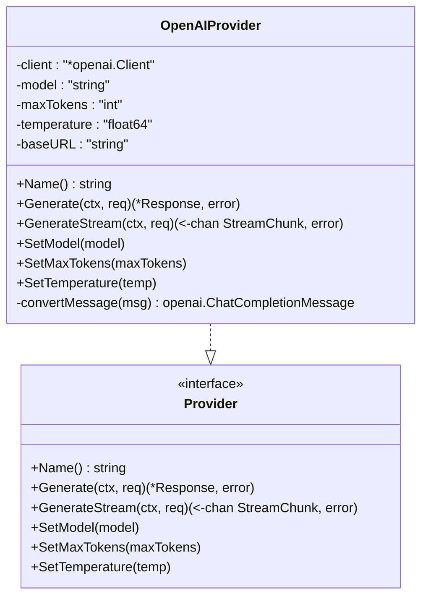
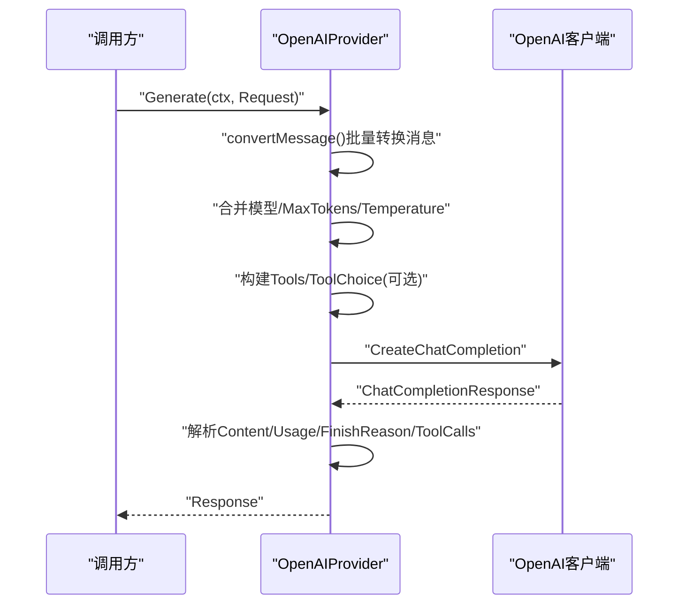
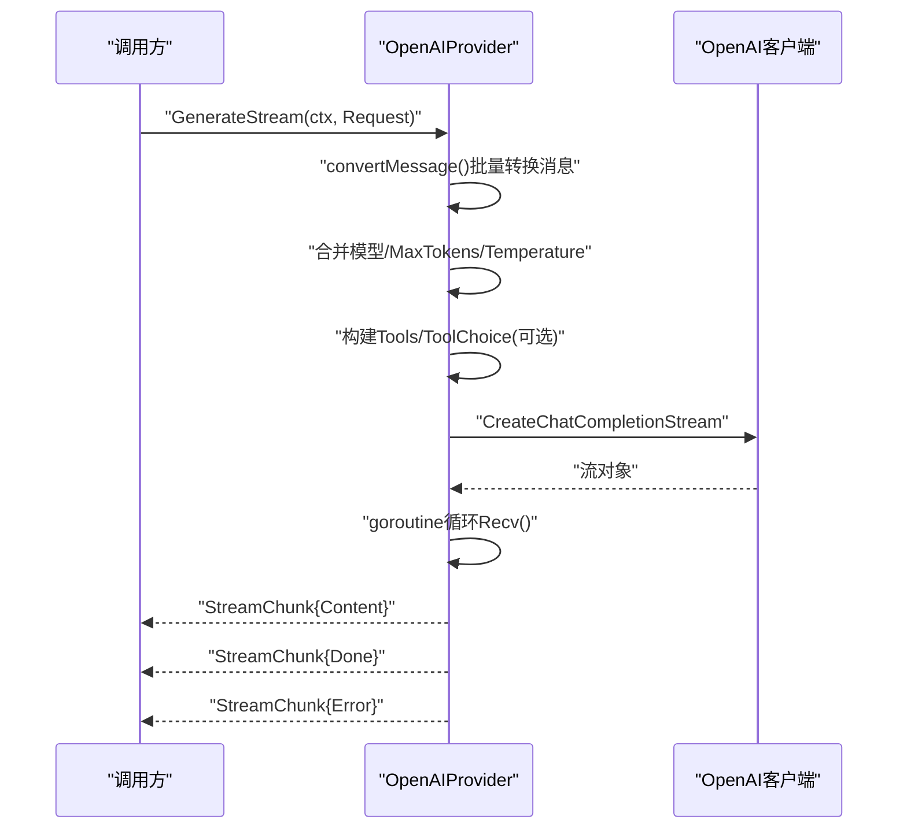
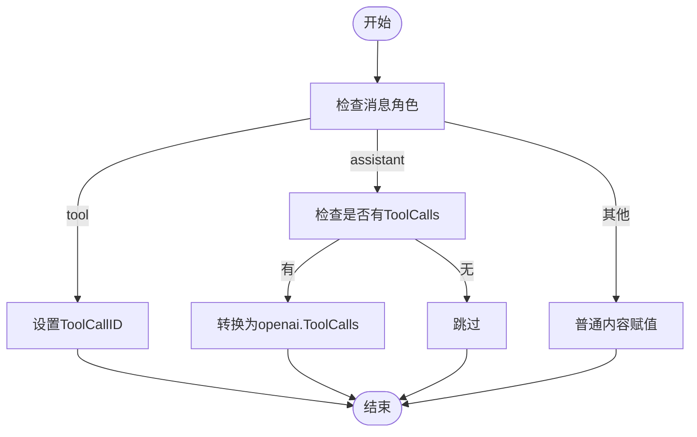
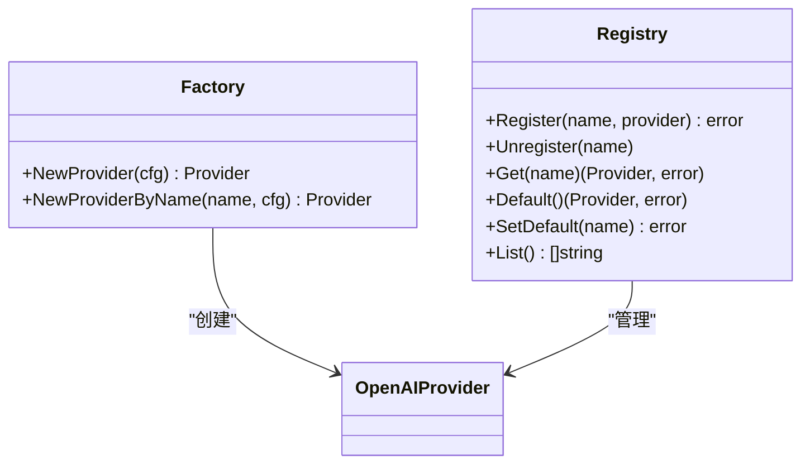
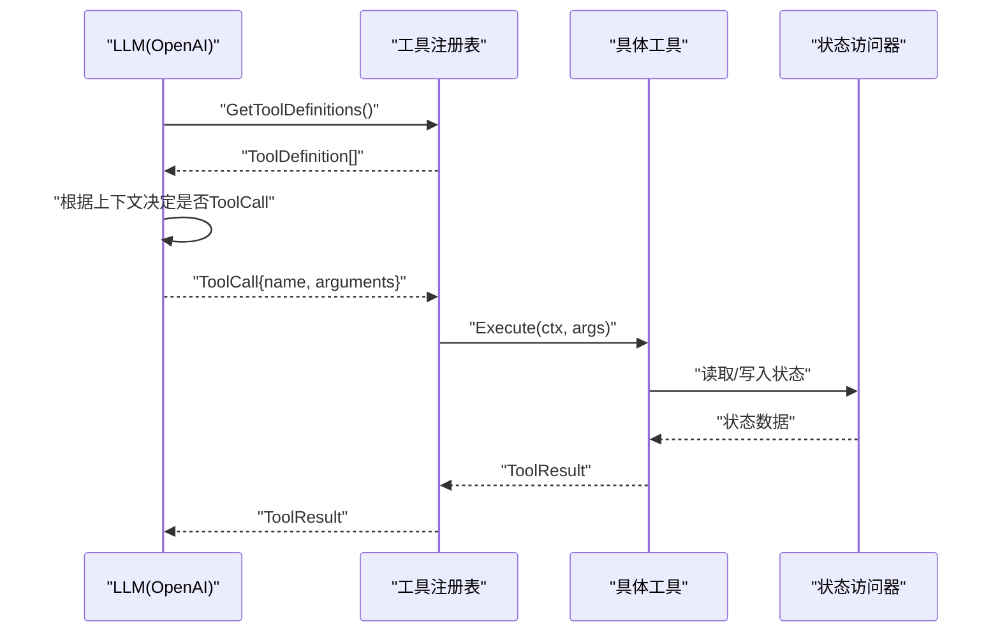
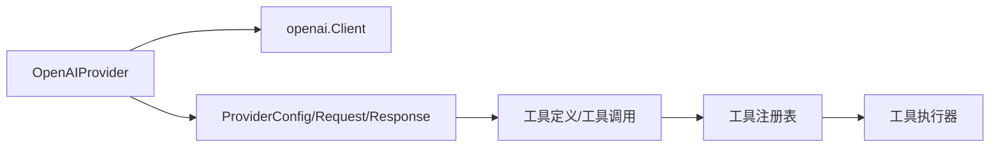

# OpenAI提供商

<cite>
**本文引用的文件列表**
- [openai.go](file://internal/llm/openai.go)
- [provider.go](file://internal/llm/provider.go)
- [factory.go](file://internal/llm/factory.go)
- [registry.go](file://internal/llm/registry.go)
- [anthropic.go](file://internal/llm/anthropic.go)
- [ollama.go](file://internal/llm/ollama.go)
- [types.go](file://internal/tools/types.go)
- [registry.go](file://internal/tools/registry.go)
- [character_tools.go](file://internal/tools/character_tools.go)
- [dice_tools.go](file://internal/tools/dice_tools.go)
- [item_tools.go](file://internal/tools/item_tools.go)
- [world_tools.go](file://internal/tools/world_tools.go)
- [config.example.yaml](file://config.example.yaml)
</cite>

## 目录
1. [简介](#简介)
2. [项目结构](#项目结构)
3. [核心组件](#核心组件)
4. [架构总览](#架构总览)
5. [详细组件分析](#详细组件分析)
6. [依赖关系分析](#依赖关系分析)
7. [性能考量](#性能考量)
8. [故障排查指南](#故障排查指南)
9. [结论](#结论)
10. [附录](#附录)

## 简介
本文件为 CDND 项目中 OpenAI 提供商实现的详细技术文档。重点覆盖以下方面：
- 客户端初始化与认证机制
- 配置选项与默认行为
- Generate 与 GenerateStream 两大核心方法的实现原理
- 消息格式转换，尤其是 tool 角色消息与 assistant 消息中工具调用的处理
- OpenAI 特有的 API 参数（模型选择、最大令牌数、温度等）
- 工具调用的定义、传递与执行流程
- 完整配置示例、使用场景与错误处理策略
- 性能优化建议

## 项目结构
OpenAI 提供商位于 internal/llm 子系统中，采用统一的 Provider 接口抽象，支持多提供商并存与工厂模式创建。工具系统位于 internal/tools，通过工具注册表向 LLM 暴露函数定义，LLM 再通过工具调用与工具执行器交互。

图表来源
- [provider.go:64-83](file://internal/llm/provider.go#L64-L83)
- [openai.go:11-34](file://internal/llm/openai.go#L11-L34)
- [anthropic.go:11-34](file://internal/llm/anthropic.go#L11-L34)
- [ollama.go:11-38](file://internal/llm/ollama.go#L11-L38)
- [factory.go:9-41](file://internal/llm/factory.go#L9-L41)
- [registry.go:8-140](file://internal/llm/registry.go#L8-L140)
- [types.go:24-67](file://internal/tools/types.go#L24-L67)
- [registry.go:1-109](file://internal/tools/registry.go#L1-L109)

章节来源
- [provider.go:8-114](file://internal/llm/provider.go#L8-L114)
- [openai.go:11-257](file://internal/llm/openai.go#L11-L257)
- [factory.go:9-69](file://internal/llm/factory.go#L9-L69)
- [registry.go:8-140](file://internal/llm/registry.go#L8-L140)
- [types.go:24-118](file://internal/tools/types.go#L24-L118)
- [registry.go:1-109](file://internal/tools/registry.go#L1-L109)

## 核心组件
- Provider 接口族：定义统一的生成与流式生成能力，以及模型/令牌/温度等配置项的设置接口。
- OpenAIProvider：基于 github.com/sashabaranov/go-openai 客户端，实现 OpenAI 兼容 API 的聊天补全与流式补全。
- ProviderConfig：承载 API Key、模型、BaseURL、MaxTokens、Temperature 等配置。
- Request/Response/StreamChunk：跨提供商的消息与响应数据结构。
- 工具系统：工具注册表与工具定义，用于向 LLM 暴露函数签名，LLM 通过工具调用触发工具执行。

章节来源
- [provider.go:64-114](file://internal/llm/provider.go#L64-L114)
- [openai.go:11-34](file://internal/llm/openai.go#L11-L34)
- [factory.go:85-92](file://internal/llm/factory.go#L85-L92)

## 架构总览
OpenAI 提供商通过工厂根据配置创建，注册到全局注册表后对外提供服务。工具注册表将工具定义转换为 LLM 可消费的函数定义，LLM 在对话中根据上下文决定是否调用工具；工具执行器负责实际业务逻辑。

图表来源
- [factory.go:9-41](file://internal/llm/factory.go#L9-L41)
- [registry.go:71-86](file://internal/llm/registry.go#L71-L86)
- [openai.go:41-125](file://internal/llm/openai.go#L41-L125)
- [openai.go:127-211](file://internal/llm/openai.go#L127-L211)

## 详细组件分析

### OpenAIProvider 类与消息转换
OpenAIProvider 实现 Provider 接口，内部持有 openai.Client，并维护模型、最大令牌数、温度与 BaseURL 等配置。其 convertMessage 方法负责将内部 Message 转换为 openai.ChatCompletionMessage，处理：
- tool 角色消息：填充 ToolCallID，使后续 assistant 的工具调用结果能正确关联
- assistant 消息中的工具调用：将 ToolCalls 转换为 openai.ToolCalls，以便 LLM 正确识别工具调用意图

图表来源
- [openai.go:11-34](file://internal/llm/openai.go#L11-L34)
- [openai.go:228-256](file://internal/llm/openai.go#L228-L256)
- [provider.go:64-83](file://internal/llm/provider.go#L64-L83)

章节来源
- [openai.go:11-34](file://internal/llm/openai.go#L11-L34)
- [openai.go:228-256](file://internal/llm/openai.go#L228-L256)

### Generate 方法实现原理
Generate 方法负责一次性生成完整响应：
- 将 Request.Messages 转换为 openai.ChatCompletionMessage 列表
- 合并请求级与默认级的模型、最大令牌数、温度参数
- 若存在工具定义，则构建 openai.Tool 列表并可选设置 ToolChoice
- 调用 CreateChatCompletion 获取响应
- 解析响应内容、使用量、结束原因与工具调用

图表来源
- [openai.go:41-125](file://internal/llm/openai.go#L41-L125)

章节来源
- [openai.go:41-125](file://internal/llm/openai.go#L41-L125)

### GenerateStream 方法实现原理
GenerateStream 方法负责流式生成：
- 与 Generate 类似的参数合并与消息转换
- 设置 Stream=true 以启用流式响应
- 通过 CreateChatCompletionStream 获取流对象
- 在 goroutine 中循环读取流块，将 Delta 内容与结束原因封装为 StreamChunk，遇到 EOF 发送 Done 标记，遇到错误发送 Error 标记

图表来源
- [openai.go:127-211](file://internal/llm/openai.go#L127-L211)

章节来源
- [openai.go:127-211](file://internal/llm/openai.go#L127-L211)

### 消息格式转换与工具调用处理
- tool 角色消息：convertMessage 会将 Message 的 ToolCallID 写入 openai.ChatCompletionMessage.ToolCallID，确保工具调用结果能与对应调用匹配
- assistant 消息中的工具调用：若 Message.ToolCalls 非空，convertMessage 会将其转换为 openai.ToolCalls，便于 LLM 在后续对话中发起工具调用
- 工具调用结果：Generate/GenerateStream 在解析响应时，将 LLM 返回的 ToolCalls 映射为内部 ToolCall 结构，供上层处理

图表来源
- [openai.go:228-256](file://internal/llm/openai.go#L228-L256)

章节来源
- [openai.go:228-256](file://internal/llm/openai.go#L228-L256)

### OpenAI 特有 API 参数
- 模型选择：优先使用 Request.Model，否则回退到 ProviderConfig.Model
- 最大令牌数：优先使用 Request.MaxTokens，否则回退到 ProviderConfig.MaxTokens
- 温度：优先使用 Request.Temperature，否则回退到 ProviderConfig.Temperature
- 工具定义与工具选择：当 Request.Tools 非空时，构建 openai.Tool 列表；若 Request.ToolChoice 非空，则设置 ToolChoice
- 流式响应：GenerateStream 会显式设置 Stream=true

章节来源
- [openai.go:48-69](file://internal/llm/openai.go#L48-L69)
- [openai.go:71-87](file://internal/llm/openai.go#L71-L87)
- [openai.go:134-156](file://internal/llm/openai.go#L134-L156)
- [openai.go:158-174](file://internal/llm/openai.go#L158-L174)

### 工厂与注册表
- 工厂 NewProvider/NewProviderByName：根据配置中的默认提供商或指定名称创建对应 Provider 实例
- 注册表 Default()/Get()/Register()/Unregister()：管理多个 Provider 实例，支持设置默认 Provider

图表来源
- [factory.go:9-69](file://internal/llm/factory.go#L9-L69)
- [registry.go:8-140](file://internal/llm/registry.go#L8-L140)

章节来源
- [factory.go:9-69](file://internal/llm/factory.go#L9-L69)
- [registry.go:8-140](file://internal/llm/registry.go#L8-L140)

### 工具系统与工具调用链路
- 工具注册表：将工具转换为 LLM 可消费的 ToolDefinition 列表
- 工具执行：当 LLM 返回 ToolCalls 时，由工具注册表执行对应工具，得到 ToolResult
- 工具与状态解耦：工具通过 StateAccessor 访问游戏状态，避免直接耦合引擎

图表来源
- [registry.go:59-66](file://internal/tools/registry.go#L59-L66)
- [types.go:24-67](file://internal/tools/types.go#L24-L67)
- [types.go:36-42](file://internal/tools/types.go#L36-L42)

章节来源
- [registry.go:59-66](file://internal/tools/registry.go#L59-L66)
- [types.go:24-67](file://internal/tools/types.go#L24-L67)
- [types.go:36-42](file://internal/tools/types.go#L36-L42)

## 依赖关系分析
- OpenAIProvider 依赖 openai.Client（github.com/sashabaranov/go-openai）
- ProviderConfig 与 Request/Response/StreamChunk 等结构共同构成跨提供商的统一抽象
- 工具系统与 LLM 子系统通过工具定义与工具调用进行松耦合交互

图表来源
- [openai.go:3-8](file://internal/llm/openai.go#L3-L8)
- [provider.go:85-114](file://internal/llm/provider.go#L85-L114)
- [types.go:44-74](file://internal/tools/types.go#L44-L74)
- [registry.go:59-66](file://internal/tools/registry.go#L59-L66)

章节来源
- [openai.go:3-8](file://internal/llm/openai.go#L3-L8)
- [provider.go:85-114](file://internal/llm/provider.go#L85-L114)
- [types.go:44-74](file://internal/tools/types.go#L44-L74)
- [registry.go:59-66](file://internal/tools/registry.go#L59-L66)

## 性能考量
- 流式响应：在长文本生成场景下，使用 GenerateStream 可显著降低首包延迟，提升用户体验
- 令牌上限：合理设置 MaxTokens，避免超长上下文导致的高延迟与高费用
- 温度调节：较低温度适合确定性任务，较高温度适合创造性任务，需结合业务权衡
- 工具调用：仅在必要时提供工具定义，减少不必要的函数暴露，降低上下文复杂度
- 并发与缓冲：流式通道使用带缓冲的 channel，建议根据网络与下游处理能力调整缓冲大小

## 故障排查指南
- 无响应选择：当 LLM 返回空 Choices 时，Generate 会返回错误。检查模型、工具定义与上下文长度
- 流式 EOF：GenerateStream 遇到 io.EOF 时会发送 Done 标记；若提前退出且未收到 Done，请检查上游关闭逻辑
- 错误传播：GenerateStream 在接收错误时会发送包含错误的 StreamChunk；调用方可据此进行重试或降级
- 认证问题：确认 ProviderConfig 中的 API Key 或 BaseURL 正确；若使用兼容服务（如 DashScope），确保 BaseURL 与模型名匹配

章节来源
- [openai.go:94-96](file://internal/llm/openai.go#L94-L96)
- [openai.go:187-196](file://internal/llm/openai.go#L187-L196)

## 结论
OpenAI 提供商通过统一的 Provider 抽象与工厂/注册表机制，实现了与 OpenAI 兼容的聊天补全与流式补全能力。其消息转换逻辑清晰地处理了 tool 与 assistant 角色的工具调用衔接，配合工具系统可实现 LLM 驱动的自动化决策与状态变更。通过合理的配置与性能优化策略，可在保证质量的同时提升响应速度与稳定性。

## 附录

### 配置示例与使用场景
- 配置文件示例展示了如何为 OpenAI 提供商设置 API Key、模型、BaseURL、最大令牌数与温度等参数
- 使用场景建议：
  - 文本生成：使用 Generate，适用于短文本与一次性输出
  - 实时反馈：使用 GenerateStream，适用于长文本与打字机效果
  - 工具驱动：在 Request.Tools 中提供工具定义，让 LLM 根据上下文决定是否调用工具

章节来源
- [config.example.yaml:11-23](file://config.example.yaml#L11-L23)

### OpenAI 特有参数对照
- 模型：Request.Model 或 ProviderConfig.Model
- 最大令牌数：Request.MaxTokens 或 ProviderConfig.MaxTokens
- 温度：Request.Temperature 或 ProviderConfig.Temperature
- 工具定义：Request.Tools
- 工具选择：Request.ToolChoice
- 流式响应：GenerateStream 中的 Stream=true

章节来源
- [openai.go:48-69](file://internal/llm/openai.go#L48-L69)
- [openai.go:71-87](file://internal/llm/openai.go#L71-L87)
- [openai.go:134-156](file://internal/llm/openai.go#L134-L156)
- [openai.go:158-174](file://internal/llm/openai.go#L158-L174)