# LLM提供商工厂

<cite>
**本文档引用的文件**
- [factory.go](file://internal/llm/factory.go)
- [provider.go](file://internal/llm/provider.go)
- [openai.go](file://internal/llm/openai.go)
- [anthropic.go](file://internal/llm/anthropic.go)
- [ollama.go](file://internal/llm/ollama.go)
- [config.go](file://internal/config/config.go)
- [registry.go](file://internal/llm/registry.go)
- [config.example.yaml](file://config.example.yaml)
- [load.go](file://cmd/load.go)
- [start.go](file://cmd/start.go)
- [provider.go](file://cmd/provider.go)
</cite>

## 目录
1. [简介](#简介)
2. [项目结构](#项目结构)
3. [核心组件](#核心组件)
4. [架构概览](#架构概览)
5. [详细组件分析](#详细组件分析)
6. [依赖关系分析](#依赖关系分析)
7. [性能考虑](#性能考虑)
8. [故障排除指南](#故障排除指南)
9. [结论](#结论)
10. [附录](#附录)

## 简介

CDND项目中的LLM提供商工厂是一个基于工厂模式设计的核心组件，负责根据配置动态创建和管理不同的大语言模型提供商。该工厂实现了统一的接口抽象，支持OpenAI、Anthropic和Ollama三种主流LLM服务提供商，并提供了灵活的配置管理和错误处理机制。

工厂模式在此处的应用体现了以下设计理念：
- **解耦合**：将具体的提供商实现与业务逻辑分离
- **可扩展性**：易于添加新的LLM提供商支持
- **配置驱动**：通过配置文件动态选择和配置提供商
- **统一接口**：为不同提供商提供一致的API接口

## 项目结构

LLM提供商工厂位于internal/llm目录下，主要包含以下关键文件：

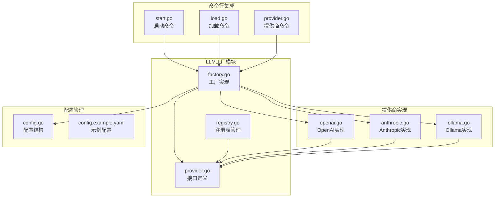

**图表来源**
- [factory.go:1-69](file://internal/llm/factory.go#L1-L69)
- [provider.go:1-114](file://internal/llm/provider.go#L1-L114)
- [openai.go:1-257](file://internal/llm/openai.go#L1-L257)
- [anthropic.go:1-269](file://internal/llm/anthropic.go#L1-L269)
- [ollama.go:1-261](file://internal/llm/ollama.go#L1-L261)

**章节来源**
- [factory.go:1-69](file://internal/llm/factory.go#L1-L69)
- [provider.go:1-114](file://internal/llm/provider.go#L1-L114)

## 核心组件

### 工厂接口和数据结构

工厂模式的核心是Provider接口，它定义了所有LLM提供商必须实现的标准方法：

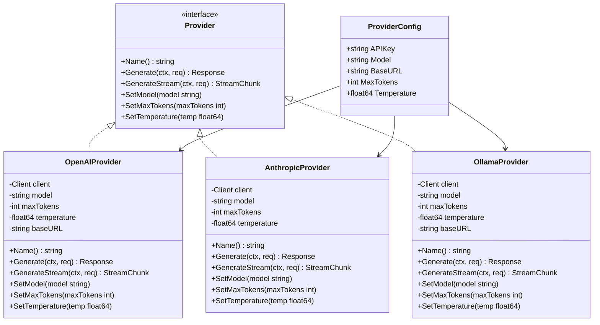

**图表来源**
- [provider.go:64-83](file://internal/llm/provider.go#L64-L83)
- [provider.go:85-92](file://internal/llm/provider.go#L85-L92)
- [openai.go:11-18](file://internal/llm/openai.go#L11-L18)
- [anthropic.go:11-17](file://internal/llm/anthropic.go#L11-L17)
- [ollama.go:11-19](file://internal/llm/ollama.go#L11-L19)

### 工厂函数实现

工厂模式的两个核心函数分别处理不同的创建场景：

#### NewProvider函数
该函数使用配置中的默认提供商进行实例化：

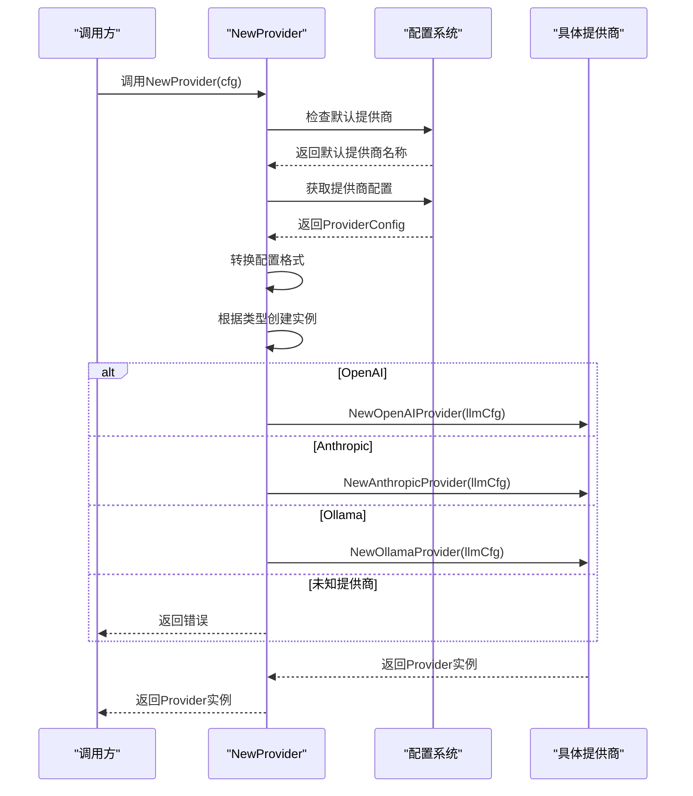

**图表来源**
- [factory.go:9-41](file://internal/llm/factory.go#L9-L41)

#### NewProviderByName函数
该函数允许按指定名称创建提供商实例：

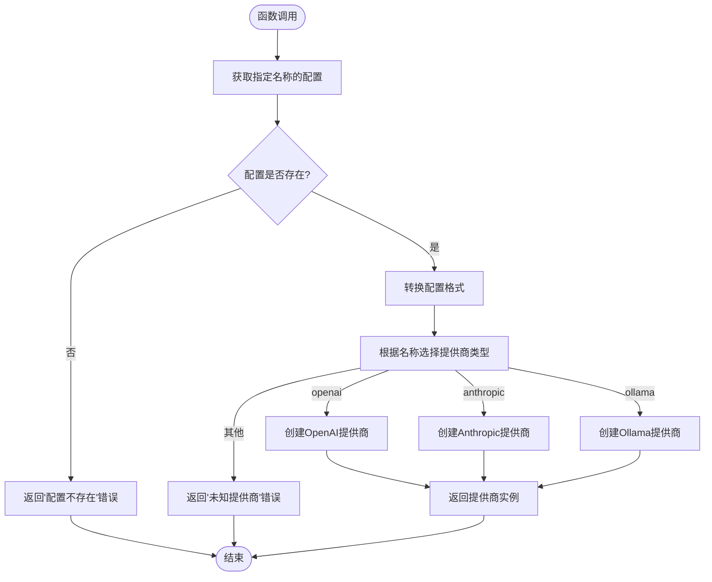

**图表来源**
- [factory.go:43-68](file://internal/llm/factory.go#L43-L68)

**章节来源**
- [factory.go:9-68](file://internal/llm/factory.go#L9-L68)

## 架构概览

LLM提供商工厂采用分层架构设计，确保了良好的可维护性和扩展性：

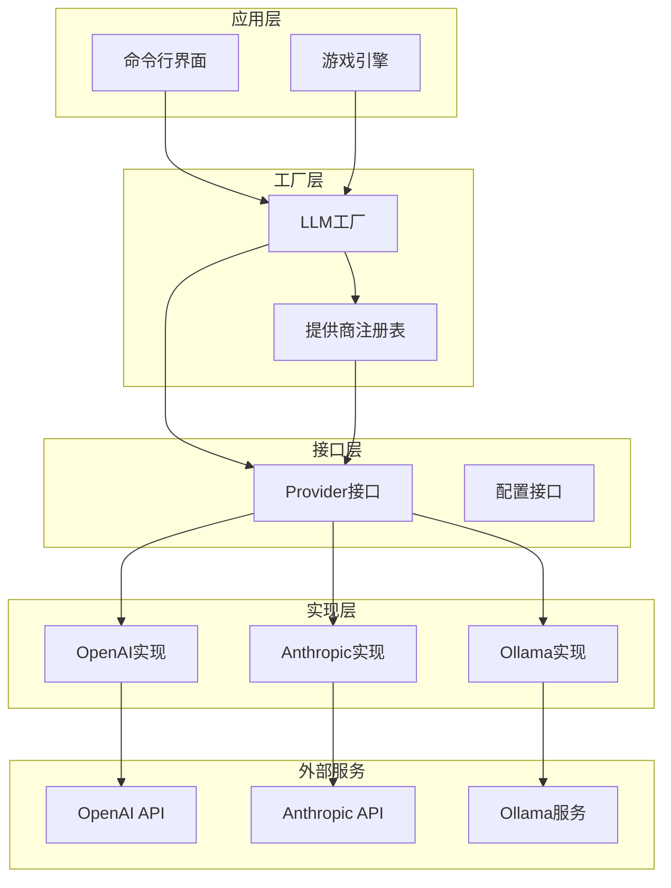

**图表来源**
- [factory.go:1-69](file://internal/llm/factory.go#L1-L69)
- [registry.go:1-140](file://internal/llm/registry.go#L1-L140)
- [provider.go:64-83](file://internal/llm/provider.go#L64-L83)

### 配置管理系统

配置系统提供了灵活的配置管理机制：

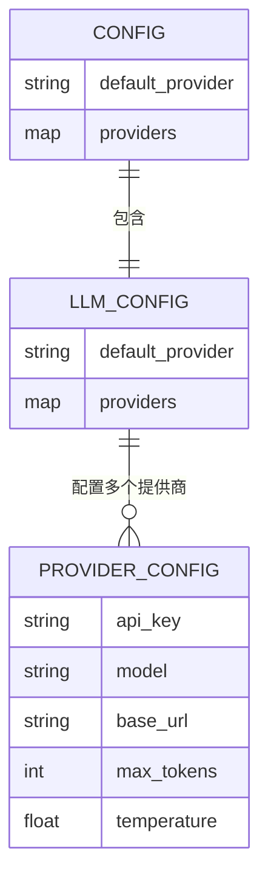

**图表来源**
- [config.go:8-29](file://internal/config/config.go#L8-L29)

**章节来源**
- [config.go:8-29](file://internal/config/config.go#L8-L29)

## 详细组件分析

### OpenAI提供商实现

OpenAI提供商实现了完整的LLM功能，包括标准生成和流式生成：

#### 核心特性
- **API兼容性**：完全兼容OpenAI Chat Completions API
- **工具调用支持**：支持函数调用和工具集成
- **流式响应**：支持实时流式响应处理
- **配置灵活性**：支持自定义BaseURL进行代理或兼容

#### 实现特点
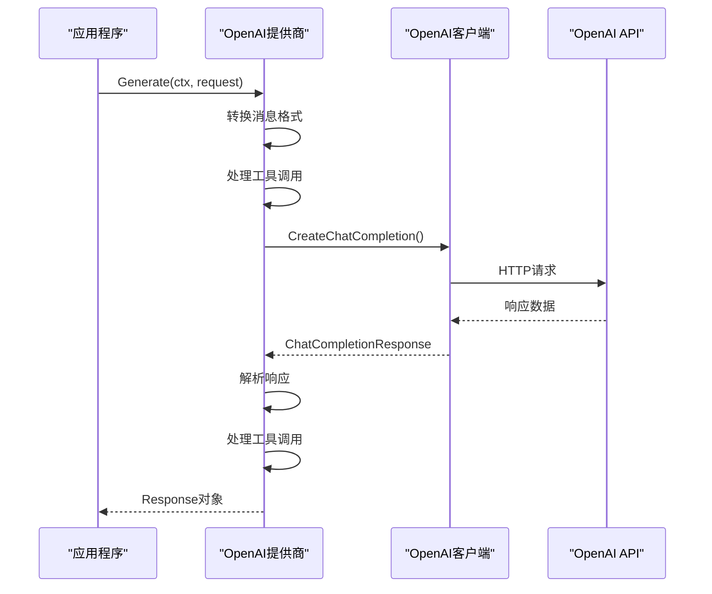

**图表来源**
- [openai.go:41-125](file://internal/llm/openai.go#L41-L125)

**章节来源**
- [openai.go:11-257](file://internal/llm/openai.go#L11-L257)

### Anthropic提供商实现

Anthropic提供商专注于Claude系列模型的支持：

#### 核心特性
- **系统提示支持**：原生支持system角色消息
- **工具调用集成**：支持Claude特定的工具调用格式
- **流式处理**：完整的流式响应支持
- **参数优化**：针对Claude模型的参数优化

#### 实现差异
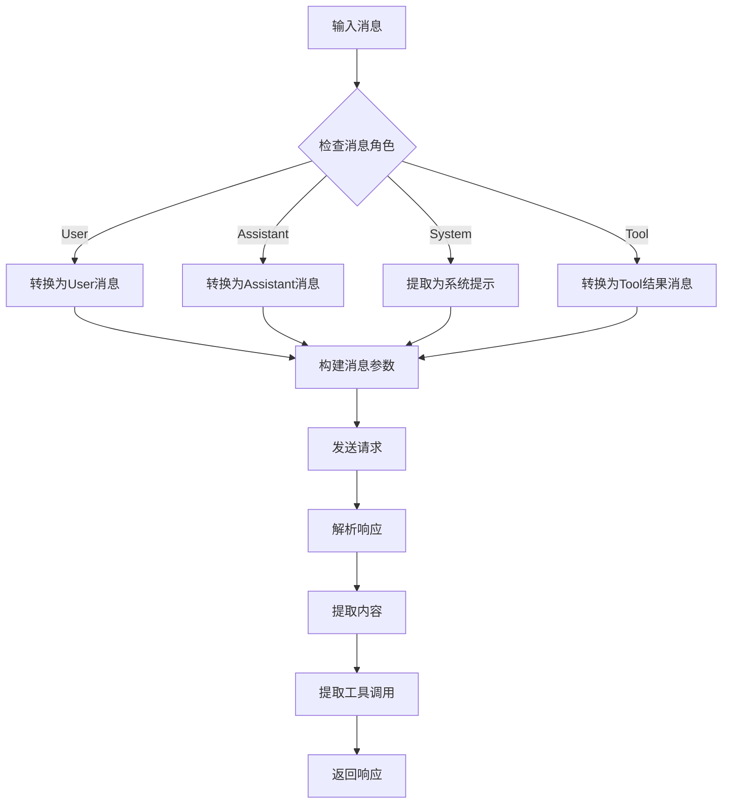

**图表来源**
- [anthropic.go:41-139](file://internal/llm/anthropic.go#L41-L139)

**章节来源**
- [anthropic.go:11-269](file://internal/llm/anthropic.go#L11-L269)

### Ollama提供商实现

Ollama提供商通过OpenAI兼容模式实现本地模型支持：

#### 设计理念
- **兼容性优先**：利用OpenAI SDK进行本地模型访问
- **零配置启动**：默认指向本地11434端口
- **无缝集成**：对上层应用透明，无需修改代码

#### 实现机制
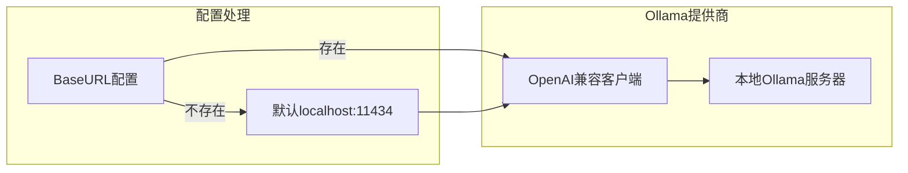

**图表来源**
- [ollama.go:21-38](file://internal/llm/ollama.go#L21-L38)

**章节来源**
- [ollama.go:11-261](file://internal/llm/ollama.go#L11-L261)

### 注册表管理器

注册表提供了动态提供商管理能力：

#### 核心功能
- **并发安全**：使用读写锁保证线程安全
- **动态注册**：支持运行时注册和注销提供商
- **默认提供商管理**：自动管理默认提供商状态
- **全局访问**：提供全局静态方法便于使用

**章节来源**
- [registry.go:8-140](file://internal/llm/registry.go#L8-L140)

## 依赖关系分析

### 外部依赖管理

工厂模式有效隔离了外部依赖：

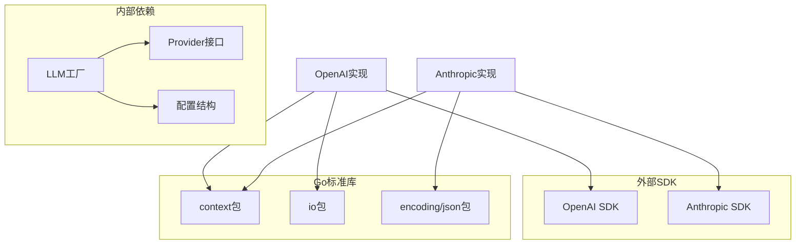

**图表来源**
- [openai.go:3-9](file://internal/llm/openai.go#L3-L9)
- [anthropic.go:3-9](file://internal/llm/anthropic.go#L3-L9)

### 内部模块交互

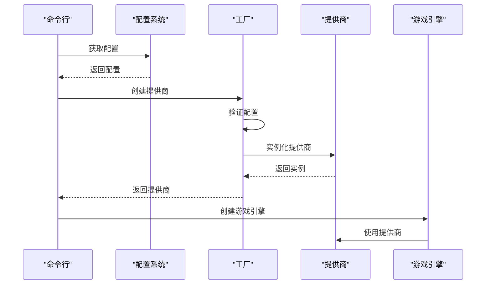

**图表来源**
- [load.go:29-34](file://cmd/load.go#L29-L34)
- [start.go:32-37](file://cmd/start.go#L32-L37)

**章节来源**
- [load.go:1-120](file://cmd/load.go#L1-L120)
- [start.go:1-99](file://cmd/start.go#L1-L99)
- [provider.go:53-94](file://cmd/provider.go#L53-L94)

## 性能考虑

### 并发安全性

工厂和注册表都采用了读写锁机制来保证并发安全：

- **读操作优化**：多个读取操作可以并行执行
- **写操作保护**：注册和注销操作互斥执行
- **最小锁范围**：尽量缩短持有锁的时间

### 内存管理

- **连接池**：SDK客户端通常内置连接池管理
- **流式处理**：流式响应使用通道避免大量内存占用
- **及时释放**：流式连接在完成后及时关闭

### 配置缓存

- **配置预处理**：在工厂中完成配置转换，避免重复计算
- **实例复用**：提供商实例可以在应用生命周期内复用

## 故障排除指南

### 常见错误类型

#### 配置验证错误
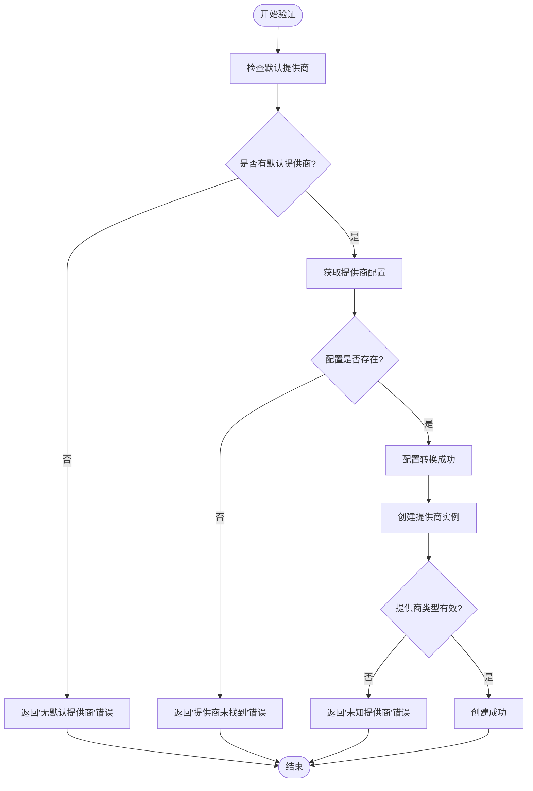

**图表来源**
- [factory.go:11-40](file://internal/llm/factory.go#L11-L40)

#### 调试技巧

1. **配置验证**
   - 检查配置文件格式正确性
   - 验证API密钥的有效性
   - 确认网络连接正常

2. **日志记录**
   ```bash
   # 设置详细日志级别
   export LOG_LEVEL=debug
   
   # 测试特定提供商
   cdnd provider test openai
   ```

3. **环境变量**
   - OpenAI: `OPENAI_API_KEY`
   - Anthropic: `ANTHROPIC_API_KEY`
   - Ollama: 本地服务无需API密钥

**章节来源**
- [factory.go:11-40](file://internal/llm/factory.go#L11-L40)
- [provider.go:53-94](file://cmd/provider.go#L53-L94)

## 结论

CDND项目的LLM提供商工厂展现了优秀的软件工程实践：

### 设计优势
- **高度解耦**：通过接口抽象实现了良好的模块分离
- **灵活扩展**：新增提供商只需实现Provider接口
- **配置驱动**：支持动态配置和热切换
- **错误处理**：完善的错误传播和处理机制

### 最佳实践建议
1. **配置管理**：使用配置文件集中管理提供商设置
2. **错误处理**：在调用方妥善处理工厂返回的错误
3. **资源管理**：合理管理提供商实例的生命周期
4. **监控指标**：添加使用统计和性能监控

### 扩展指南
- 新增提供商时遵循现有接口规范
- 在config.example.yaml中添加示例配置
- 编写相应的单元测试和集成测试
- 更新命令行工具的文档和帮助信息

## 附录

### 支持的提供商列表

| 提供商 | 类型 | 特殊要求 | 默认端点 |
|--------|------|----------|----------|
| openai | 在线API | API密钥 | https://api.openai.com |
| anthropic | 在线API | API密钥 | https://api.anthropic.com |
| ollama | 本地服务 | 本地安装 | http://localhost:11434 |

### 配置示例

完整的配置示例可在config.example.yaml中找到，包含三个提供商的完整配置模板。