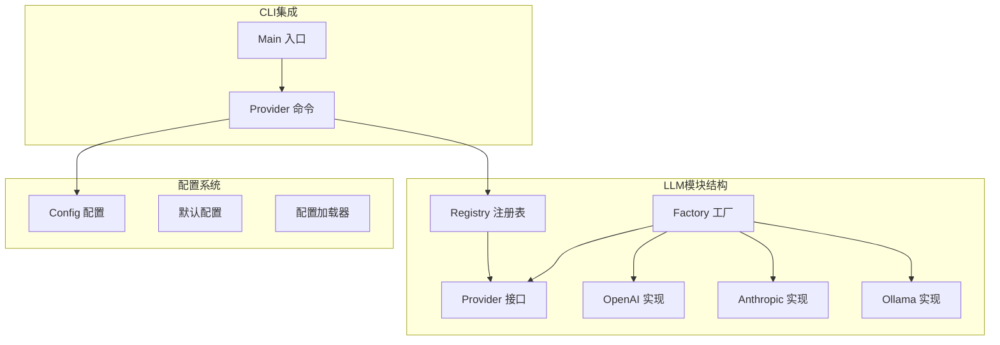
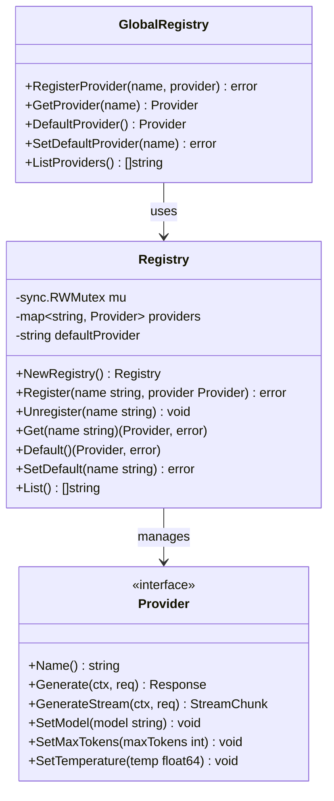
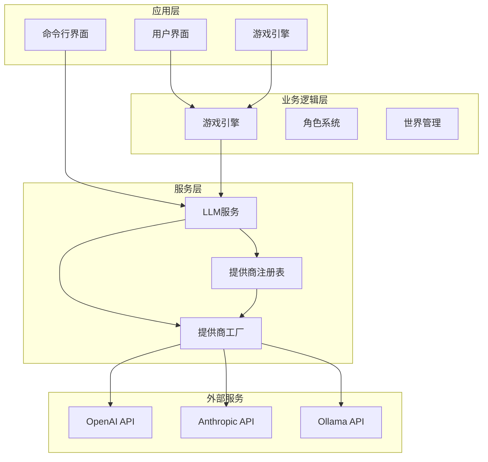
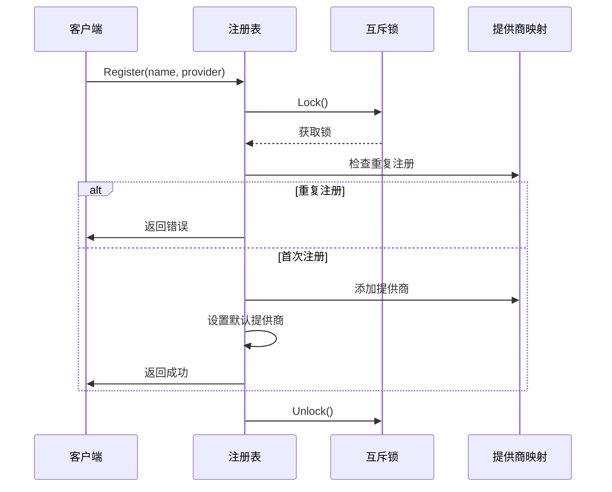
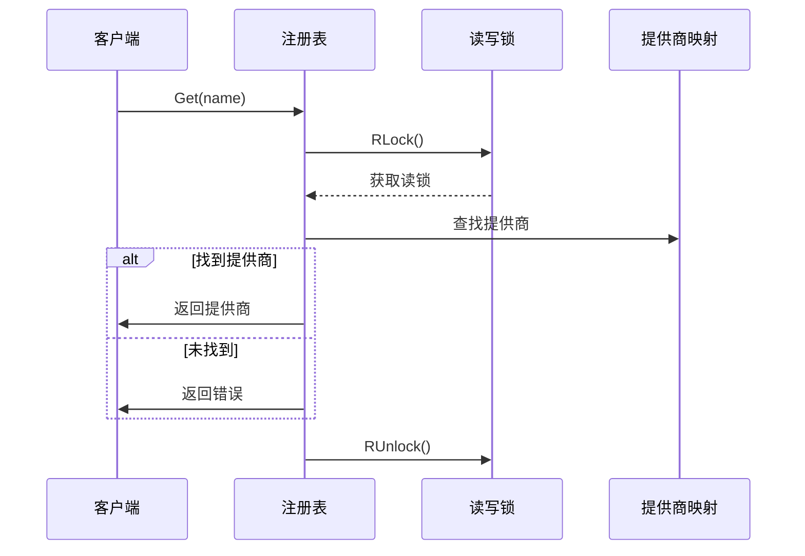
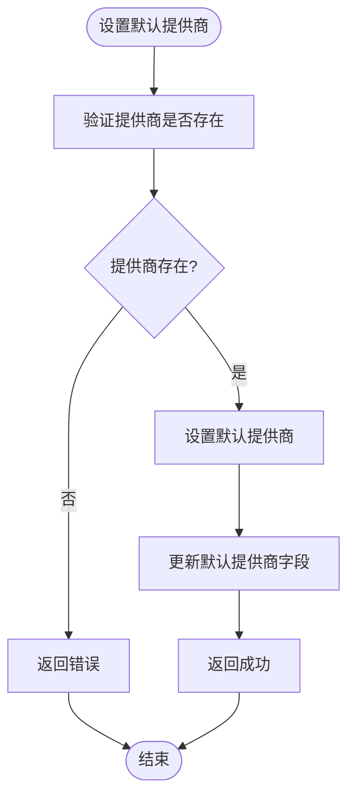
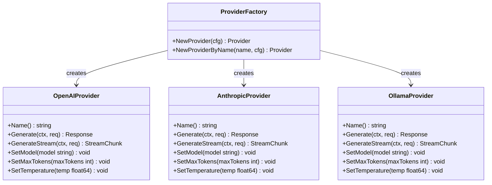
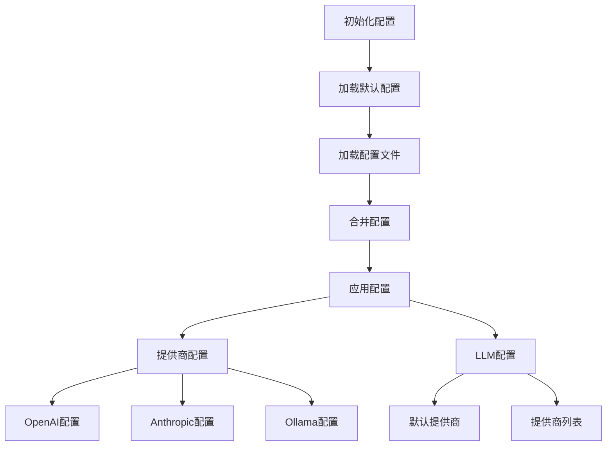
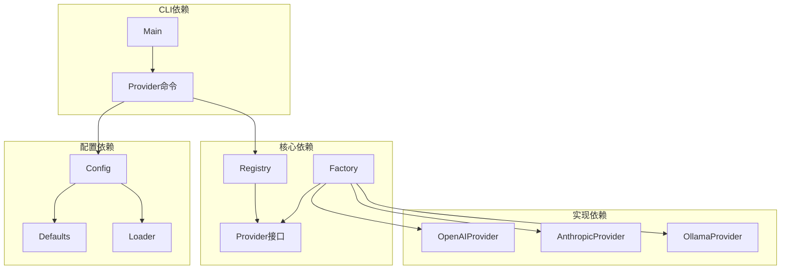
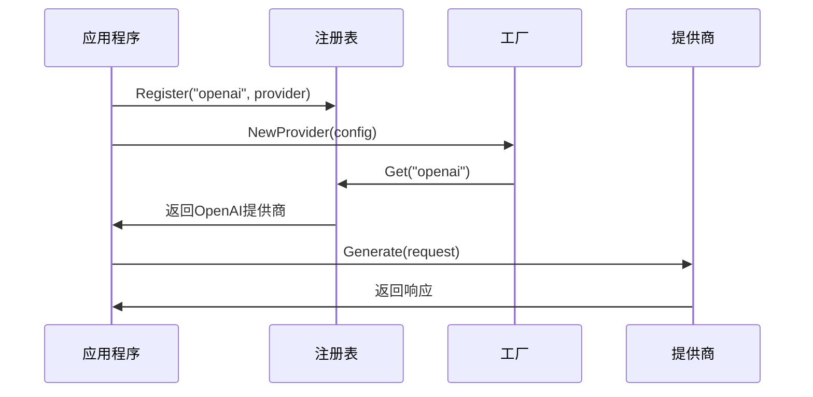

# LLM提供商注册表

<cite>
**本文档引用的文件**
- [registry.go](file://internal/llm/registry.go)
- [provider.go](file://internal/llm/provider.go)
- [factory.go](file://internal/llm/factory.go)
- [openai.go](file://internal/llm/openai.go)
- [anthropic.go](file://internal/llm/anthropic.go)
- [ollama.go](file://internal/llm/ollama.go)
- [config.go](file://internal/config/config.go)
- [defaults.go](file://internal/config/defaults.go)
- [loader.go](file://internal/config/loader.go)
- [provider.go](file://cmd/provider.go)
- [main.go](file://main.go)
</cite>

## 目录
1. [简介](#简介)
2. [项目结构](#项目结构)
3. [核心组件](#核心组件)
4. [架构概览](#架构概览)
5. [详细组件分析](#详细组件分析)
6. [依赖关系分析](#依赖关系分析)
7. [性能考虑](#性能考虑)
8. [故障排除指南](#故障排除指南)
9. [结论](#结论)
10. [附录](#附录)

## 简介

CDND项目中的LLM提供商注册表是一个关键的基础设施组件，负责管理各种大语言模型提供商的注册、查找和生命周期管理。该注册表采用全局单例模式设计，为整个应用程序提供了统一的LLM提供商管理机制。

注册表的核心设计目标包括：
- 提供线程安全的提供商注册和管理
- 支持多种LLM提供商的统一接口抽象
- 实现工厂模式与注册表的协同工作
- 提供全局访问机制和生命周期管理
- 支持动态提供商的注册和注销

## 项目结构

LLM提供商注册表位于internal/llm目录下，与相关的配置管理和CLI命令紧密集成：

**图表来源**
- [registry.go:1-140](file://internal/llm/registry.go#L1-L140)
- [provider.go:1-114](file://internal/llm/provider.go#L1-L114)
- [factory.go:1-69](file://internal/llm/factory.go#L1-L69)

**章节来源**
- [registry.go:1-140](file://internal/llm/registry.go#L1-L140)
- [provider.go:1-114](file://internal/llm/provider.go#L1-L114)
- [factory.go:1-69](file://internal/llm/factory.go#L1-L69)

## 核心组件

### 注册表结构

注册表采用线程安全的设计，使用读写互斥锁确保并发访问的安全性：

**图表来源**
- [registry.go:8-140](file://internal/llm/registry.go#L8-L140)

### 数据结构设计

注册表使用以下核心数据结构：

1. **Provider接口**：定义了LLM提供商的标准接口规范
2. **Registry结构体**：管理提供商的注册表
3. **ProviderConfig**：提供商配置信息
4. **全局注册表实例**：提供便捷的全局访问接口

**章节来源**
- [registry.go:8-140](file://internal/llm/registry.go#L8-L140)
- [provider.go:64-114](file://internal/llm/provider.go#L64-L114)

## 架构概览

LLM提供商注册表在整个系统中的架构位置如下：

**图表来源**
- [registry.go:113-140](file://internal/llm/registry.go#L113-L140)
- [factory.go:9-69](file://internal/llm/factory.go#L9-L69)

## 详细组件分析

### 注册表实现

注册表提供了完整的提供商生命周期管理功能：

#### 注册机制

**图表来源**
- [registry.go:22-39](file://internal/llm/registry.go#L22-L39)

#### 查找机制

**图表来源**
- [registry.go:58-69](file://internal/llm/registry.go#L58-L69)

#### 默认提供商管理

**图表来源**
- [registry.go:88-99](file://internal/llm/registry.go#L88-L99)

**章节来源**
- [registry.go:22-99](file://internal/llm/registry.go#L22-L99)

### 工厂模式集成

工厂模式与注册表的协作关系：

**图表来源**
- [factory.go:9-69](file://internal/llm/factory.go#L9-L69)
- [openai.go:11-34](file://internal/llm/openai.go#L11-L34)
- [anthropic.go:11-34](file://internal/llm/anthropic.go#L11-L34)
- [ollama.go:11-38](file://internal/llm/ollama.go#L11-L38)

**章节来源**
- [factory.go:9-69](file://internal/llm/factory.go#L9-L69)

### 配置管理系统

配置系统为注册表提供了灵活的配置管理：

**图表来源**
- [loader.go:24-70](file://internal/config/loader.go#L24-L70)
- [defaults.go:7-52](file://internal/config/defaults.go#L7-L52)

**章节来源**
- [config.go:8-54](file://internal/config/config.go#L8-L54)
- [loader.go:24-151](file://internal/config/loader.go#L24-L151)
- [defaults.go:7-52](file://internal/config/defaults.go#L7-L52)

## 依赖关系分析

### 组件间依赖关系

**图表来源**
- [registry.go:1-140](file://internal/llm/registry.go#L1-L140)
- [factory.go:1-69](file://internal/llm/factory.go#L1-L69)
- [config.go:1-54](file://internal/config/config.go#L1-L54)

### 外部依赖

系统对外部依赖的管理：

| 依赖包 | 版本 | 用途 | 配置 |
|--------|------|------|------|
| github.com/sashabaranov/go-openai | 最新 | OpenAI API客户端 | BaseURL, APIKey |
| github.com/anthropics/anthropic-sdk-go | 最新 | Anthropic API客户端 | APIKey, BaseURL |
| github.com/spf13/cobra | 最新 | CLI框架 | 命令行接口 |
| github.com/spf13/viper | 最新 | 配置管理 | YAML配置解析 |

**章节来源**
- [openai.go:3-9](file://internal/llm/openai.go#L3-L9)
- [anthropic.go:3-8](file://internal/llm/anthropic.go#L3-L8)
- [provider.go:3-11](file://cmd/provider.go#L3-L11)

## 性能考虑

### 并发安全性

注册表采用了读写分离的并发控制策略：

1. **读操作**：使用读锁，允许多个并发读取
2. **写操作**：使用写锁，确保注册和注销的原子性
3. **默认提供商**：独立的默认提供商字段，避免频繁的映射查找

### 内存管理

1. **延迟初始化**：提供商按需创建，避免不必要的内存占用
2. **连接池**：外部API客户端使用SDK提供的连接池机制
3. **缓存策略**：配置系统使用Viper的内置缓存机制

### 性能优化建议

1. **批量操作**：对于大量提供商的操作，建议使用批量处理
2. **连接复用**：外部API客户端应复用连接以减少建立连接的开销
3. **超时设置**：合理设置API调用超时时间，避免长时间阻塞

## 故障排除指南

### 常见问题及解决方案

#### 注册表相关问题

| 问题 | 可能原因 | 解决方案 |
|------|----------|----------|
| 提供商重复注册 | 同名提供商已存在 | 检查提供商名称唯一性 |
| 获取提供商失败 | 提供商不存在或已被注销 | 验证提供商名称和注册状态 |
| 默认提供商错误 | 默认提供商配置无效 | 检查配置文件中的默认提供商设置 |

#### 工厂模式相关问题

| 问题 | 可能原因 | 解决方案 |
|------|----------|----------|
| 工厂创建失败 | 配置参数不正确 | 验证配置文件中的提供商参数 |
| API调用失败 | 网络连接或认证问题 | 检查网络连接和API密钥配置 |
| 流式响应异常 | 流式连接中断 | 实现适当的重连机制 |

**章节来源**
- [registry.go:27-29](file://internal/llm/registry.go#L27-L29)
- [factory.go:12-14](file://internal/llm/factory.go#L12-L14)

### 调试技巧

1. **启用调试日志**：通过配置系统的日志级别调整
2. **检查配置文件**：验证YAML配置文件的语法和完整性
3. **单元测试**：为注册表和工厂模式编写单元测试
4. **监控指标**：添加性能监控和错误统计

## 结论

CDND项目的LLM提供商注册表是一个设计精良的基础设施组件，它成功地实现了以下目标：

1. **统一接口抽象**：通过Provider接口为不同LLM提供商提供了统一的访问方式
2. **线程安全设计**：采用读写分离的并发控制策略，确保多线程环境下的安全性
3. **灵活的工厂模式**：与工厂模式完美结合，支持动态提供商的创建和管理
4. **配置驱动**：通过配置系统实现了零代码修改的提供商配置
5. **全局访问机制**：提供了便捷的全局注册表实例，简化了使用方式

该注册表为CDND项目提供了强大的LLM提供商管理能力，支持OpenAI、Anthropic和Ollama等多种主流LLM服务，为未来的扩展奠定了良好的基础。

## 附录

### 使用示例

#### 基本使用流程

**图表来源**
- [registry.go:116-119](file://internal/llm/registry.go#L116-L119)
- [factory.go:11-14](file://internal/llm/factory.go#L11-L14)

### 扩展指南

#### 注册新提供商的步骤

1. **实现Provider接口**：创建新的提供商类型并实现所有必需方法
2. **创建工厂函数**：实现NewXxxProvider函数用于创建提供商实例
3. **注册到工厂**：在工厂的switch语句中添加新的提供商类型
4. **更新配置**：在默认配置中添加新提供商的配置项
5. **测试验证**：编写测试用例验证新提供商的功能

#### 自定义选项

1. **配置扩展**：可以在ProviderConfig中添加新的配置选项
2. **接口扩展**：可以在Provider接口中添加新的方法
3. **工厂扩展**：可以实现多个工厂来支持不同的提供商组合
4. **注册表扩展**：可以扩展注册表以支持更复杂的提供商管理需求

**章节来源**
- [provider.go:64-83](file://internal/llm/provider.go#L64-L83)
- [factory.go:30-41](file://internal/llm/factory.go#L30-L41)
- [defaults.go:10-31](file://internal/config/defaults.go#L10-L31)