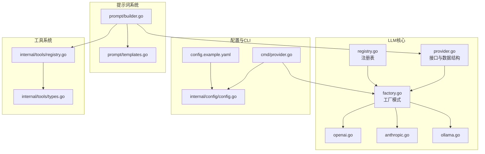
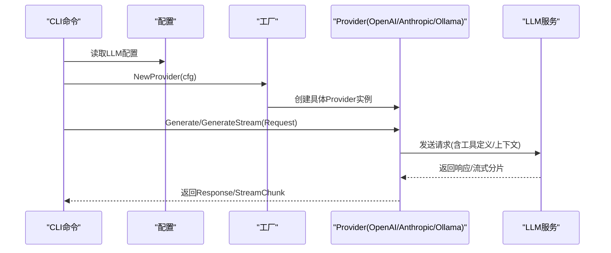
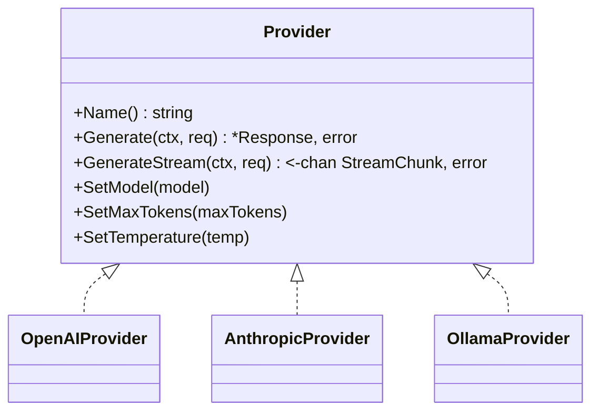
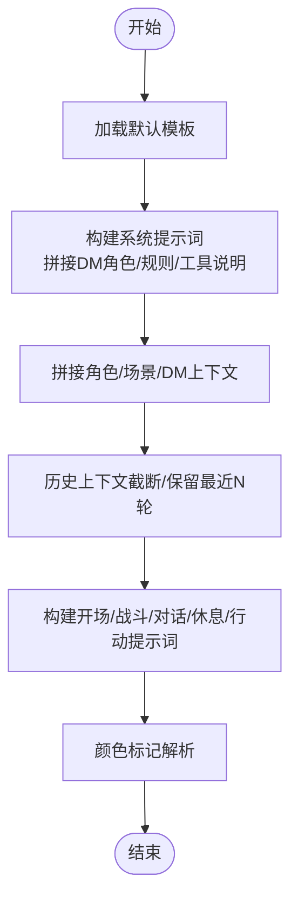
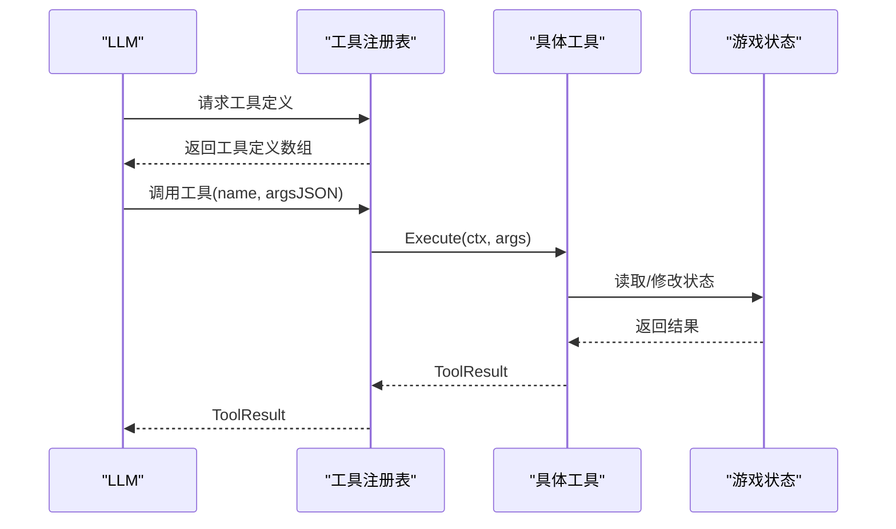
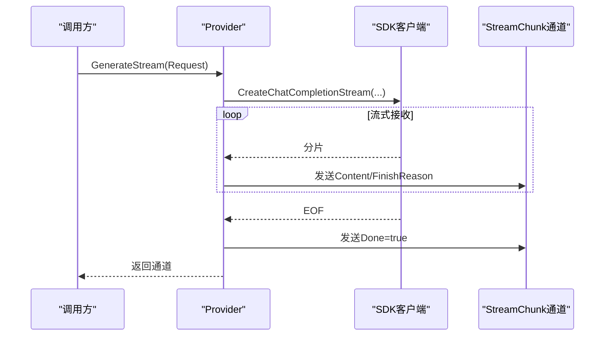
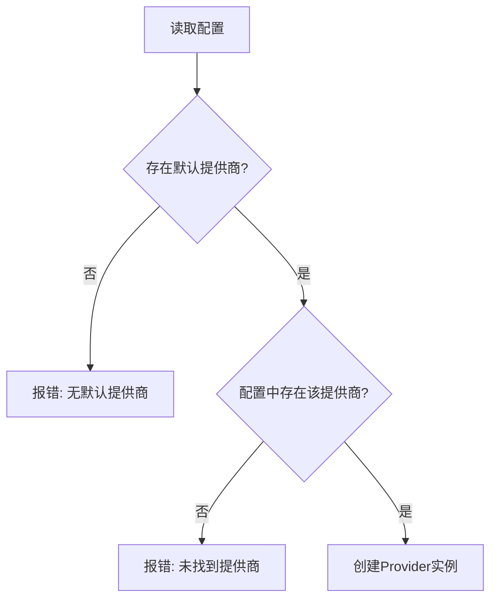
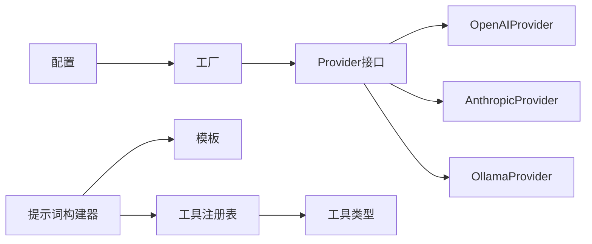

# LLM集成系统

<cite>
**本文档引用的文件**
- [internal/llm/provider.go](file://internal/llm/provider.go)
- [internal/llm/factory.go](file://internal/llm/factory.go)
- [internal/llm/registry.go](file://internal/llm/registry.go)
- [internal/llm/openai.go](file://internal/llm/openai.go)
- [internal/llm/anthropic.go](file://internal/llm/anthropic.go)
- [internal/llm/ollama.go](file://internal/llm/ollama.go)
- [internal/llm/prompt/builder.go](file://internal/llm/prompt/builder.go)
- [internal/llm/prompt/templates.go](file://internal/llm/prompt/templates.go)
- [internal/config/config.go](file://internal/config/config.go)
- [cmd/provider.go](file://cmd/provider.go)
- [internal/tools/registry.go](file://internal/tools/registry.go)
- [internal/tools/types.go](file://internal/tools/types.go)
- [config.example.yaml](file://config.example.yaml)
- [internal/llm/prompt/builder_test.go](file://internal/llm/prompt/builder_test.go)
</cite>

## 目录
1. [简介](#简介)
2. [项目结构](#项目结构)
3. [核心组件](#核心组件)
4. [架构总览](#架构总览)
5. [详细组件分析](#详细组件分析)
6. [依赖关系分析](#依赖关系分析)
7. [性能考量](#性能考量)
8. [故障排查指南](#故障排查指南)
9. [结论](#结论)
10. [附录](#附录)

## 简介
本文件为CDND的LLM集成系统提供全面技术文档。系统采用多提供商架构，统一抽象OpenAI、Anthropic、Ollama等不同LLM服务，通过工厂模式按配置动态创建提供者实例；内置提示词模板系统，支持角色扮演、规则说明、工具调用指令与上下文管理；提供工具注册表与工具定义，实现LLM对游戏世界的可控操作；并通过命令行工具提供提供商列表、测试与默认提供商设置功能。

## 项目结构
LLM相关代码主要位于internal/llm目录，包含：
- 接口与数据结构定义：provider.go
- 工厂与注册表：factory.go、registry.go
- 各提供商实现：openai.go、anthropic.go、ollama.go
- 提示词模板与构建器：prompt/builder.go、prompt/templates.go
- 配置结构：internal/config/config.go
- CLI命令：cmd/provider.go
- 工具系统：internal/tools/registry.go、internal/tools/types.go
- 示例配置：config.example.yaml
- 测试：internal/llm/prompt/builder_test.go

**图表来源**
- [internal/llm/provider.go:64-114](file://internal/llm/provider.go#L64-L114)
- [internal/llm/factory.go:9-68](file://internal/llm/factory.go#L9-L68)
- [internal/llm/registry.go:8-140](file://internal/llm/registry.go#L8-L140)
- [internal/llm/openai.go:11-38](file://internal/llm/openai.go#L11-L38)
- [internal/llm/anthropic.go:11-39](file://internal/llm/anthropic.go#L11-L39)
- [internal/llm/ollama.go:11-43](file://internal/llm/ollama.go#L11-L43)
- [internal/llm/prompt/builder.go:51-73](file://internal/llm/prompt/builder.go#L51-L73)
- [internal/llm/prompt/templates.go:3-12](file://internal/llm/prompt/templates.go#L3-L12)
- [internal/config/config.go:8-54](file://internal/config/config.go#L8-L54)
- [cmd/provider.go:13-128](file://cmd/provider.go#L13-L128)
- [internal/tools/registry.go:10-132](file://internal/tools/registry.go#L10-L132)
- [internal/tools/types.go:24-118](file://internal/tools/types.go#L24-L118)
- [config.example.yaml:5-39](file://config.example.yaml#L5-L39)

**章节来源**
- [internal/llm/provider.go:1-114](file://internal/llm/provider.go#L1-L114)
- [internal/llm/factory.go:1-69](file://internal/llm/factory.go#L1-L69)
- [internal/llm/registry.go:1-140](file://internal/llm/registry.go#L1-L140)
- [internal/llm/openai.go:1-257](file://internal/llm/openai.go#L1-L257)
- [internal/llm/anthropic.go:1-269](file://internal/llm/anthropic.go#L1-L269)
- [internal/llm/ollama.go:1-261](file://internal/llm/ollama.go#L1-L261)
- [internal/llm/prompt/builder.go:1-273](file://internal/llm/prompt/builder.go#L1-L273)
- [internal/llm/prompt/templates.go:1-102](file://internal/llm/prompt/templates.go#L1-L102)
- [internal/config/config.go:1-54](file://internal/config/config.go#L1-L54)
- [cmd/provider.go:1-128](file://cmd/provider.go#L1-L128)
- [internal/tools/registry.go:1-132](file://internal/tools/registry.go#L1-L132)
- [internal/tools/types.go:1-118](file://internal/tools/types.go#L1-L118)
- [config.example.yaml:1-72](file://config.example.yaml#L1-L72)

## 核心组件
- 统一接口Provider：定义名称、同步与流式生成、模型/令牌/温度设置等方法，屏蔽各提供商差异。
- 请求/响应模型：Request、Response、Usage、StreamChunk等，支持工具调用与FinishReason。
- 工厂模式：根据配置创建OpenAI、Anthropic、Ollama提供者实例。
- 注册表Registry：提供注册、注销、获取默认、设置默认、列举等功能，支持并发安全。
- 提示词模板系统：Templates提供默认中文模板，Builder负责拼装系统提示、角色/场景/历史上下文、工具调用说明等。
- 工具系统：工具注册表与工具定义，支持从LLM返回的工具调用执行。

**章节来源**
- [internal/llm/provider.go:64-114](file://internal/llm/provider.go#L64-L114)
- [internal/llm/factory.go:9-68](file://internal/llm/factory.go#L9-L68)
- [internal/llm/registry.go:8-140](file://internal/llm/registry.go#L8-L140)
- [internal/llm/prompt/templates.go:3-12](file://internal/llm/prompt/templates.go#L3-L12)
- [internal/llm/prompt/builder.go:51-112](file://internal/llm/prompt/builder.go#L51-L112)
- [internal/tools/registry.go:10-77](file://internal/tools/registry.go#L10-L77)
- [internal/tools/types.go:24-67](file://internal/tools/types.go#L24-L67)

## 架构总览
系统通过工厂模式按配置选择具体提供商，统一接口面向上层调用；提示词构建器将游戏上下文注入系统提示；工具注册表将LLM的工具调用映射到实际游戏状态操作。

**图表来源**
- [cmd/provider.go:53-94](file://cmd/provider.go#L53-L94)
- [internal/llm/factory.go:9-68](file://internal/llm/factory.go#L9-L68)
- [internal/llm/openai.go:41-125](file://internal/llm/openai.go#L41-L125)
- [internal/llm/anthropic.go:41-139](file://internal/llm/anthropic.go#L41-L139)
- [internal/llm/ollama.go:45-129](file://internal/llm/ollama.go#L45-L129)

## 详细组件分析

### 工厂模式与提供商选择
- NewProvider：依据配置中的默认提供商名称，创建对应Provider实例；若配置缺失或未知提供商则报错。
- NewProviderByName：按指定名称创建Provider，便于CLI切换测试不同提供商。
- 各Provider均实现Provider接口，包含Name、Generate、GenerateStream、SetModel/SetMaxTokens/SetTemperature。

**图表来源**
- [internal/llm/provider.go:64-83](file://internal/llm/provider.go#L64-L83)
- [internal/llm/openai.go:11-38](file://internal/llm/openai.go#L11-L38)
- [internal/llm/anthropic.go:11-39](file://internal/llm/anthropic.go#L11-L39)
- [internal/llm/ollama.go:11-43](file://internal/llm/ollama.go#L11-L43)

**章节来源**
- [internal/llm/factory.go:9-68](file://internal/llm/factory.go#L9-L68)
- [internal/llm/openai.go:20-38](file://internal/llm/openai.go#L20-L38)
- [internal/llm/anthropic.go:19-39](file://internal/llm/anthropic.go#L19-L39)
- [internal/llm/ollama.go:21-43](file://internal/llm/ollama.go#L21-L43)

### 提示词模板系统
- Templates：提供DM角色、游戏规则、工具调用说明、开场、战斗、对话、休息等模板。
- Builder：构建系统提示词、角色上下文、场景上下文、历史上下文截断、开场/战斗/对话/休息/玩家行动提示词；支持颜色标记解析（{{type:内容}}）。
- 颜色标记解析：通过正则替换将标记转换为带样式的文本，便于UI渲染。

**图表来源**
- [internal/llm/prompt/templates.go:14-101](file://internal/llm/prompt/templates.go#L14-L101)
- [internal/llm/prompt/builder.go:75-112](file://internal/llm/prompt/builder.go#L75-L112)
- [internal/llm/prompt/builder.go:114-179](file://internal/llm/prompt/builder.go#L114-L179)
- [internal/llm/prompt/builder.go:181-211](file://internal/llm/prompt/builder.go#L181-L211)
- [internal/llm/prompt/builder.go:213-273](file://internal/llm/prompt/builder.go#L213-L273)

**章节来源**
- [internal/llm/prompt/templates.go:3-12](file://internal/llm/prompt/templates.go#L3-L12)
- [internal/llm/prompt/builder.go:51-112](file://internal/llm/prompt/builder.go#L51-L112)
- [internal/llm/prompt/builder.go:28-49](file://internal/llm/prompt/builder.go#L28-L49)
- [internal/llm/prompt/builder_test.go:8-96](file://internal/llm/prompt/builder_test.go#L8-L96)

### 工具调用与执行
- 工具定义：ToolDefinition/ToolFunctionDefinition，由工具注册表统一收集并传给LLM。
- 工具执行：Registry.Execute/ExecuteFromJSON，将LLM返回的工具调用参数解析并执行，返回ToolResult。
- 上下文解耦：StateAccessor接口隔离工具与游戏状态，避免循环依赖。

**图表来源**
- [internal/tools/registry.go:43-65](file://internal/tools/registry.go#L43-L65)
- [internal/tools/types.go:24-42](file://internal/tools/types.go#L24-L42)
- [internal/tools/types.go:57-67](file://internal/tools/types.go#L57-L67)

**章节来源**
- [internal/tools/registry.go:10-77](file://internal/tools/registry.go#L10-L77)
- [internal/tools/types.go:24-67](file://internal/tools/types.go#L24-L67)

### 同步与流式调用流程
- 同步生成：各Provider将内部消息转换为对应SDK请求，调用CreateChatCompletion，解析响应为统一Response。
- 流式生成：各Provider将Stream=true，持续接收分片，封装为StreamChunk通道，EOF时发送Done=true，错误时发送Error。

**图表来源**
- [internal/llm/openai.go:127-211](file://internal/llm/openai.go#L127-L211)
- [internal/llm/anthropic.go:141-227](file://internal/llm/anthropic.go#L141-L227)
- [internal/llm/ollama.go:131-215](file://internal/llm/ollama.go#L131-L215)

**章节来源**
- [internal/llm/openai.go:41-125](file://internal/llm/openai.go#L41-L125)
- [internal/llm/openai.go:127-211](file://internal/llm/openai.go#L127-L211)
- [internal/llm/anthropic.go:41-139](file://internal/llm/anthropic.go#L41-L139)
- [internal/llm/anthropic.go:141-227](file://internal/llm/anthropic.go#L141-L227)
- [internal/llm/ollama.go:45-129](file://internal/llm/ollama.go#L45-L129)
- [internal/llm/ollama.go:131-215](file://internal/llm/ollama.go#L131-L215)

### 配置与CLI
- 配置结构：LLMConfig包含DefaultProvider与Providers映射，ProviderConfig包含APIKey、Model、BaseURL、MaxTokens、Temperature。
- CLI命令：provider list/test/set-default，支持测试提供商连通性与设置默认提供商。

**图表来源**
- [internal/config/config.go:8-29](file://internal/config/config.go#L8-L29)
- [cmd/provider.go:53-94](file://cmd/provider.go#L53-L94)
- [internal/llm/factory.go:11-41](file://internal/llm/factory.go#L11-L41)

**章节来源**
- [internal/config/config.go:8-29](file://internal/config/config.go#L8-L29)
- [cmd/provider.go:13-128](file://cmd/provider.go#L13-L128)
- [config.example.yaml:5-39](file://config.example.yaml#L5-L39)

## 依赖关系分析
- Provider接口与数据结构独立于具体实现，降低耦合。
- 工厂依赖配置模块，注册表提供全局状态管理。
- 提示词构建器依赖模板与工具注册表，间接依赖游戏状态。
- 各Provider依赖对应SDK，但对外暴露统一接口。

**图表来源**
- [internal/llm/factory.go:9-68](file://internal/llm/factory.go#L9-L68)
- [internal/llm/provider.go:64-114](file://internal/llm/provider.go#L64-L114)
- [internal/llm/openai.go:11-38](file://internal/llm/openai.go#L11-L38)
- [internal/llm/anthropic.go:11-39](file://internal/llm/anthropic.go#L11-L39)
- [internal/llm/ollama.go:11-43](file://internal/llm/ollama.go#L11-L43)
- [internal/llm/prompt/builder.go:51-73](file://internal/llm/prompt/builder.go#L51-L73)
- [internal/llm/prompt/templates.go:3-12](file://internal/llm/prompt/templates.go#L3-L12)
- [internal/tools/registry.go:10-77](file://internal/tools/registry.go#L10-L77)
- [internal/tools/types.go:24-67](file://internal/tools/types.go#L24-L67)

**章节来源**
- [internal/llm/factory.go:1-69](file://internal/llm/factory.go#L1-L69)
- [internal/llm/registry.go:1-140](file://internal/llm/registry.go#L1-L140)
- [internal/llm/prompt/builder.go:1-273](file://internal/llm/prompt/builder.go#L1-L273)
- [internal/tools/registry.go:1-132](file://internal/tools/registry.go#L1-L132)

## 性能考量
- 流式输出：优先使用GenerateStream以提升交互体验，减少首字节延迟。
- 历史上下文截断：Builder提供基于轮次的简化截断，建议结合Token估算实现更精确的上下文裁剪。
- 并发安全：注册表使用读写锁，适合高并发场景下的提供者注册与查询。
- 缓存策略：配置中提供缓存开关与TTL，可在上层业务中结合LLM响应缓存以降低重复调用成本。
- 模型与温度：合理设置MaxTokens与Temperature，平衡质量与成本。

[本节为通用性能建议，无需特定文件引用]

## 故障排查指南
- 提供商测试：使用CLI命令provider test快速验证连通性与基本响应。
- 错误处理：各Provider在SDK调用失败时直接返回错误；流式场景需监听StreamChunk.Error并在EOF后关闭通道。
- 配置校验：确认配置文件中默认提供商与对应项存在，API密钥（除本地Ollama外）正确设置。
- 工具调用：若LLM返回工具调用但工具未注册，将导致执行失败；确保工具注册表包含所需工具定义。

**章节来源**
- [cmd/provider.go:53-94](file://cmd/provider.go#L53-L94)
- [internal/llm/openai.go:89-92](file://internal/llm/openai.go#L89-L92)
- [internal/llm/anthropic.go:101-104](file://internal/llm/anthropic.go#L101-L104)
- [internal/llm/ollama.go:93-96](file://internal/llm/ollama.go#L93-L96)
- [internal/llm/openai.go:187-196](file://internal/llm/openai.go#L187-L196)
- [internal/llm/anthropic.go:221-224](file://internal/llm/anthropic.go#L221-L224)
- [internal/llm/ollama.go:191-199](file://internal/llm/ollama.go#L191-L199)

## 结论
本系统通过统一接口与工厂模式实现了多提供商的无缝接入，配合提示词模板与工具系统，为D&D叙事提供了可控且可扩展的LLM集成方案。建议在生产环境中结合缓存、流式输出与上下文裁剪策略，进一步优化性能与成本。

[本节为总结性内容，无需特定文件引用]

## 附录

### API差异与适配层
- OpenAI：使用openai.ChatCompletionRequest，支持工具定义与ToolChoice；流式通过SDK流式接口。
- Anthropic：使用Messages.New/Messages.NewStreaming，系统提示通过System字段传递；工具通过Tools参数传递。
- Ollama：兼容OpenAI API，通过自定义BaseURL连接本地服务，无需API密钥。

**章节来源**
- [internal/llm/openai.go:64-87](file://internal/llm/openai.go#L64-L87)
- [internal/llm/openai.go:150-174](file://internal/llm/openai.go#L150-L174)
- [internal/llm/anthropic.go:69-99](file://internal/llm/anthropic.go#L69-L99)
- [internal/llm/anthropic.go:169-199](file://internal/llm/anthropic.go#L169-L199)
- [internal/llm/ollama.go:22-37](file://internal/llm/ollama.go#L22-L37)

### 扩展新LLM提供商指南
- 实现步骤
  1) 定义Provider实现：实现Name、Generate、GenerateStream、SetModel/SetMaxTokens/SetTemperature。
  2) 消息转换：将内部Message转换为目标SDK的消息结构，处理tool/assistant消息。
  3) 工具定义：将内部ToolDefinition转换为目标SDK的工具定义格式。
  4) 工厂扩展：在工厂switch中增加新提供商分支。
  5) 配置支持：在配置结构中新增提供商项，并在CLI中完善测试逻辑。
- 最佳实践
  - 保持接口一致，避免破坏统一抽象。
  - 对SDK错误进行包装与分类，便于上层处理。
  - 提供流式与非流式两种路径，满足不同场景需求。
  - 在提示词模板中补充该提供商的特性说明与限制。

**章节来源**
- [internal/llm/provider.go:64-83](file://internal/llm/provider.go#L64-L83)
- [internal/llm/openai.go:228-256](file://internal/llm/openai.go#L228-L256)
- [internal/llm/anthropic.go:244-268](file://internal/llm/anthropic.go#L244-L268)
- [internal/llm/ollama.go:232-260](file://internal/llm/ollama.go#L232-L260)
- [internal/llm/factory.go:30-40](file://internal/llm/factory.go#L30-L40)
- [internal/config/config.go:16-29](file://internal/config/config.go#L16-L29)
- [cmd/provider.go:53-94](file://cmd/provider.go#L53-L94)

### 安全与最佳实践
- API密钥管理：优先通过环境变量或配置文件管理，避免硬编码；本地Ollama可无需密钥。
- 请求过滤与响应验证：在调用前对消息与工具参数进行校验；对响应进行完整性检查（如choices长度、finish_reason）。
- 超时与重试：建议在上层业务中为LLM调用设置context超时与指数退避重试策略（当前代码未内置重试逻辑）。
- Token控制：结合上下文截断与最大tokens限制，防止昂贵调用。
- 日志与监控：利用配置中的日志级别与文件输出，记录关键指标与错误堆栈。

**章节来源**
- [config.example.yaml:13-38](file://config.example.yaml#L13-L38)
- [internal/llm/openai.go:94-96](file://internal/llm/openai.go#L94-L96)
- [internal/llm/anthropic.go:131-136](file://internal/llm/anthropic.go#L131-L136)
- [internal/llm/ollama.go:98-100](file://internal/llm/ollama.go#L98-L100)
- [internal/config/config.go:47-53](file://internal/config/config.go#L47-L53)