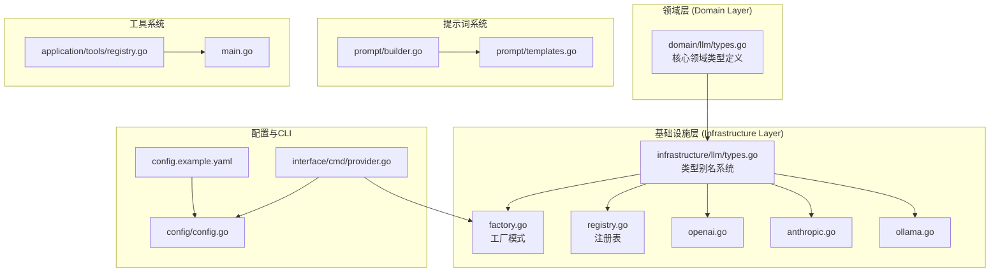
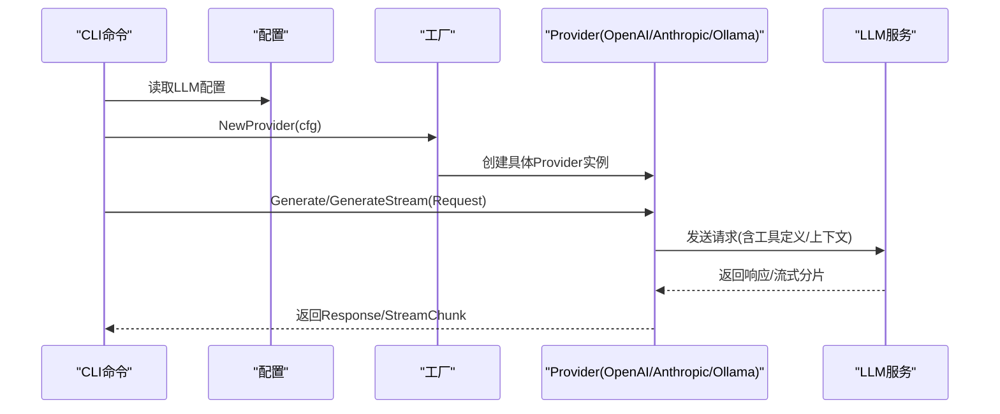
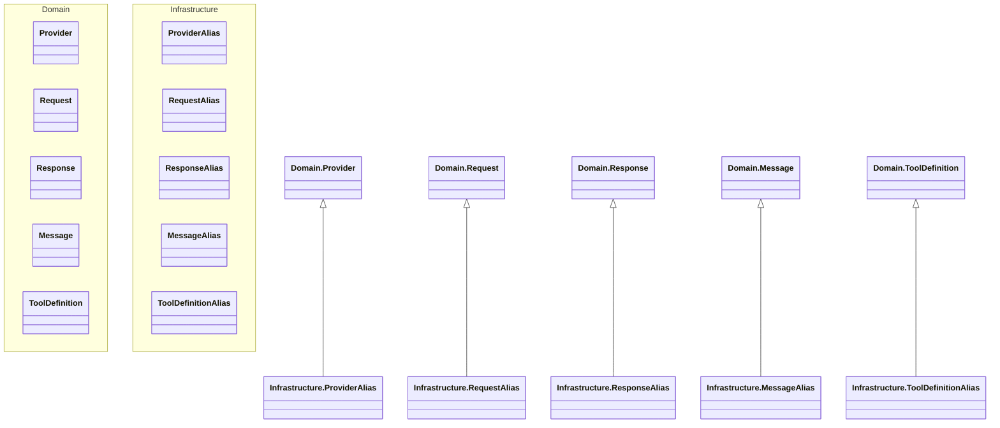
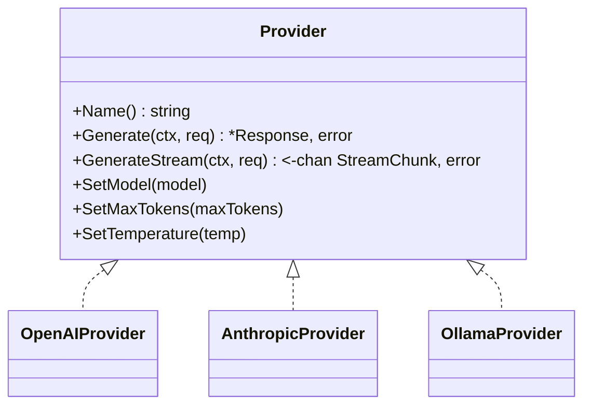
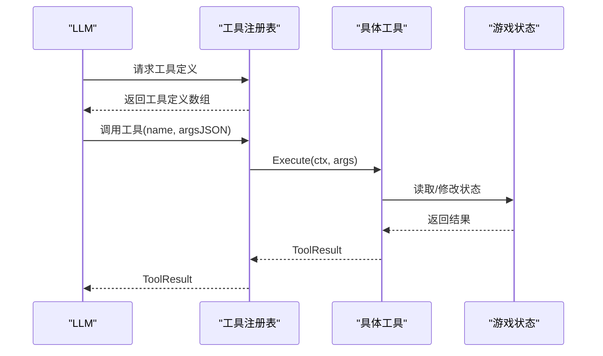
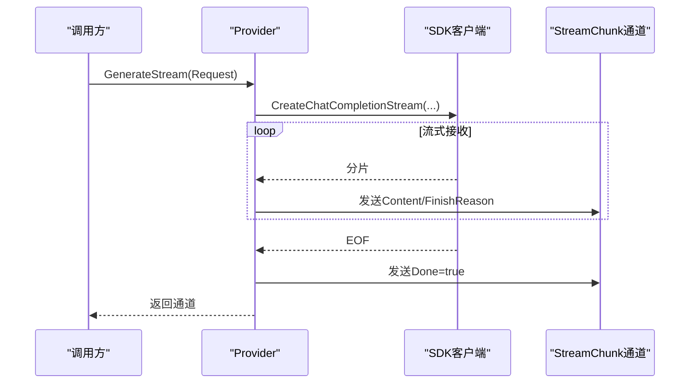
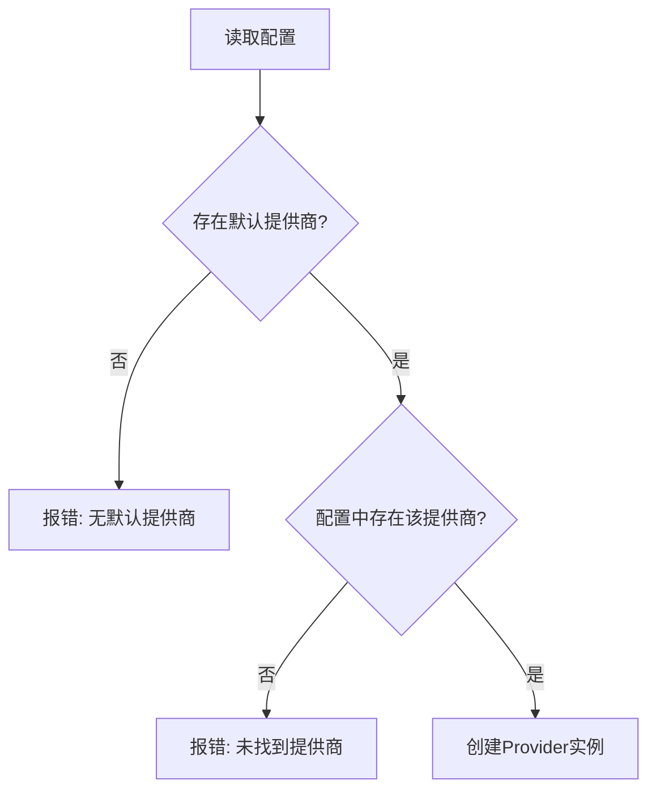
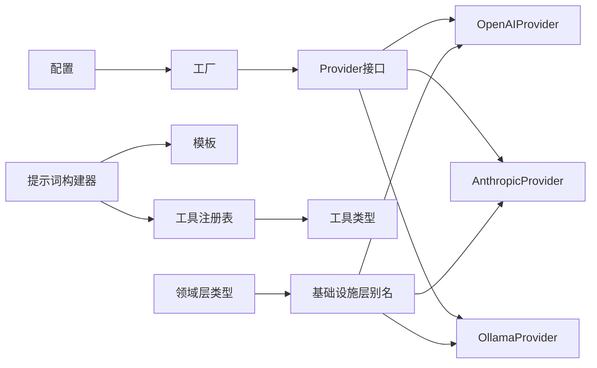

# LLM集成系统

<cite>
**本文档引用的文件**
- [infrastructure/llm/types.go](file://infrastructure/llm/types.go)
- [domain/llm/types.go](file://domain/llm/types.go)
- [infrastructure/llm/factory.go](file://infrastructure/llm/factory.go)
- [infrastructure/llm/registry.go](file://infrastructure/llm/registry.go)
- [infrastructure/llm/openai.go](file://infrastructure/llm/openai.go)
- [infrastructure/llm/anthropic.go](file://infrastructure/llm/anthropic.go)
- [infrastructure/llm/ollama.go](file://infrastructure/llm/ollama.go)
- [infrastructure/prompt/builder.go](file://infrastructure/prompt/builder.go)
- [infrastructure/prompt/templates.go](file://infrastructure/prompt/templates.go)
- [infrastructure/config/config.go](file://infrastructure/config/config.go)
- [interface/cmd/provider.go](file://interface/cmd/provider.go)
- [application/tools/registry.go](file://application/tools/registry.go)
- [main.go](file://main.go)
- [config.example.yaml](file://config.example.yaml)
</cite>

## 更新摘要
**所做更改**
- 新增基础设施层类型别名系统，通过 infrastructure/llm/types.go 为 domain/llm 中的核心类型提供别名
- 明确划分领域逻辑与基础设施实现边界，提升架构清晰度
- 更新工厂模式与提供商实现，确保类型兼容性
- 完善项目结构图，反映新的分层架构

## 目录
1. [简介](#简介)
2. [项目结构](#项目结构)
3. [核心组件](#核心组件)
4. [架构总览](#架构总览)
5. [详细组件分析](#详细组件分析)
6. [依赖关系分析](#依赖关系分析)
7. [性能考量](#性能考量)
8. [故障排查指南](#故障排查指南)
9. [结论](#结论)
10. [附录](#附录)

## 简介
本文件为CDND的LLM集成系统提供全面技术文档。系统采用多提供商架构，统一抽象OpenAI、Anthropic、Ollama等不同LLM服务，通过工厂模式按配置动态创建提供者实例；内置提示词模板系统，支持角色扮演、规则说明、工具调用指令与上下文管理；提供工具注册表与工具定义，实现LLM对游戏世界的可控操作；并通过命令行工具提供提供商列表、测试与默认提供商设置功能。

**重大更新**：系统现已采用清晰的分层架构，通过基础设施层的类型别名系统为领域层提供统一的类型定义，实现了领域逻辑与基础设施实现的明确分离。

## 项目结构
LLM相关代码现已采用分层架构，主要分为领域层和基础设施层：

### 领域层 (domain/llm)
- 核心类型定义：types.go（Provider接口、Request/Response结构、工具定义等）

### 基础设施层 (infrastructure/llm)
- 类型别名系统：types.go（为领域类型提供基础设施层别名）
- 工厂与注册表：factory.go、registry.go
- 各提供商实现：openai.go、anthropic.go、ollama.go
- 提示词模板与构建器：prompt/builder.go、prompt/templates.go
- 配置结构：config/config.go
- CLI命令：interface/cmd/provider.go
- 工具系统：application/tools/registry.go
- 主程序入口：main.go

**图表来源**
- [domain/llm/types.go:1-114](file://domain/llm/types.go#L1-L114)
- [infrastructure/llm/types.go:1-21](file://infrastructure/llm/types.go#L1-L21)
- [infrastructure/llm/factory.go:1-70](file://infrastructure/llm/factory.go#L1-L70)
- [infrastructure/llm/registry.go:1-140](file://infrastructure/llm/registry.go#L1-L140)
- [infrastructure/llm/openai.go:1-258](file://infrastructure/llm/openai.go#L1-L258)
- [infrastructure/llm/anthropic.go:1-270](file://infrastructure/llm/anthropic.go#L1-L270)
- [infrastructure/llm/ollama.go:1-262](file://infrastructure/llm/ollama.go#L1-L262)
- [infrastructure/prompt/builder.go:1-370](file://infrastructure/prompt/builder.go#L1-L370)
- [infrastructure/prompt/templates.go:1-136](file://infrastructure/prompt/templates.go#L1-L136)
- [infrastructure/config/config.go:1-54](file://infrastructure/config/config.go#L1-L54)
- [interface/cmd/provider.go:1-129](file://interface/cmd/provider.go#L1-L129)
- [application/tools/registry.go:1-109](file://application/tools/registry.go#L1-L109)
- [main.go:1-26](file://main.go#L1-L26)

**章节来源**
- [domain/llm/types.go:1-114](file://domain/llm/types.go#L1-L114)
- [infrastructure/llm/types.go:1-21](file://infrastructure/llm/types.go#L1-L21)
- [infrastructure/llm/factory.go:1-70](file://infrastructure/llm/factory.go#L1-L70)
- [infrastructure/llm/registry.go:1-140](file://infrastructure/llm/registry.go#L1-L140)
- [infrastructure/llm/openai.go:1-258](file://infrastructure/llm/openai.go#L1-L258)
- [infrastructure/llm/anthropic.go:1-270](file://infrastructure/llm/anthropic.go#L1-L270)
- [infrastructure/llm/ollama.go:1-262](file://infrastructure/llm/ollama.go#L1-L262)
- [infrastructure/prompt/builder.go:1-370](file://infrastructure/prompt/builder.go#L1-L370)
- [infrastructure/prompt/templates.go:1-136](file://infrastructure/prompt/templates.go#L1-L136)
- [infrastructure/config/config.go:1-54](file://infrastructure/config/config.go#L1-L54)
- [interface/cmd/provider.go:1-129](file://interface/cmd/provider.go#L1-L129)
- [application/tools/registry.go:1-109](file://application/tools/registry.go#L1-L109)
- [main.go:1-26](file://main.go#L1-L26)

## 核心组件
- **领域层核心类型**：Provider接口、Request/Response结构、Message/Tool定义等，定义LLM集成的抽象规范
- **基础设施层类型别名**：通过types.go为领域类型提供基础设施层实现，确保类型兼容性
- **统一接口Provider**：定义名称、同步与流式生成、模型/令牌/温度设置等方法，屏蔽各提供商差异
- **请求/响应模型**：Request、Response、Usage、StreamChunk等，支持工具调用与FinishReason
- **工厂模式**：根据配置创建OpenAI、Anthropic、Ollama提供者实例
- **注册表Registry**：提供注册、注销、获取默认、设置默认、列举等功能，支持并发安全
- **提示词模板系统**：Templates提供默认中文模板，Builder负责拼装系统提示、角色/场景/历史上下文、工具调用说明等
- **工具系统**：工具注册表与工具定义，支持从LLM返回的工具调用执行

**章节来源**
- [domain/llm/types.go:64-114](file://domain/llm/types.go#L64-L114)
- [infrastructure/llm/types.go:7-20](file://infrastructure/llm/types.go#L7-L20)
- [infrastructure/llm/factory.go:10-70](file://infrastructure/llm/factory.go#L10-L70)
- [infrastructure/llm/registry.go:8-140](file://infrastructure/llm/registry.go#L8-L140)
- [infrastructure/prompt/templates.go:3-13](file://infrastructure/prompt/templates.go#L3-L13)
- [infrastructure/prompt/builder.go:54-76](file://infrastructure/prompt/builder.go#L54-L76)
- [application/tools/registry.go:9-109](file://application/tools/registry.go#L9-L109)

## 架构总览
系统通过清晰的分层架构实现：领域层定义抽象规范，基础设施层提供具体实现，类型别名系统确保两者间的兼容性。工厂模式按配置选择具体提供商，统一接口面向上层调用；提示词构建器将游戏上下文注入系统提示；工具注册表将LLM的工具调用映射到实际游戏状态操作。

**图表来源**
- [interface/cmd/provider.go:75-94](file://interface/cmd/provider.go#L75-L94)
- [infrastructure/llm/factory.go:12-42](file://infrastructure/llm/factory.go#L12-L42)
- [infrastructure/llm/openai.go:43-126](file://infrastructure/llm/openai.go#L43-L126)
- [infrastructure/llm/anthropic.go:43-140](file://infrastructure/llm/anthropic.go#L43-L140)
- [infrastructure/llm/ollama.go:47-130](file://infrastructure/llm/ollama.go#L47-L130)

## 详细组件分析

### 类型别名系统与分层架构
**重大更新**：新增基础设施层类型别名系统，通过 infrastructure/llm/types.go 为 domain/llm 中的核心类型提供别名，实现领域逻辑与基础设施实现的清晰分离。

- **领域层类型定义**：domain/llm/types.go 定义了完整的LLM领域模型，包括Provider接口、Request/Response结构、Message/Tool定义等
- **基础设施层别名**：infrastructure/llm/types.go 通过类型别名将领域类型映射到基础设施层，确保实现层可以使用相同的类型名称
- **兼容性保证**：所有基础设施实现（OpenAI、Anthropic、Ollama）都使用基础设施层类型别名，保证与领域层的兼容性

**图表来源**
- [domain/llm/types.go:64-114](file://domain/llm/types.go#L64-L114)
- [infrastructure/llm/types.go:8-20](file://infrastructure/llm/types.go#L8-L20)

**章节来源**
- [infrastructure/llm/types.go:1-21](file://infrastructure/llm/types.go#L1-L21)
- [domain/llm/types.go:1-114](file://domain/llm/types.go#L1-L114)

### 工厂模式与提供商选择
- **NewProvider**：依据配置中的默认提供商名称，创建对应Provider实例；若配置缺失或未知提供商则报错
- **NewProviderByName**：按指定名称创建Provider，便于CLI切换测试不同提供商
- **类型兼容性**：所有Provider实现都使用基础设施层类型别名，确保与领域层接口的完全兼容

**图表来源**
- [domain/llm/types.go:64-83](file://domain/llm/types.go#L64-L83)
- [infrastructure/llm/openai.go:13-35](file://infrastructure/llm/openai.go#L13-L35)
- [infrastructure/llm/anthropic.go:12-35](file://infrastructure/llm/anthropic.go#L12-L35)
- [infrastructure/llm/ollama.go:12-39](file://infrastructure/llm/ollama.go#L12-L39)

**章节来源**
- [infrastructure/llm/factory.go:10-70](file://infrastructure/llm/factory.go#L10-L70)
- [infrastructure/llm/openai.go:22-35](file://infrastructure/llm/openai.go#L22-L35)
- [infrastructure/llm/anthropic.go:21-35](file://infrastructure/llm/anthropic.go#L21-L35)
- [infrastructure/llm/ollama.go:23-39](file://infrastructure/llm/ollama.go#L23-L39)

### 提示词模板系统
- **Templates**：提供DM角色、游戏规则、工具调用说明、开场、战斗、对话、休息等模板
- **Builder**：构建系统提示词、角色上下文、场景上下文、历史上下文截断、开场/战斗/对话/休息/玩家行动提示词；支持颜色标记解析（{{type:内容}}）
- **颜色标记解析**：通过正则替换将标记转换为带样式的文本，便于UI渲染

**图表来源**
- [infrastructure/prompt/templates.go:15-135](file://infrastructure/prompt/templates.go#L15-L135)
- [infrastructure/prompt/builder.go:78-115](file://infrastructure/prompt/builder.go#L78-L115)
- [infrastructure/prompt/builder.go:217-224](file://infrastructure/prompt/builder.go#L217-L224)
- [infrastructure/prompt/builder.go:362-370](file://infrastructure/prompt/builder.go#L362-L370)

**章节来源**
- [infrastructure/prompt/templates.go:3-13](file://infrastructure/prompt/templates.go#L3-L13)
- [infrastructure/prompt/builder.go:54-76](file://infrastructure/prompt/builder.go#L54-L76)
- [infrastructure/prompt/builder.go:28-52](file://infrastructure/prompt/builder.go#L28-L52)

### 工具调用与执行
- **工具定义**：ToolDefinition/ToolFunctionDefinition，由工具注册表统一收集并传给LLM
- **工具执行**：Registry.Execute/ExecuteFromJSON，将LLM返回的工具调用参数解析并执行，返回ToolResult
- **上下文解耦**：StateAccessor接口隔离工具与游戏状态，避免循环依赖

**图表来源**
- [application/tools/registry.go:38-57](file://application/tools/registry.go#L38-L57)
- [application/tools/registry.go:59-66](file://application/tools/registry.go#L59-L66)

**章节来源**
- [application/tools/registry.go:9-109](file://application/tools/registry.go#L9-L109)

### 同步与流式调用流程
- **同步生成**：各Provider将内部消息转换为对应SDK请求，调用CreateChatCompletion，解析响应为统一Response
- **流式生成**：各Provider将Stream=true，持续接收分片，封装为StreamChunk通道，EOF时发送Done=true，错误时发送Error

**图表来源**
- [infrastructure/llm/openai.go:129-212](file://infrastructure/llm/openai.go#L129-L212)
- [infrastructure/llm/anthropic.go:143-228](file://infrastructure/llm/anthropic.go#L143-L228)
- [infrastructure/llm/ollama.go:133-216](file://infrastructure/llm/ollama.go#L133-L216)

**章节来源**
- [infrastructure/llm/openai.go:43-126](file://infrastructure/llm/openai.go#L43-L126)
- [infrastructure/llm/openai.go:129-212](file://infrastructure/llm/openai.go#L129-L212)
- [infrastructure/llm/anthropic.go:43-140](file://infrastructure/llm/anthropic.go#L43-L140)
- [infrastructure/llm/anthropic.go:143-228](file://infrastructure/llm/anthropic.go#L143-L228)
- [infrastructure/llm/ollama.go:47-130](file://infrastructure/llm/ollama.go#L47-L130)
- [infrastructure/llm/ollama.go:133-216](file://infrastructure/llm/ollama.go#L133-L216)

### 配置与CLI
- **配置结构**：LLMConfig包含DefaultProvider与Providers映射，ProviderConfig包含APIKey、Model、BaseURL、MaxTokens、Temperature
- **CLI命令**：provider list/test/set-default，支持测试提供商连通性与设置默认提供商

**图表来源**
- [infrastructure/config/config.go:8-29](file://infrastructure/config/config.go#L8-L29)
- [interface/cmd/provider.go:75-94](file://interface/cmd/provider.go#L75-L94)
- [infrastructure/llm/factory.go:12-42](file://infrastructure/llm/factory.go#L12-L42)

**章节来源**
- [infrastructure/config/config.go:8-29](file://infrastructure/config/config.go#L8-L29)
- [interface/cmd/provider.go:14-129](file://interface/cmd/provider.go#L14-L129)
- [config.example.yaml:5-39](file://config.example.yaml#L5-L39)

## 依赖关系分析
- **领域层**：Provider接口与数据结构独立于具体实现，降低耦合
- **基础设施层**：通过类型别名系统与领域层保持兼容性
- **工厂依赖**：工厂依赖配置模块，注册表提供全局状态管理
- **提示词构建器**：依赖模板与工具注册表，间接依赖游戏状态
- **各Provider**：依赖对应SDK，但对外暴露统一接口

**图表来源**
- [infrastructure/llm/factory.go:10-70](file://infrastructure/llm/factory.go#L10-L70)
- [domain/llm/types.go:64-114](file://domain/llm/types.go#L64-L114)
- [infrastructure/llm/openai.go:13-35](file://infrastructure/llm/openai.go#L13-L35)
- [infrastructure/llm/anthropic.go:12-35](file://infrastructure/llm/anthropic.go#L12-L35)
- [infrastructure/llm/ollama.go:12-39](file://infrastructure/llm/ollama.go#L12-L39)
- [infrastructure/prompt/builder.go:54-76](file://infrastructure/prompt/builder.go#L54-L76)
- [infrastructure/prompt/templates.go:3-13](file://infrastructure/prompt/templates.go#L3-L13)
- [application/tools/registry.go:9-109](file://application/tools/registry.go#L9-L109)
- [infrastructure/llm/types.go:7-20](file://infrastructure/llm/types.go#L7-L20)

**章节来源**
- [infrastructure/llm/factory.go:1-70](file://infrastructure/llm/factory.go#L1-L70)
- [infrastructure/llm/registry.go:1-140](file://infrastructure/llm/registry.go#L1-L140)
- [infrastructure/prompt/builder.go:1-370](file://infrastructure/prompt/builder.go#L1-L370)
- [application/tools/registry.go:1-109](file://application/tools/registry.go#L1-L109)

## 性能考量
- **流式输出**：优先使用GenerateStream以提升交互体验，减少首字节延迟
- **历史上下文截断**：Builder提供基于轮次的简化截断，建议结合Token估算实现更精确的上下文裁剪
- **并发安全**：注册表使用读写锁，适合高并发场景下的提供者注册与查询
- **缓存策略**：配置中提供缓存开关与TTL，可在上层业务中结合LLM响应缓存以降低重复调用成本
- **模型与温度**：合理设置MaxTokens与Temperature，平衡质量与成本

## 故障排查指南
- **提供商测试**：使用CLI命令provider test快速验证连通性与基本响应
- **错误处理**：各Provider在SDK调用失败时直接返回错误；流式场景需监听StreamChunk.Error并在EOF后关闭通道
- **配置校验**：确认配置文件中默认提供商与对应项存在，API密钥（除本地Ollama外）正确设置
- **类型兼容性**：确保基础设施层实现使用正确的类型别名，避免编译错误
- **工具调用**：若LLM返回工具调用但工具未注册，将导致执行失败；确保工具注册表包含所需工具定义

**章节来源**
- [interface/cmd/provider.go:75-94](file://interface/cmd/provider.go#L75-L94)
- [infrastructure/llm/openai.go:90-93](file://infrastructure/llm/openai.go#L90-L93)
- [infrastructure/llm/anthropic.go:100-103](file://infrastructure/llm/anthropic.go#L100-L103)
- [infrastructure/llm/ollama.go:92-95](file://infrastructure/llm/ollama.go#L92-L95)

## 结论
本系统通过清晰的分层架构实现了多提供商的无缝接入，类型别名系统确保了领域逻辑与基础设施实现的明确分离。配合提示词模板与工具系统，为D&D叙事提供了可控且可扩展的LLM集成方案。建议在生产环境中结合缓存、流式输出与上下文裁剪策略，进一步优化性能与成本。

## 附录

### API差异与适配层
- **OpenAI**：使用openai.ChatCompletionRequest，支持工具定义与ToolChoice；流式通过SDK流式接口
- **Anthropic**：使用Messages.New/Messages.NewStreaming，系统提示通过System字段传递；工具通过Tools参数传递
- **Ollama**：兼容OpenAI API，通过自定义BaseURL连接本地服务，无需API密钥

**章节来源**
- [infrastructure/llm/openai.go:65-88](file://infrastructure/llm/openai.go#L65-L88)
- [infrastructure/llm/openai.go:151-175](file://infrastructure/llm/openai.go#L151-L175)
- [infrastructure/llm/anthropic.go:70-100](file://infrastructure/llm/anthropic.go#L70-L100)
- [infrastructure/llm/anthropic.go:170-200](file://infrastructure/llm/anthropic.go#L170-L200)
- [infrastructure/llm/ollama.go:23-39](file://infrastructure/llm/ollama.go#L23-L39)

### 扩展新LLM提供商指南
- **实现步骤**
  1) 定义Provider实现：实现Name、Generate、GenerateStream、SetModel/SetMaxTokens/SetTemperature
  2) 消息转换：将内部Message转换为目标SDK的消息结构，处理tool/assistant消息
  3) 工具定义：将内部ToolDefinition转换为目标SDK的工具定义格式
  4) 工厂扩展：在工厂switch中增加新提供商分支
  5) 配置支持：在配置结构中新增提供商项，并在CLI中完善测试逻辑
- **最佳实践**
  - 保持接口一致，避免破坏统一抽象
  - 对SDK错误进行包装与分类，便于上层处理
  - 提供流式与非流式两种路径，满足不同场景需求
  - 在提示词模板中补充该提供商的特性说明与限制

**章节来源**
- [domain/llm/types.go:64-83](file://domain/llm/types.go#L64-L83)
- [infrastructure/llm/openai.go:229-258](file://infrastructure/llm/openai.go#L229-L258)
- [infrastructure/llm/anthropic.go:245-270](file://infrastructure/llm/anthropic.go#L245-L270)
- [infrastructure/llm/ollama.go:233-262](file://infrastructure/llm/ollama.go#L233-L262)
- [infrastructure/llm/factory.go:32-41](file://infrastructure/llm/factory.go#L32-L41)
- [infrastructure/config/config.go:16-29](file://infrastructure/config/config.go#L16-L29)
- [interface/cmd/provider.go:75-94](file://interface/cmd/provider.go#L75-L94)

### 安全与最佳实践
- **API密钥管理**：优先通过环境变量或配置文件管理，避免硬编码；本地Ollama可无需密钥
- **请求过滤与响应验证**：在调用前对消息与工具参数进行校验；对响应进行完整性检查（如choices长度、finish_reason）
- **超时与重试**：建议在上层业务中为LLM调用设置context超时与指数退避重试策略（当前代码未内置重试逻辑）
- **Token控制**：结合上下文截断与最大tokens限制，防止昂贵调用
- **日志与监控**：利用配置中的日志级别与文件输出，记录关键指标与错误堆栈

**章节来源**
- [config.example.yaml:13-38](file://config.example.yaml#L13-L38)
- [infrastructure/llm/openai.go:93-96](file://infrastructure/llm/openai.go#L93-L96)
- [infrastructure/llm/anthropic.go:130-135](file://infrastructure/llm/anthropic.go#L130-L135)
- [infrastructure/llm/ollama.go:97-100](file://infrastructure/llm/ollama.go#L97-L100)
- [infrastructure/config/config.go:47-53](file://infrastructure/config/config.go#L47-L53)

### 类型别名系统详解
**新增功能**：基础设施层通过types.go为领域层类型提供别名，实现清晰的架构分层

- **别名定义**：基础设施层types.go中定义了所有领域类型的别名映射
- **兼容性保证**：所有基础设施实现都使用这些别名，确保与领域层接口的完全兼容
- **编译时检查**：Go编译器会确保别名类型与原类型具有相同的内存布局和行为
- **维护便利**：当领域层类型发生变化时，只需在基础设施层types.go中更新别名映射

**章节来源**
- [infrastructure/llm/types.go:1-21](file://infrastructure/llm/types.go#L1-L21)
- [domain/llm/types.go:1-114](file://domain/llm/types.go#L1-L114)