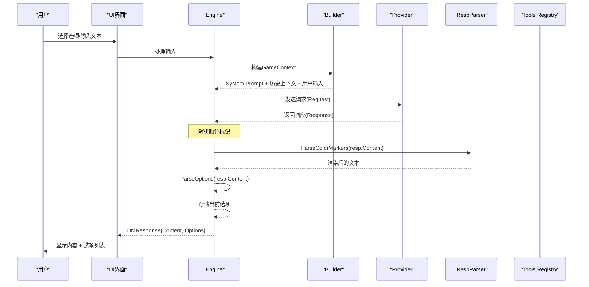
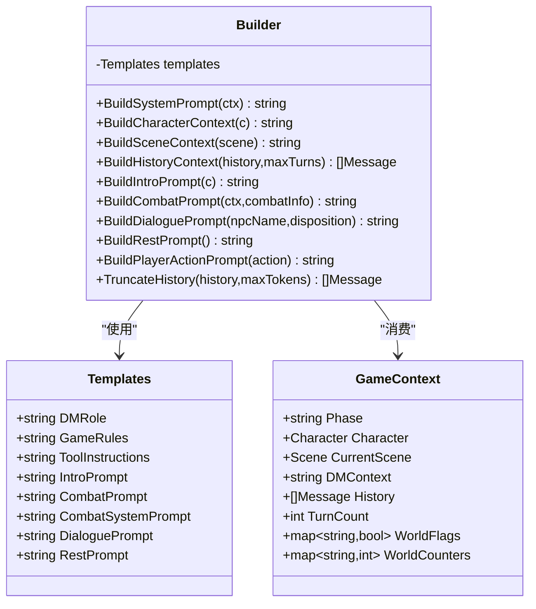
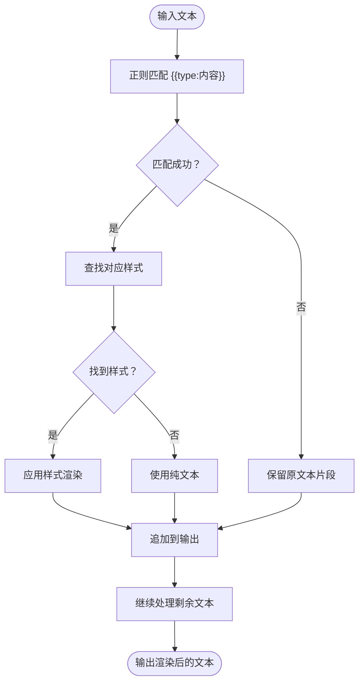
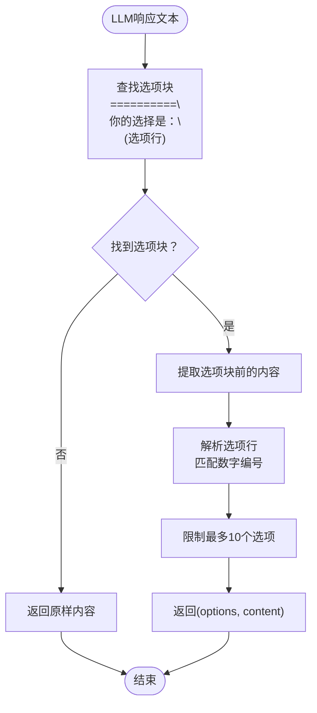
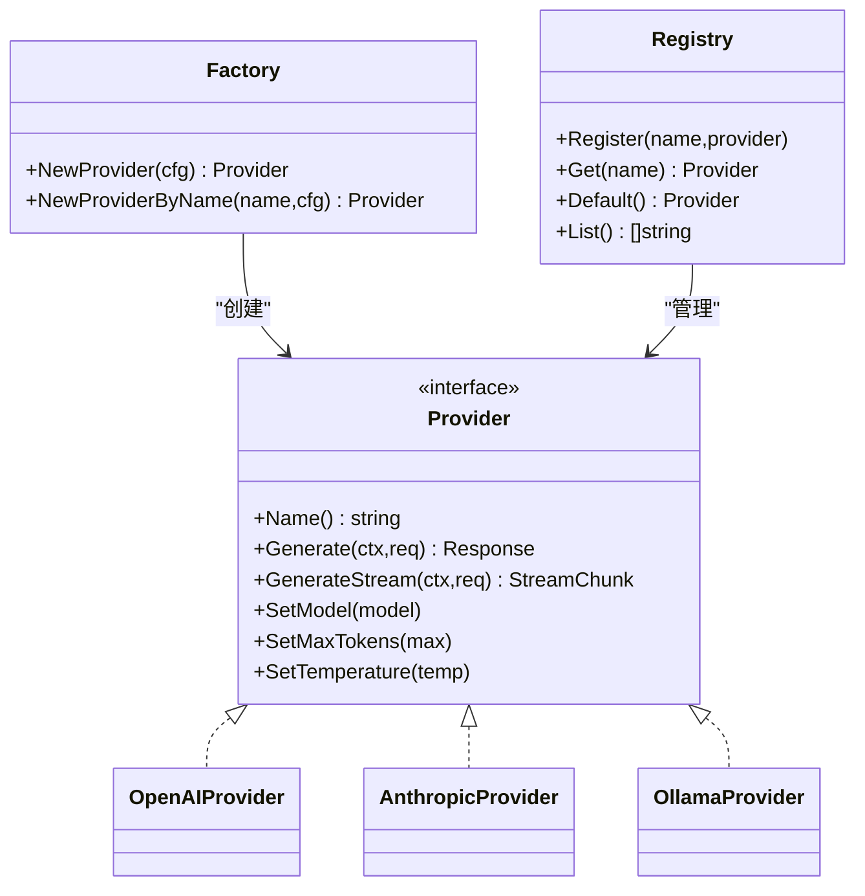
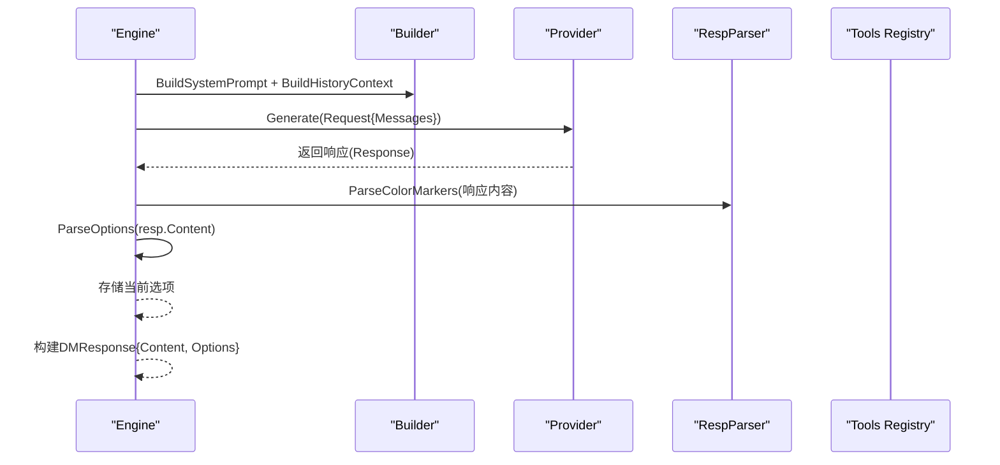
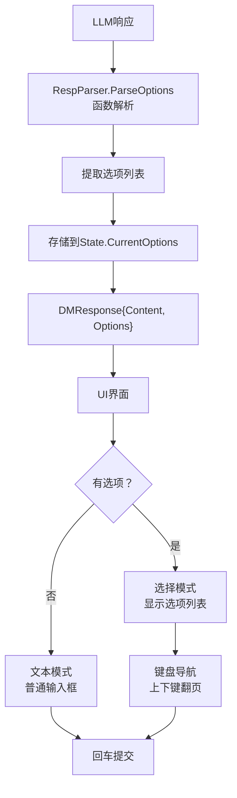
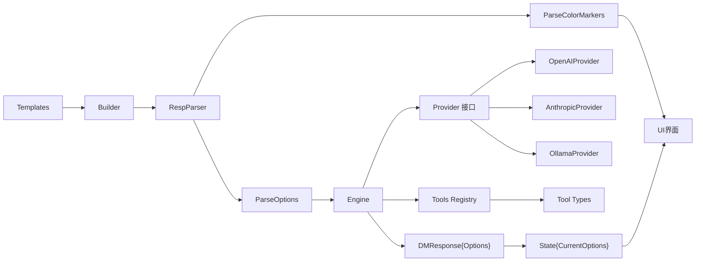

# 提示词系统

<cite>
**本文引用的文件**
- [infrastructure/prompt/builder.go](file://infrastructure/prompt/builder.go)
- [infrastructure/prompt/templates.go](file://infrastructure/prompt/templates.go)
- [infrastructure/prompt/resp_parser.go](file://infrastructure/prompt/resp_parser.go)
- [infrastructure/prompt/resp_parser_test.go](file://infrastructure/prompt/resp_parser_test.go)
- [application/engine/engine.go](file://application/engine/engine.go)
- [infrastructure/llm/provider.go](file://infrastructure/llm/provider.go)
- [infrastructure/llm/factory.go](file://infrastructure/llm/factory.go)
- [infrastructure/llm/openai.go](file://infrastructure/llm/openai.go)
- [infrastructure/llm/anthropic.go](file://infrastructure/llm/anthropic.go)
- [infrastructure/llm/ollama.go](file://infrastructure/llm/ollama.go)
- [infrastructure/llm/registry.go](file://infrastructure/llm/registry.go)
- [domain/game_phase.go](file://domain/game_phase.go)
- [application/state/state.go](file://application/state/state.go)
- [application/tools/registry.go](file://application/tools/registry.go)
- [application/tools/types.go](file://application/tools/types.go)
- [application/tools/character_tools.go](file://application/tools/character_tools.go)
- [application/tools/item_tools.go](file://application/tools/item_tools.go)
- [interface/ui/game.go](file://interface/ui/game.go)
</cite>

## 更新摘要
**所做更改**
- 颜色标记解析功能已从builder.go移至resp_parser.go，新增了LLM响应选项解析功能
- 原有options_parser.go重命名为resp_parser.go，测试文件也相应更新
- 移除了SetOptionsTool工具，采用直接解析选项的方式
- 新增颜色标记解析系统，支持多种样式标记类型
- 增强战斗系统提示模板，提供更详细的战斗状态描述
- 更新了提示词模板中的DM角色设定，强调每次响应必须提供选项的重要性
- 完善了UI界面中选项处理和用户交互流程

## 目录
1. [简介](#简介)
2. [项目结构](#项目结构)
3. [核心组件](#核心组件)
4. [架构总览](#架构总览)
5. [详细组件分析](#详细组件分析)
6. [依赖分析](#依赖分析)
7. [性能考量](#性能考量)
8. [故障排查指南](#故障排查指南)
9. [结论](#结论)
10. [附录](#附录)

## 简介
本文件面向CDND项目的提示词系统，系统性阐述提示词模板的设计理念、实现机制与使用方法。重点覆盖：
- 模板结构与变量定义
- 上下文管理与消息组织
- 提示词构建器的工作流程（解析、替换、组装、格式化）
- 提示词类型（系统提示、开场提示、战斗提示、对话提示、休息提示等）
- 上下文窗口与令牌计数策略
- 提示词优化最佳实践与调试测试方法
- 自定义提示词模板的开发指南
- **新增**：颜色标记解析系统与样式渲染
- **新增**：选项解析机制与用户交互流程

## 项目结构
提示词系统位于infrastructure/prompt目录，围绕Templates、Builder和新的ParseOptions函数展开；同时与LLM提供者抽象、工具注册表、游戏引擎紧密协作。**重大更新**：现在每个DM响应都必须包含选项列表，通过ParseOptions函数直接解析，不再使用SetOptionsTool工具。

```mermaid
graph TB
subgraph "提示词层"
TPL["Templates<br/>模板集合"]
BLD["Builder<br/>提示词构建器"]
RESPPARSE["RespParser<br/>响应解析器"]
COLORMARK["ParseColorMarkers<br/>颜色标记解析器"]
OPTPARSE["ParseOptions<br/>选项解析器"]
END
subgraph "LLM抽象层"
IFACE["Provider 接口"]
REG["Registry 注册表"]
FAC["工厂 NewProvider"]
END
subgraph "游戏引擎"
ENG["Engine<br/>Agentic Loop"]
MSG["Message/Request/Response<br/>消息与请求模型"]
DMRESP["DMResponse<br/>包含选项"]
STATE["State<br/>游戏状态"]
END
subgraph "工具系统"
TOOLREG["Tools Registry"]
TOOLDEF["Tool Definition"]
SETOPT["SetOptionsTool<br/>已移除"]
END
subgraph "UI界面"
UI["Game UI<br/>选项列表"]
END
TPL --> BLD
BLD --> RESPARSE
RESPARSE --> COLORMARK
RESPARSE --> OPTPARSE
OPTPARSE --> ENG
COLORMARK --> UI
ENG --> IFACE
FAC --> IFACE
REG --> IFACE
ENG --> TOOLREG
TOOLREG --> TOOLDEF
MSG --> IFACE
DMRESP --> STATE
STATE --> UI
UI --> ENG
```

**图表来源**
- [infrastructure/prompt/templates.go:3-12](file://infrastructure/prompt/templates.go#L3-L12)
- [infrastructure/prompt/builder.go:51-61](file://infrastructure/prompt/builder.go#L51-L61)
- [infrastructure/prompt/resp_parser.go:21-50](file://infrastructure/prompt/resp_parser.go#L21-L50)
- [infrastructure/prompt/resp_parser.go:90-111](file://infrastructure/prompt/resp_parser.go#L90-L111)
- [infrastructure/llm/provider.go:64-83](file://infrastructure/llm/provider.go#L64-L83)
- [infrastructure/llm/registry.go:8-20](file://infrastructure/llm/registry.go#L8-L20)
- [infrastructure/llm/factory.go:9-41](file://infrastructure/llm/factory.go#L9-L41)
- [application/engine/engine.go:195-316](file://application/engine/engine.go#L195-L316)
- [application/tools/registry.go:9-21](file://application/tools/registry.go#L9-L21)
- [interface/ui/game.go:364-384](file://interface/ui/game.go#L364-L384)

**章节来源**
- [infrastructure/prompt/templates.go:1-136](file://infrastructure/prompt/templates.go#L1-L136)
- [infrastructure/prompt/builder.go:1-331](file://infrastructure/prompt/builder.go#L1-L331)
- [infrastructure/prompt/resp_parser.go:1-112](file://infrastructure/prompt/resp_parser.go#L1-L112)
- [infrastructure/llm/provider.go:1-114](file://infrastructure/llm/provider.go#L1-L114)
- [infrastructure/llm/registry.go:1-140](file://infrastructure/llm/registry.go#L1-L140)
- [infrastructure/llm/factory.go:1-69](file://infrastructure/llm/factory.go#L1-L69)
- [application/engine/engine.go:1-800](file://application/engine/engine.go#L1-L800)
- [application/tools/registry.go:1-109](file://application/tools/registry.go#L1-L109)
- [application/state/state.go:1-444](file://application/state/state.go#L1-L444)
- [interface/ui/game.go:1-546](file://interface/ui/game.go#L1-L546)

## 核心组件
- Templates：集中存放各类提示词模板，包含系统角色、规则、工具说明、开场、战斗、对话、休息等模板。**更新**：DM角色模板现在强制要求每次响应提供选项。
- Builder：负责将模板与运行时上下文（角色、场景、历史、DM上下文等）拼装成最终消息序列。
- **新增**：RespParser模块：包含ParseOptions和ParseColorMarkers两个核心函数，分别负责选项解析和颜色标记解析。
- **新增**：ParseOptions函数：直接从LLM响应文本中解析选项列表，替代原有的SetOptionsTool工具调用方式。
- **新增**：ParseColorMarkers函数：将模板中的颜色标记转换为带样式的文本，支持多种样式类型。
- Provider抽象与实现：统一LLM调用接口，支持OpenAI、Anthropic、Ollama等。
- Engine：驱动"调用LLM→解析选项→反馈结果→循环"的代理循环，负责消息构建与上下文截断。**更新**：现在包含DM响应中的选项处理。
- Tools：工具注册表与工具定义，为LLM提供函数式工具签名。**更新**：SetOptionsTool工具已被移除。
- **新增**：DMResponse结构：包含内容、阶段、工具调用、工具叙述和选项字段。
- **新增**：State结构：管理游戏状态，包括当前可用选项列表。

**章节来源**
- [infrastructure/prompt/templates.go:3-12](file://infrastructure/prompt/templates.go#L3-L12)
- [infrastructure/prompt/builder.go:51-73](file://infrastructure/prompt/builder.go#L51-L73)
- [infrastructure/prompt/resp_parser.go:21-50](file://infrastructure/prompt/resp_parser.go#L21-L50)
- [infrastructure/prompt/resp_parser.go:90-111](file://infrastructure/prompt/resp_parser.go#L90-L111)
- [infrastructure/llm/provider.go:64-114](file://infrastructure/llm/provider.go#L64-L114)
- [application/engine/engine.go:195-316](file://application/engine/engine.go#L195-L316)
- [application/tools/registry.go:9-21](file://application/tools/registry.go#L9-L21)
- [application/state/state.go:40-40](file://application/state/state.go#L40-L40)

## 架构总览
提示词系统通过Builder将Templates与GameContext组合，生成符合Provider要求的消息数组；Engine在每次交互中构建系统提示、历史上下文与用户输入，并在需要时触发工具调用，形成闭环。**重大更新**：每次DM响应现在必须包含选项列表，通过RespParser模块中的ParseOptions函数直接解析，不再使用SetOptionsTool工具。



**图表来源**
- [application/engine/engine.go:195-316](file://application/engine/engine.go#L195-L316)
- [infrastructure/prompt/builder.go:75-112](file://infrastructure/prompt/builder.go#L75-L112)
- [infrastructure/llm/provider.go:27-46](file://infrastructure/llm/provider.go#L27-L46)
- [infrastructure/prompt/resp_parser.go:21-50](file://infrastructure/prompt/resp_parser.go#L21-L50)
- [infrastructure/prompt/resp_parser.go:90-111](file://infrastructure/prompt/resp_parser.go#L90-L111)
- [interface/ui/game.go:247-261](file://interface/ui/game.go#L247-L261)

## 详细组件分析

### 模板与构建器（Templates 与 Builder）
- Templates提供默认中文模板，涵盖DM角色、规则、工具说明、开场、战斗、对话、休息等。**更新**：DM角色模板现在强制要求每次响应必须包含选项列表格式。
- Builder根据GameContext动态拼装提示词，支持：
  - 系统提示（BuildSystemPrompt）
  - 角色上下文（BuildCharacterContext）
  - 场景上下文（BuildSceneContext）
  - 历史上下文截断（BuildHistoryContext）
  - 开场提示（BuildIntroPrompt）、战斗提示（BuildCombatPrompt）、对话提示（BuildDialoguePrompt）、休息提示（BuildRestPrompt）、玩家行动提示（BuildPlayerActionPrompt）



**图表来源**
- [infrastructure/prompt/templates.go:3-12](file://infrastructure/prompt/templates.go#L3-L12)
- [infrastructure/prompt/builder.go:51-73](file://infrastructure/prompt/builder.go#L51-L73)
- [infrastructure/prompt/builder.go:75-331](file://infrastructure/prompt/builder.go#L75-L331)

**章节来源**
- [infrastructure/prompt/templates.go:14-136](file://infrastructure/prompt/templates.go#L14-L136)
- [infrastructure/prompt/builder.go:75-331](file://infrastructure/prompt/builder.go#L75-L331)

### 颜色标记解析系统
- **新增**：ParseColorMarkers函数提供颜色标记解析功能，将模板中的标记转换为带样式的文本，便于终端渲染。
- 支持的标记类型：number、keyword、status、combat、success、danger、quote。
- 解析过程基于正则表达式匹配与样式映射，使用lipgloss库进行样式渲染。
- 颜色样式映射：number（绿色）、keyword（紫色）、status（黄色）、combat（红色加粗）、success（绿色加粗）、danger（红色加粗）、quote（浅紫色斜体）。



**图表来源**
- [infrastructure/prompt/resp_parser.go:90-111](file://infrastructure/prompt/resp_parser.go#L90-L111)

**章节来源**
- [infrastructure/prompt/resp_parser.go:76-111](file://infrastructure/prompt/resp_parser.go#L76-L111)
- [infrastructure/prompt/resp_parser_test.go:9-124](file://infrastructure/prompt/resp_parser_test.go#L9-L124)

### 选项解析器（ParseOptions）
- **新增**：ParseOptions函数直接从LLM响应文本中解析选项列表，替代原有的SetOptionsTool工具调用方式。
- 支持的选项格式：使用"=========="分隔线、"你的选择是："标题和编号选项列表。
- 解析规则：
  - 选项块必须包含至少5个等号分隔线
  - 选项必须以数字编号开头（1., 2., 3.等）
  - 最多支持10个选项
  - 自动去除前后空白字符
- 返回值：选项列表和移除选项块后的纯净内容



**图表来源**
- [infrastructure/prompt/resp_parser.go:21-50](file://infrastructure/prompt/resp_parser.go#L21-L50)
- [infrastructure/prompt/resp_parser.go:52-74](file://infrastructure/prompt/resp_parser.go#L52-L74)

**章节来源**
- [infrastructure/prompt/resp_parser.go:1-112](file://infrastructure/prompt/resp_parser.go#L1-L112)
- [infrastructure/prompt/resp_parser_test.go:126-329](file://infrastructure/prompt/resp_parser_test.go#L126-L329)

### LLM Provider 抽象与实现
- Provider接口统一了生成、流式生成、模型设置、温度与最大令牌数设置。
- 工厂根据配置创建Provider实例（OpenAI、Anthropic、Ollama）。
- 注册表支持多Provider注册与默认Provider切换。



**图表来源**
- [infrastructure/llm/provider.go:64-114](file://infrastructure/llm/provider.go#L64-L114)
- [infrastructure/llm/openai.go:11-34](file://infrastructure/llm/openai.go#L11-L34)
- [infrastructure/llm/anthropic.go:11-34](file://infrastructure/llm/anthropic.go#L11-L34)
- [infrastructure/llm/ollama.go:11-38](file://infrastructure/llm/ollama.go#L11-L38)
- [infrastructure/llm/factory.go:9-41](file://infrastructure/llm/factory.go#L9-L41)
- [infrastructure/llm/registry.go:8-20](file://infrastructure/llm/registry.go#L8-L20)

**章节来源**
- [infrastructure/llm/provider.go:1-114](file://infrastructure/llm/provider.go#L1-L114)
- [infrastructure/llm/factory.go:1-69](file://infrastructure/llm/factory.go#L1-L69)
- [infrastructure/llm/registry.go:1-140](file://infrastructure/llm/registry.go#L1-L140)
- [infrastructure/llm/openai.go:1-257](file://infrastructure/llm/openai.go#L1-L257)
- [infrastructure/llm/anthropic.go:1-269](file://infrastructure/llm/anthropic.go#L1-L269)
- [infrastructure/llm/ollama.go:1-261](file://infrastructure/llm/ollama.go#L1-L261)

### 游戏引擎与提示词集成
- Engine在每次交互中：
  - 构建GameContext
  - 调用Builder生成系统提示与历史上下文
  - 发送请求给Provider
  - **更新**：直接调用RespParser.ParseOptions解析响应中的选项列表
  - 对响应内容进行颜色标记解析并写入历史
  - **更新**：将当前可用选项存储到DMResponse中返回给UI



**图表来源**
- [application/engine/engine.go:195-316](file://application/engine/engine.go#L195-L316)
- [infrastructure/prompt/builder.go:75-112](file://infrastructure/prompt/builder.go#L75-L112)
- [infrastructure/prompt/resp_parser.go:21-50](file://infrastructure/prompt/resp_parser.go#L21-L50)
- [infrastructure/prompt/resp_parser.go:90-111](file://infrastructure/prompt/resp_parser.go#L90-L111)
- [interface/ui/game.go:247-261](file://interface/ui/game.go#L247-L261)

**章节来源**
- [application/engine/engine.go:195-316](file://application/engine/engine.go#L195-L316)

### 工具系统与提示词
- Tools Registry提供工具定义（名称、描述、参数Schema），Engine将其转换为Provider可用的工具定义并注入请求。
- Engine在工具执行后生成D&D风格的叙述文本，作为工具结果消息的一部分返回LLM。
- **更新**：SetOptionsTool工具已被移除，不再使用工具调用方式提供选项。

**章节来源**
- [application/tools/registry.go:59-66](file://application/tools/registry.go#L59-L66)
- [application/tools/types.go:44-67](file://application/tools/types.go#L44-L67)
- [application/engine/engine.go:200-311](file://application/engine/engine.go#L200-L311)

### 选项提供机制与UI集成
- **更新**：SetOptionsTool工具已被移除，采用RespParser.ParseOptions函数直接解析选项
- **新增**：RespParser.ParseOptions函数负责从LLM响应文本中提取选项列表
- **新增**：DMResponse结构现在包含Options字段，用于向UI传递当前可用选项
- **新增**：State结构管理当前选项列表，支持清空和查询操作
- **新增**：UI界面根据是否有选项自动切换输入模式（选择模式或文本模式）
- **新增**：选项列表支持键盘导航和"其他行动..."功能



**图表来源**
- [infrastructure/prompt/resp_parser.go:21-50](file://infrastructure/prompt/resp_parser.go#L21-L50)
- [application/state/state.go:229-242](file://application/state/state.go#L229-L242)
- [application/engine/engine.go:404-411](file://application/engine/engine.go#L404-L411)
- [interface/ui/game.go:364-384](file://interface/ui/game.go#L364-L384)

**章节来源**
- [infrastructure/prompt/resp_parser.go:1-112](file://infrastructure/prompt/resp_parser.go#L1-L112)
- [application/state/state.go:1-444](file://application/state/state.go#L1-L444)
- [application/engine/engine.go:404-411](file://application/engine/engine.go#L404-L411)
- [interface/ui/game.go:364-384](file://interface/ui/game.go#L364-L384)

## 依赖分析
- 提示词系统依赖于：
  - Templates与Builder：提供模板与上下文拼装
  - **新增**：RespParser模块：包含ParseOptions和ParseColorMarkers函数
  - Provider抽象与实现：承载LLM调用
  - Engine：驱动提示词与工具的协同工作
  - Tools：提供函数式工具签名与执行
  - **更新**：SetOptionsTool：已被移除



**图表来源**
- [infrastructure/prompt/templates.go:14-136](file://infrastructure/prompt/templates.go#L14-L136)
- [infrastructure/prompt/builder.go:51-61](file://infrastructure/prompt/builder.go#L51-L61)
- [infrastructure/prompt/resp_parser.go:21-50](file://infrastructure/prompt/resp_parser.go#L21-L50)
- [infrastructure/prompt/resp_parser.go:90-111](file://infrastructure/prompt/resp_parser.go#L90-L111)
- [infrastructure/llm/provider.go:64-114](file://infrastructure/llm/provider.go#L64-L114)
- [infrastructure/llm/openai.go:11-34](file://infrastructure/llm/openai.go#L11-L34)
- [infrastructure/llm/anthropic.go:11-34](file://infrastructure/llm/anthropic.go#L11-L34)
- [infrastructure/llm/ollama.go:11-38](file://infrastructure/llm/ollama.go#L11-L38)
- [application/engine/engine.go:195-316](file://application/engine/engine.go#L195-L316)
- [application/tools/registry.go:59-66](file://application/tools/registry.go#L59-L66)

**章节来源**
- [infrastructure/prompt/builder.go:1-331](file://infrastructure/prompt/builder.go#L1-L331)
- [infrastructure/prompt/resp_parser.go:1-112](file://infrastructure/prompt/resp_parser.go#L1-L112)
- [infrastructure/llm/provider.go:1-114](file://infrastructure/llm/provider.go#L1-L114)
- [application/engine/engine.go:1-800](file://application/engine/engine.go#L1-L800)
- [application/tools/registry.go:1-109](file://application/tools/registry.go#L1-L109)

## 性能考量
- 历史上下文截断：当前实现按固定回合数截断，建议结合令牌计数进行更精确的窗口管理。
- 工具调用循环：限制最大迭代次数，避免无限循环。
- 流式输出：Provider实现支持流式响应，有助于提升用户体验。
- 配置化：通过配置文件控制模型、最大令牌数与温度，便于在不同Provider间切换与调优。
- **新增**：选项解析优化：RespParser.ParseOptions函数使用高效的正则表达式匹配，支持最多10个选项的限制。
- **新增**：颜色标记解析优化：RespParser.ParseColorMarkers函数使用预编译的正则表达式，提高解析效率。
- **更新**：移除SetOptionsTool工具调用开销，直接解析选项提升性能。

**章节来源**
- [infrastructure/prompt/builder.go:213-221](file://infrastructure/prompt/builder.go#L213-L221)
- [infrastructure/prompt/builder.go:264-272](file://infrastructure/prompt/builder.go#L264-L272)
- [infrastructure/prompt/resp_parser.go:21-50](file://infrastructure/prompt/resp_parser.go#L21-L50)
- [infrastructure/prompt/resp_parser.go:90-111](file://infrastructure/prompt/resp_parser.go#L90-L111)
- [infrastructure/llm/openai.go:127-211](file://infrastructure/llm/openai.go#L127-L211)
- [infrastructure/llm/anthropic.go:141-227](file://infrastructure/llm/anthropic.go#L141-L227)
- [infrastructure/llm/ollama.go:131-215](file://infrastructure/llm/ollama.go#L131-L215)
- [infrastructure/config/config.go:16-29](file://infrastructure/config/config.go#L16-L29)
- [interface/ui/game.go:364-384](file://interface/ui/game.go#L364-L384)

## 故障排查指南
- 颜色标记解析问题：确保模板中使用正确的标记语法；单元测试验证了多种标记类型的解析行为。
- 工具调用失败：检查工具参数Schema与执行逻辑，确认工具在当前阶段是否允许。
- Provider初始化失败：核对配置文件中的默认Provider与对应Provider配置项。
- 上下文过长：调整历史回合数或实现基于令牌计数的截断策略。
- **新增**：选项解析问题：检查RespParser.ParseOptions函数是否正确识别选项格式，确认选项块格式符合要求。
- **新增**：UI选项显示问题：验证DMResponse中的Options字段是否正确传递，检查UI更新逻辑。
- **新增**：颜色标记渲染问题：检查RespParser.ParseColorMarkers函数是否正确应用样式，验证lipgloss样式映射。
- **更新**：SetOptionsTool相关问题：该工具已被移除，不再存在相关故障。

**章节来源**
- [infrastructure/prompt/resp_parser_test.go:9-124](file://infrastructure/prompt/resp_parser_test.go#L9-L124)
- [application/tools/registry.go:37-46](file://application/tools/registry.go#L37-L46)
- [infrastructure/llm/factory.go:11-41](file://infrastructure/llm/factory.go#L11-L41)
- [infrastructure/prompt/builder.go:264-272](file://infrastructure/prompt/builder.go#L264-L272)
- [infrastructure/prompt/resp_parser.go:21-50](file://infrastructure/prompt/resp_parser.go#L21-L50)
- [interface/ui/game.go:247-261](file://interface/ui/game.go#L247-L261)

## 结论
提示词系统通过Templates与Builder实现了模板化、可扩展的提示词生成；配合Provider抽象与工具系统，形成了稳定的代理循环。**重大更新**：现在每个DM响应都必须提供选项列表，通过RespParser.ParseOptions函数直接解析，显著提升了游戏交互体验。新增的颜色标记解析系统提供了丰富的文本样式渲染能力。建议后续增强令牌计数与上下文窗口管理、完善工具权限与阶段控制、优化选项解析机制，并持续改进提示词模板以提升叙事质量与安全性。

## 附录

### 提示词类型与用途
- 系统提示（System Prompt）：定义DM角色、规则与工具调用约束，**更新**：强制要求每次响应提供选项
- 开场提示（Intro Prompt）：引导首次场景描述
- 战斗提示（Combat Prompt）：强调战斗动作与伤害展示
- 对话提示（Dialogue Prompt）：NPC对话与态度
- 休息提示（Rest Prompt）：休息场景与恢复机制
- 历史上下文（History Context）：限制回合数，维持上下文连贯性

**章节来源**
- [infrastructure/prompt/templates.go:14-136](file://infrastructure/prompt/templates.go#L14-L136)
- [infrastructure/prompt/builder.go:223-257](file://infrastructure/prompt/builder.go#L223-L257)
- [infrastructure/prompt/builder.go:213-221](file://infrastructure/prompt/builder.go#L213-L221)

### 上下文窗口与令牌计数
- 当前实现：按固定回合数截断历史
- 建议改进：引入令牌计数估算与动态截断，结合Provider返回的Usage统计

**章节来源**
- [infrastructure/prompt/builder.go:264-272](file://infrastructure/prompt/builder.go#L264-L272)
- [infrastructure/llm/provider.go:48-53](file://infrastructure/llm/provider.go#L48-L53)

### 提示词优化最佳实践
- 明确性：使用清晰的指令与角色设定，减少歧义
- 具体性：在模板中给出具体的示例与标记用法
- 安全性：限制工具调用范围与参数，避免不当操作
- 可维护性：将模板集中管理，便于版本演进与本地化
- **新增**：选项设计原则：每次响应提供3-5个具体、可操作的选项，反映当前情境的合理选择
- **新增**：颜色标记使用原则：仅在关键信息处使用标记，保持叙事流畅自然
- **更新**：移除对SetOptionsTool的依赖，直接在提示词中规定选项格式

**章节来源**
- [infrastructure/prompt/templates.go:14-136](file://infrastructure/prompt/templates.go#L14-L136)

### 调试与测试方法
- 颜色标记解析：通过单元测试验证标记替换与样式映射
- 提示词构建：打印Builder输出，核对上下文拼装
- 工具调用：观察Engine的工具执行与叙述生成
- Provider行为：对比不同Provider的响应差异
- **新增**：选项解析测试：验证RespParser.ParseOptions函数是否正确解析各种格式的选项
- **新增**：颜色标记测试：验证RespParser.ParseColorMarkers函数是否正确应用样式
- **更新**：SetOptionsTool相关测试：该工具已被移除，不再需要相关测试

**章节来源**
- [infrastructure/prompt/resp_parser_test.go:9-124](file://infrastructure/prompt/resp_parser_test.go#L9-L124)
- [application/engine/engine.go:269-311](file://application/engine/engine.go#L269-L311)
- [infrastructure/prompt/resp_parser_test.go:126-329](file://infrastructure/prompt/resp_parser_test.go#L126-L329)

### 自定义提示词模板开发指南
- 在Templates中新增字段并提供默认中文模板
- 在Builder中扩展构建方法，接收必要上下文参数
- 在Engine中调用新构建方法，并确保历史上下文截断策略合理
- 编写单元测试验证模板与解析逻辑
- 如需新工具，先在Tools中定义工具签名与执行逻辑，再在Engine中注入工具定义
- **更新**：选项提供指南：确保每次响应都包含符合RespParser.ParseOptions格式的选项块，提供3-5个具体选项
- **新增**：颜色标记使用指南：在模板中使用{{type:内容}}格式标记关键信息，支持number、keyword、status、combat、success、danger、quote类型

**章节来源**
- [infrastructure/prompt/templates.go:3-12](file://infrastructure/prompt/templates.go#L3-L12)
- [infrastructure/prompt/builder.go:51-61](file://infrastructure/prompt/builder.go#L51-L61)
- [application/tools/types.go:24-42](file://application/tools/types.go#L24-L42)
- [application/tools/registry.go:59-66](file://application/tools/registry.go#L59-L66)
- [application/engine/engine.go:195-316](file://application/engine/engine.go#L195-L316)

### 选项解析机制详解
- **RespParser.ParseOptions函数**：直接从LLM响应文本中解析选项列表，替代原有的SetOptionsTool工具调用方式
- **解析规则**：
  - 选项块必须包含至少5个等号分隔线
  - 选项必须以数字编号开头（1., 2., 3.等）
  - 最多支持10个选项
  - 自动去除前后空白字符
- **调用时机**：在Engine处理LLM响应时直接调用，无需工具调用
- **UI集成**：DMResponse中的Options字段传递给UI，自动切换输入模式
- **状态管理**：选项存储在游戏状态中，供后续交互使用

**章节来源**
- [infrastructure/prompt/resp_parser.go:1-112](file://infrastructure/prompt/resp_parser.go#L1-L112)
- [application/state/state.go:229-242](file://application/state/state.go#L229-L242)
- [application/engine/engine.go:404-411](file://application/engine/engine.go#L404-L411)
- [interface/ui/game.go:364-384](file://interface/ui/game.go#L364-L384)

### 颜色标记系统详解
- **RespParser.ParseColorMarkers函数**：将模板中的颜色标记转换为带样式的文本
- **支持的标记类型**：
  - number：绿色，用于数值类信息
  - keyword：紫色，用于重要名词
  - status：黄色，用于状态效果
  - combat：红色加粗，用于战斗动作
  - success：绿色加粗，用于成功结果
  - danger：红色加粗，用于危险/失败
  - quote：浅紫色斜体，用于NPC对话
- **样式映射**：使用lipgloss库进行样式渲染，确保跨平台兼容性
- **调用时机**：在UI界面渲染时调用，将标记文本转换为带样式的输出
- **应用场景**：战斗描述、技能检定、状态效果、数值变化等关键信息突出显示

**章节来源**
- [infrastructure/prompt/resp_parser.go:76-111](file://infrastructure/prompt/resp_parser.go#L76-L111)
- [infrastructure/prompt/resp_parser_test.go:9-124](file://infrastructure/prompt/resp_parser_test.go#L9-L124)
- [interface/ui/game.go:364-384](file://interface/ui/game.go#L364-L384)