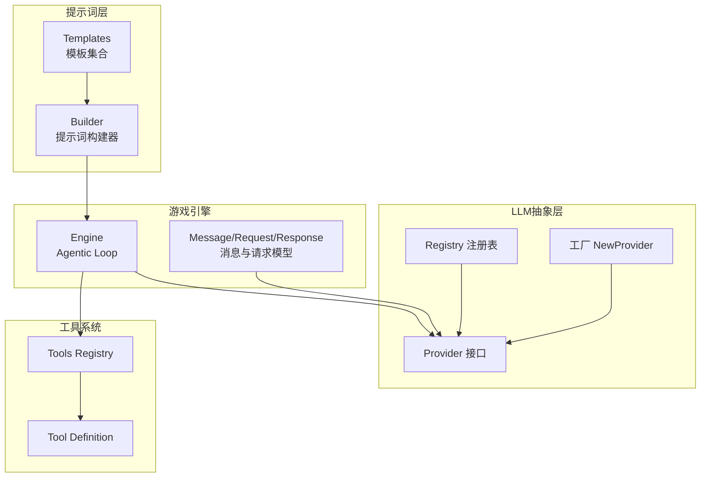
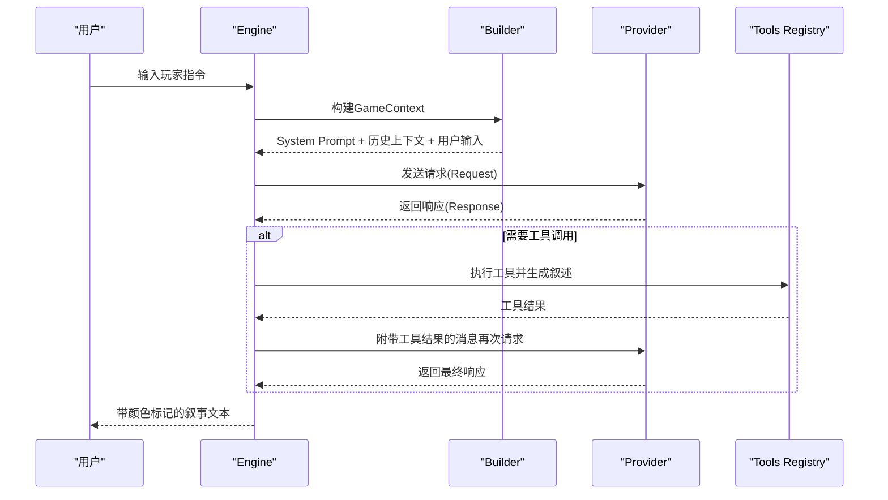
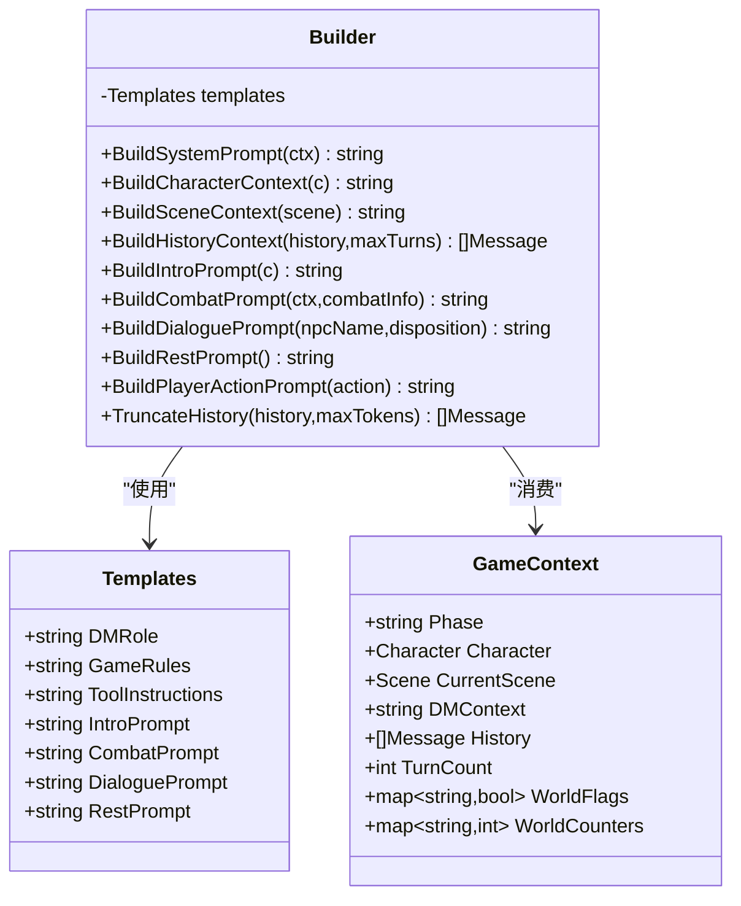
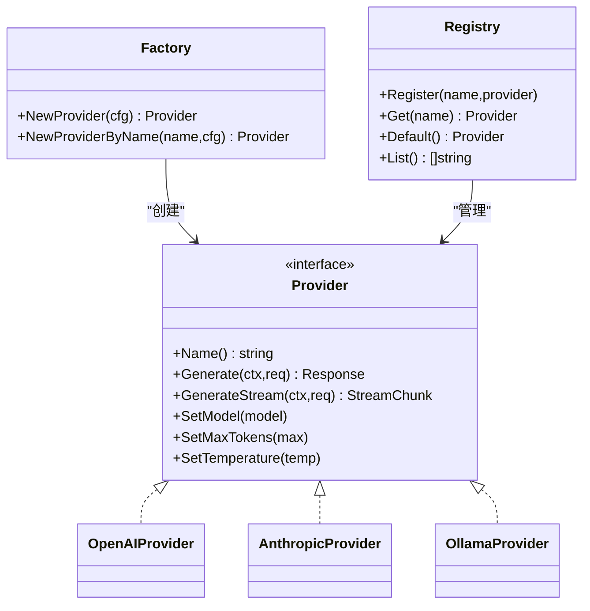
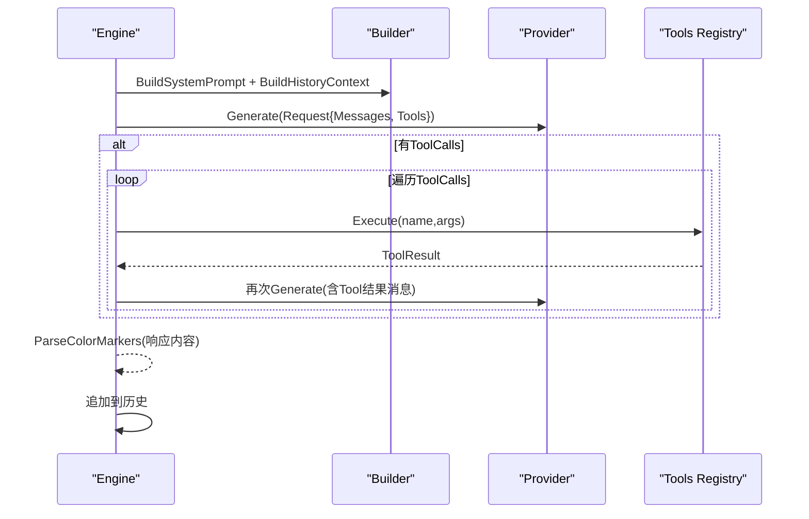
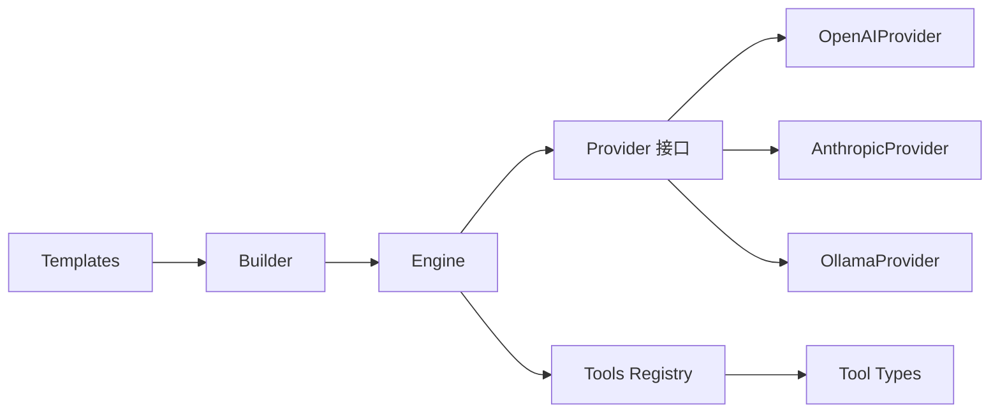

# 提示词系统

<cite>
**本文引用的文件**
- [internal/llm/prompt/builder.go](file://internal/llm/prompt/builder.go)
- [internal/llm/prompt/templates.go](file://internal/llm/prompt/templates.go)
- [internal/llm/prompt/builder_test.go](file://internal/llm/prompt/builder_test.go)
- [internal/llm/provider.go](file://internal/llm/provider.go)
- [internal/llm/factory.go](file://internal/llm/factory.go)
- [internal/llm/openai.go](file://internal/llm/openai.go)
- [internal/llm/anthropic.go](file://internal/llm/anthropic.go)
- [internal/llm/ollama.go](file://internal/llm/ollama.go)
- [internal/llm/registry.go](file://internal/llm/registry.go)
- [internal/game/engine.go](file://internal/game/engine.go)
- [internal/tools/registry.go](file://internal/tools/registry.go)
- [internal/tools/types.go](file://internal/tools/types.go)
- [internal/tools/character_tools.go](file://internal/tools/character_tools.go)
- [internal/tools/item_tools.go](file://internal/tools/item_tools.go)
- [internal/config/config.go](file://internal/config/config.go)
- [cmd/start.go](file://cmd/start.go)
</cite>

## 目录
1. [简介](#简介)
2. [项目结构](#项目结构)
3. [核心组件](#核心组件)
4. [架构总览](#架构总览)
5. [详细组件分析](#详细组件分析)
6. [依赖分析](#依赖分析)
7. [性能考量](#性能考量)
8. [故障排查指南](#故障排查指南)
9. [结论](#结论)
10. [附录](#附录)

## 简介
本文件面向CDND项目的提示词系统，系统性阐述提示词模板的设计理念、实现机制与使用方法。重点覆盖：
- 模板结构与变量定义
- 上下文管理与消息组织
- 提示词构建器的工作流程（解析、替换、组装、格式化）
- 提示词类型（系统提示、开场提示、战斗提示、对话提示、休息提示等）
- 上下文窗口与令牌计数策略
- 提示词优化最佳实践与调试测试方法
- 自定义提示词模板的开发指南

## 项目结构
提示词系统位于internal/llm/prompt目录，围绕Templates与Builder展开；同时与LLM提供者抽象、工具注册表、游戏引擎紧密协作。

图表来源
- [internal/llm/prompt/templates.go:3-12](file://internal/llm/prompt/templates.go#L3-L12)
- [internal/llm/prompt/builder.go:51-61](file://internal/llm/prompt/builder.go#L51-L61)
- [internal/llm/provider.go:64-83](file://internal/llm/provider.go#L64-L83)
- [internal/llm/registry.go:8-20](file://internal/llm/registry.go#L8-L20)
- [internal/llm/factory.go:9-41](file://internal/llm/factory.go#L9-L41)
- [internal/game/engine.go:195-316](file://internal/game/engine.go#L195-L316)
- [internal/tools/registry.go:9-21](file://internal/tools/registry.go#L9-L21)

章节来源
- [internal/llm/prompt/templates.go:1-102](file://internal/llm/prompt/templates.go#L1-L102)
- [internal/llm/prompt/builder.go:1-273](file://internal/llm/prompt/builder.go#L1-L273)
- [internal/llm/provider.go:1-114](file://internal/llm/provider.go#L1-L114)
- [internal/llm/registry.go:1-140](file://internal/llm/registry.go#L1-L140)
- [internal/llm/factory.go:1-69](file://internal/llm/factory.go#L1-L69)
- [internal/game/engine.go:1-797](file://internal/game/engine.go#L1-L797)
- [internal/tools/registry.go:1-109](file://internal/tools/registry.go#L1-L109)

## 核心组件
- Templates：集中存放各类提示词模板，包含系统角色、规则、工具说明、开场、战斗、对话、休息等模板。
- Builder：负责将模板与运行时上下文（角色、场景、历史、DM上下文等）拼装成最终消息序列。
- Provider抽象与实现：统一LLM调用接口，支持OpenAI、Anthropic、Ollama等。
- Engine：驱动“调用LLM→执行工具→反馈结果→循环”的代理循环，负责消息构建与上下文截断。
- Tools：工具注册表与工具定义，为LLM提供函数式工具签名。

章节来源
- [internal/llm/prompt/templates.go:3-12](file://internal/llm/prompt/templates.go#L3-L12)
- [internal/llm/prompt/builder.go:51-73](file://internal/llm/prompt/builder.go#L51-L73)
- [internal/llm/provider.go:64-114](file://internal/llm/provider.go#L64-L114)
- [internal/game/engine.go:195-316](file://internal/game/engine.go#L195-L316)
- [internal/tools/registry.go:9-21](file://internal/tools/registry.go#L9-L21)

## 架构总览
提示词系统通过Builder将Templates与GameContext组合，生成符合Provider要求的消息数组；Engine在每次交互中构建系统提示、历史上下文与用户输入，并在需要时触发工具调用，形成闭环。

图表来源
- [internal/game/engine.go:195-316](file://internal/game/engine.go#L195-L316)
- [internal/llm/prompt/builder.go:75-112](file://internal/llm/prompt/builder.go#L75-L112)
- [internal/llm/provider.go:27-46](file://internal/llm/provider.go#L27-L46)
- [internal/tools/registry.go:37-46](file://internal/tools/registry.go#L37-L46)

## 详细组件分析

### 模板与构建器（Templates 与 Builder）
- Templates提供默认中文模板，涵盖DM角色、规则、工具说明、开场、战斗、对话、休息等。
- Builder根据GameContext动态拼装提示词，支持：
  - 系统提示（BuildSystemPrompt）
  - 角色上下文（BuildCharacterContext）
  - 场景上下文（BuildSceneContext）
  - 历史上下文截断（BuildHistoryContext）
  - 开场提示（BuildIntroPrompt）、战斗提示（BuildCombatPrompt）、对话提示（BuildDialoguePrompt）、休息提示（BuildRestPrompt）、玩家行动提示（BuildPlayerActionPrompt）

图表来源
- [internal/llm/prompt/templates.go:3-12](file://internal/llm/prompt/templates.go#L3-L12)
- [internal/llm/prompt/builder.go:51-73](file://internal/llm/prompt/builder.go#L51-L73)
- [internal/llm/prompt/builder.go:75-272](file://internal/llm/prompt/builder.go#L75-L272)

章节来源
- [internal/llm/prompt/templates.go:14-101](file://internal/llm/prompt/templates.go#L14-L101)
- [internal/llm/prompt/builder.go:75-272](file://internal/llm/prompt/builder.go#L75-L272)

### 颜色标记与文本渲染
- 提供颜色标记解析功能，将模板中的标记转换为带样式的文本，便于终端渲染。
- 支持的标记类型：number、keyword、status、combat、success、danger、quote。
- 解析过程基于正则表达式匹配与样式映射。

图表来源
- [internal/llm/prompt/builder.go:14-49](file://internal/llm/prompt/builder.go#L14-L49)

章节来源
- [internal/llm/prompt/builder.go:14-49](file://internal/llm/prompt/builder.go#L14-L49)
- [internal/llm/prompt/builder_test.go:8-123](file://internal/llm/prompt/builder_test.go#L8-L123)

### LLM Provider 抽象与实现
- Provider接口统一了生成、流式生成、模型设置、温度与最大令牌数设置。
- 工厂根据配置创建Provider实例（OpenAI、Anthropic、Ollama）。
- 注册表支持多Provider注册与默认Provider切换。

图表来源
- [internal/llm/provider.go:64-114](file://internal/llm/provider.go#L64-L114)
- [internal/llm/openai.go:11-34](file://internal/llm/openai.go#L11-L34)
- [internal/llm/anthropic.go:11-34](file://internal/llm/anthropic.go#L11-L34)
- [internal/llm/ollama.go:11-38](file://internal/llm/ollama.go#L11-L38)
- [internal/llm/factory.go:9-41](file://internal/llm/factory.go#L9-L41)
- [internal/llm/registry.go:8-20](file://internal/llm/registry.go#L8-L20)

章节来源
- [internal/llm/provider.go:1-114](file://internal/llm/provider.go#L1-L114)
- [internal/llm/factory.go:1-69](file://internal/llm/factory.go#L1-L69)
- [internal/llm/registry.go:1-140](file://internal/llm/registry.go#L1-L140)
- [internal/llm/openai.go:1-257](file://internal/llm/openai.go#L1-L257)
- [internal/llm/anthropic.go:1-269](file://internal/llm/anthropic.go#L1-L269)
- [internal/llm/ollama.go:1-261](file://internal/llm/ollama.go#L1-L261)

### 游戏引擎与提示词集成
- Engine在每次交互中：
  - 构建GameContext
  - 调用Builder生成系统提示与历史上下文
  - 发送请求给Provider
  - 若返回工具调用，执行工具并追加工具结果消息，再次请求直至无工具调用
  - 最终对响应内容进行颜色标记解析并写入历史

图表来源
- [internal/game/engine.go:195-316](file://internal/game/engine.go#L195-L316)
- [internal/llm/prompt/builder.go:75-112](file://internal/llm/prompt/builder.go#L75-L112)
- [internal/llm/prompt/builder.go:213-221](file://internal/llm/prompt/builder.go#L213-L221)

章节来源
- [internal/game/engine.go:195-316](file://internal/game/engine.go#L195-L316)

### 工具系统与提示词
- Tools Registry提供工具定义（名称、描述、参数Schema），Engine将其转换为Provider可用的工具定义并注入请求。
- Engine在工具执行后生成D&D风格的叙述文本，作为工具结果消息的一部分返回LLM。

章节来源
- [internal/tools/registry.go:59-66](file://internal/tools/registry.go#L59-L66)
- [internal/tools/types.go:44-67](file://internal/tools/types.go#L44-L67)
- [internal/game/engine.go:200-311](file://internal/game/engine.go#L200-L311)

## 依赖分析
- 提示词系统依赖于：
  - Templates与Builder：提供模板与上下文拼装
  - Provider抽象与实现：承载LLM调用
  - Engine：驱动提示词与工具的协同工作
  - Tools：提供函数式工具签名与执行

图表来源
- [internal/llm/prompt/templates.go:14-101](file://internal/llm/prompt/templates.go#L14-L101)
- [internal/llm/prompt/builder.go:51-61](file://internal/llm/prompt/builder.go#L51-L61)
- [internal/llm/provider.go:64-114](file://internal/llm/provider.go#L64-L114)
- [internal/llm/openai.go:11-34](file://internal/llm/openai.go#L11-L34)
- [internal/llm/anthropic.go:11-34](file://internal/llm/anthropic.go#L11-L34)
- [internal/llm/ollama.go:11-38](file://internal/llm/ollama.go#L11-L38)
- [internal/game/engine.go:195-316](file://internal/game/engine.go#L195-L316)
- [internal/tools/registry.go:59-66](file://internal/tools/registry.go#L59-L66)

章节来源
- [internal/llm/prompt/builder.go:1-273](file://internal/llm/prompt/builder.go#L1-L273)
- [internal/llm/provider.go:1-114](file://internal/llm/provider.go#L1-L114)
- [internal/game/engine.go:1-797](file://internal/game/engine.go#L1-L797)
- [internal/tools/registry.go:1-109](file://internal/tools/registry.go#L1-L109)

## 性能考量
- 历史上下文截断：当前实现按固定回合数截断，建议结合令牌计数进行更精确的窗口管理。
- 工具调用循环：限制最大迭代次数，避免无限循环。
- 流式输出：Provider实现支持流式响应，有助于提升用户体验。
- 配置化：通过配置文件控制模型、最大令牌数与温度，便于在不同Provider间切换与调优。

章节来源
- [internal/llm/prompt/builder.go:213-221](file://internal/llm/prompt/builder.go#L213-L221)
- [internal/llm/prompt/builder.go:264-272](file://internal/llm/prompt/builder.go#L264-L272)
- [internal/llm/openai.go:127-211](file://internal/llm/openai.go#L127-L211)
- [internal/llm/anthropic.go:141-227](file://internal/llm/anthropic.go#L141-L227)
- [internal/llm/ollama.go:131-215](file://internal/llm/ollama.go#L131-L215)
- [internal/config/config.go:16-29](file://internal/config/config.go#L16-L29)

## 故障排查指南
- 颜色标记解析问题：确保模板中使用正确的标记语法；单元测试验证了多种标记类型的解析行为。
- 工具调用失败：检查工具参数Schema与执行逻辑，确认工具在当前阶段是否允许。
- Provider初始化失败：核对配置文件中的默认Provider与对应Provider配置项。
- 上下文过长：调整历史回合数或实现基于令牌计数的截断策略。

章节来源
- [internal/llm/prompt/builder_test.go:8-123](file://internal/llm/prompt/builder_test.go#L8-L123)
- [internal/tools/registry.go:37-46](file://internal/tools/registry.go#L37-L46)
- [internal/llm/factory.go:11-41](file://internal/llm/factory.go#L11-L41)
- [internal/llm/prompt/builder.go:264-272](file://internal/llm/prompt/builder.go#L264-L272)

## 结论
提示词系统通过Templates与Builder实现了模板化、可扩展的提示词生成；配合Provider抽象与工具系统，形成了稳定的代理循环。建议后续增强令牌计数与上下文窗口管理、完善工具权限与阶段控制，并持续优化提示词模板以提升叙事质量与安全性。

## 附录

### 提示词类型与用途
- 系统提示（System Prompt）：定义DM角色、规则与工具调用约束
- 开场提示（Intro Prompt）：引导首次场景描述
- 战斗提示（Combat Prompt）：强调战斗动作与伤害展示
- 对话提示（Dialogue Prompt）：NPC对话与态度
- 休息提示（Rest Prompt）：休息场景与恢复机制
- 历史上下文（History Context）：限制回合数，维持上下文连贯性

章节来源
- [internal/llm/prompt/templates.go:14-101](file://internal/llm/prompt/templates.go#L14-L101)
- [internal/llm/prompt/builder.go:223-257](file://internal/llm/prompt/builder.go#L223-L257)
- [internal/llm/prompt/builder.go:213-221](file://internal/llm/prompt/builder.go#L213-L221)

### 上下文窗口与令牌计数
- 当前实现：按固定回合数截断历史
- 建议改进：引入令牌计数估算与动态截断，结合Provider返回的Usage统计

章节来源
- [internal/llm/prompt/builder.go:264-272](file://internal/llm/prompt/builder.go#L264-L272)
- [internal/llm/provider.go:48-53](file://internal/llm/provider.go#L48-L53)

### 提示词优化最佳实践
- 明确性：使用清晰的指令与角色设定，减少歧义
- 具体性：在模板中给出具体的示例与标记用法
- 安全性：限制工具调用范围与参数，避免不当操作
- 可维护性：将模板集中管理，便于版本演进与本地化

章节来源
- [internal/llm/prompt/templates.go:14-101](file://internal/llm/prompt/templates.go#L14-L101)

### 调试与测试方法
- 颜色标记解析：通过单元测试验证标记替换与样式映射
- 提示词构建：打印Builder输出，核对上下文拼装
- 工具调用：观察Engine的工具执行与叙述生成
- Provider行为：对比不同Provider的响应差异

章节来源
- [internal/llm/prompt/builder_test.go:8-123](file://internal/llm/prompt/builder_test.go#L8-L123)
- [internal/game/engine.go:269-311](file://internal/game/engine.go#L269-L311)

### 自定义提示词模板开发指南
- 在Templates中新增字段并提供默认中文模板
- 在Builder中扩展构建方法，接收必要上下文参数
- 在Engine中调用新构建方法，并确保历史上下文截断策略合理
- 编写单元测试验证模板与解析逻辑
- 如需新工具，先在Tools中定义工具签名与执行逻辑，再在Engine中注入工具定义

章节来源
- [internal/llm/prompt/templates.go:3-12](file://internal/llm/prompt/templates.go#L3-L12)
- [internal/llm/prompt/builder.go:51-61](file://internal/llm/prompt/builder.go#L51-L61)
- [internal/tools/types.go:24-42](file://internal/tools/types.go#L24-L42)
- [internal/tools/registry.go:59-66](file://internal/tools/registry.go#L59-L66)
- [internal/game/engine.go:195-316](file://internal/game/engine.go#L195-L316)