# NPC管理系统

<cite>
**本文档引用的文件**
- [internal/world/npc.go](file://internal/world/npc.go)
- [internal/world/scene.go](file://internal/world/scene.go)
- [internal/world/manager.go](file://internal/world/manager.go)
- [internal/character/character.go](file://internal/character/character.go)
- [internal/character/attributes.go](file://internal/character/attributes.go)
- [internal/character/skills.go](file://internal/character/skills.go)
- [internal/character/race.go](file://internal/character/race.go)
- [internal/character/class.go](file://internal/character/class.go)
- [internal/tools/registry.go](file://internal/tools/registry.go)
- [internal/tools/character_tools.go](file://internal/tools/character_tools.go)
- [internal/tools/world_tools.go](file://internal/tools/world_tools.go)
- [internal/game/engine.go](file://internal/game/engine.go)
- [internal/game/state.go](file://internal/game/state.go)
- [internal/game/events.go](file://internal/game/events.go)
- [internal/game/types.go](file://internal/game/types.go)
- [internal/config/config.go](file://internal/config/config.go)
</cite>

## 目录
1. [简介](#简介)
2. [项目结构](#项目结构)
3. [核心组件](#核心组件)
4. [架构概览](#架构概览)
5. [详细组件分析](#详细组件分析)
6. [依赖关系分析](#依赖关系分析)
7. [性能考虑](#性能考虑)
8. [故障排除指南](#故障排除指南)
9. [结论](#结论)
10. [附录](#附录)

## 简介

CDND的NPC管理系统是一个基于D&D 5e规则的非玩家角色管理框架，集成了AI驱动的对话系统、场景绑定机制和工具集成架构。该系统支持多种NPC类型（商人、任务发布者、敌人、盟友、训练师等），提供完整的生命周期管理，包括创建、激活、交互和移除。

系统的核心特点包括：
- **多维度NPC数据结构**：支持基础属性、战斗能力、对话系统、商业功能和任务系统
- **智能场景绑定**：通过场景管理器实现NPC与场景的动态绑定
- **AI驱动对话**：集成LLM提供者实现智能对话生成
- **工具化操作**：通过工具注册表实现NPC的创建、删除和状态管理
- **事件驱动架构**：完整的事件系统支持NPC状态变化和交互反馈

## 项目结构

CDND项目采用模块化的架构设计，NPC管理系统主要分布在以下模块中：

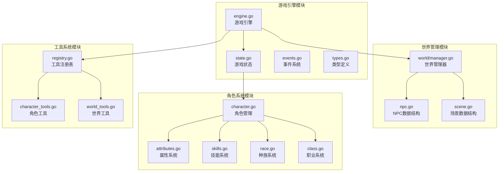

**图表来源**
- [internal/world/manager.go:1-294](file://internal/world/manager.go#L1-L294)
- [internal/world/npc.go:1-231](file://internal/world/npc.go#L1-L231)
- [internal/world/scene.go:1-219](file://internal/world/scene.go#L1-L219)
- [internal/game/engine.go:1-797](file://internal/game/engine.go#L1-L797)

**章节来源**
- [internal/world/manager.go:1-294](file://internal/world/manager.go#L1-L294)
- [internal/world/npc.go:1-231](file://internal/world/npc.go#L1-L231)
- [internal/world/scene.go:1-219](file://internal/world/scene.go#L1-L219)

## 核心组件

### NPC数据结构设计

NPC系统的核心数据结构提供了完整的角色信息管理能力：

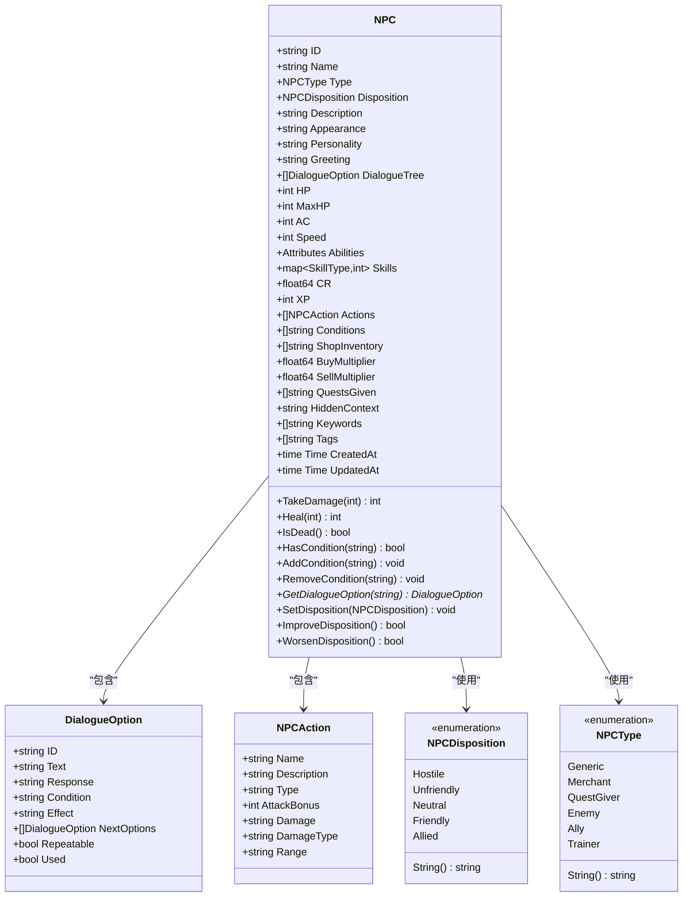

**图表来源**
- [internal/world/npc.go:70-137](file://internal/world/npc.go#L70-L137)
- [internal/world/npc.go:116-126](file://internal/world/npc.go#L116-L126)
- [internal/world/npc.go:128-137](file://internal/world/npc.go#L128-L137)
- [internal/world/npc.go:9-18](file://internal/world/npc.go#L9-L18)
- [internal/world/npc.go:38-68](file://internal/world/npc.go#L38-L68)

### 场景绑定机制

场景系统提供了NPC与环境的动态绑定能力：

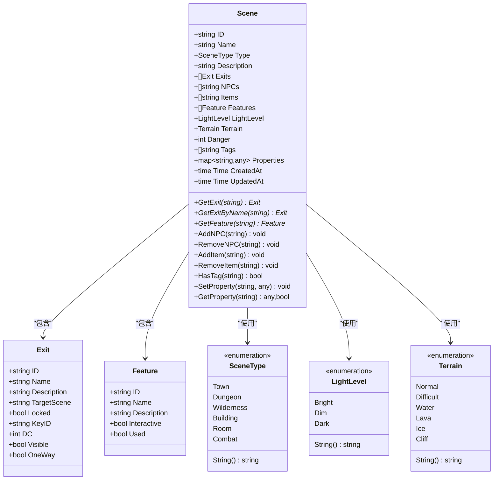

**图表来源**
- [internal/world/scene.go:19-66](file://internal/world/scene.go#L19-L66)
- [internal/world/scene.go:46-57](file://internal/world/scene.go#L46-L57)
- [internal/world/scene.go:59-66](file://internal/world/scene.go#L59-L66)
- [internal/world/scene.go:7-17](file://internal/world/scene.go#L7-L17)
- [internal/world/scene.go:68-121](file://internal/world/scene.go#L68-L121)

**章节来源**
- [internal/world/npc.go:70-231](file://internal/world/npc.go#L70-L231)
- [internal/world/scene.go:19-219](file://internal/world/scene.go#L19-L219)

## 架构概览

CDND的NPC管理系统采用分层架构设计，实现了清晰的关注点分离：

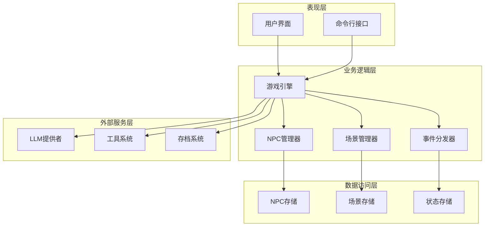

**图表来源**
- [internal/game/engine.go:22-56](file://internal/game/engine.go#L22-L56)
- [internal/world/manager.go:10-23](file://internal/world/manager.go#L10-L23)
- [internal/game/events.go:135-148](file://internal/game/events.go#L135-L148)

系统的核心工作流程如下：

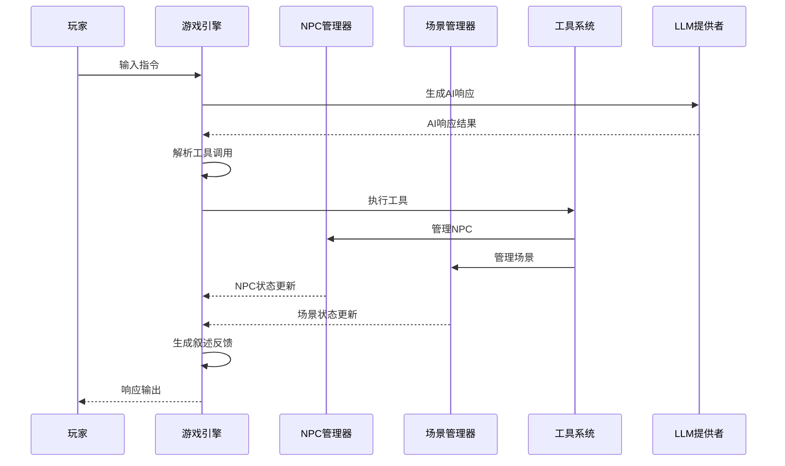

**图表来源**
- [internal/game/engine.go:195-316](file://internal/game/engine.go#L195-L316)
- [internal/tools/registry.go:37-57](file://internal/tools/registry.go#L37-L57)

**章节来源**
- [internal/game/engine.go:1-797](file://internal/game/engine.go#L1-L797)
- [internal/world/manager.go:1-294](file://internal/world/manager.go#L1-L294)

## 详细组件分析

### NPC生命周期管理

NPC的生命周期管理涵盖了从创建到销毁的完整过程：

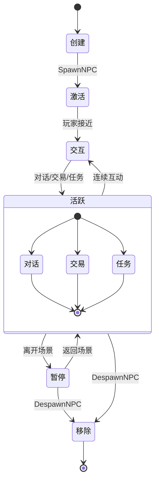

**图表来源**
- [internal/world/manager.go:99-178](file://internal/world/manager.go#L99-L178)

NPC生命周期的关键方法包括：

1. **创建阶段**：通过`AddNPC`方法创建新的NPC实例
2. **激活阶段**：通过`SpawnNPC`方法将NPC添加到指定场景
3. **交互阶段**：支持对话、交易、任务等多种交互方式
4. **移除阶段**：通过`DespawnNPC`或`RemoveNPC`方法移除NPC

**章节来源**
- [internal/world/manager.go:62-178](file://internal/world/manager.go#L62-L178)

### NPC行为模式实现

NPC的行为模式通过多种机制实现：

#### 默认行为系统
NPC具有预定义的行为模式，包括：
- **态度系统**：支持从敌对到同盟的五种态度级别
- **战斗行为**：包含攻击、防御、施法等战斗动作
- **社交行为**：支持对话、交易、任务发布等功能

#### 条件触发机制
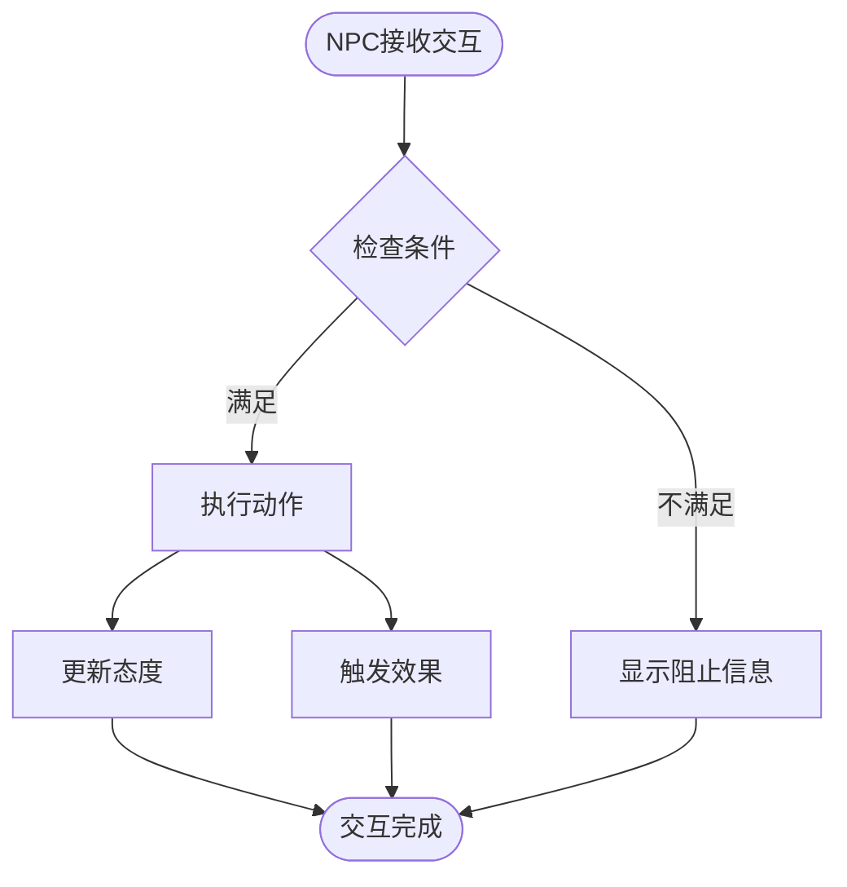

**图表来源**
- [internal/world/npc.go:189-207](file://internal/world/npc.go#L189-L207)

#### 状态变化管理
NPC支持多种状态变化：
- **健康状态**：HP、MaxHP的变化
- **战斗状态**：Conditions数组管理
- **态度状态**：Disposition的动态变化

**章节来源**
- [internal/world/npc.go:139-231](file://internal/world/npc.go#L139-L231)

### 场景绑定与移动机制

NPC与场景的绑定通过管理器实现：

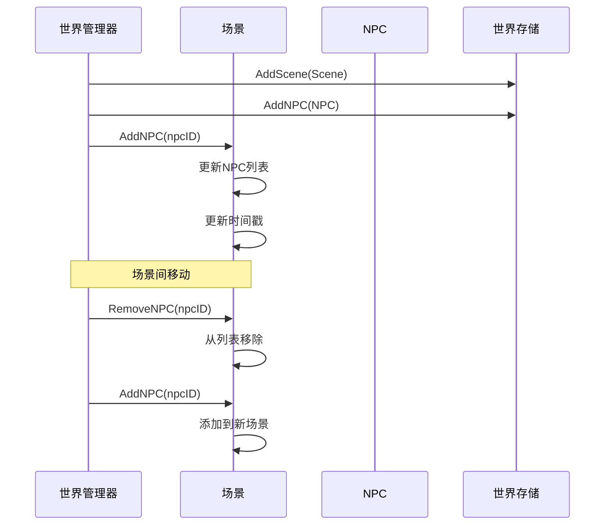

**图表来源**
- [internal/world/manager.go:99-178](file://internal/world/manager.go#L99-L178)

**章节来源**
- [internal/world/manager.go:99-254](file://internal/world/manager.go#L99-L254)

### 对话系统架构

NPC对话系统采用树状结构设计：

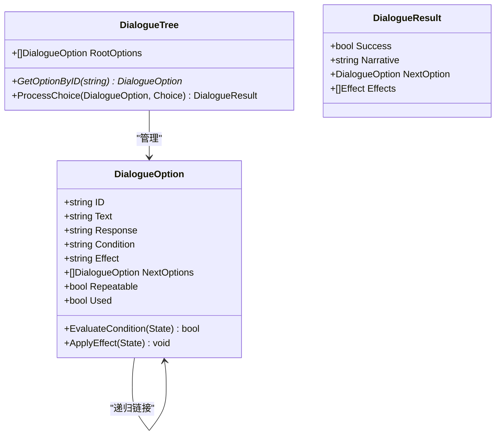

**图表来源**
- [internal/world/npc.go:116-126](file://internal/world/npc.go#L116-L126)
- [internal/world/npc.go:189-207](file://internal/world/npc.go#L189-L207)

对话系统的关键特性：
- **条件判断**：支持基于游戏状态的条件检查
- **效果应用**：支持状态变化和任务推进
- **递归导航**：支持复杂的多层对话结构
- **重复机制**：支持可重复的对话选项

**章节来源**
- [internal/world/npc.go:116-207](file://internal/world/npc.go#L116-L207)

### 工具系统集成

NPC系统通过工具注册表实现与游戏引擎的深度集成：

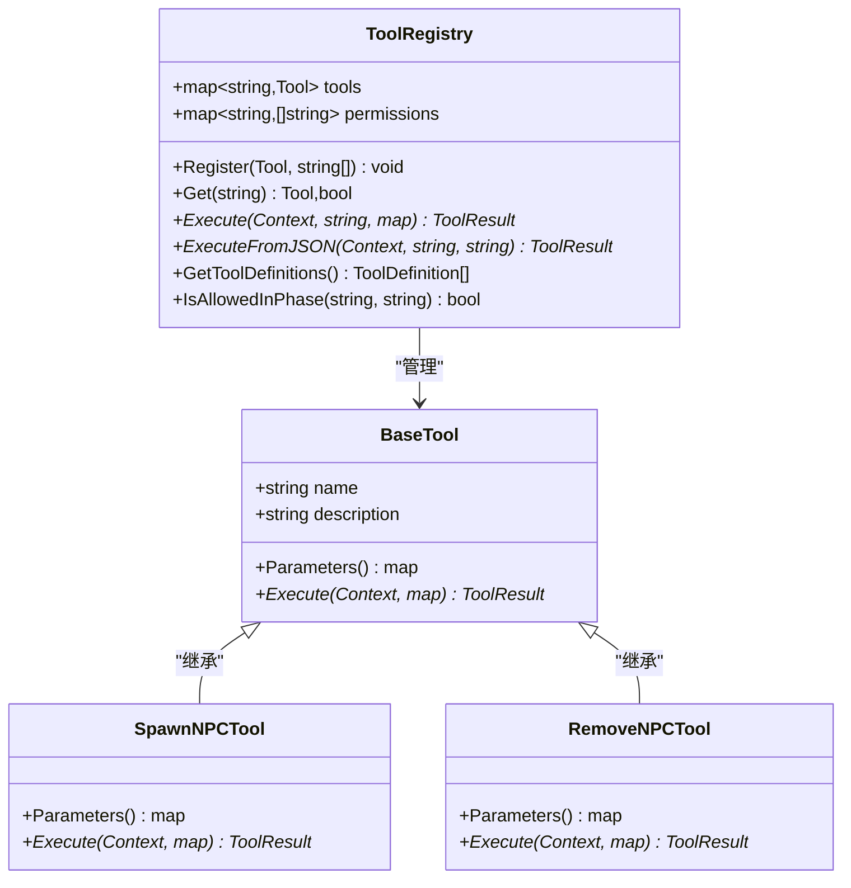

**图表来源**
- [internal/tools/registry.go:9-109](file://internal/tools/registry.go#L9-L109)
- [internal/tools/world_tools.go:82-219](file://internal/tools/world_tools.go#L82-L219)

**章节来源**
- [internal/tools/registry.go:1-109](file://internal/tools/registry.go#L1-L109)
- [internal/tools/world_tools.go:1-330](file://internal/tools/world_tools.go#L1-L330)

## 依赖关系分析

系统采用松耦合的设计原则，通过接口和抽象层实现模块间的解耦：

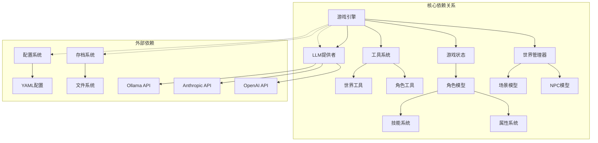

**图表来源**
- [internal/game/engine.go:22-56](file://internal/game/engine.go#L22-L56)
- [internal/world/manager.go:10-23](file://internal/world/manager.go#L10-L23)

**章节来源**
- [internal/game/engine.go:1-797](file://internal/game/engine.go#L1-L797)
- [internal/world/manager.go:1-294](file://internal/world/manager.go#L1-L294)

## 性能考虑

### 内存管理优化

NPC系统采用了多种内存管理策略：

1. **并发安全**：使用读写锁确保多线程环境下的数据一致性
2. **延迟初始化**：按需创建和初始化NPC实例
3. **对象池**：复用频繁创建的对象实例

### 数据访问优化

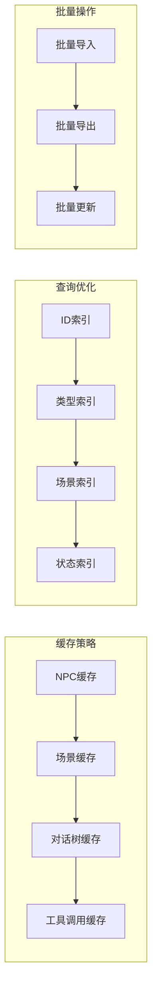

**图表来源**
- [internal/world/manager.go:12-23](file://internal/world/manager.go#L12-L23)

### 并发处理机制

系统支持高并发场景下的NPC管理：

- **读写分离**：读操作共享锁，写操作独占锁
- **无锁数据结构**：在某些场景下使用原子操作
- **goroutine池**：异步处理大量NPC操作请求

## 故障排除指南

### 常见问题诊断

#### NPC无法生成
可能的原因和解决方案：
1. **场景不存在**：检查场景ID的有效性
2. **NPC数据损坏**：验证NPC结构的完整性
3. **权限不足**：确认工具调用的权限设置

#### 对话系统异常
排查步骤：
1. **检查条件语法**：验证条件表达式的正确性
2. **验证效果链**：确保效果执行的顺序正确
3. **检查递归深度**：避免过深的对话树导致栈溢出

#### 场景绑定问题
解决方法：
1. **验证场景连接**：检查出口的双向连接
2. **检查NPC存在性**：确认NPC在源场景中存在
3. **验证ID格式**：确保所有ID都是有效的UUID

**章节来源**
- [internal/world/manager.go:99-178](file://internal/world/manager.go#L99-L178)
- [internal/tools/registry.go:37-57](file://internal/tools/registry.go#L37-L57)

### 调试技巧

1. **日志监控**：启用详细的日志记录跟踪NPC状态变化
2. **状态快照**：定期保存游戏状态进行问题重现
3. **性能分析**：使用pprof分析NPC操作的性能瓶颈
4. **单元测试**：编写针对NPC行为的自动化测试

## 结论

CDND的NPC管理系统展现了现代游戏开发中NPC系统设计的最佳实践。通过模块化架构、事件驱动设计和工具化集成，系统实现了高度的可扩展性和可维护性。

系统的主要优势包括：
- **完整的生命周期管理**：从创建到销毁的全流程支持
- **灵活的场景绑定**：动态的NPC位置管理和场景切换
- **智能对话系统**：基于条件的复杂对话逻辑
- **强大的工具集成**：统一的工具调用接口
- **事件驱动架构**：清晰的状态变化追踪

未来可以考虑的改进方向：
- **AI行为树**：引入更复杂的AI决策机制
- **性能优化**：大规模NPC场景的性能提升
- **可视化编辑器**：提供图形化的NPC配置界面
- **网络同步**：支持多人协作的NPC管理

## 附录

### 最佳实践指南

#### NPC设计原则
1. **行为一致性**：确保NPC的行为与其背景故事一致
2. **交互流畅性**：避免过于复杂的对话分支
3. **游戏平衡性**：合理设置NPC的难度和奖励
4. **可发现性**：通过视觉和听觉线索引导玩家注意

#### 对话设计建议
1. **分支合理性**：每个对话分支都应该有意义
2. **条件明确性**：条件应该清晰易懂
3. **反馈及时性**：玩家的选择应该得到及时反馈
4. **多样性保证**：避免重复的对话内容

#### 性能优化建议
1. **懒加载**：只在需要时加载NPC资源
2. **批处理**：合并相似的操作请求
3. **缓存策略**：合理使用缓存减少重复计算
4. **内存回收**：及时清理不再使用的NPC实例

### 快速参考

#### 常用工具命令
- `spawn_npc`: 生成NPC到当前场景
- `remove_npc`: 从场景移除NPC
- `move_to_scene`: 移动角色到新场景
- `deal_damage`: 对目标造成伤害
- `heal_character`: 治疗目标

#### 配置选项
- `autosave`: 自动保存开关
- `max_history_turns`: 历史记录最大回合数
- `show_dice_rolls`: 显示骰子结果
- `language`: 游戏语言设置