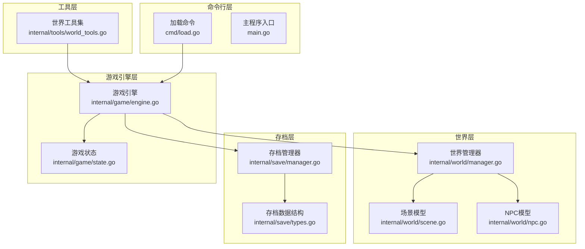
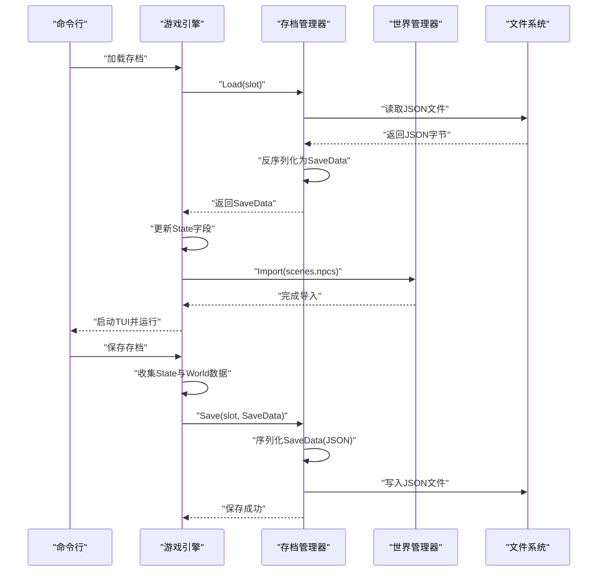
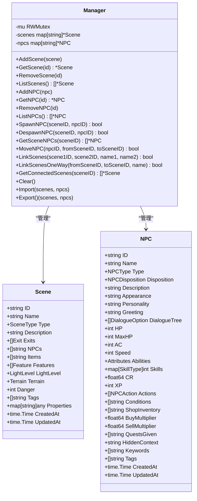
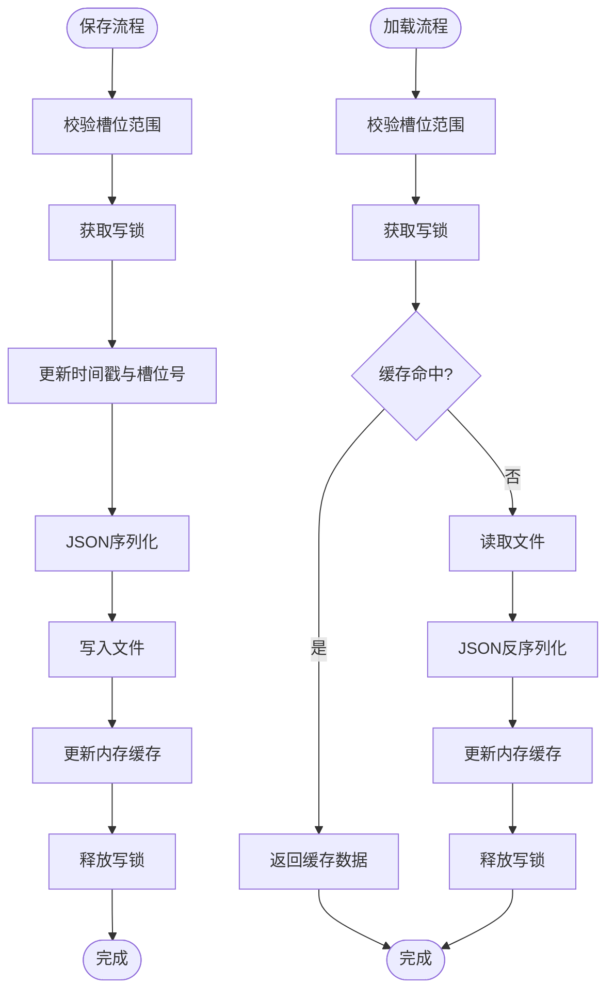
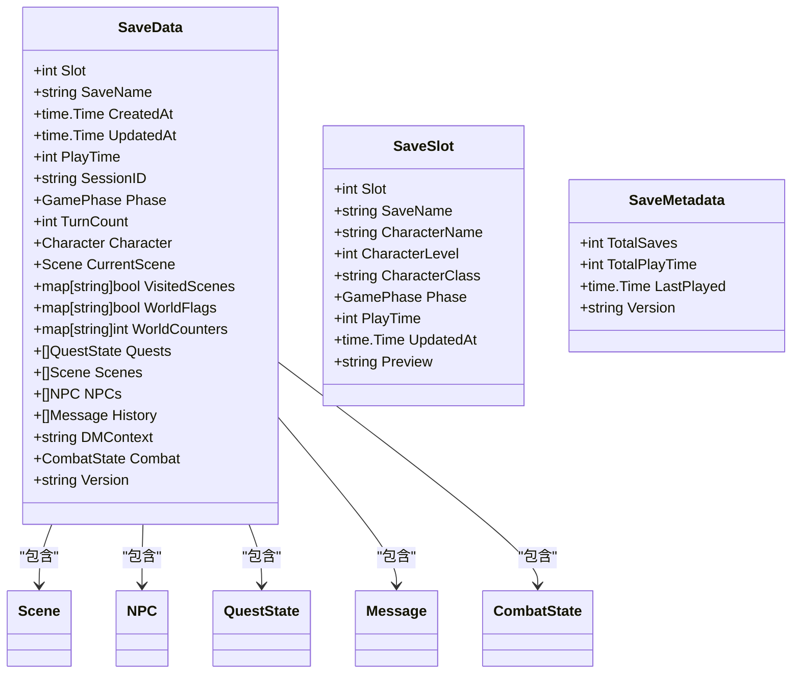
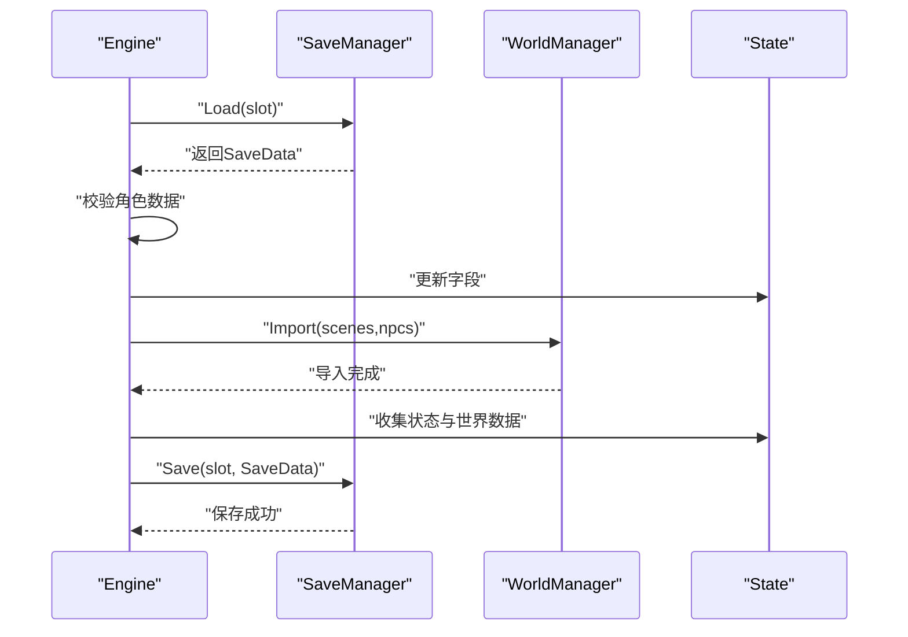
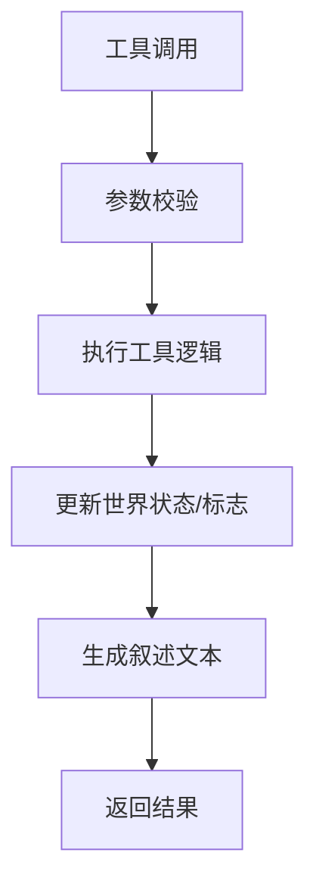
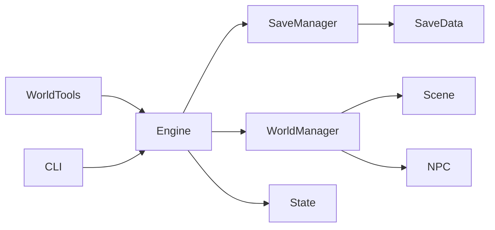

# 世界数据持久化

<cite>
**本文引用的文件**
- [internal/world/manager.go](file://internal/world/manager.go)
- [internal/world/scene.go](file://internal/world/scene.go)
- [internal/world/npc.go](file://internal/world/npc.go)
- [internal/save/manager.go](file://internal/save/manager.go)
- [internal/save/types.go](file://internal/save/types.go)
- [internal/game/engine.go](file://internal/game/engine.go)
- [internal/game/state.go](file://internal/game/state.go)
- [internal/tools/world_tools.go](file://internal/tools/world_tools.go)
- [cmd/load.go](file://cmd/load.go)
- [main.go](file://main.go)
</cite>

## 目录
1. [简介](#简介)
2. [项目结构](#项目结构)
3. [核心组件](#核心组件)
4. [架构总览](#架构总览)
5. [详细组件分析](#详细组件分析)
6. [依赖关系分析](#依赖关系分析)
7. [性能考虑](#性能考虑)
8. [故障排除指南](#故障排除指南)
9. [结论](#结论)
10. [附录](#附录)

## 简介
本技术文档聚焦于CDND的世界数据持久化系统，围绕“世界管理器”的导入导出机制、场景与NPC数据的批量处理、数据序列化与反序列化、版本兼容与迁移策略、并发安全的数据访问、存储格式与结构设计、备份与恢复最佳实践、大型世界数据的性能优化与内存管理、以及世界数据持久化与存档系统的协作关系进行系统化说明，并为世界设计师提供实用工具与故障排除指南。

## 项目结构
CDND采用分层与模块化组织：
- internal/world：世界数据模型与管理器，负责场景与NPC的增删改查、场景链接、批量导入导出。
- internal/save：存档管理器与存档数据结构，负责JSON序列化/反序列化、槽位管理、快速保存/加载、导入导出。
- internal/game：游戏引擎，协调世界管理器与存档管理器，驱动游戏状态流转。
- internal/tools：DM工具集，提供世界数据变更的自动化工具（移动场景、生成/移除NPC、设置标志等）。
- cmd：CLI命令入口，提供加载、列出存档等命令。

图表来源
- [internal/world/manager.go:1-294](file://internal/world/manager.go#L1-L294)
- [internal/world/scene.go:1-219](file://internal/world/scene.go#L1-L219)
- [internal/world/npc.go:1-231](file://internal/world/npc.go#L1-L231)
- [internal/save/manager.go:1-364](file://internal/save/manager.go#L1-L364)
- [internal/save/types.go:1-217](file://internal/save/types.go#L1-L217)
- [internal/game/engine.go:1-797](file://internal/game/engine.go#L1-L797)
- [internal/game/state.go:1-236](file://internal/game/state.go#L1-L236)
- [internal/tools/world_tools.go:1-330](file://internal/tools/world_tools.go#L1-L330)
- [cmd/load.go:1-120](file://cmd/load.go#L1-L120)
- [main.go:1-8](file://main.go#L1-L8)

章节来源
- [internal/world/manager.go:1-294](file://internal/world/manager.go#L1-L294)
- [internal/save/manager.go:1-364](file://internal/save/manager.go#L1-L364)
- [internal/game/engine.go:1-797](file://internal/game/engine.go#L1-L797)
- [cmd/load.go:1-120](file://cmd/load.go#L1-L120)

## 核心组件
- 世界管理器（World Manager）：提供场景与NPC的并发安全增删改查、场景链接、批量导入导出、场景内NPC/物品管理等能力。
- 存档管理器（Save Manager）：提供JSON序列化/反序列化、槽位管理、快速保存/加载、导入导出、缓存与并发控制。
- 存档数据结构（SaveData）：承载角色、世界、对话历史、战斗状态等完整游戏状态，包含版本字段。
- 游戏引擎（Engine）：协调世界管理器与存档管理器，驱动加载/保存流程，处理工具调用与叙事输出。
- 世界工具集（World Tools）：提供移动场景、生成/移除NPC、设置/获取标志等工具，便于世界设计师批量操作。

章节来源
- [internal/world/manager.go:10-294](file://internal/world/manager.go#L10-L294)
- [internal/save/manager.go:20-364](file://internal/save/manager.go#L20-L364)
- [internal/save/types.go:110-217](file://internal/save/types.go#L110-L217)
- [internal/game/engine.go:22-178](file://internal/game/engine.go#L22-L178)
- [internal/tools/world_tools.go:8-330](file://internal/tools/world_tools.go#L8-L330)

## 架构总览
世界数据持久化贯穿“世界层”、“存档层”、“游戏引擎层”，形成如下闭环：
- 世界层负责数据模型与并发安全的CRUD；
- 存档层负责数据的序列化/反序列化与持久化；
- 游戏引擎负责在加载/保存时桥接两者，并维护游戏状态；
- 工具层通过引擎触发世界层的批量变更；
- CLI命令负责用户交互与调用引擎。

图表来源
- [internal/game/engine.go:101-178](file://internal/game/engine.go#L101-L178)
- [internal/save/manager.go:57-122](file://internal/save/manager.go#L57-L122)
- [internal/world/manager.go:264-293](file://internal/world/manager.go#L264-L293)

## 详细组件分析

### 世界管理器（并发安全与批量导入导出）
- 并发安全：使用读写锁保护场景与NPC映射，读多写少场景下提升并发性能。
- 批量导入导出：提供Import/Export方法，支持一次性批量写入/读取场景与NPC集合。
- 场景与NPC管理：提供Add/Get/Remove/List，以及SpawnNPC/DespawnNPC/MoveNPC等场景内实体管理。
- 场景链接：支持双向/单向链接，自动维护场景出口列表与更新时间。

图表来源
- [internal/world/manager.go:10-294](file://internal/world/manager.go#L10-L294)
- [internal/world/scene.go:19-219](file://internal/world/scene.go#L19-L219)
- [internal/world/npc.go:70-231](file://internal/world/npc.go#L70-L231)

章节来源
- [internal/world/manager.go:10-294](file://internal/world/manager.go#L10-L294)
- [internal/world/scene.go:19-219](file://internal/world/scene.go#L19-L219)
- [internal/world/npc.go:70-231](file://internal/world/npc.go#L70-L231)

### 存档管理器（序列化/反序列化与槽位管理）
- JSON序列化：使用标准库JSON进行序列化与反序列化，支持缩进格式化以便人类阅读。
- 槽位管理：固定10个槽位，提供快速保存/加载、列出槽位、空闲槽位查询、存在性检查。
- 缓存机制：基于内存缓存提高频繁读取性能，写入时同步更新缓存。
- 导入导出：支持从文件导入存档到指定槽位，或将槽位导出到文件。

图表来源
- [internal/save/manager.go:57-122](file://internal/save/manager.go#L57-L122)
- [internal/save/manager.go:145-181](file://internal/save/manager.go#L145-L181)

章节来源
- [internal/save/manager.go:20-364](file://internal/save/manager.go#L20-L364)

### 存档数据结构（版本与字段设计）
- 字段覆盖：角色、世界状态（当前场景、访问标记、标志、计数器、任务）、场景与NPC集合、对话历史、战斗状态、版本号。
- 版本字段：Version用于后续版本兼容与迁移策略。
- 工具方法：NewSaveData初始化默认值；GetWorldData便捷提取世界数据；ToSlot生成槽位预览信息。

图表来源
- [internal/save/types.go:110-217](file://internal/save/types.go#L110-L217)

章节来源
- [internal/save/types.go:110-217](file://internal/save/types.go#L110-L217)

### 游戏引擎（加载/保存与世界管理器协作）
- 加载流程：从存档管理器读取SaveData，填充游戏状态，再调用世界管理器Import批量导入场景与NPC。
- 保存流程：从游戏状态与世界管理器收集数据，封装为SaveData并调用存档管理器保存。
- 并发与完整性：加载时对关键字段进行空值检查，确保角色数据有效；保存时统一更新时间戳与版本号。

图表来源
- [internal/game/engine.go:101-178](file://internal/game/engine.go#L101-L178)
- [internal/world/manager.go:264-293](file://internal/world/manager.go#L264-L293)

章节来源
- [internal/game/engine.go:101-178](file://internal/game/engine.go#L101-L178)

### 世界工具集（批量操作与世界数据变更）
- 工具类型：移动场景、生成NPC、移除NPC、设置/获取标志等。
- 参数校验与执行：工具定义包含参数Schema，执行时进行类型校验并生成D&D风格叙述。
- 与世界管理器协作：工具通过状态接口修改世界标志、场景与NPC集合，世界管理器负责实际的实体管理。

图表来源
- [internal/tools/world_tools.go:8-330](file://internal/tools/world_tools.go#L8-L330)

章节来源
- [internal/tools/world_tools.go:8-330](file://internal/tools/world_tools.go#L8-L330)

## 依赖关系分析
- 世界管理器依赖场景与NPC模型，提供并发安全的CRUD与批量导入导出。
- 存档管理器依赖标准库JSON与文件系统，提供槽位管理与缓存。
- 游戏引擎同时依赖世界管理器与存档管理器，作为数据流的桥梁。
- 世界工具集通过引擎注册，间接影响世界数据。
- CLI命令通过引擎加载/保存存档，驱动整个生命周期。

图表来源
- [internal/game/engine.go:22-56](file://internal/game/engine.go#L22-L56)
- [internal/world/manager.go:10-23](file://internal/world/manager.go#L10-L23)
- [internal/save/manager.go:20-43](file://internal/save/manager.go#L20-L43)

章节来源
- [internal/game/engine.go:22-56](file://internal/game/engine.go#L22-L56)
- [internal/world/manager.go:10-23](file://internal/world/manager.go#L10-L23)
- [internal/save/manager.go:20-43](file://internal/save/manager.go#L20-L43)

## 性能考虑
- 并发安全
  - 世界管理器使用读写锁，读多写少场景下提升并发吞吐；批量导入导出统一持有写锁，避免中间态暴露。
  - 存档管理器同样使用读写锁，结合内存缓存减少磁盘IO。
- 序列化开销
  - JSON序列化/反序列化为纯文本，便于调试但可能较大；建议在大型世界数据场景下评估压缩策略（需额外依赖与复杂度）。
- 内存占用
  - SaveData包含场景与NPC数组，大型世界会显著增加内存；建议按需加载（仅加载当前场景及邻近场景），或分页/懒加载策略。
- I/O优化
  - 存档管理器提供缓存，避免重复读取；快速保存/加载优先使用空槽位或最近更新槽位，减少碎片化。
- 工具执行
  - 工具执行在引擎中循环，建议限制最大迭代次数，避免长链路导致的延迟。

章节来源
- [internal/world/manager.go:10-294](file://internal/world/manager.go#L10-L294)
- [internal/save/manager.go:20-364](file://internal/save/manager.go#L20-L364)
- [internal/game/engine.go:195-316](file://internal/game/engine.go#L195-L316)

## 故障排除指南
- 加载失败
  - 现象：加载报错“角色数据为空”或“存档数据不完整”。
  - 排查：确认SaveData中Character非空；检查存档文件是否损坏；确认版本兼容性。
  - 处理：重新保存或从备份恢复；必要时手动修复JSON。
- 保存失败
  - 现象：序列化/写入失败。
  - 排查：检查磁盘权限、空间；确认JSON序列化未抛异常。
  - 处理：清理缓存后重试；检查存档目录权限。
- 并发问题
  - 现象：读写冲突导致数据不一致。
  - 排查：确认所有读写均通过世界管理器提供的方法；避免直接修改内部映射。
  - 处理：使用Import/Export进行批量操作；避免在持有读锁期间执行长时间操作。
- 工具执行异常
  - 现象：工具返回错误或叙述异常。
  - 排查：核对参数Schema；检查工具执行结果与错误信息。
  - 处理：修正参数；查看叙述日志定位问题。

章节来源
- [internal/game/engine.go:101-150](file://internal/game/engine.go#L101-L150)
- [internal/save/manager.go:57-122](file://internal/save/manager.go#L57-L122)
- [internal/tools/world_tools.go:8-330](file://internal/tools/world_tools.go#L8-L330)

## 结论
CDND的世界数据持久化系统以“世界管理器+存档管理器+游戏引擎”为核心，实现了并发安全、可扩展的场景与NPC管理，以及可靠的JSON序列化/反序列化与槽位管理。通过工具集与CLI命令，世界设计师可以高效地进行批量操作与存档管理。未来可在版本兼容、压缩序列化、分页加载等方面进一步优化，以支撑更大规模的世界数据。

## 附录

### 数据序列化与反序列化流程
- 保存：引擎收集状态与世界数据，封装为SaveData，调用存档管理器进行JSON序列化与文件写入。
- 加载：存档管理器读取JSON并反序列化为SaveData，引擎更新状态并调用世界管理器导入场景与NPC。

章节来源
- [internal/game/engine.go:152-178](file://internal/game/engine.go#L152-L178)
- [internal/save/manager.go:57-122](file://internal/save/manager.go#L57-L122)

### 版本兼容与迁移策略
- 现状：SaveData包含Version字段，默认值为“1.0.0”，便于后续版本演进。
- 建议：
  - 新增字段：保持向后兼容，读取时忽略未知字段。
  - 字段变更：提供迁移函数，读取旧版本数据后转换为新结构。
  - 版本升级：在加载时检测Version，执行对应迁移步骤后再继续。

章节来源
- [internal/save/types.go:145-147](file://internal/save/types.go#L145-L147)

### 备份与恢复最佳实践
- 定期备份：使用存档管理器的导出功能将槽位导出为独立JSON文件，定期归档。
- 恢复策略：通过导入功能将备份文件恢复到指定槽位；加载前先验证JSON有效性。
- 多版本共存：不同版本的存档可并存于同一目录，通过文件名区分。

章节来源
- [internal/save/manager.go:331-363](file://internal/save/manager.go#L331-L363)

### 大型世界数据的性能优化与内存管理
- 按需加载：仅加载当前场景与邻近场景，其他场景延迟加载。
- 分页/懒加载：对场景与NPC列表采用分页或按需访问。
- 缓存策略：利用存档管理器缓存与世界管理器的并发读写，减少重复计算。
- 序列化优化：在保证可读性的前提下，评估压缩方案（需权衡CPU与I/O）。

章节来源
- [internal/save/manager.go:20-364](file://internal/save/manager.go#L20-L364)
- [internal/world/manager.go:10-294](file://internal/world/manager.go#L10-L294)

### 世界数据持久化与存档系统的协作关系
- 协作点：引擎在加载/保存时桥接世界管理器与存档管理器，确保世界数据与游戏状态的一致性。
- 一致性保障：加载时进行角色数据校验；保存时统一更新时间戳与版本号；导入导出采用批量原子操作。

章节来源
- [internal/game/engine.go:101-178](file://internal/game/engine.go#L101-L178)
- [internal/world/manager.go:264-293](file://internal/world/manager.go#L264-L293)

### 世界设计师实用工具与故障排除
- 实用工具：移动场景、生成/移除NPC、设置/获取标志等，通过CLI命令或引擎工具注册使用。
- 故障排除：关注参数校验、叙述输出、缓存一致性与文件权限；必要时回滚到最近一次成功保存。

章节来源
- [internal/tools/world_tools.go:8-330](file://internal/tools/world_tools.go#L8-L330)
- [cmd/load.go:1-120](file://cmd/load.go#L1-L120)