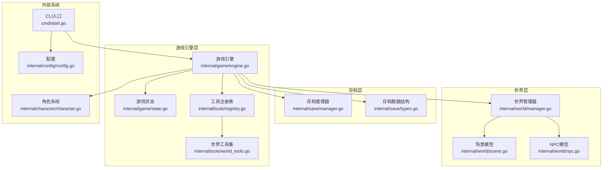
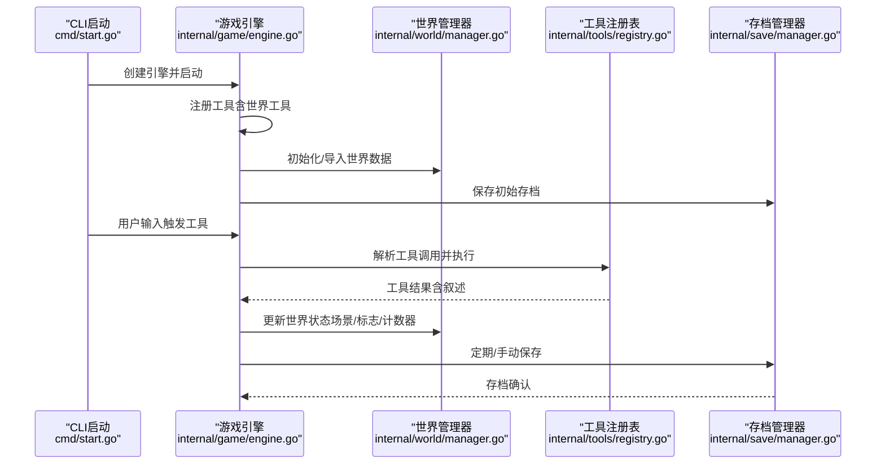
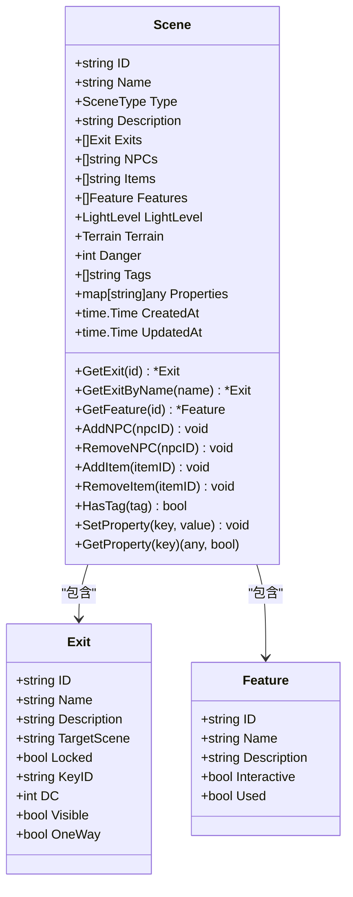
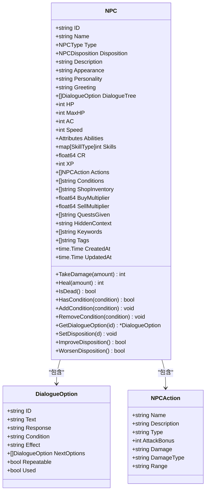
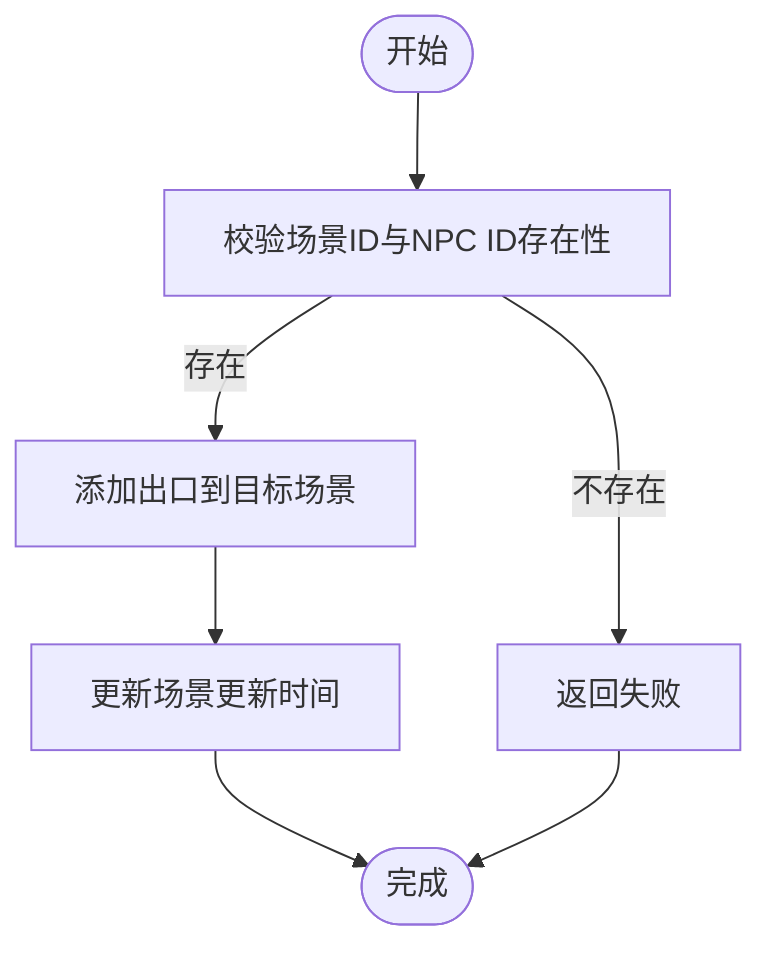
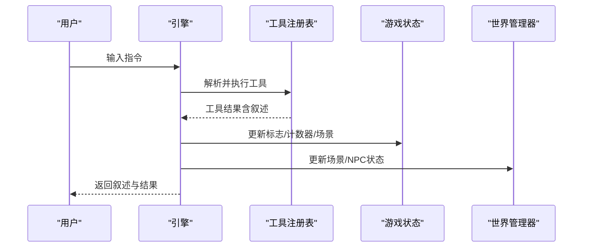
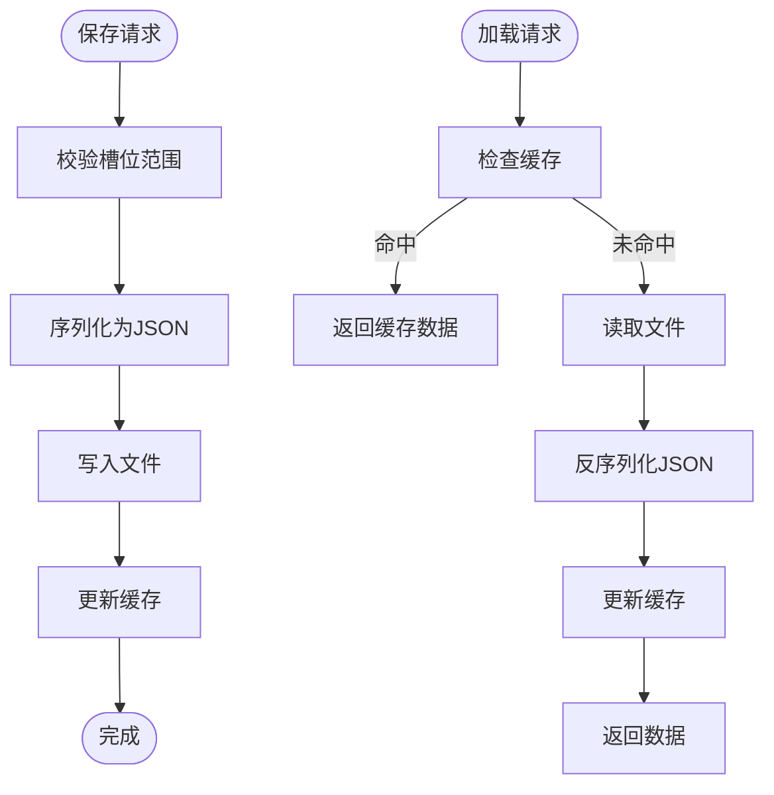
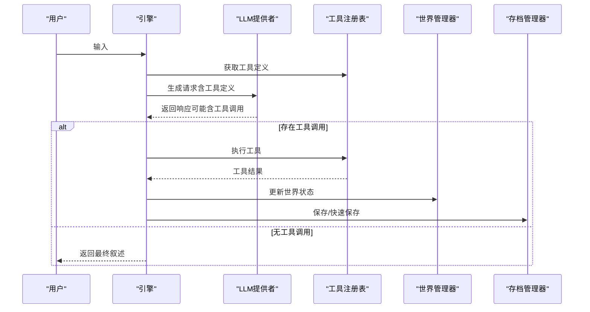
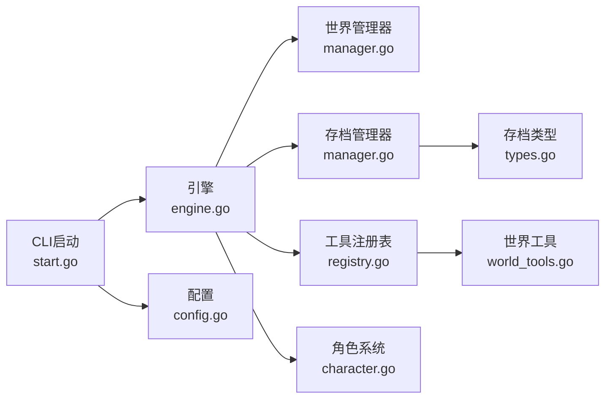

# 世界构建系统

<cite>
**本文引用的文件**
- [internal/world/manager.go](file://internal/world/manager.go)
- [internal/world/scene.go](file://internal/world/scene.go)
- [internal/world/npc.go](file://internal/world/npc.go)
- [internal/save/manager.go](file://internal/save/manager.go)
- [internal/save/types.go](file://internal/save/types.go)
- [internal/game/engine.go](file://internal/game/engine.go)
- [internal/game/state.go](file://internal/game/state.go)
- [internal/tools/world_tools.go](file://internal/tools/world_tools.go)
- [internal/tools/registry.go](file://internal/tools/registry.go)
- [internal/character/character.go](file://internal/character/character.go)
- [cmd/start.go](file://cmd/start.go)
- [main.go](file://main.go)
- [internal/config/config.go](file://internal/config/config.go)
</cite>

## 目录
1. [简介](#简介)
2. [项目结构](#项目结构)
3. [核心组件](#核心组件)
4. [架构总览](#架构总览)
5. [详细组件分析](#详细组件分析)
6. [依赖关系分析](#依赖关系分析)
7. [性能考量](#性能考量)
8. [故障排除指南](#故障排除指南)
9. [结论](#结论)
10. [附录](#附录)

## 简介
本技术文档围绕 CDND 的“世界构建系统”展开，重点解释场景管理系统、NPC 系统、物品系统、世界标志与计数器系统、世界数据的持久化与加载机制，并提供最佳实践、设计模式以及与角色系统、工具系统的交互关系。文档旨在帮助世界设计师与开发者高效构建丰富的游戏世界，支持复杂场景与多人互动。

## 项目结构
CDND 采用分层模块化组织：
- internal/world：世界实体（场景、NPC、场景连接）
- internal/save：存档管理（保存/加载/快速保存/导出导入）
- internal/game：游戏引擎（状态、事件、LLM 集成、工具注册）
- internal/tools：工具注册表与世界构建工具（移动场景、生成/移除NPC、设置标志等）
- internal/character：角色系统（D&D 5e 角色模型）
- cmd：CLI 入口与启动流程
- internal/config：配置管理

图表来源
- [internal/world/manager.go:1-294](file://internal/world/manager.go#L1-L294)
- [internal/world/scene.go:1-219](file://internal/world/scene.go#L1-L219)
- [internal/world/npc.go:1-231](file://internal/world/npc.go#L1-L231)
- [internal/save/manager.go:1-364](file://internal/save/manager.go#L1-L364)
- [internal/save/types.go:1-217](file://internal/save/types.go#L1-L217)
- [internal/game/engine.go:1-797](file://internal/game/engine.go#L1-L797)
- [internal/game/state.go:1-236](file://internal/game/state.go#L1-L236)
- [internal/tools/registry.go:1-132](file://internal/tools/registry.go#L1-L132)
- [internal/tools/world_tools.go:1-330](file://internal/tools/world_tools.go#L1-L330)
- [internal/character/character.go:1-223](file://internal/character/character.go#L1-L223)
- [cmd/start.go:1-99](file://cmd/start.go#L1-L99)
- [internal/config/config.go:1-54](file://internal/config/config.go#L1-L54)

章节来源
- [internal/world/manager.go:1-294](file://internal/world/manager.go#L1-L294)
- [internal/world/scene.go:1-219](file://internal/world/scene.go#L1-L219)
- [internal/world/npc.go:1-231](file://internal/world/npc.go#L1-L231)
- [internal/save/manager.go:1-364](file://internal/save/manager.go#L1-L364)
- [internal/save/types.go:1-217](file://internal/save/types.go#L1-L217)
- [internal/game/engine.go:1-797](file://internal/game/engine.go#L1-L797)
- [internal/game/state.go:1-236](file://internal/game/state.go#L1-L236)
- [internal/tools/registry.go:1-132](file://internal/tools/registry.go#L1-L132)
- [internal/tools/world_tools.go:1-330](file://internal/tools/world_tools.go#L1-L330)
- [internal/character/character.go:1-223](file://internal/character/character.go#L1-L223)
- [cmd/start.go:1-99](file://cmd/start.go#L1-L99)
- [internal/config/config.go:1-54](file://internal/config/config.go#L1-L54)

## 核心组件
- 世界管理器：负责场景与NPC的增删改查、场景连接、跨场景移动、导入导出世界数据。
- 场景模型：定义场景类型、环境属性、出口、特性、NPC/物品列表、自定义属性与标签。
- NPC 模型：定义NPC类型、态度、对话树、战斗属性、商人/任务相关字段、AI关键词与隐藏上下文。
- 存档管理器：提供多槽位存档、快速保存/加载、元数据统计、导入导出、缓存优化。
- 存档数据结构：封装角色、当前场景、访问过的场景、世界标志/计数器、任务、对话历史、战斗状态等。
- 游戏引擎：集成 LLM、工具注册表、事件分发、状态管理、存档/加载、回合制推进。
- 工具注册表与世界工具：提供移动场景、生成/移除NPC、设置/获取标志等工具，支持 D&D 风格叙述输出。
- 角色系统：提供 D&D 5e 角色模型（属性、技能、豁免、生命值、装备、状态等）。

章节来源
- [internal/world/manager.go:10-294](file://internal/world/manager.go#L10-L294)
- [internal/world/scene.go:19-219](file://internal/world/scene.go#L19-L219)
- [internal/world/npc.go:70-231](file://internal/world/npc.go#L70-L231)
- [internal/save/manager.go:20-364](file://internal/save/manager.go#L20-L364)
- [internal/save/types.go:110-217](file://internal/save/types.go#L110-L217)
- [internal/game/engine.go:22-797](file://internal/game/engine.go#L22-L797)
- [internal/game/state.go:13-236](file://internal/game/state.go#L13-L236)
- [internal/tools/registry.go:10-132](file://internal/tools/registry.go#L10-L132)
- [internal/tools/world_tools.go:8-330](file://internal/tools/world_tools.go#L8-L330)
- [internal/character/character.go:8-223](file://internal/character/character.go#L8-L223)

## 架构总览
世界构建系统以“世界管理器 + 场景/NPC + 存档 + 引擎 + 工具”的分层架构运行。引擎通过工具调用实现世界状态变更，同时将变更反馈给 LLM 并生成 D&D 风格叙述，最终持久化到存档。

图表来源
- [cmd/start.go:29-99](file://cmd/start.go#L29-L99)
- [internal/game/engine.go:35-76](file://internal/game/engine.go#L35-L76)
- [internal/world/manager.go:265-293](file://internal/world/manager.go#L265-L293)
- [internal/tools/registry.go:25-77](file://internal/tools/registry.go#L25-L77)
- [internal/save/manager.go:57-86](file://internal/save/manager.go#L57-L86)

## 详细组件分析

### 场景管理系统
- 设计要点
  - 场景类型枚举（城镇、地下城、荒野、建筑、房间、战斗场景）
  - 环境属性：光照等级、地形类型、危险等级
  - 出口系统：双向/单向连接，支持锁定、钥匙、可见性、描述
  - 场景特性：可互动特性，用于装饰/功能点
  - NPC/物品/特性列表：场景内实体清单
  - 自定义属性与标签：扩展性与过滤能力
- 关键方法
  - 场景增删改查、按ID/名称检索出口与特性
  - NPC/物品的添加与移除（去重）
  - 标签检查与自定义属性设置/获取
- 数据流
  - 世界管理器维护场景字典，场景内部维护实体列表
  - 场景连接通过出口列表实现，支持跨场景移动

图表来源
- [internal/world/scene.go:19-219](file://internal/world/scene.go#L19-L219)

章节来源
- [internal/world/scene.go:7-219](file://internal/world/scene.go#L7-L219)

### NPC 系统
- 设计要点
  - NPC 类型：普通、商人、任务发布者、敌人、盟友、训练师
  - 态度系统：敌对、不友好、中立、友好、同盟
  - 对话树：递归结构，支持条件、效果、可重复、使用标记
  - 战斗属性：生命值、护甲等级、速度、属性、技能、动作、状态
  - 商人/任务相关字段：商品列表、买卖倍率、可发布的任务
  - AI 提示：隐藏上下文、关键词标签
- 关键方法
  - 受伤/治疗、死亡判断、状态管理
  - 态度改善/恶化
  - 对话选项检索（递归）

图表来源
- [internal/world/npc.go:70-231](file://internal/world/npc.go#L70-L231)

章节来源
- [internal/world/npc.go:9-231](file://internal/world/npc.go#L9-L231)

### 世界管理器与场景连接
- 设计要点
  - 场景与NPC的并发安全（读写锁）
  - 场景连接：双向/单向，自动维护两端出口
  - 跨场景移动：从场景A移除NPC并在场景B添加
  - 导入/导出：批量导入/导出场景与NPC
- 关键方法
  - AddScene/GetScene/RemoveScene/ListScenes
  - AddNPC/GetNPC/RemoveNPC/ListNPCs
  - SpawnNPC/DespawnNPC/MoveNPC
  - LinkScenes/LinkScenesOneWay/GetConnectedScenes
  - Import/Export/Clear

图表来源
- [internal/world/manager.go:180-235](file://internal/world/manager.go#L180-L235)

章节来源
- [internal/world/manager.go:25-294](file://internal/world/manager.go#L25-L294)

### 世界标志与计数器系统
- 设计要点
  - 世界标志：布尔型状态标记，用于任务状态、剧情开关
  - 世界计数器：整数计数，用于进度、次数统计
  - 工具驱动：移动场景、生成NPC、设置标志等工具直接修改状态
- 关键方法
  - State.SetFlag/GetFlag/SetCounter/GetCounter/IncrementCounter
  - 工具：MoveToSceneTool、SpawnNPCTool、RemoveNPCTool、SetFlagTool、GetFlagTool

图表来源
- [internal/game/engine.go:195-316](file://internal/game/engine.go#L195-L316)
- [internal/tools/world_tools.go:44-80](file://internal/tools/world_tools.go#L44-L80)
- [internal/game/state.go:110-134](file://internal/game/state.go#L110-L134)

章节来源
- [internal/game/state.go:110-134](file://internal/game/state.go#L110-L134)
- [internal/tools/world_tools.go:82-330](file://internal/tools/world_tools.go#L82-L330)

### 存档与持久化
- 设计要点
  - 多槽位存档（1-10），统一目录结构
  - 缓存优化：避免重复读取
  - 快速保存/加载：自动选择空槽位或最近存档
  - 导入/导出：支持文件级导入导出
  - 存档数据：包含角色、当前场景、访问过的场景、世界标志/计数器、任务、对话历史、战斗状态、版本信息
- 关键方法
  - Save/Load/Delete/ListSlots/Exists/QuickSave/QuickLoad/ImportSave/ExportSave
  - SaveData.NewSaveData/ToSlot/GetWorldData

图表来源
- [internal/save/manager.go:57-122](file://internal/save/manager.go#L57-L122)
- [internal/save/manager.go:332-363](file://internal/save/manager.go#L332-L363)
- [internal/save/types.go:110-147](file://internal/save/types.go#L110-L147)

章节来源
- [internal/save/manager.go:20-364](file://internal/save/manager.go#L20-L364)
- [internal/save/types.go:110-217](file://internal/save/types.go#L110-L217)

### 游戏引擎与工具系统
- 设计要点
  - 引擎聚合：状态、LLM、规则、世界、存档、工具注册表、事件分发
  - 工具注册：集中注册所有工具，支持按阶段权限控制
  - AGENTIC LOOP：LLM -> 工具调用 -> 工具执行 -> 结果反馈 -> 循环
  - D&D 风格叙述：根据工具类别生成带表情符号的叙述块
- 关键方法
  - NewEngine/registerTools/ProcessWithTools/ExecuteTool/GetToolDefinitions
  - Start/LoadGame/SaveGame/GetState/GetCurrentScene/SetScene/SetPhase
  - 事件订阅与分发

图表来源
- [internal/game/engine.go:58-76](file://internal/game/engine.go#L58-L76)
- [internal/game/engine.go:195-316](file://internal/game/engine.go#L195-L316)
- [internal/tools/registry.go:25-77](file://internal/tools/registry.go#L25-L77)

章节来源
- [internal/game/engine.go:22-797](file://internal/game/engine.go#L22-L797)
- [internal/tools/registry.go:10-132](file://internal/tools/registry.go#L10-L132)

### 与角色系统的交互
- 设计要点
  - 角色作为游戏状态的一部分，参与战斗、检定、状态变化
  - 引擎提供伤害/治疗、豁免/技能检定、状态管理等接口
  - 角色模型包含属性、技能、豁免、生命值、装备、状态等
- 关键方法
  - TakeDamage/Heal/技能检定/豁免检定/状态管理

章节来源
- [internal/character/character.go:8-223](file://internal/character/character.go#L8-L223)
- [internal/game/engine.go:326-387](file://internal/game/engine.go#L326-L387)

## 依赖关系分析
- 组件耦合
  - 引擎强依赖世界管理器、存档管理器、工具注册表、角色系统
  - 工具注册表与工具实现解耦，便于扩展
  - 世界管理器与场景/NPC模型弱耦合，通过ID关联
- 外部依赖
  - LLM 提供者（OpenAI/Ollama/Anthropic 等）
  - 配置系统（YAML/环境变量）
  - UI（Bubble Tea TUI）
- 潜在循环依赖
  - 未发现循环依赖；各模块职责清晰

图表来源
- [internal/game/engine.go:22-56](file://internal/game/engine.go#L22-L56)
- [internal/world/manager.go:1-23](file://internal/world/manager.go#L1-L23)
- [internal/save/manager.go:1-25](file://internal/save/manager.go#L1-L25)
- [internal/tools/registry.go:1-15](file://internal/tools/registry.go#L1-L15)
- [internal/character/character.go:1-6](file://internal/character/character.go#L1-L6)
- [internal/save/types.go:1-9](file://internal/save/types.go#L1-L9)
- [cmd/start.go:1-13](file://cmd/start.go#L1-L13)
- [internal/config/config.go:1-14](file://internal/config/config.go#L1-L14)

章节来源
- [internal/game/engine.go:22-56](file://internal/game/engine.go#L22-L56)
- [cmd/start.go:29-99](file://cmd/start.go#L29-L99)

## 性能考量
- 并发安全
  - 世界管理器使用读写锁保护场景与NPC集合，降低锁竞争
- 缓存策略
  - 存档管理器缓存已读取的存档，减少磁盘 IO
- 数据结构
  - 场景与NPC列表使用切片，查询按需遍历；可通过索引优化进一步提升
- 工具执行
  - AGENTIC LOOP 最大迭代次数限制，防止无限循环
- I/O 优化
  - JSON 序列化/反序列化在内存中进行，避免频繁磁盘访问

## 故障排除指南
- 存档槽位无效
  - 现象：保存/加载报错“无效的存档槽位”
  - 处理：确保槽位在 1-10 范围内
- 存档文件损坏
  - 现象：解析存档数据失败
  - 处理：检查 JSON 文件格式，必要时使用导出/导入修复
- 工具执行错误
  - 现象：工具返回错误或叙述异常
  - 处理：检查工具参数、权限与阶段限制；查看事件日志
- 场景/NPC 不存在
  - 现象：移动/生成/移除失败
  - 处理：确认 ID 存在且已导入世界数据

章节来源
- [internal/save/manager.go:58-86](file://internal/save/manager.go#L58-L86)
- [internal/save/manager.go:88-122](file://internal/save/manager.go#L88-L122)
- [internal/tools/registry.go:43-54](file://internal/tools/registry.go#L43-L54)
- [internal/world/manager.go:99-132](file://internal/world/manager.go#L99-L132)

## 结论
CDND 的世界构建系统以清晰的分层架构实现了场景与NPC的灵活管理、强大的世界标志/计数器系统、可靠的存档持久化与加载机制，并通过工具系统与 LLM 的结合提供了自然语言驱动的 AGENTIC LOOP。该系统为世界设计师提供了强大的工具集，支持复杂场景与多人互动，同时保持良好的扩展性与性能。

## 附录

### 最佳实践与设计模式
- 场景设计
  - 使用标签与自定义属性区分场景用途与状态
  - 合理设置出口的可见性与锁定机制，增强叙事体验
- NPC 设计
  - 为对话树设置条件与效果，实现分支剧情
  - 利用态度系统与状态管理增强互动深度
- 世界标志与计数器
  - 使用明确的命名约定（如 visited_xxx、flag_xxx），便于调试与脚本化
  - 将关键剧情节点与标志绑定，确保可追踪性
- 存档策略
  - 定期快速保存，避免长时间未保存导致的数据丢失
  - 使用导入/导出功能备份重要世界数据
- 工具扩展
  - 新增工具时遵循现有参数规范与叙述风格，保持一致性
  - 为工具设置阶段权限，避免在不合适的阶段执行

### 复杂场景与多人互动实现指南
- 复杂场景
  - 使用特性系统承载可互动对象（如宝箱、传送门、机关）
  - 通过标志与计数器控制场景状态（如开启/关闭、激活/失效）
- 多人互动
  - 通过世界标志与计数器协调多个玩家的行为与进度
  - 使用工具链组合实现复杂的场景切换与NPC生成/移除

### 世界系统与角色系统、工具系统的交互关系
- 角色系统
  - 引擎提供伤害/治疗、检定、状态管理等接口，角色作为状态载体参与世界事件
- 工具系统
  - 世界工具直接修改世界状态（场景、NPC、标志、计数器），并通过叙述反馈给用户
- 存档系统
  - 引擎在保存时将世界数据与角色数据合并，确保完整生命周期

章节来源
- [internal/game/engine.go:353-402](file://internal/game/engine.go#L353-L402)
- [internal/tools/world_tools.go:44-330](file://internal/tools/world_tools.go#L44-L330)
- [internal/save/types.go:110-147](file://internal/save/types.go#L110-L147)