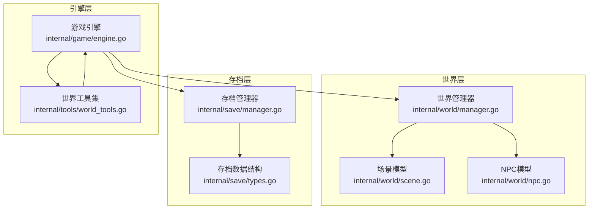
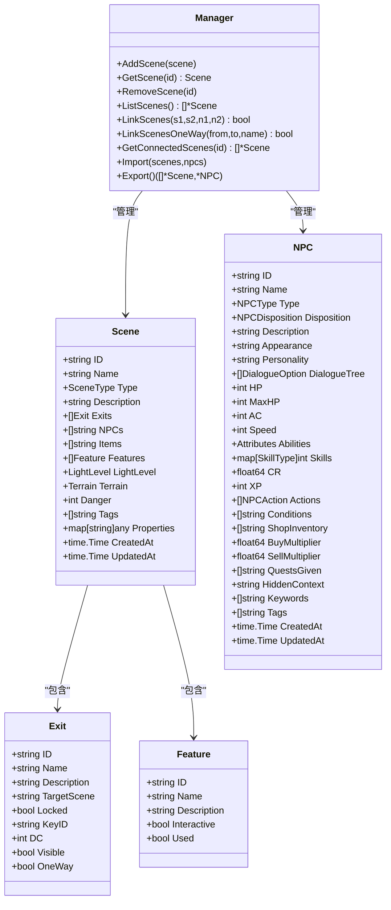
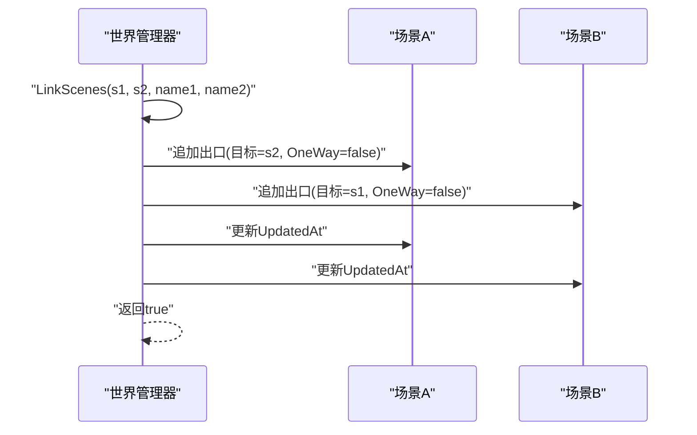
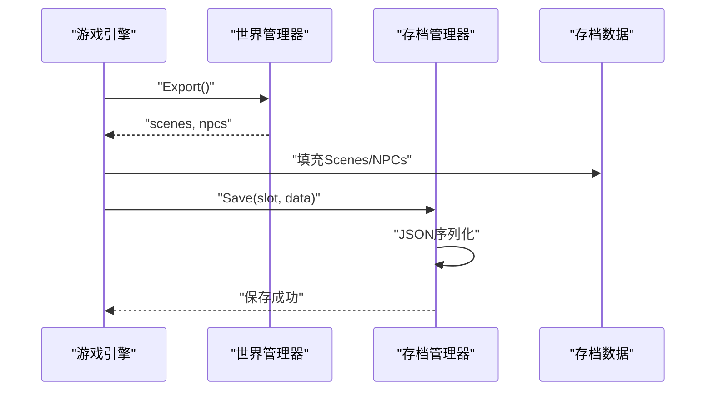
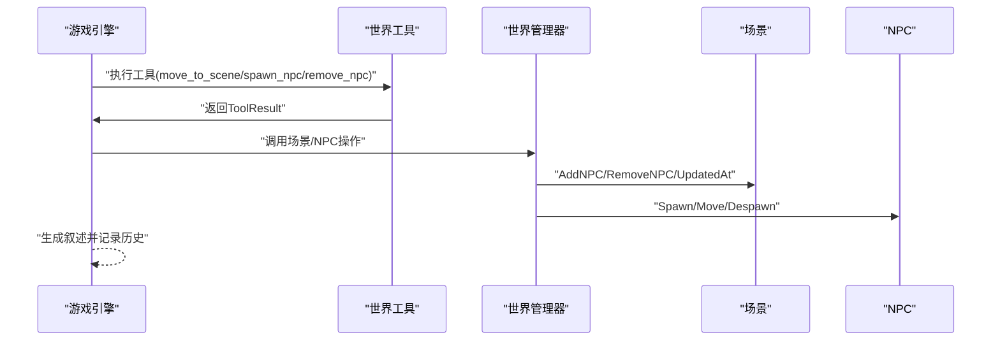
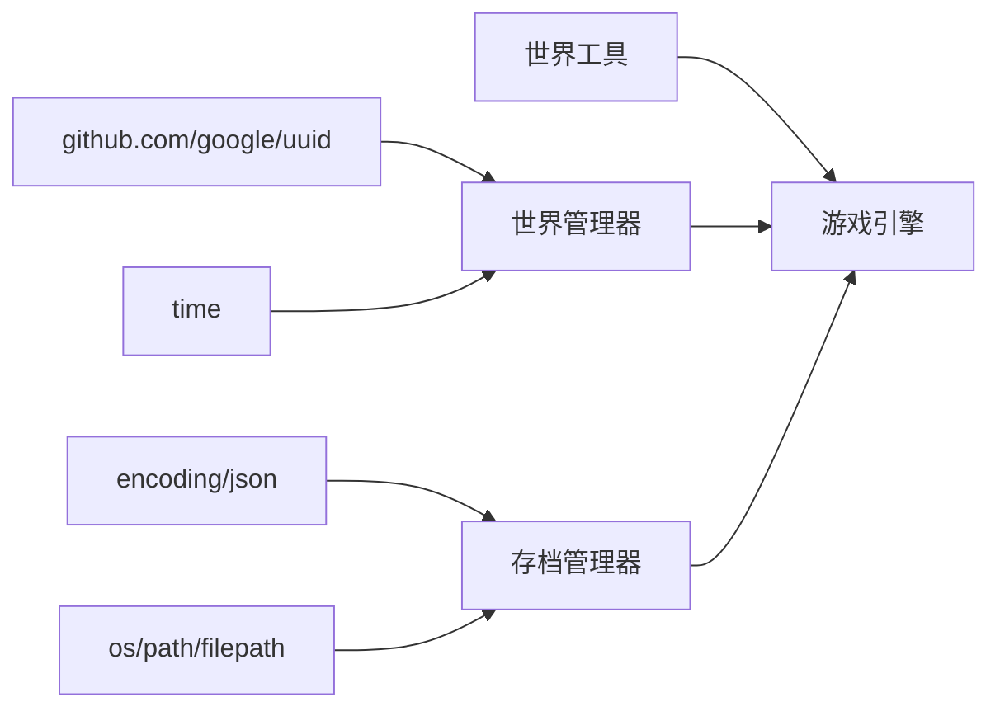

# 场景管理系统

<cite>
**本文引用的文件**
- [internal/world/scene.go](file://internal/world/scene.go)
- [internal/world/manager.go](file://internal/world/manager.go)
- [internal/world/npc.go](file://internal/world/npc.go)
- [internal/save/types.go](file://internal/save/types.go)
- [internal/save/manager.go](file://internal/save/manager.go)
- [internal/game/engine.go](file://internal/game/engine.go)
- [internal/tools/world_tools.go](file://internal/tools/world_tools.go)
</cite>

## 目录
1. [简介](#简介)
2. [项目结构](#项目结构)
3. [核心组件](#核心组件)
4. [架构概览](#架构概览)
5. [详细组件分析](#详细组件分析)
6. [依赖关系分析](#依赖关系分析)
7. [性能考量](#性能考量)
8. [故障排除指南](#故障排除指南)
9. [结论](#结论)
10. [附录](#附录)

## 简介
本技术文档面向CDND的场景管理系统，系统性阐述场景的数据结构设计、创建/修改/删除/查询操作机制、场景链接系统（双向与单向）、场景状态管理（含元数据维护）、序列化与反序列化流程，并结合NPC系统与存档系统给出交互关系说明。同时提供最佳实践、复杂场景结构示例以及性能优化建议。

## 项目结构
场景管理位于internal/world包内，围绕Scene、Exit、Feature、NPC等核心实体构建；世界管理器负责场景与NPC的增删改查、链接、导入导出；存档系统负责场景与NPC数据的持久化；游戏引擎协调工具调用与状态流转，驱动场景切换与NPC生成等行为。

图表来源
- [internal/world/manager.go:10-294](file://internal/world/manager.go#L10-L294)
- [internal/world/scene.go:19-44](file://internal/world/scene.go#L19-L44)
- [internal/world/npc.go:70-114](file://internal/world/npc.go#L70-L114)
- [internal/save/manager.go:20-364](file://internal/save/manager.go#L20-L364)
- [internal/save/types.go:110-147](file://internal/save/types.go#L110-L147)
- [internal/game/engine.go:22-56](file://internal/game/engine.go#L22-L56)
- [internal/tools/world_tools.go:8-80](file://internal/tools/world_tools.go#L8-L80)

章节来源
- [internal/world/manager.go:10-294](file://internal/world/manager.go#L10-L294)
- [internal/world/scene.go:19-44](file://internal/world/scene.go#L19-L44)
- [internal/world/npc.go:70-114](file://internal/world/npc.go#L70-L114)
- [internal/save/manager.go:20-364](file://internal/save/manager.go#L20-L364)
- [internal/save/types.go:110-147](file://internal/save/types.go#L110-L147)
- [internal/game/engine.go:22-56](file://internal/game/engine.go#L22-L56)
- [internal/tools/world_tools.go:8-80](file://internal/tools/world_tools.go#L8-L80)

## 核心组件
- 场景模型（Scene）：包含ID、名称、类型、描述、出口列表、NPC列表、物品列表、特性列表、环境信息（光照、地形、危险度）、标签、自定义属性、创建/更新时间等。
- 出口模型（Exit）：包含ID、名称、描述、目标场景ID、锁定状态、钥匙ID、开锁DC、可见性、单向性等。
- 特性模型（Feature）：包含ID、名称、描述、是否可互动、是否已使用等。
- 场景管理器（Manager）：提供场景与NPC的增删改查、场景链接（双向/单向）、导入导出、连接查询、清空等能力。
- NPC模型（NPC）：包含ID、名称、类型、态度、描述、外观、个性、对话树、战斗属性、商人/任务/AI相关字段及元数据。
- 存档系统：SaveData封装场景与NPC数据，存档管理器负责序列化/反序列化、文件IO、槽位管理。
- 游戏引擎：协调工具调用（移动场景、生成NPC、移除NPC等），驱动场景切换与状态变更。

章节来源
- [internal/world/scene.go:19-121](file://internal/world/scene.go#L19-L121)
- [internal/world/manager.go:10-294](file://internal/world/manager.go#L10-L294)
- [internal/world/npc.go:70-137](file://internal/world/npc.go#L70-L137)
- [internal/save/types.go:110-147](file://internal/save/types.go#L110-L147)
- [internal/save/manager.go:20-364](file://internal/save/manager.go#L20-L364)
- [internal/game/engine.go:22-56](file://internal/game/engine.go#L22-L56)

## 架构概览
场景系统采用“模型-管理器-引擎-存档”的分层架构：
- 模型层：Scene/NPC/Exit/Feature等数据结构，承载场景与NPC的全部信息。
- 管理器层：Manager统一管理场景与NPC的生命周期、链接关系、导入导出。
- 引擎层：Engine通过工具注册与执行，驱动场景切换、NPC生成/移除、状态变更。
- 存档层：SaveData与Manager负责场景/NPC数据的持久化与版本控制。

图表来源
- [internal/world/scene.go:19-121](file://internal/world/scene.go#L19-L121)
- [internal/world/manager.go:10-294](file://internal/world/manager.go#L10-L294)
- [internal/world/npc.go:70-137](file://internal/world/npc.go#L70-L137)

## 详细组件分析

### 数据结构设计
- 场景ID生成：若未显式提供ID，管理器在添加时自动生成UUID。
- 描述信息：名称、类型、描述均为字符串，便于本地化与展示。
- NPC列表与物品列表：以ID列表形式存储，与NPC/物品实体解耦，降低耦合度。
- 出口系统：支持可见性、锁定、钥匙ID、开锁DC、单向性等属性，满足复杂门禁与单向传送需求。
- 特性系统：可互动特性与使用状态，便于动态场景事件触发。
- 环境信息：光照等级、地形类型、危险度，用于影响玩法与叙事。
- 元数据：标签、自定义属性、创建/更新时间，便于检索与扩展。

章节来源
- [internal/world/scene.go:19-121](file://internal/world/scene.go#L19-L121)
- [internal/world/manager.go:25-35](file://internal/world/manager.go#L25-L35)

### 场景创建、修改、删除与查询
- 创建：AddScene自动补全ID与时间戳，确保唯一性与可追踪性。
- 修改：通过场景方法（如AddNPC/RemoveNPC/AddItem/RemoveItem/SetProperty/HasTag）与管理器方法（如LinkScenes/LinkScenesOneWay/MoveNPC）进行增量更新，每次修改均更新UpdatedAt。
- 删除：RemoveScene直接从映射中移除；NPC移除通过DespawnNPC/MoveNPC实现。
- 查询：GetScene按ID获取；ListScenes遍历；GetSceneNPCs按场景ID获取NPC集合；GetConnectedScenes根据出口目标解析连接场景。

章节来源
- [internal/world/manager.go:25-97](file://internal/world/manager.go#L25-L97)
- [internal/world/scene.go:153-219](file://internal/world/scene.go#L153-L219)

### 场景链接系统（双向与单向）
- 双向链接：LinkScenes在两个场景分别创建互相对应的出口，OneWay均为false，适合门厅与房间之间的互通。
- 单向链接：LinkScenesOneWay仅在起点场景创建出口，OneWay为true，适合陷阱门、传送阵等单向通道。
- 连接查询：GetConnectedScenes遍历出口列表，依据目标场景ID解析实际连接场景集合。

图表来源
- [internal/world/manager.go:180-212](file://internal/world/manager.go#L180-L212)

章节来源
- [internal/world/manager.go:180-254](file://internal/world/manager.go#L180-L254)

### 场景状态管理（元数据）
- 创建时间与更新时间：AddScene与各修改操作均设置CreatedAt/UpdatedAt，保证审计与版本追踪。
- 标签与自定义属性：HasTag与SetProperty/GetProperty提供灵活的场景标记与扩展字段。
- 场景环境：光照等级、地形类型、危险度，用于影响叙事与玩法。

章节来源
- [internal/world/manager.go:25-35](file://internal/world/manager.go#L25-L35)
- [internal/world/scene.go:193-219](file://internal/world/scene.go#L193-L219)

### 序列化与反序列化
- 场景与NPC数据：通过SaveData.Scenes与SaveData.NPCs数组保存，随存档一起持久化。
- 存档管理器：使用JSON序列化/反序列化，提供Save/Load/Delete/ListSlots/QuickSave/QuickLoad等接口。
- 导入导出：Manager.Import/Export用于批量导入/导出世界数据，配合存档系统实现跨会话迁移。

图表来源
- [internal/game/engine.go:152-178](file://internal/game/engine.go#L152-L178)
- [internal/world/manager.go:277-293](file://internal/world/manager.go#L277-L293)
- [internal/save/manager.go:57-86](file://internal/save/manager.go#L57-L86)

章节来源
- [internal/save/types.go:110-147](file://internal/save/types.go#L110-L147)
- [internal/save/manager.go:57-122](file://internal/save/manager.go#L57-L122)
- [internal/world/manager.go:264-293](file://internal/world/manager.go#L264-L293)

### 与NPC系统、存档系统的交互
- NPC集成：场景持有NPC ID列表，管理器提供SpawnNPC/DespawnNPC/MoveNPC，实现NPC在场景间的动态迁移。
- 存档集成：SaveData包含Scenes与NPCs，引擎在SaveGame时导出世界数据，在LoadGame时导入并重建世界状态。
- 工具驱动：MoveToSceneTool/SpawnNPCTool/RemoveNPCTool通过引擎工具系统触发场景切换与NPC管理，生成D&D风格叙述反馈。

图表来源
- [internal/game/engine.go:195-316](file://internal/game/engine.go#L195-L316)
- [internal/tools/world_tools.go:44-80](file://internal/tools/world_tools.go#L44-L80)
- [internal/world/manager.go:99-178](file://internal/world/manager.go#L99-L178)

章节来源
- [internal/world/npc.go:70-137](file://internal/world/npc.go#L70-L137)
- [internal/game/engine.go:195-316](file://internal/game/engine.go#L195-L316)
- [internal/tools/world_tools.go:82-219](file://internal/tools/world_tools.go#L82-L219)

## 依赖关系分析
- 模块内聚：Scene/Exit/Feature/NPC为纯数据结构，职责清晰；Manager集中处理业务逻辑。
- 模块耦合：Manager依赖UUID与时间库；引擎依赖工具注册表与存档管理器；存档管理器依赖标准库JSON与文件系统。
- 外部依赖：UUID用于ID生成；JSON用于序列化；time用于时间戳维护。

图表来源
- [internal/world/manager.go:3-8](file://internal/world/manager.go#L3-L8)
- [internal/save/manager.go:3-11](file://internal/save/manager.go#L3-L11)
- [internal/game/engine.go:10-20](file://internal/game/engine.go#L10-L20)

章节来源
- [internal/world/manager.go:3-8](file://internal/world/manager.go#L3-L8)
- [internal/save/manager.go:3-11](file://internal/save/manager.go#L3-L11)
- [internal/game/engine.go:10-20](file://internal/game/engine.go#L10-L20)

## 性能考量
- 并发安全：Manager内部使用读写锁保护场景与NPC映射，避免竞态；导出/导入操作采用批量加锁，减少锁持有时间。
- 时间复杂度：场景列表遍历O(N)，出口遍历O(E)，NPC列表遍历O(M)；查询与修改操作平均O(1)（基于ID映射）。
- 内存占用：场景与NPC均以指针存储于映射中，避免复制；特性与出口列表按需增长。
- I/O优化：存档管理器支持缓存，避免重复读取；QuickSave/QuickLoad策略减少磁盘访问。
- 建议：大规模场景地图建议分页加载、延迟初始化；频繁修改场景时合并更新批次，减少UpdatedAt写入频率。

## 故障排除指南
- 场景不存在：GetScene返回nil，管理器相关操作返回false；检查ID是否正确或是否已导入。
- NPC不存在：SpawnNPC/DespawnNPC/MoveNPC返回false；确认NPC ID存在且场景ID有效。
- 链接失败：LinkScenes/LinkScenesOneWay返回false；检查目标场景ID是否存在于管理器中。
- 存档读取失败：Load/ImportSave报错；检查文件格式与完整性，确认JSON解析无误。
- 并发问题：多线程操作导致竞态；确保使用Manager提供的线程安全方法。

章节来源
- [internal/world/manager.go:99-178](file://internal/world/manager.go#L99-L178)
- [internal/save/manager.go:88-122](file://internal/save/manager.go#L88-L122)

## 结论
场景管理系统以清晰的数据结构与严格的管理器模式实现了场景与NPC的全生命周期管理，结合双向/单向链接与灵活的元数据设计，满足复杂叙事与玩法需求。通过引擎与工具的协作，系统具备良好的可扩展性与可维护性；配合存档系统，实现了跨会话的数据持久化与版本控制。

## 附录

### 最佳实践
- 场景布局
  - 使用明确的场景类型（城镇/地下城/荒野/建筑/房间/战斗）区分叙事节奏与玩法。
  - 合理设置光照与地形，营造氛围并影响玩家决策。
- 出口设计
  - 双向出口用于通衢大道，单向出口用于剧情转折点或陷阱。
  - 为重要门设置锁定与钥匙ID，结合开锁DC提升挑战性。
- 用户体验
  - 为每个场景提供简洁描述与特性说明，增强沉浸感。
  - 使用标签与自定义属性快速筛选与过滤场景。
- 数据组织
  - NPC与物品以ID列表关联，避免重复存储；通过独立实体管理细节。
  - 定期备份存档，利用QuickSave/QuickLoad提升开发效率。

### 复杂场景结构示例
- 多层建筑：每层作为独立场景，通过楼梯/门形成单向/双向链接，房间作为更细粒度场景。
- 地下城迷宫：大量房间场景通过单向传送门串联，形成线性推进；关键房间设置双向出口作为回退点。
- 主城区域：多个功能区（商店、旅店、任务发布处）通过主街道双向连接，形成中心枢纽。

### 性能优化建议
- 使用批量导入/导出（Import/Export）减少频繁加锁。
- 合并场景更新操作，避免多次UpdatedAt写入。
- 对大型地图采用懒加载策略，仅在进入场景时初始化其NPC与物品。
- 缓存常用查询结果（如连接场景列表），降低重复计算成本。