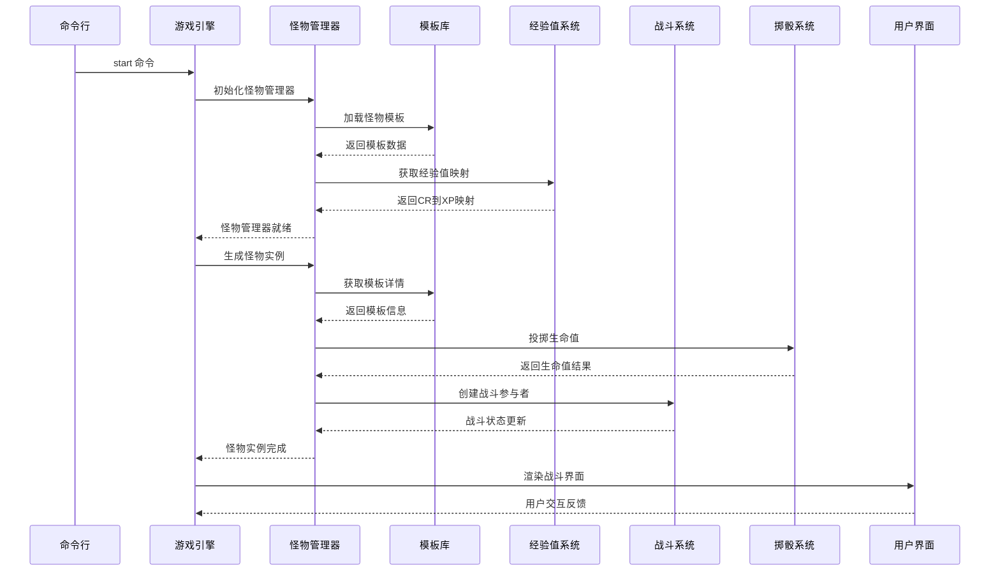
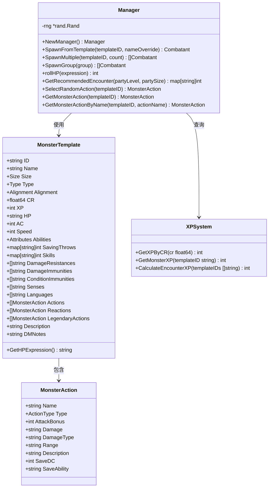
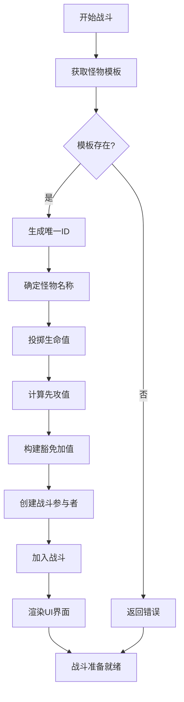
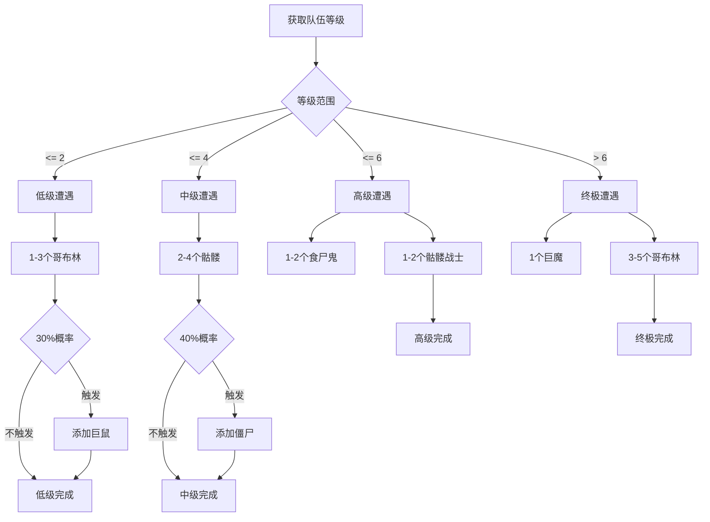
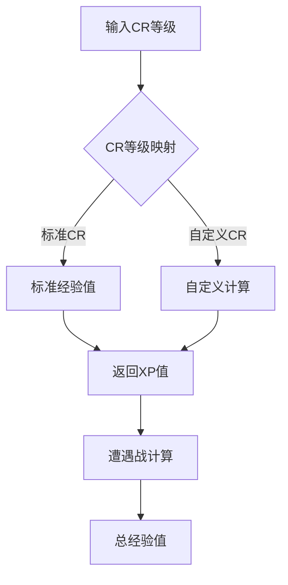
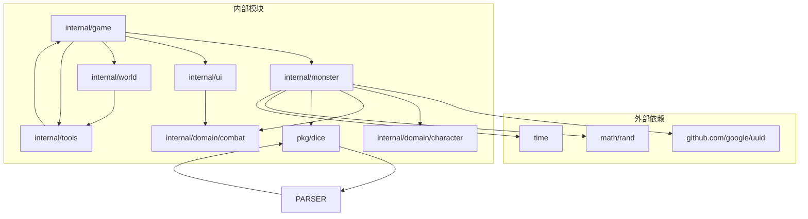

# 怪物管理

<cite>
**本文档引用的文件**
- [internal/monster/manager.go](file://internal/monster/manager.go)
- [internal/monster/types.go](file://internal/monster/types.go)
- [internal/monster/templates.go](file://internal/monster/templates.go)
- [internal/domain/combat/combat_state.go](file://internal/domain/combat/combat_state.go)
- [pkg/dice/dice.go](file://pkg/dice/dice.go)
- [pkg/dice/parser.go](file://pkg/dice/parser.go)
- [internal/game/engine.go](file://internal/game/engine.go)
- [internal/ui/combat_panel.go](file://internal/ui/combat_panel.go)
- [internal/world/manager.go](file://internal/world/manager.go)
- [internal/tools/world_tools.go](file://internal/tools/world_tools.go)
- [cmd/start.go](file://cmd/start.go)
- [config.example.yaml](file://config.example.yaml)
</cite>

## 更新摘要
**变更内容**
- 新增经验值计算系统和CR等级映射
- 实现智能遭遇战生成算法
- 增强动作系统，支持多种动作类型
- 添加随机动作选择功能用于AI决策
- 优化模板系统，提供更完整的怪物数据

## 目录
1. [简介](#简介)
2. [项目结构](#项目结构)
3. [核心组件](#核心组件)
4. [架构概览](#架构概览)
5. [详细组件分析](#详细组件分析)
6. [依赖关系分析](#依赖关系分析)
7. [性能考虑](#性能考虑)
8. [故障排除指南](#故障排除指南)
9. [结论](#结论)

## 简介

怪物管理系统是 cdnd 游戏引擎的核心组成部分，专为 D&D 5e 角色扮演游戏设计。该系统提供了完整的怪物生命周期管理，包括怪物模板定义、实例生成、战斗集成、经验值计算和智能AI决策等功能。

系统基于 Go 语言开发，采用模块化架构设计，支持多种怪物类型、复杂的战斗机制和丰富的游戏交互。通过集成 LLM（大语言模型）技术，为玩家提供智能化的游戏体验。

**更新** 新版本系统新增了高级功能，包括智能遭遇战生成、经验值计算、随机动作选择等，显著提升了系统的智能化水平和游戏体验。

## 项目结构

```mermaid
graph TB
subgraph "怪物管理模块"
MGR[怪物管理器<br/>internal/monster/manager.go]
TYPES[怪物类型定义<br/>internal/monster/types.go]
TEMPLATES[怪物模板库<br/>internal/monster/templates.go]
XP[经验值系统<br/>types.GetXPByCR]
END
subgraph "战斗系统"
COMBAT[战斗状态<br/>internal/domain/combat/combat_state.go]
DICE[掷骰系统<br/>pkg/dice/dice.go]
PARSER[表达式解析<br/>pkg/dice/parser.go]
END
subgraph "游戏引擎"
ENGINE[游戏引擎<br/>internal/game/engine.go]
UI[用户界面<br/>internal/ui/combat_panel.go]
END
subgraph "工具系统"
WTOOLS[世界工具<br/>internal/tools/world_tools.go]
WMANAGER[世界管理器<br/>internal/world/manager.go]
END
MGR --> TEMPLATES
MGR --> XP
MGR --> COMBAT
MGR --> DICE
MGR --> PARSER
ENGINE --> MGR
ENGINE --> UI
ENGINE --> WTOOLS
WTOOLS --> WMANAGER
```

**图表来源**
- [internal/monster/manager.go:1-233](file://internal/monster/manager.go#L1-L233)
- [internal/monster/types.go:1-172](file://internal/monster/types.go#L1-L172)
- [internal/monster/templates.go:1-702](file://internal/monster/templates.go#L1-L702)

**章节来源**
- [internal/monster/manager.go:1-233](file://internal/monster/manager.go#L1-L233)
- [internal/monster/types.go:1-172](file://internal/monster/types.go#L1-L172)
- [internal/monster/templates.go:1-702](file://internal/monster/templates.go#L1-L702)

## 核心组件

### 怪物管理器 (Manager)

怪物管理器是系统的核心控制器，负责怪物的生命周期管理：

- **模板管理**: 提供怪物模板的获取、查询和验证功能
- **实例生成**: 支持单个、批量和混合怪物群的生成
- **战斗集成**: 将生成的怪物集成到战斗系统中
- **AI决策**: 提供怪物动作选择和战斗策略
- **经验值计算**: 支持怪物经验和遭遇战难度评估

**更新** 新增了智能遭遇战生成和随机动作选择功能，增强了AI决策能力。

### 怪物类型系统

系统定义了完整的怪物类型体系：

- **体型分类**: 微型到超巨型的六种体型
- **生物类型**: 14种不同的怪物类别
- **阵营系统**: 10种阵营类型的道德和伦理分类
- **CR等级**: 从 0 到 10+ 的挑战等级系统
- **经验值映射**: 标准D&D 5e经验值表

**更新** 新增了CR到经验值的映射系统，支持自动计算怪物价值。

### 模板库系统

内置丰富的预定义怪物模板，涵盖从低级怪物到高级 Boss 的完整生态：

- **CR 1/4 级别**: 哥布林、骷髅、僵尸等基础怪物
- **CR 1/2 级别**: 熊地精、哥布林首领、恐狼等中级怪物  
- **CR 1-2 级别**: 兽人、食人魔、食尸鬼等高级怪物
- **CR 3-5 级别**: 巨魔、枭熊、幽灵等强力 Boss

**更新** 模板系统现在包含完整的动作定义，支持多种攻击类型和特殊能力。

### 动作系统

**新增** 系统支持完整的动作定义和执行：

- **动作类型**: 近战、远程、法术、特殊四种类型
- **攻击系统**: 攻击加值、伤害表达式、伤害类型
- **法术系统**: 法术DC、豁免属性、法术描述
- **特殊能力**: 状态效果、区域攻击、环境互动

**章节来源**
- [internal/monster/manager.go:14-81](file://internal/monster/manager.go#L14-L81)
- [internal/monster/types.go:5-51](file://internal/monster/types.go#L5-L51)
- [internal/monster/types.go:63-74](file://internal/monster/types.go#L63-L74)
- [internal/monster/templates.go:5-669](file://internal/monster/templates.go#L5-L669)

## 架构概览



**图表来源**
- [cmd/start.go:30-103](file://cmd/start.go#L30-L103)
- [internal/game/engine.go:44-65](file://internal/game/engine.go#L44-L65)
- [internal/monster/manager.go:26-81](file://internal/monster/manager.go#L26-L81)

系统采用分层架构设计，各组件职责明确，通过接口进行松耦合通信。游戏引擎作为协调中心，统一管理各个子系统的交互。

## 详细组件分析

### 怪物管理器类图



**图表来源**
- [internal/monster/manager.go:14-233](file://internal/monster/manager.go#L14-L233)
- [internal/monster/types.go:76-127](file://internal/monster/types.go#L76-L127)
- [internal/monster/types.go:63-74](file://internal/monster/types.go#L63-L74)
- [internal/monster/types.go:134-171](file://internal/monster/types.go#L134-L171)

### 战斗集成流程



**图表来源**
- [internal/monster/manager.go:26-81](file://internal/monster/manager.go#L26-L81)
- [internal/domain/combat/combat_state.go:25-39](file://internal/domain/combat/combat_state.go#L25-L39)

### 遭遇战推荐算法



**图表来源**
- [internal/monster/manager.go:151-185](file://internal/monster/manager.go#L151-L185)

### 经验值计算系统

**新增** 系统提供完整的经验值计算功能：

- **CR到XP映射**: 标准D&D 5e经验值表
- **怪物XP查询**: 根据模板ID获取经验值
- **遭遇战XP计算**: 自动计算怪物群总经验值
- **难度平衡**: 支持根据玩家等级调整怪物强度



**图表来源**
- [internal/monster/types.go:134-171](file://internal/monster/types.go#L134-L171)
- [internal/monster/manager.go:133-149](file://internal/monster/manager.go#L133-L149)

**章节来源**
- [internal/monster/manager.go:14-233](file://internal/monster/manager.go#L14-L233)
- [internal/monster/types.go:1-172](file://internal/monster/types.go#L1-L172)
- [internal/monster/templates.go:1-702](file://internal/monster/templates.go#L1-L702)

## 依赖关系分析



**图表来源**
- [internal/monster/manager.go:3-12](file://internal/monster/manager.go#L3-L12)
- [internal/game/engine.go:3-24](file://internal/game/engine.go#L3-L24)

系统依赖关系清晰，主要依赖外部标准库和第三方 UUID 生成库。内部模块间通过明确的接口进行通信，避免了循环依赖问题。

**章节来源**
- [internal/monster/manager.go:1-233](file://internal/monster/manager.go#L1-L233)
- [internal/game/engine.go:1-800](file://internal/game/engine.go#L1-L800)

## 性能考虑

### 内存优化策略

1. **模板缓存**: 怪物模板以只读方式存储，避免重复分配
2. **实例池**: 战斗参与者使用结构体池减少 GC 压力
3. **延迟初始化**: 惯用手动按需初始化，避免不必要的开销
4. **表达式解析缓存**: 掷骰表达式解析结果缓存，减少重复计算

### 并发安全

- 使用互斥锁保护共享数据结构
- 读写分离优化读操作性能
- 原子操作处理状态标志

### 随机数生成

- 使用加密安全的随机数源
- 避免重复种子导致的伪随机性
- 性能敏感场景使用独立的随机源

**更新** 新增了表达式解析缓存机制，提升了掷骰系统的性能表现。

## 故障排除指南

### 常见问题及解决方案

**怪物模板不存在**
- 检查模板 ID 是否正确
- 验证模板是否已正确加载
- 查看日志获取详细错误信息

**战斗状态异常**
- 确认战斗参与者数据完整性
- 检查先攻顺序计算
- 验证战斗轮次管理

**UI 渲染问题**
- 检查战斗状态数据
- 验证面板尺寸计算
- 确认字符编码兼容性

**经验值计算错误**
- 验证CR等级输入
- 检查模板XP字段
- 确认遭遇战计算逻辑

**动作选择异常**
- 检查怪物模板动作定义
- 验证动作类型有效性
- 确认随机选择算法

**章节来源**
- [internal/monster/manager.go:28-31](file://internal/monster/manager.go#L28-L31)
- [internal/ui/combat_panel.go:12-51](file://internal/ui/combat_panel.go#L12-L51)

## 结论

怪物管理系统展现了现代游戏引擎的设计理念，通过模块化架构实现了高度的可扩展性和维护性。系统不仅提供了完整的怪物生命周期管理功能，还深度集成了 AI 技术，为玩家创造了更加智能和沉浸式的游戏体验。

**更新** 新版本系统在原有基础上大幅增强了智能化水平，新增的经验值计算、智能遭遇战生成、随机动作选择等功能，显著提升了系统的实用性和游戏体验。

未来发展方向包括：
- 扩展怪物模板库，增加更多稀有和独特的生物
- 优化 AI 决策算法，提升怪物行为的智能化程度
- 增强网络功能，支持多人协作游戏
- 改进性能监控和调试工具
- 添加动态难度调整机制
- 扩展动作系统的复杂度和策略性

该系统为 D&D 5e 游戏提供了坚实的技术基础，为后续的功能扩展和性能优化奠定了良好的开端。