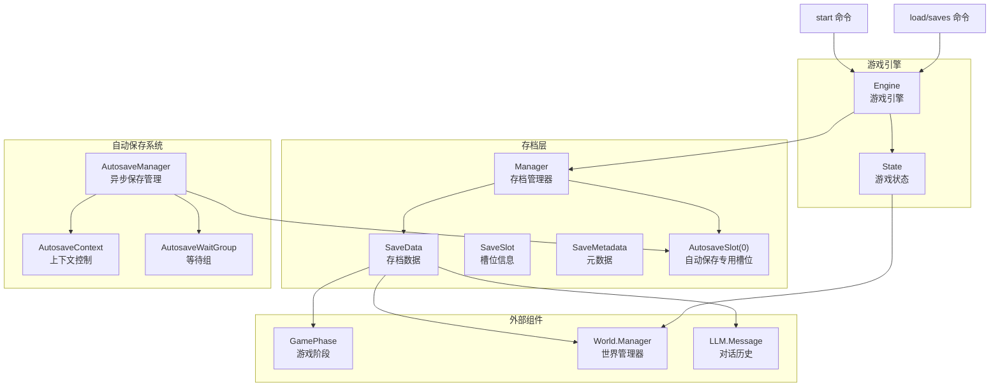
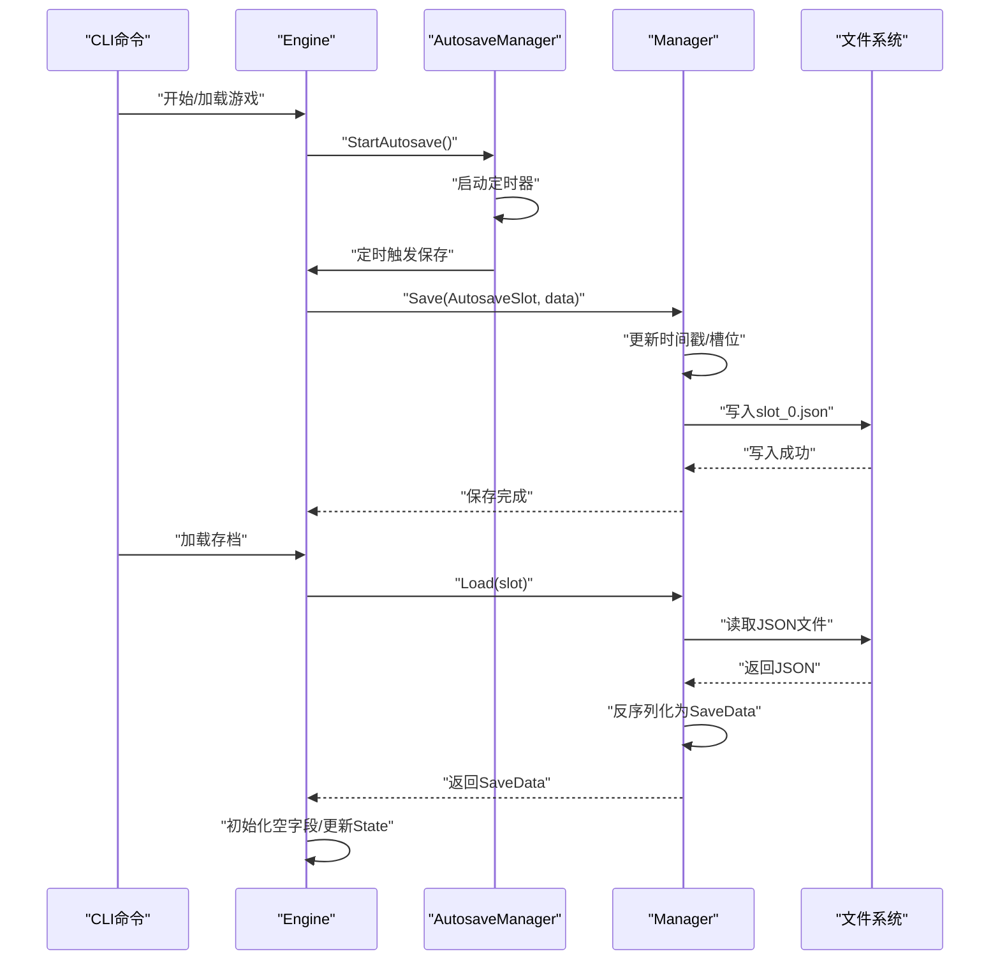
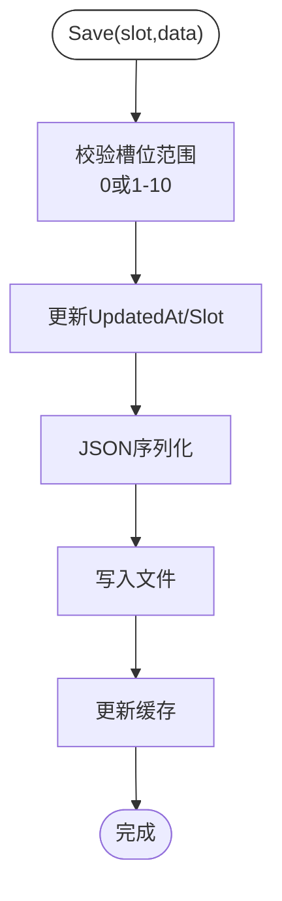
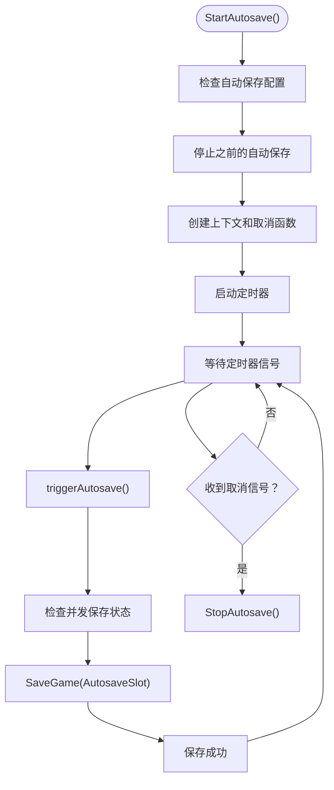
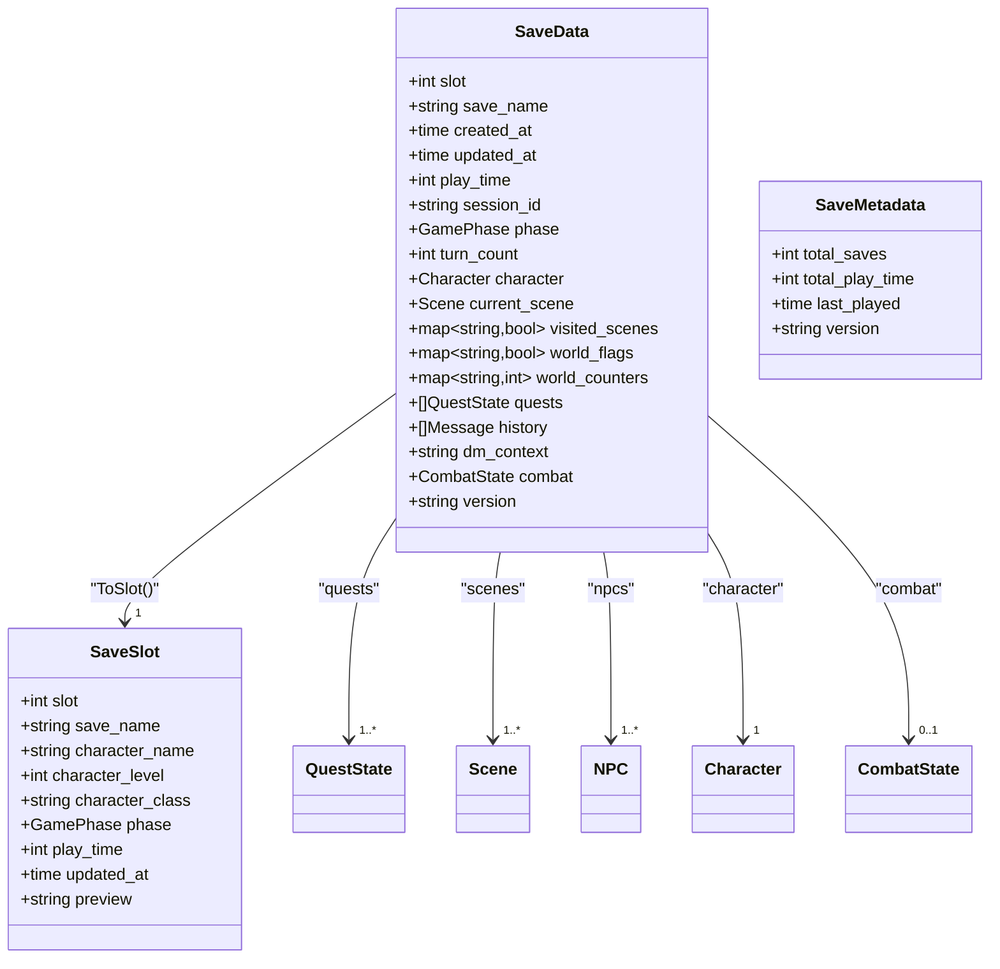
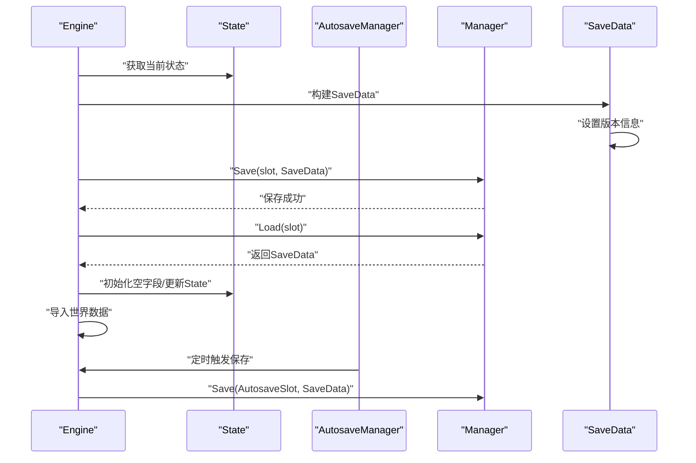
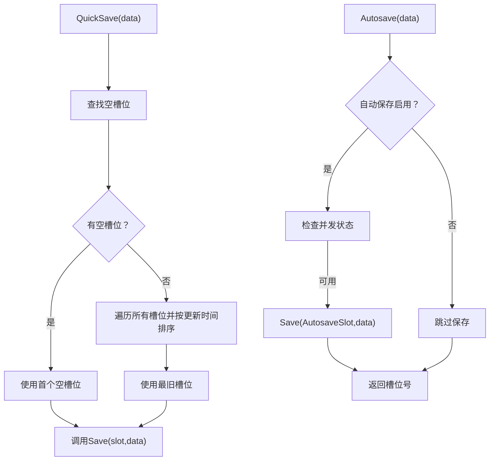
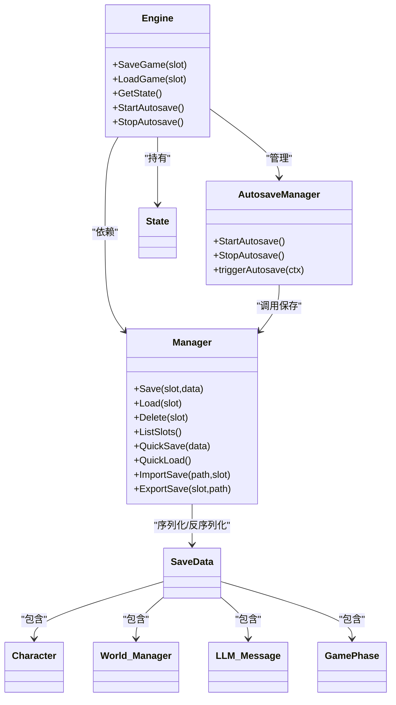
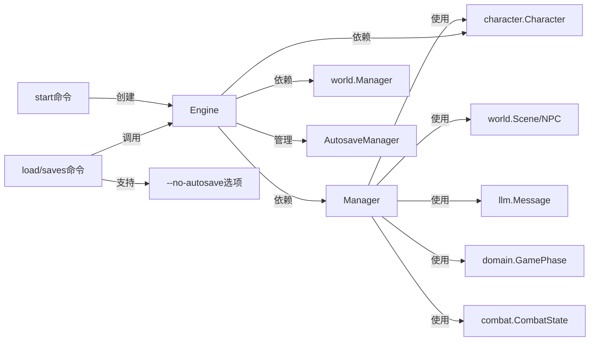

# 存档系统

<cite>
**本文引用的文件**
- [infrastructure/storage/manager.go](file://infrastructure/storage/manager.go)
- [infrastructure/storage/types.go](file://infrastructure/storage/types.go)
- [application/engine/engine.go](file://application/engine/engine.go)
- [application/state/state.go](file://application/state/state.go)
- [infrastructure/config/config.go](file://infrastructure/config/config.go)
- [infrastructure/config/defaults.go](file://infrastructure/config/defaults.go)
- [interface/cmd/start.go](file://interface/cmd/start.go)
- [interface/cmd/load.go](file://interface/cmd/load.go)
- [domain/game_phase.go](file://domain/game_phase.go)
</cite>

## 更新摘要
**所做更改**
- 更新存储管理器实现，反映基础设施层的重构
- 增强自动保存机制，包括回合制触发和周期性触发
- 完善版本跟踪和数据序列化机制
- 更新自动保存配置和命令行控制选项
- 增强错误恢复和并发安全处理

## 目录
1. [简介](#简介)
2. [项目结构](#项目结构)
3. [核心组件](#核心组件)
4. [架构总览](#架构总览)
5. [详细组件分析](#详细组件分析)
6. [依赖分析](#依赖分析)
7. [性能考虑](#性能考虑)
8. [故障排查指南](#故障排查指南)
9. [结论](#结论)
10. [附录](#附录)

## 简介
本技术文档面向CDND的存档系统，围绕"多槽位存档管理"和"自动保存系统"的设计理念与实现方式进行系统化说明。内容涵盖存档的创建、加载、删除与管理；存档数据结构与JSON序列化机制；快速保存与自动保存的触发条件与性能优化；存档导入导出与跨平台/跨版本迁移；错误恢复与数据修复；存档大小限制与存储优化；安全性与隐私保护；最佳实践与备份策略；以及与游戏引擎其他组件的集成方式。

## 项目结构
存档系统主要由以下模块构成：
- 存档管理器：负责槽位管理、文件IO、缓存、快速保存/加载、导入导出等。
- 自动保存系统：专用槽位(0)的异步保存机制，支持定时触发和回合级触发。
- 存档数据模型：定义SaveData、SaveSlot、SaveMetadata及游戏阶段、战斗状态、任务状态等。
- 游戏引擎：封装State与SaveData之间的映射，提供SaveGame/LoadGame接口，管理自动保存生命周期。
- 配置：包含自动保存开关、间隔、回合触发等参数。
- CLI命令：提供启动、加载、列出存档等入口，支持自动保存控制选项。
- 依赖组件：角色、世界、LLM消息等作为存档的一部分被序列化。

**图表来源**
- [infrastructure/storage/manager.go](file://infrastructure/storage/manager.go)
- [infrastructure/storage/types.go](file://infrastructure/storage/types.go)
- [application/engine/engine.go](file://application/engine/engine.go)
- [application/state/state.go](file://application/state/state.go)
- [domain/game_phase.go](file://domain/game_phase.go)
- [interface/cmd/start.go](file://interface/cmd/start.go)
- [interface/cmd/load.go](file://interface/cmd/load.go)

**章节来源**
- [infrastructure/storage/manager.go](file://infrastructure/storage/manager.go)
- [infrastructure/storage/types.go](file://infrastructure/storage/types.go)
- [application/engine/engine.go](file://application/engine/engine.go)
- [application/state/state.go](file://application/state/state.go)
- [interface/cmd/start.go](file://interface/cmd/start.go)
- [interface/cmd/load.go](file://interface/cmd/load.go)

## 核心组件
- 存档管理器（Manager）
  - 多槽位管理：固定10个手动槽位(1-10)，专用自动保存槽位(0)。
  - 缓存：内存缓存已加载的存档，减少重复IO。
  - 文件IO：基于标准库进行读写，权限控制与错误处理。
  - 快速保存/加载：自动选择空槽位或最旧槽位覆盖；快速加载选择最近更新的存档。
  - 导入/导出：支持从外部JSON文件导入，或导出当前槽位到文件。
- 自动保存系统（Autosave System）
  - 专用槽位：槽位0专门用于自动保存，避免与手动存档冲突。
  - 异步机制：使用goroutine和WaitGroup实现非阻塞保存。
  - 上下文控制：支持取消和超时控制，防止资源泄漏。
  - 并发安全：使用原子布尔值防止并发保存冲突。
  - 版本跟踪：SaveData包含版本信息，支持跨版本兼容性。
- 存档数据模型（SaveData/SaveSlot/SaveMetadata）
  - SaveData：包含元数据、游戏状态、角色、世界、场景/NPC、对话历史、战斗状态与版本信息。
  - SaveSlot：用于UI展示的简化信息，包含角色名、等级、职业、阶段、游玩时长、更新时间与预览。
  - SaveMetadata：统计总数、总游玩时长、最后游玩时间与版本。
- 游戏引擎（Engine/State）
  - Engine通过SaveGame/LoadGame与Manager交互，将State映射为SaveData并持久化。
  - LoadGame时对空字段进行初始化，保证兼容性。
  - 自动保存生命周期管理：StartAutosave/StopAutosave控制自动保存的启停。
- 配置（Config）
  - GameConfig包含自动保存开关与间隔等参数，驱动自动保存策略。

**章节来源**
- [infrastructure/storage/manager.go](file://infrastructure/storage/manager.go)
- [infrastructure/storage/types.go](file://infrastructure/storage/types.go)
- [application/engine/engine.go](file://application/engine/engine.go)
- [application/state/state.go](file://application/state/state.go)
- [infrastructure/config/config.go](file://infrastructure/config/config.go)

## 架构总览
存档系统采用分层设计：
- 表现层：CLI命令（start、load、saves）。
- 引擎层：Engine封装业务逻辑，协调Manager、State、World、Character、LLM等。
- 自动保存层：独立的异步保存机制，与手动保存完全隔离。
- 数据层：Manager负责文件系统与缓存；SaveData作为统一序列化载体。
- 依赖层：角色、世界、LLM消息等作为嵌套对象参与序列化。

**图表来源**
- [application/engine/engine.go](file://application/engine/engine.go)
- [infrastructure/storage/manager.go](file://infrastructure/storage/manager.go)

## 详细组件分析

### 存档管理器（Manager）
- 多槽位与路径
  - 槽位范围：0(自动保存专用)、1~10(手动保存)。
  - 默认保存目录：用户主目录下的.cdnd/saves。
  - 文件命名：slot_X.json，其中X为槽位号。
- 并发与缓存
  - 读写锁保护；缓存map[int]*SaveData。
- 主要方法
  - Save：校验槽位(0或1-10)、更新时间戳、序列化、写文件、更新缓存。
  - Load：优先缓存命中；否则读取文件并反序列化，再更新缓存。
  - Delete：删除文件并清理缓存。
  - ListSlots/Exists/GetMetadata：枚举槽位、存在性检查、聚合元数据。
  - QuickSave/QuickLoad：智能选择空槽位或最旧槽位覆盖；快速加载最近存档。
  - ImportSave/ExportSave：从外部文件导入或导出当前槽位。
- 错误处理
  - 输入槽位越界、文件不存在、读写失败、JSON解析失败均返回带上下文的错误。

**图表来源**
- [infrastructure/storage/manager.go](file://infrastructure/storage/manager.go)

**章节来源**
- [infrastructure/storage/manager.go](file://infrastructure/storage/manager.go)

### 自动保存系统（Autosave System）
- 专用槽位设计
  - 槽位0专门用于自动保存，与手动槽位1-10完全隔离。
  - 自动保存不会影响手动存档的正常工作。
- 异步保存机制
  - 使用goroutine实现非阻塞保存，避免阻塞主线程。
  - WaitGroup确保所有保存操作完成后才释放资源。
  - 原子布尔值防止并发保存冲突。
- 生命周期管理
  - StartAutosave：启动定时器，根据配置间隔定期触发保存。
  - StopAutosave：停止定时器，等待所有保存操作完成。
  - triggerAutosave：异步触发保存，包含错误恢复和上下文检查。
- 触发机制
  - 定时触发：基于时间间隔的周期性保存。
  - 回合触发：基于游戏回合数的触发保存。
  - 命令行控制：支持--no-autosave选项禁用自动保存。
- 版本跟踪
  - SaveData包含Version字段，当前版本为"1.0.0"。
  - GetMetadata返回统一的版本信息。

**图表来源**
- [application/engine/engine.go](file://application/engine/engine.go)

**章节来源**
- [application/engine/engine.go](file://application/engine/engine.go)

### 存档数据模型（SaveData/SaveSlot/SaveMetadata）
- SaveData
  - 元数据：slot、save_name、created_at、updated_at、play_time。
  - 游戏状态：session_id、phase、turn_count。
  - 角色：*character.Character。
  - 世界：current_scene、visited_scenes、world_flags、world_counters、quests。
  - 场景/NPC：scenes、npcs。
  - 对话历史：history、dm_context。
  - 战斗状态：combat（可选）。
  - 版本：version。
- SaveSlot
  - 用于列表展示：slot、save_name、character_name、character_level、character_class、phase、play_time、updated_at、preview。
- SaveMetadata
  - 统计：total_saves、total_play_time、last_played、version。

**图表来源**
- [infrastructure/storage/types.go](file://infrastructure/storage/types.go)

**章节来源**
- [infrastructure/storage/types.go](file://infrastructure/storage/types.go)

### 游戏引擎与存档交互（Engine/State）
- SaveGame
  - 将State映射为SaveData，导出世界场景与NPC，调用Manager.Save。
  - SaveData包含版本信息"1.0.0"。
- LoadGame
  - 通过Manager.Load获取SaveData，校验角色数据完整性；对空字段初始化；更新State；导入世界数据。
- State
  - 包含会话ID、阶段、回合数、角色、当前场景、访问过的场景、世界标志/计数器、任务、历史、战斗状态、时间戳等。
- 自动保存管理
  - StartAutosave/StopAutosave：控制自动保存的启停。
  - triggerAutosave：异步触发保存，包含错误恢复和上下文检查。
  - triggerAutosaveByTurn：回合级自动保存触发器。

**图表来源**
- [application/engine/engine.go](file://application/engine/engine.go)
- [application/state/state.go](file://application/state/state.go)
- [infrastructure/storage/manager.go](file://infrastructure/storage/manager.go)

**章节来源**
- [application/engine/engine.go](file://application/engine/engine.go)
- [application/state/state.go](file://application/state/state.go)

### 快速保存与自动保存
- 快速保存（QuickSave）
  - 优先使用第一个空槽位；若无空槽位，则覆盖最旧的存档（按updated_at排序）。
- 自动保存（Autosave）
  - 专用槽位：槽位0专门用于自动保存，避免与手动存档冲突。
  - 异步机制：使用goroutine和WaitGroup实现非阻塞保存。
  - 配置控制：GameConfig包含自动保存开关与间隔（毫秒）。
  - 并发安全：使用原子布尔值防止并发保存冲突。
  - 错误恢复：包含panic恢复和上下文检查。
  - 版本跟踪：自动保存包含版本信息。
- 触发时机建议
  - 关键节点：进入新场景、完成重要任务、战斗开始/结束、角色状态发生重大变化时。
  - 定时触发：根据配置的时间间隔自动保存。
  - 回合触发：基于游戏回合数的触发保存。

**图表来源**
- [infrastructure/storage/manager.go](file://infrastructure/storage/manager.go)
- [infrastructure/config/config.go](file://infrastructure/config/config.go)
- [application/engine/engine.go](file://application/engine/engine.go)

**章节来源**
- [infrastructure/storage/manager.go](file://infrastructure/storage/manager.go)
- [infrastructure/config/config.go](file://infrastructure/config/config.go)
- [application/engine/engine.go](file://application/engine/engine.go)

### 导入/导出与跨平台/跨版本迁移
- 导入（ImportSave）
  - 从外部JSON文件读取并解析为SaveData，再写入指定槽位。
- 导出（ExportSave）
  - 从指定槽位读取SaveData，序列化为JSON并写入目标文件。
- 跨平台
  - JSON为纯文本格式，天然跨平台；注意路径分隔符差异由Go标准库处理。
- 跨版本
  - 当前版本号固定为"1.0.0"；如需升级，可在SaveData中增加版本字段并在Load时做兼容处理（例如字段新增/重命名时的映射与默认值填充）。

**章节来源**
- [infrastructure/storage/manager.go](file://infrastructure/storage/manager.go)

### 错误恢复与数据修复
- 常见问题
  - 槽位越界、文件不存在、读写失败、JSON解析失败。
  - 角色数据缺失导致加载失败。
  - 自动保存失败或并发冲突。
- 修复建议
  - 使用saves命令查看槽位状态，定位空槽位或损坏文件。
  - 对于损坏的JSON，尝试从最近一次成功的QuickSave或Autosave恢复，或使用ExportSave导出备份。
  - 若角色数据缺失，可在新角色创建后重新开始，或手动修复SaveData中的角色字段。
  - 检查自动保存配置，确保AutosaveSlot(0)的权限正确。

**章节来源**
- [infrastructure/storage/manager.go](file://infrastructure/storage/manager.go)
- [application/engine/engine.go](file://application/engine/engine.go)
- [interface/cmd/load.go](file://interface/cmd/load.go)

### 存档大小限制与存储优化
- 存储占用
  - 每个槽位对应一个JSON文件；文件大小取决于角色、世界、历史、战斗状态等数据规模。
  - 自动保存槽位(0)会持续更新，可能成为最大的文件。
- 优化策略
  - 控制对话历史长度（GameConfig.MaxHistoryTurns），避免历史无限增长。
  - 合理使用世界标志/计数器而非冗余数据。
  - 定期清理不再需要的存档（Delete）。
  - 使用QuickSave覆盖策略，避免过多碎片化存档。
  - 自动保存频率适中，避免过于频繁的IO操作。

**章节来源**
- [infrastructure/config/config.go](file://infrastructure/config/config.go)
- [application/engine/engine.go](file://application/engine/engine.go)
- [infrastructure/storage/manager.go](file://infrastructure/storage/manager.go)

### 安全性与隐私保护
- 文件权限
  - 写入文件权限为0644，读取权限为0755，避免不必要的写权限。
  - 自动保存槽位(0)与其他手动槽位共享相同的权限设置。
- 数据敏感性
  - 存档包含角色、历史、世界状态等信息，建议仅在受信任设备上存放；必要时可加密外部导出文件。
  - 自动保存功能不会暴露额外的安全风险。
- 最佳实践
  - 定期备份；不在公共云盘长期存放；使用只读挂载或归档存储。

**章节来源**
- [infrastructure/storage/manager.go](file://infrastructure/storage/manager.go)

### 与游戏引擎其他组件的集成
- 角色（Character）
  - SaveData包含*character.Character，确保角色属性、技能、装备、状态等完整序列化。
- 世界（World.Manager）
  - SaveData包含scenes与npcs，Engine.LoadGame时通过World.Import恢复场景与NPC。
- LLM消息（LLM.Message）
  - SaveData包含history与dm_context，用于恢复对话上下文。
- 战斗状态（CombatState）
  - SaveData包含combat，支持战斗中断后的恢复。
- 自动保存集成
  - Engine.StartAutosave/StopAutosave管理自动保存生命周期。
  - 自动保存与手动保存完全隔离，互不影响。
- 游戏阶段（GamePhase）
  - SaveData包含phase字段，支持不同游戏阶段的状态保存。

**图表来源**
- [application/engine/engine.go](file://application/engine/engine.go)
- [infrastructure/storage/manager.go](file://infrastructure/storage/manager.go)
- [infrastructure/storage/types.go](file://infrastructure/storage/types.go)
- [domain/game_phase.go](file://domain/game_phase.go)

**章节来源**
- [application/engine/engine.go](file://application/engine/engine.go)
- [infrastructure/storage/types.go](file://infrastructure/storage/types.go)
- [domain/game_phase.go](file://domain/game_phase.go)

## 依赖分析
- Manager依赖
  - 标准库：os、path/filepath、encoding/json、sync、time。
  - 内部类型：character.Character、world.Scene、world.NPC、llm.Message、domain.GamePhase、combat.CombatState。
- Engine依赖
  - storage.Manager、character.Character、world.Manager、llm.*。
  - autosave相关：context、sync/atomic。
- CLI命令依赖
  - config.Config、llm.Provider、engine.Engine、ui.*。
  - 支持--no-autosave命令行选项。

**图表来源**
- [infrastructure/storage/manager.go](file://infrastructure/storage/manager.go)
- [application/engine/engine.go](file://application/engine/engine.go)
- [interface/cmd/start.go](file://interface/cmd/start.go)
- [interface/cmd/load.go](file://interface/cmd/load.go)

**章节来源**
- [infrastructure/storage/manager.go](file://infrastructure/storage/manager.go)
- [application/engine/engine.go](file://application/engine/engine.go)
- [interface/cmd/start.go](file://interface/cmd/start.go)
- [interface/cmd/load.go](file://interface/cmd/load.go)

## 性能考虑
- 缓存策略
  - Manager使用RWMutex与内存缓存，显著降低重复读取开销。
  - 自动保存槽位(0)也会被缓存，但会频繁更新。
- IO优化
  - 批量读取/写入时尽量合并操作；避免频繁切换槽位导致的多次IO。
  - 自动保存使用异步机制，避免阻塞主线程。
- 序列化成本
  - SaveData包含大量嵌套对象；建议在保存前裁剪历史与冗余数据。
  - 自动保存频率应适中，避免过度IO。
- 并发安全
  - 读多写少场景下，读锁提升并发吞吐；写锁保护一致性。
  - 自动保存使用原子布尔值防止并发冲突。

## 故障排查指南
- 常见错误与处理
  - "无效的存档槽位"：确认槽位在0或1~10范围内。
  - "存档槽位为空"：使用saves命令查看槽位状态，或使用QuickSave创建新存档。
  - "读取/写入失败"：检查目录权限与磁盘空间。
  - "解析存档数据失败"：确认JSON格式正确，必要时使用ExportSave导出备份后修复。
  - "角色数据缺失"：重新开始新游戏或修复SaveData中的角色字段。
  - "自动保存失败"：检查配置、权限和磁盘空间。
- 调试步骤
  - 使用saves命令列出所有槽位与预览信息。
  - 使用ExportSave导出可疑槽位到外部文件以便离线分析。
  - 检查Manager日志输出（标准错误）以定位具体失败点。
  - 验证自动保存配置和定时器状态。

**章节来源**
- [infrastructure/storage/manager.go](file://infrastructure/storage/manager.go)
- [interface/cmd/load.go](file://interface/cmd/load.go)

## 结论
CDND存档系统以多槽位、JSON序列化为核心，结合缓存与快速保存策略，在保证数据完整性的同时兼顾性能与易用性。新增的自动保存系统进一步增强了系统的可靠性，通过专用槽位(0)和异步保存机制，实现了无缝的后台数据保护。通过与角色、世界、LLM等组件的深度集成，实现了完整的D&D游戏状态持久化。当前版本包含版本跟踪和鲁棒的错误恢复机制，未来可在版本兼容、历史裁剪、自动保存策略等方面进一步增强，以满足更复杂的使用场景。

## 附录

### 最佳实践与备份策略
- 定期备份：使用ExportSave导出关键存档至安全位置。
- 分层管理：区分日常QuickSave与重要里程碑存档，避免频繁覆盖。
- 自动保存配置：合理设置自动保存间隔，平衡数据安全与性能。
- 历史控制：根据需要调整GameConfig.MaxHistoryTurns，平衡体验与体积。
- 跨设备迁移：导出为JSON后通过安全渠道传输，导入到目标设备的同槽位。
- 自动保存监控：定期检查自动保存状态，确保系统正常运行。
- 版本兼容：利用SaveData的Version字段进行跨版本兼容性检查。

**章节来源**
- [infrastructure/config/config.go](file://infrastructure/config/config.go)
- [infrastructure/storage/manager.go](file://infrastructure/storage/manager.go)
- [application/engine/engine.go](file://application/engine/engine.go)
- [infrastructure/storage/types.go](file://infrastructure/storage/types.go)