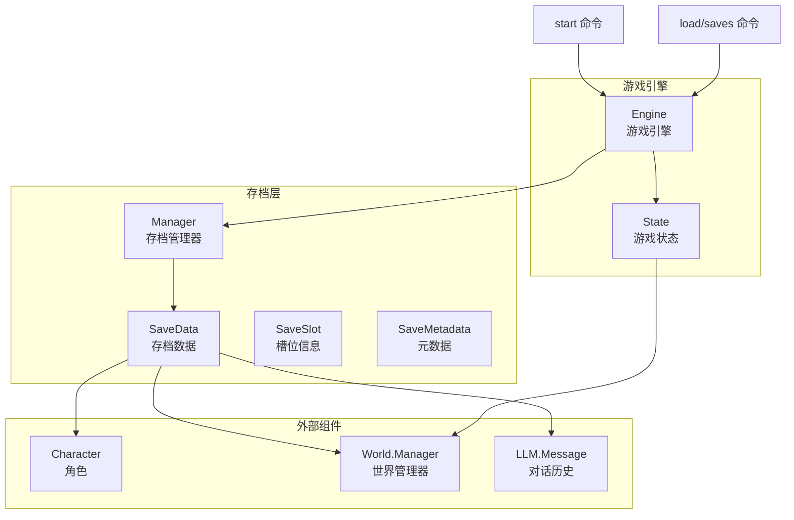
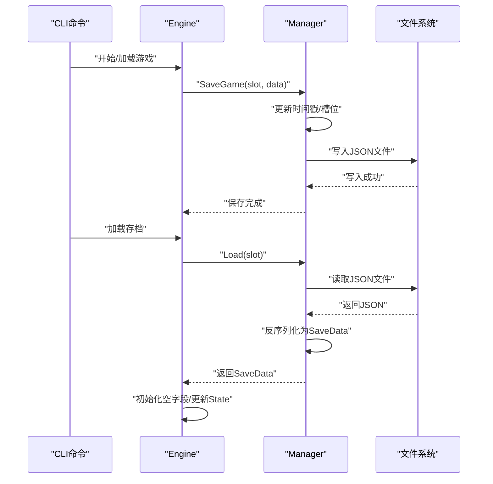
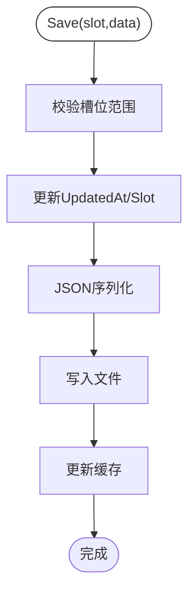
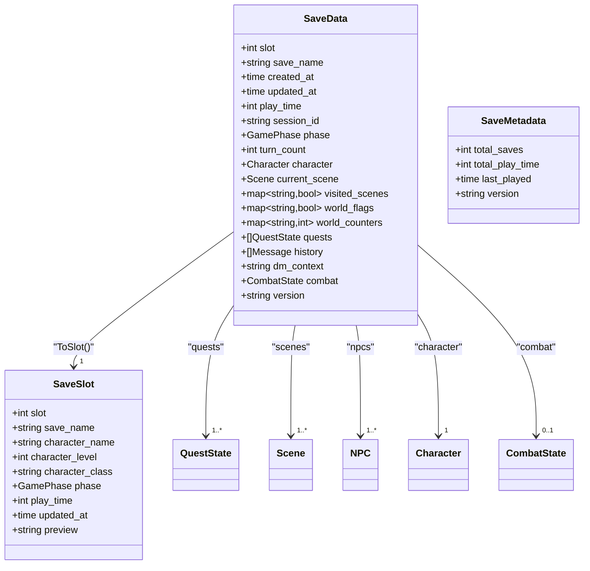
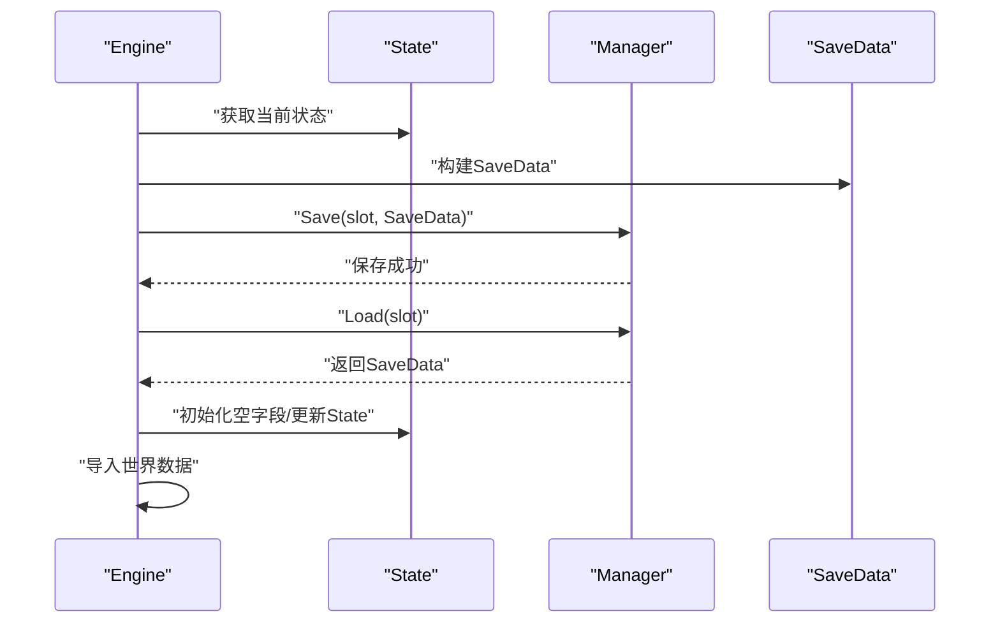
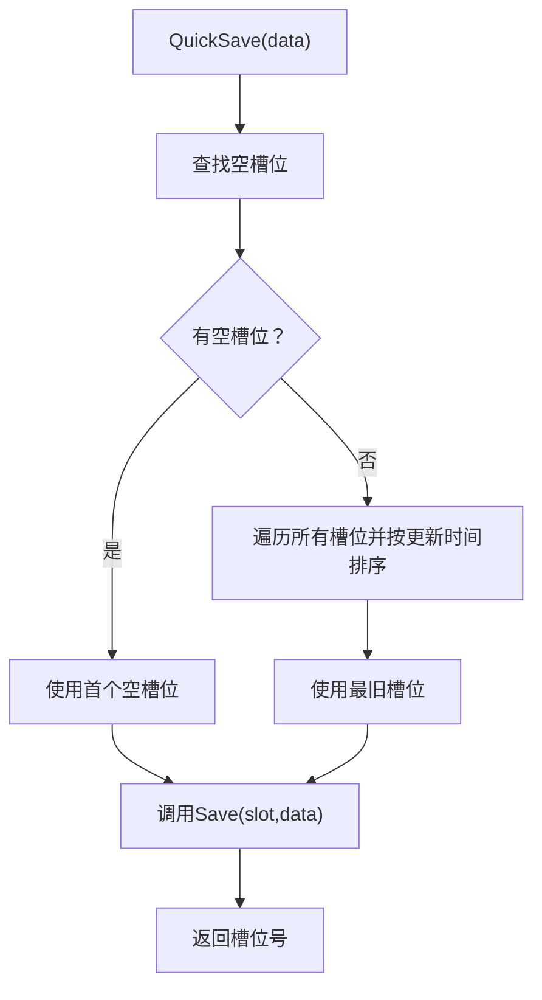
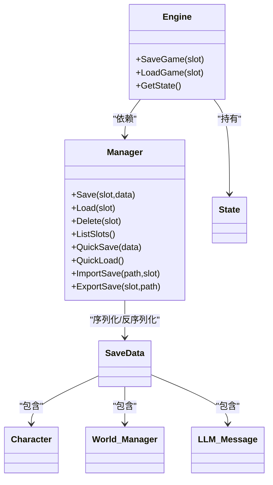
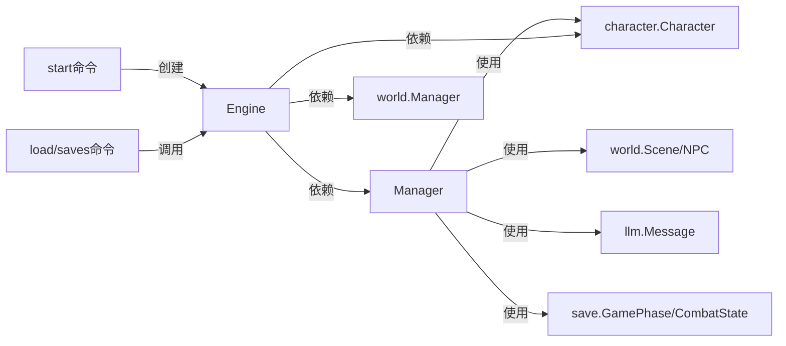

# 存档系统

<cite>
**本文引用的文件**
- [internal/save/manager.go](file://internal/save/manager.go)
- [internal/save/types.go](file://internal/save/types.go)
- [internal/game/engine.go](file://internal/game/engine.go)
- [internal/game/state.go](file://internal/game/state.go)
- [internal/config/config.go](file://internal/config/config.go)
- [cmd/start.go](file://cmd/start.go)
- [cmd/load.go](file://cmd/load.go)
- [internal/character/character.go](file://internal/character/character.go)
- [internal/world/manager.go](file://internal/world/manager.go)
- [internal/llm/provider.go](file://internal/llm/provider.go)
</cite>

## 目录
1. [简介](#简介)
2. [项目结构](#项目结构)
3. [核心组件](#核心组件)
4. [架构总览](#架构总览)
5. [详细组件分析](#详细组件分析)
6. [依赖分析](#依赖分析)
7. [性能考虑](#性能考虑)
8. [故障排查指南](#故障排查指南)
9. [结论](#结论)
10. [附录](#附录)

## 简介
本技术文档面向CDND的存档系统，围绕“多槽位存档管理”的设计理念与实现方式进行系统化说明。内容涵盖存档的创建、加载、删除与管理；存档数据结构与JSON序列化机制；快速保存与自动保存的触发条件与性能优化；存档导入导出与跨平台/跨版本迁移；错误恢复与数据修复；存档大小限制与存储优化；安全性与隐私保护；最佳实践与备份策略；以及与游戏引擎其他组件的集成方式。

## 项目结构
存档系统主要由以下模块构成：
- 存档管理器：负责槽位管理、文件IO、缓存、快速保存/加载、导入导出等。
- 存档数据模型：定义SaveData、SaveSlot、SaveMetadata及游戏阶段、战斗状态、任务状态等。
- 游戏引擎：封装State与SaveData之间的映射，提供SaveGame/LoadGame接口。
- 配置：包含自动保存开关与间隔等参数。
- CLI命令：提供启动、加载、列出存档等入口。
- 依赖组件：角色、世界、LLM消息等作为存档的一部分被序列化。

**图表来源**
- [internal/save/manager.go](file://internal/save/manager.go)
- [internal/save/types.go](file://internal/save/types.go)
- [internal/game/engine.go](file://internal/game/engine.go)
- [internal/game/state.go](file://internal/game/state.go)
- [internal/character/character.go](file://internal/character/character.go)
- [internal/world/manager.go](file://internal/world/manager.go)
- [internal/llm/provider.go](file://internal/llm/provider.go)
- [cmd/start.go](file://cmd/start.go)
- [cmd/load.go](file://cmd/load.go)

**章节来源**
- [internal/save/manager.go](file://internal/save/manager.go)
- [internal/save/types.go](file://internal/save/types.go)
- [internal/game/engine.go](file://internal/game/engine.go)
- [internal/game/state.go](file://internal/game/state.go)
- [cmd/start.go](file://cmd/start.go)
- [cmd/load.go](file://cmd/load.go)

## 核心组件
- 存档管理器（Manager）
  - 多槽位管理：固定10个槽位，文件命名slot_X.json，按槽位号组织。
  - 缓存：内存缓存已加载的存档，减少重复IO。
  - 文件IO：基于标准库进行读写，权限控制与错误处理。
  - 快速保存/加载：自动选择空槽位或最旧槽位覆盖；快速加载选择最近更新的存档。
  - 导入/导出：支持从外部JSON文件导入，或导出当前槽位到文件。
- 存档数据模型（SaveData/SaveSlot/SaveMetadata）
  - SaveData：包含元数据、游戏状态、角色、世界、场景/NPC、对话历史、战斗状态与版本信息。
  - SaveSlot：用于UI展示的简化信息，包含角色名、等级、职业、阶段、游玩时长、更新时间与预览。
  - SaveMetadata：统计总数、总游玩时长、最后游玩时间与版本。
- 游戏引擎（Engine/State）
  - Engine通过SaveGame/LoadGame与Manager交互，将State映射为SaveData并持久化。
  - LoadGame时对空字段进行初始化，保证兼容性。
- 配置（Config）
  - GameConfig包含自动保存开关与间隔等参数，可用于驱动自动保存策略（当前实现以手动SaveGame为主）。

**章节来源**
- [internal/save/manager.go](file://internal/save/manager.go)
- [internal/save/types.go](file://internal/save/types.go)
- [internal/game/engine.go](file://internal/game/engine.go)
- [internal/game/state.go](file://internal/game/state.go)
- [internal/config/config.go](file://internal/config/config.go)

## 架构总览
存档系统采用分层设计：
- 表现层：CLI命令（start、load、saves）。
- 引擎层：Engine封装业务逻辑，协调Manager、State、World、Character、LLM等。
- 数据层：Manager负责文件系统与缓存；SaveData作为统一序列化载体。
- 依赖层：角色、世界、LLM消息等作为嵌套对象参与序列化。

**图表来源**
- [internal/game/engine.go](file://internal/game/engine.go)
- [internal/save/manager.go](file://internal/save/manager.go)

## 详细组件分析

### 存档管理器（Manager）
- 多槽位与路径
  - 槽位范围：1~10。
  - 默认保存目录：用户主目录下的.cdnd/saves。
  - 文件命名：slot_X.json。
- 并发与缓存
  - 读写锁保护；缓存map[int]*SaveData。
- 主要方法
  - Save：校验槽位、更新时间戳、序列化、写文件、更新缓存。
  - Load：优先缓存命中；否则读取文件并反序列化，再更新缓存。
  - Delete：删除文件并清理缓存。
  - ListSlots/Exists/GetMetadata：枚举槽位、存在性检查、聚合元数据。
  - QuickSave/QuickLoad：智能选择空槽位或最旧槽位覆盖；快速加载最近存档。
  - ImportSave/ExportSave：从外部文件导入或导出当前槽位。
- 错误处理
  - 输入槽位越界、文件不存在、读写失败、JSON解析失败均返回带上下文的错误。

**图表来源**
- [internal/save/manager.go](file://internal/save/manager.go)

**章节来源**
- [internal/save/manager.go](file://internal/save/manager.go)

### 存档数据模型（SaveData/SaveSlot/SaveMetadata）
- SaveData
  - 元数据：slot、save_name、created_at、updated_at、play_time。
  - 游戏状态：session_id、phase、turn_count。
  - 角色：*character.Character。
  - 世界：current_scene、visited_scenes、world_flags、world_counters、quests。
  - 场景/NPC：scenes、npcs。
  - 对话历史：history、dm_context。
  - 战斗状态：combat（可选）。
  - 版本：version。
- SaveSlot
  - 用于列表展示：slot、save_name、character_name、character_level、character_class、phase、play_time、updated_at、preview。
- SaveMetadata
  - 统计：total_saves、total_play_time、last_played、version。

**图表来源**
- [internal/save/types.go](file://internal/save/types.go)
- [internal/character/character.go](file://internal/character/character.go)
- [internal/world/manager.go](file://internal/world/manager.go)
- [internal/llm/provider.go](file://internal/llm/provider.go)

**章节来源**
- [internal/save/types.go](file://internal/save/types.go)
- [internal/character/character.go](file://internal/character/character.go)
- [internal/world/manager.go](file://internal/world/manager.go)
- [internal/llm/provider.go](file://internal/llm/provider.go)

### 游戏引擎与存档交互（Engine/State）
- SaveGame
  - 将State映射为SaveData，导出世界场景与NPC，调用Manager.Save。
- LoadGame
  - 通过Manager.Load获取SaveData，校验角色数据完整性；对空字段初始化；更新State；导入世界数据。
- State
  - 包含会话ID、阶段、回合数、角色、当前场景、访问过的场景、世界标志/计数器、任务、历史、战斗状态、时间戳等。

**图表来源**
- [internal/game/engine.go](file://internal/game/engine.go)
- [internal/game/state.go](file://internal/game/state.go)
- [internal/save/manager.go](file://internal/save/manager.go)

**章节来源**
- [internal/game/engine.go](file://internal/game/engine.go)
- [internal/game/state.go](file://internal/game/state.go)

### 快速保存与自动保存
- 快速保存（QuickSave）
  - 优先使用第一个空槽位；若无空槽位，则覆盖最旧的存档（按updated_at排序）。
- 自动保存
  - 配置项：GameConfig包含自动保存开关与间隔（回合数）。
  - 当前实现：Engine未直接在引擎内部周期性触发自动保存，可通过在业务流程中调用SaveGame实现自动保存策略（例如每N回合保存一次）。
- 触发时机建议
  - 关键节点：进入新场景、完成重要任务、战斗开始/结束、角色状态发生重大变化时。

**图表来源**
- [internal/save/manager.go](file://internal/save/manager.go)
- [internal/config/config.go](file://internal/config/config.go)

**章节来源**
- [internal/save/manager.go](file://internal/save/manager.go)
- [internal/config/config.go](file://internal/config/config.go)

### 导入/导出与跨平台/跨版本迁移
- 导入（ImportSave）
  - 从外部JSON文件读取并解析为SaveData，再写入指定槽位。
- 导出（ExportSave）
  - 从指定槽位读取SaveData，序列化为JSON并写入目标文件。
- 跨平台
  - JSON为纯文本格式，天然跨平台；注意路径分隔符差异由Go标准库处理。
- 跨版本
  - 当前版本号固定为1.0.0；如需升级，可在SaveData中增加版本字段并在Load时做兼容处理（例如字段新增/重命名时的映射与默认值填充）。

**章节来源**
- [internal/save/manager.go](file://internal/save/manager.go)

### 错误恢复与数据修复
- 常见问题
  - 槽位越界、文件不存在、读写失败、JSON解析失败。
  - 角色数据缺失导致加载失败。
- 修复建议
  - 使用saves命令查看槽位状态，定位空槽位或损坏文件。
  - 对于损坏的JSON，尝试从最近一次成功的QuickSave恢复，或使用ExportSave导出备份。
  - 若角色数据缺失，可在新角色创建后重新开始，或手动修复SaveData中的角色字段。

**章节来源**
- [internal/save/manager.go](file://internal/save/manager.go)
- [internal/game/engine.go](file://internal/game/engine.go)
- [cmd/load.go](file://cmd/load.go)

### 存档大小限制与存储优化
- 存储占用
  - 每个槽位对应一个JSON文件；文件大小取决于角色、世界、历史、战斗状态等数据规模。
- 优化策略
  - 控制对话历史长度（GameConfig.MaxHistoryTurns），避免历史无限增长。
  - 合理使用世界标志/计数器而非冗余数据。
  - 定期清理不再需要的存档（Delete）。
  - 使用QuickSave覆盖策略，避免过多碎片化存档。

**章节来源**
- [internal/config/config.go](file://internal/config/config.go)
- [internal/game/engine.go](file://internal/game/engine.go)
- [internal/save/manager.go](file://internal/save/manager.go)

### 安全性与隐私保护
- 文件权限
  - 写入文件权限为0644，读取权限为0755，避免不必要的写权限。
- 数据敏感性
  - 存档包含角色、历史、世界状态等信息，建议仅在受信任设备上存放；必要时可加密外部导出文件。
- 最佳实践
  - 定期备份；不在公共云盘长期存放；使用只读挂载或归档存储。

**章节来源**
- [internal/save/manager.go](file://internal/save/manager.go)

### 与游戏引擎其他组件的集成
- 角色（Character）
  - SaveData包含*character.Character，确保角色属性、技能、装备、状态等完整序列化。
- 世界（World.Manager）
  - SaveData包含scenes与npcs，Engine.LoadGame时通过World.Manager.Import恢复场景与NPC。
- LLM消息（LLM.Message）
  - SaveData包含history与dm_context，用于恢复对话上下文。
- 战斗状态（CombatState）
  - SaveData包含combat，支持战斗中断后的恢复。

**图表来源**
- [internal/game/engine.go](file://internal/game/engine.go)
- [internal/save/manager.go](file://internal/save/manager.go)
- [internal/save/types.go](file://internal/save/types.go)
- [internal/character/character.go](file://internal/character/character.go)
- [internal/world/manager.go](file://internal/world/manager.go)
- [internal/llm/provider.go](file://internal/llm/provider.go)

**章节来源**
- [internal/game/engine.go](file://internal/game/engine.go)
- [internal/save/types.go](file://internal/save/types.go)
- [internal/character/character.go](file://internal/character/character.go)
- [internal/world/manager.go](file://internal/world/manager.go)
- [internal/llm/provider.go](file://internal/llm/provider.go)

## 依赖分析
- Manager依赖
  - 标准库：os、path/filepath、encoding/json、sync、time。
  - 内部类型：character.Character、world.Scene、world.NPC、llm.Message、save.GamePhase、save.CombatState。
- Engine依赖
  - save.Manager、character.Character、world.Manager、llm.*。
- CLI命令依赖
  - config.Config、llm.Provider、game.Engine、ui.*。

**图表来源**
- [internal/save/manager.go](file://internal/save/manager.go)
- [internal/game/engine.go](file://internal/game/engine.go)
- [cmd/start.go](file://cmd/start.go)
- [cmd/load.go](file://cmd/load.go)

**章节来源**
- [internal/save/manager.go](file://internal/save/manager.go)
- [internal/game/engine.go](file://internal/game/engine.go)
- [cmd/start.go](file://cmd/start.go)
- [cmd/load.go](file://cmd/load.go)

## 性能考虑
- 缓存策略
  - Manager使用RWMutex与内存缓存，显著降低重复读取开销。
- IO优化
  - 批量读取/写入时尽量合并操作；避免频繁切换槽位导致的多次IO。
- 序列化成本
  - SaveData包含大量嵌套对象；建议在保存前裁剪历史与冗余数据。
- 并发安全
  - 读多写少场景下，读锁提升并发吞吐；写锁保护一致性。

[本节为通用性能建议，无需特定文件引用]

## 故障排查指南
- 常见错误与处理
  - “无效的存档槽位”：确认槽位在1~10范围内。
  - “存档槽位为空”：使用saves命令查看槽位状态，或使用QuickSave创建新存档。
  - “读取/写入失败”：检查目录权限与磁盘空间。
  - “解析存档数据失败”：确认JSON格式正确，必要时使用ExportSave导出备份后修复。
  - “角色数据缺失”：重新开始新游戏或修复SaveData中的角色字段。
- 调试步骤
  - 使用saves命令列出所有槽位与预览信息。
  - 使用ExportSave导出可疑槽位到外部文件以便离线分析。
  - 检查Manager日志输出（标准错误）以定位具体失败点。

**章节来源**
- [internal/save/manager.go](file://internal/save/manager.go)
- [cmd/load.go](file://cmd/load.go)

## 结论
CDND存档系统以多槽位、JSON序列化为核心，结合缓存与快速保存策略，在保证数据完整性的同时兼顾性能与易用性。通过与角色、世界、LLM等组件的深度集成，实现了完整的D&D游戏状态持久化。未来可在版本兼容、历史裁剪、自动保存策略等方面进一步增强，以满足更复杂的使用场景。

[本节为总结性内容，无需特定文件引用]

## 附录

### 最佳实践与备份策略
- 定期备份：使用ExportSave导出关键存档至安全位置。
- 分层管理：区分日常QuickSave与重要里程碑存档，避免频繁覆盖。
- 历史控制：根据需要调整GameConfig.MaxHistoryTurns，平衡体验与体积。
- 跨设备迁移：导出为JSON后通过安全渠道传输，导入到目标设备的同槽位。

**章节来源**
- [internal/config/config.go](file://internal/config/config.go)
- [internal/save/manager.go](file://internal/save/manager.go)