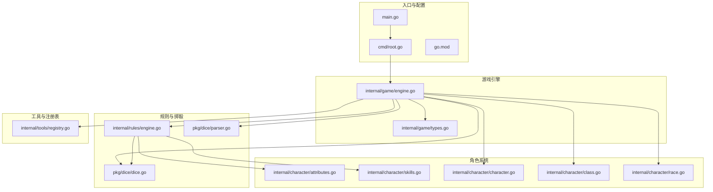
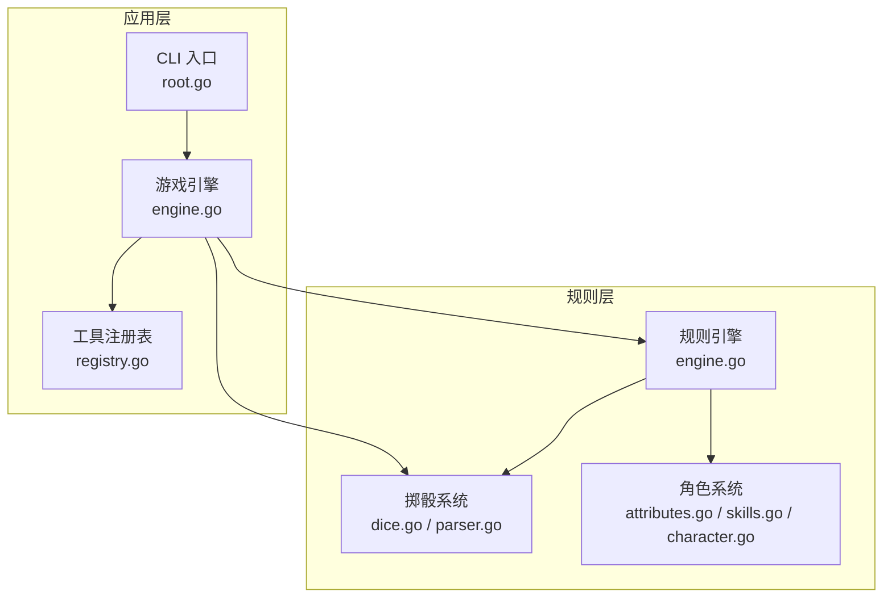
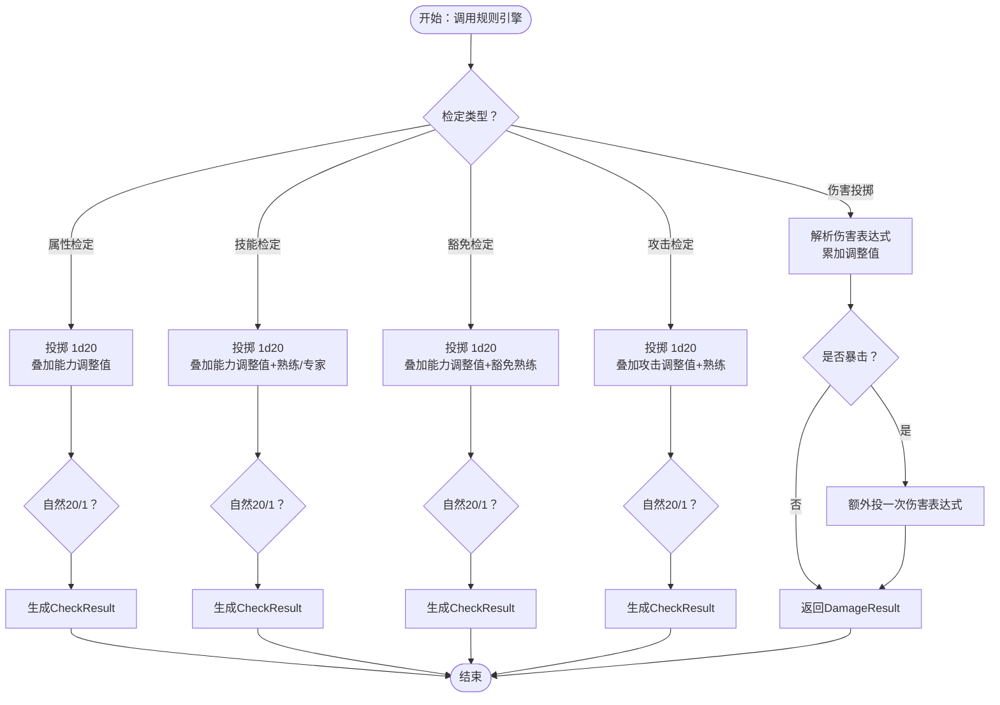
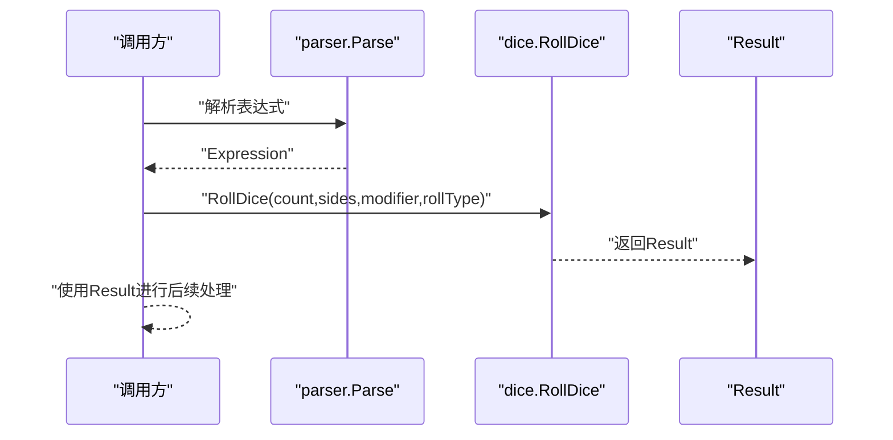
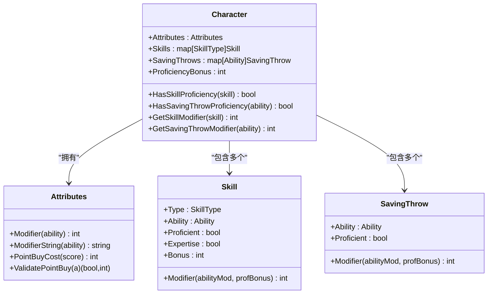
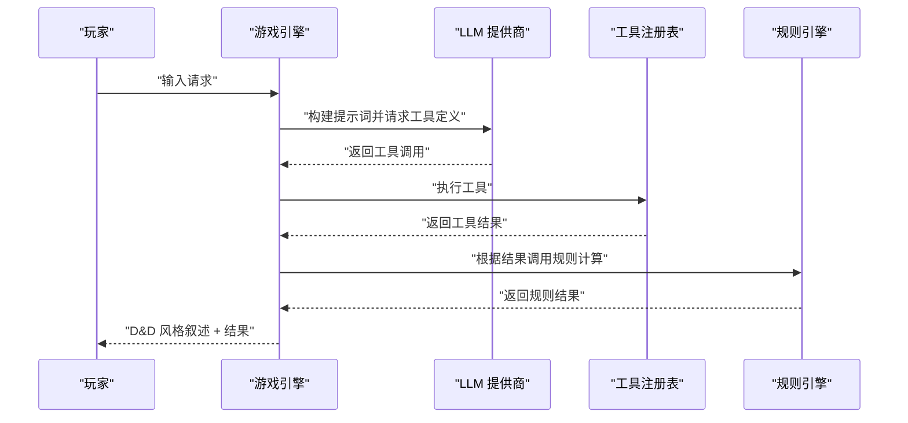
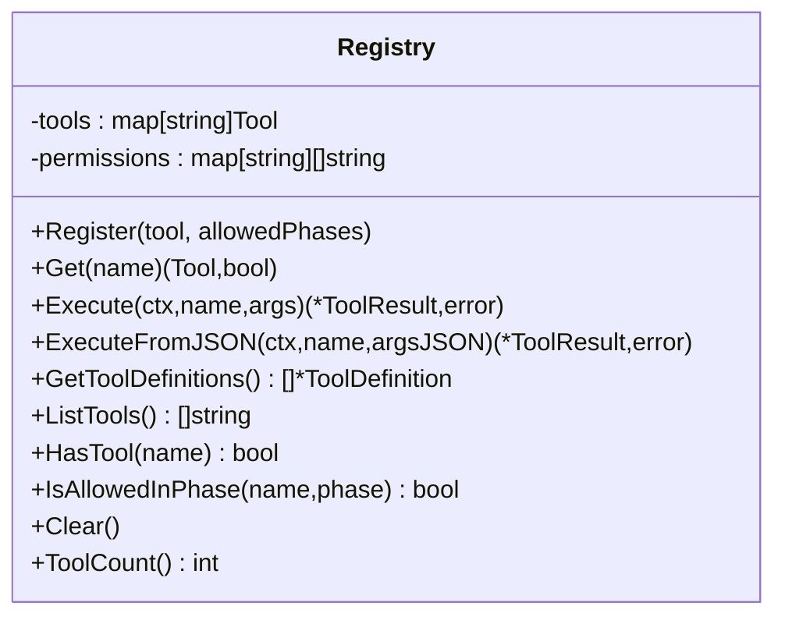
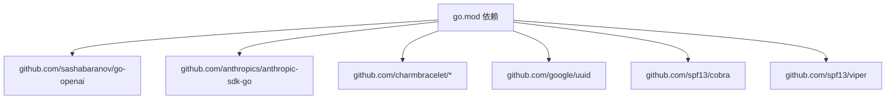

# D&D 5e规则工具包

<cite>
**本文引用的文件**
- [main.go](file://main.go)
- [go.mod](file://go.mod)
- [internal/rules/engine.go](file://internal/rules/engine.go)
- [pkg/dice/dice.go](file://pkg/dice/dice.go)
- [pkg/dice/parser.go](file://pkg/dice/parser.go)
- [internal/character/attributes.go](file://internal/character/attributes.go)
- [internal/character/skills.go](file://internal/character/skills.go)
- [internal/character/character.go](file://internal/character/character.go)
- [internal/character/class.go](file://internal/character/class.go)
- [internal/character/race.go](file://internal/character/race.go)
- [internal/game/engine.go](file://internal/game/engine.go)
- [internal/game/types.go](file://internal/game/types.go)
- [cmd/root.go](file://cmd/root.go)
- [internal/tools/registry.go](file://internal/tools/registry.go)
</cite>

## 目录
1. [简介](#简介)
2. [项目结构](#项目结构)
3. [核心组件](#核心组件)
4. [架构总览](#架构总览)
5. [详细组件分析](#详细组件分析)
6. [依赖分析](#依赖分析)
7. [性能考虑](#性能考虑)
8. [故障排除指南](#故障排除指南)
9. [结论](#结论)
10. [附录](#附录)

## 简介
本文件为 CDND 的 D&D 5e 规则工具包提供系统化技术文档。该工具包围绕规则引擎、角色系统、掷骰系统与游戏引擎展开，实现了属性调整值、技能/豁免检定、攻击检定、伤害投掷与 AC 计算等核心规则，并通过工具注册表与 LLM 集成，形成可扩展的 DM 工具链。文档重点覆盖以下方面：
- 规则引擎的算法实现：属性检定、技能检定、豁免检定、攻击检定、伤害投掷与 AC 计算
- 角色属性与技能关系：熟练度加值、专家级加值、能力调整值的计算逻辑
- 掷骰系统：d20 优势/劣势、自然 1/20 的暴击判定、表达式解析与伤害骰处理
- API 设计原则与扩展机制：工具注册表、LLM 集成、事件分发
- 与其他模块的集成：CLI、存档、世界管理、UI
- 使用示例与最佳实践、规则扩展与自定义开发指导、规则验证与测试策略

## 项目结构
项目采用多层模块化组织，核心规则位于 internal/rules 与 pkg/dice；角色系统位于 internal/character；游戏引擎位于 internal/game；CLI 入口位于 cmd；工具注册表位于 internal/tools。

**图表来源**
- [main.go:1-8](file://main.go#L1-L8)
- [cmd/root.go:1-95](file://cmd/root.go#L1-L95)
- [internal/game/engine.go:1-797](file://internal/game/engine.go#L1-L797)
- [internal/rules/engine.go:1-271](file://internal/rules/engine.go#L1-L271)
- [pkg/dice/dice.go:1-158](file://pkg/dice/dice.go#L1-L158)
- [pkg/dice/parser.go:1-131](file://pkg/dice/parser.go#L1-L131)
- [internal/character/attributes.go:1-142](file://internal/character/attributes.go#L1-L142)
- [internal/character/skills.go:1-172](file://internal/character/skills.go#L1-L172)
- [internal/character/character.go:1-223](file://internal/character/character.go#L1-L223)
- [internal/character/class.go:1-118](file://internal/character/class.go#L1-L118)
- [internal/character/race.go:1-94](file://internal/character/race.go#L1-L94)
- [internal/game/types.go:1-162](file://internal/game/types.go#L1-L162)
- [internal/tools/registry.go:1-109](file://internal/tools/registry.go#L1-L109)

**章节来源**
- [main.go:1-8](file://main.go#L1-L8)
- [cmd/root.go:1-95](file://cmd/root.go#L1-L95)
- [go.mod:1-55](file://go.mod#L1-L55)

## 核心组件
- 规则引擎（internal/rules/engine.go）
  - 提供属性检定、技能检定、豁免检定、攻击检定、伤害投掷与 AC 计算
  - 关键类型：CheckResult、CriticalType、DamageResult
  - 关键函数：AbilityCheck、SkillCheck、SavingThrow、AttackRoll、RollDamage、CalculateAC
- 掷骰系统（pkg/dice）
  - dice.go：d20 优势/劣势、自然 1/20 暴击判定、通用 RollDice
  - parser.go：骰子表达式解析（支持 XdY、+/- 调整值、adv/dis）
- 角色系统（internal/character）
  - attributes.go：属性值与调整值计算、点数购买校验
  - skills.go：技能与属性关联、熟练/专家加值、技能信息映射
  - character.go：角色结构、技能/豁免熟练查询、生命值管理
  - class.go、race.go：职业与种族数据结构（含子职业、特性、语言等）
- 游戏引擎（internal/game/engine.go）
  - 聚合规则引擎、世界管理、存档、工具注册表与 LLM 提供商
  - 实现工具注册、LLM 对话循环、事件分发与 D&D 风格叙述生成
- 工具注册表（internal/tools/registry.go）
  - 工具注册、权限控制、执行与定义导出
- CLI 入口（cmd/root.go）
  - Cobra 命令行框架初始化、配置加载、全局标志

**章节来源**
- [internal/rules/engine.go:1-271](file://internal/rules/engine.go#L1-L271)
- [pkg/dice/dice.go:1-158](file://pkg/dice/dice.go#L1-L158)
- [pkg/dice/parser.go:1-131](file://pkg/dice/parser.go#L1-L131)
- [internal/character/attributes.go:1-142](file://internal/character/attributes.go#L1-L142)
- [internal/character/skills.go:1-172](file://internal/character/skills.go#L1-L172)
- [internal/character/character.go:1-223](file://internal/character/character.go#L1-L223)
- [internal/character/class.go:1-118](file://internal/character/class.go#L1-L118)
- [internal/character/race.go:1-94](file://internal/character/race.go#L1-L94)
- [internal/game/engine.go:1-797](file://internal/game/engine.go#L1-L797)
- [internal/tools/registry.go:1-109](file://internal/tools/registry.go#L1-L109)
- [cmd/root.go:1-95](file://cmd/root.go#L1-L95)

## 架构总览
规则工具包通过“规则引擎 + 掷骰系统 + 角色系统”的组合，向上为游戏引擎提供规则计算能力；向下通过工具注册表与 LLM 对话循环对接 DM 工具，形成“检定/伤害 → 工具执行 → 结果叙述”的闭环。

**图表来源**
- [internal/game/engine.go:1-797](file://internal/game/engine.go#L1-L797)
- [internal/rules/engine.go:1-271](file://internal/rules/engine.go#L1-L271)
- [pkg/dice/dice.go:1-158](file://pkg/dice/dice.go#L1-L158)
- [pkg/dice/parser.go:1-131](file://pkg/dice/parser.go#L1-L131)
- [internal/character/attributes.go:1-142](file://internal/character/attributes.go#L1-L142)
- [internal/character/skills.go:1-172](file://internal/character/skills.go#L1-L172)
- [internal/character/character.go:1-223](file://internal/character/character.go#L1-L223)
- [cmd/root.go:1-95](file://cmd/root.go#L1-L95)
- [internal/tools/registry.go:1-109](file://internal/tools/registry.go#L1-L109)

## 详细组件分析

### 规则引擎（规则计算核心）
- 属性检定（AbilityCheck）
  - 投掷 1d20，结合能力调整值与自然 1/20 的特殊判定
  - 返回 CheckResult，包含总值、DC、成功与否、差值与暴击类型
- 技能检定（SkillCheck）
  - 依据技能关联的能力属性获取调整值
  - 若具备熟练或专家，叠加熟练加值
  - 支持优势/劣势的 d20 二次投掷
- 豁免检定（SavingThrow）
  - 依据目标能力属性与豁免熟练加值
  - 优势/劣势与自然 1/20 特判
- 攻击检定（AttackRoll）
  - 依据攻击属性与熟练加值（简化：假设武器熟练）
  - 优势/劣势与自然 1/20 特判
- 伤害投掷（RollDamage）
  - 解析伤害表达式（如 1d8+2），累加调整值
  - 暴击时额外再投一次相同伤害表达式
- AC 计算（CalculateAC）
  - 基础 AC=10+敏捷调整值（当前版本未考虑护甲）

**图表来源**
- [internal/rules/engine.go:59-271](file://internal/rules/engine.go#L59-L271)

**章节来源**
- [internal/rules/engine.go:1-271](file://internal/rules/engine.go#L1-L271)

### 掷骰系统（骰子与表达式）
- dice.go
  - RollDice：支持 n 个 s 面骰，d20 优势/劣势特判自然 1/20
  - D20WithModifier：优势/劣势取高/低，记录丢弃的骰子
  - Result：包含骰子序列、调整值、总值、暴击类型、掷骰类型与丢弃值
- parser.go
  - Parse：解析表达式（XdY、+/-、adv/dis），支持 d20 的优势/劣势
  - MustParse/ParseAndRoll：便捷函数

**图表来源**
- [pkg/dice/parser.go:32-121](file://pkg/dice/parser.go#L32-L121)
- [pkg/dice/dice.go:117-143](file://pkg/dice/dice.go#L117-L143)

**章节来源**
- [pkg/dice/dice.go:1-158](file://pkg/dice/dice.go#L1-L158)
- [pkg/dice/parser.go:1-131](file://pkg/dice/parser.go#L1-L131)

### 角色系统（属性、技能、熟练与特性）
- 属性（Attributes）
  - Modifier：(属性值-10)/2 向下取整
  - PointBuyCost/ValidatePointBuy：点数购买预算与合法性校验
- 技能（Skills）
  - SkillAbility：技能与能力的映射
  - Skill.Modifier：能力调整值±熟练/专家±杂项加值
  - SavingThrow.Modifier：能力调整值±豁免熟练
- 角色（Character）
  - NewCharacter：默认属性、熟练加值、技能/豁免初始化
  - HasSkillProficiency/HasSavingThrowProficiency：查询熟练
  - GetSkillModifier/GetSavingThrowModifier：综合计算加值
  - HitPoints.TakeDamage/Heal：临时生命优先抵消

**图表来源**
- [internal/character/attributes.go:1-142](file://internal/character/attributes.go#L1-L142)
- [internal/character/skills.go:1-172](file://internal/character/skills.go#L1-L172)
- [internal/character/character.go:1-223](file://internal/character/character.go#L1-L223)

**章节来源**
- [internal/character/attributes.go:1-142](file://internal/character/attributes.go#L1-L142)
- [internal/character/skills.go:1-172](file://internal/character/skills.go#L1-L172)
- [internal/character/character.go:1-223](file://internal/character/character.go#L1-L223)

### 游戏引擎（规则与工具的集成）
- NewEngine：初始化存档、世界、规则引擎、工具注册表与事件分发器
- registerTools：注册骰子、检定、伤害、治疗、状态、物品、金币、场景与 NPC 等工具
- Process：Agentic Loop（LLM → 工具调用 → 结果反馈），支持工具叙述生成与事件分发
- SaveGame/LoadGame：保存/加载完整游戏状态（含角色、场景、NPC、世界标记等）
- SkillCheck/SavingThrow：桥接规则引擎与角色状态
- TakeDamage/Heal：角色生命值变更并触发事件

**图表来源**
- [internal/game/engine.go:195-316](file://internal/game/engine.go#L195-L316)
- [internal/game/engine.go:58-76](file://internal/game/engine.go#L58-L76)
- [internal/rules/engine.go:59-271](file://internal/rules/engine.go#L59-L271)
- [internal/tools/registry.go:37-57](file://internal/tools/registry.go#L37-L57)

**章节来源**
- [internal/game/engine.go:1-797](file://internal/game/engine.go#L1-L797)
- [internal/game/types.go:1-162](file://internal/game/types.go#L1-L162)

### 工具注册表（扩展机制）
- Registry：工具注册、权限控制（按游戏阶段）、执行与定义导出
- 支持从 JSON 参数解析、错误处理与工具计数
- 与游戏引擎配合，实现 DM 工具链的统一调度

**图表来源**
- [internal/tools/registry.go:9-109](file://internal/tools/registry.go#L9-L109)

**章节来源**
- [internal/tools/registry.go:1-109](file://internal/tools/registry.go#L1-L109)

### CLI 入口与配置
- rootCmd：初始化配置、持久化前钩子、全局标志（配置文件路径、调试模式）
- 作为整个应用的启动入口，负责加载配置并交由游戏引擎处理

**章节来源**
- [cmd/root.go:1-95](file://cmd/root.go#L1-L95)

## 依赖分析
- 外部依赖（go.mod）
  - LLM SDK：OpenAI、Anthropic
  - UI 框架：Bubble Tea、Charm 生态
  - UUID 生成、配置管理（Viper）、CLI 框架（Cobra）
- 内部模块耦合
  - internal/game 引擎依赖 internal/rules、pkg/dice、internal/tools、internal/world、internal/save
  - 规则引擎依赖掷骰与角色系统
  - CLI 通过 rootCmd 初始化配置后交由游戏引擎

**图表来源**
- [go.mod:5-14](file://go.mod#L5-L14)

**章节来源**
- [go.mod:1-55](file://go.mod#L1-L55)

## 性能考虑
- 掷骰性能
  - RollDice 对于 d20 优势/劣势采用二次投掷，时间复杂度 O(1)，空间 O(1)
  - 一般多骰投掷为 O(n)，建议避免过大 n 导致的长链式计算
- 规则计算
  - CheckResult/DamageResult 构造与字段访问为 O(1)，整体开销极小
  - 熟练加值与专家加值为常数时间，建议在角色结构中缓存常用加值
- LLM 集成
  - Agentic Loop 最大迭代次数限制为 10，防止无限循环
  - 工具执行与叙述生成为同步过程，建议在工具内部异步化 IO 密集任务

[本节为通用性能讨论，无需特定文件来源]

## 故障排除指南
- 骰子表达式解析失败
  - 现象：Parse 返回错误
  - 排查：确认表达式格式（XdY、+/-、adv/dis），检查数字与大小写
  - 参考：[pkg/dice/parser.go:32-85](file://pkg/dice/parser.go#L32-L85)
- 检定结果异常
  - 现象：自然 1/20 未按预期判定
  - 排查：确认 rollType 与 d20 特判分支
  - 参考：[pkg/dice/dice.go:117-143](file://pkg/dice/dice.go#L117-L143)
- 角色熟练未生效
  - 现象：技能/豁免检定缺少熟练加值
  - 排查：检查 Character.Skills 与 SavingThrows 的 Proficient 字段
  - 参考：[internal/character/character.go:135-183](file://internal/character/character.go#L135-L183)
- 工具执行错误
  - 现象：工具返回错误或未命中
  - 排查：确认工具名称、参数 JSON 解析、权限阶段限制
  - 参考：[internal/tools/registry.go:37-57](file://internal/tools/registry.go#L37-L57)
- LLM 工具调用过多
  - 现象：超过最大迭代次数
  - 排查：优化提示词与工具定义，减少不必要的工具调用
  - 参考：[internal/game/engine.go:230-316](file://internal/game/engine.go#L230-L316)

**章节来源**
- [pkg/dice/parser.go:32-85](file://pkg/dice/parser.go#L32-L85)
- [pkg/dice/dice.go:117-143](file://pkg/dice/dice.go#L117-L143)
- [internal/character/character.go:135-183](file://internal/character/character.go#L135-L183)
- [internal/tools/registry.go:37-57](file://internal/tools/registry.go#L37-L57)
- [internal/game/engine.go:230-316](file://internal/game/engine.go#L230-L316)

## 结论
本规则工具包以清晰的分层架构实现了 D&D 5e 的核心规则：属性、技能、豁免、攻击与伤害。通过掷骰系统与规则引擎的解耦，以及工具注册表与 LLM 的集成，形成了可扩展的 DM 工具链。角色系统提供了完善的属性与熟练度计算，便于扩展自定义规则与特性。建议在实际使用中遵循“先规则、后工具”的设计原则，确保规则一致性与可维护性。

[本节为总结性内容，无需特定文件来源]

## 附录

### 使用示例与最佳实践
- 技能检定
  - 选择技能 → 获取技能信息 → 计算熟练加值 → 调用规则引擎 → 输出检定结果
  - 参考：[internal/rules/engine.go:92-140](file://internal/rules/engine.go#L92-L140)
- 豁免检定
  - 选择能力 → 计算豁免熟练加值 → 调用规则引擎 → 输出检定结果
  - 参考：[internal/rules/engine.go:142-184](file://internal/rules/engine.go#L142-L184)
- 伤害投掷
  - 解析表达式 → 累加调整值 → 暴击时额外投掷 → 输出伤害结果
  - 参考：[internal/rules/engine.go:224-250](file://internal/rules/engine.go#L224-L250)
- AC 计算
  - 基础 AC=10+敏捷调整值（当前版本未考虑护甲）
  - 参考：[internal/rules/engine.go:261-271](file://internal/rules/engine.go#L261-L271)

### 规则扩展与自定义开发指导
- 新增技能
  - 在技能映射中添加新技能与关联能力
  - 参考：[internal/character/skills.go:6-63](file://internal/character/skills.go#L6-L63)
- 新增职业/子职业
  - 扩展 Class/SubClass 数据结构，增加特性与法术槽表
  - 参考：[internal/character/class.go:47-107](file://internal/character/class.go#L47-L107)
- 新增骰子表达式
  - 在 parser 中扩展正则与解析逻辑
  - 参考：[pkg/dice/parser.go:32-85](file://pkg/dice/parser.go#L32-L85)
- 新增 DM 工具
  - 实现 Tool 接口并在注册表中注册，必要时限制游戏阶段
  - 参考：[internal/tools/registry.go:23-29](file://internal/tools/registry.go#L23-L29)

### 规则验证与测试策略
- 单元测试
  - 掷骰：覆盖 d20 优势/劣势与自然 1/20 的边界条件
  - 规则：覆盖检定与伤害的加值组合与暴击分支
  - 角色：覆盖属性调整值、点数购买预算与熟练加值
- 集成测试
  - 游戏引擎：模拟一次完整的 Agentic Loop，验证工具调用与叙述生成
  - 存档：保存/加载角色、场景与世界状态的一致性
- 性能基准
  - 大量投掷与检定的基准测试，评估 n 值对性能的影响

[本节为通用指导，无需特定文件来源]