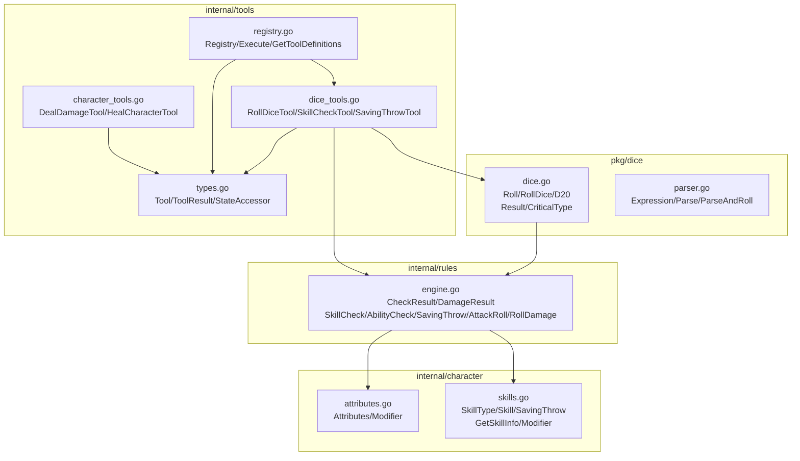
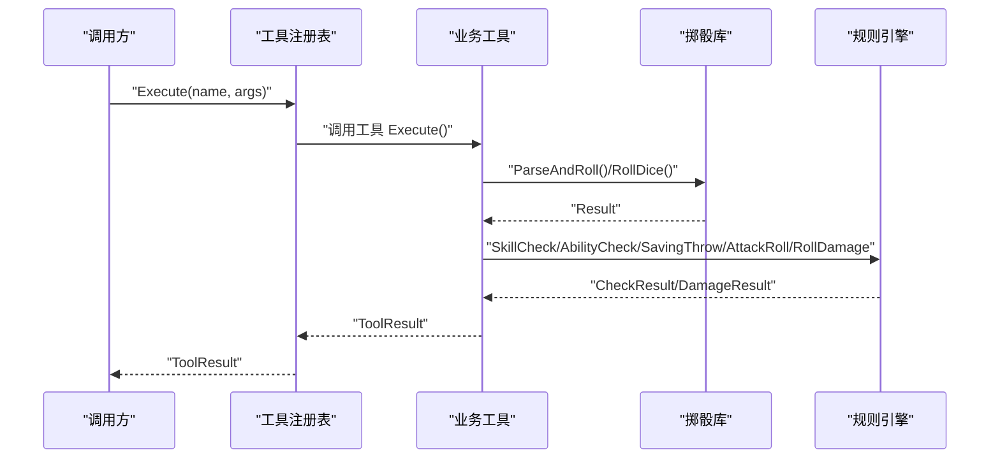
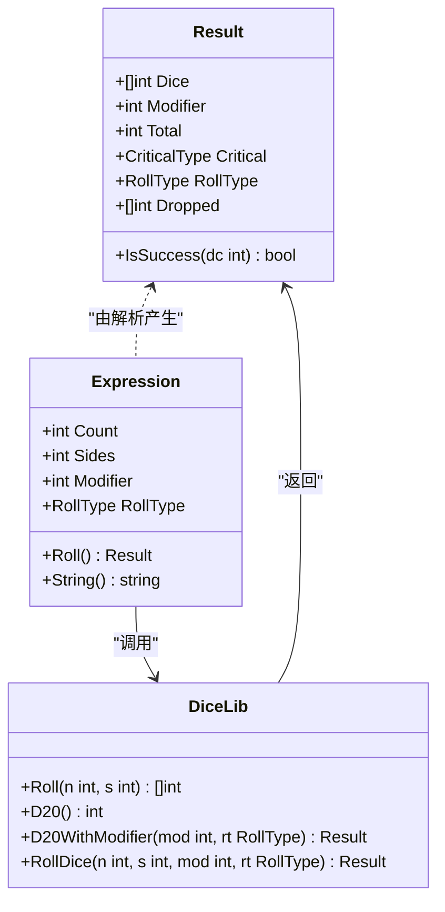
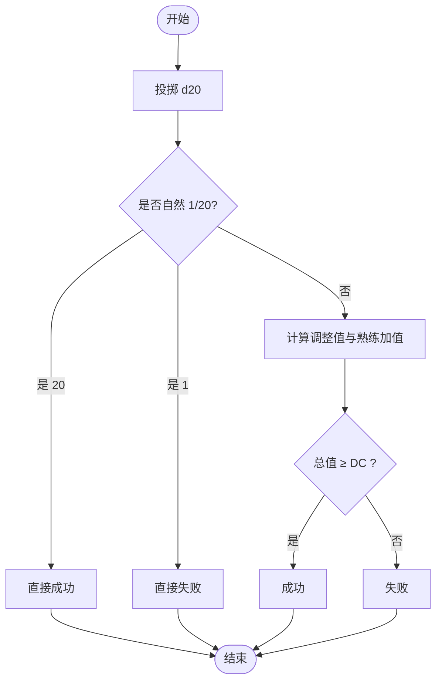
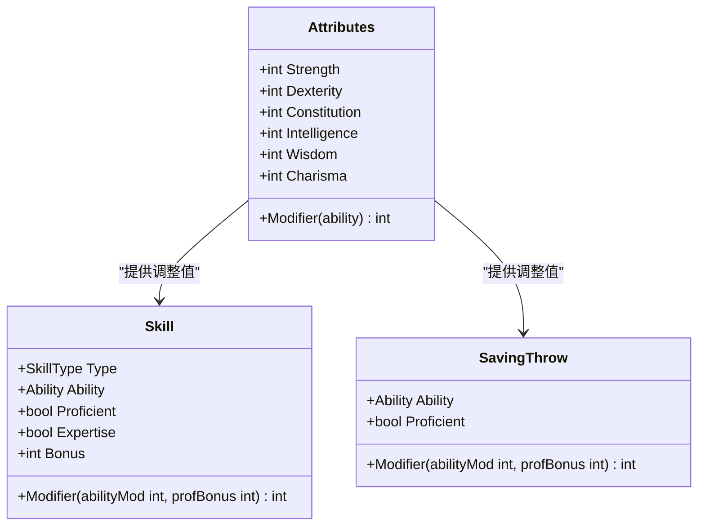
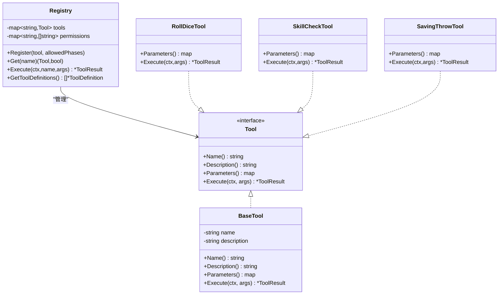
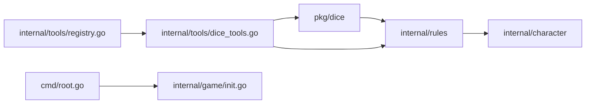

# 工具包模块

<cite>
**本文引用的文件**
- [dice.go](file://pkg/dice/dice.go)
- [parser.go](file://pkg/dice/parser.go)
- [dice_test.go](file://pkg/dice/dice_test.go)
- [dice_tools.go](file://internal/tools/dice_tools.go)
- [types.go](file://internal/tools/types.go)
- [registry.go](file://internal/tools/registry.go)
- [engine.go](file://internal/rules/engine.go)
- [skills.go](file://internal/character/skills.go)
- [attributes.go](file://internal/character/attributes.go)
- [character_tools.go](file://internal/tools/character_tools.go)
- [root.go](file://cmd/root.go)
- [init.go](file://internal/game/init.go)
- [go.mod](file://go.mod)
- [main.go](file://main.go)
</cite>

## 目录
1. [简介](#简介)
2. [项目结构](#项目结构)
3. [核心组件](#核心组件)
4. [架构总览](#架构总览)
5. [详细组件分析](#详细组件分析)
6. [依赖分析](#依赖分析)
7. [性能考虑](#性能考虑)
8. [故障排查指南](#故障排查指南)
9. [结论](#结论)
10. [附录](#附录)

## 简介
本文件面向“工具包模块”，系统化梳理 CDND 中的掷骰与 D&D 5e 规则工具包的设计与实现，涵盖以下主题：
- 掷骰工具包：表达式解析、真随机数生成、结果计算与判定
- D&D 5e 规则工具包：属性计算、技能加值、豁免检定、攻击检定与伤害处理
- 工具包 API 设计原则与使用模式
- 扩展与自定义指南
- 测试策略与质量保障
- 性能优化与内存管理最佳实践
- 与项目其他模块的集成方式
- 示例与最佳实践建议
- 可复用性与向后兼容性保障

## 项目结构
工具包模块主要分布在如下位置：
- pkg/dice：掷骰核心库，提供骰子表达式解析与结果计算
- internal/tools：工具注册与调用框架，封装 dice 与 rules 的业务工具
- internal/rules：D&D 5e 规则引擎，提供检定与伤害计算
- internal/character：角色属性与技能模型，支撑规则引擎

图表来源
- [dice.go:1-158](file://pkg/dice/dice.go#L1-L158)
- [parser.go:1-131](file://pkg/dice/parser.go#L1-L131)
- [engine.go:1-271](file://internal/rules/engine.go#L1-L271)
- [attributes.go:1-142](file://internal/character/attributes.go#L1-L142)
- [skills.go:1-172](file://internal/character/skills.go#L1-L172)
- [types.go:1-118](file://internal/tools/types.go#L1-L118)
- [registry.go:1-132](file://internal/tools/registry.go#L1-L132)
- [dice_tools.go:1-314](file://internal/tools/dice_tools.go#L1-L314)
- [character_tools.go:1-321](file://internal/tools/character_tools.go#L1-L321)

章节来源
- [dice.go:1-158](file://pkg/dice/dice.go#L1-L158)
- [parser.go:1-131](file://pkg/dice/parser.go#L1-L131)
- [engine.go:1-271](file://internal/rules/engine.go#L1-L271)
- [attributes.go:1-142](file://internal/character/attributes.go#L1-L142)
- [skills.go:1-172](file://internal/character/skills.go#L1-L172)
- [types.go:1-118](file://internal/tools/types.go#L1-L118)
- [registry.go:1-132](file://internal/tools/registry.go#L1-L132)
- [dice_tools.go:1-314](file://internal/tools/dice_tools.go#L1-L314)
- [character_tools.go:1-321](file://internal/tools/character_tools.go#L1-L321)

## 核心组件
- 掷骰核心
  - 骰子表达式解析：支持 XdY、±N、优势/劣势标记，输出标准化表达式与参数
  - 真随机数生成：优先使用加密安全随机源，失败时安全回退
  - 结果计算：支持普通、优势、劣势三种掷骰类型；识别自然 1/20 的暴击判定
- D&D 5e 规则引擎
  - 检定：属性检定、技能检定、豁免检定，自动叠加熟练加值与属性调整值
  - 攻击与伤害：攻击检定与伤害投掷，支持暴击时额外伤害
  - AC 计算：基于敏捷调整值与基础值
- 工具框架
  - 工具接口与基类：统一的工具定义、参数校验与执行流程
  - 注册表：线程安全的工具注册、查询与执行，支持按阶段授权
  - 业务工具：掷骰、技能检定、豁免检定、造成/治疗伤害等

章节来源
- [dice.go:1-158](file://pkg/dice/dice.go#L1-L158)
- [parser.go:1-131](file://pkg/dice/parser.go#L1-L131)
- [engine.go:1-271](file://internal/rules/engine.go#L1-L271)
- [types.go:1-118](file://internal/tools/types.go#L1-L118)
- [registry.go:1-132](file://internal/tools/registry.go#L1-L132)

## 架构总览
工具包模块通过“规则引擎 + 角色模型 + 工具框架”的分层设计，将底层掷骰与规则计算抽象为可复用能力，并通过工具接口对外暴露。

图表来源
- [registry.go:44-65](file://internal/tools/registry.go#L44-L65)
- [dice_tools.go:39-71](file://internal/tools/dice_tools.go#L39-L71)
- [engine.go:92-140](file://internal/rules/engine.go#L92-L140)
- [dice.go:117-143](file://pkg/dice/dice.go#L117-L143)

## 详细组件分析

### 掷骰库（pkg/dice）
- 数据结构
  - RollType：普通、优势、劣势
  - CriticalType：无、大成功、大失败
  - Result：包含骰子明细、调整值、总值、暴击类型、掷骰类型与丢弃的骰子
- 关键算法
  - 真随机：优先使用加密安全随机源，失败时安全回退
  - 表达式解析：正则匹配“数量/面数/优势/劣势/调整值”，支持缩写形式
  - 暴击判定：d20 自然 20 为大成功，自然 1 为大失败
- 复杂度
  - Roll/RollDice：O(n)
  - Parse：O(1)（固定正则）
  - IsSuccess：O(1)

图表来源
- [dice.go:34-157](file://pkg/dice/dice.go#L34-L157)
- [parser.go:11-90](file://pkg/dice/parser.go#L11-L90)

章节来源
- [dice.go:1-158](file://pkg/dice/dice.go#L1-L158)
- [parser.go:1-131](file://pkg/dice/parser.go#L1-L131)

### 规则引擎（internal/rules）
- 数据结构
  - CheckResult：包含检定成功与否、ROLL 明细、总值、DC、差值与暴击类型
  - DamageResult：包含基础伤害、调整值、是否暴击、额外暴击伤害与总伤害
- 核心流程
  - 检定：根据 roll.Critical 直接判定成功/失败，否则叠加属性调整值与熟练加值后比较 DC
  - 攻击：与豁免类似，但额外考虑武器熟练加值
  - 伤害：基础伤害叠加调整值；若暴击则再投一次伤害

图表来源
- [engine.go:59-89](file://internal/rules/engine.go#L59-L89)
- [engine.go:91-140](file://internal/rules/engine.go#L91-L140)
- [engine.go:142-184](file://internal/rules/engine.go#L142-L184)

章节来源
- [engine.go:1-271](file://internal/rules/engine.go#L1-L271)

### 角色与技能模型（internal/character）
- 属性系统：六项基础属性，提供调整值计算与点购成本校验
- 技能系统：技能类型、关联属性、熟练与专精、杂项加值
- 豁免系统：豁免熟练与调整值

图表来源
- [attributes.go:22-96](file://internal/character/attributes.go#L22-L96)
- [skills.go:65-100](file://internal/character/skills.go#L65-L100)

章节来源
- [attributes.go:1-142](file://internal/character/attributes.go#L1-L142)
- [skills.go:1-172](file://internal/character/skills.go#L1-L172)

### 工具框架与业务工具（internal/tools）
- 接口与基类
  - Tool 接口：Name/Description/Parameters/Execute
  - BaseTool：可选嵌入，提供默认实现
  - ToolResult：统一返回结构
- 注册表
  - 线程安全注册与执行，支持按阶段授权
  - 工具定义导出为 LLM API 形态
- 业务工具
  - RollDiceTool：解析表达式并执行掷骰，返回叙事与数据
  - SkillCheckTool：基于角色技能与熟练度进行检定
  - SavingThrowTool：基于角色属性进行豁免检定
  - DealDamageTool/HealCharacterTool：角色生命值变更与状态管理

图表来源
- [types.go:24-108](file://internal/tools/types.go#L24-L108)
- [registry.go:10-77](file://internal/tools/registry.go#L10-L77)
- [dice_tools.go:12-71](file://internal/tools/dice_tools.go#L12-L71)
- [dice_tools.go:73-198](file://internal/tools/dice_tools.go#L73-L198)
- [dice_tools.go:200-313](file://internal/tools/dice_tools.go#L200-L313)

章节来源
- [types.go:1-118](file://internal/tools/types.go#L1-L118)
- [registry.go:1-132](file://internal/tools/registry.go#L1-L132)
- [dice_tools.go:1-314](file://internal/tools/dice_tools.go#L1-L314)

### 与游戏初始化与 CLI 的集成
- CLI 根命令负责初始化配置，随后进入游戏引擎
- 游戏引擎在启动时生成个性化欢迎消息，无需 LLM 调用
- 工具框架通过注册表对外暴露工具定义，便于 LLM 调用

章节来源
- [root.go:31-37](file://cmd/root.go#L31-L37)
- [init.go:19-65](file://internal/game/init.go#L19-L65)
- [registry.go:67-77](file://internal/tools/registry.go#L67-L77)

## 依赖分析
- 内部依赖
  - pkg/dice 与 internal/rules：规则引擎依赖掷骰库进行检定与伤害投掷
  - internal/rules 依赖 internal/character：规则引擎使用属性与技能信息
  - internal/tools 依赖 pkg/dice 与 internal/rules：业务工具封装底层能力
- 外部依赖
  - CLI 与配置：Cobra/Viper
  - LLM 提供商：OpenAI、Anthropic、Ollama（通过 llm 子模块）

图表来源
- [dice.go:1-10](file://pkg/dice/dice.go#L1-L10)
- [engine.go:3-6](file://internal/rules/engine.go#L3-L6)
- [dice_tools.go:7-9](file://internal/tools/dice_tools.go#L7-L9)
- [registry.go:1-8](file://internal/tools/registry.go#L1-L8)
- [root.go:4-11](file://cmd/root.go#L4-L11)
- [init.go:3-11](file://internal/game/init.go#L3-L11)

章节来源
- [go.mod:5-14](file://go.mod#L5-L14)
- [main.go:1-8](file://main.go#L1-L8)

## 性能考虑
- 随机数生成
  - 优先使用加密安全随机源，失败时安全回退，避免阻塞与死循环
- 表达式解析
  - 使用预编译正则，复杂度 O(1)，解析开销极低
- 结果计算
  - Roll/RollDice 为 O(n)，n 通常很小（多数为 1~4），常数开销低
- 工具执行
  - Registry 使用读写锁，读多写少场景下并发友好
- 内存管理
  - Result/Dice 切片长度与输入规模线性相关，建议在上层控制表达式规模
  - 工具返回结构体小而明确，避免不必要的拷贝

## 故障排查指南
- 表达式解析失败
  - 检查格式是否符合 XdY、±N、adv/dis 缩写规则
  - 使用 MustParse 进行快速定位，或捕获错误信息
- 掷骰结果异常
  - 确认 RollType 是否正确传入；优势/劣势会改变骰子选择逻辑
  - 暴击判定仅对 d20 生效，检查表达式与 RollType
- 规则检定结果不符预期
  - 检查角色属性与熟练度配置；技能检定需考虑关联属性与熟练加值
- 工具执行失败
  - 确认工具已注册且当前阶段允许执行
  - 检查参数类型与必填字段

章节来源
- [parser.go:32-85](file://pkg/dice/parser.go#L32-L85)
- [dice.go:117-143](file://pkg/dice/dice.go#L117-L143)
- [engine.go:91-140](file://internal/rules/engine.go#L91-L140)
- [registry.go:44-65](file://internal/tools/registry.go#L44-L65)

## 结论
工具包模块以“掷骰库 + 规则引擎 + 工具框架”为核心，实现了 D&D 5e 常用玩法的高内聚、低耦合能力。通过真随机数生成、严谨的表达式解析与规则计算，以及完善的工具注册与授权机制，既满足了游戏运行时的实时需求，也为扩展与定制提供了清晰边界。

## 附录

### API 设计原则与使用模式
- 统一接口：所有工具实现 Tool 接口，便于注册与调用
- 参数校验：通过 JSON Schema 定义参数，提升 LLM 调用稳定性
- 结果结构：ToolResult 统一返回成功、叙事与数据三要素
- 线程安全：Registry 使用读写锁，适合并发场景
- 可观测性：Narrative 字段用于生成人类可读的叙事文本

章节来源
- [types.go:24-108](file://internal/tools/types.go#L24-L108)
- [registry.go:10-77](file://internal/tools/registry.go#L10-L77)

### 扩展与自定义指南
- 新增工具
  - 实现 Tool 接口或嵌入 BaseTool
  - 在注册表中注册，并按需声明允许的阶段
- 新增规则
  - 在规则引擎中新增方法，遵循 CheckResult/DamageResult 约定
  - 与角色模型解耦，通过属性与技能信息进行计算
- 新增掷骰表达式变体
  - 在解析器中扩展正则与参数映射
  - 在掷骰库中补充相应计算逻辑

章节来源
- [types.go:76-108](file://internal/tools/types.go#L76-L108)
- [registry.go:25-33](file://internal/tools/registry.go#L25-L33)
- [parser.go:32-85](file://pkg/dice/parser.go#L32-L85)
- [engine.go:186-250](file://internal/rules/engine.go#L186-L250)

### 测试策略与质量保证
- 单元测试覆盖
  - 掷骰：Roll、D20、D20WithModifier、Parse、Result.IsSuccess
  - 规则：SkillCheck/AbilityCheck/SavingThrow 的边界与熟练加值
- 随机性验证
  - 对自然 1/20 的判定进行多次采样验证
- 集成测试
  - 工具注册表执行链路与参数解析链路
- 质量门禁
  - 通过 golangci-lint 与单元测试覆盖率门槛

章节来源
- [dice_test.go:7-204](file://pkg/dice/dice_test.go#L7-L204)

### 示例与最佳实践
- 使用表达式进行掷骰
  - 例如：1d20+3、2d6、1d20adv、1d20dis
  - 通过 ParseAndRoll 快速得到结果
- 技能检定
  - 传入技能名、DC 与可选优势标记，自动叠加熟练加值
- 豁免检定
  - 传入属性名、DC 与可选优势标记，自动叠加豁免熟练
- 伤害处理
  - 使用 RollDamage 计算基础伤害与暴击额外伤害
- 工具调用
  - 通过 Registry.ExecuteFromJSON 以 JSON 参数调用工具
  - 使用 GetToolDefinitions 导出工具定义给 LLM

章节来源
- [dice_tools.go:39-71](file://internal/tools/dice_tools.go#L39-L71)
- [dice_tools.go:138-198](file://internal/tools/dice_tools.go#L138-L198)
- [dice_tools.go:253-313](file://internal/tools/dice_tools.go#L253-L313)
- [engine.go:224-250](file://internal/rules/engine.go#L224-L250)
- [registry.go:56-65](file://internal/tools/registry.go#L56-L65)
- [registry.go:67-77](file://internal/tools/registry.go#L67-L77)

### 可复用性与向后兼容性
- 模块化设计：pkg/dice 与 internal/rules 独立于工具框架，便于复用
- 接口稳定：Tool/CheckResult/DamageResult 等核心结构保持稳定
- 版本演进：通过新增方法而非破坏性修改现有接口，保障向后兼容

章节来源
- [dice.go:34-41](file://pkg/dice/dice.go#L34-L41)
- [engine.go:16-24](file://internal/rules/engine.go#L16-L24)
- [engine.go:252-259](file://internal/rules/engine.go#L252-L259)