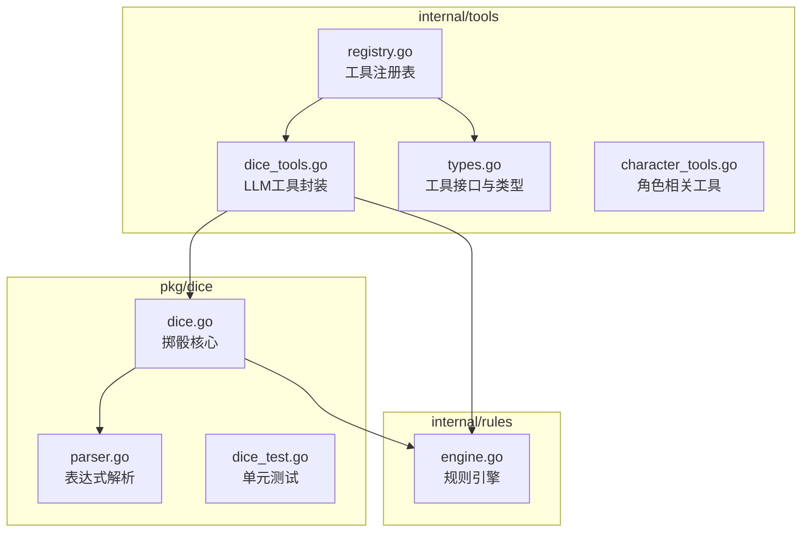
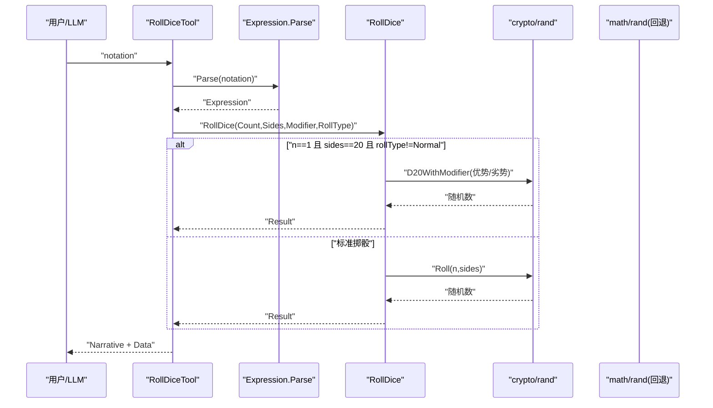
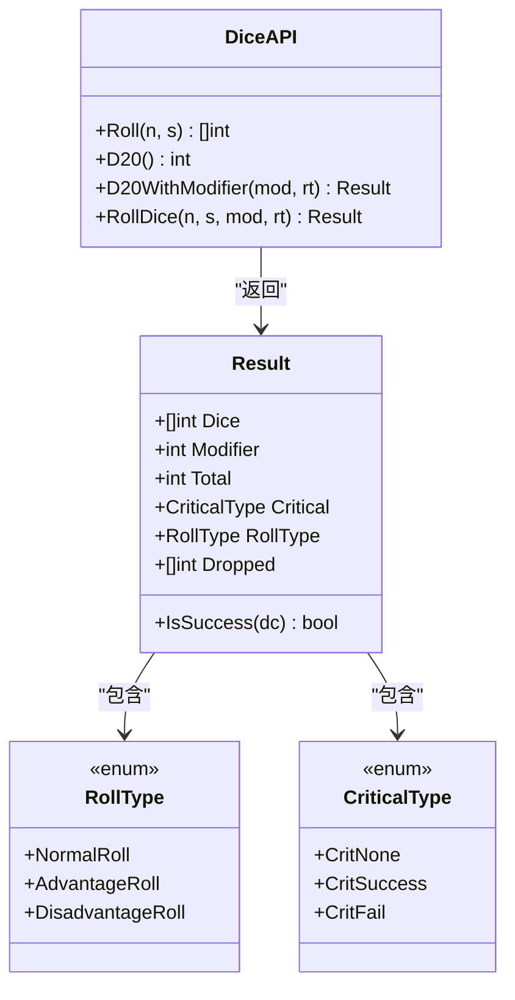
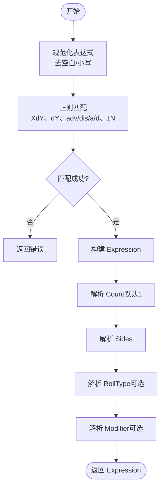
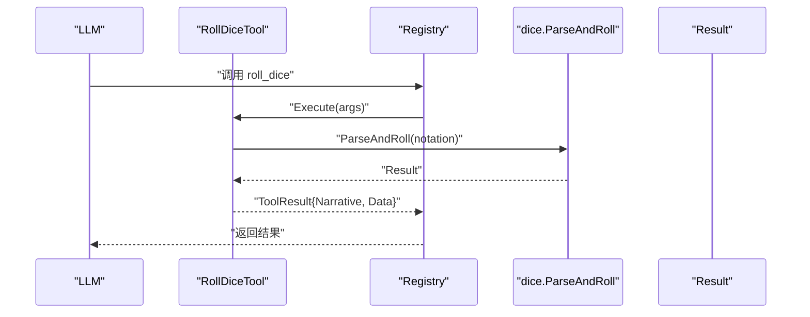
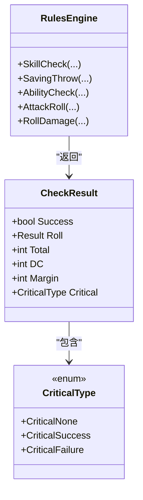
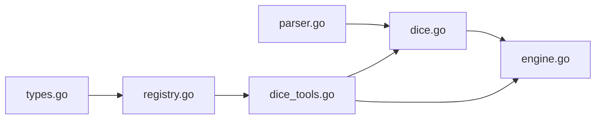

# 掷骰工具包

<cite>
**本文引用的文件**
- [dice.go](file://pkg/dice/dice.go)
- [parser.go](file://pkg/dice/parser.go)
- [dice_test.go](file://pkg/dice/dice_test.go)
- [dice_tools.go](file://internal/tools/dice_tools.go)
- [types.go](file://internal/tools/types.go)
- [engine.go](file://internal/rules/engine.go)
- [registry.go](file://internal/tools/registry.go)
- [character_tools.go](file://internal/tools/character_tools.go)
</cite>

## 目录
1. [简介](#简介)
2. [项目结构](#项目结构)
3. [核心组件](#核心组件)
4. [架构总览](#架构总览)
5. [详细组件分析](#详细组件分析)
6. [依赖分析](#依赖分析)
7. [性能考量](#性能考量)
8. [故障排查指南](#故障排查指南)
9. [结论](#结论)
10. [附录](#附录)

## 简介
本文件为 CDND 的掷骰工具包提供系统化技术文档，覆盖掷骰系统的设计与实现，包括 RollType 与 CriticalType 枚举、Result 结构体、Roll/D20/RollDice 函数、优势/劣势掷骰机制、暴击判定、表达式解析器、结果验证与测试策略、性能优化与内存管理，以及工具集成与使用示例。

## 项目结构
掷骰工具包位于 pkg/dice，配套的工具封装位于 internal/tools，规则引擎位于 internal/rules，用于在角色扮演场景中驱动掷骰与检定流程。

图表来源
- [dice.go:1-158](file://pkg/dice/dice.go#L1-L158)
- [parser.go:1-131](file://pkg/dice/parser.go#L1-L131)
- [dice_tools.go:1-314](file://internal/tools/dice_tools.go#L1-L314)
- [types.go:1-118](file://internal/tools/types.go#L1-L118)
- [engine.go:1-271](file://internal/rules/engine.go#L1-L271)
- [registry.go:1-109](file://internal/tools/registry.go#L1-L109)

章节来源
- [dice.go:1-158](file://pkg/dice/dice.go#L1-L158)
- [parser.go:1-131](file://pkg/dice/parser.go#L1-L131)
- [dice_tools.go:1-314](file://internal/tools/dice_tools.go#L1-L314)
- [types.go:1-118](file://internal/tools/types.go#L1-L118)
- [engine.go:1-271](file://internal/rules/engine.go#L1-L271)
- [registry.go:1-109](file://internal/tools/registry.go#L1-L109)

## 核心组件
- 掷骰核心（pkg/dice/dice.go）
  - RollType：普通、优势、劣势
  - CriticalType：无暴击、自然20（大成功）、自然1（大失败）
  - Result：包含骰子序列、调整值、总和、暴击类型、掷骰类型、丢弃的骰子
  - Roll、D20、D20WithModifier、RollDice、sum、Result.IsSuccess
- 表达式解析（pkg/dice/parser.go）
  - Expression：计数、面数、调整值、掷骰类型
  - Parse、Roll、String、ParseAndRoll、MustParse
- 工具封装（internal/tools/dice_tools.go）
  - RollDiceTool：将掷骰能力暴露为 LLM 工具
- 规则引擎（internal/rules/engine.go）
  - CheckResult：检定结果，含 Roll、Total、DC、Margin、Critical
  - CriticalType：大成功、大失败
  - SkillCheck、SavingThrow、AttackRoll、RollDamage 等
- 工具注册与类型（internal/tools/types.go、internal/tools/registry.go）

章节来源
- [dice.go:9-41](file://pkg/dice/dice.go#L9-L41)
- [parser.go:10-16](file://pkg/dice/parser.go#L10-L16)
- [dice_tools.go:12-71](file://internal/tools/dice_tools.go#L12-L71)
- [engine.go:16-57](file://internal/rules/engine.go#L16-L57)

## 架构总览
掷骰工具包采用“表达式解析 + 核心掷骰 + 规则引擎 + 工具封装”的分层设计：
- 表达式层：解析用户输入的骰子表达式，生成标准化的 Expression
- 核心层：提供安全随机数生成、优势/劣势处理、暴击判定、结果汇总
- 规则层：将掷骰结果与角色属性、熟练加成、难度等级结合，输出检定/伤害结果
- 工具层：将规则引擎与核心掷骰能力封装为 LLM 可调用工具，并通过注册表统一调度

图表来源
- [dice_tools.go:38-71](file://internal/tools/dice_tools.go#L38-L71)
- [parser.go:87-90](file://pkg/dice/parser.go#L87-L90)
- [dice.go:115-143](file://pkg/dice/dice.go#L115-L143)
- [dice.go:52-64](file://pkg/dice/dice.go#L52-L64)

## 详细组件分析

### 掷骰核心（dice.go）
- RollType 与 CriticalType
  - RollType：NormalRoll、AdvantageRoll、DisadvantageRoll
  - CriticalType：CritNone、CritSuccess、CritFail
- Result 字段
  - Dice：单次掷骰的点数序列
  - Modifier：调整值
  - Total：Dice 总和 + Modifier
  - Critical：暴击类型
  - RollType：本次掷骰类型
  - Dropped：优势/劣势丢弃的骰子（长度通常为1）
- 关键函数
  - Roll(n, s)：生成 n 个 s 面骰子的结果
  - rollDie(sides)：使用 crypto/rand 生成 1..s 的安全随机数；失败时回退到 1
  - D20()：掷一个 d20
  - D20WithModifier(modifier, rollType)：处理优势/劣势与暴击判定
  - RollDice(n, sides, modifier, rollType)：通用掷骰入口，针对 d20 优势/劣势做特殊路径
  - sum(dice)：求和
  - Result.IsSuccess(dc)：判断是否达到难度等级

图表来源
- [dice.go:9-41](file://pkg/dice/dice.go#L9-L41)
- [dice.go:43-157](file://pkg/dice/dice.go#L43-L157)

章节来源
- [dice.go:9-41](file://pkg/dice/dice.go#L9-L41)
- [dice.go:43-157](file://pkg/dice/dice.go#L43-L157)

### 表达式解析器（parser.go）
- Expression 字段：Count、Sides、Modifier、RollType
- Parse(expr)：支持形如 "2d6"、"1d20+5"、"d8-1"、"1d20adv"/"1d20dis"、"d20a"/"d20d" 的表达式
- Roll()：基于 Expression 调用 RollDice
- String()：格式化回显表达式
- ParseAndRoll(expr)：一步完成解析与掷骰
- MustParse(expr)：解析失败时 panic

图表来源
- [parser.go:32-85](file://pkg/dice/parser.go#L32-L85)

章节来源
- [parser.go:10-16](file://pkg/dice/parser.go#L10-L16)
- [parser.go:18-85](file://pkg/dice/parser.go#L18-L85)
- [parser.go:87-131](file://pkg/dice/parser.go#L87-L131)

### 工具封装与集成（internal/tools）
- RollDiceTool
  - 参数：notation（骰子表达式）
  - 执行：调用 dice.ParseAndRoll，组装叙事与数据（包含 total、dice、modifier、critical、roll_type）
- SkillCheckTool 与 SavingThrowTool
  - 将角色属性/技能与规则引擎结合，调用规则引擎的检定函数，再将 dice.CriticalType 转换为规则引擎的 CriticalType
- Registry
  - 工具注册、执行、权限控制、定义导出
- Tool 接口与 ToolResult
  - 统一工具抽象与返回结构

图表来源
- [dice_tools.go:38-71](file://internal/tools/dice_tools.go#L38-L71)
- [registry.go:37-57](file://internal/tools/registry.go#L37-L57)
- [parser.go:114-121](file://pkg/dice/parser.go#L114-L121)

章节来源
- [dice_tools.go:12-71](file://internal/tools/dice_tools.go#L12-L71)
- [engine.go:47-57](file://internal/rules/engine.go#L47-L57)
- [registry.go:9-109](file://internal/tools/registry.go#L9-L109)
- [types.go:24-42](file://internal/tools/types.go#L24-L42)

### 规则引擎（internal/rules/engine.go）
- CheckResult：包含 Roll、Total、DC、Margin、Critical
- CriticalType：CriticalNone、CriticalSuccess、CriticalFailure
- SkillCheck/SavingThrow/AbilityCheck/AttackRoll：将 dice.Result 与角色属性、熟练加成结合，处理大成功/大失败的特例
- RollDamage：解析伤害表达式，若 critical 为真则额外投一次伤害

图表来源
- [engine.go:16-57](file://internal/rules/engine.go#L16-L57)
- [engine.go:91-184](file://internal/rules/engine.go#L91-L184)
- [engine.go:224-250](file://internal/rules/engine.go#L224-L250)

章节来源
- [engine.go:16-57](file://internal/rules/engine.go#L16-L57)
- [engine.go:91-184](file://internal/rules/engine.go#L91-L184)
- [engine.go:224-250](file://internal/rules/engine.go#L224-L250)

## 依赖分析
- 内部依赖
  - internal/tools/dice_tools.go 依赖 pkg/dice 与 internal/rules
  - internal/rules/engine.go 依赖 pkg/dice
- 外部依赖
  - crypto/rand：提供加密安全的随机数
  - math/big：辅助生成 1..s 的随机数
  - regexp、strconv、strings：表达式解析
- 耦合与内聚
  - dice.go 保持纯函数与最小外部依赖，内聚性高
  - parser.go 与 dice.go 解耦，便于独立测试
  - tools 层通过接口与规则引擎解耦，便于扩展

图表来源
- [parser.go:1-8](file://pkg/dice/parser.go#L1-L8)
- [dice.go:4-7](file://pkg/dice/dice.go#L4-L7)
- [dice_tools.go:3-10](file://internal/tools/dice_tools.go#L3-L10)
- [engine.go:3-6](file://internal/rules/engine.go#L3-L6)
- [registry.go:3-7](file://internal/tools/registry.go#L3-L7)
- [types.go:3-8](file://internal/tools/types.go#L3-L8)

章节来源
- [parser.go:1-8](file://pkg/dice/parser.go#L1-L8)
- [dice.go:4-7](file://pkg/dice/dice.go#L4-L7)
- [dice_tools.go:3-10](file://internal/tools/dice_tools.go#L3-L10)
- [engine.go:3-6](file://internal/rules/engine.go#L3-L6)
- [registry.go:3-7](file://internal/tools/registry.go#L3-L7)
- [types.go:3-8](file://internal/tools/types.go#L3-L8)

## 性能考量
- 随机数生成
  - rollDie 使用 crypto/rand 保证安全性；当 crypto/rand 失败时回退到 1，确保可用性但牺牲随机性。建议在高并发场景下评估是否引入池化或缓存策略，避免频繁系统调用。
- 切片分配
  - Roll(n, s) 直接分配长度为 n 的切片，避免扩容开销；sum 循环遍历切片，时间复杂度 O(n)。
- 优势/劣势路径
  - D20WithModifier 仅在 n==1 且 sides==20 时启用，避免对一般掷骰增加分支成本。
- 表达式解析
  - 正则匹配与字符串处理在高频调用时应考虑缓存编译后的正则对象，减少重复编译成本。
- 工具执行
  - Registry 的工具查找为哈希表操作，O(1)；JSON 解析在参数较多时可能成为瓶颈，建议在上层合并参数或使用流式解析。

[本节为通用性能建议，不直接分析具体代码文件]

## 故障排查指南
- 随机数异常
  - 若 crypto/rand 失败，rollDie 回退为 1。可通过日志记录失败事件并上报监控。
- 表达式解析失败
  - Parse 返回错误时，检查输入格式是否符合 "XdY"、"dY"、"+/-N"、"adv/dis/a/d" 等模式。
- 暴击判定不生效
  - 确认 RollDice 的 n==1 且 sides==20 条件满足；对于非 d20 单骰，不会触发自然 1/20 的暴击判定。
- 工具执行失败
  - RollDiceTool 在解析失败时返回错误；Registry.Execute 返回 ErrToolNotFound 或参数解析错误。
- 测试验证
  - dice_test.go 覆盖 Roll、D20、D20WithModifier、Parse、String、IsSuccess 等关键路径；建议在回归测试中加入随机性稳定性检查。

章节来源
- [dice.go:52-64](file://pkg/dice/dice.go#L52-L64)
- [parser.go:32-85](file://pkg/dice/parser.go#L32-L85)
- [dice.go:115-143](file://pkg/dice/dice.go#L115-L143)
- [dice_tools.go:45-48](file://internal/tools/dice_tools.go#L45-L48)
- [registry.go:37-57](file://internal/tools/registry.go#L37-L57)
- [dice_test.go:7-204](file://pkg/dice/dice_test.go#L7-L204)

## 结论
掷骰工具包以简洁清晰的分层设计实现了 D&D 5e 的掷骰与检定能力：表达式解析提供易用的输入方式，核心掷骰保障安全与正确性，规则引擎将掷骰结果与角色系统整合，工具层面向 LLM 提供可调用能力。整体架构内聚性好、扩展性强，适合在角色扮演与 AI 驱动的游戏中稳定使用。

[本节为总结性内容，不直接分析具体代码文件]

## 附录

### 使用示例与集成指南
- 直接调用核心 API
  - 解析表达式并掷骰：使用 ParseAndRoll(notation) 获取 Result
  - 优势/劣势 d20：传入 RollType 为 AdvantageRoll 或 DisadvantageRoll
  - 检定难度判定：Result.IsSuccess(dc)
- 作为 LLM 工具
  - 注册 RollDiceTool 后，通过 Registry.Execute 调用
  - 工具参数：notation（如 "1d20+5"、"2d6"、"1d20adv"、"d20dis"）
  - 返回数据包含 total、dice、modifier、critical、roll_type
- 规则引擎集成
  - 使用 SkillCheck/SavingThrow/AbilityCheck/AttackRoll 获取包含熟练加成与大成功/大失败处理的检定结果
  - 使用 RollDamage 解析伤害表达式并按需追加一次额外伤害

章节来源
- [parser.go:114-121](file://pkg/dice/parser.go#L114-L121)
- [dice_tools.go:38-71](file://internal/tools/dice_tools.go#L38-L71)
- [engine.go:91-184](file://internal/rules/engine.go#L91-L184)
- [engine.go:224-250](file://internal/rules/engine.go#L224-L250)