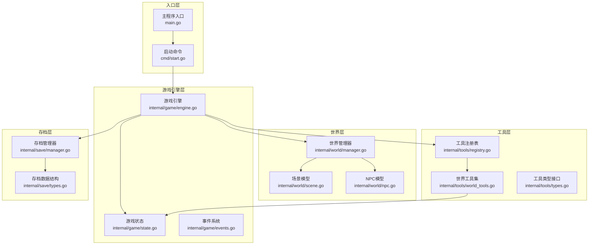
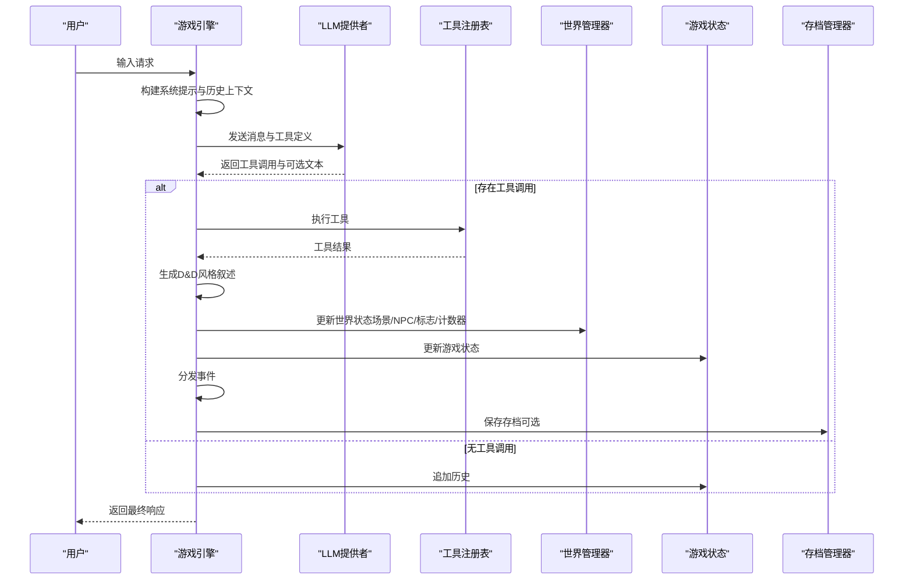
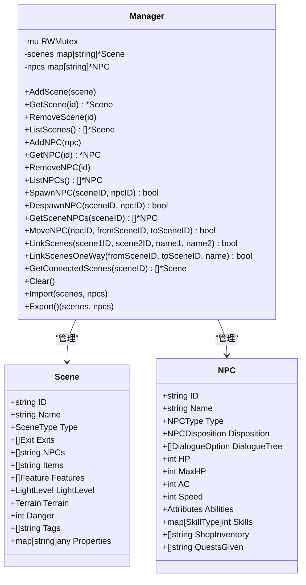
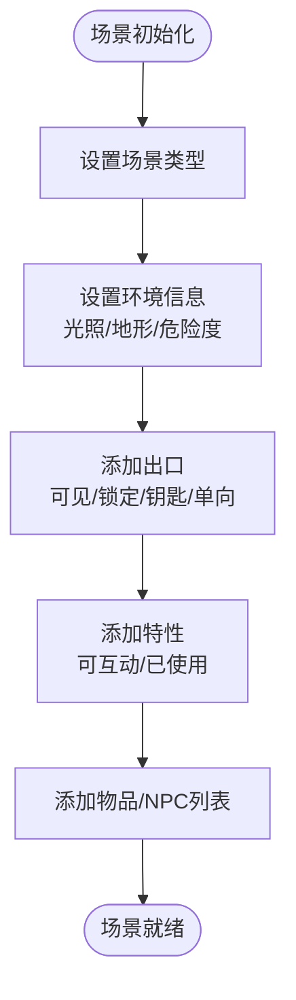
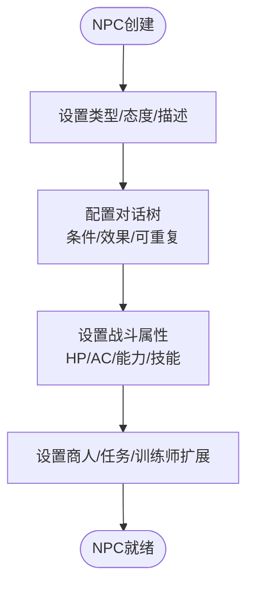
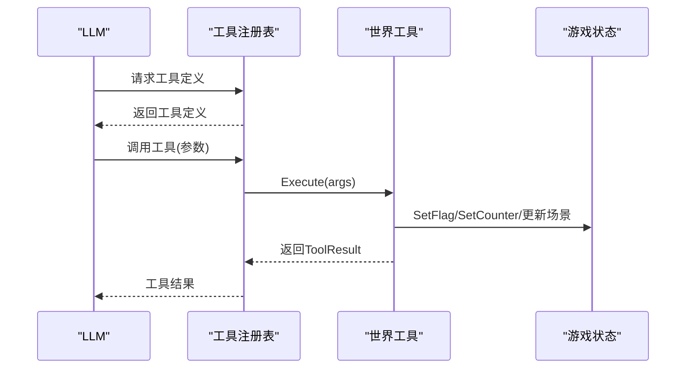
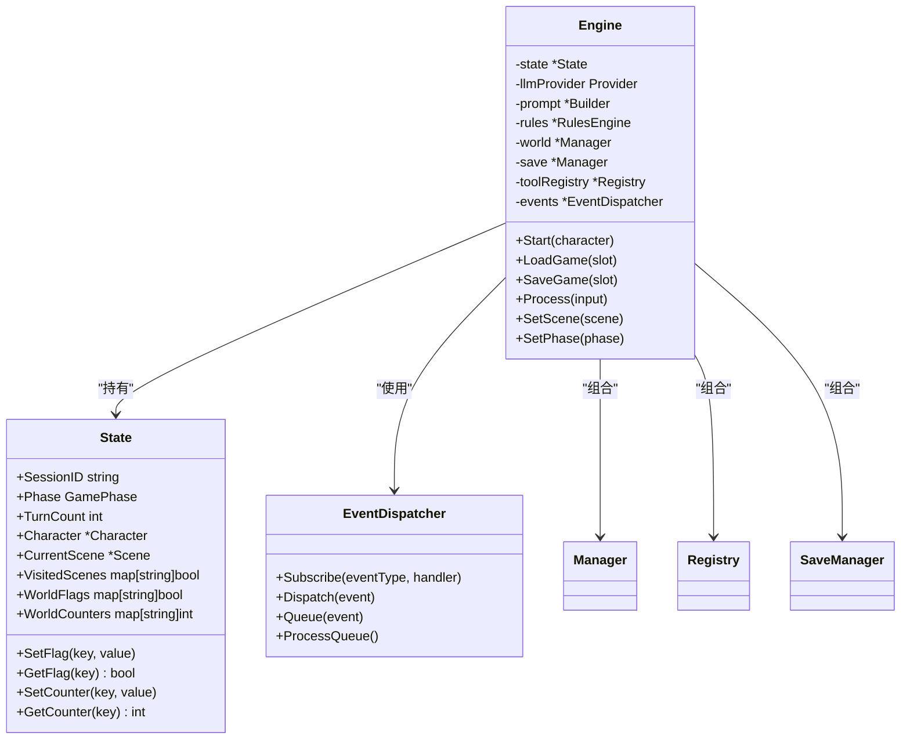
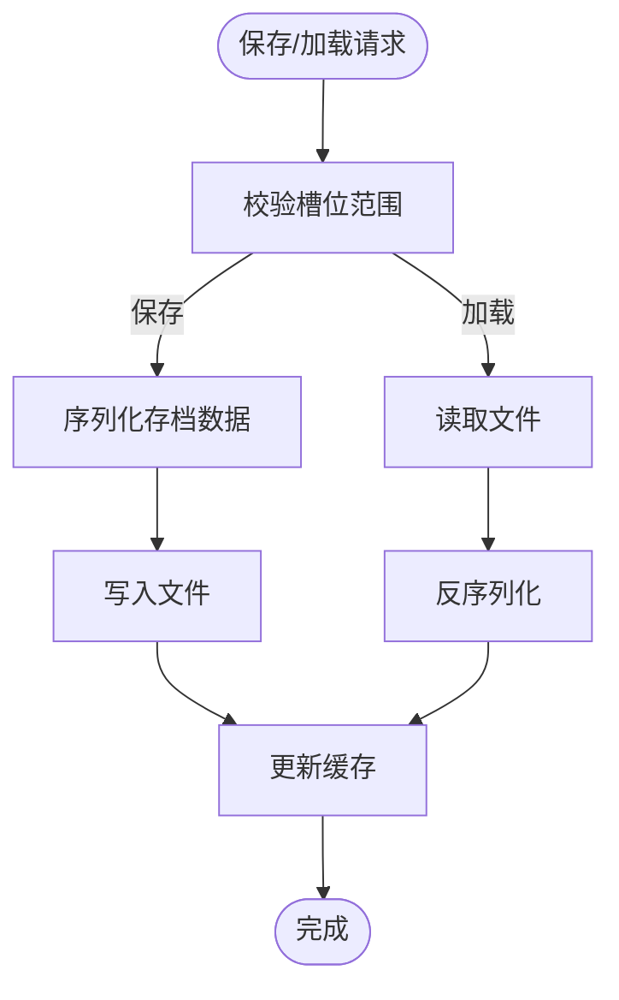
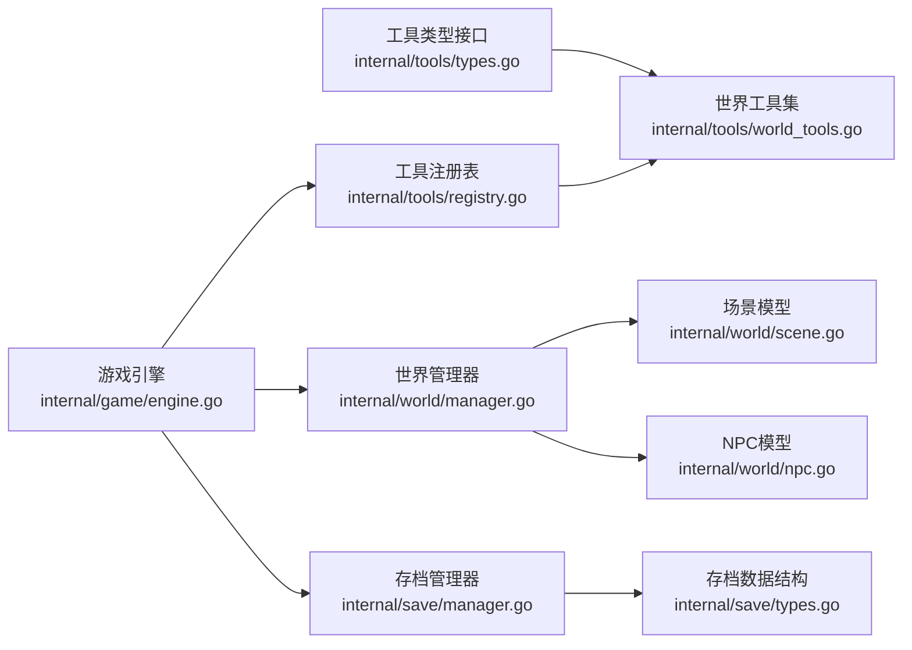

# 世界工具

<cite>
**本文引用的文件**
- [internal/world/manager.go](file://internal/world/manager.go)
- [internal/world/scene.go](file://internal/world/scene.go)
- [internal/world/npc.go](file://internal/world/npc.go)
- [internal/tools/world_tools.go](file://internal/tools/world_tools.go)
- [internal/tools/types.go](file://internal/tools/types.go)
- [internal/tools/registry.go](file://internal/tools/registry.go)
- [internal/game/engine.go](file://internal/game/engine.go)
- [internal/game/state.go](file://internal/game/state.go)
- [internal/game/events.go](file://internal/game/events.go)
- [internal/save/manager.go](file://internal/save/manager.go)
- [internal/save/types.go](file://internal/save/types.go)
- [cmd/start.go](file://cmd/start.go)
- [main.go](file://main.go)
</cite>

## 目录
1. [简介](#简介)
2. [项目结构](#项目结构)
3. [核心组件](#核心组件)
4. [架构总览](#架构总览)
5. [详细组件分析](#详细组件分析)
6. [依赖关系分析](#依赖关系分析)
7. [性能考虑](#性能考虑)
8. [故障排查指南](#故障排查指南)
9. [结论](#结论)
10. [附录](#附录)

## 简介
本文件面向“世界工具”的技术文档，系统性阐述CDND世界工具的功能与实现，涵盖场景切换、NPC管理、世界标志设置、计数器更新、环境效果管理、与场景系统的集成、数据持久化机制、权限控制、使用示例、错误处理与状态恢复、性能优化与大规模世界管理策略，以及与游戏引擎其他组件的协同工作机制。文档以代码为依据，辅以图示帮助不同背景读者理解。

## 项目结构
世界工具位于内部模块中，围绕“世界管理器”“场景模型”“NPC模型”“工具集”“游戏引擎”“存档系统”展开，形成清晰的分层与职责边界：
- internal/world：世界实体与管理
- internal/tools：工具注册与执行
- internal/game：引擎、状态、事件、LLM集成
- internal/save：存档管理与数据持久化
- cmd：CLI入口与启动流程

图表来源
- [internal/world/manager.go:1-294](file://internal/world/manager.go#L1-L294)
- [internal/world/scene.go:1-219](file://internal/world/scene.go#L1-L219)
- [internal/world/npc.go:1-231](file://internal/world/npc.go#L1-L231)
- [internal/tools/world_tools.go:1-330](file://internal/tools/world_tools.go#L1-L330)
- [internal/tools/registry.go:1-109](file://internal/tools/registry.go#L1-L109)
- [internal/tools/types.go:1-118](file://internal/tools/types.go#L1-L118)
- [internal/game/engine.go:1-797](file://internal/game/engine.go#L1-L797)
- [internal/game/state.go:1-236](file://internal/game/state.go#L1-L236)
- [internal/game/events.go:1-244](file://internal/game/events.go#L1-L244)
- [internal/save/manager.go:1-364](file://internal/save/manager.go#L1-L364)
- [internal/save/types.go:1-217](file://internal/save/types.go#L1-L217)
- [cmd/start.go:1-99](file://cmd/start.go#L1-L99)
- [main.go:1-8](file://main.go#L1-L8)

章节来源
- [internal/world/manager.go:1-294](file://internal/world/manager.go#L1-L294)
- [internal/world/scene.go:1-219](file://internal/world/scene.go#L1-L219)
- [internal/world/npc.go:1-231](file://internal/world/npc.go#L1-L231)
- [internal/tools/world_tools.go:1-330](file://internal/tools/world_tools.go#L1-L330)
- [internal/tools/registry.go:1-109](file://internal/tools/registry.go#L1-L109)
- [internal/tools/types.go:1-118](file://internal/tools/types.go#L1-L118)
- [internal/game/engine.go:1-797](file://internal/game/engine.go#L1-L797)
- [internal/game/state.go:1-236](file://internal/game/state.go#L1-L236)
- [internal/game/events.go:1-244](file://internal/game/events.go#L1-L244)
- [internal/save/manager.go:1-364](file://internal/save/manager.go#L1-L364)
- [internal/save/types.go:1-217](file://internal/save/types.go#L1-L217)
- [cmd/start.go:1-99](file://cmd/start.go#L1-L99)
- [main.go:1-8](file://main.go#L1-L8)

## 核心组件
- 世界管理器：集中管理场景与NPC，提供增删改查、场景链接、NPC生成/移除/移动等能力，并负责世界数据的导入导出。
- 场景模型：描述场景类型、环境信息（光照、地形、危险度）、出口、特性、物品、NPC列表等。
- NPC模型：描述NPC类型、态度、对话树、战斗属性、商人/任务/训练师等扩展信息。
- 世界工具集：提供移动到场景、生成/移除NPC、设置/获取世界标志等工具，统一通过工具注册表执行。
- 游戏引擎：整合LLM、规则引擎、存档系统与世界管理器，驱动“代理循环”（Agentic Loop），分发事件，维护状态。
- 存档系统：提供多槽位JSON存档、快速保存/加载、缓存、导入导出等能力，支撑世界状态持久化。

章节来源
- [internal/world/manager.go:10-294](file://internal/world/manager.go#L10-L294)
- [internal/world/scene.go:19-219](file://internal/world/scene.go#L19-L219)
- [internal/world/npc.go:70-231](file://internal/world/npc.go#L70-L231)
- [internal/tools/world_tools.go:8-330](file://internal/tools/world_tools.go#L8-L330)
- [internal/game/engine.go:22-797](file://internal/game/engine.go#L22-L797)
- [internal/save/manager.go:20-364](file://internal/save/manager.go#L20-L364)

## 架构总览
世界工具与引擎的协作遵循“工具定义—LLM推理—工具执行—事件分发—状态更新—存档”的闭环。世界工具通过工具注册表暴露给LLM，LLM根据上下文决定调用哪些工具；工具执行后由引擎生成叙述并分发事件，同时更新游戏状态与世界标志/计数器。

图表来源
- [internal/game/engine.go:195-316](file://internal/game/engine.go#L195-L316)
- [internal/tools/registry.go:37-57](file://internal/tools/registry.go#L37-L57)
- [internal/world/manager.go:25-294](file://internal/world/manager.go#L25-L294)
- [internal/game/state.go:110-134](file://internal/game/state.go#L110-L134)
- [internal/save/manager.go:57-86](file://internal/save/manager.go#L57-L86)

章节来源
- [internal/game/engine.go:195-316](file://internal/game/engine.go#L195-L316)
- [internal/tools/registry.go:37-57](file://internal/tools/registry.go#L37-L57)
- [internal/world/manager.go:25-294](file://internal/world/manager.go#L25-L294)
- [internal/game/state.go:110-134](file://internal/game/state.go#L110-L134)
- [internal/save/manager.go:57-86](file://internal/save/manager.go#L57-L86)

## 详细组件分析

### 世界管理器（Manager）
- 职责：集中管理场景与NPC，提供线程安全的增删改查、场景链接、NPC生成/移除/移动、世界数据导入导出。
- 关键能力：
  - 场景管理：AddScene、GetScene、RemoveScene、ListScenes、Import、Export
  - NPC管理：AddNPC、GetNPC、RemoveNPC、ListNPCs
  - 场景联动：LinkScenes（双向）、LinkScenesOneWay（单向）、GetConnectedScenes
  - NPC生命周期：SpawnNPC、DespawnNPC、MoveNPC
- 并发模型：读写锁保护场景与NPC映射，保证高并发下的数据一致性。
- 数据持久化：Export/Import用于引擎保存/加载世界数据。

图表来源
- [internal/world/manager.go:10-294](file://internal/world/manager.go#L10-L294)
- [internal/world/scene.go:19-219](file://internal/world/scene.go#L19-L219)
- [internal/world/npc.go:70-231](file://internal/world/npc.go#L70-L231)

章节来源
- [internal/world/manager.go:10-294](file://internal/world/manager.go#L10-L294)

### 场景模型（Scene）
- 场景类型：城镇、地下城、荒野、建筑、房间、战斗场景。
- 环境信息：光照等级（明亮/昏暗/黑暗）、地形类型（普通/困难地形/水域/岩浆/冰面/悬崖）、危险等级（1-10）。
- 出口/特性：支持可见/锁定/钥匙/单向等属性；特性可互动且可复用。
- 物品/NPC：场景内物品与NPC的ID列表，便于快速检索。
- 自定义属性：Properties支持扩展字段。

图表来源
- [internal/world/scene.go:19-219](file://internal/world/scene.go#L19-L219)

章节来源
- [internal/world/scene.go:19-219](file://internal/world/scene.go#L19-L219)

### NPC模型（NPC）
- 类型：普通、商人、任务发布者、敌人、盟友、训练师。
- 态度：敌对/不友好/中立/友好/同盟，支持改善/恶化。
- 对话树：支持条件、效果、可重复、递归选项树。
- 战斗属性：HP/MaxHP/AC/Speed/能力值/技能/动作/状态。
- 商人/任务/训练师扩展：商品列表、买卖倍率、可发布的任务ID等。
- 状态管理：TakeDamage/Heal/IsDead/HasCondition/AddCondition/RemoveCondition。

图表来源
- [internal/world/npc.go:70-231](file://internal/world/npc.go#L70-L231)

章节来源
- [internal/world/npc.go:70-231](file://internal/world/npc.go#L70-L231)

### 世界工具集（World Tools）
- 工具类型：
  - 移动到场景：设置当前场景、访问标志、场景转换计数器。
  - 生成NPC：在当前场景标记NPC出现。
  - 移除NPC：标记NPC离开。
  - 设置/获取世界标志：通过状态访问接口更新/查询布尔标志。
- 参数Schema：每个工具定义JSON Schema参数，便于LLM调用。
- 执行流程：参数校验→状态更新→生成叙述→返回结果。

图表来源
- [internal/tools/world_tools.go:8-330](file://internal/tools/world_tools.go#L8-L330)
- [internal/tools/registry.go:37-57](file://internal/tools/registry.go#L37-L57)
- [internal/game/state.go:110-134](file://internal/game/state.go#L110-L134)

章节来源
- [internal/tools/world_tools.go:8-330](file://internal/tools/world_tools.go#L8-L330)
- [internal/tools/registry.go:37-57](file://internal/tools/registry.go#L37-L57)
- [internal/game/state.go:110-134](file://internal/game/state.go#L110-L134)

### 游戏引擎（Engine）
- 组成：状态、LLM提供者、提示构建器、规则引擎、世界管理器、存档管理器、工具注册表、事件分发器。
- 启动：创建各子系统，注册工具，初始化事件分发器。
- 处理流程：构建系统提示与历史上下文→LLM推理→工具调用→事件分发→状态更新→可选存档。
- 事件系统：统一事件类型与分发器，支持订阅/取消订阅/同步分发/队列处理。
- 存档：保存/加载时合并/替换状态字段，导入导出世界数据。

图表来源
- [internal/game/engine.go:22-797](file://internal/game/engine.go#L22-L797)
- [internal/game/state.go:13-236](file://internal/game/state.go#L13-L236)
- [internal/game/events.go:135-244](file://internal/game/events.go#L135-L244)

章节来源
- [internal/game/engine.go:22-797](file://internal/game/engine.go#L22-L797)
- [internal/game/state.go:13-236](file://internal/game/state.go#L13-L236)
- [internal/game/events.go:135-244](file://internal/game/events.go#L135-L244)

### 存档系统（Save Manager）
- 多槽位JSON存档：1-10号槽位，自动创建目录，支持快速保存/加载。
- 缓存：内存缓存提高频繁读取性能。
- 导入/导出：支持文件级导入导出，便于备份与迁移。
- 元数据统计：统计总存档数、总游戏时间、最近游玩时间。

图表来源
- [internal/save/manager.go:57-122](file://internal/save/manager.go#L57-L122)
- [internal/save/manager.go:289-312](file://internal/save/manager.go#L289-L312)
- [internal/save/types.go:110-217](file://internal/save/types.go#L110-L217)

章节来源
- [internal/save/manager.go:57-122](file://internal/save/manager.go#L57-L122)
- [internal/save/manager.go:289-312](file://internal/save/manager.go#L289-L312)
- [internal/save/types.go:110-217](file://internal/save/types.go#L110-L217)

## 依赖关系分析
- 世界工具依赖游戏状态接口（StateAccessor），通过接口解耦工具与引擎，确保工具可在不同上下文中复用。
- 工具注册表负责工具的注册、权限控制与执行，支持按阶段限制工具使用。
- 引擎聚合世界管理器与存档管理器，实现世界状态与持久化的双向同步。
- 场景与NPC模型作为数据载体，被世界管理器与存档系统共同使用。

图表来源
- [internal/tools/types.go:10-22](file://internal/tools/types.go#L10-L22)
- [internal/tools/world_tools.go:8-330](file://internal/tools/world_tools.go#L8-L330)
- [internal/tools/registry.go:9-109](file://internal/tools/registry.go#L9-L109)
- [internal/game/engine.go:22-797](file://internal/game/engine.go#L22-L797)
- [internal/world/manager.go:10-294](file://internal/world/manager.go#L10-L294)
- [internal/world/scene.go:19-219](file://internal/world/scene.go#L19-L219)
- [internal/world/npc.go:70-231](file://internal/world/npc.go#L70-L231)
- [internal/save/manager.go:20-364](file://internal/save/manager.go#L20-L364)
- [internal/save/types.go:110-217](file://internal/save/types.go#L110-L217)

章节来源
- [internal/tools/types.go:10-22](file://internal/tools/types.go#L10-L22)
- [internal/tools/world_tools.go:8-330](file://internal/tools/world_tools.go#L8-L330)
- [internal/tools/registry.go:9-109](file://internal/tools/registry.go#L9-L109)
- [internal/game/engine.go:22-797](file://internal/game/engine.go#L22-L797)
- [internal/world/manager.go:10-294](file://internal/world/manager.go#L10-L294)
- [internal/world/scene.go:19-219](file://internal/world/scene.go#L19-L219)
- [internal/world/npc.go:70-231](file://internal/world/npc.go#L70-L231)
- [internal/save/manager.go:20-364](file://internal/save/manager.go#L20-L364)
- [internal/save/types.go:110-217](file://internal/save/types.go#L110-L217)

## 性能考虑
- 并发安全：世界管理器使用读写锁，避免热点竞争；工具执行与状态更新尽量短小原子。
- 缓存策略：存档管理器内置缓存，减少频繁IO；建议在高频场景下预热常用存档。
- 数据结构：场景与NPC均使用map存储，ID查找O(1)；场景NPC列表采用切片，便于遍历。
- LLM调用：代理循环限制最大迭代次数，避免无限工具调用导致的性能问题。
- 大规模世界管理：
  - 分批导入/导出世界数据，避免一次性加载过多场景/NPC。
  - 使用场景链接的稀疏表示，仅在需要时加载目标场景。
  - 对NPC对话树进行懒加载或分段缓存，降低内存占用。

## 故障排查指南
- 工具执行错误：
  - 参数校验失败：检查工具参数Schema与传入参数类型。
  - 状态不可用：确认引擎已初始化且状态引用有效。
  - 工具不存在：检查工具是否已注册。
- 存档问题：
  - 文件读写失败：检查存档目录权限与磁盘空间。
  - 数据解析失败：确认存档版本兼容性与JSON格式。
- 世界状态异常：
  - 场景/NPC不存在：确认ID正确且已导入。
  - 场景链接失败：检查双向/单向链接参数与目标场景存在性。
- 事件分发：
  - 事件未触发：确认订阅关系与事件类型匹配。
- LLM调用：
  - 工具调用超限：检查代理循环最大迭代次数与工具链复杂度。

章节来源
- [internal/tools/world_tools.go:44-80](file://internal/tools/world_tools.go#L44-L80)
- [internal/tools/world_tools.go:122-160](file://internal/tools/world_tools.go#L122-L160)
- [internal/tools/world_tools.go:194-219](file://internal/tools/world_tools.go#L194-L219)
- [internal/tools/world_tools.go:254-279](file://internal/tools/world_tools.go#L254-L279)
- [internal/tools/world_tools.go:309-329](file://internal/tools/world_tools.go#L309-L329)
- [internal/save/manager.go:57-86](file://internal/save/manager.go#L57-L86)
- [internal/save/manager.go:88-122](file://internal/save/manager.go#L88-L122)
- [internal/game/engine.go:314-316](file://internal/game/engine.go#L314-L316)

## 结论
世界工具通过明确的分层设计与严格的接口约束，实现了场景切换、NPC管理、世界标志与计数器更新、环境效果管理与事件驱动的完整闭环。配合存档系统与引擎的事件分发机制，能够稳定支撑中小型到中大型世界的运行与持久化。未来可在工具权限细化、大规模世界分片加载、对话树缓存与LLM调用优化等方面持续演进。

## 附录

### 使用示例与典型场景
- 场景切换：
  - 用户输入“前往市场”，LLM识别工具“move_to_scene”，设置当前场景为市场，增加场景访问标志与转换计数器。
- NPC管理：
  - “生成商人”触发“spawn_npc”，在当前场景标记NPC出现；“移除NPC”触发“remove_npc”，标记NPC离开。
- 世界标志与计数器：
  - “设置标记：完成任务A”触发“set_flag”，后续对话/事件可基于该标志调整剧情。
  - “场景转换计数器+1”用于统计旅行进度或触发特定事件。
- 环境效果管理：
  - 通过场景特性与自定义属性（Properties）描述环境变化，如“陷阱激活”“光源开启”。

章节来源
- [internal/tools/world_tools.go:44-80](file://internal/tools/world_tools.go#L44-L80)
- [internal/tools/world_tools.go:122-160](file://internal/tools/world_tools.go#L122-L160)
- [internal/tools/world_tools.go:194-219](file://internal/tools/world_tools.go#L194-L219)
- [internal/tools/world_tools.go:254-279](file://internal/tools/world_tools.go#L254-L279)
- [internal/tools/world_tools.go:309-329](file://internal/tools/world_tools.go#L309-L329)
- [internal/world/scene.go:203-218](file://internal/world/scene.go#L203-L218)

### 权限控制说明
- 工具注册表支持按游戏阶段限制工具使用（例如探索阶段允许场景切换，战斗阶段限制某些工具）。
- 世界工具通过状态访问接口更新标志/计数器，避免直接访问引擎内部状态。
- 建议在工具层面增加更细粒度的权限校验（如场景访问权限、NPC交互限制、世界修改权限），以满足复杂剧本需求。

章节来源
- [internal/tools/registry.go:83-97](file://internal/tools/registry.go#L83-L97)
- [internal/tools/world_tools.go:44-80](file://internal/tools/world_tools.go#L44-L80)
- [internal/game/state.go:110-134](file://internal/game/state.go#L110-L134)

### 数据持久化机制
- 保存：引擎将状态与世界数据打包为存档，序列化后写入文件，更新缓存。
- 加载：读取文件并反序列化，填充状态字段，导入世界数据。
- 增量更新：当前实现为全量导入导出；可扩展为基于时间戳的增量同步。
- 冲突解决：建议引入版本号与合并策略，避免多端同时编辑导致的数据冲突。

章节来源
- [internal/game/engine.go:152-178](file://internal/game/engine.go#L152-L178)
- [internal/game/engine.go:101-150](file://internal/game/engine.go#L101-L150)
- [internal/save/manager.go:57-86](file://internal/save/manager.go#L57-L86)
- [internal/save/manager.go:88-122](file://internal/save/manager.go#L88-L122)

### 与游戏引擎其他组件的协调机制
- LLM集成：引擎构建系统提示与历史上下文，将工具定义传递给LLM，接收工具调用后执行。
- 事件系统：工具执行后分发事件，UI或其他监听者可据此更新界面或触发后续逻辑。
- 规则引擎：与工具执行结果结合，影响角色状态与战斗流程。
- CLI入口：启动命令创建引擎、角色创建TUI与游戏TUI，串联整个生命周期。

章节来源
- [internal/game/engine.go:195-316](file://internal/game/engine.go#L195-L316)
- [internal/game/events.go:135-244](file://internal/game/events.go#L135-L244)
- [cmd/start.go:29-99](file://cmd/start.go#L29-L99)
- [main.go:1-8](file://main.go#L1-L8)