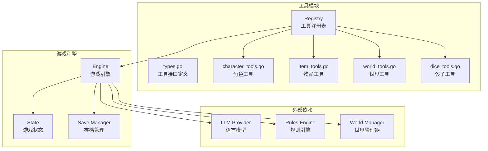
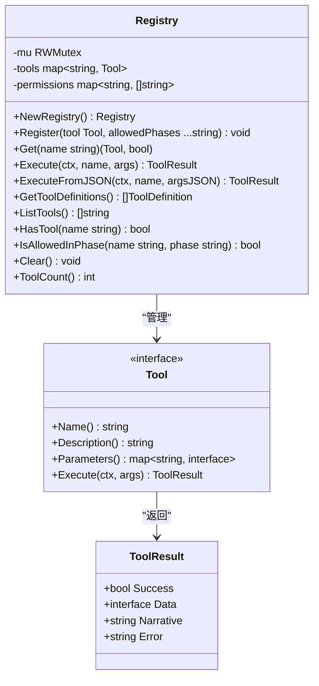
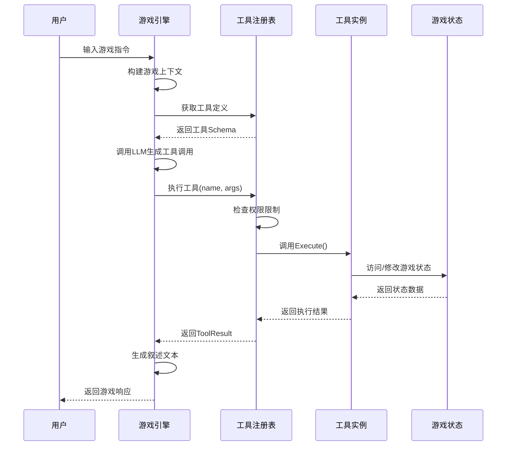
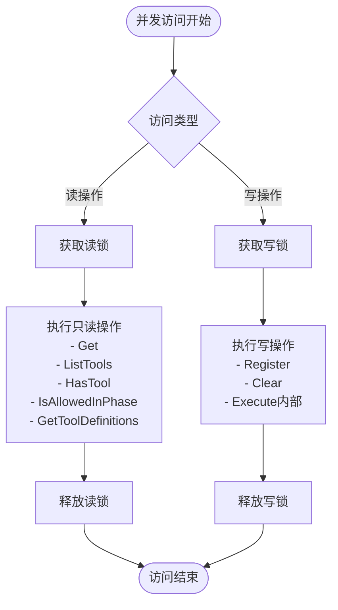
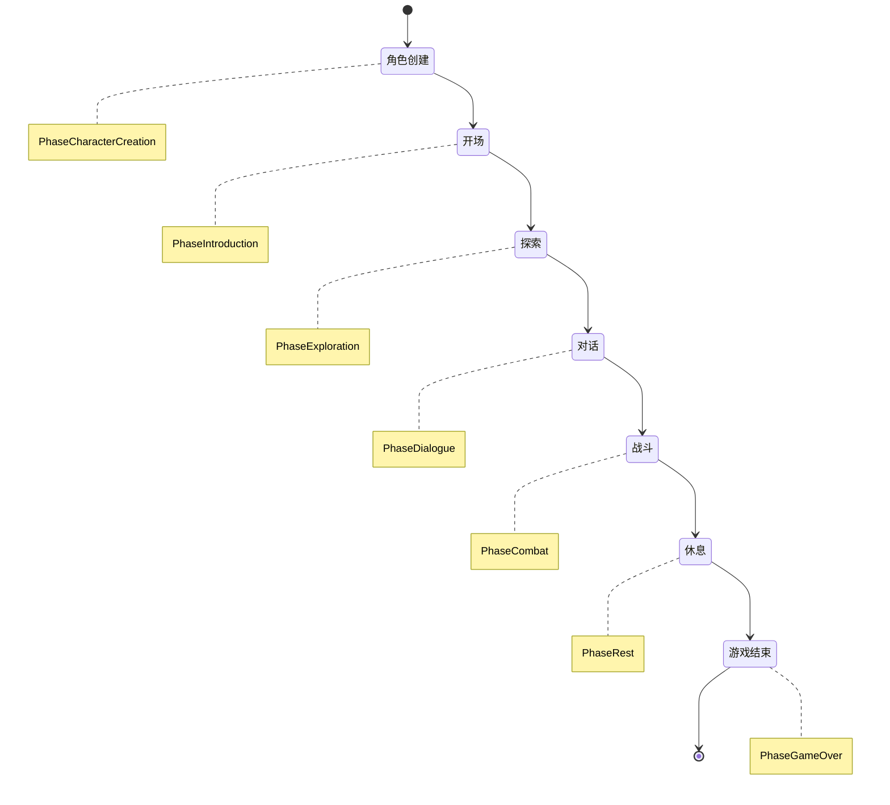
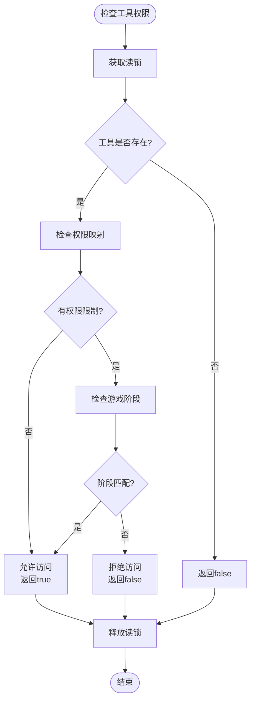
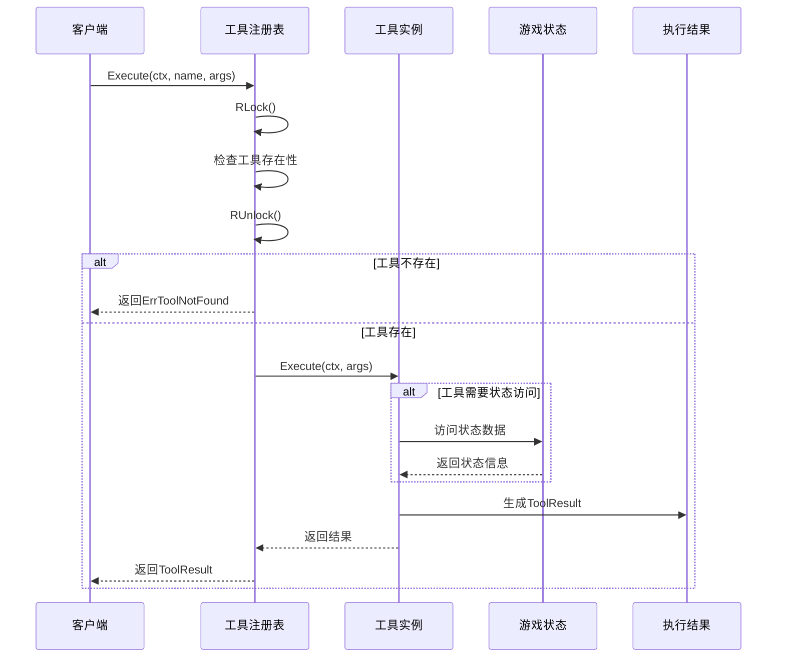
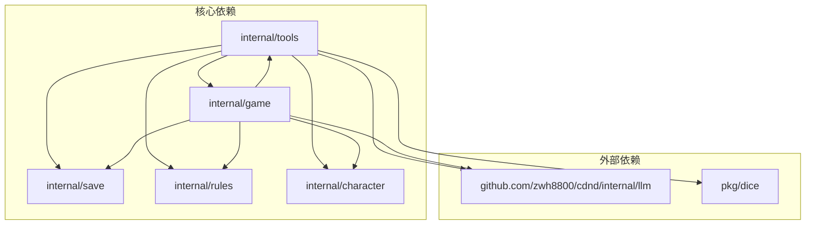

# 工具注册表

<cite>
**本文档引用的文件**
- [internal/tools/registry.go](file://internal/tools/registry.go)
- [internal/tools/types.go](file://internal/tools/types.go)
- [internal/tools/character_tools.go](file://internal/tools/character_tools.go)
- [internal/tools/item_tools.go](file://internal/tools/item_tools.go)
- [internal/tools/world_tools.go](file://internal/tools/world_tools.go)
- [internal/tools/dice_tools.go](file://internal/tools/dice_tools.go)
- [internal/game/engine.go](file://internal/game/engine.go)
- [internal/game/state.go](file://internal/game/state.go)
- [internal/save/types.go](file://internal/save/types.go)
</cite>

## 目录
1. [简介](#简介)
2. [项目结构](#项目结构)
3. [核心组件](#核心组件)
4. [架构概览](#架构概览)
5. [详细组件分析](#详细组件分析)
6. [依赖分析](#依赖分析)
7. [性能考虑](#性能考虑)
8. [故障排除指南](#故障排除指南)
9. [结论](#结论)
10. [附录](#附录)

## 简介

工具注册表是CDND（由LLM驱动的D&D命令行游戏）的核心组件之一，负责管理所有游戏工具的注册、发现、执行和权限控制。该系统采用并发安全设计，支持多线程环境下的工具管理，并提供了灵活的权限控制系统来限制工具在不同游戏阶段的使用。

工具注册表不仅管理工具的生命周期，还通过统一的接口为游戏引擎提供工具执行能力，实现了工具与游戏状态的解耦。系统支持多种类型的工具，包括角色管理、物品管理、世界交互、骰子投掷等功能，并通过JSON Schema定义工具的参数规范。

## 项目结构

CDND项目采用模块化的架构设计，工具注册表位于`internal/tools`包中，与游戏引擎紧密集成：



**图表来源**
- [internal/tools/registry.go:1-132](file://internal/tools/registry.go#L1-L132)
- [internal/game/engine.go:22-56](file://internal/game/engine.go#L22-L56)

**章节来源**
- [internal/tools/registry.go:1-132](file://internal/tools/registry.go#L1-L132)
- [internal/game/engine.go:22-56](file://internal/game/engine.go#L22-L56)

## 核心组件

### Registry结构体

工具注册表的核心是一个线程安全的结构体，包含以下关键组件：

- **工具存储**：使用`map[string]Tool`存储已注册的工具
- **权限映射**：使用`map[string][]string`记录工具允许使用的游戏阶段
- **读写锁**：使用`sync.RWMutex`确保并发安全



**图表来源**
- [internal/tools/registry.go:10-15](file://internal/tools/registry.go#L10-L15)
- [internal/tools/types.go:24-42](file://internal/tools/types.go#L24-L42)

### 工具接口体系

系统定义了统一的工具接口，确保所有工具具有一致的行为模式：

- **Name()**：返回工具的唯一标识符
- **Description()**：返回工具的描述信息
- **Parameters()**：返回JSON Schema格式的参数定义
- **Execute()**：执行工具的核心逻辑

**章节来源**
- [internal/tools/types.go:24-34](file://internal/tools/types.go#L24-L34)
- [internal/tools/types.go:57-67](file://internal/tools/types.go#L57-L67)

## 架构概览

工具注册表在整个CDND系统中扮演着关键的协调角色，连接着LLM、游戏引擎、规则系统和世界管理器：



**图表来源**
- [internal/game/engine.go:195-316](file://internal/game/engine.go#L195-L316)
- [internal/tools/registry.go:43-54](file://internal/tools/registry.go#L43-L54)

## 详细组件分析

### 并发安全机制

工具注册表采用了精心设计的并发安全机制，确保在多线程环境下的一致性和安全性：

#### 读写锁策略



**图表来源**
- [internal/tools/registry.go:25-32](file://internal/tools/registry.go#L25-L32)
- [internal/tools/registry.go:35-40](file://internal/tools/registry.go#L35-L40)

#### 锁粒度优化

系统采用了细粒度的锁控制策略：
- **读操作**使用`RWMutex.RLock()`，允许多个读操作同时进行
- **写操作**使用`RWMutex.Lock()`，确保独占访问
- **执行工具**时先获取读锁检查工具存在性，再释放读锁执行工具，最后获取读锁返回结果

这种设计避免了长时间持有写锁，提高了并发性能。

**章节来源**
- [internal/tools/registry.go:25-54](file://internal/tools/registry.go#L25-L54)

### 权限控制系统

工具注册表实现了基于游戏阶段的权限控制机制，确保工具只能在适当的时机使用：

#### 游戏阶段枚举



**图表来源**
- [internal/save/types.go:14-22](file://internal/save/types.go#L14-L22)

#### 权限检查算法



**图表来源**
- [internal/tools/registry.go:98-116](file://internal/tools/registry.go#L98-L116)

**章节来源**
- [internal/tools/registry.go:98-116](file://internal/tools/registry.go#L98-L116)
- [internal/save/types.go:14-44](file://internal/save/types.go#L14-L44)

### 工具存储结构

工具注册表使用两级映射结构来管理工具：

#### 主要数据结构

```mermaid
graph LR
subgraph "工具注册表"
ToolsMap[tools: map[string]Tool]
PermissionsMap[permissions: map[string][]string]
end
subgraph "工具存储"
Tool1["工具实例1"]
Tool2["工具实例2"]
ToolN["工具实例N"]
end
subgraph "权限存储"
Phase1["允许阶段1"]
Phase2["允许阶段2"]
PhaseStar["* (所有阶段)"]
end
ToolsMap --> Tool1
ToolsMap --> Tool2
ToolsMap --> ToolN
PermissionsMap --> Phase1
PermissionsMap --> Phase2
PermissionsMap --> PhaseStar
```

**图表来源**
- [internal/tools/registry.go:11-14](file://internal/tools/registry.go#L11-L14)

#### 工具分类

系统将工具分为四大类别，每类工具都有特定的功能领域：

**章节来源**
- [internal/tools/registry.go:11-14](file://internal/tools/registry.go#L11-L14)

### 工具执行流程

工具执行是一个复杂的过程，涉及参数解析、权限检查、状态访问和结果生成：



**图表来源**
- [internal/tools/registry.go:43-54](file://internal/tools/registry.go#L43-L54)

**章节来源**
- [internal/tools/registry.go:43-65](file://internal/tools/registry.go#L43-L65)

## 依赖分析

工具注册表与系统的其他组件形成了清晰的依赖关系：



**图表来源**
- [internal/game/engine.go:17-19](file://internal/game/engine.go#L17-L19)
- [internal/tools/dice_tools.go:7-9](file://internal/tools/dice_tools.go#L7-L9)

### 依赖关系特点

1. **单向依赖**：工具注册表主要依赖于游戏状态和规则引擎，但不反向依赖于游戏引擎
2. **接口解耦**：通过接口抽象，降低了组件间的耦合度
3. **状态访问**：工具通过StateAccessor接口访问游戏状态，实现了状态管理的封装

**章节来源**
- [internal/game/engine.go:17-19](file://internal/game/engine.go#L17-L19)
- [internal/tools/types.go:10-22](file://internal/tools/types.go#L10-L22)

## 性能考虑

工具注册表在设计时充分考虑了性能优化：

### 并发性能优化

1. **读写分离**：使用`RWMutex`实现读多写少场景的优化
2. **锁粒度控制**：最小化锁持有时间，避免长时间阻塞
3. **批量操作**：提供批量获取工具定义和列出工具名称的方法

### 内存管理

1. **零拷贝设计**：工具定义通过指针传递，避免不必要的数据复制
2. **延迟初始化**：权限映射仅在需要时创建
3. **缓存友好**：工具存储采用连续内存布局

### 执行效率

1. **快速路径**：工具存在性检查和权限检查都是O(1)操作
2. **参数解析**：JSON参数解析仅在需要时进行
3. **错误处理**：快速失败机制减少不必要的计算

## 故障排除指南

### 常见问题及解决方案

#### 工具不存在错误

**症状**：执行工具时返回"工具不存在"错误
**原因**：工具名称拼写错误或工具未正确注册
**解决方法**：
1. 检查工具名称是否正确
2. 确认工具已在引擎初始化时注册
3. 使用`HasTool()`方法验证工具存在性

#### 权限不足错误

**症状**：工具执行被拒绝
**原因**：工具在当前游戏阶段不允许使用
**解决方法**：
1. 检查当前游戏阶段
2. 确认工具的权限配置
3. 调整游戏阶段或修改工具权限

#### 状态访问错误

**症状**：工具执行过程中出现状态不可用错误
**原因**：工具依赖的游戏状态为空
**解决方法**：
1. 确保游戏引擎已正确初始化
2. 检查角色创建和场景设置
3. 验证状态访问接口的实现

**章节来源**
- [internal/tools/types.go:111-117](file://internal/tools/types.go#L111-L117)

### 调试技巧

1. **日志记录**：在工具执行前后添加详细的日志信息
2. **状态检查**：定期检查游戏状态的完整性
3. **并发测试**：使用压力测试验证并发安全性
4. **内存监控**：监控工具注册表的内存使用情况

## 结论

工具注册表作为CDND系统的核心组件，成功实现了以下目标：

1. **并发安全**：通过精心设计的锁机制确保多线程环境下的数据一致性
2. **权限控制**：基于游戏阶段的灵活权限管理机制
3. **扩展性**：清晰的接口设计支持新工具的快速集成
4. **性能优化**：读写分离和锁粒度优化提升了系统性能
5. **错误处理**：完善的错误处理机制提高了系统的稳定性

该系统为CDND提供了强大的工具管理能力，支持复杂的D&D游戏场景，为玩家提供了丰富的交互体验。通过模块化的设计和清晰的接口定义，系统具备良好的可维护性和可扩展性。

## 附录

### API接口规范

#### Registry接口

| 方法 | 参数 | 返回值 | 描述 |
|------|------|--------|------|
| NewRegistry | 无 | Registry | 创建新的工具注册表实例 |
| Register | tool: Tool, allowedPhases: ...string | void | 注册工具及其权限限制 |
| Get | name: string | (Tool, bool) | 获取指定名称的工具 |
| Execute | ctx: context.Context, name: string, args: map[string]interface{} | (*ToolResult, error) | 执行工具并返回结果 |
| ExecuteFromJSON | ctx: context.Context, name: string, argsJSON: string | (*ToolResult, error) | 从JSON字符串执行工具 |
| GetToolDefinitions | 无 | []*ToolDefinition | 获取所有工具的定义 |
| ListTools | 无 | []string | 列出所有工具名称 |
| HasTool | name: string | bool | 检查工具是否存在 |
| IsAllowedInPhase | name: string, phase: string | bool | 检查工具在指定阶段是否允许 |
| Clear | 无 | void | 清除所有工具 |
| ToolCount | 无 | int | 返回工具数量 |

#### 工具接口

| 方法 | 参数 | 返回值 | 描述 |
|------|------|--------|------|
| Name | 无 | string | 返回工具名称 |
| Description | 无 | string | 返回工具描述 |
| Parameters | 无 | map[string]interface{} | 返回JSON Schema参数定义 |
| Execute | ctx: context.Context, args: map[string]interface{} | (*ToolResult, error) | 执行工具逻辑 |

### 使用示例

#### 基本工具注册

```go
// 创建工具注册表
registry := tools.NewRegistry()

// 注册工具（允许在所有阶段使用）
registry.Register(tools.NewRollDiceTool())

// 注册工具（仅允许在探索和战斗阶段使用）
registry.Register(tools.NewDealDamageTool(state), 
    save.PhaseExploration.String(), 
    save.PhaseCombat.String())
```

#### 工具执行

```go
// 执行工具
result, err := registry.Execute(context.Background(), "roll_dice", map[string]interface{}{
    "notation": "1d20+5",
})

if err != nil {
    // 处理错误
    log.Printf("工具执行失败: %v", err)
    return
}

// 处理结果
if result.Success {
    log.Printf("工具执行成功: %s", result.Narrative)
} else {
    log.Printf("工具执行失败: %s", result.Error)
}
```

#### 权限检查

```go
// 检查工具权限
if registry.IsAllowedInPhase("deal_damage", state.GetPhase().String()) {
    // 工具可以使用
    result, _ := registry.Execute(ctx, "deal_damage", args)
} else {
    // 工具不允许使用
    log.Printf("工具在当前阶段不可用")
}
```