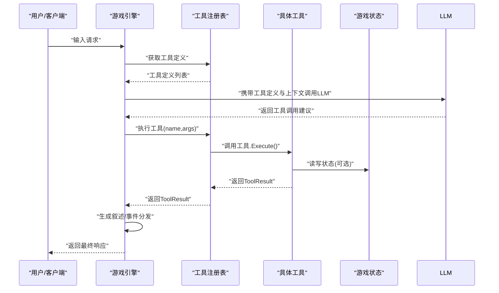
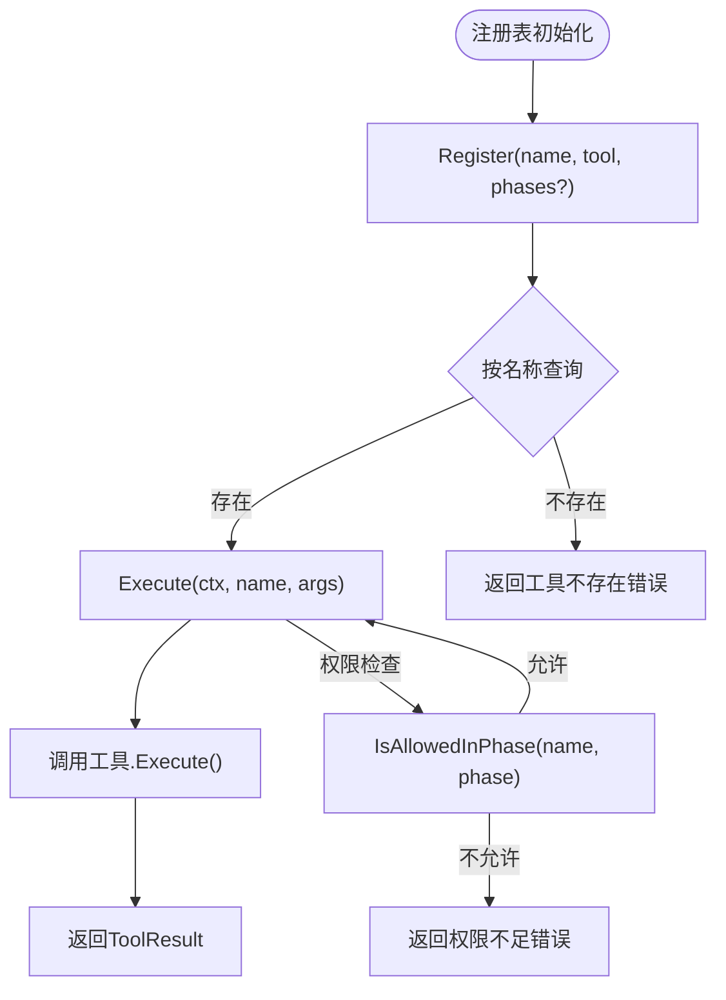
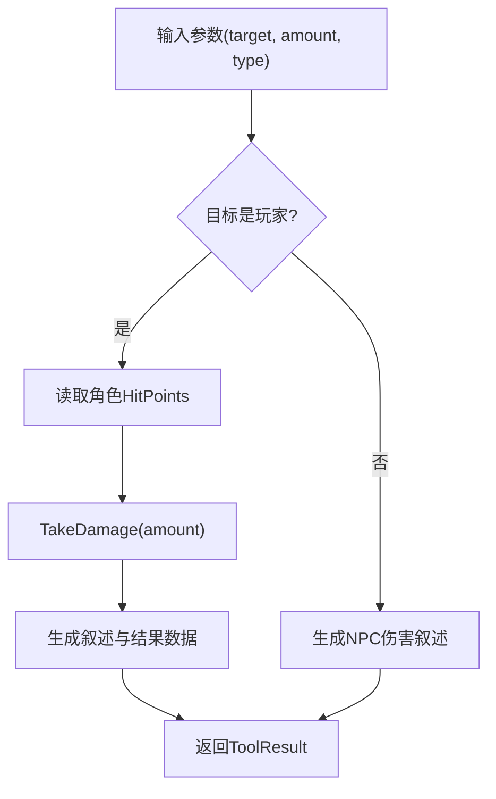
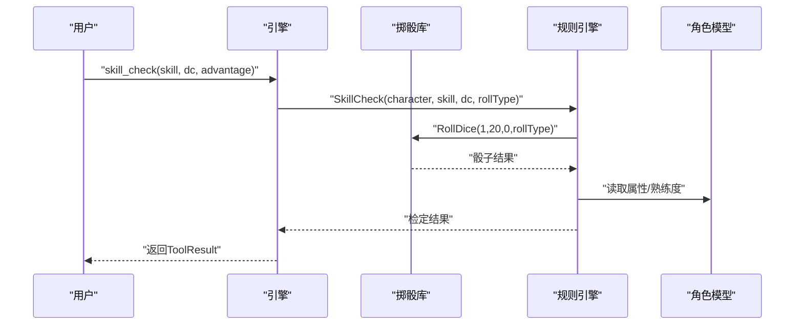
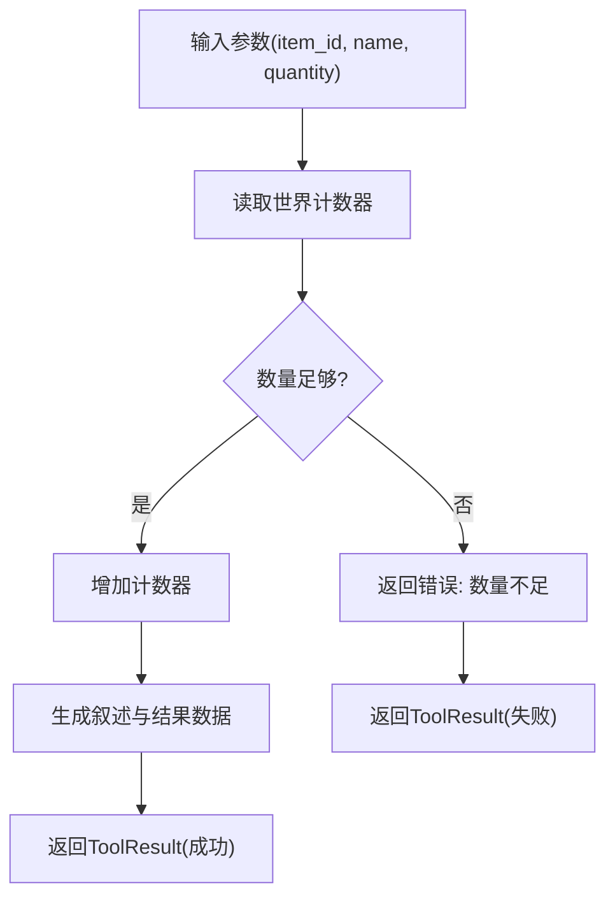
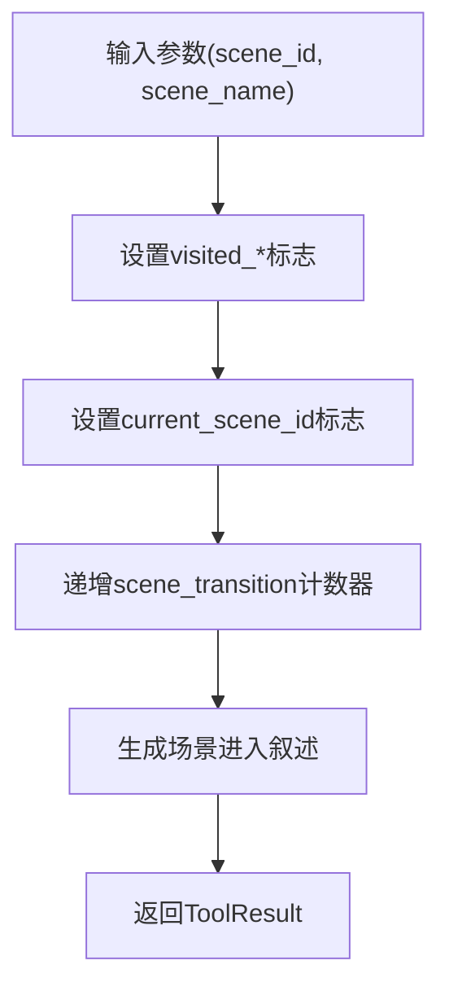
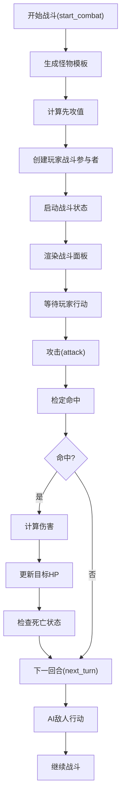
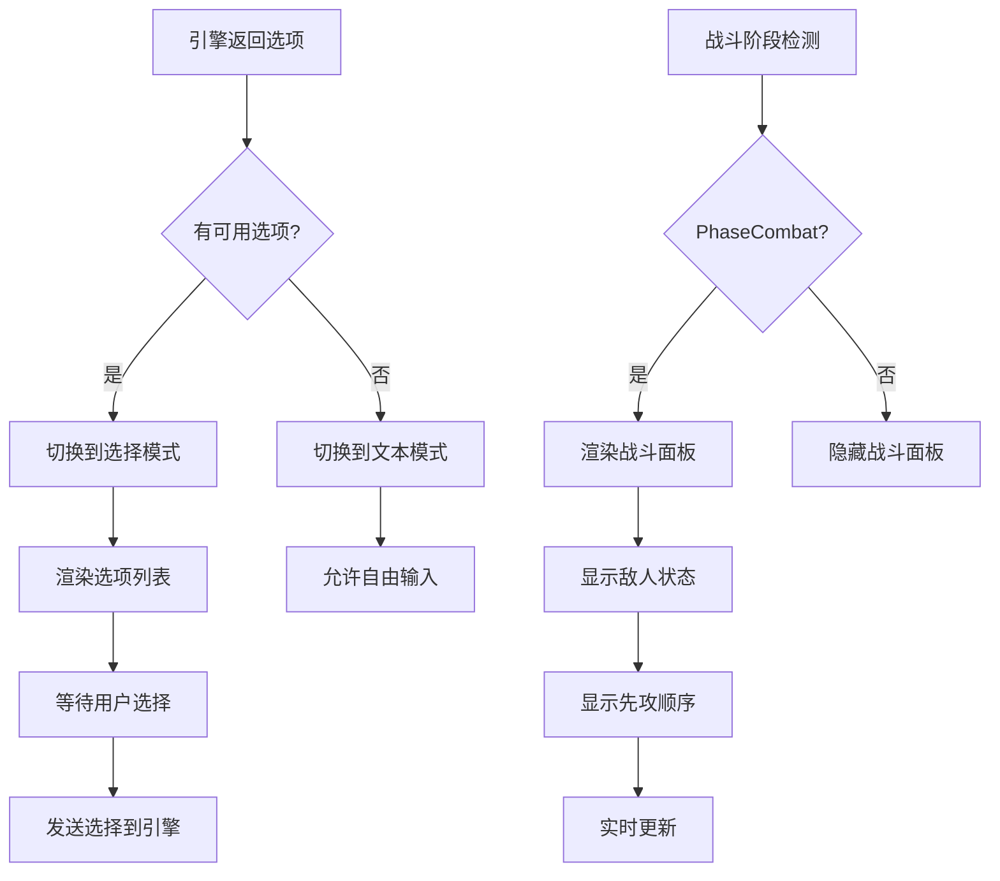
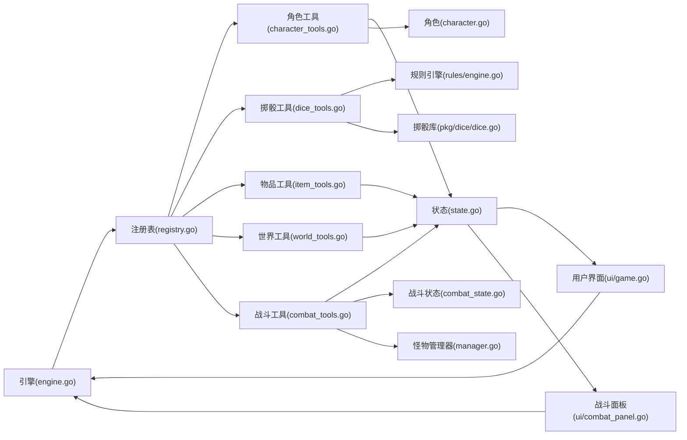

# 工具系统

<cite>
**本文引用的文件**
- [application/tools/registry.go](file://application/tools/registry.go)
- [application/tools/types.go](file://application/tools/types.go)
- [application/tools/character_tools.go](file://application/tools/character_tools.go)
- [application/tools/dice_tools.go](file://application/tools/dice_tools.go)
- [application/tools/item_tools.go](file://application/tools/item_tools.go)
- [application/tools/world_tools.go](file://application/tools/world_tools.go)
- [application/tools/combat_tools.go](file://application/tools/combat_tools.go)
- [domain/combat/combat_state.go](file://domain/combat/combat_state.go)
- [domain/monster/manager.go](file://domain/monster/manager.go)
- [interface/ui/combat_panel.go](file://interface/ui/combat_panel.go)
- [interface/ui/game.go](file://interface/ui/game.go)
</cite>

## 更新摘要
**所做更改**
- 新增全面的工具定义管理与结构化结果格式化
- 改进工具执行跟踪与详细的叙事生成机制
- 增强工具注册表的权限控制与并发安全性
- 完善工具错误处理与成功/失败报告系统
- 优化工具结果的数据结构与统一格式化

## 目录
1. [简介](#简介)
2. [项目结构](#项目结构)
3. [核心组件](#核心组件)
4. [架构概览](#架构概览)
5. [详细组件分析](#详细组件分析)
6. [依赖分析](#依赖分析)
7. [性能考虑](#性能考虑)
8. [故障排除指南](#故障排除指南)
9. [结论](#结论)
10. [附录](#附录)

## 简介
本文件为 CDND 工具系统的完整技术文档，涵盖工具调用机制的设计原理与实现细节，包括工具注册表、参数验证、权限控制与结果处理。文档详细记录了内置工具的功能与实现，包括角色工具、掷骰工具、物品工具、世界工具和战斗工具的具体用法；阐述了工具系统的扩展机制，允许开发者注册自定义工具；解释了工具调用的安全模型与访问控制；提供了工具开发的最佳实践与 API 规范；记录了工具调用的错误处理与异常恢复机制；包含工具性能监控与调试支持；为工具开发者提供完整的开发指南与示例代码；并解释工具系统与游戏引擎其他组件的集成方式。

## 项目结构
工具系统位于 application/tools 目录，围绕工具接口、注册表与内置工具实现展开，并通过游戏引擎与状态管理模块进行集成。核心文件如下：
- 工具接口与类型定义：application/tools/types.go
- 工具注册表：application/tools/registry.go
- 内置工具实现：
  - 角色工具：application/tools/character_tools.go
  - 掷骰工具：application/tools/dice_tools.go
  - 物品工具：application/tools/item_tools.go
  - 世界工具：application/tools/world_tools.go
  - 战斗工具：application/tools/combat_tools.go
- 战斗状态管理：domain/combat/combat_state.go
- 怪物管理器：domain/monster/manager.go
- 用户界面：interface/ui/game.go
- 战斗面板UI：interface/ui/combat_panel.go

```mermaid
graph TB
subgraph "工具层"
TIF["工具接口<br/>types.go"]
REG["注册表<br/>registry.go"]
CT["角色工具<br/>character_tools.go"]
DT["掷骰工具<br/>dice_tools.go"]
IT["物品工具<br/>item_tools.go"]
WT["世界工具<br/>world_tools.go"]
BT["战斗工具<br/>combat_tools.go"]
</subgraph>
subgraph "战斗系统"
CS["战斗状态<br/>combat_state.go"]
MM["怪物管理器<br/>monster/manager.go"]
CP["战斗面板UI<br/>ui/combat_panel.go"]
</subgraph>
subgraph "界面层"
UI["用户界面<br/>ui/game.go"]
END["界面层"]
end
TIF --> REG
REG --> CT
REG --> DT
REG --> IT
REG --> WT
REG --> BT
BT --> CS
BT --> MM
CS --> UI
MM --> CS
UI --> CP
```

**图表来源**
- [application/tools/types.go:45-55](file://application/tools/types.go#L45-L55)
- [application/tools/registry.go:9-21](file://application/tools/registry.go#L9-L21)
- [application/tools/combat_tools.go:15-27](file://application/tools/combat_tools.go#L15-L27)
- [domain/combat/combat_state.go:41-52](file://domain/combat/combat_state.go#L41-L52)
- [domain/monster/manager.go:14-24](file://domain/monster/manager.go#L14-L24)
- [interface/ui/combat_panel.go:12-52](file://interface/ui/combat_panel.go#L12-L52)

**章节来源**
- [application/tools/registry.go:1-109](file://application/tools/registry.go#L1-L109)
- [application/tools/types.go:1-126](file://application/tools/types.go#L1-L126)
- [application/tools/character_tools.go:1-321](file://application/tools/character_tools.go#L1-L321)
- [application/tools/dice_tools.go:1-314](file://application/tools/dice_tools.go#L1-L314)
- [application/tools/item_tools.go:1-287](file://application/tools/item_tools.go#L1-L287)
- [application/tools/world_tools.go:1-330](file://application/tools/world_tools.go#L1-L330)
- [application/tools/combat_tools.go:1-667](file://application/tools/combat_tools.go#L1-L667)
- [domain/combat/combat_state.go:1-53](file://domain/combat/combat_state.go#L1-L53)
- [domain/monster/manager.go:1-233](file://domain/monster/manager.go#L1-L233)
- [interface/ui/game.go:1-546](file://interface/ui/game.go#L1-L546)
- [interface/ui/combat_panel.go:1-163](file://interface/ui/combat_panel.go#L1-L163)

## 核心组件
- 工具接口与基类
  - Tool 接口定义工具名称、描述、参数 Schema 与执行方法。
  - BaseTool 提供默认实现，便于快速实现工具。
- 工具注册表 Registry
  - 提供并发安全的工具注册、查询、执行与定义导出能力。
  - 支持按游戏阶段的权限控制（IsAllowedInPhase）。
- 工具结果与定义
  - ToolResult 统一工具执行结果格式，包含成功标志、数据、叙述文本与错误信息。
  - ToolDefinition/ToolFunctionDefinition 用于向 LLM 暴露工具签名。
- 错误与常量
  - 定义了工具相关的标准错误类型，如未实现、参数无效、权限不足、工具不存在、状态不可用等。

**章节来源**
- [application/tools/types.go:45-55](file://application/tools/types.go#L45-L55)
- [application/tools/types.go:57-63](file://application/tools/types.go#L57-L63)
- [application/tools/types.go:118-126](file://application/tools/types.go#L118-L126)
- [application/tools/registry.go:83-97](file://application/tools/registry.go#L83-L97)
- [application/tools/registry.go:59-66](file://application/tools/registry.go#L59-L66)

## 架构概览
工具系统采用"接口 + 注册表 + 引擎集成"的分层设计：
- 工具接口层：统一工具行为契约，便于扩展与测试。
- 注册表层：集中管理工具生命周期与权限控制，提供并发安全的访问。
- 引擎集成层：将工具暴露给 LLM，形成"LLM -> 工具调用 -> 结果反馈"的代理循环。
- 领域模型层：角色、掷骰、规则引擎、战斗状态与游戏状态为工具提供数据与业务逻辑支撑。
- 用户界面层：通过引擎解析的选项列表提供上下文相关的操作选项，战斗面板UI增强战斗体验。



**图表来源**
- [application/tools/registry.go:37-46](file://application/tools/registry.go#L37-L46)
- [application/tools/types.go:45-55](file://application/tools/types.go#L45-L55)

**章节来源**
- [application/tools/registry.go:37-46](file://application/tools/registry.go#L37-L46)

## 详细组件分析

### 工具注册表与权限控制
- 注册与查询
  - Register：注册工具并可选声明允许的阶段。
  - Get/HasTool/ListTools：提供并发安全的查询与枚举能力。
- 执行流程
  - Execute：根据名称获取工具并执行，返回 ToolResult 或错误。
  - ExecuteFromJSON：从 JSON 字符串解析参数后执行。
- 权限控制
  - IsAllowedInPhase：基于注册时声明的阶段列表判断工具可用性，未声明默认允许。
- 定义导出
  - GetToolDefinitions：将工具转换为 LLM API 可识别的函数定义。
- 线程安全
  - 使用读写锁保护工具表与权限映射，确保并发安全。



**图表来源**
- [application/tools/registry.go:23-29](file://application/tools/registry.go#L23-L29)
- [application/tools/registry.go:37-46](file://application/tools/registry.go#L37-L46)
- [application/tools/registry.go:83-97](file://application/tools/registry.go#L83-L97)

**章节来源**
- [application/tools/registry.go:1-109](file://application/tools/registry.go#L1-L109)

### 工具接口与基类
- Tool 接口
  - Name/Description/Parameters/Execute：统一工具行为。
- BaseTool
  - 提供默认的 Name/Description/Parameters/Execute 实现，便于快速实现工具。
- ToolResult/ToolDefinition
  - ToolResult：统一结果格式，便于引擎层格式化与事件分发。
  - ToolDefinition：将工具转换为 LLM API 可识别的函数定义。

```mermaid
classDiagram
class Tool {
+Name() string
+Description() string
+Parameters() map[string]interface{}
+Execute(ctx, args) *ToolResult
}
class BaseTool {
-name string
-description string
+Name() string
+Description() string
+Parameters() map[string]interface{}
+Execute(ctx, args) *ToolResult
}
class ToolResult {
+Success bool
+Data interface{}
+Narrative string
+Error string
}
Tool <|.. BaseTool
```

**图表来源**
- [application/tools/types.go:45-55](file://application/tools/types.go#L45-L55)
- [application/tools/types.go:57-63](file://application/tools/types.go#L57-L63)
- [application/tools/types.go:85-95](file://application/tools/types.go#L85-L95)

**章节来源**
- [application/tools/types.go:1-126](file://application/tools/types.go#L1-L126)

### 角色工具
- 造成伤害（deal_damage）
  - 参数：target（目标）、amount（伤害值）、type（伤害类型）。
  - 行为：对玩家或NPC造成伤害，更新角色生命值并生成叙述。
  - 状态访问：通过 StateAccessor 获取角色并修改 HitPoints。
- 治疗（heal_character）
  - 参数：target（目标）、amount（治疗量）。
  - 行为：对玩家或NPC进行治疗，更新生命值上限与当前值。
- 添加状态（add_condition）
  - 参数：target（目标）、condition（状态名）、duration（持续时间）。
  - 行为：通过世界标志存储状态，支持持续回合数。
- 移除状态（remove_condition）
  - 参数：target（目标）、condition（状态名）。
  - 行为：清除对应状态标志。



**图表来源**
- [application/tools/character_tools.go:46-101](file://application/tools/character_tools.go#L46-L101)
- [application/tools/character_tools.go:136-184](file://application/tools/character_tools.go#L136-L184)
- [application/tools/character_tools.go:224-261](file://application/tools/character_tools.go#L224-L261)
- [application/tools/character_tools.go:295-320](file://application/tools/character_tools.go#L295-L320)

**章节来源**
- [application/tools/character_tools.go:1-321](file://application/tools/character_tools.go#L1-L321)

### 掷骰工具
- 投骰子（roll_dice）
  - 参数：notation（骰子表达式，如 1d20+5）。
  - 行为：解析表达式并执行，返回总值、骰子明细、调整值与暴击类型。
- 技能检定（skill_check）
  - 参数：skill（技能名称）、dc（难度等级）、advantage（是否优势）。
  - 行为：结合角色属性与熟练度进行检定，返回成功与否与暴击类型。
- 豁免检定（saving_throw）
  - 参数：ability（属性）、dc（难度等级）、advantage（是否优势）。
  - 行为：结合角色属性与熟练度进行豁免检定。



**图表来源**
- [application/tools/dice_tools.go:137-198](file://application/tools/dice_tools.go#L137-L198)
- [application/tools/dice_tools.go:253-313](file://application/tools/dice_tools.go#L253-L313)

**章节来源**
- [application/tools/dice_tools.go:1-314](file://application/tools/dice_tools.go#L1-L314)

### 物品工具
- 获得物品（add_item）
  - 参数：item_id、name、quantity。
  - 行为：通过世界计数器记录物品数量。
- 失去物品（remove_item）
  - 参数：item_id、quantity。
  - 行为：校验数量后减少计数器，不足时返回错误。
- 花费金币（spend_gold）
  - 参数：amount。
  - 行为：校验金币余额后扣减。
- 获得金币（gain_gold）
  - 参数：amount。
  - 行为：增加金币数量。



**图表来源**
- [application/tools/item_tools.go:46-88](file://application/tools/item_tools.go#L46-L88)
- [application/tools/item_tools.go:124-162](file://application/tools/item_tools.go#L124-L162)
- [application/tools/item_tools.go:193-228](file://application/tools/item_tools.go#L193-L228)
- [application/tools/item_tools.go:259-286](file://application/tools/item_tools.go#L259-L286)

**章节来源**
- [application/tools/item_tools.go:1-287](file://application/tools/item_tools.go#L1-L287)

### 世界工具
- 移动到场景（move_to_scene）
  - 参数：scene_id、scene_name、description。
  - 行为：设置场景访问标志、当前场景与场景转换计数。
- 生成NPC（spawn_npc）
  - 参数：npc_id、name、role、description。
  - 行为：通过世界标志标记NPC出现。
- 移除NPC（remove_npc）
  - 参数：npc_id、reason。
  - 行为：清除NPC标志。
- 设置/获取标志（set_flag/get_flag）
  - 参数：key、value（可选）。
  - 行为：读写世界标志。



**图表来源**
- [application/tools/world_tools.go:44-80](file://application/tools/world_tools.go#L44-L80)
- [application/tools/world_tools.go:122-160](file://application/tools/world_tools.go#L122-L160)
- [application/tools/world_tools.go:194-219](file://application/tools/world_tools.go#L194-L219)
- [application/tools/world_tools.go:254-279](file://application/tools/world_tools.go#L254-L279)
- [application/tools/world_tools.go:310-329](file://application/tools/world_tools.go#L310-L329)

**章节来源**
- [application/tools/world_tools.go:1-330](file://application/tools/world_tools.go#L1-L330)

### 战斗工具系统
完整的回合制战斗自动化系统，包括开始战斗、管理回合、处理攻击、应用伤害等功能。

#### 战斗状态管理
- **CombatState**：管理战斗的全局状态，包括活跃标志、回合数、当前回合、先攻顺序、参与者列表、开始时间等。
- **Combatant**：表示战斗中的参与者，包括ID、名称、是否玩家、生命值、护甲等级、先攻值、状态效果等。
- **InitiativeEntry**：先攻顺序条目，记录实体ID、先攻值、是否已行动等。

#### 战斗工具实现
- **开始战斗（start_combat）**
  - 参数：enemies（敌人列表，包含monster_id和可选name_override）
  - 行为：生成敌人、计算先攻、创建玩家战斗参与者、启动战斗
  - 功能：支持从怪物模板生成战斗参与者，计算玩家和敌人的先攻值
- **攻击（attack）**
  - 参数：attacker（攻击者ID）、target（目标ID）、attack_type（攻击类型）、advantage（优势）、disadvantage（劣势）
  - 行为：进行攻击检定、计算命中、应用伤害、更新目标生命值
  - 功能：支持近战、远程、法术三种攻击类型，处理暴击和大失败
- **下一回合（next_turn）**
  - 参数：无
  - 行为：推进到下一回合，重置玩家行动标记
  - 功能：自动处理轮次结束和行动者切换
- **结束战斗（end_combat）**
  - 参数：reason（结束原因：victory/defeat/flee/negotiate）
  - 行为：计算战斗统计、更新经验值、结束战斗状态
  - 功能：支持多种结束原因，计算战斗持续时间和经验值奖励
- **生成敌人（spawn_enemy）**
  - 参数：monster_id、name_override（可选）
  - 行为：在战斗中生成新的敌人，加入先攻列表
  - 功能：动态增援敌人，保持战斗平衡

#### 战斗面板UI
- **renderCombatPanel**：渲染战斗面板，显示当前战斗状态
- **renderEnemyList**：显示存活敌人的列表和生命值状态
- **renderInitiativeList**：显示先攻顺序和当前行动者
- **HP条渲染**：根据生命值百分比显示不同的颜色样式



**图表来源**
- [application/tools/combat_tools.go:57-181](file://application/tools/combat_tools.go#L57-L181)
- [application/tools/combat_tools.go:230-404](file://application/tools/combat_tools.go#L230-L404)
- [application/tools/combat_tools.go:428-471](file://application/tools/combat_tools.go#L428-L471)
- [application/tools/combat_tools.go:502-563](file://application/tools/combat_tools.go#L502-L563)
- [interface/ui/combat_panel.go:12-52](file://interface/ui/combat_panel.go#L12-L52)

**章节来源**
- [application/tools/combat_tools.go:1-667](file://application/tools/combat_tools.go#L1-L667)
- [domain/combat/combat_state.go:1-53](file://domain/combat/combat_state.go#L1-L53)
- [interface/ui/combat_panel.go:1-163](file://interface/ui/combat_panel.go#L1-L163)
- [domain/monster/manager.go:1-233](file://domain/monster/manager.go#L1-L233)

### 用户界面集成
- 选项显示
  - 当引擎返回包含选项的响应时，UI 会自动切换到选择模式。
  - 选项列表支持键盘导航和滚动，提供良好的用户体验。
- 选项处理
  - 用户选择选项后，UI 会将其作为输入发送给引擎。
  - 支持"其他行动..."选项，允许用户输入自定义操作。
- 状态同步
  - UI 与引擎共享当前选项状态，确保显示与实际可用选项一致。
- **战斗面板集成**
  - 当引擎处于战斗阶段时，UI 自动渲染战斗面板，显示敌人状态、先攻顺序等信息。
  - 实时更新：战斗状态变化时自动刷新面板内容。



**图表来源**
- [interface/ui/game.go:247-277](file://interface/ui/game.go#L247-277)
- [interface/ui/game.go:364-384](file://interface/ui/game.go#L364-384)
- [interface/ui/combat_panel.go:12-52](file://interface/ui/combat_panel.go#L12-L52)

**章节来源**
- [interface/ui/game.go:1-546](file://interface/ui/game.go#L1-L546)
- [interface/ui/combat_panel.go:1-163](file://interface/ui/combat_panel.go#L1-L163)

## 依赖分析
- 工具到引擎
  - 角色工具、物品工具、世界工具依赖 StateAccessor 读写游戏状态。
  - 掷骰工具依赖规则引擎与掷骰库。
  - 战斗工具依赖战斗状态管理、怪物管理器。
- 引擎到工具
  - 引擎持有注册表，负责工具的注册、执行与定义导出。
  - 引擎将工具定义转换为 LLM API 可识别的格式。
- 状态与角色
  - 游戏状态提供世界标志与计数器，角色模型提供属性与生命值等数据。
  - 战斗状态管理提供回合制战斗的核心数据结构。
- UI 集成
  - 用户界面通过引擎解析的选项列表接收当前可用的操作选项，提供上下文相关的交互体验。
  - 战斗面板UI与战斗状态实时同步。



**图表来源**
- [application/tools/registry.go:10-15](file://application/tools/registry.go#L10-L15)
- [application/tools/combat_tools.go:15-19](file://application/tools/combat_tools.go#L15-L19)
- [domain/combat/combat_state.go:41-52](file://domain/combat/combat_state.go#L41-L52)
- [domain/monster/manager.go:14-24](file://domain/monster/manager.go#L14-L24)
- [interface/ui/combat_panel.go:12-21](file://interface/ui/combat_panel.go#L12-L21)

**章节来源**
- [application/tools/registry.go:1-109](file://application/tools/registry.go#L1-L109)

## 性能考虑
- 并发安全
  - 注册表使用读写锁保护工具表与权限映射，避免竞态条件。
- 执行路径优化
  - 工具执行前先进行参数类型校验，减少无效调用。
  - 工具结果统一格式，便于引擎层快速格式化与事件分发。
- LLM 集成
  - 代理循环限制最大迭代次数，防止无限循环。
  - 工具定义一次性构建，避免重复转换开销。
- 数据结构
  - 游戏状态使用 map 存储标志与计数器，提供 O(1) 访问复杂度。
  - 战斗状态使用数组存储先攻顺序，便于快速排序和访问。
- UI 性能
  - 选项工具的频繁调用不会影响 UI 性能，因为状态更新是轻量级操作。
  - 战斗面板使用增量更新策略，只更新变化的内容。

## 故障排除指南
- 常见错误与处理
  - 工具不存在：检查工具是否正确注册或名称是否匹配。
  - 参数无效：确认参数类型与必填项，参考工具的 Parameters 定义。
  - 权限不足：检查工具注册时声明的允许阶段，或在引擎层进行阶段校验。
  - 状态不可用：确保 StateAccessor 注入正确且角色已初始化。
  - 金币不足：在花费金币工具中会返回错误与叙述文本，需检查角色金币数量。
  - 战斗相关错误：检查战斗状态是否正确初始化，确认参与者ID匹配，验证先攻顺序。
- 调试建议
  - 启用事件订阅，监听工具执行事件以观察执行轨迹。
  - 查看叙述生成日志，定位工具执行结果与错误信息。
  - 在引擎层打印工具调用与结果，便于排查问题。
  - 检查 UI 层的选项显示，确认选项工具的正确集成。
  - 使用战斗历史记录追踪战斗过程，便于调试战斗工具。

**章节来源**
- [application/tools/types.go:118-126](file://application/tools/types.go#L118-L126)
- [application/tools/registry.go:49-51](file://application/tools/registry.go#L49-L51)
- [application/tools/registry.go:100-116](file://application/tools/registry.go#L100-L116)

## 结论
CDND 工具系统通过清晰的接口设计、并发安全的注册表与严格的参数验证，实现了可扩展、可维护且安全的工具调用机制。**新增的战斗工具系统**进一步完善了系统功能，提供了完整的回合制战斗自动化能力，包括开始战斗、管理回合、处理攻击、应用伤害等核心功能。内置工具覆盖角色、掷骰、物品、世界与战斗五大类，满足 D&D 场景的全方位需求。引擎层的代理循环与叙述生成增强了交互体验，**战斗阶段的专门处理**提升了战斗系统的专业性和沉浸感。用户界面与工具系统的深度集成，包括**新增的战斗面板UI**，为玩家提供了直观的操作选择和实时的战斗状态显示。未来可通过扩展注册表与工具接口，轻松引入自定义工具，同时保持一致的 API 与安全模型。

## 附录

### 自定义工具开发指南
- 实现步骤
  - 实现 Tool 接口或嵌入 BaseTool，定义 Name/Description/Parameters/Execute。
  - 在引擎初始化时通过注册表注册工具，必要时声明允许的阶段。
  - 在 Execute 中进行参数校验与业务处理，返回 ToolResult。
- 最佳实践
  - 参数 Schema 使用 JSON Schema 描述，明确类型、必填项与约束。
  - 在 Execute 中优先进行参数校验，返回明确的错误信息。
  - 使用 StateAccessor 访问游戏状态，避免直接依赖引擎内部结构。
  - 生成清晰的叙述文本，提升用户体验。
- API 规范
  - 工具名称应语义明确，遵循小驼峰命名。
  - 参数命名与描述应简洁准确，便于 LLM 理解。
  - 成功与失败的 ToolResult 应包含必要的数据字段，便于后续处理。
- **战斗工具开发注意事项**
  - **状态管理**：确保正确处理战斗状态的创建、更新和销毁。
  - **回合制逻辑**：实现正确的先攻顺序管理和回合推进机制。
  - **UI集成**：考虑战斗面板的实时更新需求，优化性能。
  - **错误处理**：提供详细的错误信息，便于调试战斗过程。

**章节来源**
- [application/tools/types.go:45-55](file://application/tools/types.go#L45-L55)
- [application/tools/types.go:97-117](file://application/tools/types.go#L97-L117)
- [application/tools/registry.go:23-29](file://application/tools/registry.go#L23-L29)
- [application/tools/combat_tools.go:15-27](file://application/tools/combat_tools.go#L15-L27)