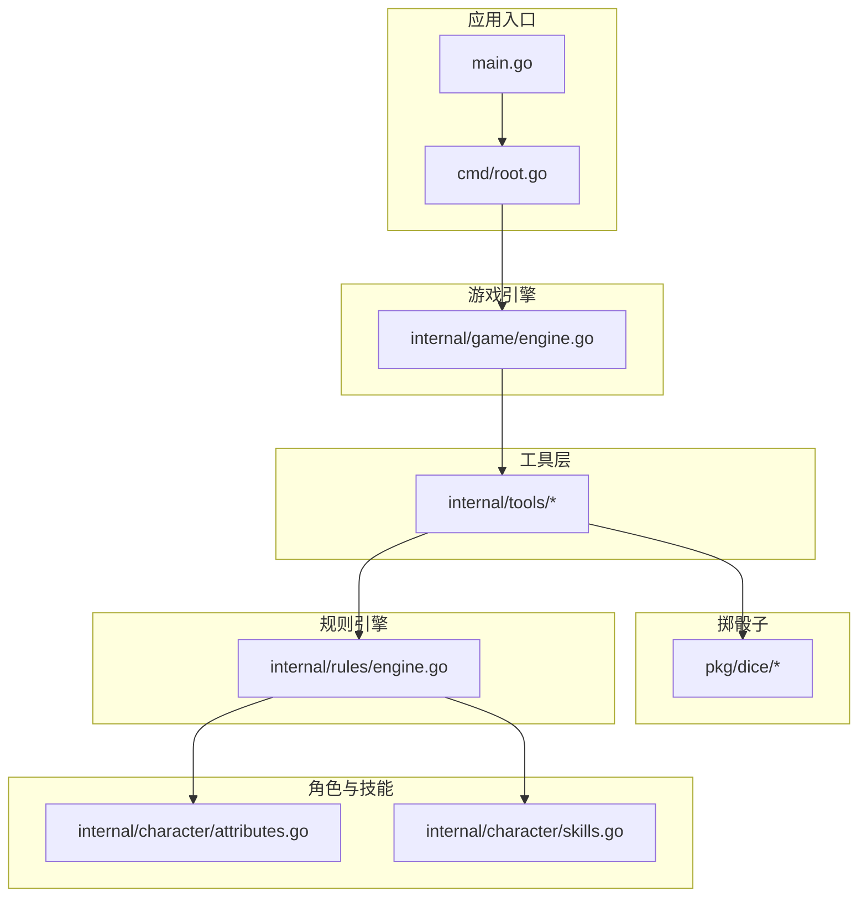
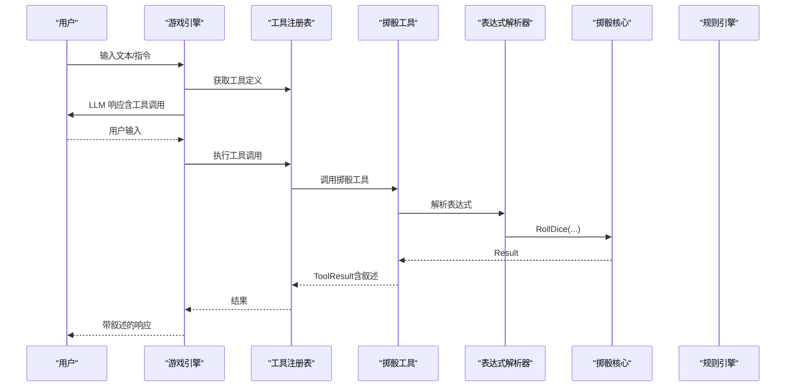
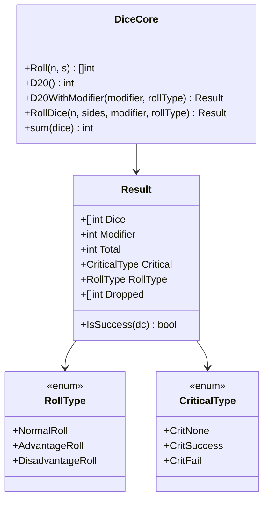
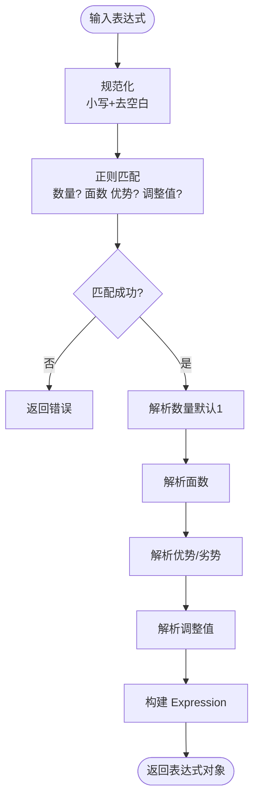
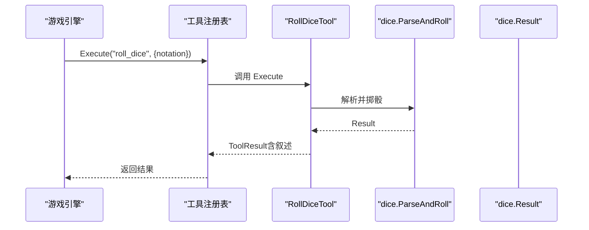
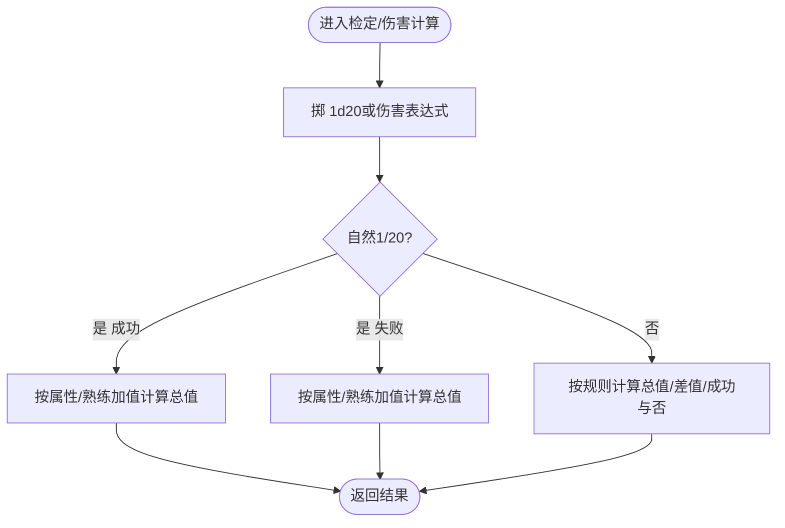
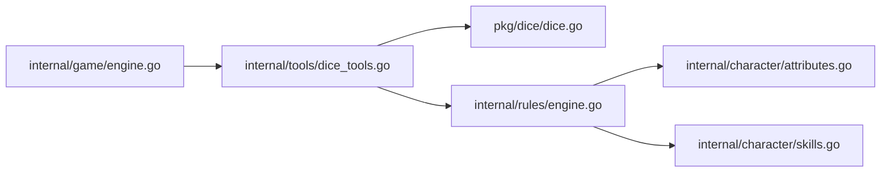

# 掷骰工具

<cite>
**本文引用的文件**
- [pkg/dice/dice.go](file://pkg/dice/dice.go)
- [pkg/dice/parser.go](file://pkg/dice/parser.go)
- [pkg/dice/dice_test.go](file://pkg/dice/dice_test.go)
- [internal/tools/dice_tools.go](file://internal/tools/dice_tools.go)
- [internal/rules/engine.go](file://internal/rules/engine.go)
- [internal/game/engine.go](file://internal/game/engine.go)
- [internal/tools/types.go](file://internal/tools/types.go)
- [internal/character/attributes.go](file://internal/character/attributes.go)
- [internal/character/skills.go](file://internal/character/skills.go)
- [cmd/root.go](file://cmd/root.go)
- [main.go](file://main.go)
- [go.mod](file://go.mod)
</cite>

## 目录
1. [简介](#简介)
2. [项目结构](#项目结构)
3. [核心组件](#核心组件)
4. [架构总览](#架构总览)
5. [详细组件分析](#详细组件分析)
6. [依赖分析](#依赖分析)
7. [性能考虑](#性能考虑)
8. [故障排查指南](#故障排查指南)
9. [结论](#结论)
10. [附录](#附录)

## 简介
本文件为 CDND 掷骰工具的详细技术文档，覆盖 D&D 5e 标准掷骰机制、复杂表达式解析与结果计算、语法规范、解析器实现、与规则引擎的集成、使用示例、错误处理、性能优化与缓存策略，以及扩展性与自定义规则支持。

## 项目结构
掷骰工具位于独立包 pkg/dice，并通过 internal/tools 与规则引擎 internal/rules、游戏引擎 internal/game 集成，CLI 入口位于 cmd/root.go，应用入口 main.go。

**图表来源**
- [main.go:1-8](file://main.go#L1-L8)
- [cmd/root.go:1-95](file://cmd/root.go#L1-L95)
- [internal/game/engine.go:1-797](file://internal/game/engine.go#L1-L797)
- [internal/tools/dice_tools.go:1-314](file://internal/tools/dice_tools.go#L1-L314)
- [pkg/dice/dice.go:1-158](file://pkg/dice/dice.go#L1-L158)
- [internal/rules/engine.go:1-271](file://internal/rules/engine.go#L1-L271)
- [internal/character/attributes.go:1-142](file://internal/character/attributes.go#L1-L142)
- [internal/character/skills.go:1-172](file://internal/character/skills.go#L1-L172)

**章节来源**
- [main.go:1-8](file://main.go#L1-L8)
- [cmd/root.go:1-95](file://cmd/root.go#L1-L95)
- [internal/game/engine.go:1-797](file://internal/game/engine.go#L1-L797)

## 核心组件
- 掷骰核心：提供 d20、多面骰、优势/劣势、暴击判定与结果封装。
- 表达式解析器：解析“XdY”、“+/-N”、“adv/dis/a/d”等表达式，生成可执行的表达式对象。
- 工具层：将掷骰能力暴露为 LLM 可调用工具，支持技能检定、豁免检定等。
- 规则引擎：整合角色属性、熟练加值、DC 判定、伤害计算与 AC 计算。
- 游戏引擎：编排 LLM、工具注册与执行、事件分发与叙述生成。

**章节来源**
- [pkg/dice/dice.go:1-158](file://pkg/dice/dice.go#L1-L158)
- [pkg/dice/parser.go:1-131](file://pkg/dice/parser.go#L1-L131)
- [internal/tools/dice_tools.go:1-314](file://internal/tools/dice_tools.go#L1-L314)
- [internal/rules/engine.go:1-271](file://internal/rules/engine.go#L1-L271)

## 架构总览
掷骰工具在系统中的调用链路如下：

**图表来源**
- [internal/game/engine.go:195-316](file://internal/game/engine.go#L195-L316)
- [internal/tools/dice_tools.go:38-71](file://internal/tools/dice_tools.go#L38-L71)
- [pkg/dice/parser.go:114-121](file://pkg/dice/parser.go#L114-L121)
- [pkg/dice/dice.go:115-143](file://pkg/dice/dice.go#L115-L143)

## 详细组件分析

### 掷骰核心（pkg/dice）
- 数据结构
  - RollType：普通、优势、劣势
  - CriticalType：无、大成功、大失败
  - Result：包含骰子明细、调整值、总值、暴击类型、掷骰类型、丢弃的骰子
- 关键算法
  - Roll(n, s)：生成 n 个 s 面骰结果
  - D20()/D20WithModifier(modifier, rollType)：d20 掷骰与优势/劣势处理，自动识别自然 1/20 暴击
  - RollDice(n, sides, modifier, rollType)：统一入口，支持 d20 优势/劣势与一般多面骰
  - sum([]int)：求和
  - IsSuccess(dc)：判断是否达到 DC
- 随机性与回退
  - 使用 crypto/rand 生成真随机；若失败回退安全值

**图表来源**
- [pkg/dice/dice.go:9-41](file://pkg/dice/dice.go#L9-L41)
- [pkg/dice/dice.go:43-157](file://pkg/dice/dice.go#L43-L157)

**章节来源**
- [pkg/dice/dice.go:1-158](file://pkg/dice/dice.go#L1-L158)

### 表达式解析器（pkg/dice）
- 语法支持
  - 基础：XdY 或 dY（默认 1 个骰子）
  - 调整值：+N 或 -N
  - 优势/劣势：adv/a 或 dis/d，仅对 d20 生效
- 解析流程
  - 规范化（小写、去空白）
  - 正则匹配：数量、面数、优势/劣势、调整值
  - 类型转换与校验，错误即返回
  - 生成 Expression 对象
- 输出
  - Expression.Roll() 调用核心 RollDice
  - Expression.String() 生成标准化表达式字符串
  - ParseAndRoll(expr) 一步完成解析与掷骰

**图表来源**
- [pkg/dice/parser.go:32-85](file://pkg/dice/parser.go#L32-L85)

**章节来源**
- [pkg/dice/parser.go:1-131](file://pkg/dice/parser.go#L1-L131)

### 工具层集成（internal/tools）
- RollDiceTool
  - 参数：notation（如 1d20+5、2d6、1d20adv、1d20dis）
  - 执行：调用 dice.ParseAndRoll，组装 ToolResult，附加叙述与关键字段
- SkillCheckTool / SavingThrowTool
  - 读取角色状态与规则引擎
  - 将技能/属性名称映射为内部枚举
  - 根据 advantage 参数选择 RollType
  - 调用规则引擎进行检定，生成叙述与结果

**图表来源**
- [internal/tools/dice_tools.go:38-71](file://internal/tools/dice_tools.go#L38-L71)
- [pkg/dice/parser.go:114-121](file://pkg/dice/parser.go#L114-L121)
- [pkg/dice/dice.go:115-143](file://pkg/dice/dice.go#L115-L143)

**章节来源**
- [internal/tools/dice_tools.go:1-314](file://internal/tools/dice_tools.go#L1-L314)
- [internal/tools/types.go:1-118](file://internal/tools/types.go#L1-L118)

### 规则引擎（internal/rules）
- 能力检定/技能检定/豁免检定
  - 统一掷 1d20，结合角色属性调整值与熟练加值
  - 自然 1/20 直接判定成功/失败，不受熟练影响
  - 计算总值、差值 Margin、是否成功
- 攻击检定
  - 与属性检定类似，额外加入武器熟练加值
- 伤害计算
  - RollDamage(notation, modifier, critical)
  - 暴击时额外投一次伤害骰并累加

**图表来源**
- [internal/rules/engine.go:59-184](file://internal/rules/engine.go#L59-L184)
- [internal/rules/engine.go:224-250](file://internal/rules/engine.go#L224-L250)

**章节来源**
- [internal/rules/engine.go:1-271](file://internal/rules/engine.go#L1-L271)
- [internal/character/attributes.go:82-87](file://internal/character/attributes.go#L82-L87)
- [internal/character/skills.go:74-85](file://internal/character/skills.go#L74-L85)

### 游戏引擎与叙述（internal/game）
- 工具注册与调用
  - 注册 roll_dice、skill_check、saving_throw 等工具
  - 通过 LLM 生成工具调用，执行后汇总叙述
- 叙述生成
  - 根据工具类别生成 D&D 风格叙述，包含状态标记与分段样式
  - 将工具调用、结果与错误整合为人类可读的响应

**章节来源**
- [internal/game/engine.go:58-76](file://internal/game/engine.go#L58-L76)
- [internal/game/engine.go:465-796](file://internal/game/engine.go#L465-L796)

## 依赖分析
- 内部依赖
  - internal/tools 依赖 pkg/dice 与 internal/rules
  - internal/game 依赖 internal/tools、internal/rules、internal/character
- 外部依赖
  - go.mod 中声明了 LLM SDK、UI 框架、UUID 等第三方库

**图表来源**
- [internal/game/engine.go:1-797](file://internal/game/engine.go#L1-L797)
- [internal/tools/dice_tools.go:1-314](file://internal/tools/dice_tools.go#L1-L314)
- [pkg/dice/dice.go:1-158](file://pkg/dice/dice.go#L1-L158)
- [internal/rules/engine.go:1-271](file://internal/rules/engine.go#L1-L271)
- [internal/character/attributes.go:1-142](file://internal/character/attributes.go#L1-L142)
- [internal/character/skills.go:1-172](file://internal/character/skills.go#L1-L172)

**章节来源**
- [go.mod:1-55](file://go.mod#L1-L55)

## 性能考虑
- 随机源
  - 使用 crypto/rand 保证真随机，必要时回退安全值，避免阻塞与崩溃
- 计算复杂度
  - 掷骰 O(n)，求和 O(n)，表达式解析 O(1)（固定正则）
- 缓存策略
  - 当前未实现显式缓存；建议对重复表达式与角色属性组合进行结果缓存，降低重复计算成本
- I/O 与网络
  - LLM 调用为外部瓶颈，建议在工具层增加超时控制与重试策略

[本节为通用性能讨论，无需特定文件引用]

## 故障排查指南
- 语法错误
  - 表达式不符合“XdY[adv/dis/a/d][±N]”格式时，解析器返回错误
  - 常见问题：非法数量/面数、非法调整值、拼写错误
- 数值溢出
  - 多骰叠加可能导致总和过大；建议在上层限制 n 与 sides 的合理范围
- 无效表达式
  - 空串、非预期字符会触发错误；可通过 MustParse 辅助定位
- 优势/劣势与 d20
  - 仅对单个 d20 生效；多骰或非 d20 不应用优势/劣势逻辑
- 规则判定
  - 自然 1/20 直接成功/失败；检查角色熟练与属性调整值是否正确

**章节来源**
- [pkg/dice/parser.go:32-85](file://pkg/dice/parser.go#L32-L85)
- [pkg/dice/dice_test.go:102-156](file://pkg/dice/dice_test.go#L102-L156)

## 结论
掷骰工具以简洁的表达式语法与稳健的解析器为核心，结合规则引擎与工具层，实现了 D&D 5e 的标准掷骰、检定与伤害计算。通过 LLM 驱动的工具调用，系统能够自然地融入叙述式 RPG 流程。未来可在缓存、错误重试与表达式扩展方面进一步增强。

[本节为总结性内容，无需特定文件引用]

## 附录

### 语法规范与示例
- 基础表达式
  - XdY：X 个 Y 面骰
  - dY：默认 X=1
- 调整值
  - +N：加法调整
  - -N：减法调整
- 优势/劣势
  - adv 或 a：优势
  - dis 或 d：劣势
  - 仅对 d20 生效
- 示例
  - “2d6”、“1d20+5”、“d8-1”、“1d20adv”、“2d20dis”

**章节来源**
- [pkg/dice/parser.go:18-31](file://pkg/dice/parser.go#L18-L31)

### 使用示例与常见表达式
- 掷骰
  - notation: "1d20+5"、"2d6"、"1d20adv"、"1d20dis"
- 技能检定
  - skill: "运动"/"体操"/"手法"/"隐匿"/"奥秘"/"历史"/"调查"/"自然"/"宗教"/"驯兽"/"洞察"/"医药"/"察觉"/"求生"/"欺瞒"/"威吓"/"表演"/"说服"
  - dc: 1–30
  - advantage: true/false
- 豁免检定
  - ability: "力量"/"敏捷"/"体质"/"智力"/"感知"/"魅力"
  - dc: 1–30
  - advantage: true/false

**章节来源**
- [internal/tools/dice_tools.go:24-36](file://internal/tools/dice_tools.go#L24-L36)
- [internal/tools/dice_tools.go:89-113](file://internal/tools/dice_tools.go#L89-L113)
- [internal/tools/dice_tools.go:216-240](file://internal/tools/dice_tools.go#L216-L240)

### 错误处理机制
- 解析阶段
  - 无效表达式、非法数量/面数/调整值均返回错误
- 执行阶段
  - 工具参数校验失败返回 ErrInvalidArguments
  - 状态不可用返回 ErrStateNotAvailable
  - 工具未实现返回 ErrNotImplemented
- 规则引擎
  - 未知技能/属性时返回失败或错误信息

**章节来源**
- [pkg/dice/parser.go:40-43](file://pkg/dice/parser.go#L40-L43)
- [internal/tools/types.go:110-118](file://internal/tools/types.go#L110-L118)
- [internal/tools/dice_tools.go:138-162](file://internal/tools/dice_tools.go#L138-L162)

### 性能优化与缓存策略
- 建议
  - 对常用表达式与角色属性组合进行结果缓存
  - 对 LLM 工具调用增加超时与指数退避重试
  - 限制单次掷骰的骰子数量与面数，防止内存与计算压力

[本节为通用优化建议，无需特定文件引用]

### 扩展性与自定义规则支持
- 表达式扩展
  - 可在解析器中增加新后缀或运算符（需保持向后兼容）
- 规则扩展
  - 新增检定类型（如攻击命中）与伤害类型，沿用 CheckResult/DamageResult 模式
- 工具扩展
  - 通过工具接口 Tool 与注册表 Registry 增加新工具，遵循统一参数与叙述格式

**章节来源**
- [internal/tools/types.go:24-34](file://internal/tools/types.go#L24-L34)
- [internal/game/engine.go:58-76](file://internal/game/engine.go#L58-L76)
- [internal/rules/engine.go:16-24](file://internal/rules/engine.go#L16-L24)