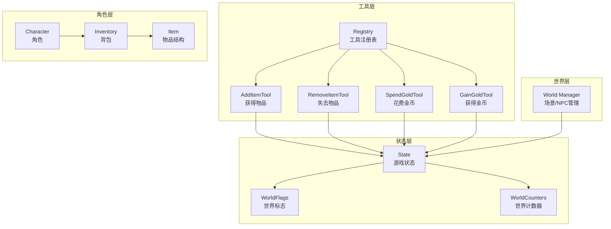
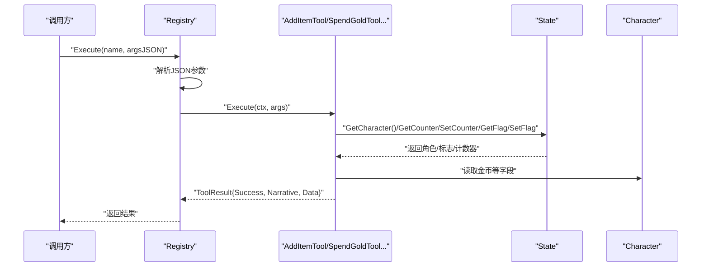
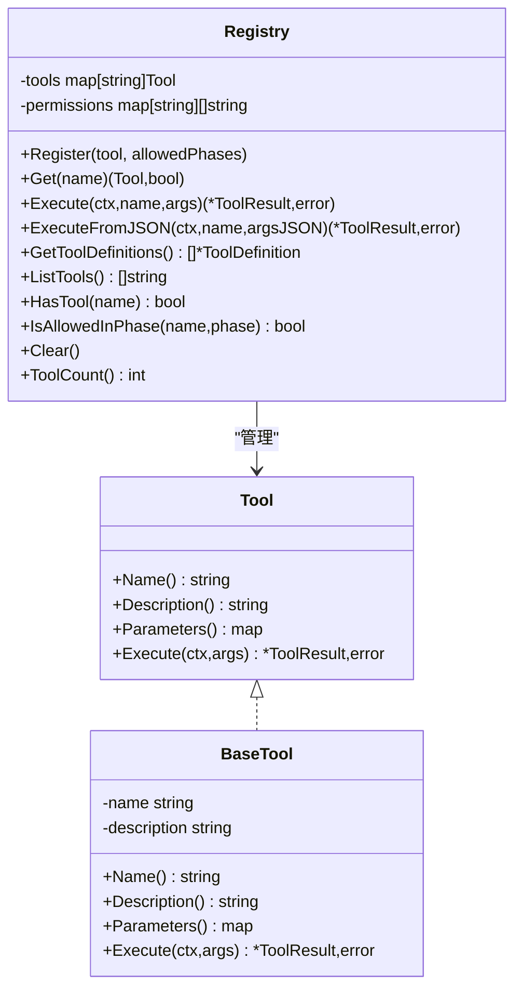
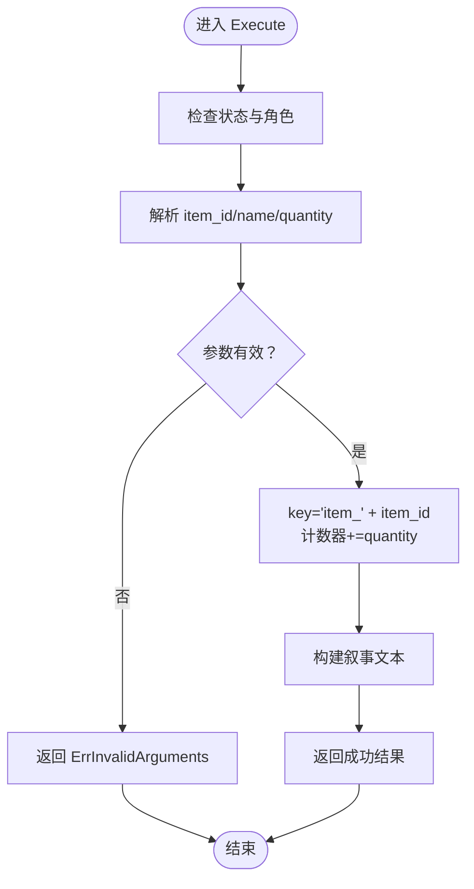
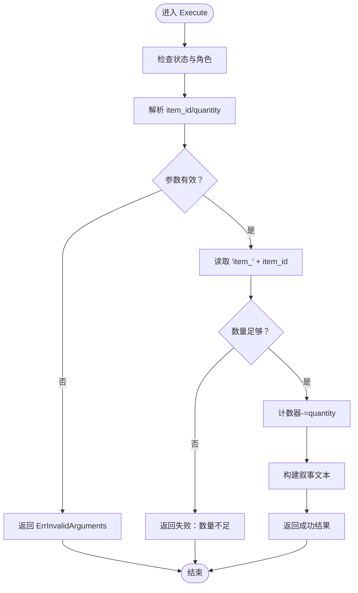
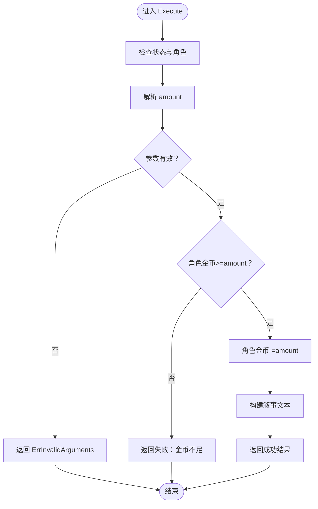
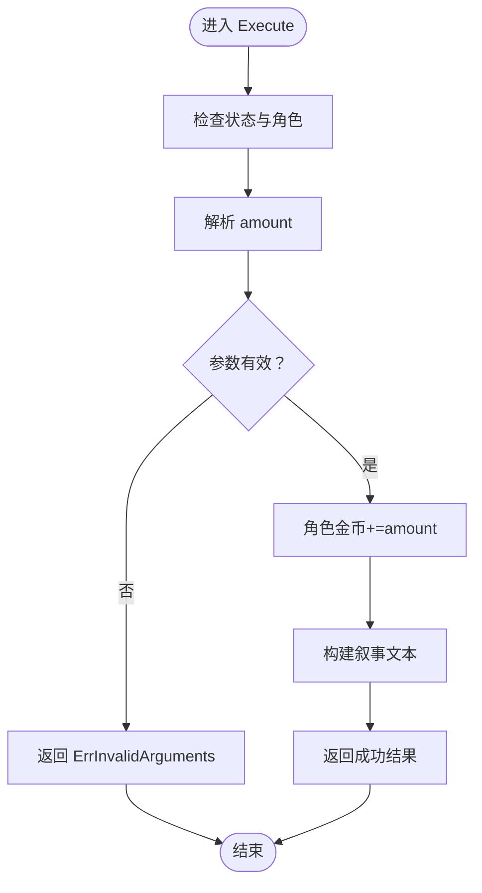
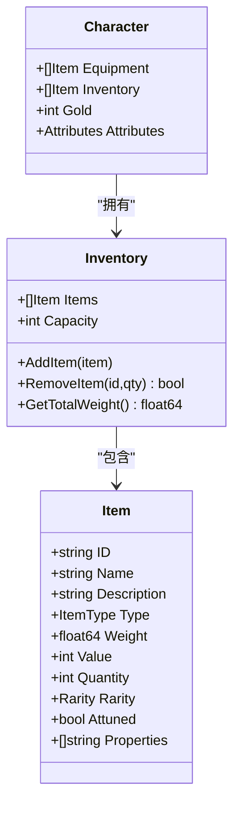
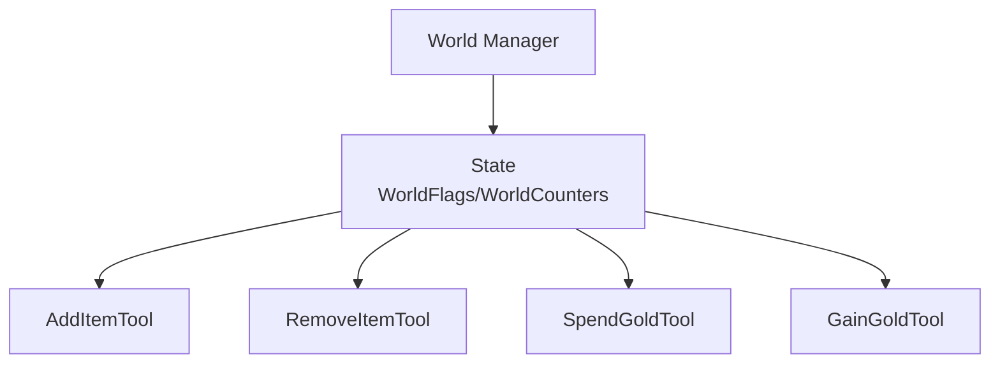
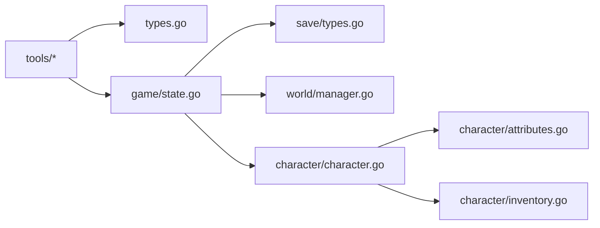

# 物品工具

<cite>
**本文引用的文件**
- [internal/tools/item_tools.go](file://internal/tools/item_tools.go)
- [internal/tools/types.go](file://internal/tools/types.go)
- [internal/tools/registry.go](file://internal/tools/registry.go)
- [internal/character/inventory.go](file://internal/character/inventory.go)
- [internal/character/character.go](file://internal/character/character.go)
- [internal/character/attributes.go](file://internal/character/attributes.go)
- [internal/game/state.go](file://internal/game/state.go)
- [internal/save/types.go](file://internal/save/types.go)
- [internal/world/manager.go](file://internal/world/manager.go)
- [internal/tools/character_tools.go](file://internal/tools/character_tools.go)
- [config.example.yaml](file://config.example.yaml)
</cite>

## 目录
1. [简介](#简介)
2. [项目结构](#项目结构)
3. [核心组件](#核心组件)
4. [架构总览](#架构总览)
5. [详细组件分析](#详细组件分析)
6. [依赖分析](#依赖分析)
7. [性能考虑](#性能考虑)
8. [故障排查指南](#故障排查指南)
9. [结论](#结论)
10. [附录](#附录)

## 简介
本文件面向“CDND物品工具”的技术文档，聚焦于物品管理工具的功能与实现，涵盖以下方面：
- 物品获取与失去、金币收支的工具化能力
- 与角色系统（角色、背包、属性）的集成方式
- 与世界系统（场景、NPC、标志/计数器）的交互与数据同步
- 参数校验、错误处理与异常流程
- 性能考量与批量操作建议
- 实际使用示例与操作流程

说明：当前仓库中物品工具主要通过“世界计数器”模拟物品持有与金币变动；角色侧的物品结构与背包逻辑已具备，但尚未在工具层直接使用该结构进行“装备管理/属性加成/效果触发”。本文将基于现有代码进行准确描述，并指出扩展方向。

## 项目结构
围绕物品工具的关键模块与职责如下：
- 工具层：定义通用工具接口、工具注册表、以及具体物品相关工具（获得物品、失去物品、花费金币、获得金币）
- 角色层：定义物品结构、物品类型、稀有度、熟练项、法术槽等，提供背包增删与负重计算
- 状态层：封装世界标志与计数器，作为工具执行的共享状态后端
- 世界层：场景与NPC管理，支持与物品工具的联动（如通过标志/计数器驱动剧情）

图表来源
- [internal/tools/item_tools.go:1-287](file://internal/tools/item_tools.go#L1-L287)
- [internal/tools/registry.go:1-109](file://internal/tools/registry.go#L1-L109)
- [internal/character/inventory.go:1-138](file://internal/character/inventory.go#L1-L138)
- [internal/game/state.go:1-236](file://internal/game/state.go#L1-L236)
- [internal/world/manager.go:1-294](file://internal/world/manager.go#L1-L294)

章节来源
- [internal/tools/item_tools.go:1-287](file://internal/tools/item_tools.go#L1-L287)
- [internal/tools/registry.go:1-109](file://internal/tools/registry.go#L1-L109)
- [internal/character/inventory.go:1-138](file://internal/character/inventory.go#L1-L138)
- [internal/game/state.go:1-236](file://internal/game/state.go#L1-L236)
- [internal/world/manager.go:1-294](file://internal/world/manager.go#L1-L294)

## 核心组件
- 工具接口与基类
  - 工具接口定义名称、描述、参数Schema与执行方法
  - 基类提供默认实现，便于继承扩展
- 工具注册表
  - 维护工具集合与权限映射（按游戏阶段）
  - 支持按名称检索、执行、导出定义
- 物品工具
  - 获得物品：通过世界计数器记录物品数量
  - 失去物品：校验数量后减少计数器
  - 花费/获得金币：校验角色金币后更新
- 角色与背包
  - 物品结构包含ID、名称、类型、重量、价值、数量、稀有度、附灵、属性等
  - 背包支持可堆叠物品合并与移除
- 游戏状态
  - 提供世界标志与计数器读写接口，作为工具执行的共享存储
- 世界管理
  - 场景与NPC管理，支持跨场景移动与连接

章节来源
- [internal/tools/types.go:1-118](file://internal/tools/types.go#L1-L118)
- [internal/tools/registry.go:1-109](file://internal/tools/registry.go#L1-L109)
- [internal/tools/item_tools.go:1-287](file://internal/tools/item_tools.go#L1-L287)
- [internal/character/inventory.go:1-138](file://internal/character/inventory.go#L1-L138)
- [internal/game/state.go:1-236](file://internal/game/state.go#L1-L236)
- [internal/world/manager.go:1-294](file://internal/world/manager.go#L1-L294)

## 架构总览
物品工具的执行链路如下：
- 调用方通过注册表按名称获取工具
- 注册表将参数反序列化后交由工具执行
- 工具读取/写入游戏状态（角色与世界标志/计数器）
- 工具返回执行结果（成功/失败、叙事文本、数据）

图表来源
- [internal/tools/registry.go:37-57](file://internal/tools/registry.go#L37-L57)
- [internal/tools/item_tools.go:46-88](file://internal/tools/item_tools.go#L46-L88)
- [internal/game/state.go:75-128](file://internal/game/state.go#L75-L128)
- [internal/character/character.go:8-61](file://internal/character/character.go#L8-L61)

## 详细组件分析

### 工具接口与注册表
- 工具接口
  - 名称、描述、参数Schema、执行方法
  - 基类提供默认空参数与未实现错误
- 注册表
  - 注册工具并可配置允许的游戏阶段
  - 提供执行、导出定义、列出工具、权限检查等能力

图表来源
- [internal/tools/types.go:24-108](file://internal/tools/types.go#L24-L108)
- [internal/tools/registry.go:9-109](file://internal/tools/registry.go#L9-L109)

章节来源
- [internal/tools/types.go:1-118](file://internal/tools/types.go#L1-L118)
- [internal/tools/registry.go:1-109](file://internal/tools/registry.go#L1-L109)

### 获得物品工具（AddItemTool）
- 功能要点
  - 校验状态与角色可用性
  - 解析参数：item_id、name、quantity（默认1）
  - 通过“item_{id}”键在世界计数器中增加数量
  - 生成叙事文本与返回数据
- 参数Schema
  - 必填：item_id、name
  - 可选：quantity（最小1，默认1）

图表来源
- [internal/tools/item_tools.go:46-88](file://internal/tools/item_tools.go#L46-L88)
- [internal/game/state.go:120-134](file://internal/game/state.go#L120-L134)

章节来源
- [internal/tools/item_tools.go:1-88](file://internal/tools/item_tools.go#L1-L88)
- [internal/game/state.go:1-236](file://internal/game/state.go#L1-L236)

### 失去物品工具（RemoveItemTool）
- 功能要点
  - 校验状态与角色可用性
  - 解析 item_id、quantity（默认1）
  - 读取当前计数器，若不足则返回失败结果
  - 否则减少计数器并生成叙事文本
- 参数Schema
  - 必填：item_id
  - 可选：quantity（最小1，默认1）

图表来源
- [internal/tools/item_tools.go:124-162](file://internal/tools/item_tools.go#L124-L162)
- [internal/game/state.go:120-128](file://internal/game/state.go#L120-L128)

章节来源
- [internal/tools/item_tools.go:89-162](file://internal/tools/item_tools.go#L89-L162)
- [internal/game/state.go:1-236](file://internal/game/state.go#L1-L236)

### 花费金币工具（SpendGoldTool）
- 功能要点
  - 校验状态与角色可用性
  - 解析 amount（最小1）
  - 比较角色金币与花费，不足则返回失败与叙事
  - 否则更新角色金币并生成叙事文本
- 参数Schema
  - 必填：amount（最小1）

图表来源
- [internal/tools/item_tools.go:193-228](file://internal/tools/item_tools.go#L193-L228)
- [internal/character/character.go:8-61](file://internal/character/character.go#L8-L61)

章节来源
- [internal/tools/item_tools.go:164-228](file://internal/tools/item_tools.go#L164-L228)
- [internal/character/character.go:1-223](file://internal/character/character.go#L1-L223)

### 获得金币工具（GainGoldTool）
- 功能要点
  - 校验状态与角色可用性
  - 解析 amount（最小1）
  - 更新角色金币并生成叙事文本
- 参数Schema
  - 必填：amount（最小1）

图表来源
- [internal/tools/item_tools.go:259-286](file://internal/tools/item_tools.go#L259-L286)
- [internal/character/character.go:8-61](file://internal/character/character.go#L8-L61)

章节来源
- [internal/tools/item_tools.go:230-286](file://internal/tools/item_tools.go#L230-L286)
- [internal/character/character.go:1-223](file://internal/character/character.go#L1-L223)

### 角色与背包（与物品工具的关系）
- 物品结构
  - 字段：ID、名称、描述、类型、重量、价值、数量、稀有度、附灵、属性
  - 类型枚举：武器、护甲、盾牌、药水、卷轴、法杖、戒指、杆状物、法器、宝物、弹药、工具、装备、珍宝等
  - 稀有度枚举：普通、不常见、稀有、极 rare、传奇、神器
- 背包管理
  - AddItem：同类且非武器/护甲的物品可堆叠，数量累加
  - RemoveItem：按ID查找并移除或减量
  - GetTotalWeight：按重量×数量累计
- 与工具的关系
  - 当前工具通过世界计数器记录物品数量，未直接使用角色背包结构
  - 若需实现“装备管理/属性加成/效果触发”，可在工具中引入角色背包与属性修正逻辑

图表来源
- [internal/character/inventory.go:3-138](file://internal/character/inventory.go#L3-L138)
- [internal/character/character.go:8-61](file://internal/character/character.go#L8-L61)

章节来源
- [internal/character/inventory.go:1-138](file://internal/character/inventory.go#L1-L138)
- [internal/character/character.go:1-223](file://internal/character/character.go#L1-L223)

### 世界系统交互与数据同步
- 游戏状态
  - 提供世界标志与计数器的读写接口
  - 作为工具执行的共享存储后端
- 世界管理
  - 场景与NPC管理，支持跨场景移动与连接
  - 可通过标志/计数器驱动剧情（如“已拾取某物品”、“完成某任务”）

图表来源
- [internal/game/state.go:110-134](file://internal/game/state.go#L110-L134)
- [internal/world/manager.go:1-294](file://internal/world/manager.go#L1-L294)
- [internal/tools/item_tools.go:1-287](file://internal/tools/item_tools.go#L1-L287)

章节来源
- [internal/game/state.go:1-236](file://internal/game/state.go#L1-L236)
- [internal/world/manager.go:1-294](file://internal/world/manager.go#L1-L294)

## 依赖分析
- 工具层依赖
  - 工具接口与注册表解耦了调用方与具体工具实现
  - 工具通过StateAccessor访问角色与世界状态
- 角色层依赖
  - 物品结构与背包逻辑独立于工具层
  - 属性系统提供修正计算，可用于扩展“属性加成”
- 状态与世界层
  - 游戏状态提供统一的标志/计数器接口
  - 世界管理器提供场景/NPC生命周期管理

图表来源
- [internal/tools/item_tools.go:1-287](file://internal/tools/item_tools.go#L1-L287)
- [internal/tools/types.go:1-118](file://internal/tools/types.go#L1-L118)
- [internal/game/state.go:1-236](file://internal/game/state.go#L1-L236)
- [internal/save/types.go:1-217](file://internal/save/types.go#L1-L217)
- [internal/world/manager.go:1-294](file://internal/world/manager.go#L1-L294)
- [internal/character/character.go:1-223](file://internal/character/character.go#L1-L223)
- [internal/character/attributes.go:1-142](file://internal/character/attributes.go#L1-L142)
- [internal/character/inventory.go:1-138](file://internal/character/inventory.go#L1-L138)

章节来源
- [internal/tools/item_tools.go:1-287](file://internal/tools/item_tools.go#L1-L287)
- [internal/tools/types.go:1-118](file://internal/tools/types.go#L1-L118)
- [internal/game/state.go:1-236](file://internal/game/state.go#L1-L236)
- [internal/save/types.go:1-217](file://internal/save/types.go#L1-L217)
- [internal/world/manager.go:1-294](file://internal/world/manager.go#L1-L294)
- [internal/character/character.go:1-223](file://internal/character/character.go#L1-L223)
- [internal/character/attributes.go:1-142](file://internal/character/attributes.go#L1-L142)
- [internal/character/inventory.go:1-138](file://internal/character/inventory.go#L1-L138)

## 性能考虑
- 工具执行开销
  - 参数解析与类型断言为O(1)，计数器/标志读写为O(1)
  - 整体执行复杂度低，适合频繁调用
- 批量操作建议
  - 将多次工具调用合并为单次注册表执行，减少重复解析
  - 对同一物品的多次增减，优先在应用层聚合后再写入计数器
- 内存与并发
  - 游戏状态内部未显式并发保护，建议在上层协调工具调用时机
  - 世界管理器提供读写锁，适用于场景/NPC大规模变更

[本节为通用性能建议，不直接分析特定文件]

## 故障排查指南
- 常见错误
  - 工具未实现：默认基类返回未实现错误
  - 无效参数：参数类型不符或缺失必填项
  - 权限不足：工具不在允许的游戏阶段内
  - 游戏状态不可用：状态或角色为空
  - 物品数量不足：失去物品时计数器不足
  - 金币不足：花费金币时角色金币不足
- 排查步骤
  - 确认工具已在注册表中注册且允许当前阶段
  - 检查参数JSON格式与字段类型
  - 核对状态后端（角色、标志、计数器）是否正确初始化
  - 对于金币不足与物品不足，确认前置工具调用顺序

章节来源
- [internal/tools/types.go:110-118](file://internal/tools/types.go#L110-L118)
- [internal/tools/registry.go:37-57](file://internal/tools/registry.go#L37-L57)
- [internal/tools/item_tools.go:46-88](file://internal/tools/item_tools.go#L46-L88)
- [internal/tools/item_tools.go:124-162](file://internal/tools/item_tools.go#L124-L162)
- [internal/tools/item_tools.go:193-228](file://internal/tools/item_tools.go#L193-L228)
- [internal/tools/item_tools.go:259-286](file://internal/tools/item_tools.go#L259-L286)

## 结论
- 物品工具当前通过世界计数器实现物品与金币的增减，满足基本的叙事与状态记录需求
- 角色侧的物品结构与背包逻辑完备，可作为后续“装备管理/属性加成/效果触发”的基础
- 工具层与状态层解耦良好，便于扩展更多物品相关能力
- 建议在工具层引入角色背包与属性修正逻辑，以实现更贴近D&D 5E的物品系统

[本节为总结性内容，不直接分析特定文件]

## 附录

### 实际使用示例与操作流程
- 获得物品
  - 步骤：调用注册表执行“add_item”，传入item_id、name、quantity
  - 结果：世界计数器中对应键值增加，返回叙事与数据
- 失去物品
  - 步骤：调用注册表执行“remove_item”，传入item_id、quantity
  - 结果：若数量充足则计数器减少，否则返回失败
- 花费金币
  - 步骤：调用注册表执行“spend_gold”，传入amount
  - 结果：若金币充足则角色金币减少，否则返回失败
- 获得金币
  - 步骤：调用注册表执行“gain_gold”，传入amount
  - 结果：角色金币增加

章节来源
- [internal/tools/item_tools.go:1-287](file://internal/tools/item_tools.go#L1-L287)
- [internal/tools/registry.go:37-57](file://internal/tools/registry.go#L37-L57)

### 验证机制与合规性
- 参数校验
  - 工具通过JSON Schema定义参数，注册表在执行前解析并校验
- 权限控制
  - 注册表支持按游戏阶段限制工具使用
- 合法性检查
  - 工具执行前检查状态与角色可用性
  - 物品数量与金币余额在工具内部进行边界检查

章节来源
- [internal/tools/types.go:44-67](file://internal/tools/types.go#L44-L67)
- [internal/tools/registry.go:83-97](file://internal/tools/registry.go#L83-L97)
- [internal/tools/item_tools.go:46-88](file://internal/tools/item_tools.go#L46-L88)
- [internal/tools/item_tools.go:124-162](file://internal/tools/item_tools.go#L124-L162)
- [internal/tools/item_tools.go:193-228](file://internal/tools/item_tools.go#L193-L228)
- [internal/tools/item_tools.go:259-286](file://internal/tools/item_tools.go#L259-L286)

### 与角色系统的集成
- 角色金币
  - 花费/获得金币工具直接修改角色金币字段
- 背包与属性
  - 当前工具未直接操作角色背包与属性
  - 可通过扩展工具引入角色背包.AddItem/RemoveItem与属性修正逻辑

章节来源
- [internal/tools/item_tools.go:193-228](file://internal/tools/item_tools.go#L193-L228)
- [internal/tools/item_tools.go:259-286](file://internal/tools/item_tools.go#L259-L286)
- [internal/character/character.go:8-61](file://internal/character/character.go#L8-L61)
- [internal/character/inventory.go:102-138](file://internal/character/inventory.go#L102-L138)
- [internal/character/attributes.go:82-96](file://internal/character/attributes.go#L82-L96)

### 与世界系统的交互
- 世界标志与计数器
  - 物品工具通过计数器记录物品数量
  - 可扩展为通过标志记录“已拾取/已使用”等状态
- 场景与NPC联动
  - 世界管理器支持场景/NPC生命周期管理
  - 可结合标志/计数器实现“在某场景发现某物品”等剧情

章节来源
- [internal/game/state.go:110-134](file://internal/game/state.go#L110-L134)
- [internal/world/manager.go:1-294](file://internal/world/manager.go#L1-L294)

### 配置参考
- 游戏设置与显示配置可参考示例配置文件，确保工具执行后的叙事与显示一致

章节来源
- [config.example.yaml:1-72](file://config.example.yaml#L1-L72)