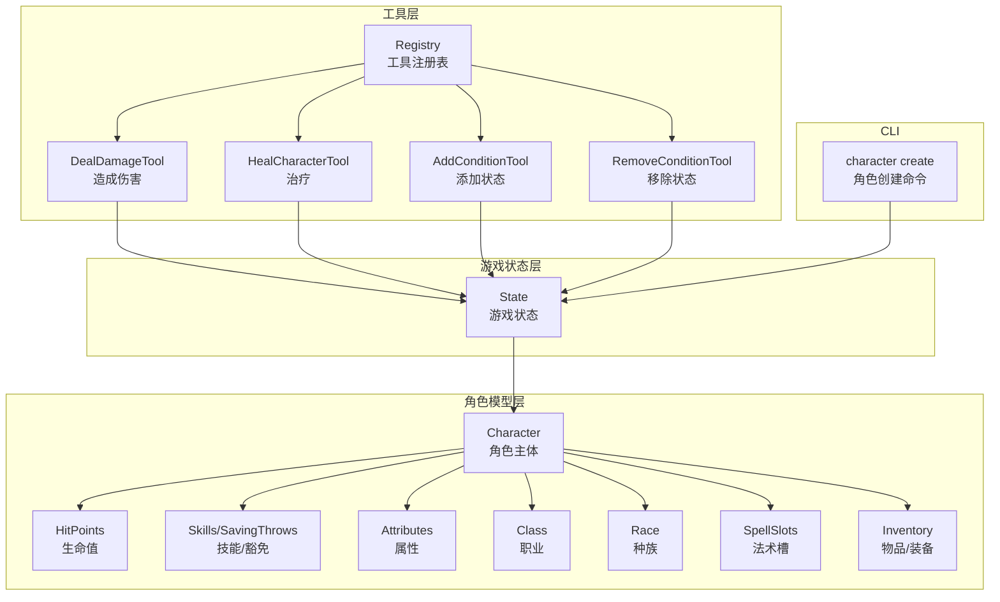
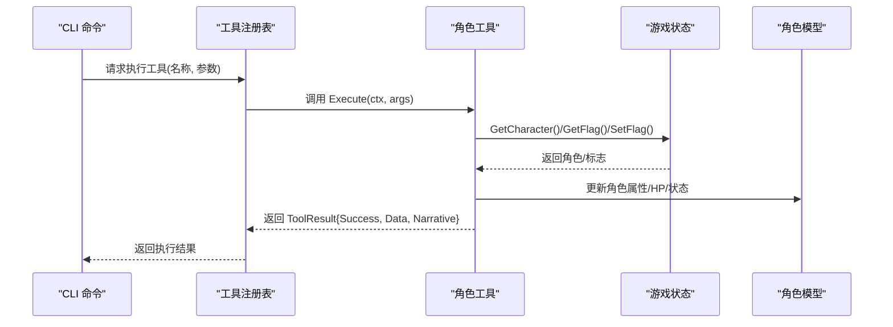
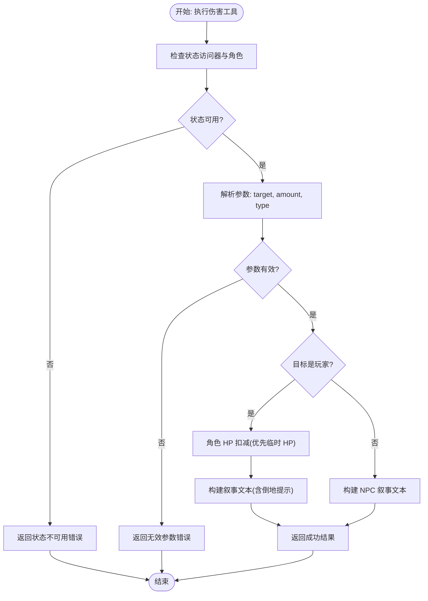
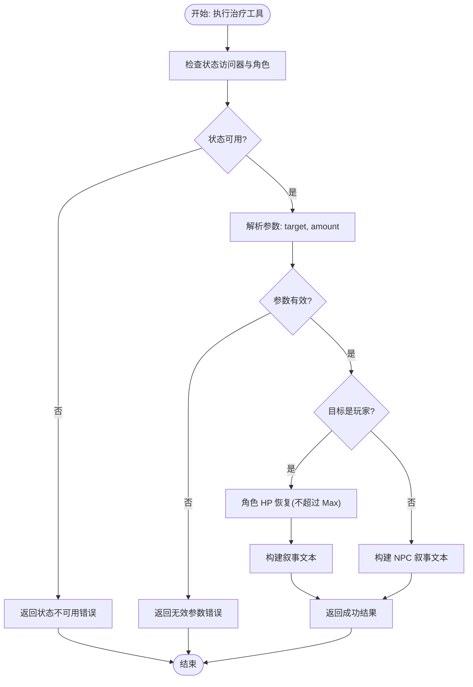
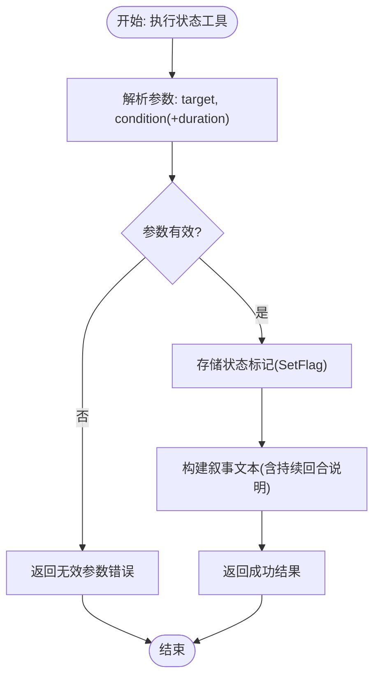
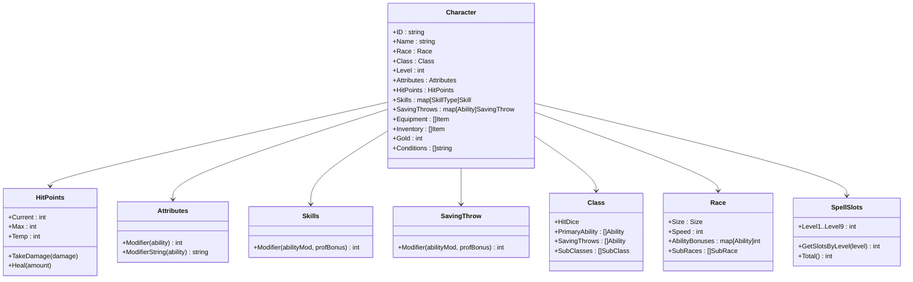
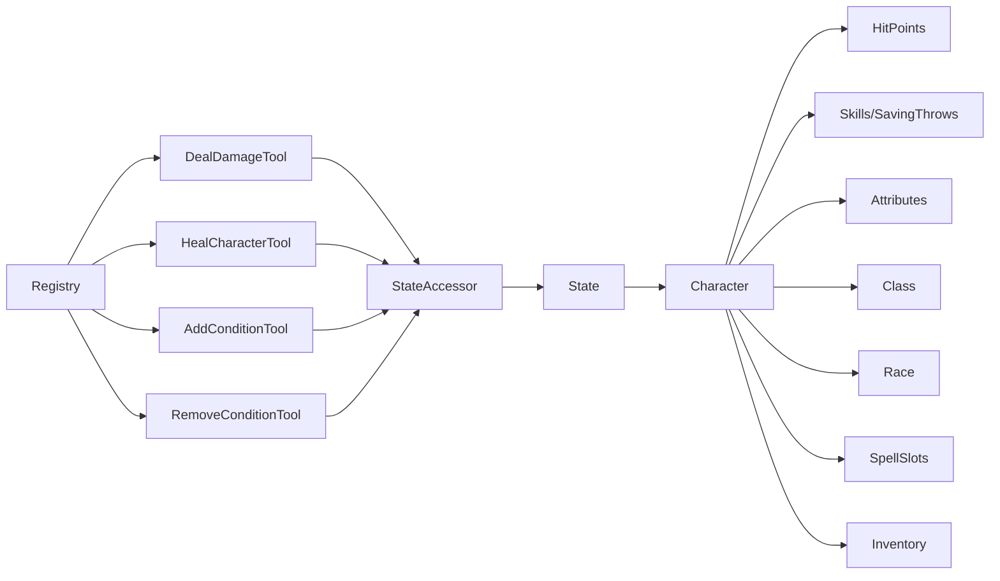

# 角色工具

<cite>
**本文引用的文件**
- [internal/tools/character_tools.go](file://internal/tools/character_tools.go)
- [internal/tools/types.go](file://internal/tools/types.go)
- [internal/tools/registry.go](file://internal/tools/registry.go)
- [internal/character/character.go](file://internal/character/character.go)
- [internal/character/attributes.go](file://internal/character/attributes.go)
- [internal/character/skills.go](file://internal/character/skills.go)
- [internal/character/class.go](file://internal/character/class.go)
- [internal/character/race.go](file://internal/character/race.go)
- [internal/character/spell_slots.go](file://internal/character/spell_slots.go)
- [internal/character/inventory.go](file://internal/character/inventory.go)
- [internal/character/class_data.go](file://internal/character/class_data.go)
- [internal/character/race_data.go](file://internal/character/race_data.go)
- [internal/game/state.go](file://internal/game/state.go)
- [cmd/character.go](file://cmd/character.go)
</cite>

## 目录
1. [简介](#简介)
2. [项目结构](#项目结构)
3. [核心组件](#核心组件)
4. [架构总览](#架构总览)
5. [详细组件分析](#详细组件分析)
6. [依赖分析](#依赖分析)
7. [性能考量](#性能考量)
8. [故障排查指南](#故障排查指南)
9. [结论](#结论)
10. [附录](#附录)

## 简介
本文件面向“CDND 角色工具”，系统化梳理并说明角色相关工具的功能、参数、返回值、调用流程与错误处理，以及与 D&D 5e 规则系统的集成方式。内容覆盖角色属性计算、技能检定、豁免检定、经验值与等级、伤害与治疗、状态效果管理等，帮助开发者与运营人员正确使用与扩展角色工具。

## 项目结构
角色工具位于 tools 子系统，围绕“工具注册表 + 工具实现 + 状态访问”的分层设计组织，角色数据模型位于 character 子系统，游戏状态由 game 子系统维护，CLI 提供角色创建入口。

图表来源
- [internal/tools/registry.go:1-109](file://internal/tools/registry.go#L1-L109)
- [internal/tools/character_tools.go:1-321](file://internal/tools/character_tools.go#L1-L321)
- [internal/character/character.go:1-223](file://internal/character/character.go#L1-L223)
- [internal/game/state.go:1-236](file://internal/game/state.go#L1-L236)
- [cmd/character.go:1-99](file://cmd/character.go#L1-L99)

章节来源
- [internal/tools/registry.go:1-109](file://internal/tools/registry.go#L1-L109)
- [internal/tools/character_tools.go:1-321](file://internal/tools/character_tools.go#L1-L321)
- [internal/character/character.go:1-223](file://internal/character/character.go#L1-L223)
- [internal/game/state.go:1-236](file://internal/game/state.go#L1-L236)
- [cmd/character.go:1-99](file://cmd/character.go#L1-L99)

## 核心组件
- 工具接口与基类
  - 工具接口定义了名称、描述、参数模式、执行方法与结果封装。
  - 基类提供默认实现，便于具体工具复用。
- 工具注册表
  - 维护工具集合、权限控制（按游戏阶段）、工具定义导出、执行入口。
- 角色工具集
  - 伤害工具：对玩家或 NPC 实施伤害，更新 HP 并生成叙事文本。
  - 治疗工具：对玩家或 NPC 实施治疗，更新 HP 并生成叙事文本。
  - 状态工具：添加/移除状态，支持持续回合数。
- 角色数据模型
  - 角色主体、属性、技能/豁免、生命值、职业/种族、法术槽、物品与装备、状态效果等。
- 游戏状态
  - 角色、场景、世界标志/计数器、对话历史、战斗状态、回合计数等。

章节来源
- [internal/tools/types.go:1-118](file://internal/tools/types.go#L1-L118)
- [internal/tools/registry.go:1-109](file://internal/tools/registry.go#L1-L109)
- [internal/tools/character_tools.go:1-321](file://internal/tools/character_tools.go#L1-L321)
- [internal/character/character.go:1-223](file://internal/character/character.go#L1-L223)
- [internal/game/state.go:1-236](file://internal/game/state.go#L1-L236)

## 架构总览
角色工具通过注册表统一调度，工具在执行前从状态访问器读取当前角色与世界状态，完成业务逻辑后返回结构化结果与叙事文本。工具与角色模型解耦，仅依赖状态访问接口。

图表来源
- [internal/tools/registry.go:37-57](file://internal/tools/registry.go#L37-L57)
- [internal/tools/character_tools.go:46-101](file://internal/tools/character_tools.go#L46-L101)
- [internal/tools/character_tools.go:136-184](file://internal/tools/character_tools.go#L136-L184)
- [internal/tools/character_tools.go:224-261](file://internal/tools/character_tools.go#L224-L261)
- [internal/tools/character_tools.go:295-320](file://internal/tools/character_tools.go#L295-L320)
- [internal/game/state.go:75-78](file://internal/game/state.go#L75-L78)

## 详细组件分析

### 工具接口与注册表
- 工具接口
  - 名称、描述、参数 JSON Schema、执行方法、结果封装。
- 注册表
  - 注册工具、按阶段权限控制、导出工具定义、执行工具、列举工具。
- 基类
  - 默认参数为空对象，执行返回未实现错误，便于子类覆盖。

章节来源
- [internal/tools/types.go:24-108](file://internal/tools/types.go#L24-L108)
- [internal/tools/registry.go:23-97](file://internal/tools/registry.go#L23-L97)

### 伤害工具（DealDamageTool）
- 功能
  - 对目标造成伤害，支持玩家与 NPC；玩家 HP 受损，生成倒地提示。
- 参数
  - target: 字符串，目标名称（player 或玩家名/NPC 名称）
  - amount: 整数，伤害值（最小 1）
  - type: 字符串，伤害类型（中文枚举）
- 返回
  - Success: 布尔
  - Data: 包含 target、amount、type、old_hp、new_hp、is_down 等
  - Narrative: 叙事文本
- 边界与错误
  - 缺失状态或角色：返回状态不可用错误
  - 参数类型不符：返回无效参数错误
  - 目标为玩家时，按 HP 规则扣减（优先临时 HP）

图表来源
- [internal/tools/character_tools.go:46-101](file://internal/tools/character_tools.go#L46-L101)
- [internal/character/character.go:109-125](file://internal/character/character.go#L109-L125)

章节来源
- [internal/tools/character_tools.go:8-101](file://internal/tools/character_tools.go#L8-L101)
- [internal/character/character.go:102-133](file://internal/character/character.go#L102-L133)

### 治疗工具（HealCharacterTool）
- 功能
  - 对目标实施治疗，更新玩家 HP 并限制不超过最大值。
- 参数
  - target: 字符串，目标名称（player 或玩家名/NPC 名称）
  - amount: 整数，治疗量（最小 1）
- 返回
  - Success: 布尔
  - Data: 包含 target、amount、old_hp、new_hp、max_hp 等
  - Narrative: 叙事文本
- 边界与错误
  - 缺失状态或角色：返回状态不可用错误
  - 参数类型不符：返回无效参数错误
  - 治疗后 HP 不超过 Max

图表来源
- [internal/tools/character_tools.go:136-184](file://internal/tools/character_tools.go#L136-L184)
- [internal/character/character.go:127-133](file://internal/character/character.go#L127-L133)

章节来源
- [internal/tools/character_tools.go:103-184](file://internal/tools/character_tools.go#L103-L184)
- [internal/character/character.go:102-133](file://internal/character/character.go#L102-L133)

### 状态工具（AddConditionTool / RemoveConditionTool）
- 功能
  - 添加/移除状态，支持持续回合数（0 表示永久或直到解除）。
- 参数
  - AddConditionTool: target、condition（中文枚举）、duration（可选，默认 0）
  - RemoveConditionTool: target、condition
- 返回
  - Success: 布尔
  - Data: 包含 target、condition、duration 等
  - Narrative: 叙事文本
- 边界与错误
  - 参数类型不符：返回无效参数错误
  - 状态存储采用键值标记（简化实现）

图表来源
- [internal/tools/character_tools.go:186-261](file://internal/tools/character_tools.go#L186-L261)
- [internal/tools/character_tools.go:263-320](file://internal/tools/character_tools.go#L263-L320)

章节来源
- [internal/tools/character_tools.go:186-320](file://internal/tools/character_tools.go#L186-L320)
- [internal/tools/types.go:10-22](file://internal/tools/types.go#L10-L22)

### 角色模型与规则集成
- 属性与调整值
  - 属性值通过公式计算调整值，提供中文名称映射。
- 技能与豁免
  - 技能与属性关联，支持熟练与专精加值；豁免支持熟练加值。
- 生命值
  - 临时 HP 优先扣减，最低不低于 0。
- 职业与种族
  - 职业数据包含施法能力、子职业、特征等；种族数据包含亚种、特性、语言等。
- 法术槽
  - 支持全施法者、半施法者、三分之一施法者与邪术师契约魔法的法术槽成长表。
- 物品与装备
  - 物品类型、稀有度、重量与价值，支持叠加与移除。

图表来源
- [internal/character/character.go:8-61](file://internal/character/character.go#L8-L61)
- [internal/character/character.go:102-133](file://internal/character/character.go#L102-L133)
- [internal/character/attributes.go:22-96](file://internal/character/attributes.go#L22-L96)
- [internal/character/skills.go:65-100](file://internal/character/skills.go#L65-L100)
- [internal/character/class.go:47-69](file://internal/character/class.go#L47-L69)
- [internal/character/race.go:44-62](file://internal/character/race.go#L44-L62)
- [internal/character/spell_slots.go:3-15](file://internal/character/spell_slots.go#L3-L15)

章节来源
- [internal/character/character.go:1-223](file://internal/character/character.go#L1-L223)
- [internal/character/attributes.go:1-142](file://internal/character/attributes.go#L1-L142)
- [internal/character/skills.go:1-172](file://internal/character/skills.go#L1-L172)
- [internal/character/class.go:1-118](file://internal/character/class.go#L1-L118)
- [internal/character/race.go:1-94](file://internal/character/race.go#L1-L94)
- [internal/character/spell_slots.go:1-332](file://internal/character/spell_slots.go#L1-L332)
- [internal/character/inventory.go:1-138](file://internal/character/inventory.go#L1-L138)
- [internal/character/class_data.go:1-677](file://internal/character/class_data.go#L1-L677)
- [internal/character/race_data.go:1-373](file://internal/character/race_data.go#L1-L373)

### 经验值与等级（概念说明）
- 当前角色工具未直接暴露经验值与等级提升接口；经验与等级通常由更高层的规则引擎或事件驱动模块处理。
- 若需扩展，可在状态访问器中增加经验值与等级字段，并在工具中实现经验变更与等级判定逻辑。

[本节为概念性说明，不直接分析具体文件]

## 依赖分析
- 工具与角色模型解耦
  - 工具通过状态访问器读取角色，避免直接依赖角色模型细节。
- 工具与游戏状态耦合
  - 伤害/治疗/状态工具均依赖游戏状态中的角色与世界标志。
- 注册表与工具
  - 注册表负责工具生命周期与权限控制，工具实现独立于注册表。

图表来源
- [internal/tools/registry.go:1-109](file://internal/tools/registry.go#L1-L109)
- [internal/tools/character_tools.go:1-321](file://internal/tools/character_tools.go#L1-L321)
- [internal/game/state.go:1-236](file://internal/game/state.go#L1-L236)

章节来源
- [internal/tools/registry.go:1-109](file://internal/tools/registry.go#L1-L109)
- [internal/tools/character_tools.go:1-321](file://internal/tools/character_tools.go#L1-L321)
- [internal/game/state.go:1-236](file://internal/game/state.go#L1-L236)

## 性能考量
- 工具执行开销
  - 参数解析与类型断言为 O(1)，状态读写为 O(1)，角色模型操作为 O(1)。
- 数据结构复杂度
  - 技能与豁免映射为 O(N)，N 为技能/属性数量；法术槽为固定长度结构，查询/更新 O(1)。
- 优化建议
  - 参数校验前置，尽早失败减少后续开销。
  - 批量状态更新时合并写入，降低标志/计数器写放大。
  - 对频繁访问的属性（如熟练加值）缓存计算结果。

[本节提供一般性指导，不直接分析具体文件]

## 故障排查指南
- 常见错误
  - 状态不可用：检查状态访问器是否注入，角色是否初始化。
  - 无效参数：核对参数类型与必填字段，确保 amount 为正整数。
  - 工具不存在：确认工具已在注册表中注册且名称一致。
- 排查步骤
  - 在注册表执行前打印工具定义，确认参数模式。
  - 在工具执行前后打印状态快照，定位异常分支。
  - 对叙事文本与返回数据进行单元测试，覆盖边界条件（HP 降至 0、治疗超过 Max 等）。

章节来源
- [internal/tools/types.go:110-118](file://internal/tools/types.go#L110-L118)
- [internal/tools/registry.go:37-57](file://internal/tools/registry.go#L37-L57)

## 结论
角色工具以注册表为核心，围绕状态访问器与角色模型实现职责清晰、易于扩展的设计。工具覆盖伤害、治疗与状态管理等核心玩法，参数与返回结构标准化，便于与 LLM 与游戏引擎其他组件协作。建议在保持现有解耦的前提下，逐步引入经验值与等级提升、规则一致性校验与更丰富的状态系统。

## 附录

### 工具调用流程与参数传递
- 注册表接收工具名称与参数，解析 JSON 后调用工具 Execute。
- 工具通过状态访问器获取角色与世界状态，执行业务逻辑，返回结构化结果与叙事文本。
- CLI 层通过命令触发注册表执行，展示结果。

章节来源
- [internal/tools/registry.go:37-66](file://internal/tools/registry.go#L37-L66)
- [cmd/character.go:28-51](file://cmd/character.go#L28-L51)