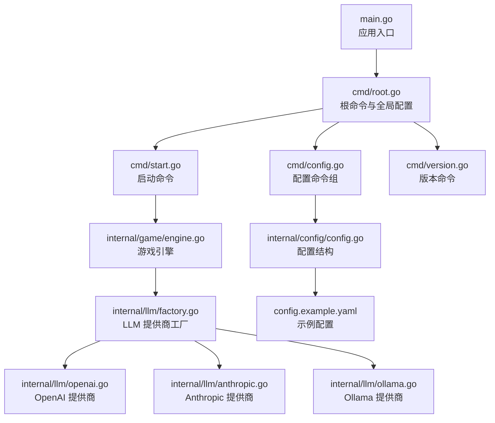
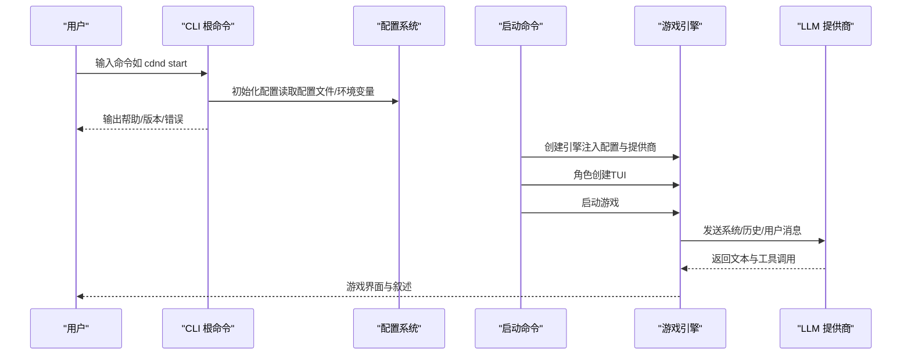
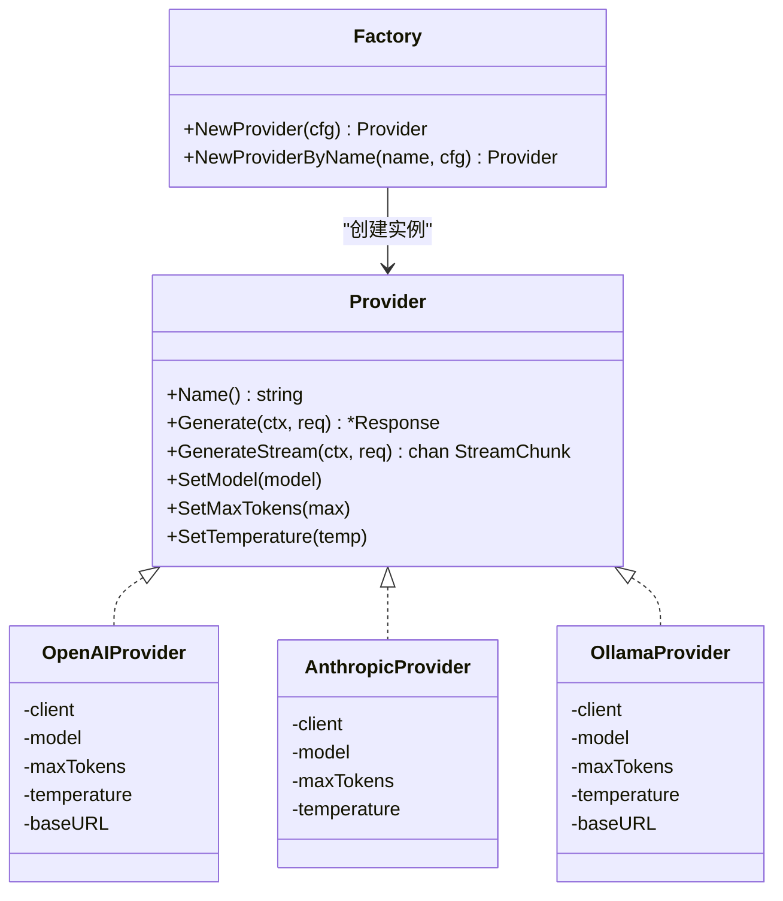
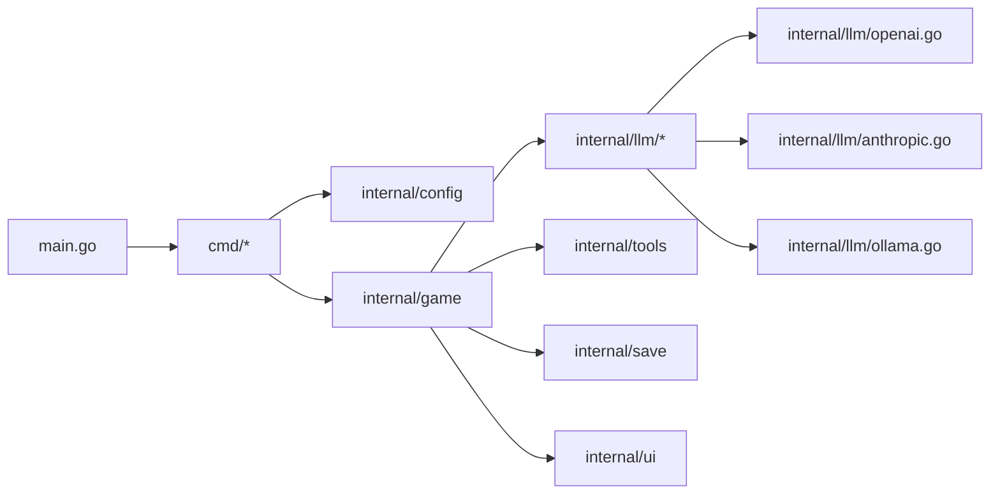

# 快速开始

<cite>
**本文引用的文件**
- [main.go](file://main.go)
- [go.mod](file://go.mod)
- [Makefile](file://Makefile)
- [cmd/root.go](file://cmd/root.go)
- [cmd/start.go](file://cmd/start.go)
- [cmd/config.go](file://cmd/config.go)
- [cmd/version.go](file://cmd/version.go)
- [internal/config/config.go](file://internal/config/config.go)
- [config.example.yaml](file://config.example.yaml)
- [internal/llm/provider.go](file://internal/llm/provider.go)
- [internal/llm/factory.go](file://internal/llm/factory.go)
- [internal/llm/openai.go](file://internal/llm/openai.go)
- [internal/llm/anthropic.go](file://internal/llm/anthropic.go)
- [internal/llm/ollama.go](file://internal/llm/ollama.go)
- [internal/game/engine.go](file://internal/game/engine.go)
</cite>

## 目录
1. [简介](#简介)
2. [项目结构](#项目结构)
3. [核心组件](#核心组件)
4. [架构总览](#架构总览)
5. [详细组件分析](#详细组件分析)
6. [依赖分析](#依赖分析)
7. [性能考虑](#性能考虑)
8. [故障排除指南](#故障排除指南)
9. [结论](#结论)
10. [附录](#附录)

## 简介
本指南面向首次接触 CDND 的用户，目标是在约 30 分钟内完成安装、配置与首次运行，体验由 LLM 驱动的命令行 D&D 冒险。你将学到：
- 如何准备 Go 环境与项目依赖
- 如何初始化配置文件并配置首个 LLM 提供商（OpenAI 或 Anthropic）
- 如何使用 CLI 命令启动游戏、查看帮助与管理配置
- 如何解决常见初始配置问题
- 面向不同操作系统的安装要点

## 项目结构
CDND 采用模块化分层组织：
- cmd 层：CLI 命令入口与子命令（启动、配置、版本等）
- internal：核心业务逻辑（游戏引擎、LLM 抽象与提供商、配置、UI、规则、存档、工具注册等）
- pkg：可复用的领域工具（如骰子）
- scenarios/data/docs：场景与资源数据
- 根目录：入口程序 main.go、构建脚本 Makefile、依赖清单 go.mod、示例配置 config.example.yaml

图表来源
- [main.go:1-8](file://main.go#L1-L8)
- [cmd/root.go:24-95](file://cmd/root.go#L24-L95)
- [cmd/start.go:22-99](file://cmd/start.go#L22-L99)
- [cmd/config.go:13-124](file://cmd/config.go#L13-L124)
- [cmd/version.go:11-27](file://cmd/version.go#L11-L27)
- [internal/game/engine.go:35-56](file://internal/game/engine.go#L35-L56)
- [internal/llm/factory.go:9-41](file://internal/llm/factory.go#L9-L41)
- [internal/llm/openai.go:11-39](file://internal/llm/openai.go#L11-L39)
- [internal/llm/anthropic.go:11-39](file://internal/llm/anthropic.go#L11-L39)
- [internal/llm/ollama.go:11-43](file://internal/llm/ollama.go#L11-L43)
- [internal/config/config.go:8-54](file://internal/config/config.go#L8-L54)
- [config.example.yaml:1-72](file://config.example.yaml#L1-L72)

章节来源
- [main.go:1-8](file://main.go#L1-L8)
- [cmd/root.go:24-95](file://cmd/root.go#L24-L95)
- [internal/config/config.go:8-54](file://internal/config/config.go#L8-L54)
- [config.example.yaml:1-72](file://config.example.yaml#L1-L72)

## 核心组件
- CLI 根命令与全局配置：负责初始化配置、设置帮助与全局标志（如 debug、config 路径）。
- 启动命令：创建 LLM 提供商、游戏引擎，引导角色创建，进入游戏 TUI。
- 配置命令组：初始化配置文件、查看/设置配置项。
- 游戏引擎：封装状态、规则、世界、工具注册、存档与 LLM 交互循环。
- LLM 抽象与提供商：统一的消息、请求/响应、流式接口；支持 OpenAI、Anthropic、Ollama。

章节来源
- [cmd/root.go:24-95](file://cmd/root.go#L24-L95)
- [cmd/start.go:22-99](file://cmd/start.go#L22-L99)
- [cmd/config.go:13-124](file://cmd/config.go#L13-L124)
- [internal/game/engine.go:22-56](file://internal/game/engine.go#L22-L56)
- [internal/llm/provider.go:64-83](file://internal/llm/provider.go#L64-L83)

## 架构总览
CDND 的运行时交互以“CLI 命令 → 游戏引擎 → LLM 提供商”为主线，同时通过配置系统贯穿全局。

图表来源
- [cmd/root.go:31-37](file://cmd/root.go#L31-L37)
- [cmd/start.go:29-89](file://cmd/start.go#L29-L89)
- [internal/game/engine.go:197-316](file://internal/game/engine.go#L197-L316)
- [internal/llm/factory.go:9-41](file://internal/llm/factory.go#L9-L41)

## 详细组件分析

### 安装与编译（跨平台）
- 环境要求
  - Go 版本：项目声明使用 Go 1.24.2。
  - 平台：支持 Linux、macOS、Windows（amd64），以及 macOS arm64。
- 依赖安装
  - 使用模块管理器下载依赖。
- 编译与运行
  - 通过 Makefile 提供 build、run、install、test、lint、fmt、tidy、deps、build-all 等常用目标。
  - 开发模式可直接运行或构建后运行。

章节来源
- [go.mod:3](file://go.mod#L3)
- [Makefile:26-51](file://Makefile#L26-L51)
- [Makefile:79-105](file://Makefile#L79-L105)

### 配置系统与首次初始化
- 配置位置与加载
  - 默认在用户主目录下的 .cdnd/config.yaml 中查找配置文件。
  - 支持通过 --config 指定路径，支持环境变量覆盖。
- 初始化配置
  - 使用配置命令组初始化配置文件，生成默认配置。
- 关键配置项
  - LLM.default_provider：默认提供商（openai/anthropic/ollama）
  - providers.openai/anthropic/ollama：API 密钥、模型、基础 URL、最大 token、温度等
  - game.display.advanced：游戏、显示、高级设置（自动保存、历史轮数、语言、打字机效果、日志级别等）

章节来源
- [cmd/root.go:69-94](file://cmd/root.go#L69-L94)
- [cmd/config.go:21-36](file://cmd/config.go#L21-L36)
- [config.example.yaml:5-72](file://config.example.yaml#L5-L72)
- [internal/config/config.go:8-54](file://internal/config/config.go#L8-L54)

### 配置首个 LLM 提供商（OpenAI 或 Anthropic）
- OpenAI
  - 在配置中设置 default_provider 为 openai，并填写 API 密钥与模型。
  - 可选设置基础 URL（兼容服务）、最大 token、温度。
- Anthropic
  - 设置 default_provider 为 anthropic，并填写 API 密钥与模型。
  - 可选设置最大 token、温度。
- Ollama（本地）
  - 设置 default_provider 为 ollama，无需 API 密钥。
  - 可设置本地基础 URL、模型、最大 token、温度。

章节来源
- [config.example.yaml:11-39](file://config.example.yaml#L11-L39)
- [internal/llm/openai.go:21-34](file://internal/llm/openai.go#L21-L34)
- [internal/llm/anthropic.go:19-34](file://internal/llm/anthropic.go#L19-L34)
- [internal/llm/ollama.go:21-38](file://internal/llm/ollama.go#L21-L38)

### CLI 命令使用
- 查看帮助
  - 根命令自带帮助；隐藏默认 help 子命令，便于自定义帮助策略。
- 查看版本
  - 显示版本号、Git 提交、构建日期、Go 版本与系统架构。
- 初始化配置
  - 创建 ~/.cdnd/config.yaml 并打印路径。
- 查看/设置配置
  - 不带参数查看全部配置；带键查看对应值；设置键值并保存。
- 启动游戏
  - 新开一局，可指定存档槽位、剧本与跳过角色创建（测试用途）。
  - 引导角色创建 TUI，随后进入游戏 TUI。

章节来源
- [cmd/root.go:54-61](file://cmd/root.go#L54-L61)
- [cmd/version.go:11-27](file://cmd/version.go#L11-L27)
- [cmd/config.go:21-124](file://cmd/config.go#L21-L124)
- [cmd/start.go:22-99](file://cmd/start.go#L22-L99)

### 第一次运行全流程（从安装到启动）
- 步骤概览
  1) 准备 Go 环境（满足 go.mod 中的版本要求）
  2) 克隆/获取源码并安装依赖
  3) 初始化配置文件
  4) 配置首选 LLM 提供商（OpenAI 或 Anthropic）
  5) 运行启动命令，完成角色创建并进入游戏
- 详细步骤
  - 安装依赖：使用模块管理器下载依赖。
  - 初始化配置：执行配置初始化命令，生成默认配置文件。
  - 配置提供商：编辑配置文件，设置 default_provider 与对应提供商的 API 密钥、模型等。
  - 启动游戏：执行启动命令，按提示完成角色创建，进入游戏界面。
  - 可选：查看版本信息与帮助，检查配置项。

章节来源
- [Makefile:66-69](file://Makefile#L66-L69)
- [cmd/config.go:28-35](file://cmd/config.go#L28-L35)
- [config.example.yaml:5-72](file://config.example.yaml#L5-L72)
- [cmd/start.go:29-89](file://cmd/start.go#L29-L89)
- [cmd/version.go:15-21](file://cmd/version.go#L15-L21)

### LLM 抽象与提供商工厂
- Provider 接口
  - 统一的 Generate/GenerateStream、模型/最大 token/温度设置方法。
- 请求/响应模型
  - 消息、请求、响应、使用统计、流式数据块等结构。
- 工厂
  - 根据配置选择 OpenAI、Anthropic 或 Ollama 提供商实例。
- 兼容性
  - Ollama 使用 OpenAI 兼容 API，底层复用 OpenAI 客户端。

图表来源
- [internal/llm/provider.go:64-83](file://internal/llm/provider.go#L64-L83)
- [internal/llm/openai.go:11-39](file://internal/llm/openai.go#L11-L39)
- [internal/llm/anthropic.go:11-39](file://internal/llm/anthropic.go#L11-L39)
- [internal/llm/ollama.go:11-43](file://internal/llm/ollama.go#L11-L43)
- [internal/llm/factory.go:9-41](file://internal/llm/factory.go#L9-L41)

## 依赖分析
- 外部依赖
  - Cobra/Viper：CLI 与配置管理
  - OpenAI SDK：OpenAI 提供商
  - Anthropic SDK：Anthropic 提供商
  - Bubble Tea：终端 UI
  - UUID：会话标识
- 项目内部模块
  - internal/config：配置结构与默认值
  - internal/llm：LLM 抽象与提供商
  - internal/game：游戏引擎与事件
  - internal/tools：工具注册与执行
  - internal/ui：TUI 界面
  - internal/save：存档管理
  - pkg/dice：骰子与表达式解析

图表来源
- [main.go:1-8](file://main.go#L1-L8)
- [cmd/root.go:4-11](file://cmd/root.go#L4-L11)
- [internal/game/engine.go:3-20](file://internal/game/engine.go#L3-L20)
- [internal/llm/factory.go:3-7](file://internal/llm/factory.go#L3-L7)

章节来源
- [go.mod:5-14](file://go.mod#L5-L14)
- [internal/game/engine.go:3-20](file://internal/game/engine.go#L3-L20)

## 性能考虑
- 响应缓存：可通过高级设置启用缓存并配置 TTL，减少重复请求。
- 自动保存：开启自动保存并设置合理间隔，避免长时间游玩丢失进度。
- 历史轮数：限制最大历史回合数，平衡上下文长度与性能。
- 日志级别：生产环境建议调整日志级别，降低 I/O 压力。

章节来源
- [config.example.yaml:62-72](file://config.example.yaml#L62-L72)
- [internal/game/engine.go:152-178](file://internal/game/engine.go#L152-L178)

## 故障排除指南
- 无法找到配置文件
  - 确认配置初始化命令已执行，生成 ~/.cdnd/config.yaml。
  - 或使用 --config 指定配置路径。
- LLM 提供商初始化失败
  - 检查 default_provider 是否正确，且对应提供商的配置存在。
  - 确认 API 密钥、模型、基础 URL 设置正确。
- 启动游戏报错
  - 检查配置项是否完整（如语言、最大历史轮数等）。
  - 查看版本命令输出的 Go 版本与系统架构是否符合预期。
- 本地模型（Ollama）连接失败
  - 确认本地服务地址与端口正确，默认 http://localhost:11434。
  - 确认已拉取所需模型并在服务中可用。

章节来源
- [cmd/root.go:69-94](file://cmd/root.go#L69-L94)
- [cmd/config.go:28-35](file://cmd/config.go#L28-L35)
- [internal/llm/factory.go:11-41](file://internal/llm/factory.go#L11-L41)
- [internal/llm/ollama.go:22-38](file://internal/llm/ollama.go#L22-L38)
- [cmd/version.go:15-21](file://cmd/version.go#L15-L21)

## 结论
通过本快速开始指南，你已经完成了 CDND 的安装、配置与首次运行。建议在熟悉基础命令后，进一步探索配置项与工具系统，逐步深入体验由 LLM 驱动的 D&D 冒险。

## 附录

### CLI 命令一览
- cdnd：根命令，提供全局选项与帮助
- cdnd version：显示版本与构建信息
- cdnd config init：初始化配置文件
- cdnd config get [key]：查看配置值
- cdnd config set <key> <value>：设置配置值
- cdnd start：开始新游戏，支持存档槽位、剧本与跳过创建

章节来源
- [cmd/root.go:24-61](file://cmd/root.go#L24-L61)
- [cmd/version.go:11-27](file://cmd/version.go#L11-L27)
- [cmd/config.go:13-124](file://cmd/config.go#L13-L124)
- [cmd/start.go:22-99](file://cmd/start.go#L22-L99)