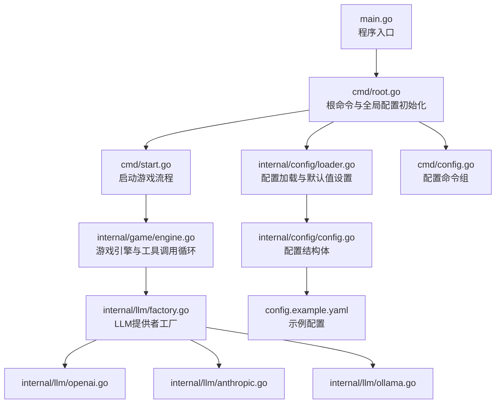
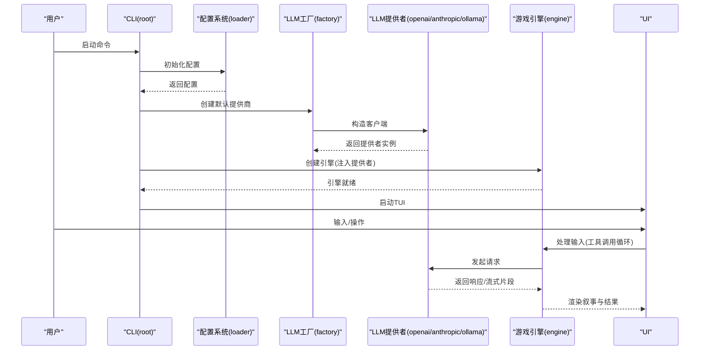
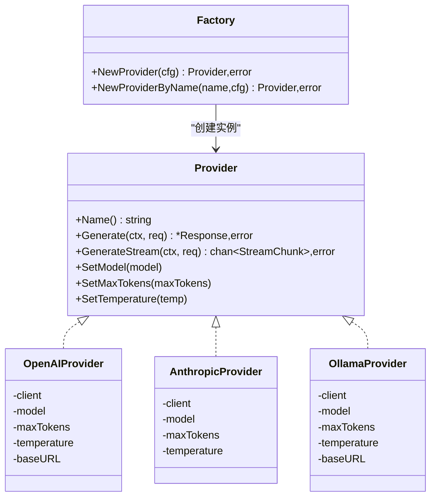
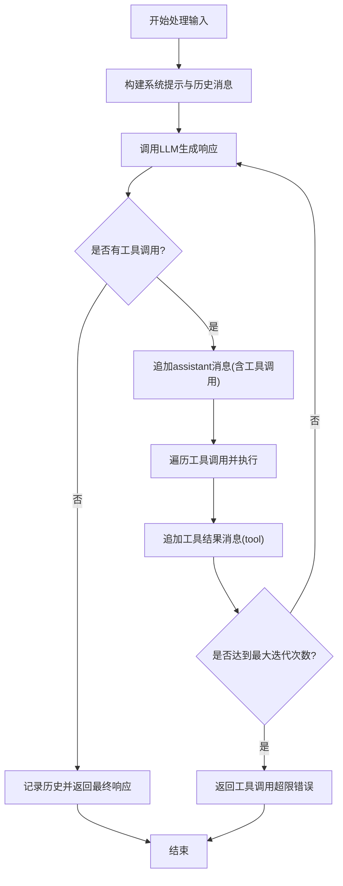
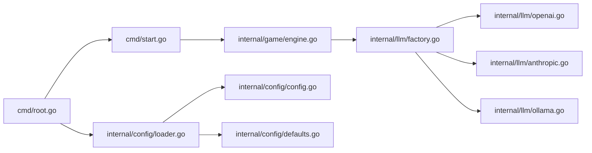

# 故障排除与常见问题

<cite>
**本文引用的文件**
- [main.go](file://main.go)
- [root.go](file://cmd/root.go)
- [config.go](file://cmd/config.go)
- [start.go](file://cmd/start.go)
- [config.go](file://internal/config/config.go)
- [loader.go](file://internal/config/loader.go)
- [defaults.go](file://internal/config/defaults.go)
- [provider.go](file://internal/llm/provider.go)
- [factory.go](file://internal/llm/factory.go)
- [openai.go](file://internal/llm/openai.go)
- [anthropic.go](file://internal/llm/anthropic.go)
- [ollama.go](file://internal/llm/ollama.go)
- [engine.go](file://internal/game/engine.go)
- [events.go](file://internal/game/events.go)
- [config.example.yaml](file://config.example.yaml)
</cite>

## 目录
1. [简介](#简介)
2. [项目结构](#项目结构)
3. [核心组件](#核心组件)
4. [架构总览](#架构总览)
5. [详细组件分析](#详细组件分析)
6. [依赖分析](#依赖分析)
7. [性能考虑](#性能考虑)
8. [故障排除指南](#故障排除指南)
9. [结论](#结论)
10. [附录](#附录)

## 简介
本文件面向CDND项目的使用者与技术支持人员，提供系统化的故障排除与常见问题解答。内容涵盖安装与配置、LLM提供商连接失败、API密钥错误、网络超时、性能问题（内存泄漏、CPU占用高、响应慢）、配置错误模式与修复步骤、日志分析与调试技巧、社区支持渠道以及标准化问题处理流程。为保证时效性与准确性，所有建议均基于仓库源码与配置示例文件进行提炼。

## 项目结构
CDND采用模块化设计，CLI入口负责参数解析与配置初始化；内部模块按职责划分：配置管理、LLM抽象与多提供商实现、游戏引擎与事件系统、UI交互等。关键入口与模块如下：

图表来源
- [main.go:1-8](file://main.go#L1-L8)
- [root.go:1-95](file://cmd/root.go#L1-L95)
- [loader.go:1-151](file://internal/config/loader.go#L1-L151)
- [config.go:1-54](file://internal/config/config.go#L1-L54)
- [start.go:1-99](file://cmd/start.go#L1-L99)
- [engine.go:1-797](file://internal/game/engine.go#L1-L797)
- [factory.go:1-69](file://internal/llm/factory.go#L1-L69)
- [openai.go:1-257](file://internal/llm/openai.go#L1-L257)
- [anthropic.go:1-269](file://internal/llm/anthropic.go#L1-L269)
- [ollama.go:1-261](file://internal/llm/ollama.go#L1-L261)
- [config.go:1-124](file://cmd/config.go#L1-L124)
- [config.example.yaml:1-72](file://config.example.yaml#L1-L72)

章节来源
- [main.go:1-8](file://main.go#L1-L8)
- [root.go:1-95](file://cmd/root.go#L1-L95)
- [loader.go:1-151](file://internal/config/loader.go#L1-L151)
- [config.go:1-54](file://internal/config/config.go#L1-L54)
- [start.go:1-99](file://cmd/start.go#L1-L99)
- [engine.go:1-797](file://internal/game/engine.go#L1-L797)
- [factory.go:1-69](file://internal/llm/factory.go#L1-L69)
- [openai.go:1-257](file://internal/llm/openai.go#L1-L257)
- [anthropic.go:1-269](file://internal/llm/anthropic.go#L1-L269)
- [ollama.go:1-261](file://internal/llm/ollama.go#L1-L261)
- [config.go:1-124](file://cmd/config.go#L1-L124)
- [config.example.yaml:1-72](file://config.example.yaml#L1-L72)

## 核心组件
- CLI与配置
  - 根命令负责全局初始化、调试开关、配置文件路径与环境变量绑定。
  - 配置系统支持默认值、用户目录下的配置文件、Viper环境变量覆盖。
- LLM抽象与工厂
  - Provider接口统一不同提供商的调用方式；工厂根据配置选择OpenAI、Anthropic或Ollama。
- 游戏引擎
  - 实现“调用LLM→执行工具→反馈结果”的代理循环；支持工具叙事渲染与事件分发。

章节来源
- [root.go:31-67](file://cmd/root.go#L31-L67)
- [loader.go:24-70](file://internal/config/loader.go#L24-L70)
- [config.go:8-54](file://internal/config/config.go#L8-L54)
- [factory.go:9-41](file://internal/llm/factory.go#L9-L41)
- [provider.go:64-83](file://internal/llm/provider.go#L64-L83)
- [engine.go:195-316](file://internal/game/engine.go#L195-L316)

## 架构总览
CDND的运行时流程从CLI入口开始，经过配置初始化、LLM提供者创建、游戏引擎初始化，最终进入UI交互。关键错误点集中在配置缺失、提供商不可达、工具调用超限等。

图表来源
- [root.go:31-67](file://cmd/root.go#L31-L67)
- [loader.go:24-70](file://internal/config/loader.go#L24-L70)
- [factory.go:9-41](file://internal/llm/factory.go#L9-L41)
- [openai.go:42-125](file://internal/llm/openai.go#L42-L125)
- [anthropic.go:42-139](file://internal/llm/anthropic.go#L42-L139)
- [ollama.go:46-129](file://internal/llm/ollama.go#L46-L129)
- [engine.go:195-316](file://internal/game/engine.go#L195-L316)
- [start.go:29-89](file://cmd/start.go#L29-L89)

## 详细组件分析

### LLM提供者抽象与工厂
- Provider接口定义统一的生成与流式接口，并允许设置模型、最大Token与温度等参数。
- 工厂根据配置中的默认提供商名称选择具体实现；若未配置或未知名称将报错。

图表来源
- [provider.go:64-83](file://internal/llm/provider.go#L64-L83)
- [openai.go:12-34](file://internal/llm/openai.go#L12-L34)
- [anthropic.go:12-34](file://internal/llm/anthropic.go#L12-L34)
- [ollama.go:12-38](file://internal/llm/ollama.go#L12-L38)
- [factory.go:9-41](file://internal/llm/factory.go#L9-L41)

章节来源
- [provider.go:18-114](file://internal/llm/provider.go#L18-L114)
- [factory.go:9-69](file://internal/llm/factory.go#L9-L69)
- [openai.go:12-34](file://internal/llm/openai.go#L12-L34)
- [anthropic.go:12-34](file://internal/llm/anthropic.go#L12-L34)
- [ollama.go:12-38](file://internal/llm/ollama.go#L12-L38)

### 游戏引擎与工具调用循环
- 引擎在每次处理中构建系统提示与历史上下文，调用LLM后检查是否存在工具调用；若有则执行工具并将结果作为tool消息回传，最多循环固定次数。
- 错误处理明确区分LLM调用失败与工具调用超限。

图表来源
- [engine.go:195-316](file://internal/game/engine.go#L195-L316)

章节来源
- [engine.go:195-316](file://internal/game/engine.go#L195-L316)

### 配置系统与默认值
- 配置文件位于用户主目录下的“.cdnd”目录，默认文件可通过命令初始化。
- 默认值在代码中集中定义，同时支持Viper的环境变量覆盖与自动读取。

章节来源
- [loader.go:24-70](file://internal/config/loader.go#L24-L70)
- [defaults.go:7-51](file://internal/config/defaults.go#L7-L51)
- [config.go:8-54](file://internal/config/config.go#L8-L54)
- [config.go:1-124](file://cmd/config.go#L1-L124)
- [config.example.yaml:1-72](file://config.example.yaml#L1-L72)

## 依赖分析
- CLI层依赖配置系统与游戏引擎；配置系统依赖Viper与用户主目录；LLM层依赖各提供商SDK；游戏引擎依赖规则、工具注册表、存档与世界管理。
- 关键耦合点：配置未初始化导致LLM工厂无法创建；LLM工厂根据默认提供商名称映射，名称错误直接报错；引擎工具调用循环受工具注册与LLM响应影响。

图表来源
- [root.go:1-95](file://cmd/root.go#L1-L95)
- [loader.go:1-151](file://internal/config/loader.go#L1-L151)
- [start.go:1-99](file://cmd/start.go#L1-L99)
- [engine.go:1-797](file://internal/game/engine.go#L1-L797)
- [factory.go:1-69](file://internal/llm/factory.go#L1-L69)
- [openai.go:1-257](file://internal/llm/openai.go#L1-L257)
- [anthropic.go:1-269](file://internal/llm/anthropic.go#L1-L269)
- [ollama.go:1-261](file://internal/llm/ollama.go#L1-L261)
- [config.go:1-54](file://internal/config/config.go#L1-L54)
- [defaults.go:1-52](file://internal/config/defaults.go#L1-L52)

章节来源
- [root.go:1-95](file://cmd/root.go#L1-L95)
- [loader.go:1-151](file://internal/config/loader.go#L1-L151)
- [start.go:1-99](file://cmd/start.go#L1-L99)
- [engine.go:1-797](file://internal/game/engine.go#L1-L797)
- [factory.go:1-69](file://internal/llm/factory.go#L1-L69)
- [openai.go:1-257](file://internal/llm/openai.go#L1-L257)
- [anthropic.go:1-269](file://internal/llm/anthropic.go#L1-L269)
- [ollama.go:1-261](file://internal/llm/ollama.go#L1-L261)
- [config.go:1-54](file://internal/config/config.go#L1-L54)
- [defaults.go:1-52](file://internal/config/defaults.go#L1-L52)

## 性能考虑
- CPU占用与响应慢
  - 工具调用循环默认最多10次迭代，若频繁触发工具调用可能导致CPU占用升高。可调整历史轮数上限与日志级别，减少不必要的上下文长度与日志开销。
  - 流式输出通道缓冲区大小固定，长时间高并发流式请求可能造成阻塞。建议在高负载场景下降低并发或增加缓冲容量。
- 内存泄漏
  - 引擎在加载/保存时会重置状态对象字段而非新建对象，避免外部引用失效；但工具注册表与事件分发器需确保无长期持有引用。建议定期检查事件订阅清理与工具结果对象生命周期。
- 响应缓慢
  - LLM提供商的网络延迟与模型响应时间为主要瓶颈。可通过缩短历史轮数、降低最大Token、关闭非必要功能（如彩色输出、打字机效果）缓解UI渲染压力。

章节来源
- [engine.go:195-316](file://internal/game/engine.go#L195-L316)
- [engine.go:101-150](file://internal/game/engine.go#L101-L150)
- [engine.go:152-178](file://internal/game/engine.go#L152-L178)
- [config.go:31-45](file://internal/config/config.go#L31-L45)

## 故障排除指南

### 一、安装与首次运行
- 症状：启动时报“配置初始化失败”或找不到配置文件。
  - 检查主目录下“.cdnd/config.yaml”是否存在；若不存在，使用配置初始化命令创建。
  - 确认用户主目录可写且Viper可访问。
- 症状：启动后立即退出或报错。
  - 使用调试模式运行以获取更详细输出；检查全局标志与环境变量是否正确绑定。

章节来源
- [root.go:31-37](file://cmd/root.go#L31-L37)
- [root.go:64-67](file://cmd/root.go#L64-L67)
- [config.go:28-35](file://cmd/config.go#L28-L35)
- [loader.go:24-70](file://internal/config/loader.go#L24-L70)

### 二、LLM提供商连接失败
- 症状：创建LLM提供者失败或调用LLM时报网络错误。
  - 检查默认提供商名称是否在配置中存在；工厂会根据名称映射到具体实现，未知名称将报错。
  - OpenAI/Anthropic/Ollama各自的SDK错误需分别排查：网络连通性、代理设置、API密钥、BaseURL与模型名称。
  - 若使用Ollama，请确认本地服务地址与端口正确，或显式配置BaseURL。
- 症状：调用LLM后无响应或超时。
  - 适当提高超时时间（在各自SDK层面配置），减少历史轮数与最大Token，降低模型复杂度。
  - 检查网络策略与防火墙，确保可访问提供商域名。

章节来源
- [factory.go:11-41](file://internal/llm/factory.go#L11-L41)
- [openai.go:89-92](file://internal/llm/openai.go#L89-L92)
- [anthropic.go:101-104](file://internal/llm/anthropic.go#L101-L104)
- [ollama.go:93-96](file://internal/llm/ollama.go#L93-L96)
- [engine.go:237-244](file://internal/game/engine.go#L237-L244)

### 三、API密钥错误
- 症状：提供商返回认证失败或权限不足。
  - 确认配置文件中的API密钥字段已填写；若留空，需通过环境变量提供（OpenAI示例配置展示了环境变量占位）。
  - Anthropic与OpenAI的SDK对密钥格式敏感，确保无多余空白字符。
- 症状：Ollama无需密钥，但连接失败。
  - 检查本地Ollama服务是否运行，BaseURL是否可达。

章节来源
- [config.example.yaml:14-15](file://config.example.yaml#L14-L15)
- [openai.go:22-25](file://internal/llm/openai.go#L22-L25)
- [anthropic.go:21-24](file://internal/llm/anthropic.go#L21-L24)
- [ollama.go:23-29](file://internal/llm/ollama.go#L23-L29)

### 四、网络超时与不稳定
- 症状：请求在SDK层抛出超时或EOF错误。
  - 适当增大超时阈值；减少并发请求；检查代理与DNS配置。
  - 对于流式响应，确保客户端能持续接收数据块，避免阻塞。
- 症状：流式输出中断或提前结束。
  - 检查流式通道的关闭时机与错误传播；确保在EOF时正确发送完成信号。

章节来源
- [openai.go:176-211](file://internal/llm/openai.go#L176-L211)
- [anthropic.go:201-227](file://internal/llm/anthropic.go#L201-L227)
- [ollama.go:180-215](file://internal/llm/ollama.go#L180-L215)

### 五、配置错误与修复步骤
- 常见错误模式
  - 默认提供商名称拼写错误或不存在于配置中。
  - 模型名称或BaseURL不正确，导致SDK构造失败。
  - 最大Token过大，引发响应截断或超时。
  - 日志级别过高导致I/O开销增大。
- 修复步骤
  - 使用配置命令查看/设置键值；必要时重新初始化配置文件。
  - 逐项核对示例配置中的字段与取值范围；优先使用最小可行配置验证链路。
  - 通过环境变量覆盖关键配置，避免明文泄露。

章节来源
- [config.go:28-35](file://cmd/config.go#L28-L35)
- [config.go:46-83](file://cmd/config.go#L46-L83)
- [config.go:118-125](file://cmd/config.go#L118-L125)
- [config.example.yaml:1-72](file://config.example.yaml#L1-L72)
- [defaults.go:7-51](file://internal/config/defaults.go#L7-L51)

### 六、日志分析与调试技巧
- 启用调试模式
  - 通过全局调试标志开启详细日志输出，便于定位配置与运行时错误。
- 日志级别与文件
  - 配置中可设置日志级别与输出文件路径；生产环境建议落盘以便事后分析。
- 事件与工具叙事
  - 引擎在工具执行后生成D&D风格的叙事文本，结合事件分发器可辅助定位问题发生环节。

章节来源
- [root.go:64-67](file://cmd/root.go#L64-L67)
- [config.go:48-53](file://internal/config/config.go#L48-L53)
- [engine.go:466-512](file://internal/game/engine.go#L466-L512)
- [events.go:171-204](file://internal/game/events.go#L171-L204)

### 七、性能问题诊断与优化
- 诊断
  - 使用系统监控工具观察CPU、内存与网络使用情况；关注工具调用循环的频率与耗时。
  - 检查历史轮数上限与日志级别，评估其对性能的影响。
- 优化
  - 降低最大历史轮数与最大Token；关闭非必要的UI特效（如彩色输出、打字机效果）。
  - 控制并发与流式通道缓冲大小；在高负载场景下限制工具调用频率。

章节来源
- [engine.go:195-316](file://internal/game/engine.go#L195-L316)
- [config.go:31-45](file://internal/config/config.go#L31-L45)

### 八、社区支持与获取帮助
- 当前仓库未内置社区支持链接；建议在问题复现后，先通过以下步骤自检：
  - 使用配置命令导出当前配置，确认关键字段正确。
  - 在调试模式下重现问题并收集输出。
  - 参考示例配置文件核对字段与取值范围。
- 如需进一步协助，可在项目Issue区提交问题并附上：
  - CDND版本信息（通过版本命令获取）
  - 完整的配置快照
  - 详细的错误日志与复现步骤

章节来源
- [root.go:13-18](file://cmd/root.go#L13-L18)
- [config.go:86-116](file://cmd/config.go#L86-L116)

### 九、标准化问题处理流程（技术支持）
- 步骤
  1) 确认配置文件存在且可读；若缺失则初始化配置文件。
  2) 核对默认提供商名称与对应配置项；修正拼写或添加缺失项。
  3) 验证API密钥与BaseURL；在环境变量中提供密钥时确保变量生效。
  4) 在调试模式下重现场景，收集错误栈与日志。
  5) 逐步简化配置（降低历史轮数、关闭特效、减少工具调用）以定位瓶颈。
  6) 对比示例配置，确认字段与取值范围。
  7) 必要时升级/切换提供商或调整网络策略。
- 输出
  - 问题描述、已验证项、已采取措施、最终结论与后续建议。

章节来源
- [loader.go:24-70](file://internal/config/loader.go#L24-L70)
- [factory.go:11-41](file://internal/llm/factory.go#L11-L41)
- [openai.go:22-25](file://internal/llm/openai.go#L22-L25)
- [anthropic.go:21-24](file://internal/llm/anthropic.go#L21-L24)
- [config.example.yaml:1-72](file://config.example.yaml#L1-L72)
- [root.go:64-67](file://cmd/root.go#L64-L67)

## 结论
本指南围绕CDND的配置、LLM提供商、游戏引擎与工具调用循环，系统梳理了常见问题与解决方案。通过规范的配置管理、严谨的错误处理与合理的性能优化策略，大多数问题均可快速定位与修复。建议在生产环境中配合日志落盘与事件监控，形成闭环的问题发现与处理机制。

## 附录
- 配置命令速查
  - 初始化配置文件：使用配置初始化命令创建默认配置。
  - 查看/设置配置键值：通过配置命令查看全部或指定键值，并持久化保存。
- 示例配置参考
  - 参考示例配置文件中的字段与默认值，确保与实际提供商一致。

章节来源
- [config.go:28-83](file://cmd/config.go#L28-L83)
- [config.example.yaml:1-72](file://config.example.yaml#L1-L72)