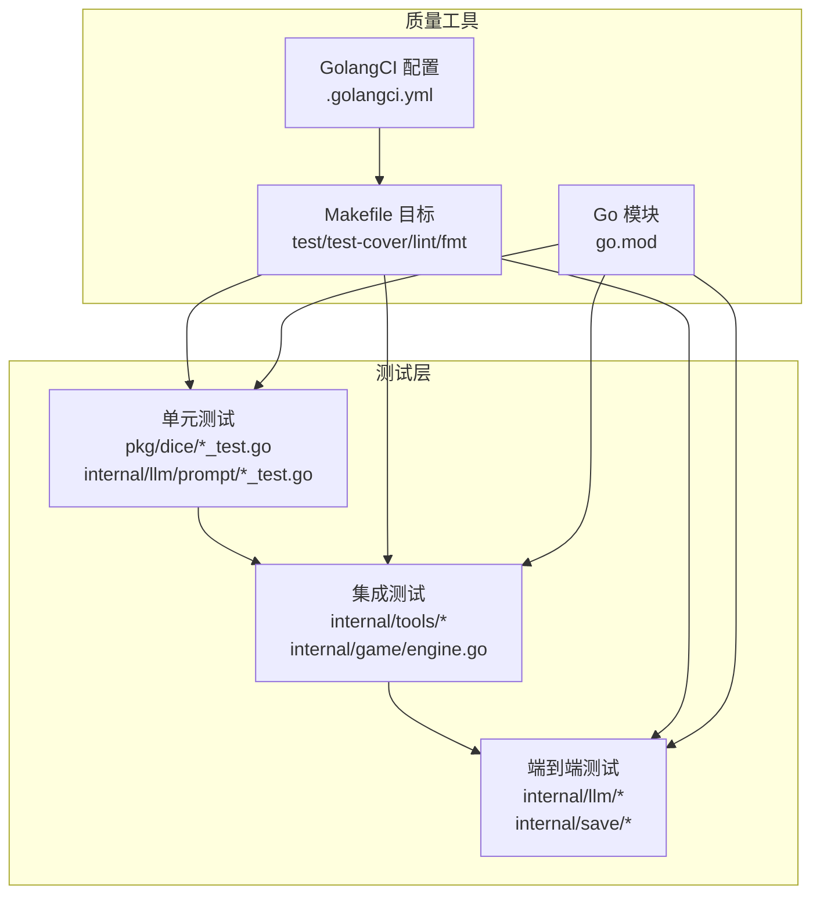
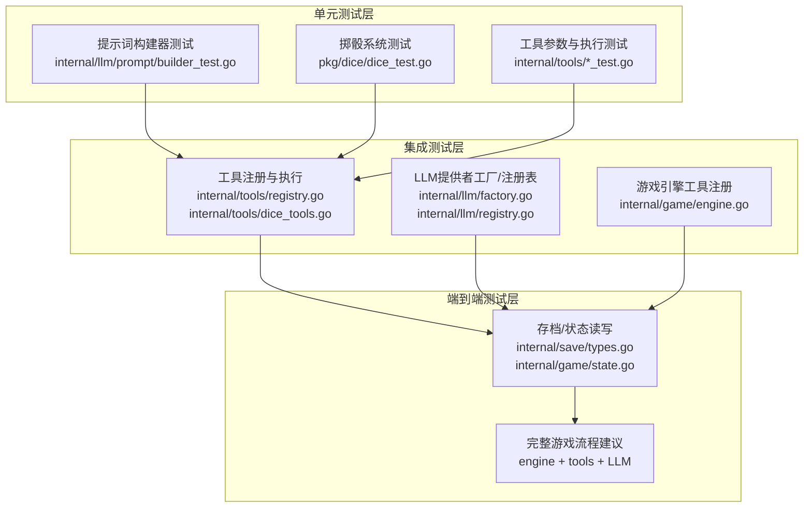
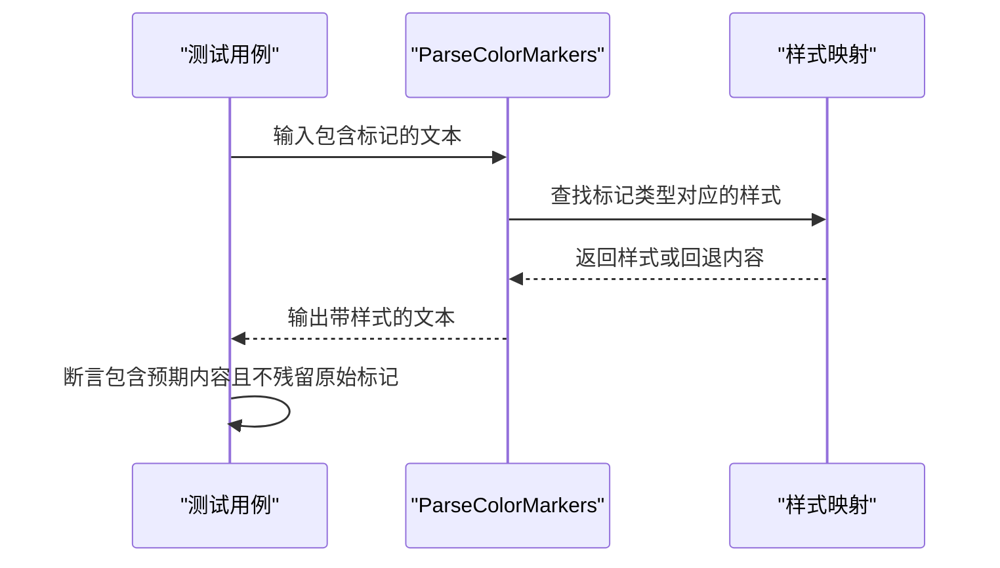
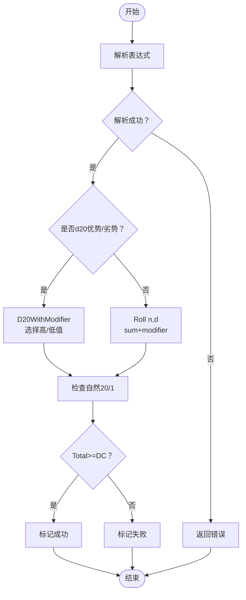
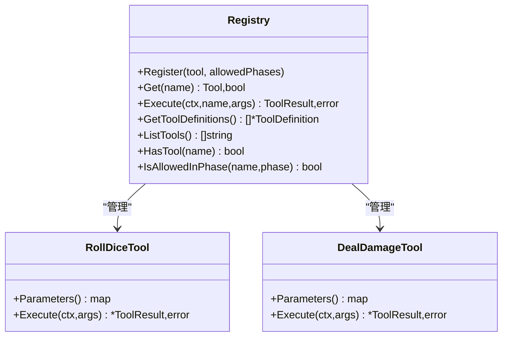
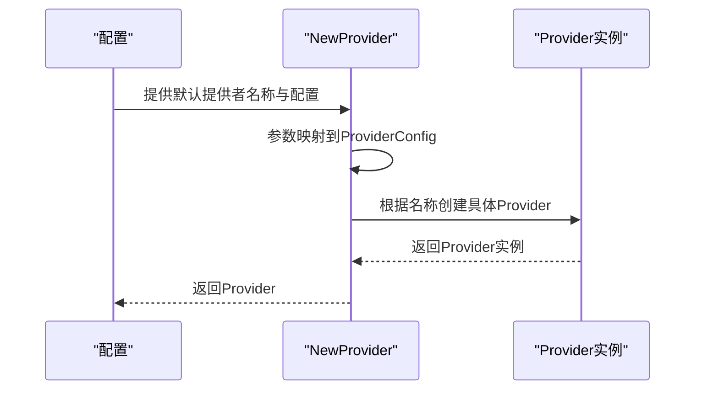
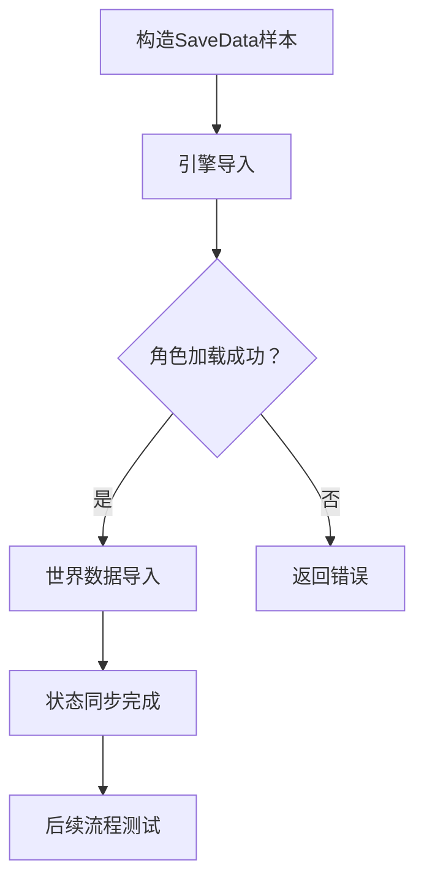
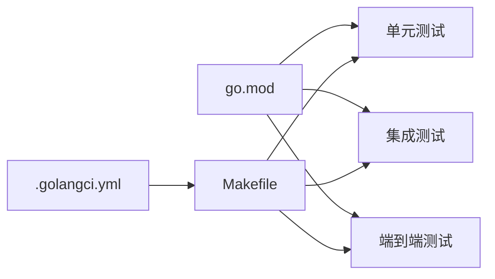

# 测试与质量保证

<cite>
**本文引用的文件**
- [.golangci.yml](file://.golangci.yml)
- [Makefile](file://Makefile)
- [go.mod](file://go.mod)
- [internal/llm/prompt/builder.go](file://internal/llm/prompt/builder.go)
- [internal/llm/prompt/builder_test.go](file://internal/llm/prompt/builder_test.go)
- [pkg/dice/dice.go](file://pkg/dice/dice.go)
- [pkg/dice/dice_test.go](file://pkg/dice/dice_test.go)
- [internal/tools/dice_tools.go](file://internal/tools/dice_tools.go)
- [internal/tools/character_tools.go](file://internal/tools/character_tools.go)
- [internal/tools/registry.go](file://internal/tools/registry.go)
- [internal/llm/provider.go](file://internal/llm/provider.go)
- [internal/llm/factory.go](file://internal/llm/factory.go)
- [internal/llm/registry.go](file://internal/llm/registry.go)
- [internal/game/engine.go](file://internal/game/engine.go)
- [internal/game/state.go](file://internal/game/state.go)
- [internal/save/types.go](file://internal/save/types.go)
</cite>

## 目录
1. [引言](#引言)
2. [项目结构](#项目结构)
3. [核心组件](#核心组件)
4. [架构总览](#架构总览)
5. [详细组件分析](#详细组件分析)
6. [依赖分析](#依赖分析)
7. [性能考虑](#性能考虑)
8. [故障排查指南](#故障排查指南)
9. [结论](#结论)
10. [附录](#附录)

## 引言
本文件面向CDND项目的测试与质量保证体系，系统化阐述测试策略与测试金字塔（单元测试、集成测试、端到端测试），并结合仓库中现有的测试实现，给出可操作的质量标准、静态分析与代码规范、持续集成与自动化流程建议、覆盖率要求、性能与基准测试方法、测试数据管理与模拟对象使用指南，以及面向贡献者的测试编写与维护指导。

## 项目结构
- 测试主要分布在以下位置：
  - 内置包与子模块的测试文件：例如 pkg/dice/dice_test.go、internal/llm/prompt/builder_test.go
  - 工具链与引擎集成测试：通过 internal/tools/* 与 internal/game/engine.go 的工具注册与执行路径
  - LLM提供者抽象与工厂：internal/llm/provider.go、internal/llm/factory.go、internal/llm/registry.go
  - 存档与状态：internal/save/types.go、internal/game/state.go
- 质量工具与自动化：
  - Makefile 提供测试、覆盖率、静态检查、格式化等常用命令
  - .golangci.yml 定义静态分析规则集与排除规则
  - go.mod 描述依赖版本与模块边界

图表来源
- [Makefile:34-61](file://Makefile#L34-L61)
- [.golangci.yml:1-106](file://.golangci.yml#L1-L106)
- [go.mod:1-55](file://go.mod#L1-L55)

章节来源
- [Makefile:1-105](file://Makefile#L1-L105)
- [.golangci.yml:1-106](file://.golangci.yml#L1-L106)
- [go.mod:1-55](file://go.mod#L1-L55)

## 核心组件
- 提示词构建器（Prompt Builder）
  - 功能：将模板与上下文拼装为系统提示词；支持颜色标记解析与样式渲染；支持历史截断与场景/角色上下文构建
  - 关键测试：验证颜色标记解析、样式映射完整性、上下文拼装正确性
- 掷骰系统（Dice）
  - 功能：提供 d20 标准/优势/劣势掷骰、表达式解析、成功判定、暴击识别
  - 关键测试：验证范围、表达式解析、优势/劣势逻辑、暴击判定
- 工具系统（Tools）
  - 功能：注册表管理工具、工具参数定义、工具执行（投骰、技能检定、豁免检定、造成/治疗伤害、状态增删等）
  - 关键测试：工具注册与执行、参数校验、叙事输出与数据返回
- LLM提供者抽象与工厂
  - 功能：统一的消息结构、请求/响应、流式分片；按配置创建不同提供者（OpenAI、Anthropic、Ollama）
  - 关键测试：提供者创建、参数映射、工具定义导出
- 存档与状态
  - 功能：存档数据结构、状态读写、回合数与标志/计数器管理、战斗初始化
  - 关键测试：状态导入/导出、标志/计数器一致性

章节来源
- [internal/llm/prompt/builder.go:1-273](file://internal/llm/prompt/builder.go#L1-L273)
- [internal/llm/prompt/builder_test.go:1-124](file://internal/llm/prompt/builder_test.go#L1-L124)
- [pkg/dice/dice.go:1-158](file://pkg/dice/dice.go#L1-L158)
- [pkg/dice/dice_test.go:1-204](file://pkg/dice/dice_test.go#L1-L204)
- [internal/tools/dice_tools.go:1-314](file://internal/tools/dice_tools.go#L1-L314)
- [internal/tools/character_tools.go:1-321](file://internal/tools/character_tools.go#L1-L321)
- [internal/tools/registry.go:1-132](file://internal/tools/registry.go#L1-L132)
- [internal/llm/provider.go:1-114](file://internal/llm/provider.go#L1-L114)
- [internal/llm/factory.go:1-69](file://internal/llm/factory.go#L1-L69)
- [internal/llm/registry.go:1-140](file://internal/llm/registry.go#L1-L140)
- [internal/game/engine.go:54-150](file://internal/game/engine.go#L54-L150)
- [internal/game/state.go:105-164](file://internal/game/state.go#L105-L164)
- [internal/save/types.go:110-147](file://internal/save/types.go#L110-L147)

## 架构总览
下图展示测试金字塔在CDND中的落地：单元测试覆盖核心算法与工具；集成测试覆盖工具注册与执行、LLM提供者创建与消息交互；端到端测试覆盖存档/状态与游戏引擎主流程。

图表来源
- [internal/llm/prompt/builder_test.go:1-124](file://internal/llm/prompt/builder_test.go#L1-L124)
- [pkg/dice/dice_test.go:1-204](file://pkg/dice/dice_test.go#L1-L204)
- [internal/tools/registry.go:1-132](file://internal/tools/registry.go#L1-L132)
- [internal/tools/dice_tools.go:1-314](file://internal/tools/dice_tools.go#L1-L314)
- [internal/llm/factory.go:1-69](file://internal/llm/factory.go#L1-L69)
- [internal/llm/registry.go:1-140](file://internal/llm/registry.go#L1-L140)
- [internal/game/engine.go:54-150](file://internal/game/engine.go#L54-L150)
- [internal/save/types.go:110-147](file://internal/save/types.go#L110-L147)
- [internal/game/state.go:105-164](file://internal/game/state.go#L105-L164)

## 详细组件分析

### 提示词构建器测试
- 测试要点
  - 颜色标记解析：number/keyword/status/combat/success/danger/quote 类型解析与样式应用
  - 样式映射完整性：确保每种标记类型在样式表中有对应映射
  - 上下文拼装：系统提示词、角色上下文、场景上下文、历史截断与开场提示词
  - 文本保留：解析后应保留非标记文本
- 测试策略
  - 参数化用例覆盖多种标记组合与边界情况（空内容、嵌套括号、未知类型）
  - 断言样式应用后的输出不包含原始标记（除特殊用例外）

图表来源
- [internal/llm/prompt/builder.go:28-49](file://internal/llm/prompt/builder.go#L28-L49)
- [internal/llm/prompt/builder_test.go:8-124](file://internal/llm/prompt/builder_test.go#L8-L124)

章节来源
- [internal/llm/prompt/builder.go:14-49](file://internal/llm/prompt/builder.go#L14-L49)
- [internal/llm/prompt/builder_test.go:8-124](file://internal/llm/prompt/builder_test.go#L8-L124)

### 掷骰系统测试
- 测试要点
  - 基础掷骰：n个s面骰的范围校验、数量校验
  - d20扩展：带调整值、优势/劣势、暴击/大失败识别
  - 表达式解析：支持 d20、1d20+5、1d20adv/dis 等
  - 成功判定：根据DC判断成功/失败
- 测试策略
  - 边界与异常：空表达式、非法字符串、空参数
  - 随机性验证：多次运行统计自然20/1出现比例，确保逻辑正确

图表来源
- [pkg/dice/dice.go:43-158](file://pkg/dice/dice.go#L43-L158)
- [pkg/dice/dice_test.go:7-204](file://pkg/dice/dice_test.go#L7-L204)

章节来源
- [pkg/dice/dice.go:9-158](file://pkg/dice/dice.go#L9-L158)
- [pkg/dice/dice_test.go:7-204](file://pkg/dice/dice_test.go#L7-L204)

### 工具系统测试
- 测试要点
  - 工具注册表：并发安全、工具存在性、权限阶段控制
  - 投骰工具：参数校验、表达式解析、叙事输出与数据返回
  - 角色工具：造成/治疗伤害、状态增删、参数校验与叙事输出
- 测试策略
  - 使用最小状态桩（StateAccessor）模拟角色状态，避免外部依赖
  - 对工具执行路径进行参数化测试，覆盖必填项缺失、数值越界等

图表来源
- [internal/tools/registry.go:10-132](file://internal/tools/registry.go#L10-L132)
- [internal/tools/dice_tools.go:12-71](file://internal/tools/dice_tools.go#L12-L71)
- [internal/tools/character_tools.go:8-101](file://internal/tools/character_tools.go#L8-L101)

章节来源
- [internal/tools/registry.go:25-116](file://internal/tools/registry.go#L25-L116)
- [internal/tools/dice_tools.go:38-71](file://internal/tools/dice_tools.go#L38-L71)
- [internal/tools/character_tools.go:46-101](file://internal/tools/character_tools.go#L46-L101)

### LLM提供者抽象与工厂测试
- 测试要点
  - Provider接口：Generate/GenerateStream/SetModel/SetMaxTokens/SetTemperature
  - 工厂：根据配置创建OpenAI/Anthropic/Ollama提供者，参数映射正确
  - 注册表：提供者注册、默认提供者切换、列表查询
- 测试策略
  - 使用最小配置桩，验证工厂返回的Provider满足接口契约
  - 验证未知提供者名称时的错误处理

图表来源
- [internal/llm/factory.go:9-69](file://internal/llm/factory.go#L9-L69)
- [internal/llm/provider.go:64-83](file://internal/llm/provider.go#L64-L83)
- [internal/llm/registry.go:22-139](file://internal/llm/registry.go#L22-L139)

章节来源
- [internal/llm/factory.go:9-69](file://internal/llm/factory.go#L9-L69)
- [internal/llm/provider.go:18-83](file://internal/llm/provider.go#L18-L83)
- [internal/llm/registry.go:22-139](file://internal/llm/registry.go#L22-L139)

### 存档与状态测试
- 测试要点
  - SaveData结构：角色、世界、场景、NPC、历史、战斗状态等字段
  - State：回合数、标志/计数器、任务、战斗初始化
  - 引擎：工具注册、状态导入/导出
- 测试策略
  - 构造最小SaveData样本，验证导入后角色与世界数据一致
  - 验证标志/计数器的增减与查询

图表来源
- [internal/save/types.go:110-147](file://internal/save/types.go#L110-L147)
- [internal/game/engine.go:124-150](file://internal/game/engine.go#L124-L150)
- [internal/game/state.go:105-164](file://internal/game/state.go#L105-L164)

章节来源
- [internal/save/types.go:110-147](file://internal/save/types.go#L110-L147)
- [internal/game/engine.go:124-150](file://internal/game/engine.go#L124-L150)
- [internal/game/state.go:105-164](file://internal/game/state.go#L105-L164)

## 依赖分析
- 模块依赖与测试耦合
  - 提示词构建器依赖样式库与角色/世界模型，测试应隔离样式库，重点验证解析与上下文拼装
  - 掷骰系统依赖加密安全随机源，测试关注范围与逻辑分支覆盖
  - 工具系统依赖规则引擎与状态访问器，测试通过桩对象模拟
  - LLM提供者工厂依赖配置模块，测试通过最小配置桩
- 质量工具
  - Makefile提供统一入口，.golangci.yml定义规则，go.mod约束依赖版本

图表来源
- [.golangci.yml:1-106](file://.golangci.yml#L1-L106)
- [Makefile:34-61](file://Makefile#L34-L61)
- [go.mod:1-55](file://go.mod#L1-L55)

章节来源
- [.golangci.yml:1-106](file://.golangci.yml#L1-L106)
- [Makefile:34-61](file://Makefile#L34-L61)
- [go.mod:1-55](file://go.mod#L1-L55)

## 性能考虑
- 单元测试
  - 使用参数化测试减少重复代码，提高覆盖度
  - 对随机性逻辑进行多次采样统计，而非依赖单一结果
- 集成测试
  - 使用内存态的最小状态桩，避免IO与外部服务
  - 对工具执行路径进行轻量回归，聚焦关键分支
- 端到端测试
  - 优先覆盖关键流程（存档/读档、工具链、LLM交互），逐步扩展
- 性能基准
  - 建议为提示词构建器与掷骰系统增加基准测试，监控热点路径性能变化

## 故障排查指南
- 测试失败定位
  - 单元测试：查看参数化用例与断言，确认输入/期望输出
  - 集成测试：检查工具注册顺序、参数解析、状态访问器是否为空
  - LLM测试：核对配置、API密钥、模型名称与最大token设置
- 覆盖率问题
  - 使用覆盖率报告定位未覆盖分支，补充边界用例
- 静态检查
  - 遵循GolangCI规则，修复告警后再提交

章节来源
- [Makefile:34-41](file://Makefile#L34-L41)
- [.golangci.yml:81-105](file://.golangci.yml#L81-L105)

## 结论
CDND当前已具备完善的测试基础：提示词构建器与掷骰系统的单元测试覆盖核心逻辑；工具系统与LLM提供者抽象形成清晰的集成测试边界；存档/状态与游戏引擎为主流程提供端到端测试入口。建议进一步完善端到端测试矩阵与性能基准，持续提升覆盖率与稳定性。

## 附录

### 测试金字塔与实施建议
- 单元测试（建议覆盖率≥80%）
  - 提示词构建器：颜色标记解析、样式映射、上下文拼装
  - 掷骰系统：表达式解析、优势/劣势、暴击判定、成功判定
  - 工具系统：参数校验、执行路径、叙事输出
- 集成测试（建议覆盖率≥60%）
  - 工具注册表并发安全、权限控制
  - LLM提供者工厂与注册表
  - 存档/状态导入/导出与引擎主流程
- 端到端测试（建议覆盖率≥40%）
  - 完整游戏会话（角色创建→场景探索→战斗→存档/读档）
  - 工具链与LLM交互闭环

### 代码质量标准与GolangCI配置
- 已启用的静态检查器：errcheck、gosimple、govet、ineffassign、staticcheck、unused、gofmt、goimports、misspell、revive、prealloc、typecheck、gocritic、dupl、exportloopref
- 测试文件排除规则：测试文件不运行gocyclo、errcheck、dupl、gosec
- 本地前缀与风格：goimports本地包前缀为github.com/zwh8800/cdnd

章节来源
- [.golangci.yml:5-106](file://.golangci.yml#L5-L106)

### 持续集成与自动化测试流程
- 常用命令
  - 测试与覆盖率：make test；生成HTML报告：make test-cover
  - 静态检查：make lint
  - 代码格式化：make fmt
- 建议在CI中执行
  - go mod tidy
  - make lint
  - make test -race -coverprofile=coverage.out ./...
  - 上传覆盖率报告至平台（如codecov）

章节来源
- [Makefile:34-61](file://Makefile#L34-L61)

### 测试最佳实践
- 用例设计
  - 参数化与边界用例优先
  - 分离“行为”与“状态”的断言
- 模拟对象与桩
  - 使用最小状态桩（StateAccessor）与配置桩
  - 对外部依赖（LLM、随机源）进行可控替换
- 数据管理
  - 将测试数据放入 testdata 目录，便于维护与复用
- 并发与竞态
  - 使用 -race 标志运行测试，发现潜在竞态

### 覆盖率要求
- 单元测试：≥80%
- 集成测试：≥60%
- 端到端测试：≥40%
- 建议在CI中设置覆盖率阈值并阻断低于阈值的合并

### 性能测试与基准测试
- 基准测试
  - 为提示词构建器与掷骰系统添加Benchmark，定期回归
- 压力测试
  - 在集成测试中模拟高并发工具调用与LLM请求

### 测试环境搭建与工具使用
- 环境准备
  - 安装golangci-lint：make lint 会自动安装
  - 使用go.mod管理依赖：make deps / make tidy
- 常用命令
  - make test：运行全部测试并生成覆盖率
  - make test-cover：生成HTML覆盖率报告
  - make lint：运行静态检查
  - make fmt：格式化代码

章节来源
- [Makefile:53-61](file://Makefile#L53-L61)
- [go.mod:1-55](file://go.mod#L1-L55)