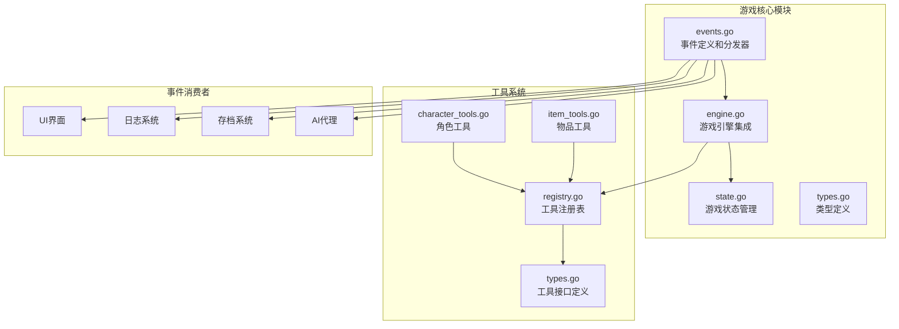
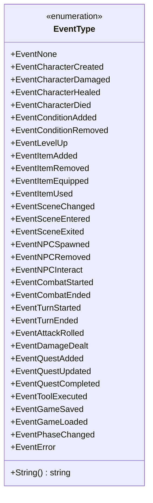
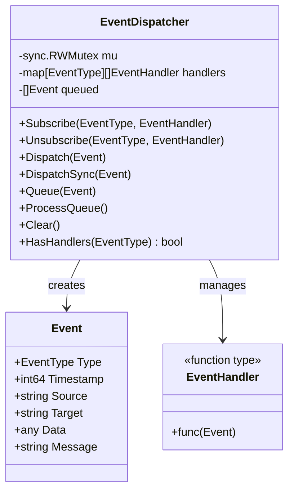
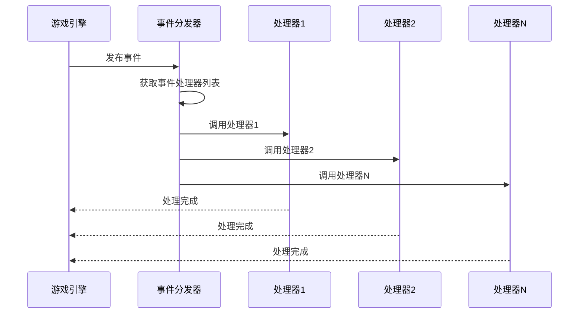
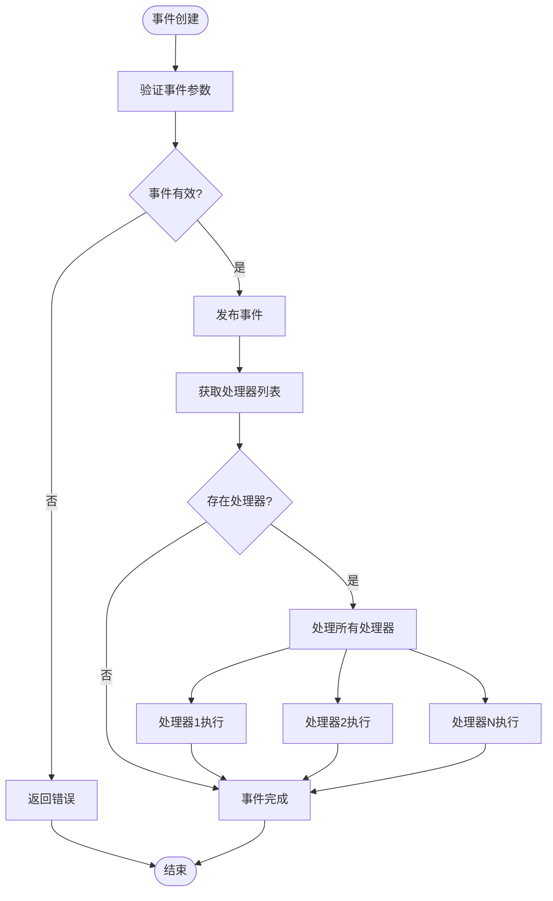
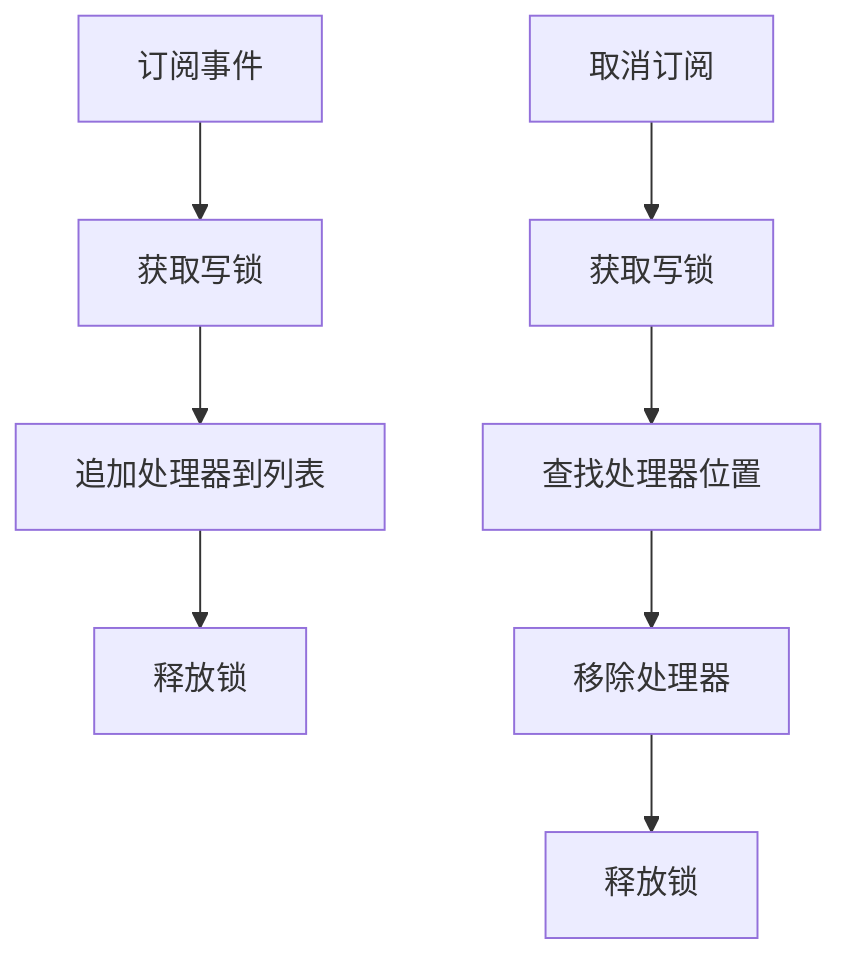
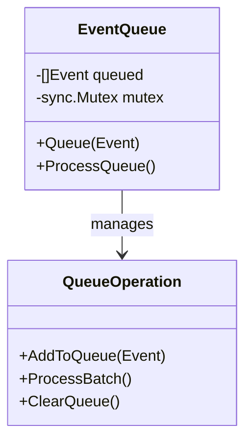
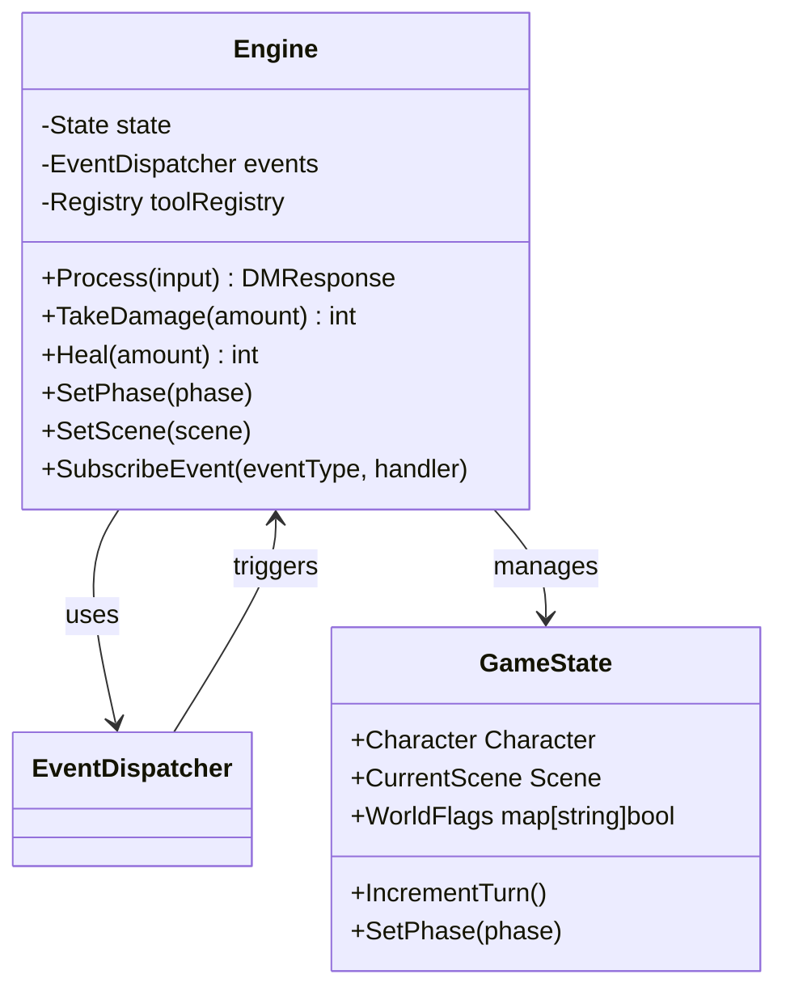
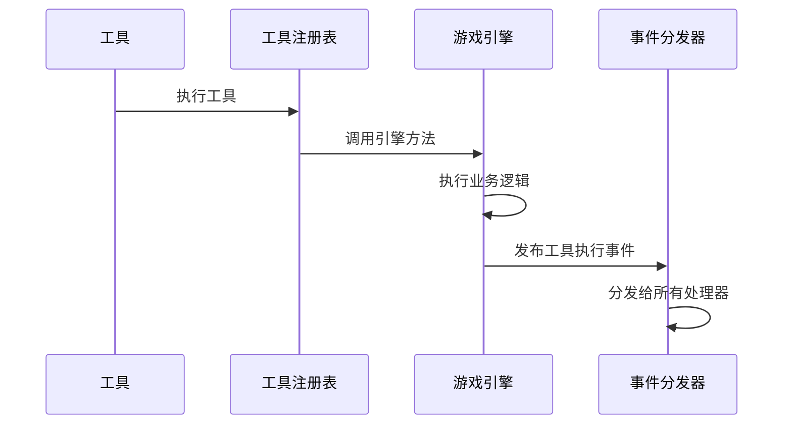
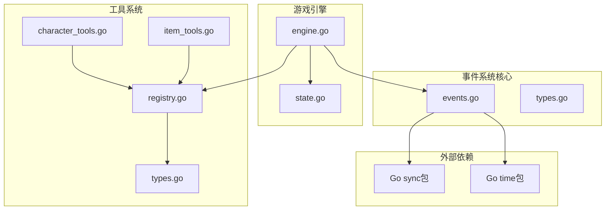

# 事件分发系统

<cite>
**本文档引用的文件**
- [events.go](file://internal/game/events.go)
- [engine.go](file://internal/game/engine.go)
- [types.go](file://internal/game/types.go)
- [state.go](file://internal/game/state.go)
- [registry.go](file://internal/tools/registry.go)
- [types.go](file://internal/tools/types.go)
- [character_tools.go](file://internal/tools/character_tools.go)
- [item_tools.go](file://internal/tools/item_tools.go)
</cite>

## 目录
1. [简介](#简介)
2. [项目结构](#项目结构)
3. [核心组件](#核心组件)
4. [架构概览](#架构概览)
5. [详细组件分析](#详细组件分析)
6. [依赖关系分析](#依赖关系分析)
7. [性能考虑](#性能考虑)
8. [故障排除指南](#故障排除指南)
9. [结论](#结论)

## 简介

CDND游戏事件分发系统是一个基于Go语言实现的事件驱动架构，采用观察者模式设计，为D&D 5E桌面角色扮演游戏提供实时事件处理能力。该系统通过事件类型枚举、事件处理器注册、异步事件分发等机制，实现了游戏状态变化的解耦和可扩展性。

系统的核心设计理念是：
- **松耦合**：事件发布者和订阅者之间通过事件接口解耦
- **异步处理**：支持同步和异步事件处理模式
- **类型安全**：通过枚举类型确保事件类型的正确性
- **线程安全**：使用读写锁保证并发安全性
- **可扩展性**：支持动态注册和注销事件处理器

## 项目结构

事件分发系统主要分布在以下文件中：

**图表来源**
- [events.go:1-244](file://internal/game/events.go#L1-L244)
- [engine.go:1-797](file://internal/game/engine.go#L1-L797)

**章节来源**
- [events.go:1-244](file://internal/game/events.go#L1-L244)
- [engine.go:1-797](file://internal/game/engine.go#L1-L797)

## 核心组件

### 事件类型系统

事件类型系统采用枚举设计，涵盖了D&D游戏的所有核心事件类别：

**图表来源**
- [events.go:7-50](file://internal/game/events.go#L7-L50)

### 事件数据结构

事件系统的核心数据结构包括事件对象和事件处理器：

**图表来源**
- [events.go:122-140](file://internal/game/events.go#L122-L140)

**章节来源**
- [events.go:7-140](file://internal/game/events.go#L7-L140)

## 架构概览

事件分发系统采用典型的发布-订阅模式，通过事件分发器协调事件的发布和处理：

**图表来源**
- [events.go:171-180](file://internal/game/events.go#L171-L180)

### 事件生命周期

事件从创建到处理的完整生命周期如下：

**图表来源**
- [events.go:171-204](file://internal/game/events.go#L171-L204)

**章节来源**
- [events.go:171-204](file://internal/game/events.go#L171-L204)

## 详细组件分析

### 事件分发器实现

事件分发器是整个系统的核心组件，负责事件的注册、管理和分发：

#### 订阅和取消订阅机制

**图表来源**
- [events.go:150-169](file://internal/game/events.go#L150-L169)

#### 同步和异步处理模式

事件分发器支持两种处理模式：

1. **同步处理** (`DispatchSync`)
   - 阻塞直到所有处理器完成
   - 适用于需要立即确认的操作

2. **异步处理** (`Dispatch`)
   - 立即返回，不等待处理器完成
   - 适用于非关键路径的事件

#### 事件队列机制

**图表来源**
- [events.go:187-204](file://internal/game/events.go#L187-L204)

**章节来源**
- [events.go:150-204](file://internal/game/events.go#L150-L204)

### 游戏引擎集成

游戏引擎通过事件分发器实现与各个子系统的解耦：

**图表来源**
- [engine.go:22-56](file://internal/game/engine.go#L22-L56)

#### 关键事件触发点

游戏引擎在以下关键节点触发事件：

1. **阶段变更** (`EventPhaseChanged`)
2. **场景切换** (`EventSceneChanged`)
3. **角色伤害** (`EventCharacterDamaged`)
4. **角色治疗** (`EventCharacterHealed`)
5. **工具执行** (`EventToolExecuted`)

**章节来源**
- [engine.go:353-392](file://internal/game/engine.go#L353-L392)

### 工具系统集成

工具系统通过事件分发器实现与游戏引擎的交互：

**图表来源**
- [engine.go:288-294](file://internal/game/engine.go#L288-L294)

**章节来源**
- [engine.go:288-294](file://internal/game/engine.go#L288-L294)

## 依赖关系分析

事件分发系统与其他模块的依赖关系如下：

**图表来源**
- [events.go:3-5](file://internal/game/events.go#L3-L5)
- [engine.go:3-20](file://internal/game/engine.go#L3-L20)

### 模块间耦合度分析

| 模块 | 内聚性 | 耦合度 | 说明 |
|------|--------|--------|------|
| 事件分发器 | 高 | 低 | 专注于事件管理，无业务逻辑依赖 |
| 游戏引擎 | 中 | 中 | 与多个模块交互，但保持事件接口抽象 |
| 工具系统 | 高 | 低 | 通过接口与引擎解耦 |
| 状态管理 | 中 | 中 | 与事件系统紧密协作 |

**章节来源**
- [events.go:1-244](file://internal/game/events.go#L1-L244)
- [engine.go:1-797](file://internal/game/engine.go#L1-L797)

## 性能考虑

### 并发性能优化

事件分发器采用读写锁机制，在高并发场景下提供良好的性能表现：

1. **读写分离**：读操作使用读锁，写操作使用写锁
2. **零拷贝优化**：事件处理器列表在读取时不进行复制
3. **批量处理**：支持事件队列批量处理减少锁竞争

### 内存管理策略

1. **事件池化**：建议实现事件对象池减少GC压力
2. **处理器缓存**：缓存常用处理器避免重复查找
3. **数据结构优化**：使用切片而非链表提高遍历效率

### 扩展性优化

1. **插件化架构**：支持动态加载事件处理器
2. **优先级队列**：支持不同优先级的事件处理
3. **异步批处理**：大量事件时自动批处理

## 故障排除指南

### 常见问题及解决方案

#### 事件处理器未执行

**症状**：订阅的事件处理器没有被调用

**可能原因**：
1. 处理器指针比较失败
2. 事件类型不匹配
3. 处理器被意外注销

**解决方案**：
- 确保使用相同的处理器实例进行订阅和注销
- 检查事件类型是否正确
- 验证处理器注册时机

#### 并发安全问题

**症状**：多线程环境下出现数据竞争

**解决方案**：
- 确保使用事件分发器提供的线程安全方法
- 避免在处理器内部修改共享状态
- 使用适当的同步机制保护共享资源

#### 内存泄漏

**症状**：长时间运行后内存使用持续增长

**可能原因**：
1. 未及时注销不再使用的处理器
2. 事件处理器持有长生命周期引用
3. 事件队列无限增长

**解决方案**：
- 实现处理器注销机制
- 确保处理器不持有长生命周期引用
- 实现队列长度限制和清理机制

**章节来源**
- [events.go:157-169](file://internal/game/events.go#L157-L169)

## 结论

CDND游戏事件分发系统通过精心设计的架构实现了高度的模块解耦和可扩展性。系统的主要优势包括：

1. **设计优雅**：基于观察者模式的事件驱动架构
2. **性能优异**：线程安全的读写锁机制和高效的事件处理
3. **扩展性强**：支持动态注册和灵活的事件类型系统
4. **维护友好**：清晰的职责分离和模块化设计

该系统为D&D 5E游戏提供了坚实的基础，支持未来功能的扩展和性能优化。通过遵循最佳实践和适当的监控，可以确保系统在生产环境中的稳定运行。