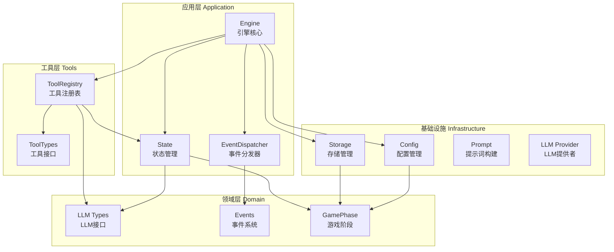
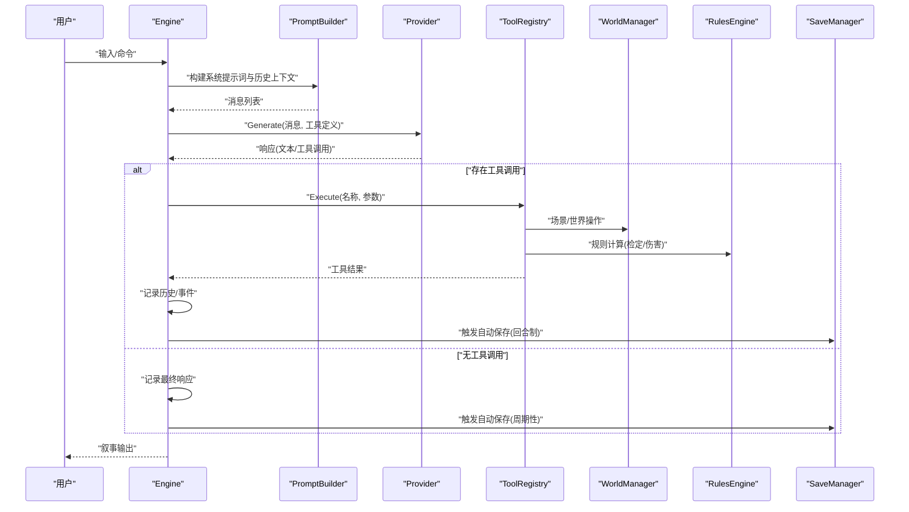
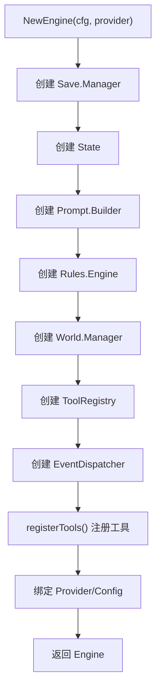
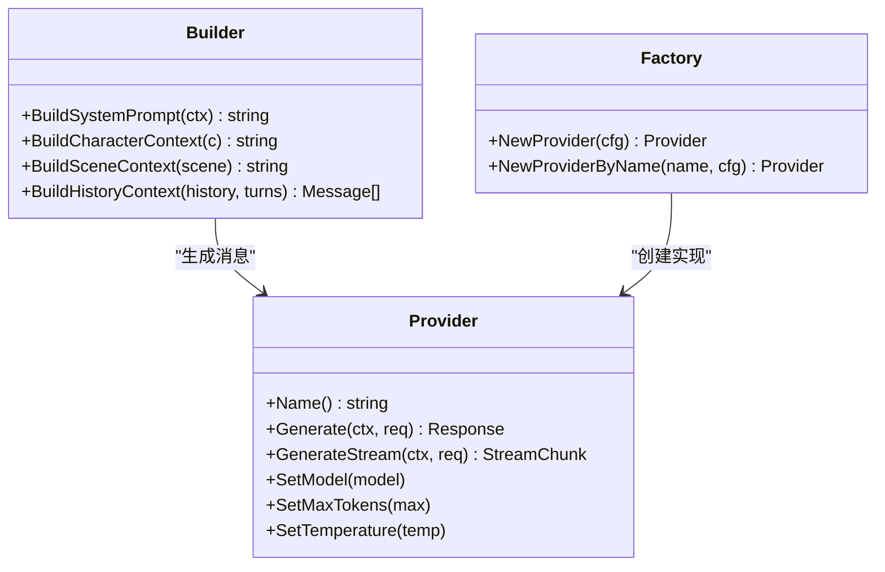
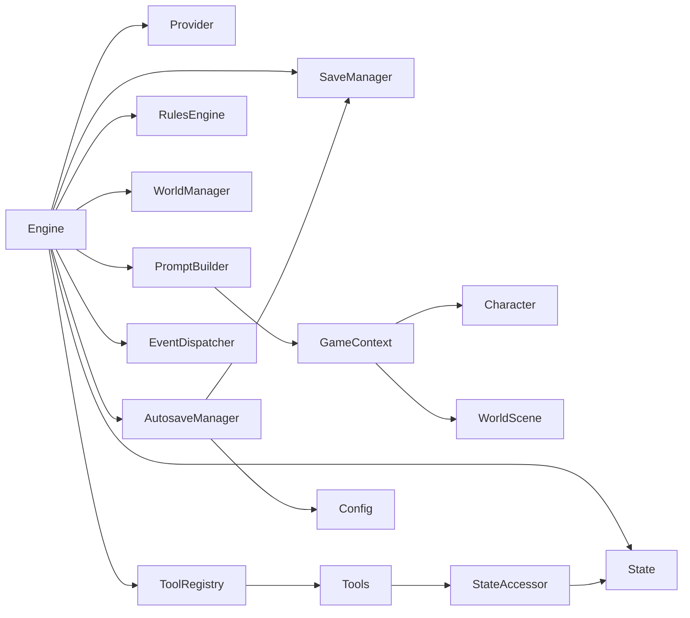

# 引擎核心组件

<cite>
**本文引用的文件**
- [application/engine/engine.go](file://application/engine/engine.go)
- [application/engine/init.go](file://application/engine/init.go)
- [application/state/state.go](file://application/state/state.go)
- [application/tools/registry.go](file://application/tools/registry.go)
- [application/tools/types.go](file://application/tools/types.go)
- [domain/llm/types.go](file://domain/llm/types.go)
- [domain/events/events.go](file://domain/events/events.go)
- [domain/game_phase.go](file://domain/game_phase.go)
- [infrastructure/config/config.go](file://infrastructure/config/config.go)
- [infrastructure/config/defaults.go](file://infrastructure/config/defaults.go)
- [infrastructure/storage/manager.go](file://infrastructure/storage/manager.go)
- [infrastructure/storage/types.go](file://infrastructure/storage/types.go)
</cite>

## 更新摘要
**所做更改**
- 更新引擎架构以反映从 internal/game 到 application/engine 的迁移
- 新增自动保存机制的详细说明，包括周期性自动保存和回合制自动保存
- 更新组件交互图以体现新的三层架构分离
- 增强自动保存配置管理和生命周期管理说明
- 更新初始化序列图以反映新的引擎启动流程

## 目录
1. [引言](#引言)
2. [项目结构](#项目结构)
3. [核心组件](#核心组件)
4. [架构总览](#架构总览)
5. [详细组件分析](#详细组件分析)
6. [依赖分析](#依赖分析)
7. [性能考虑](#性能考虑)
8. [故障排查指南](#故障排查指南)
9. [结论](#结论)
10. [附录](#附录)

## 引言
本文件面向CDND游戏引擎的核心组件，系统性阐述Engine结构体的设计理念、成员变量职责与协作关系；详解NewEngine初始化流程与各子系统的创建顺序及依赖；梳理引擎生命周期（从创建到销毁）；记录配置管理机制与环境变量处理；并提供性能优化与内存管理最佳实践。同时，配合组件交互图与初始化序列图，帮助开发者快速理解复杂系统架构。

**更新** 引擎架构已从 internal/game 迁移到 application/engine，实现了更清晰的三层架构分离，新增自动保存机制支持周期性和回合制自动保存。

## 项目结构
CDND采用按功能域分层的模块化组织方式，现已迁移到 application 层：
- application/engine：引擎核心、状态机、事件分发、初始化序列
- application/state：游戏状态管理
- application/tools：工具注册表与工具接口
- domain：领域模型与接口定义
- infrastructure：基础设施实现（配置、LLM、提示词、存储）
- interface：用户界面与命令行接口

**图表来源**
- [application/engine/engine.go:28-44](file://application/engine/engine.go#L28-L44)
- [application/state/state.go:15-47](file://application/state/state.go#L15-L47)
- [application/tools/registry.go:9-21](file://application/tools/registry.go#L9-L21)
- [domain/llm/types.go:8-83](file://domain/llm/types.go#L8-L83)
- [domain/events/events.go:7-50](file://domain/events/events.go#L7-L50)
- [domain/game_phase.go:3-14](file://domain/game_phase.go#L3-L14)
- [infrastructure/config/config.go:8-53](file://infrastructure/config/config.go#L8-L53)
- [infrastructure/storage/manager.go:21-26](file://infrastructure/storage/manager.go#L21-L26)

**章节来源**
- [application/engine/engine.go:28-44](file://application/engine/engine.go#L28-L44)
- [application/state/state.go:15-47](file://application/state/state.go#L15-L47)
- [application/tools/registry.go:9-21](file://application/tools/registry.go#L9-L21)
- [infrastructure/config/config.go:8-53](file://infrastructure/config/config.go#L8-L53)
- [infrastructure/storage/manager.go:21-26](file://infrastructure/storage/manager.go#L21-L26)

## 核心组件
- Engine：引擎主控制器，聚合状态、LLM提供者、提示词构建器、规则引擎、世界管理器、存档管理器、工具注册表与事件分发器。负责启动、加载/保存、工具调用循环、事件订阅与派发，现支持自动保存机制。
- State：游戏状态容器，包含会话ID、阶段、回合数、角色、当前场景、世界标志/计数器、历史、战斗状态、时间戳等。
- Provider：LLM提供者接口，统一Generate/GenerateStream能力与参数设置。
- PromptBuilder：根据GameContext构建系统提示词、角色上下文、场景上下文、历史截断等。
- Rules.Engine：规则引擎，提供技能检定、豁免检定、攻击检定、伤害投骰等。
- World.Manager：世界管理器，维护场景与NPC集合，支持场景链接、NPC移动、导入/导出。
- Save.Manager：存档管理器，提供多槽位JSON存档、缓存、QuickSave/QuickLoad、元数据统计。
- ToolRegistry：工具注册表，集中管理工具定义、执行、权限控制与并发安全。
- EventDispatcher：事件分发器，支持引擎内事件订阅与广播。

**更新** 新增自动保存管理器，包含取消函数、等待组和原子布尔值，支持周期性自动保存和回合制自动保存触发。

**章节来源**
- [application/engine/engine.go:28-44](file://application/engine/engine.go#L28-L44)
- [application/state/state.go:15-47](file://application/state/state.go#L15-L47)
- [domain/llm/types.go:64-83](file://domain/llm/types.go#L64-L83)
- [infrastructure/storage/manager.go:21-26](file://infrastructure/storage/manager.go#L21-L26)
- [application/tools/registry.go:9-21](file://application/tools/registry.go#L9-L21)

## 架构总览
引擎围绕Engine进行编排，形成"提示词构建—LLM推理—工具调用—状态变更—事件通知"的闭环。状态机贯穿各子系统，确保一致性与可追踪性。新增自动保存机制确保游戏进度的安全性。

**图表来源**
- [application/engine/engine.go:242-424](file://application/engine/engine.go#L242-L424)
- [application/engine/engine.go:566-606](file://application/engine/engine.go#L566-L606)
- [application/engine/engine.go:526-553](file://application/engine/engine.go#L526-L553)

**章节来源**
- [application/engine/engine.go:242-424](file://application/engine/engine.go#L242-L424)
- [application/engine/engine.go:526-553](file://application/engine/engine.go#L526-L553)

## 详细组件分析

### Engine结构体与初始化流程
- 设计理念
  - 聚合设计：将状态、LLM、提示词、规则、世界、存档、工具、事件等子系统聚合于Engine，便于统一调度与生命周期管理。
  - 解耦与接口：通过Provider、Tool、StateAccessor等接口隔离具体实现，提升可测试性与扩展性。
  - 事件驱动：通过EventDispatcher对工具执行、阶段切换、场景变更等进行广播，便于UI与日志联动。
  - 自动保存：集成自动保存机制，支持周期性保存和回合制保存，确保游戏进度安全。
- 成员变量作用
  - state：承载会话状态与历史，贯穿所有操作。
  - llmProvider：统一LLM调用入口，支持不同厂商与本地模型。
  - prompt：构建系统提示词与上下文，保证LLM理解一致。
  - rules：规则计算，提供检定与伤害等确定性逻辑。
  - world：世界数据的增删改查与导入导出。
  - save：多槽位JSON存档，支持缓存与元数据统计。
  - toolRegistry：工具注册与执行，支持并发安全与权限控制。
  - events：事件订阅与分发。
  - config：运行期配置。
  - autosaveCancel：自动保存取消函数。
  - autosaveWg：自动保存等待组。
  - autosaveSaving：自动保存原子布尔值。
- NewEngine初始化顺序与依赖
  1) 创建Save.Manager（准备存档目录与缓存）
  2) 创建State（初始化会话ID与默认阶段）
  3) 创建Prompt.Builder（模板与样式）
  4) 创建Rules.Engine（规则计算）
  5) 创建World.Manager（场景/NPC容器）
  6) 创建ToolRegistry（工具注册）
  7) 创建EventDispatcher（事件）
  8) 注册工具（registerTools）
  9) 绑定Provider（外部传入）
  10) 绑定Config（外部传入）

**更新** 初始化流程保持不变，但新增了自动保存机制的集成。

**图表来源**
- [application/engine/engine.go:47-66](file://application/engine/engine.go#L47-L66)

**章节来源**
- [application/engine/engine.go:28-44](file://application/engine/engine.go#L28-L44)
- [application/engine/engine.go:47-66](file://application/engine/engine.go#L47-L66)

### 状态管理器（State）
- 职责
  - 统一存储会话ID、阶段、回合数、子回合、角色、当前场景、访问过的场景、世界标志/计数器、任务、历史、DM上下文、战斗状态、时间戳。
  - 提供回合推进、场景切换、历史追加、标志/计数器读写、任务管理、战斗状态管理（开始/结束/下一回合/当前行动者）。
- 关键点
  - 历史复制与不可变片段保护（GetHistory返回副本）
  - 战斗状态按先攻排序与HasActed标记
  - 世界标志/计数器作为全局状态，跨场景持久化

**章节来源**
- [application/state/state.go:15-47](file://application/state/state.go#L15-L47)
- [application/state/state.go:98-108](file://application/state/state.go#L98-L108)
- [application/state/state.go:156-180](file://application/state/state.go#L156-L180)

### LLM提供商与提示词构建
- Provider接口
  - 统一Generate/GenerateStream、模型/令牌/温度设置。
  - ToolDefinition/ToolCall用于函数调用协议。
- 提示词构建器
  - GameContext包含阶段、角色、当前场景、DM上下文、历史、回合数、世界标志/计数器。
  - 构建系统提示词、角色上下文、场景上下文、历史截断。
  - 支持颜色标记解析与渲染。
- 工厂
  - 根据配置选择OpenAI/Anthropic/Ollama等具体实现。

**图表来源**
- [domain/llm/types.go:64-83](file://domain/llm/types.go#L64-L83)
- [infrastructure/prompt/builder.go:51-112](file://infrastructure/prompt/builder.go#L51-L112)
- [infrastructure/llm/factory.go:9-41](file://infrastructure/llm/factory.go#L9-L41)

**章节来源**
- [domain/llm/types.go:64-83](file://domain/llm/types.go#L64-L83)
- [infrastructure/prompt/builder.go:51-112](file://infrastructure/prompt/builder.go#L51-L112)
- [infrastructure/llm/factory.go:9-41](file://infrastructure/llm/factory.go#L9-L41)

### 规则引擎
- 功能
  - 技能检定、属性检定、豁免检定、攻击检定、伤害投骰、AC计算。
  - 大成功/大失败判定、熟练加成、先攻排序。
- 数据结构
  - CheckResult/DamageResult/CriticalType等。

**章节来源**
- [domain/rules/engine.go:8-14](file://domain/rules/engine.go#L8-L14)
- [domain/rules/engine.go:91-140](file://domain/rules/engine.go#L91-L140)
- [domain/rules/engine.go:224-250](file://domain/rules/engine.go#L224-L250)

### 世界管理器
- 功能
  - 场景与NPC的增删改查、场景链接（双向/单向）、NPC在场景间的移动、导入/导出世界数据。
- 并发
  - 读写锁保护内部map，支持高并发场景操作。

**章节来源**
- [domain/world/manager.go:10-23](file://domain/world/manager.go#L10-L23)
- [domain/world/manager.go:264-293](file://domain/world/manager.go#L264-L293)
- [domain/world/scene.go:19-44](file://domain/world/scene.go#L19-L44)

### 存档管理器
- 功能
  - 多槽位JSON存档（1-10），缓存加速、QuickSave/QuickLoad、元数据统计、导入/导出。
  - 自动保存专用槽位（0），支持异步保存和并发安全。
- 目录
  - 用户主目录下的"~/.cdnd/saves"目录，自动创建。

**更新** 新增自动保存机制，支持专用槽位0的异步保存，使用原子布尔值防止并发保存冲突。

**章节来源**
- [infrastructure/storage/manager.go:13-44](file://infrastructure/storage/manager.go#L13-L44)
- [infrastructure/storage/manager.go:58-87](file://infrastructure/storage/manager.go#L58-L87)
- [infrastructure/storage/manager.go:145-182](file://infrastructure/storage/manager.go#L145-L182)
- [infrastructure/storage/types.go:14-51](file://infrastructure/storage/types.go#L14-L51)

### 工具注册表与工具接口
- Registry
  - 注册/查找/执行工具，支持并发安全与按阶段权限控制。
- Tool接口
  - Name/Description/Parameters/Execute，统一工具协议。
- 工具类型
  - 骰子、角色、物品、世界等分类，配套叙述生成。

**章节来源**
- [application/tools/registry.go:9-21](file://application/tools/registry.go#L9-L21)
- [application/tools/registry.go:37-46](file://application/tools/registry.go#L37-L46)
- [application/tools/types.go:45-55](file://application/tools/types.go#L45-L55)

### 初始化序列与事件
- 初始化序列
  - Welcome消息生成（无需LLM调用），快速渲染个性化欢迎语并加入历史。
- 事件
  - 阶段变更、场景变更、角色损伤/治疗、工具执行等事件，支持订阅与广播。

**章节来源**
- [application/engine/init.go:13-66](file://application/engine/init.go#L13-L66)
- [domain/events/events.go:10-50](file://domain/events/events.go#L10-L50)

### 自动保存机制
- 周期性自动保存
  - 基于配置的定时器，按设定间隔触发保存。
  - 使用context取消机制和sync.WaitGroup确保优雅停止。
  - 原子布尔值防止并发保存冲突。
- 回合制自动保存
  - 每个回合结束后触发异步保存。
  - 使用go关键字避免阻塞主要游戏流程。
  - 保存到专用槽位0，不影响手动存档。
- 配置管理
  - GameConfig包含Autosave开关和AutosaveInterval间隔。
  - 默认启用自动保存，间隔5分钟。

**新增** 自动保存机制是本次架构重构的重要特性，提供了游戏进度安全保障。

**章节来源**
- [application/engine/engine.go:526-606](file://application/engine/engine.go#L526-L606)
- [infrastructure/config/config.go:31-37](file://infrastructure/config/config.go#L31-L37)
- [infrastructure/config/defaults.go:32-37](file://infrastructure/config/defaults.go#L32-L37)

## 依赖分析
- 组件耦合
  - Engine对各子系统强聚合，但通过接口解耦具体实现。
  - State是全局共享状态，ToolRegistry通过StateAccessor与Engine解耦。
  - PromptBuilder依赖GameContext（角色/场景/历史），间接依赖World/Character。
  - 自动保存机制通过配置驱动，支持热切换。
- 外部依赖
  - Viper用于配置加载与环境变量覆盖。
  - Charmbracelet lipgloss用于颜色标记渲染。
- 潜在循环依赖
  - 未发现直接循环依赖；各子系统保持单向依赖Engine。

**图表来源**
- [application/engine/engine.go:28-44](file://application/engine/engine.go#L28-L44)
- [application/engine/engine.go:526-606](file://application/engine/engine.go#L526-L606)
- [application/tools/types.go:12-43](file://application/tools/types.go#L12-L43)

**章节来源**
- [application/engine/engine.go:28-44](file://application/engine/engine.go#L28-L44)
- [application/engine/engine.go:526-606](file://application/engine/engine.go#L526-L606)
- [application/tools/types.go:12-43](file://application/tools/types.go#L12-L43)

## 性能考虑
- 缓存策略
  - Save.Manager使用内存缓存加速频繁读取；建议在长会话中定期ClearCache或基于LRU替换。
  - PromptBuilder可引入历史截断与Token估算（当前简化为固定回合数）。
- 并发安全
  - ToolRegistry与World.Manager均使用读写锁，避免热点竞争；建议减少持有写锁的时间。
  - 自动保存使用原子布尔值和等待组，避免竞态条件。
- I/O优化
  - 存档写入使用一次性序列化与原子写入（当前为写文件），建议在高并发场景增加文件锁或异步队列。
  - 自动保存采用异步goroutine，避免阻塞主线程。
- LLM调用
  - 控制工具定义数量与参数Schema大小，减少上下文长度。
  - 合理设置MaxTokens与Temperature，平衡质量与延迟。
- 内存管理
  - State历史复制与消息切片需注意大回合导致的历史膨胀；建议周期性清理或分页。
  - 工具结果仅保留必要字段，避免大对象驻留。
  - 自动保存使用原子操作，减少锁竞争开销。

**更新** 新增自动保存机制的性能考虑，包括异步保存、原子操作和等待组的使用。

## 故障排查指南
- 配置问题
  - 确认配置文件路径与权限（~/.cdnd/config.yaml），检查环境变量覆盖是否生效。
  - 使用InitConfigFile生成默认配置，再手动修改。
  - 检查Game.Autosave开关和AutosaveInterval配置。
- 存档问题
  - 检查槽位范围与文件存在性；使用ListSlots确认状态；QuickSave/QuickLoad验证最近存档。
  - 导入/导出时注意版本兼容性（Version字段）。
  - 自动保存失败时检查专用槽位0的权限。
- 工具执行问题
  - 确认工具名称与参数Schema匹配；检查权限控制（IsAllowedInPhase）。
  - 工具返回的ToolResult应包含Success与Narrative，便于定位失败原因。
- LLM调用问题
  - 检查Provider配置（APIKey、BaseURL、Model、MaxTokens、Temperature）。
  - 若无工具调用，确认工具定义是否正确传递至Generate请求。
- 事件问题
  - 订阅事件后确认事件类型与消息内容；检查事件分发链路是否阻塞。
- 自动保存问题
  - 检查Autosave开关状态和保存间隔配置。
  - 确认专用槽位0的文件权限和磁盘空间。
  - 查看日志中的自动保存错误信息。

**更新** 新增自动保存相关的故障排查指南。

**章节来源**
- [infrastructure/config/config.go:31-37](file://infrastructure/config/config.go#L31-L37)
- [infrastructure/storage/manager.go:145-182](file://infrastructure/storage/manager.go#L145-L182)
- [application/engine/engine.go:566-606](file://application/engine/engine.go#L566-L606)

## 结论
Engine通过清晰的聚合与接口设计，将LLM推理、规则计算、世界管理、工具执行与存档持久化有机整合。借助State与事件系统，实现了状态一致与可观测性。新增的自动保存机制进一步增强了游戏的可靠性，支持周期性和回合制的自动保存策略。遵循本文的初始化流程、配置管理与性能优化建议，可稳定支撑D&D风格的智能叙事体验。

**更新** 引擎架构已成功迁移到 application 层，自动保存机制为游戏提供了更好的持久化保障。

## 附录
- 配置管理机制
  - 默认值通过Viper.SetDefault注入；支持YAML配置文件与环境变量自动覆盖；提供保存/读取/路径查询。
  - GameConfig包含Autosave开关和AutosaveInterval间隔配置。
- 生命周期管理
  - 创建：NewEngine → 注册工具 → 绑定Provider/Config → 启动自动保存
  - 运行：Start/Load → ProcessWithTools → Save/事件分发 → 自动保存
  - 销毁：StopAutosave → 清理资源 → 优雅关闭
- 自动保存配置
  - 默认启用自动保存（Autosave: true）
  - 默认保存间隔5分钟（AutosaveInterval: 5*time.Minute）
  - 专用槽位0用于自动保存，不影响手动存档

**更新** 新增自动保存配置和生命周期管理的详细说明。

**章节来源**
- [infrastructure/config/config.go:8-53](file://infrastructure/config/config.go#L8-L53)
- [infrastructure/config/defaults.go:32-37](file://infrastructure/config/defaults.go#L32-L37)
- [application/engine/engine.go:47-66](file://application/engine/engine.go#L47-L66)
- [application/engine/engine.go:526-564](file://application/engine/engine.go#L526-L564)