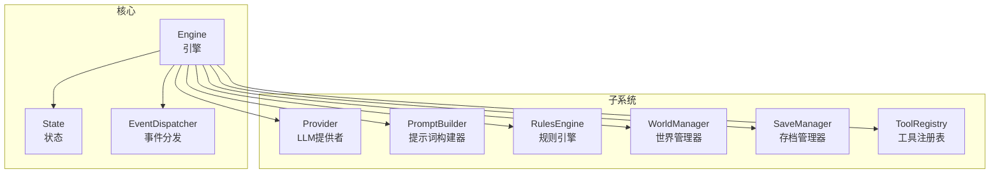
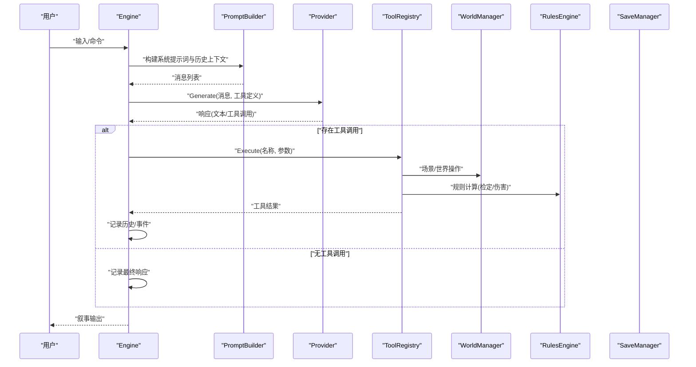
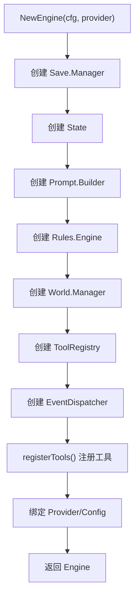
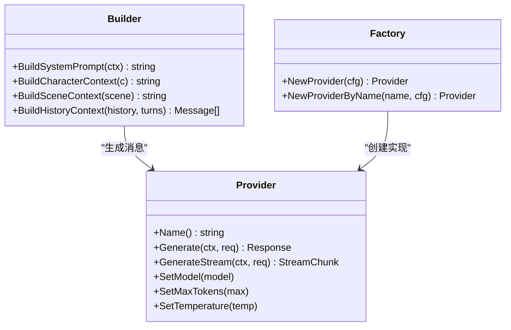
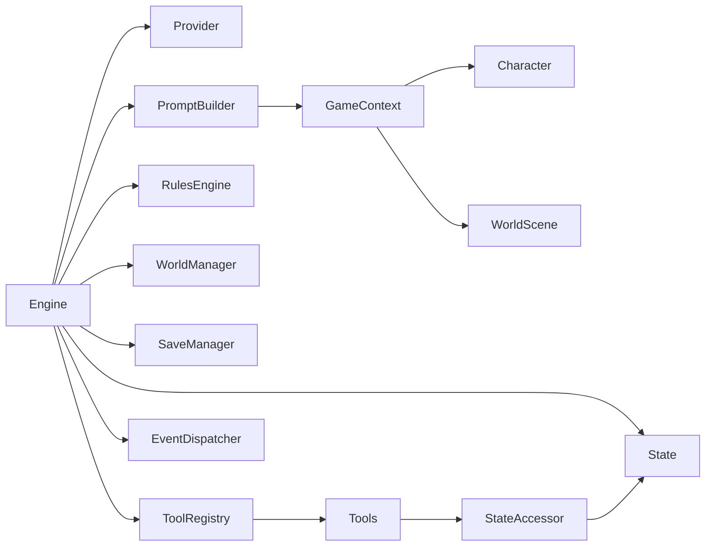

# 引擎核心组件

<cite>
**本文引用的文件**
- [internal/game/engine.go](file://internal/game/engine.go)
- [internal/game/state.go](file://internal/game/state.go)
- [internal/game/init.go](file://internal/game/init.go)
- [internal/config/config.go](file://internal/config/config.go)
- [internal/config/loader.go](file://internal/config/loader.go)
- [internal/llm/provider.go](file://internal/llm/provider.go)
- [internal/llm/factory.go](file://internal/llm/factory.go)
- [internal/llm/prompt/builder.go](file://internal/llm/prompt/builder.go)
- [internal/tools/registry.go](file://internal/tools/registry.go)
- [internal/tools/types.go](file://internal/tools/types.go)
- [internal/world/manager.go](file://internal/world/manager.go)
- [internal/world/scene.go](file://internal/world/scene.go)
- [internal/save/manager.go](file://internal/save/manager.go)
- [internal/save/types.go](file://internal/save/types.go)
- [internal/rules/engine.go](file://internal/rules/engine.go)
</cite>

## 目录
1. [引言](#引言)
2. [项目结构](#项目结构)
3. [核心组件](#核心组件)
4. [架构总览](#架构总览)
5. [详细组件分析](#详细组件分析)
6. [依赖分析](#依赖分析)
7. [性能考虑](#性能考虑)
8. [故障排查指南](#故障排查指南)
9. [结论](#结论)
10. [附录](#附录)

## 引言
本文件面向CDND游戏引擎的核心组件，系统性阐述Engine结构体的设计理念、成员变量职责与协作关系；详解NewEngine初始化流程与各子系统的创建顺序及依赖；梳理引擎生命周期（从创建到销毁）；记录配置管理机制与环境变量处理；并提供性能优化与内存管理最佳实践。同时，配合组件交互图与初始化序列图，帮助开发者快速理解复杂系统架构。

## 项目结构
CDND采用按功能域分层的模块化组织方式：
- internal/game：引擎核心、状态机、事件分发、初始化序列
- internal/config：配置模型与Viper加载/保存
- internal/llm：LLM提供者抽象、工厂、提示词构建器
- internal/tools：工具注册表与工具接口
- internal/world：世界管理器（场景、NPC、连接）
- internal/save：存档管理器（持久化、缓存、元数据）
- internal/rules：规则引擎（检定、伤害、AC等）
- pkg/dice：骰子解析与投骰逻辑

图表来源
- [internal/game/engine.go:22-56](file://internal/game/engine.go#L22-L56)
- [internal/game/state.go:13-42](file://internal/game/state.go#L13-L42)
- [internal/llm/provider.go:64-83](file://internal/llm/provider.go#L64-L83)
- [internal/llm/prompt/builder.go:51-61](file://internal/llm/prompt/builder.go#L51-L61)
- [internal/rules/engine.go:8-14](file://internal/rules/engine.go#L8-L14)
- [internal/world/manager.go:10-23](file://internal/world/manager.go#L10-L23)
- [internal/save/manager.go:20-43](file://internal/save/manager.go#L20-L43)
- [internal/tools/registry.go:10-23](file://internal/tools/registry.go#L10-L23)

章节来源
- [internal/game/engine.go:22-56](file://internal/game/engine.go#L22-L56)
- [internal/game/state.go:13-42](file://internal/game/state.go#L13-L42)
- [internal/config/config.go:8-53](file://internal/config/config.go#L8-L53)
- [internal/config/loader.go:24-70](file://internal/config/loader.go#L24-L70)

## 核心组件
- Engine：引擎主控制器，聚合状态、LLM提供者、提示词构建器、规则引擎、世界管理器、存档管理器、工具注册表与事件分发器。负责启动、加载/保存、工具调用循环、事件订阅与派发。
- State：游戏状态容器，包含会话ID、阶段、回合数、角色、当前场景、世界标志/计数器、历史、战斗状态、时间戳等。
- Provider：LLM提供者接口，统一Generate/GenerateStream能力与参数设置。
- PromptBuilder：根据GameContext构建系统提示词、角色上下文、场景上下文、历史截断等。
- Rules.Engine：规则引擎，提供技能检定、豁免检定、攻击检定、伤害投骰等。
- World.Manager：世界管理器，维护场景与NPC集合，支持场景链接、NPC移动、导入/导出。
- Save.Manager：存档管理器，提供多槽位JSON存档、缓存、QuickSave/QuickLoad、元数据统计。
- ToolRegistry：工具注册表，集中管理工具定义、执行、权限控制与并发安全。
- EventDispatcher：事件分发器，支持引擎内事件订阅与广播。

章节来源
- [internal/game/engine.go:22-56](file://internal/game/engine.go#L22-L56)
- [internal/game/state.go:13-42](file://internal/game/state.go#L13-L42)
- [internal/llm/provider.go:64-83](file://internal/llm/provider.go#L64-L83)
- [internal/llm/prompt/builder.go:51-112](file://internal/llm/prompt/builder.go#L51-L112)
- [internal/rules/engine.go:8-14](file://internal/rules/engine.go#L8-L14)
- [internal/world/manager.go:10-23](file://internal/world/manager.go#L10-L23)
- [internal/save/manager.go:20-43](file://internal/save/manager.go#L20-L43)
- [internal/tools/registry.go:10-23](file://internal/tools/registry.go#L10-L23)

## 架构总览
引擎围绕Engine进行编排，形成“提示词构建—LLM推理—工具调用—状态变更—事件通知”的闭环。状态机贯穿各子系统，确保一致性与可追踪性。

图表来源
- [internal/game/engine.go:195-316](file://internal/game/engine.go#L195-L316)
- [internal/llm/prompt/builder.go:75-112](file://internal/llm/prompt/builder.go#L75-L112)
- [internal/llm/provider.go:64-83](file://internal/llm/provider.go#L64-L83)
- [internal/tools/registry.go:43-54](file://internal/tools/registry.go#L43-L54)
- [internal/world/manager.go:264-293](file://internal/world/manager.go#L264-L293)
- [internal/rules/engine.go:91-140](file://internal/rules/engine.go#L91-L140)

## 详细组件分析

### Engine结构体与初始化流程
- 设计理念
  - 聚合设计：将状态、LLM、提示词、规则、世界、存档、工具、事件等子系统聚合于Engine，便于统一调度与生命周期管理。
  - 解耦与接口：通过Provider、Tool、StateAccessor等接口隔离具体实现，提升可测试性与扩展性。
  - 事件驱动：通过EventDispatcher对工具执行、阶段切换、场景变更等进行广播，便于UI与日志联动。
- 成员变量作用
  - state：承载会话状态与历史，贯穿所有操作。
  - llmProvider：统一LLM调用入口，支持不同厂商与本地模型。
  - prompt：构建系统提示词与上下文，保证LLM理解一致。
  - rules：规则计算，提供检定与伤害等确定性逻辑。
  - world：世界数据的增删改查与导入导出。
  - save：多槽位JSON存档，支持缓存与元数据统计。
  - toolRegistry：工具注册与执行，支持并发安全与权限控制。
  - events：事件订阅与分发。
  - config：运行期配置。
- NewEngine初始化顺序与依赖
  1) 创建Save.Manager（准备存档目录与缓存）
  2) 创建State（初始化会话ID与默认阶段）
  3) 创建Prompt.Builder（模板与样式）
  4) 创建Rules.Engine（规则计算）
  5) 创建World.Manager（场景/NPC容器）
  6) 创建ToolRegistry（工具注册）
  7) 创建EventDispatcher（事件）
  8) 注册工具（registerTools）
  9) 绑定Provider（外部传入）
  10) 绑定Config（外部传入）

图表来源
- [internal/game/engine.go:35-56](file://internal/game/engine.go#L35-L56)
- [internal/game/engine.go:58-76](file://internal/game/engine.go#L58-L76)

章节来源
- [internal/game/engine.go:22-56](file://internal/game/engine.go#L22-L56)
- [internal/game/engine.go:35-56](file://internal/game/engine.go#L35-L56)
- [internal/game/engine.go:58-76](file://internal/game/engine.go#L58-L76)

### 状态管理器（State）
- 职责
  - 统一存储会话ID、阶段、回合数、子回合、角色、当前场景、访问过的场景、世界标志/计数器、任务、历史、DM上下文、战斗状态、时间戳。
  - 提供回合推进、场景切换、历史追加、标志/计数器读写、任务管理、战斗状态管理（开始/结束/下一回合/当前行动者）。
- 关键点
  - 历史复制与不可变片段保护（GetHistory返回副本）
  - 战斗状态按先攻排序与HasActed标记
  - 世界标志/计数器作为全局状态，跨场景持久化

章节来源
- [internal/game/state.go:13-42](file://internal/game/state.go#L13-L42)
- [internal/game/state.go:93-103](file://internal/game/state.go#L93-L103)
- [internal/game/state.go:151-212](file://internal/game/state.go#L151-L212)

### LLM提供商与提示词构建
- Provider接口
  - 统一Generate/GenerateStream、模型/令牌/温度设置。
  - ToolDefinition/ToolCall用于函数调用协议。
- 提示词构建器
  - GameContext包含阶段、角色、当前场景、DM上下文、历史、回合数、世界标志/计数器。
  - 构建系统提示词、角色上下文、场景上下文、历史截断。
  - 支持颜色标记解析与渲染。
- 工厂
  - 根据配置选择OpenAI/Anthropic/Ollama等具体实现。

图表来源
- [internal/llm/provider.go:64-83](file://internal/llm/provider.go#L64-L83)
- [internal/llm/prompt/builder.go:51-112](file://internal/llm/prompt/builder.go#L51-L112)
- [internal/llm/factory.go:9-41](file://internal/llm/factory.go#L9-L41)

章节来源
- [internal/llm/provider.go:64-83](file://internal/llm/provider.go#L64-L83)
- [internal/llm/prompt/builder.go:51-112](file://internal/llm/prompt/builder.go#L51-L112)
- [internal/llm/factory.go:9-41](file://internal/llm/factory.go#L9-L41)

### 规则引擎
- 功能
  - 技能检定、属性检定、豁免检定、攻击检定、伤害投骰、AC计算。
  - 大成功/大失败判定、熟练加成、先攻排序。
- 数据结构
  - CheckResult/DamageResult/CriticalType等。

章节来源
- [internal/rules/engine.go:8-14](file://internal/rules/engine.go#L8-L14)
- [internal/rules/engine.go:91-140](file://internal/rules/engine.go#L91-L140)
- [internal/rules/engine.go:224-250](file://internal/rules/engine.go#L224-L250)

### 世界管理器
- 功能
  - 场景与NPC的增删改查、场景链接（双向/单向）、NPC在场景间的移动、导入/导出世界数据。
- 并发
  - 读写锁保护内部map，支持高并发场景操作。

章节来源
- [internal/world/manager.go:10-23](file://internal/world/manager.go#L10-L23)
- [internal/world/manager.go:264-293](file://internal/world/manager.go#L264-L293)
- [internal/world/scene.go:19-44](file://internal/world/scene.go#L19-L44)

### 存档管理器
- 功能
  - 多槽位JSON存档（1-10），缓存加速、QuickSave/QuickLoad、元数据统计、导入/导出。
- 目录
  - 用户主目录下的“.cdnd/saves”目录，自动创建。

章节来源
- [internal/save/manager.go:13-43](file://internal/save/manager.go#L13-L43)
- [internal/save/manager.go:57-86](file://internal/save/manager.go#L57-L86)
- [internal/save/manager.go:144-181](file://internal/save/manager.go#L144-L181)
- [internal/save/types.go:110-147](file://internal/save/types.go#L110-L147)

### 工具注册表与工具接口
- Registry
  - 注册/查找/执行工具，支持并发安全与按阶段权限控制。
- Tool接口
  - Name/Description/Parameters/Execute，统一工具协议。
- 工具类型
  - 骰子、角色、物品、世界等分类，配套叙述生成。

章节来源
- [internal/tools/registry.go:10-23](file://internal/tools/registry.go#L10-L23)
- [internal/tools/registry.go:43-54](file://internal/tools/registry.go#L43-L54)
- [internal/tools/types.go:24-34](file://internal/tools/types.go#L24-L34)
- [internal/game/engine.go:58-76](file://internal/game/engine.go#L58-L76)

### 初始化序列与事件
- 初始化序列
  - Welcome消息生成（无需LLM调用），快速渲染个性化欢迎语并加入历史。
- 事件
  - 阶段变更、场景变更、角色损伤/治疗、工具执行等事件，支持订阅与广播。

章节来源
- [internal/game/init.go:13-65](file://internal/game/init.go#L13-L65)
- [internal/game/engine.go:353-363](file://internal/game/engine.go#L353-L363)
- [internal/game/engine.go:365-387](file://internal/game/engine.go#L365-L387)
- [internal/game/engine.go:389-392](file://internal/game/engine.go#L389-L392)

## 依赖分析
- 组件耦合
  - Engine对各子系统强聚合，但通过接口解耦具体实现。
  - State是全局共享状态，ToolRegistry通过StateAccessor与Engine解耦。
  - PromptBuilder依赖GameContext（角色/场景/历史），间接依赖World/Character。
- 外部依赖
  - Viper用于配置加载与环境变量覆盖。
  - Charmbracelet lipgloss用于颜色标记渲染。
- 潜在循环依赖
  - 未发现直接循环依赖；各子系统保持单向依赖Engine。

图表来源
- [internal/game/engine.go:22-56](file://internal/game/engine.go#L22-L56)
- [internal/llm/prompt/builder.go:63-73](file://internal/llm/prompt/builder.go#L63-L73)
- [internal/tools/types.go:10-22](file://internal/tools/types.go#L10-L22)

章节来源
- [internal/game/engine.go:22-56](file://internal/game/engine.go#L22-L56)
- [internal/llm/prompt/builder.go:63-73](file://internal/llm/prompt/builder.go#L63-L73)
- [internal/tools/types.go:10-22](file://internal/tools/types.go#L10-L22)

## 性能考虑
- 缓存策略
  - Save.Manager使用内存缓存加速频繁读取；建议在长会话中定期ClearCache或基于LRU替换。
  - PromptBuilder可引入历史截断与Token估算（当前简化为固定回合数）。
- 并发安全
  - ToolRegistry与World.Manager均使用读写锁，避免热点竞争；建议减少持有写锁的时间。
- I/O优化
  - 存档写入使用一次性序列化与原子写入（当前为写文件），建议在高并发场景增加文件锁或异步队列。
- LLM调用
  - 控制工具定义数量与参数Schema大小，减少上下文长度。
  - 合理设置MaxTokens与Temperature，平衡质量与延迟。
- 内存管理
  - State历史复制与消息切片需注意大回合导致的历史膨胀；建议周期性清理或分页。
  - 工具结果仅保留必要字段，避免大对象驻留。

## 故障排查指南
- 配置问题
  - 确认配置文件路径与权限（~/.cdnd/config.yaml），检查环境变量覆盖是否生效。
  - 使用InitConfigFile生成默认配置，再手动修改。
- 存档问题
  - 检查槽位范围与文件存在性；使用ListSlots确认状态；QuickSave/QuickLoad验证最近存档。
  - 导入/导出时注意版本兼容性（Version字段）。
- 工具执行问题
  - 确认工具名称与参数Schema匹配；检查权限控制（IsAllowedInPhase）。
  - 工具返回的ToolResult应包含Success与Narrative，便于定位失败原因。
- LLM调用问题
  - 检查Provider配置（APIKey、BaseURL、Model、MaxTokens、Temperature）。
  - 若无工具调用，确认工具定义是否正确传递至Generate请求。
- 事件问题
  - 订阅事件后确认事件类型与消息内容；检查事件分发链路是否阻塞。

章节来源
- [internal/config/loader.go:24-70](file://internal/config/loader.go#L24-L70)
- [internal/save/manager.go:144-181](file://internal/save/manager.go#L144-L181)
- [internal/tools/registry.go:99-116](file://internal/tools/registry.go#L99-L116)
- [internal/llm/factory.go:9-41](file://internal/llm/factory.go#L9-L41)

## 结论
Engine通过清晰的聚合与接口设计，将LLM推理、规则计算、世界管理、工具执行与存档持久化有机整合。借助State与事件系统，实现了状态一致与可观测性。遵循本文的初始化流程、配置管理与性能优化建议，可稳定支撑D&D风格的智能叙事体验。

## 附录
- 配置管理机制
  - 默认值通过Viper.SetDefault注入；支持YAML配置文件与环境变量自动覆盖；提供保存/读取/路径查询。
- 生命周期管理
  - 创建：NewEngine → 注册工具 → 绑定Provider/Config
  - 运行：Start/Load → ProcessWithTools → Save/事件分发
  - 销毁：当前实现未显式资源释放；建议在应用退出时触发Save与缓存清理。

章节来源
- [internal/config/config.go:8-53](file://internal/config/config.go#L8-L53)
- [internal/config/loader.go:24-70](file://internal/config/loader.go#L24-L70)
- [internal/game/engine.go:35-56](file://internal/game/engine.go#L35-L56)
- [internal/game/engine.go:101-150](file://internal/game/engine.go#L101-L150)
- [internal/game/engine.go:152-178](file://internal/game/engine.go#L152-L178)