# 战斗系统

<cite>
**本文档引用的文件**
- [combat_state.go](file://internal/combat/combat_state.go)
- [combat_state.go](file://internal/domain/combat/combat_state.go)
- [combat_tools.go](file://internal/tools/combat_tools.go)
- [combat_panel.go](file://internal/ui/combat_panel.go)
- [engine.go](file://internal/game/engine.go)
- [state.go](file://internal/game/state/state.go)
- [manager.go](file://internal/monster/manager.go)
- [types.go](file://internal/monster/types.go)
- [templates.go](file://internal/monster/templates.go)
- [styles.go](file://internal/ui/styles.go)
- [dice.go](file://pkg/dice/dice.go)
</cite>

## 更新摘要
**变更内容**
- 新增了完整的CombatState结构体定义和域模型
- 重构了战斗状态管理系统，增加了战斗历史记录功能
- 完善了先攻系统和战斗参与者管理
- 更新了UI渲染系统以支持新的战斗状态结构
- 增强了怪物管理和模板系统

## 目录
1. [简介](#简介)
2. [项目结构](#项目结构)
3. [核心组件](#核心组件)
4. [架构概览](#架构概览)
5. [详细组件分析](#详细组件分析)
6. [依赖关系分析](#依赖关系分析)
7. [性能考虑](#性能考虑)
8. [故障排除指南](#故障排除指南)
9. [结论](#结论)

## 简介

战斗系统是 CDND（Character-driven Narrative Dungeon）游戏引擎的核心组成部分，基于D&D 5e规则实现了完整的回合制战斗机制。该系统集成了AI驱动的叙事体验，提供了沉浸式的角色扮演游戏体验。

**更新** 战斗系统经过完全重写，引入了全新的架构设计，包括独立的域模型、增强的状态管理、完善的先攻系统和实时的战斗历史记录功能。

战斗系统的主要特点包括：
- 基于D&D 5e标准规则的完整战斗流程
- AI驱动的战斗叙述和决策支持
- 实时的战斗状态可视化
- 支持多种战斗策略和战术选择
- 完整的战斗历史记录和统计功能
- 增强的怪物管理和模板系统

## 项目结构

**更新** 战斗系统现在采用分层架构，将域模型与应用逻辑分离，提供了更好的可维护性和扩展性。

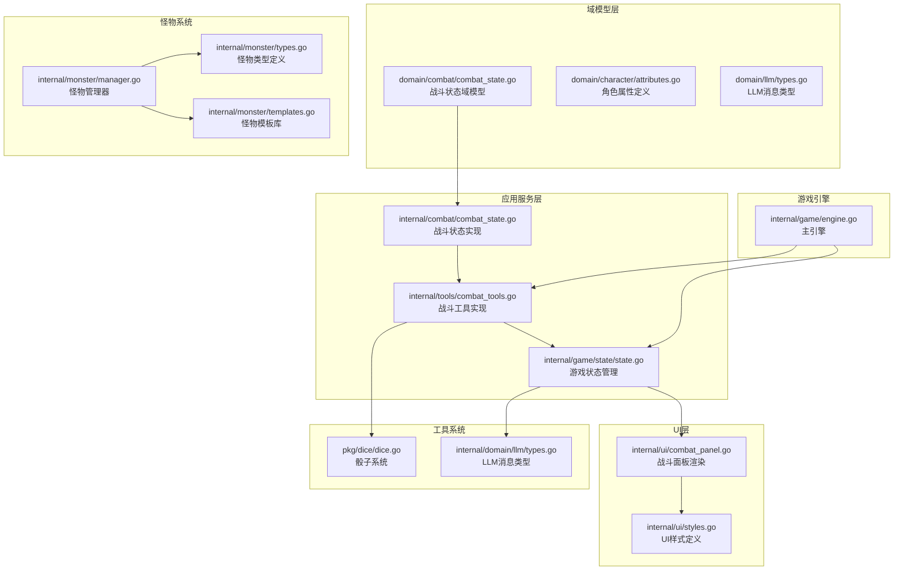

**图表来源**
- [combat_state.go:1-53](file://internal/combat/combat_state.go#L1-L53)
- [combat_state.go:1-53](file://internal/domain/combat/combat_state.go#L1-L53)
- [combat_tools.go:1-667](file://internal/tools/combat_tools.go#L1-L667)
- [engine.go:1-800](file://internal/game/engine.go#L1-L800)

**章节来源**
- [combat_state.go:1-53](file://internal/combat/combat_state.go#L1-L53)
- [combat_state.go:1-53](file://internal/domain/combat/combat_state.go#L1-L53)
- [combat_tools.go:1-667](file://internal/tools/combat_tools.go#L1-L667)
- [engine.go:1-800](file://internal/game/engine.go#L1-L800)

## 核心组件

### 战斗状态管理

**更新** 战斗状态管理系统现在包含完整的域模型定义，提供了更精确的数据结构和功能。

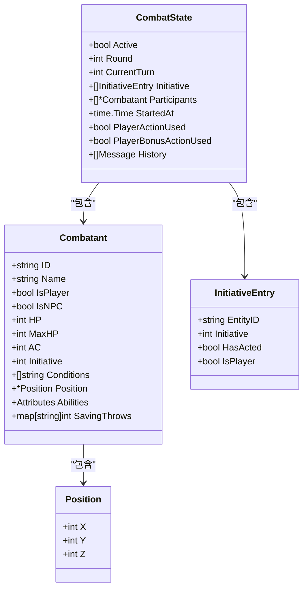

**图表来源**
- [combat_state.go:41-52](file://internal/combat/combat_state.go#L41-L52)
- [combat_state.go:25-39](file://internal/combat/combat_state.go#L25-L39)
- [combat_state.go:17-23](file://internal/combat/combat_state.go#L17-L23)

### 战斗工具系统

**更新** 战斗工具系统提供了完整的战斗操作接口，支持复杂的战斗场景和动态增援。

```mermaid
classDiagram
class StartCombatTool {
+Execute(ctx, args) ToolResult
+Parameters() map[string]interface{}
}
class AttackTool {
+Execute(ctx, args) ToolResult
+Parameters() map[string]interface{}
}
class NextTurnTool {
+Execute(ctx, args) ToolResult
+Parameters() map[string]interface{}
}
class EndCombatTool {
+Execute(ctx, args) ToolResult
+Parameters() map[string]interface{}
}
class SpawnEnemyTool {
+Execute(ctx, args) ToolResult
+Parameters() map[string]interface{}
}
StartCombatTool --> StateAccessor : "依赖"
AttackTool --> StateAccessor : "依赖"
NextTurnTool --> StateAccessor : "依赖"
EndCombatTool --> StateAccessor : "依赖"
SpawnEnemyTool --> StateAccessor : "依赖"
```

**图表来源**
- [combat_tools.go:15-181](file://internal/tools/combat_tools.go#L15-L181)
- [combat_tools.go:183-404](file://internal/tools/combat_tools.go#L183-L404)
- [combat_tools.go:406-471](file://internal/tools/combat_tools.go#L406-L471)
- [combat_tools.go:473-563](file://internal/tools/combat_tools.go#L473-L563)
- [combat_tools.go:565-650](file://internal/tools/combat_tools.go#L565-L650)

**章节来源**
- [combat_state.go:41-52](file://internal/combat/combat_state.go#L41-L52)
- [combat_tools.go:15-667](file://internal/tools/combat_tools.go#L15-L667)

## 架构概览

**更新** 战斗系统采用分层架构设计，确保了模块间的清晰分离和职责明确，同时引入了域模型概念。

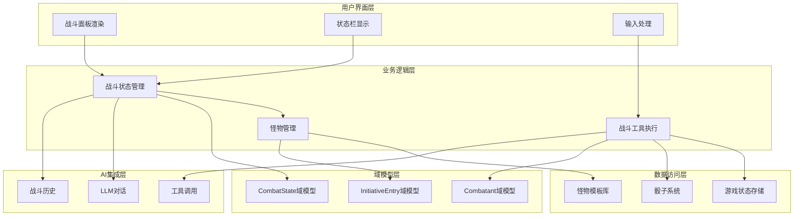

**图表来源**
- [engine.go:26-42](file://internal/game/engine.go#L26-L42)
- [combat_panel.go:11-51](file://internal/ui/combat_panel.go#L11-L51)
- [manager.go:14-24](file://internal/monster/manager.go#L14-L24)

## 详细组件分析

### 战斗状态管理器

**更新** 战斗状态管理器现在提供完整的生命周期管理，包括战斗历史记录和状态持久化。

#### 状态初始化流程

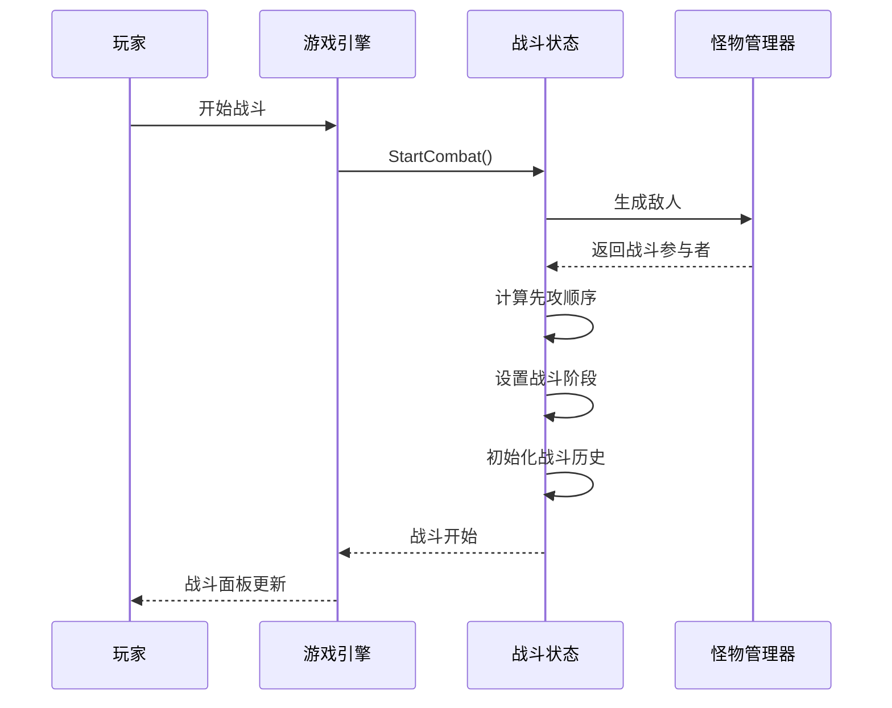

**图表来源**
- [state.go:155-179](file://internal/game/state/state.go#L155-L179)
- [combat_tools.go:57-181](file://internal/tools/combat_tools.go#L57-L181)

#### 战斗回合推进机制

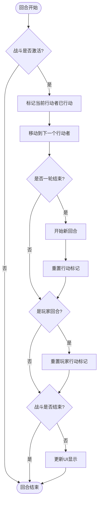

**图表来源**
- [state.go:187-216](file://internal/game/state/state.go#L187-L216)
- [combat_tools.go:428-471](file://internal/tools/combat_tools.go#L428-L471)

**章节来源**
- [state.go:155-216](file://internal/game/state/state.go#L155-L216)
- [combat_tools.go:57-181](file://internal/tools/combat_tools.go#L57-L181)

### 攻击系统

**更新** 攻击系统实现了完整的D&D 5e攻击流程，包括优势/劣势判定和完整的伤害计算。

#### 攻击判定流程

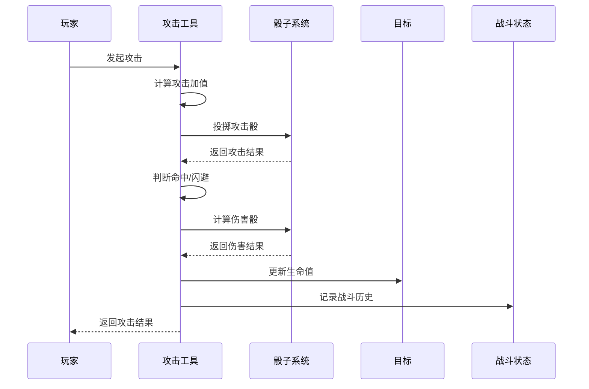

**图表来源**
- [combat_tools.go:230-404](file://internal/tools/combat_tools.go#L230-L404)
- [dice.go:71-113](file://pkg/dice/dice.go#L71-L113)

#### 暴击判定机制

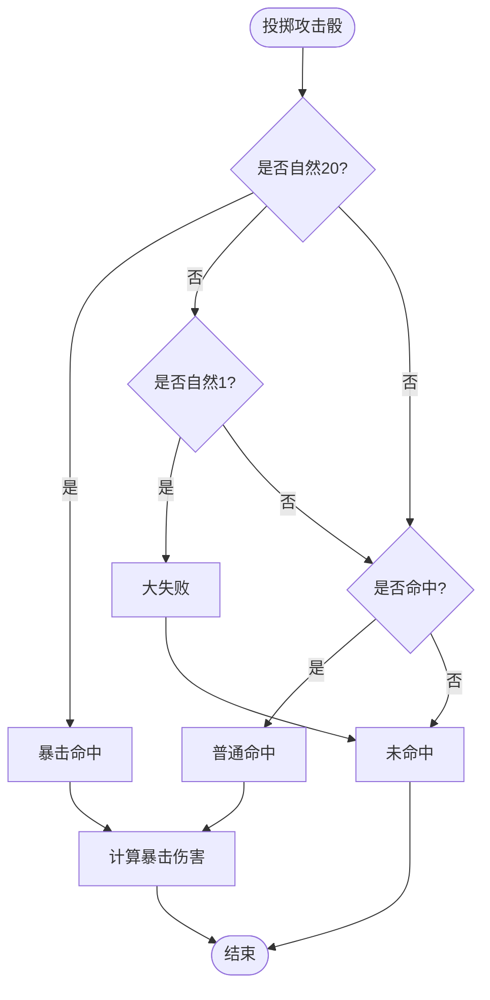

**图表来源**
- [combat_tools.go:290-311](file://internal/tools/combat_tools.go#L290-L311)
- [dice.go:21-31](file://pkg/dice/dice.go#L21-L31)

**章节来源**
- [combat_tools.go:230-404](file://internal/tools/combat_tools.go#L230-L404)
- [dice.go:71-143](file://pkg/dice/dice.go#L71-L143)

### 怪物管理系统

**更新** 怪物管理系统提供了完整的怪物生成和管理功能，支持动态增援和复杂的遭遇战推荐。

#### 怪物生成流程

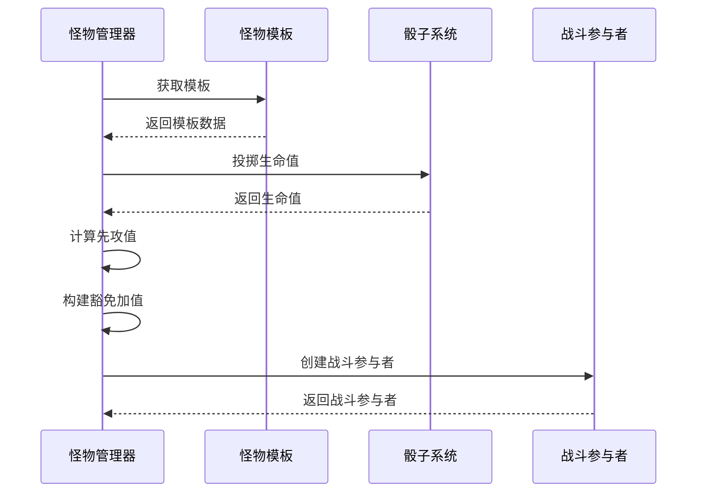

**图表来源**
- [manager.go:26-81](file://internal/monster/manager.go#L26-L81)
- [templates.go:671-680](file://internal/monster/templates.go#L671-L680)

#### 遭遇战推荐系统

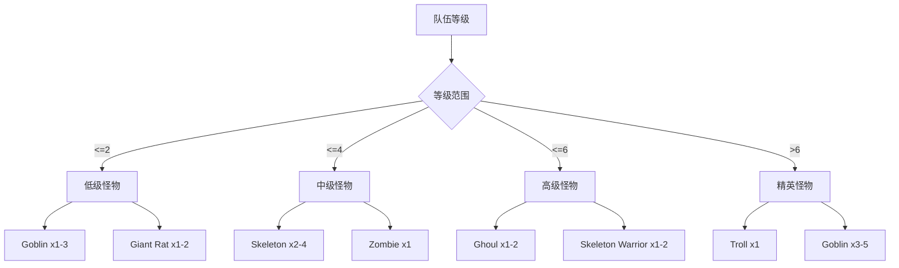

**图表来源**
- [manager.go:151-185](file://internal/monster/manager.go#L151-L185)

**章节来源**
- [manager.go:26-233](file://internal/monster/manager.go#L26-L233)
- [templates.go:671-680](file://internal/monster/templates.go#L671-L680)

### UI交互系统

**更新** 战斗面板提供了实时的战斗状态可视化，支持完整的先攻顺序显示和动态状态更新。

#### 战斗面板渲染流程

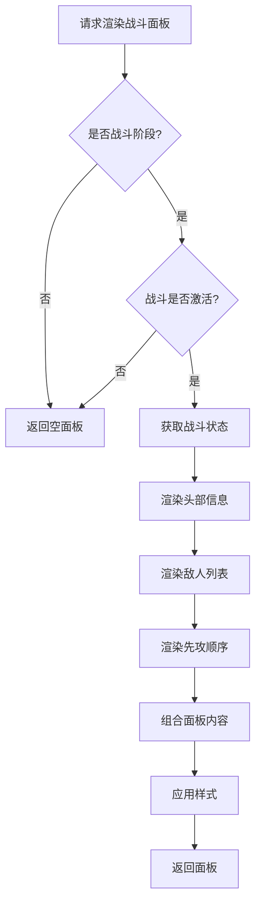

**图表来源**
- [combat_panel.go:11-51](file://internal/ui/combat_panel.go#L11-L51)
- [combat_panel.go:53-85](file://internal/ui/combat_panel.go#L53-L85)
- [combat_panel.go:87-119](file://internal/ui/combat_panel.go#L87-L119)

#### 实时状态更新

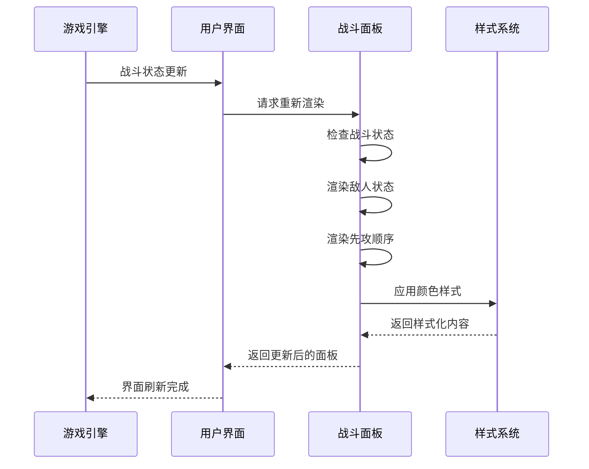

**图表来源**
- [combat_panel.go:121-137](file://internal/ui/combat_panel.go#L121-L137)
- [styles.go:177-212](file://internal/ui/styles.go#L177-L212)

**章节来源**
- [combat_panel.go:11-163](file://internal/ui/combat_panel.go#L11-L163)
- [styles.go:177-212](file://internal/ui/styles.go#L177-L212)

## 依赖关系分析

**更新** 战斗系统各组件之间的依赖关系更加清晰，引入了域模型的概念，提高了系统的模块化程度。

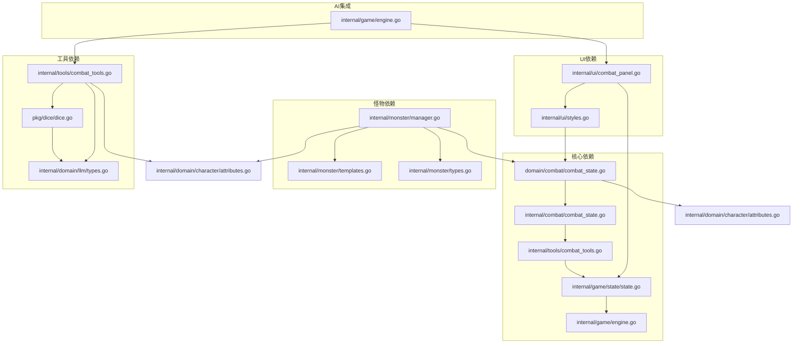

**图表来源**
- [combat_state.go:1-53](file://internal/combat/combat_state.go#L1-L53)
- [combat_state.go:1-53](file://internal/domain/combat/combat_state.go#L1-L53)
- [engine.go:1-24](file://internal/game/engine.go#L1-L24)

**章节来源**
- [combat_state.go:1-53](file://internal/combat/combat_state.go#L1-L53)
- [combat_state.go:1-53](file://internal/domain/combat/combat_state.go#L1-L53)
- [combat_tools.go:1-13](file://internal/tools/combat_tools.go#L1-L13)
- [engine.go:1-24](file://internal/game/engine.go#L1-L24)

## 性能考虑

**更新** 战斗系统在设计时充分考虑了性能优化，特别是在新的架构下。

### 内存管理
- 战斗状态使用指针避免不必要的数据复制
- 怪物模板采用只读模式，避免重复创建
- UI渲染采用增量更新策略
- 战斗历史采用追加模式，避免频繁内存分配

### 计算优化
- 先攻排序使用原地算法，时间复杂度O(n²)
- 骰子系统使用加密安全的随机数生成
- 战斗历史采用追加模式，避免频繁内存分配
- 增量式UI更新减少重绘开销

### 并发安全
- 游戏状态使用原子操作保护
- 自动保存采用CAS机制防止竞态条件
- LLM调用支持异步处理
- 域模型提供线程安全的数据访问

## 故障排除指南

### 常见问题及解决方案

#### 战斗无法开始
**症状**: 调用开始战斗工具返回"战斗已经在进行中"
**原因**: 战斗状态未正确清理
**解决**: 检查战斗结束逻辑，确保调用`EndCombat()`方法

#### 攻击未命中
**症状**: 攻击检定总是失败
**原因**: 攻击加值计算错误或AC过高
**解决**: 验证角色属性调整值和熟练加值

#### 怪物生成失败
**症状**: 生成怪物时报"模板不存在"
**原因**: 怪物ID拼写错误或模板未定义
**解决**: 检查怪物模板库中的ID匹配

#### UI显示异常
**症状**: 战斗面板不显示或显示错误
**原因**: 游戏阶段状态不正确或样式配置错误
**解决**: 验证战斗状态和样式定义

#### 先攻顺序错误
**症状**: 先攻排序不符合预期
**原因**: 先攻值计算错误或排序算法问题
**解决**: 检查先攻值计算和sortInitiative函数

**章节来源**
- [combat_tools.go:57-70](file://internal/tools/combat_tools.go#L57-L70)
- [combat_tools.go:266-272](file://internal/tools/combat_tools.go#L266-L272)
- [manager.go:28-31](file://internal/monster/manager.go#L28-L31)

## 结论

CDND的战斗系统经过完全重写，现在是一个高度集成、模块化的D&D 5e战斗引擎，具有以下特点：

### 技术优势
- **完整的域模型**: 独立的域模型设计，提供清晰的抽象层次
- **增强的状态管理**: 完整的战斗历史记录和状态持久化
- **精确的数据结构**: 详细的CombatState和Combatant定义
- **AI深度集成**: LLM驱动的叙事和决策支持
- **实时可视化**: 直观的战斗状态面板
- **扩展性强**: 模块化设计便于功能扩展

### 设计亮点
- **状态管理**: 清晰的战斗状态生命周期管理
- **工具系统**: 标准化的工具调用接口
- **UI渲染**: 响应式的战斗面板显示
- **数据持久化**: 完整的战斗历史记录
- **先攻系统**: 精确的回合制战斗机制
- **怪物管理**: 灵活的模板系统和动态增援

### 未来发展方向
- 增加更多D&D 5e战斗机制
- 优化性能和内存使用
- 扩展AI智能战斗行为
- 支持多人协作战斗
- 增强战斗历史分析功能

该战斗系统为CDND项目提供了坚实的战斗基础，为玩家创造了沉浸式的角色扮演游戏体验。