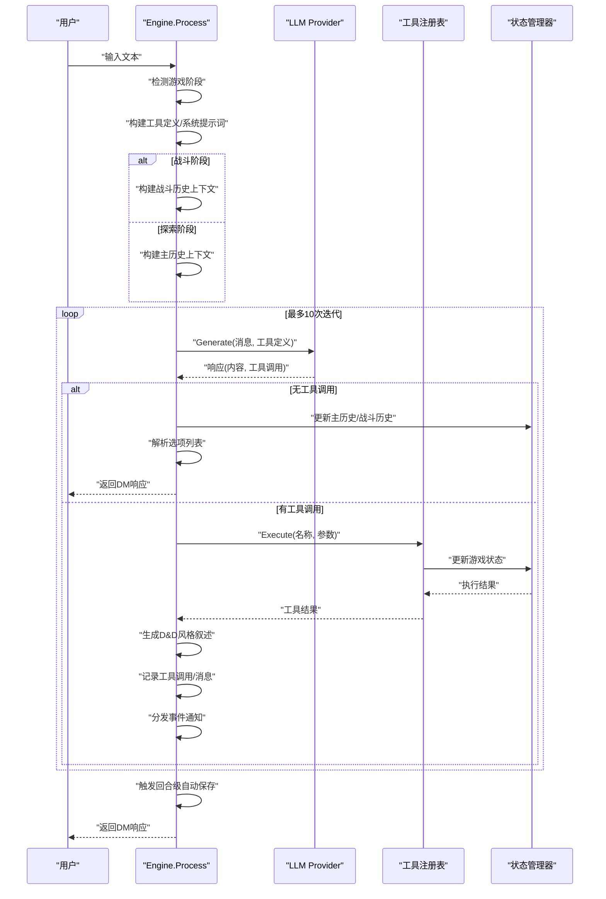
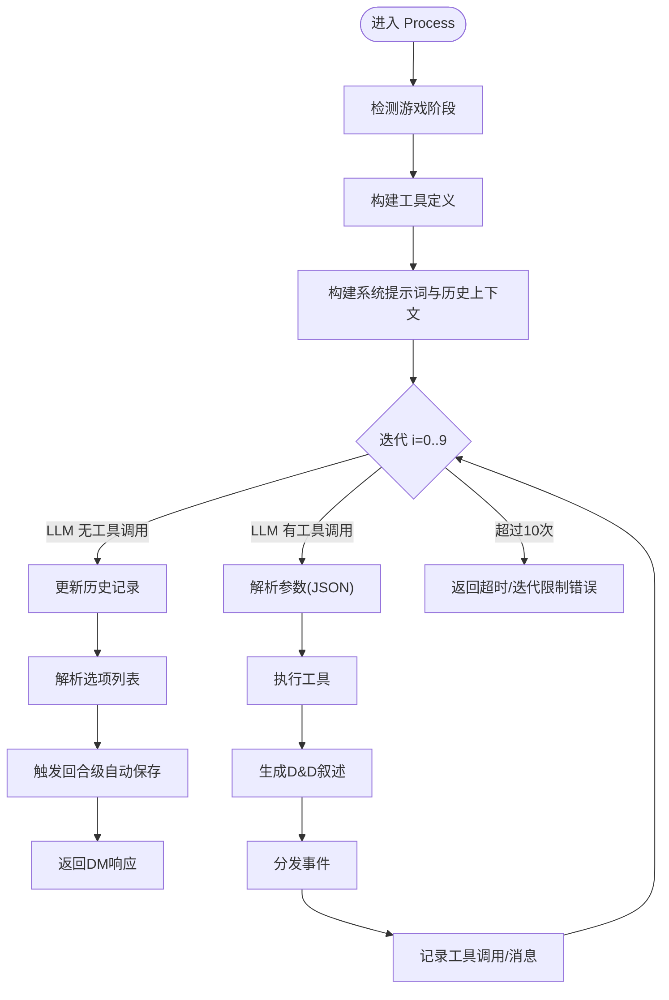
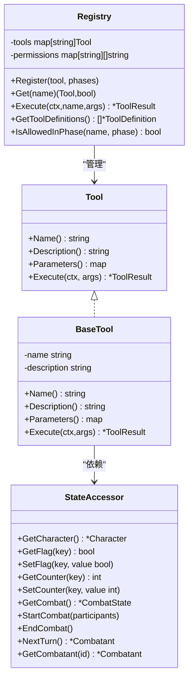
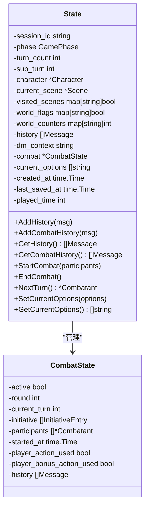
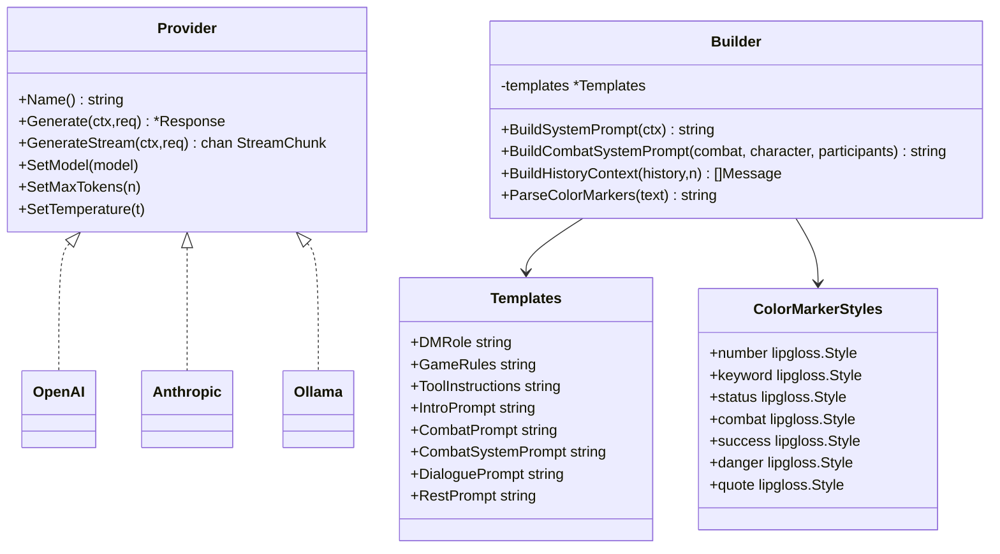
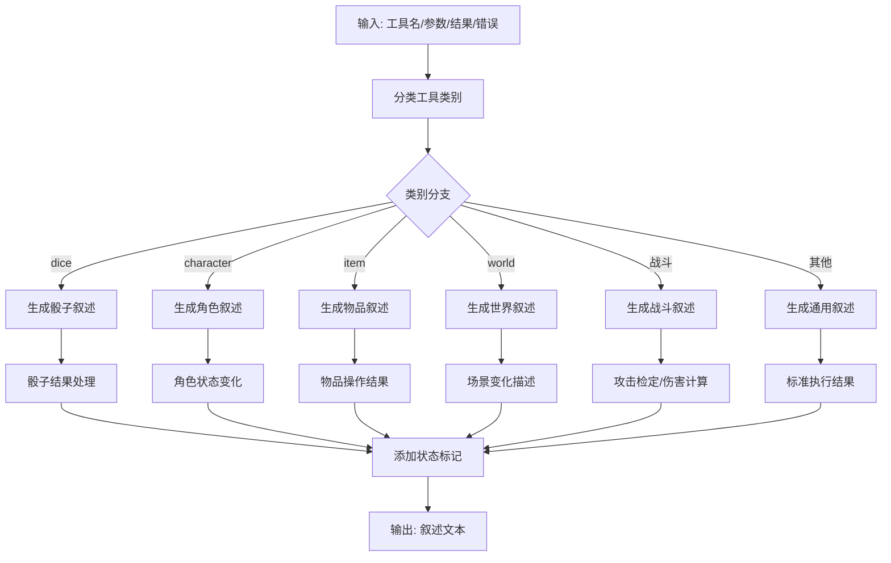
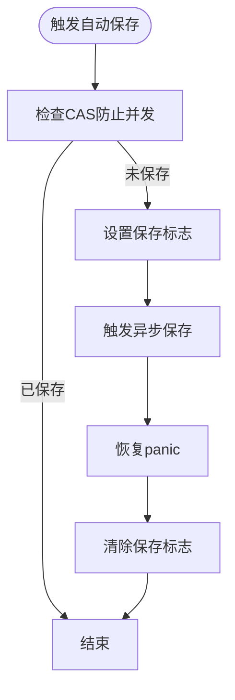
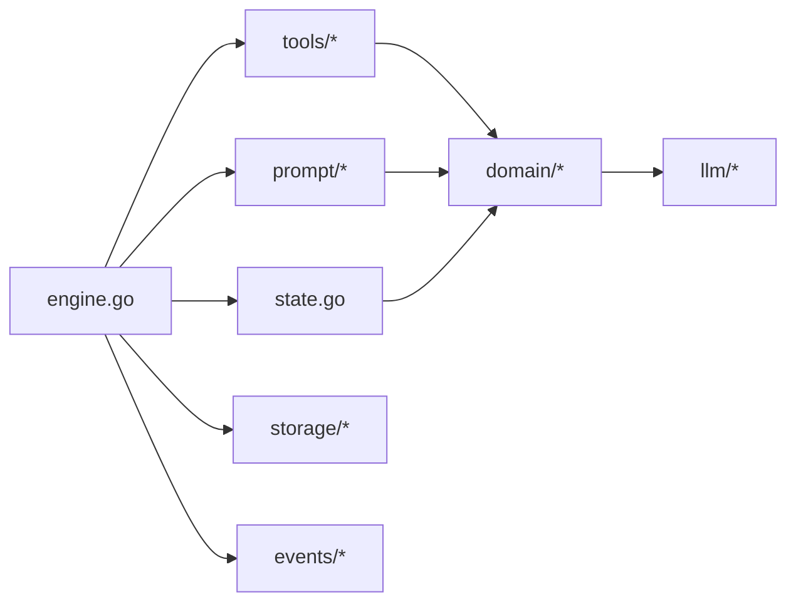

# 智能代理循环

<cite>
**本文引用的文件**
- [main.go](file://main.go)
- [engine.go](file://application/engine/engine.go)
- [init.go](file://application/engine/init.go)
- [registry.go](file://application/tools/registry.go)
- [types.go](file://application/tools/types.go)
- [combat_tools.go](file://application/tools/combat_tools.go)
- [state.go](file://application/state/state.go)
- [combat_state.go](file://domain/combat/combat_state.go)
- [builder.go](file://infrastructure/prompt/builder.go)
- [templates.go](file://infrastructure/prompt/templates.go)
- [game_phase.go](file://domain/game_phase.go)
</cite>

## 更新摘要
**变更内容**
- 完全重写了智能代理循环系统，实现自动工具调用和复杂错误处理
- 新增集成战斗管理系统，支持完整的回合制战斗循环
- 实现独立的历史记录系统，区分主历史和战斗历史
- 增强工具执行跟踪和事件分发机制
- 优化叙述生成算法，支持D&D风格的详细描述
- 实现自动保存和回合级保存机制

## 目录
1. [简介](#简介)
2. [项目结构](#项目结构)
3. [核心组件](#核心组件)
4. [架构总览](#架构总览)
5. [详细组件分析](#详细组件分析)
6. [依赖分析](#依赖分析)
7. [性能考量](#性能考量)
8. [故障排查指南](#故障排查指南)
9. [结论](#结论)
10. [附录](#附录)

## 简介
本文档面向"CDND智能代理循环系统"的重大重构版本，聚焦于核心方法 ProcessWithTools 的实现原理与运行机制。该系统现已完全重写，实现了以下关键特性：
- 自动工具调用循环的设计理念与执行流程
- LLM 调用、工具解析、工具执行与结果反馈的完整闭环
- 最大迭代次数限制与超时处理机制（最多10次迭代）
- 工具调用的参数解析与结果格式化
- D&D 风格叙述生成的算法与模板系统
- 集成战斗管理系统的完整回合制战斗循环
- 独立的历史记录系统（主历史 vs 战斗历史）
- 自动保存和回合级保存机制
- 复杂错误处理和事件分发系统

## 项目结构
该项目采用分层与功能域结合的组织方式，经过重大重构后更加模块化：
- application：应用层逻辑
  - engine：游戏引擎与智能代理循环
  - state：游戏状态管理
  - tools：工具注册与执行系统
- domain：领域模型
  - character：角色系统
  - combat：战斗管理
  - dice：骰子系统
  - world：世界管理
- infrastructure：基础设施
  - prompt：提示词构建与模板
  - storage：存档管理
  - llm：LLM提供者抽象
- interface：用户界面
  - cmd：CLI命令
  - ui：TUI游戏界面

```mermaid
graph TB
subgraph "应用层"
ENGINE["application/engine/engine.go"]
STATE["application/state/state.go"]
TOOLS["application/tools/*"]
END
subgraph "领域模型"
CHAR["domain/character/*"]
COMBAT["domain/combat/*"]
DICE["domain/dice/*"]
WORLD["domain/world/*"]
END
subgraph "基础设施"
PROMPT["infrastructure/prompt/*"]
STORAGE["infrastructure/storage/*"]
LLM["infrastructure/llm/*"]
END
subgraph "用户界面"
CMD["interface/cmd/*"]
UI["interface/ui/*"]
END
ENGINE --> STATE
ENGINE --> TOOLS
ENGINE --> PROMPT
ENGINE --> STORAGE
TOOLS --> CHAR
TOOLS --> COMBAT
TOOLS --> DICE
TOOLS --> WORLD
PROMPT --> LLM
```

**章节来源**
- [engine.go:1-44](file://application/engine/engine.go#L1-L44)
- [state.go:1-47](file://application/state/state.go#L1-L47)
- [registry.go:1-21](file://application/tools/registry.go#L1-L21)

## 核心组件
经过重构后，系统的核心组件更加清晰和模块化：

- **游戏引擎 Engine**：封装状态、LLM 提供者、提示词构建器、工具注册表、世界管理器、存档管理器与事件分发器；提供 Process 方法实现智能代理循环。
- **工具注册表 Registry**：集中管理工具的注册、查询、执行与权限控制。
- **状态管理系统 State**：管理游戏状态，包括主历史记录和独立的战斗历史记录。
- **战斗管理系统**：完整的回合制战斗系统，支持先攻排序、回合推进和战斗状态管理。
- **提示词构建器 Builder**：基于模板与上下文动态生成系统提示词与历史上下文。
- **D&D 风格叙述生成器**：根据工具类别与执行结果生成带样式的叙述文本。

**章节来源**
- [engine.go:28-44](file://application/engine/engine.go#L28-L44)
- [state.go:15-47](file://application/state/state.go#L15-L47)
- [combat_state.go:41-53](file://domain/combat/combat_state.go#L41-L53)

## 架构总览
智能代理循环围绕 Engine.Process 展开，经过重构后具有以下核心流程：
- **阶段检测**：自动检测游戏阶段（探索/战斗），选择相应的提示词构建策略
- **工具定义转换**：将工具元数据转为 LLM 可消费的 ToolDefinition
- **上下文构建**：根据阶段构建系统提示词与历史上下文
- **智能代理循环**：在最多10次迭代内循环执行 LLM → 工具调用 → 工具执行 → 叙述生成 → 事件分发
- **战斗集成**：在战斗阶段自动管理战斗历史和战斗状态
- **自动保存**：每回合结束后触发异步自动保存



**图表来源**
- [engine.go:240-424](file://application/engine/engine.go#L240-L424)
- [engine.go:268-293](file://application/engine/engine.go#L268-L293)

**章节来源**
- [engine.go:240-424](file://application/engine/engine.go#L240-L424)

## 详细组件分析

### Process 智能代理循环（核心重构版）
**更新** 完全重写，实现自动工具调用和复杂错误处理

- **设计理念**
  - 将"思考—行动—反馈"闭环封装为一次调用，通过工具调用实现规则与状态变更
  - 通过最大迭代次数限制（10次）避免无限循环
  - 通过颜色标记与叙述模板提升叙事表现力
  - **新增**：自动检测游戏阶段，分别处理探索和战斗两种模式
  - **新增**：独立的历史记录系统，区分主历史和战斗历史
  - **新增**：集成战斗管理系统，支持完整的回合制战斗循环

- **执行流程**
  1. **阶段检测**：自动从介绍阶段切换到探索阶段，检测当前是否在战斗中
  2. **工具定义转换**：将工具元数据转为 LLM 可消费的 ToolDefinition
  3. **上下文构建**：根据阶段选择使用主历史或战斗历史
  4. **智能代理循环**：LLM → 工具调用解析 → 工具执行 → 叙述生成 → 事件分发 → 结果消息追加
  5. **战斗集成**：在战斗阶段自动管理战斗历史和战斗状态
  6. **自动保存**：每回合结束后触发异步自动保存

- **关键实现要点**
  - **工具参数解析**：JSON 字符串反序列化为 map[string]interface{}
  - **结果格式化**：统一为消息内容字符串，包含成功/失败与错误信息
  - **叙述生成**：按工具类别生成 D&D 风格段落，带状态标记与缩进框线
  - **事件分发**：将工具执行详情广播给订阅者
  - **错误处理**：完善的错误捕获和处理机制
  - **自动保存**：回合级和定时自动保存机制



**图表来源**
- [engine.go:240-424](file://application/engine/engine.go#L240-L424)

**章节来源**
- [engine.go:240-424](file://application/engine/engine.go#L240-L424)

### 工具系统与注册表（增强版）
**更新** 完全重写，增强了工具执行跟踪和权限控制

- **工具接口 Tool**：统一名称、描述、参数 Schema 与执行方法
- **工具结果 ToolResult**：包含成功标志、数据、叙述与错误信息
- **注册表 Registry**：提供注册、查询、执行、权限检查与工具定义导出
- **权限控制**：支持按游戏阶段限制工具使用
- **工具类型**
  - 骰子类：roll_dice、skill_check、saving_throw
  - 角色类：deal_damage、heal_character、add_condition、remove_condition
  - 物品类：add_item、remove_item、spend_gold、gain_gold
  - 世界类：move_to_scene、spawn_npc、remove_npc、set_flag、get_flag
  - **新增**：战斗类：start_combat、attack、next_turn、end_combat、spawn_enemy



**图表来源**
- [types.go:45-43](file://application/tools/types.go#L45-L43)
- [registry.go:9-97](file://application/tools/registry.go#L9-L97)

**章节来源**
- [types.go:45-126](file://application/tools/types.go#L45-L126)
- [registry.go:9-109](file://application/tools/registry.go#L9-L109)

### 状态管理系统（独立历史记录）
**更新** 新增独立的历史记录系统

- **状态结构**：包含会话ID、游戏阶段、回合数、子回合、角色信息、世界信息、对话历史、DM上下文、战斗状态、当前选项、时间戳等
- **独立历史**：主历史记录和战斗历史记录分离管理
- **战斗状态**：完整的战斗管理，包括先攻排序、回合推进、战斗参与者管理
- **选项管理**：支持动态设置和获取当前可用选项
- **自动保存**：支持定时自动保存和回合级保存



**图表来源**
- [state.go:15-414](file://application/state/state.go#L15-L414)
- [combat_state.go:41-53](file://domain/combat/combat_state.go#L41-L53)

**章节来源**
- [state.go:15-414](file://application/state/state.go#L15-L414)
- [combat_state.go:41-53](file://domain/combat/combat_state.go#L41-L53)

### LLM 提供者与提示词模板（增强版）
**更新** 增强了战斗提示词支持和颜色标记系统

- **Provider 接口族**：统一 Generate、GenerateStream、配置设置
- **提示词模板 Templates**：包含 DM 角色、规则、工具说明、场景引导、战斗系统提示等
- **提示词构建器 Builder**：根据 GameContext 动态拼装系统提示词与历史上下文，支持颜色标记解析
- **颜色标记系统**：支持 number、keyword、status、combat、success、danger、quote 等样式标记
- **战斗提示词**：专门的战斗阶段提示词构建，包含战斗状态、先攻顺序等



**图表来源**
- [builder.go:54-370](file://infrastructure/prompt/builder.go#L54-L370)
- [templates.go:3-136](file://infrastructure/prompt/templates.go#L3-L136)

**章节来源**
- [builder.go:54-370](file://infrastructure/prompt/builder.go#L54-L370)
- [templates.go:3-136](file://infrastructure/prompt/templates.go#L3-L136)

### D&D 风格叙述生成（增强版）
**更新** 完全重写，支持详细的战斗叙述和状态标记

- **类别分类**：dice、character、item、world、generic
- **标题与图标**：按工具类型映射到表情符号与标题
- **内容生成**：依据工具名称与结果数据生成段落，包含数值、状态、场景等关键信息
- **样式标记**：统一使用方括号标记包裹关键元素，便于后续渲染
- **战斗叙述**：专门的战斗叙述生成，包含攻击检定、伤害计算、状态变化等
- **状态标记**：根据执行结果自动添加成功/失败/警告标记



**图表来源**
- [engine.go:658-990](file://application/engine/engine.go#L658-L990)

**章节来源**
- [engine.go:658-990](file://application/engine/engine.go#L658-L990)

### 工具实现示例（增强版）
**更新** 新增战斗工具和增强现有工具

- **骰子工具**：roll_dice，支持优势/劣势与大成功/失败判定
- **技能检定**：skill_check，映射中文技能名到内部枚举，支持优势/劣势
- **豁免检定**：saving_throw，映射中文属性名到内部枚举
- **伤害工具**：deal_damage，支持目标与伤害类型
- **治疗工具**：heal_character，支持目标与治疗量
- **状态工具**：add_condition/remove_condition，支持状态效果管理
- **物品工具**：add_item/remove_item/spend_gold/gain_gold
- **世界工具**：move_to_scene/spawn_npc/remove_npc/set_flag/get_flag
- **战斗工具**：start_combat/attack/next_turn/end_combat/spawn_enemy
  - **start_combat**：开始战斗，生成敌人并计算先攻
  - **attack**：进行攻击检定，计算命中和伤害
  - **next_turn**：推进到下一回合，重置玩家行动标记
  - **end_combat**：结束战斗，计算经验和战斗统计
  - **spawn_enemy**：在战斗中生成新的敌人

**章节来源**
- [combat_tools.go:15-667](file://application/tools/combat_tools.go#L15-L667)

### 自动保存系统（新增功能）
**新增** 完整的自动保存机制

- **定时自动保存**：基于配置的时间间隔定期保存游戏
- **回合级自动保存**：每回合结束后触发异步保存
- **并发安全**：使用原子布尔值防止并发保存冲突
- **错误处理**：保存过程中出现的panic会被捕获和记录
- **取消机制**：支持停止自动保存任务



**图表来源**
- [engine.go:566-606](file://application/engine/engine.go#L566-L606)

**章节来源**
- [engine.go:526-606](file://application/engine/engine.go#L526-L606)

## 依赖分析
**更新** 重构后的依赖关系更加清晰

- **内部模块间依赖**：
  - engine 依赖 tools、prompt、state、storage、combat、events
  - tools 依赖 character、combat、dice、monster
  - prompt 依赖 character、combat、world
  - state 依赖 character、combat、llm、quest、world
  - combat 依赖 character、llm
- **外部依赖**：OpenAI、Anthropic SDK、BubbleTea/TUI、UUID、Viper 等



**图表来源**
- [engine.go:3-26](file://application/engine/engine.go#L3-L26)

**章节来源**
- [engine.go:3-26](file://application/engine/engine.go#L3-L26)

## 性能考量
**更新** 增强了性能优化建议

- **上下文截断**：历史上下文按固定轮次截断，避免上下文过长导致延迟与成本上升
- **工具参数解析**：使用 JSON 反序列化，建议在上游严格校验参数 Schema
- **叙述生成**：字符串拼接与条件分支较多，建议在高频路径引入缓存或预编译模板
- **LLM 调用**：合理设置 MaxTokens 与 Temperature，减少不必要的重复调用
- **事件分发**：事件处理应轻量化，避免阻塞主循环
- **并发与流式**：若接入流式输出，需确保消息顺序与工具调用 ID 对齐
- **自动保存**：使用原子操作防止并发保存，异步保存避免阻塞主线程
- **内存管理**：独立的历史记录系统减少了内存占用，但需要注意及时清理

## 故障排查指南
**更新** 增强了故障排查指导

- **工具未找到**：检查工具是否正确注册，名称是否一致
- **参数解析失败**：确认传入 JSON 是否符合工具定义的 Schema
- **权限不足**：检查工具注册时的阶段权限配置
- **LLM 调用失败**：检查 Provider 配置、API Key、网络连通性
- **循环超限**：确认 LLM 是否频繁返回工具调用，必要时调整提示词或规则
- **叙述异常**：检查颜色标记与模板映射，确保渲染链路正常
- **战斗状态异常**：检查战斗初始化和回合推进逻辑
- **自动保存失败**：检查存储权限和磁盘空间
- **历史记录丢失**：确认独立历史系统的正确使用

**章节来源**
- [registry.go:37-97](file://application/tools/registry.go#L37-L97)
- [engine.go:309-311](file://application/engine/engine.go#L309-L311)

## 结论
CDND 的智能代理循环系统经过重大重构后，通过"LLM 思考 + 工具行动 + 叙述反馈"的闭环设计，实现了更加完善和强大的 D&D 风格沉浸式叙事体验。重构的关键改进包括：

- **明确的工具定义与参数 Schema**：支持自动工具调用和复杂参数验证
- **可扩展的工具注册表与权限控制**：支持按游戏阶段限制工具使用
- **结构化的提示词模板与颜色标记系统**：提升叙事表现力和用户体验
- **严谨的循环控制与结果格式化**：支持最多10次迭代的安全循环
- **可观测的事件分发与调试支持**：完整的工具执行跟踪
- **集成战斗管理系统**：完整的回合制战斗循环
- **独立的历史记录系统**：区分主历史和战斗历史
- **自动保存机制**：回合级和定时自动保存
- **复杂的错误处理**：完善的错误捕获和处理机制

## 附录

### 扩展指南：新增工具类型与响应格式
**更新** 基于重构后的架构

- **新增工具**
  - 实现 Tool 接口，定义 Name、Description、Parameters、Execute
  - 在 Engine.registerTools 中注册，如需阶段限制，使用 Register(tool, allowedPhases...)
  - 实现 StateAccessor 接口以访问游戏状态
- **新增工具类别**
  - 在 getToolCategory 中添加映射
  - 在 generateToolNarrative 的 switch 分支中添加对应生成函数
  - 在战斗叙述生成中添加专门的战斗叙述逻辑
- **新增响应格式**
  - 在 formatToolResult 中扩展消息格式
  - 在 Prompt 模板中补充说明与示例
- **新增战斗工具**
  - 实现战斗相关的工具，如治疗、状态管理、场景交互等
  - 确保正确更新战斗状态和历史记录
  - 实现适当的叙述生成逻辑

**章节来源**
- [engine.go:69-113](file://application/engine/engine.go#L69-L113)
- [engine.go:707-721](file://application/engine/engine.go#L707-L721)
- [engine.go:658-705](file://application/engine/engine.go#L658-L705)
- [combat_tools.go:15-667](file://application/tools/combat_tools.go#L15-L667)