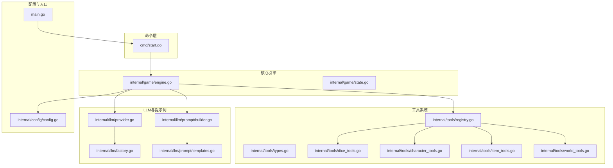
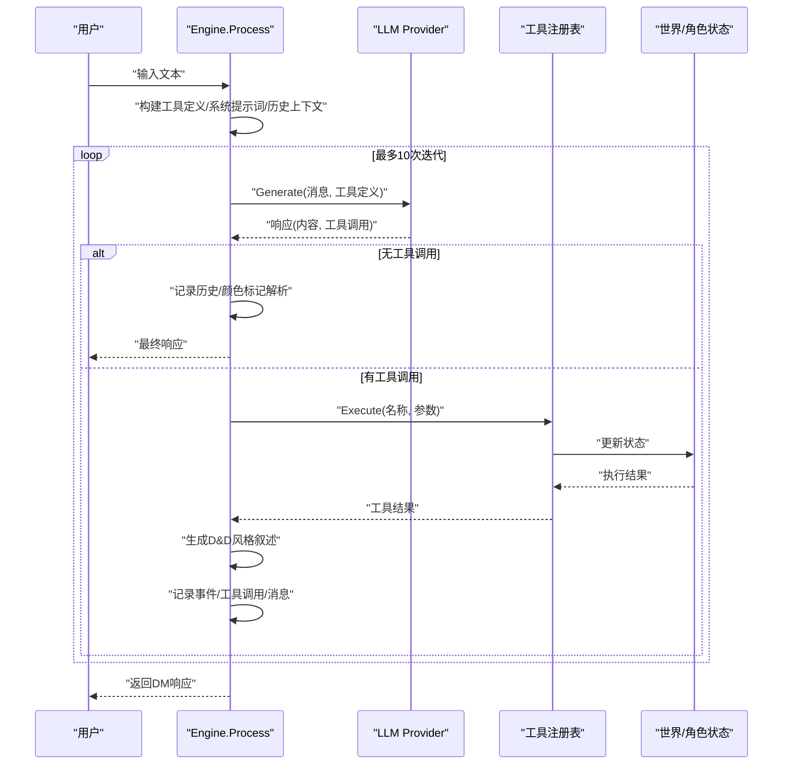
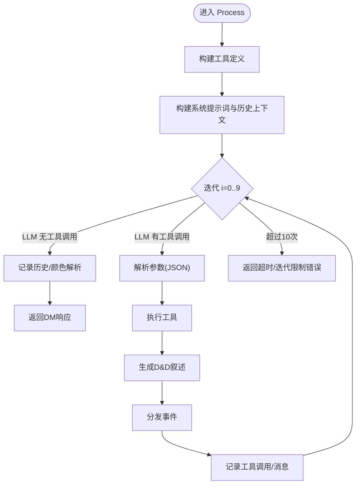
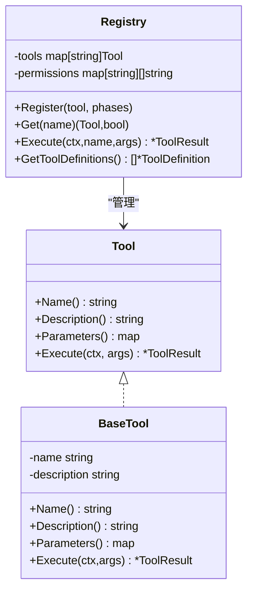
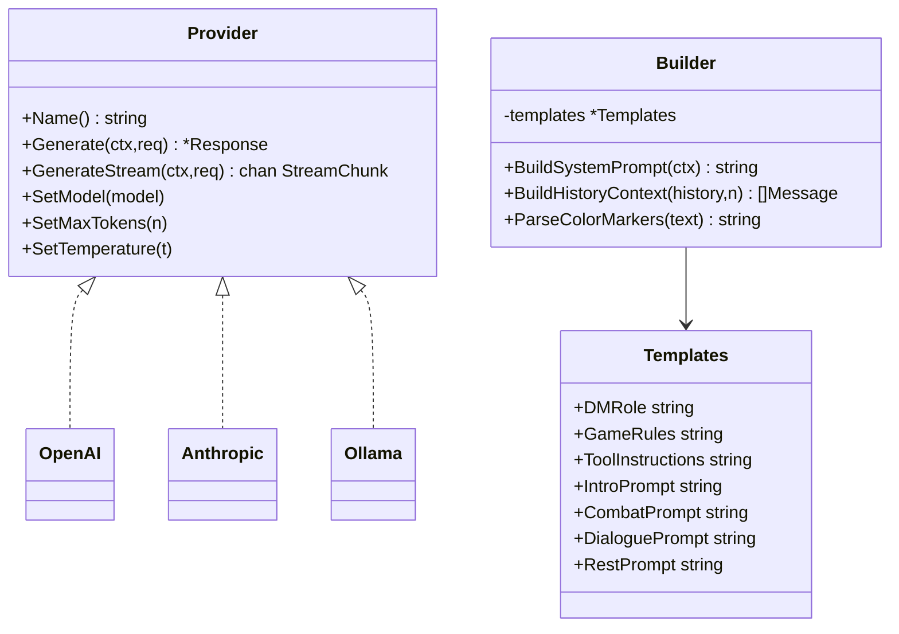
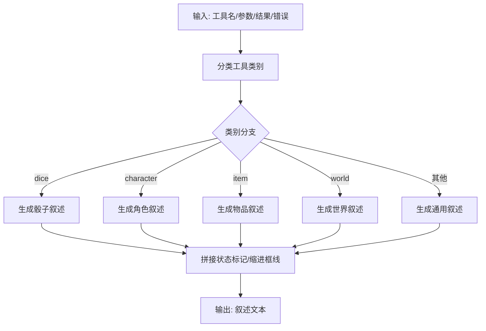
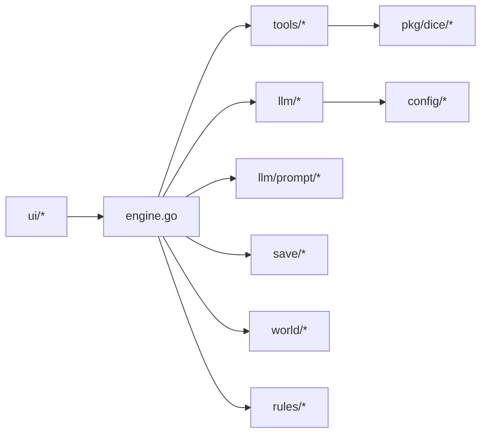

# 智能代理循环

<cite>
**本文引用的文件**
- [main.go](file://main.go)
- [engine.go](file://internal/game/engine.go)
- [registry.go](file://internal/tools/registry.go)
- [types.go](file://internal/tools/types.go)
- [provider.go](file://internal/llm/provider.go)
- [factory.go](file://internal/llm/factory.go)
- [builder.go](file://internal/llm/prompt/builder.go)
- [templates.go](file://internal/llm/prompt/templates.go)
- [start.go](file://cmd/start.go)
- [config.go](file://internal/config/config.go)
- [dice_tools.go](file://internal/tools/dice_tools.go)
- [character_tools.go](file://internal/tools/character_tools.go)
- [item_tools.go](file://internal/tools/item_tools.go)
- [world_tools.go](file://internal/tools/world_tools.go)
- [go.mod](file://go.mod)
</cite>

## 目录
1. [简介](#简介)
2. [项目结构](#项目结构)
3. [核心组件](#核心组件)
4. [架构总览](#架构总览)
5. [详细组件分析](#详细组件分析)
6. [依赖分析](#依赖分析)
7. [性能考量](#性能考量)
8. [故障排查指南](#故障排查指南)
9. [结论](#结论)
10. [附录](#附录)

## 简介
本文件面向“CDND智能代理循环系统”，聚焦于核心方法 ProcessWithTools 的实现原理与运行机制，系统性阐述如下主题：
- 工具调用循环的设计理念与执行流程
- LLM 调用、工具解析、工具执行与结果反馈的完整闭环
- 最大迭代次数限制与超时处理机制
- 工具调用的参数解析与结果格式化
- D&D 风格叙述生成的算法与模板系统
- 循环优化策略与性能调优建议
- 扩展循环以支持新的工具类型与响应格式的方法

## 项目结构
该项目采用分层与功能域结合的组织方式：
- cmd：CLI 命令入口，负责启动引擎与用户界面
- internal：核心业务逻辑
  - game：游戏引擎与状态机
  - tools：工具注册与执行
  - llm：LLM 提供者抽象与提示词模板
  - config：配置管理
  - ui：TUI 游戏界面
  - world/character/rules/save：领域模型与持久化
- pkg：通用库（骰子解析等）

图表来源
- [engine.go:1-797](file://internal/game/engine.go#L1-L797)
- [registry.go:1-109](file://internal/tools/registry.go#L1-L109)
- [provider.go:1-114](file://internal/llm/provider.go#L1-L114)
- [factory.go:1-69](file://internal/llm/factory.go#L1-L69)
- [builder.go:1-273](file://internal/llm/prompt/builder.go#L1-L273)
- [templates.go:1-102](file://internal/llm/prompt/templates.go#L1-L102)
- [start.go:1-99](file://cmd/start.go#L1-L99)
- [config.go:1-54](file://internal/config/config.go#L1-L54)
- [main.go:1-8](file://main.go#L1-L8)

章节来源
- [main.go:1-8](file://main.go#L1-L8)
- [start.go:1-99](file://cmd/start.go#L1-L99)
- [engine.go:1-797](file://internal/game/engine.go#L1-L797)
- [registry.go:1-109](file://internal/tools/registry.go#L1-L109)
- [provider.go:1-114](file://internal/llm/provider.go#L1-L114)
- [factory.go:1-69](file://internal/llm/factory.go#L1-L69)
- [builder.go:1-273](file://internal/llm/prompt/builder.go#L1-L273)
- [templates.go:1-102](file://internal/llm/prompt/templates.go#L1-L102)
- [config.go:1-54](file://internal/config/config.go#L1-L54)

## 核心组件
- 游戏引擎 Engine：封装状态、LLM 提供者、提示词构建器、工具注册表、世界管理器、存档管理器与事件分发器；提供 Process 方法实现智能代理循环。
- 工具注册表 Registry：集中管理工具的注册、查询、执行与权限控制。
- LLM Provider 接口族：统一请求/响应、流式输出与工具调用定义。
- 提示词构建器 Builder：基于模板与上下文动态生成系统提示词与历史上下文。
- D&D 风格叙述生成器：根据工具类别与执行结果生成带样式的叙述文本。

章节来源
- [engine.go:22-56](file://internal/game/engine.go#L22-L56)
- [registry.go:9-46](file://internal/tools/registry.go#L9-L46)
- [provider.go:27-114](file://internal/llm/provider.go#L27-L114)
- [builder.go:51-112](file://internal/llm/prompt/builder.go#L51-L112)
- [templates.go:4-102](file://internal/llm/prompt/templates.go#L4-L102)

## 架构总览
智能代理循环围绕 Engine.Process 展开，其核心流程如下：
- 构建工具定义（LLM 可见）
- 构建系统提示词与历史上下文
- 在最多 N 次迭代内循环：
  - LLM 生成内容与工具调用
  - 若无工具调用，结束循环并返回
  - 若有工具调用，解析参数、执行工具、生成叙述、记录事件与消息
- 超过最大迭代次数则报错退出

图表来源
- [engine.go:195-316](file://internal/game/engine.go#L195-L316)
- [provider.go:27-46](file://internal/llm/provider.go#L27-L46)
- [registry.go:37-46](file://internal/tools/registry.go#L37-L46)

章节来源
- [engine.go:195-316](file://internal/game/engine.go#L195-L316)

## 详细组件分析

### Process 智能代理循环（核心）
- 设计理念
  - 将“思考—行动—反馈”闭环封装为一次调用，通过工具调用实现规则与状态变更
  - 通过最大迭代次数限制避免无限循环
  - 通过颜色标记与叙述模板提升叙事表现力
- 执行流程
  - 工具定义转换：将工具元数据转为 LLM 可消费的 ToolDefinition
  - 上下文构建：系统提示词 + 历史上下文 + 用户输入
  - 循环执行：LLM → 工具调用解析 → 工具执行 → 叙述生成 → 事件分发 → 结果消息追加
  - 终止条件：无工具调用或达到最大迭代次数
- 关键实现要点
  - 工具参数解析：JSON 字符串反序列化为 map[string]interface{}
  - 结果格式化：统一为消息内容字符串，包含成功/失败与错误信息
  - 叙述生成：按工具类别生成 D&D 风格段落，带状态标记与缩进框线
  - 事件分发：将工具执行详情广播给订阅者

图表来源
- [engine.go:195-316](file://internal/game/engine.go#L195-L316)
- [provider.go:27-46](file://internal/llm/provider.go#L27-L46)
- [registry.go:37-57](file://internal/tools/registry.go#L37-L57)

章节来源
- [engine.go:195-316](file://internal/game/engine.go#L195-L316)

### 工具系统与注册表
- 工具接口 Tool：统一名称、描述、参数 Schema 与执行方法
- 工具结果 ToolResult：包含成功标志、数据、叙述与错误信息
- 注册表 Registry：提供注册、查询、执行、权限检查与工具定义导出
- 工具类型
  - 骰子类：roll_dice、skill_check、saving_throw
  - 角色类：deal_damage、heal_character、add_condition、remove_condition
  - 物品类：add_item、remove_item、spend_gold、gain_gold
  - 世界类：move_to_scene、spawn_npc、remove_npc、set_flag、get_flag

图表来源
- [types.go:24-108](file://internal/tools/types.go#L24-L108)
- [registry.go:9-46](file://internal/tools/registry.go#L9-L46)

章节来源
- [types.go:24-108](file://internal/tools/types.go#L24-L108)
- [registry.go:9-109](file://internal/tools/registry.go#L9-L109)

### LLM 提供者与提示词模板
- Provider 接口族：统一 Generate、GenerateStream、配置设置
- 请求/响应结构：消息、工具定义、工具调用、流式数据块
- 提示词模板 Templates：包含 DM 角色、规则、工具说明、场景引导等
- 提示词构建器 Builder：根据 GameContext 动态拼装系统提示词与历史上下文，并支持颜色标记解析

图表来源
- [provider.go:64-114](file://internal/llm/provider.go#L64-L114)
- [factory.go:9-69](file://internal/llm/factory.go#L9-L69)
- [builder.go:51-112](file://internal/llm/prompt/builder.go#L51-L112)
- [templates.go:4-102](file://internal/llm/prompt/templates.go#L4-L102)

章节来源
- [provider.go:64-114](file://internal/llm/provider.go#L64-L114)
- [factory.go:9-69](file://internal/llm/factory.go#L9-L69)
- [builder.go:51-112](file://internal/llm/prompt/builder.go#L51-L112)
- [templates.go:4-102](file://internal/llm/prompt/templates.go#L4-L102)

### D&D 风格叙述生成
- 类别分类：dice、character、item、world、generic
- 标题与图标：按工具类型映射到表情符号与标题
- 内容生成：依据工具名称与结果数据生成段落，包含数值、状态、场景等关键信息
- 样式标记：统一使用方括号标记包裹关键元素，便于后续渲染

图表来源
- [engine.go:465-512](file://internal/game/engine.go#L465-L512)
- [engine.go:514-528](file://internal/game/engine.go#L514-L528)
- [engine.go:556-796](file://internal/game/engine.go#L556-L796)

章节来源
- [engine.go:465-796](file://internal/game/engine.go#L465-L796)

### 工具实现示例（节选）
- 骰子工具：roll_dice，支持优势/劣势与大成功/失败判定
- 技能检定：skill_check，映射中文技能名到内部枚举，支持优势/劣势
- 豁免检定：saving_throw，映射中文属性名到内部枚举
- 伤害工具：deal_damage，支持目标与伤害类型
- 治疗工具：heal_character，支持目标与治疗量
- 物品工具：add_item/remove_item/spend_gold/gain_gold
- 世界工具：move_to_scene/spawn_npc/remove_npc/set_flag/get_flag

章节来源
- [dice_tools.go:12-314](file://internal/tools/dice_tools.go#L12-L314)
- [character_tools.go:8-321](file://internal/tools/character_tools.go#L8-L321)
- [item_tools.go:8-287](file://internal/tools/item_tools.go#L8-L287)
- [world_tools.go:8-330](file://internal/tools/world_tools.go#L8-L330)

## 依赖分析
- 外部依赖：OpenAI、Anthropic SDK、BubbleTea/TUI、UUID、Viper 等
- 内部模块间依赖：
  - engine 依赖 tools、llm、prompt、config、save、world、rules
  - tools 依赖 character、rules、dice
  - llm 依赖 config
  - ui 依赖 game

图表来源
- [engine.go:3-20](file://internal/game/engine.go#L3-L20)
- [go.mod:5-54](file://go.mod#L5-L54)

章节来源
- [engine.go:3-20](file://internal/game/engine.go#L3-L20)
- [go.mod:5-54](file://go.mod#L5-L54)

## 性能考量
- 上下文截断：历史上下文按固定轮次截断，避免上下文过长导致延迟与成本上升
- 工具参数解析：使用 JSON 反序列化，建议在上游严格校验参数 Schema
- 叙述生成：字符串拼接与条件分支较多，建议在高频路径引入缓存或预编译模板
- LLM 调用：合理设置 MaxTokens 与 Temperature，减少不必要的重复调用
- 事件分发：事件处理应轻量化，避免阻塞主循环
- 并发与流式：若接入流式输出，需确保消息顺序与工具调用 ID 对齐

## 故障排查指南
- 工具未找到：检查工具是否正确注册，名称是否一致
- 参数解析失败：确认传入 JSON 是否符合工具定义的 Schema
- 权限不足：检查工具注册时的阶段权限配置
- LLM 调用失败：检查 Provider 配置、API Key、网络连通性
- 循环超限：确认 LLM 是否频繁返回工具调用，必要时调整提示词或规则
- 叙述异常：检查颜色标记与模板映射，确保渲染链路正常

章节来源
- [registry.go:37-57](file://internal/tools/registry.go#L37-L57)
- [engine.go:230-316](file://internal/game/engine.go#L230-L316)

## 结论
CDND 的智能代理循环通过“LLM 思考 + 工具行动 + 叙述反馈”的闭环设计，实现了 D&D 风格的沉浸式叙事体验。其关键在于：
- 明确的工具定义与参数 Schema
- 可扩展的工具注册表与权限控制
- 结构化的提示词模板与颜色标记系统
- 严谨的循环控制与结果格式化
- 可观测的事件分发与调试支持

## 附录

### 扩展指南：新增工具类型与响应格式
- 新增工具
  - 实现 Tool 接口，定义 Name、Description、Parameters、Execute
  - 在 Engine.registerTools 中注册
  - 如需阶段限制，使用 Register(tool, allowedPhases...)
- 新增工具类别
  - 在 getToolCategory 中添加映射
  - 在 generateToolNarrative 的 switch 分支中添加对应生成函数
- 新增响应格式
  - 在 formatToolResult 中扩展消息格式
  - 在 Prompt 模板中补充说明与示例

章节来源
- [engine.go:58-76](file://internal/game/engine.go#L58-L76)
- [engine.go:514-528](file://internal/game/engine.go#L514-L528)
- [engine.go:465-512](file://internal/game/engine.go#L465-L512)
- [engine.go:424-451](file://internal/game/engine.go#L424-L451)
- [templates.go:55-67](file://internal/llm/prompt/templates.go#L55-L67)