# 游戏引擎架构

<cite>
**本文引用的文件**
- [main.go](file://main.go)
- [root.go](file://cmd/root.go)
- [engine.go](file://internal/game/engine.go)
- [state.go](file://internal/game/state.go)
- [events.go](file://internal/game/events.go)
- [init.go](file://internal/game/init.go)
- [types.go](file://internal/game/types.go)
- [provider.go](file://internal/llm/provider.go)
- [registry.go](file://internal/tools/registry.go)
- [types.go](file://internal/tools/types.go)
- [manager.go](file://internal/world/manager.go)
- [manager.go](file://internal/save/manager.go)
- [types.go](file://internal/save/types.go)
- [config.go](file://internal/config/config.go)
- [character.go](file://internal/character/character.go)
</cite>

## 目录
1. [简介](#简介)
2. [项目结构](#项目结构)
3. [核心组件](#核心组件)
4. [架构总览](#架构总览)
5. [详细组件分析](#详细组件分析)
6. [依赖关系分析](#依赖关系分析)
7. [性能考量](#性能考量)
8. [故障排查指南](#故障排查指南)
9. [结论](#结论)
10. [附录](#附录)

## 简介
本文件为 CDND 游戏引擎的全面架构文档，面向开发者与架构师，系统阐述引擎的设计理念、核心架构模式与关键子系统协作方式。重点覆盖以下方面：
- 状态管理系统：以统一 State 为核心，承载会话、角色、世界、历史、战斗等状态，并提供回合制战斗状态机。
- 事件分发机制：基于事件类型与处理器注册的事件驱动架构，支持同步分发与队列处理。
- 工具调用循环：以 LLM 为中枢的“调用-执行-反馈-循环”代理智能体工作流。
- 子系统协调：LLM 提供商、工具系统、规则引擎、世界管理器、存档管理器之间的职责边界与交互契约。
- 初始化与生命周期：CLI 启动、配置加载、引擎实例化、会话启动与加载、保存/加载流程。
- 性能优化与内存管理：并发安全、缓存策略、序列化开销控制与资源释放。

## 项目结构
仓库采用按领域与层次混合的组织方式：
- cmd：CLI 命令入口与配置初始化
- internal：核心业务域
  - game：引擎内核、状态、事件、回合制逻辑
  - llm：LLM 抽象与提供商适配
  - tools：工具注册表与工具接口
  - world：世界管理器（场景、NPC、连接）
  - save：存档管理器（文件系统持久化）
  - character：D&D 5e 角色模型
  - config：配置结构
- pkg：通用工具与领域扩展（dice、dnd5e）

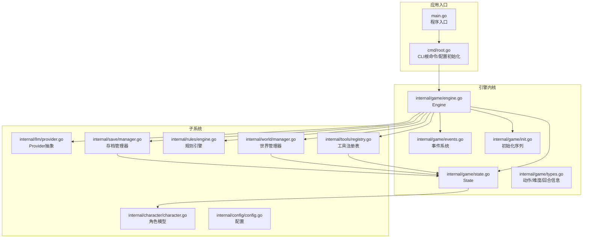

**图表来源**
- [main.go:1-8](file://main.go#L1-L8)
- [root.go:1-95](file://cmd/root.go#L1-L95)
- [engine.go:1-797](file://internal/game/engine.go#L1-L797)
- [state.go:1-236](file://internal/game/state.go#L1-L236)
- [events.go:1-244](file://internal/game/events.go#L1-L244)
- [init.go:1-66](file://internal/game/init.go#L1-L66)
- [types.go:1-162](file://internal/game/types.go#L1-L162)
- [provider.go:1-114](file://internal/llm/provider.go#L1-L114)
- [registry.go:1-132](file://internal/tools/registry.go#L1-L132)
- [manager.go:1-294](file://internal/world/manager.go#L1-L294)
- [manager.go:1-364](file://internal/save/manager.go#L1-L364)
- [types.go:1-217](file://internal/save/types.go#L1-L217)
- [config.go:1-54](file://internal/config/config.go#L1-L54)
- [character.go:1-223](file://internal/character/character.go#L1-L223)

**章节来源**
- [main.go:1-8](file://main.go#L1-L8)
- [root.go:1-95](file://cmd/root.go#L1-L95)

## 核心组件
- 引擎内核 Engine：聚合状态、LLM、提示词构建、规则引擎、世界管理、存档、工具注册表、事件分发器与配置；提供会话启动/加载/保存、工具调用循环、回合推进、战斗状态管理、事件订阅等能力。
- 状态 State：集中存储会话标识、阶段、回合、角色、当前场景、访问过的场景、世界标志/计数器、任务、历史、战斗状态、时间戳等。
- 事件系统 EventDispatcher：提供事件类型枚举、事件结构、处理器注册/取消、同步分发、队列与处理、清空、存在性检查等。
- 工具系统 Registry：提供工具注册、查找、执行、从 JSON 执行、定义导出、阶段权限检查、统计与清理等。
- LLM Provider 抽象：统一消息、请求、响应、流式分片、工具定义/调用的接口与数据结构。
- 世界管理器 World Manager：场景与 NPC 的增删改查、场景连接、跨场景移动、导入/导出。
- 存档管理器 Save Manager：本地文件系统存档槽位管理、序列化/反序列化、缓存、快速保存/加载、元数据统计。
- 角色模型 Character：D&D 5e 角色属性、生命值、先攻、熟练、技能、豁免、装备、金币、状态效果等。

**章节来源**
- [engine.go:1-797](file://internal/game/engine.go#L1-L797)
- [state.go:1-236](file://internal/game/state.go#L1-L236)
- [events.go:1-244](file://internal/game/events.go#L1-L244)
- [registry.go:1-132](file://internal/tools/registry.go#L1-L132)
- [provider.go:1-114](file://internal/llm/provider.go#L1-L114)
- [manager.go:1-294](file://internal/world/manager.go#L1-L294)
- [manager.go:1-364](file://internal/save/manager.go#L1-L364)
- [character.go:1-223](file://internal/character/character.go#L1-L223)

## 架构总览
引擎采用“事件驱动 + 工具调用循环”的架构模式，围绕 Engine 协调各子系统：
- 输入层：CLI 命令触发引擎初始化与会话控制。
- 控制层：Engine 负责状态推进、回合制战斗、事件分发、工具注册与执行、LLM 交互。
- 数据层：State 作为单一真相源；World/Save/Character 等模块通过接口与 Engine 交互。
- 外部集成：LLM 提供商抽象统一不同服务；工具系统将业务操作封装为可被 LLM 调用的功能。

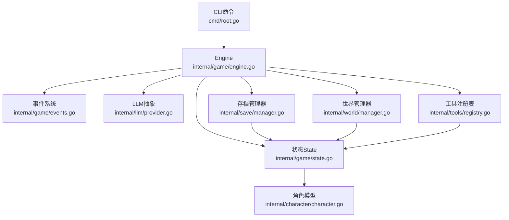

**图表来源**
- [root.go:1-95](file://cmd/root.go#L1-L95)
- [engine.go:1-797](file://internal/game/engine.go#L1-L797)
- [events.go:1-244](file://internal/game/events.go#L1-L244)
- [state.go:1-236](file://internal/game/state.go#L1-L236)
- [provider.go:1-114](file://internal/llm/provider.go#L1-L114)
- [registry.go:1-132](file://internal/tools/registry.go#L1-L132)
- [manager.go:1-294](file://internal/world/manager.go#L1-L294)
- [manager.go:1-364](file://internal/save/manager.go#L1-L364)
- [character.go:1-223](file://internal/character/character.go#L1-L223)

## 详细组件分析

### 引擎内核 Engine
- 职责
  - 组合子系统：LLM 提供商、提示词构建、规则引擎、世界管理、存档、工具注册表、事件分发器、配置。
  - 会话生命周期：Start/Load/Save；重置/更新 State 字段而不重建对象，确保工具持有的 State 引用有效。
  - 工具调用循环：构建系统提示与历史上下文，调用 LLM，解析工具调用，执行工具，生成叙述，分发事件，循环直至终止条件。
  - 回合制战斗：推进回合、切换行动者、结束战斗、阶段切换。
  - 事件发布：角色损伤/治疗、场景变更、阶段变更、工具执行等。
- 关键流程
  - ProcessWithTools：代理智能体循环，最多迭代固定次数，避免无限循环。
  - generateToolNarrative：按工具类别生成 D&D 风格叙述，增强叙事体验。
  - SetPhase/SetScene/TakeDamage/Heal：状态变更与事件分发。
- 并发与一致性
  - 通过持有 State 引用进行状态更新，避免竞态。
  - 事件分发器内部使用读写锁保护处理器列表与队列。

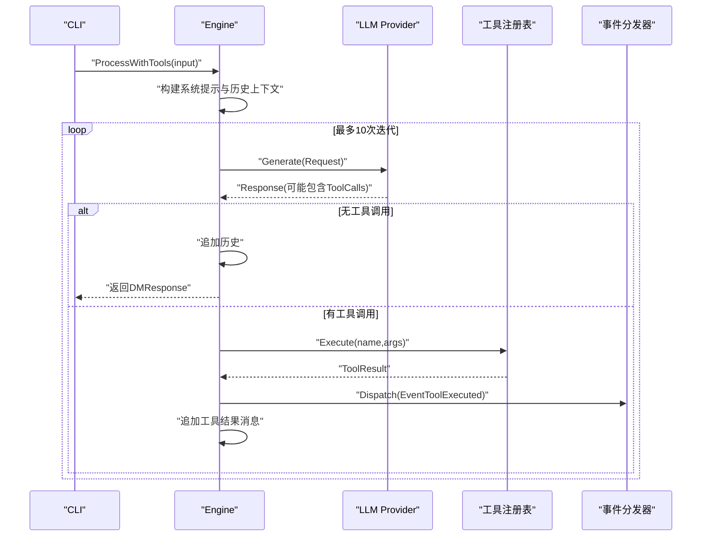

**图表来源**
- [engine.go:195-316](file://internal/game/engine.go#L195-L316)
- [provider.go:64-83](file://internal/llm/provider.go#L64-L83)
- [registry.go:43-54](file://internal/tools/registry.go#L43-L54)
- [events.go:171-180](file://internal/game/events.go#L171-L180)

**章节来源**
- [engine.go:1-797](file://internal/game/engine.go#L1-L797)

### 状态管理系统 State
- 数据结构
  - SessionID、Phase、TurnCount/SubTurn：会话与回合控制。
  - Character：角色对象。
  - CurrentScene/VisitedScenes：当前场景与访问历史。
  - WorldFlags/WorldCounters：全局世界状态（任务、开关、计数）。
  - Quests：任务集合。
  - History/DMContext：对话历史与 DM 上下文。
  - Combat：战斗状态（Active/Round/CurrentTurn/Initiative/Participants/StartedAt）。
  - CreatedAt/LastSavedAt/PlayedTime：时间戳与游戏时长。
- 回合制战斗状态机
  - StartCombat：按先攻排序初始化战斗状态，切换至战斗阶段。
  - NextTurn：推进到下一行动者，轮转后重置 HasActed 标记。
  - EndCombat：结束战斗并回到探索阶段。
- 并发与拷贝
  - GetHistory 返回副本，避免外部修改内部切片。
  - SetCurrentScene 自动记录访问过的场景。

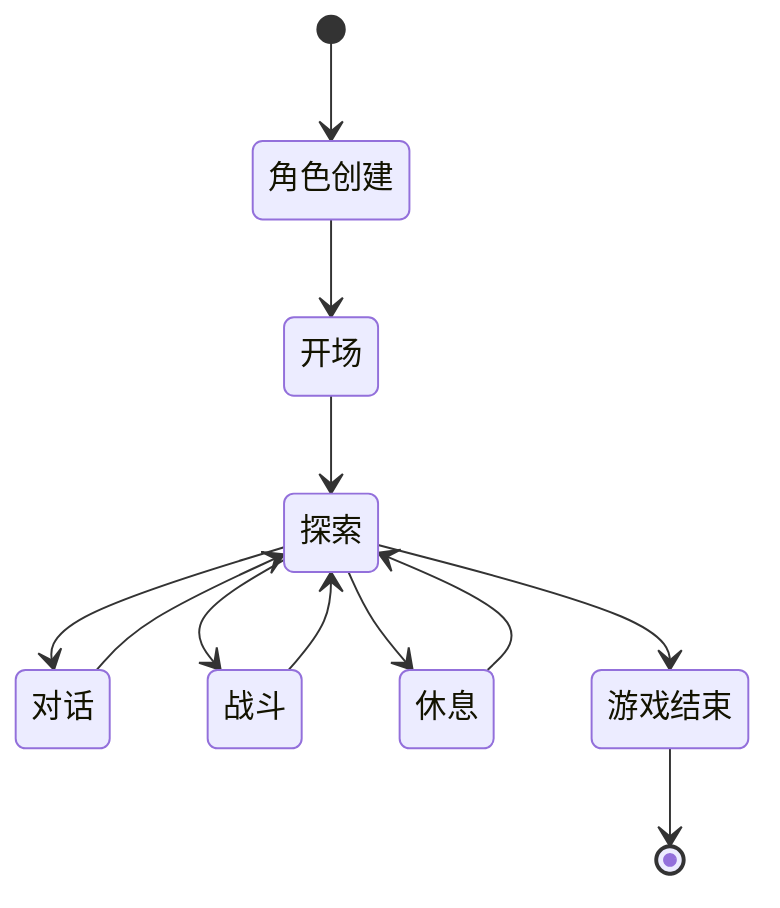

**图表来源**
- [types.go:11-44](file://internal/save/types.go#L11-L44)
- [state.go:151-224](file://internal/game/state.go#L151-L224)

**章节来源**
- [state.go:1-236](file://internal/game/state.go#L1-L236)
- [types.go:1-217](file://internal/save/types.go#L1-L217)

### 事件分发机制
- 事件类型
  - 角色：创建、受伤、治疗、死亡、状态增删、升级
  - 物品：获得/失去、装备、使用
  - 场景：变更、进入/离开、NPC 出现/消失/互动
  - 战斗：开始/结束、回合开始/结束、攻击检定、造成伤害
  - 任务：添加/更新/完成
  - 工具：工具执行
  - 系统：保存/加载、阶段变更、错误
- 分发器能力
  - 订阅/取消订阅、同步分发、队列与批量处理、清空、存在性检查。
  - 使用读写锁保证并发安全。
- 使用场景
  - Engine 在工具执行、角色状态变更、场景切换、阶段变更时分发事件，UI 或日志系统可订阅。

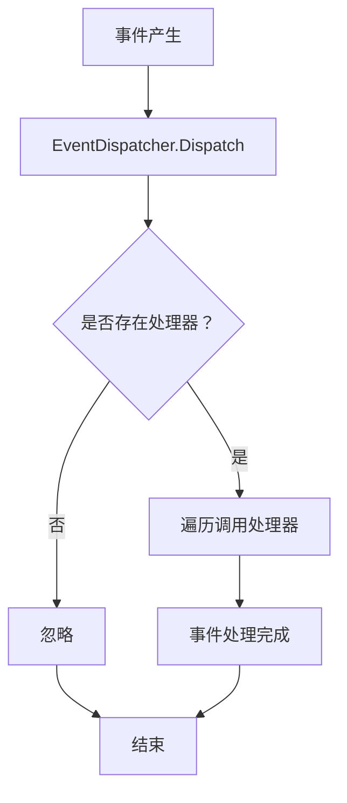

**图表来源**
- [events.go:135-204](file://internal/game/events.go#L135-L204)

**章节来源**
- [events.go:1-244](file://internal/game/events.go#L1-L244)

### 工具系统与工具调用循环
- 工具接口
  - Name/Description/Parameters/Execute，统一工具行为。
  - ToolResult：Success/Data/Narrative/Error。
  - ToolDefinition/ToolFunctionDefinition：用于 LLM API 的函数定义。
- 注册表
  - 并发安全的工具注册、查找、执行、从 JSON 执行、导出定义、阶段权限检查、统计与清理。
- 调用循环
  - Engine 将工具定义转换为 LLM API 的 ToolDefinition，构建消息上下文，调用 LLM，解析 ToolCalls，逐一执行工具，生成叙述并分发事件。
  - 最大迭代次数限制，防止无限循环。

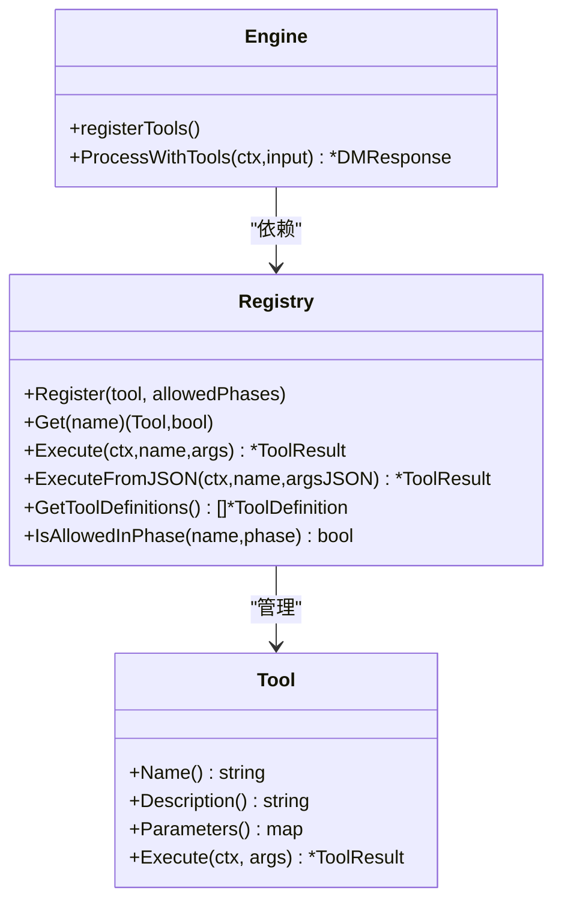

**图表来源**
- [types.go:24-42](file://internal/tools/types.go#L24-L42)
- [registry.go:10-77](file://internal/tools/registry.go#L10-L77)
- [engine.go:58-76](file://internal/game/engine.go#L58-L76)
- [engine.go:195-316](file://internal/game/engine.go#L195-L316)

**章节来源**
- [types.go:1-118](file://internal/tools/types.go#L1-L118)
- [registry.go:1-132](file://internal/tools/registry.go#L1-L132)
- [engine.go:1-797](file://internal/game/engine.go#L1-L797)

### LLM 抽象与提供商
- 抽象接口
  - Provider：Name、Generate、GenerateStream、SetModel/SetMaxTokens/SetTemperature。
  - 请求/响应/消息/工具定义/工具调用结构统一，便于替换不同提供商。
- 适配
  - 通过工厂与注册表选择具体提供商（OpenAI、Anthropic、Ollama 等），在 Engine 中注入使用。

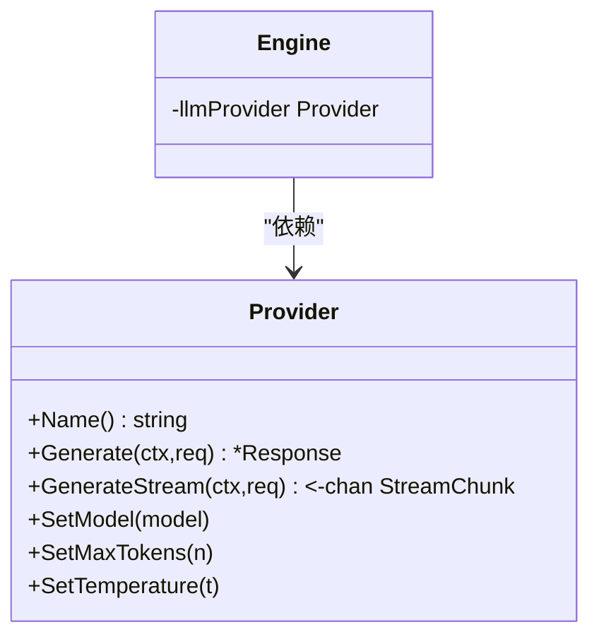

**图表来源**
- [provider.go:64-83](file://internal/llm/provider.go#L64-L83)
- [engine.go:23-32](file://internal/game/engine.go#L23-L32)

**章节来源**
- [provider.go:1-114](file://internal/llm/provider.go#L1-L114)
- [engine.go:1-797](file://internal/game/engine.go#L1-L797)

### 世界管理器
- 职责
  - 场景与 NPC 的增删改查、场景连接（双向/单向）、跨场景移动、导入/导出。
  - 并发安全：读写锁保护场景与 NPC 映射。
- 与引擎交互
  - Engine 在 SetScene、MoveToScene、SpawnNPC、RemoveNPC 等操作中更新 State 并分发事件；World Manager 负责持久化场景与 NPC 的状态。

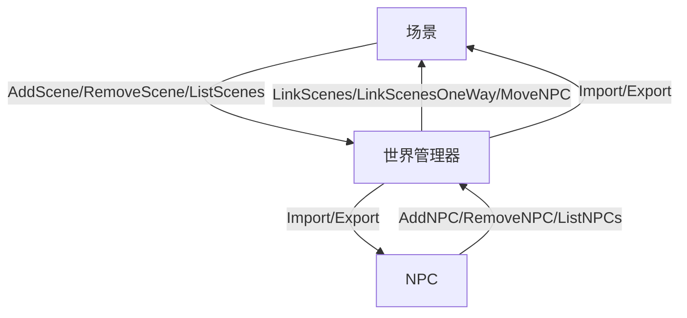

**图表来源**
- [manager.go:10-294](file://internal/world/manager.go#L10-L294)

**章节来源**
- [manager.go:1-294](file://internal/world/manager.go#L1-L294)

### 存档管理器
- 职责
  - 文件系统存档槽位管理（1-10），序列化/反序列化，缓存，快速保存/加载，元数据统计。
  - 支持指定目录与默认用户目录下的 ~/.cdnd/saves。
- 与引擎交互
  - Engine 在 Start/Load/Save 中调用 Save/Load，将 State 与世界数据打包为 SaveData；Load 后导入世界数据。

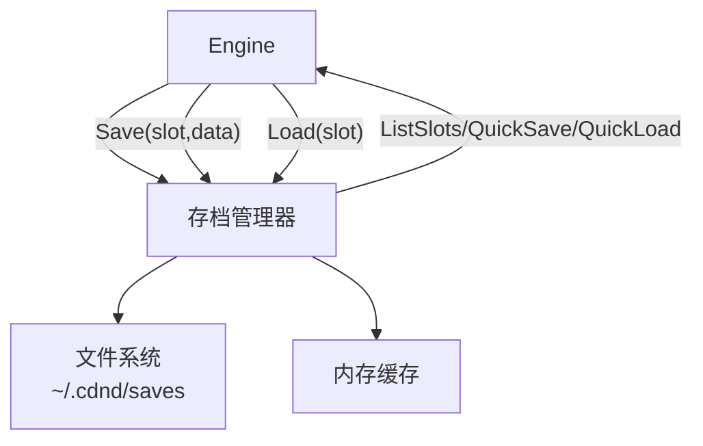

**图表来源**
- [manager.go:20-364](file://internal/save/manager.go#L20-L364)

**章节来源**
- [manager.go:1-364](file://internal/save/manager.go#L1-L364)
- [engine.go:101-178](file://internal/game/engine.go#L101-L178)

### 角色模型与规则引擎
- 角色模型
  - Character：包含属性、生命值、先攻、熟练、技能、豁免、装备、金币、状态效果等。
  - HitPoints：TakeDamage/Heal，优先扣除临时生命值。
- 规则引擎
  - Engine 暴露 SkillCheck/SavingThrow 接口，内部委托规则引擎执行检定与判定。

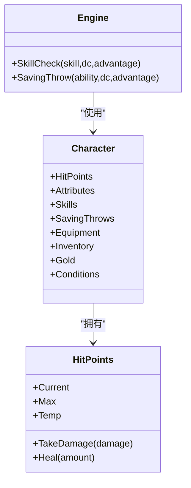

**图表来源**
- [character.go:8-61](file://internal/character/character.go#L8-L61)
- [character.go:102-133](file://internal/character/character.go#L102-L133)
- [engine.go:335-351](file://internal/game/engine.go#L335-L351)

**章节来源**
- [character.go:1-223](file://internal/character/character.go#L1-L223)
- [engine.go:1-797](file://internal/game/engine.go#L1-L797)

## 依赖关系分析
- 组件耦合
  - Engine 对各子系统强聚合，但通过接口与抽象降低耦合度（如 Provider、StateAccessor）。
  - Tools 通过 StateAccessor 与游戏状态交互，避免直接依赖 Engine。
  - Events 与 Engine 解耦，Engine 仅负责分发，订阅者可独立实现。
- 外部依赖
  - CLI 通过 Cobra/Viper 初始化配置。
  - 存档管理器依赖文件系统与 JSON 序列化。
  - LLM Provider 依赖网络或本地推理服务（由具体实现决定）。
- 潜在风险
  - 工具调用循环的迭代上限需根据复杂度与延迟权衡。
  - 事件处理器过多可能导致分发开销上升，建议按模块拆分订阅。

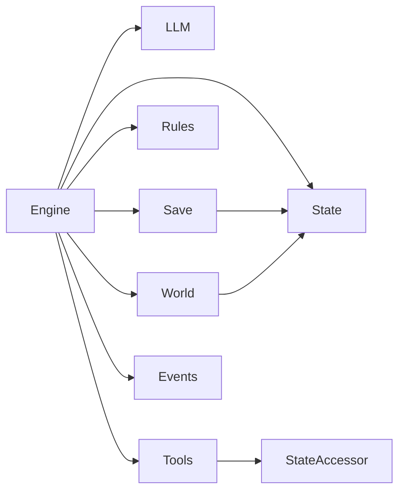

**图表来源**
- [engine.go:23-32](file://internal/game/engine.go#L23-L32)
- [registry.go:10-23](file://internal/tools/registry.go#L10-L23)
- [manager.go:20-55](file://internal/save/manager.go#L20-L55)
- [manager.go:10-23](file://internal/world/manager.go#L10-L23)

**章节来源**
- [engine.go:1-797](file://internal/game/engine.go#L1-L797)
- [registry.go:1-132](file://internal/tools/registry.go#L1-L132)
- [manager.go:1-364](file://internal/save/manager.go#L1-L364)
- [manager.go:1-294](file://internal/world/manager.go#L1-L294)

## 性能考量
- 并发与锁
  - 事件分发器与工具注册表、世界管理器均使用读写锁，减少锁竞争；建议在高频事件场景下拆分处理器或降级为异步处理。
- 缓存策略
  - 存档管理器内置内存缓存，避免重复磁盘 IO；注意缓存失效与一致性。
- 序列化与内存
  - SaveData 包含大量对象，建议在频繁保存/加载时进行增量更新或压缩；避免深拷贝不必要的历史数据。
- LLM 调用
  - 控制历史上下文长度（最大回合数配置），限制工具定义数量，合理设置温度与最大令牌数。
- 回合制战斗
  - 先攻排序使用简单冒泡，规模较大时可考虑更高效算法；每回合处理应尽早短路。

[本节为通用指导，无需特定文件引用]

## 故障排查指南
- LLM 调用失败
  - 检查 Provider 配置（API Key、BaseURL、Model、MaxTokens、Temperature）；确认网络连通性。
  - 查看 Engine 的错误包装信息，定位具体步骤（构建消息、调用 LLM、解析工具调用、执行工具）。
- 工具执行错误
  - 确认工具名称与参数 JSON 格式；检查工具在当前阶段的权限；查看 ToolResult.Error 与 Narrative。
- 存档问题
  - 检查槽位范围（1-10）与文件权限；使用 ListSlots 确认空/已用槽位；必要时清理缓存。
- 事件未触发
  - 确认订阅的事件类型与处理器注册；检查处理器是否被意外取消；验证事件分发器队列处理。
- 角色/世界状态异常
  - 检查 State 的拷贝与引用；确认 World Manager 的并发访问；核对 Save/Load 的字段映射。

**章节来源**
- [engine.go:101-178](file://internal/game/engine.go#L101-L178)
- [registry.go:43-65](file://internal/tools/registry.go#L43-L65)
- [events.go:150-204](file://internal/game/events.go#L150-L204)
- [manager.go:88-122](file://internal/save/manager.go#L88-L122)

## 结论
CDND 游戏引擎以 Engine 为核心，结合事件驱动与工具调用循环，实现了 LLM 驱动的角色扮演游戏框架。通过清晰的职责划分与抽象接口，引擎具备良好的可扩展性与可维护性。建议在生产环境中进一步完善：
- 事件处理器的异步化与限流
- 工具权限与阶段校验的动态配置
- 存档的增量备份与版本迁移
- LLM 调用的超时与重试策略

[本节为总结，无需特定文件引用]

## 附录
- 初始化流程
  - CLI 启动 → 读取配置 → 创建 Engine → 注册工具 → 启动会话 → 加载/创建角色 → 进入游戏循环。
- 生命周期管理
  - Start：重置 State 并设置阶段为开场。
  - Load：从存档加载 State 与世界数据，导入场景与 NPC。
  - Save：导出世界数据，写入文件并更新缓存。
  - 事件：贯穿整个生命周期，用于 UI 更新、日志记录与外部扩展。

**章节来源**
- [root.go:31-37](file://cmd/root.go#L31-L37)
- [engine.go:78-178](file://internal/game/engine.go#L78-L178)
- [init.go:19-65](file://internal/game/init.go#L19-L65)