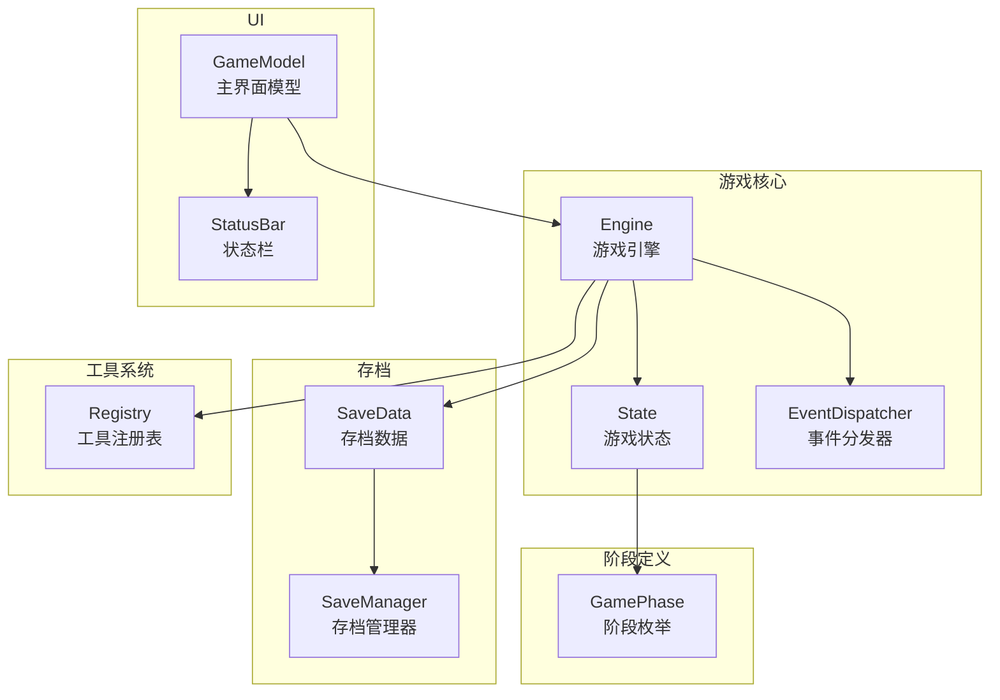
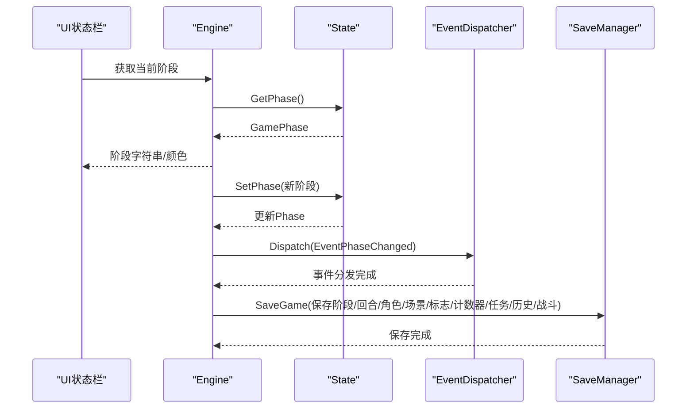
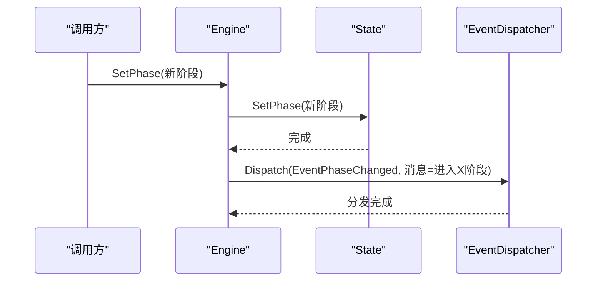
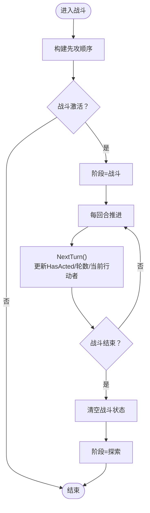
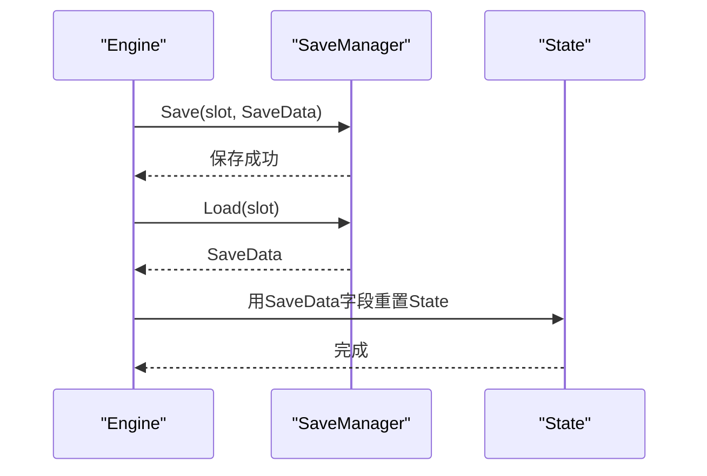
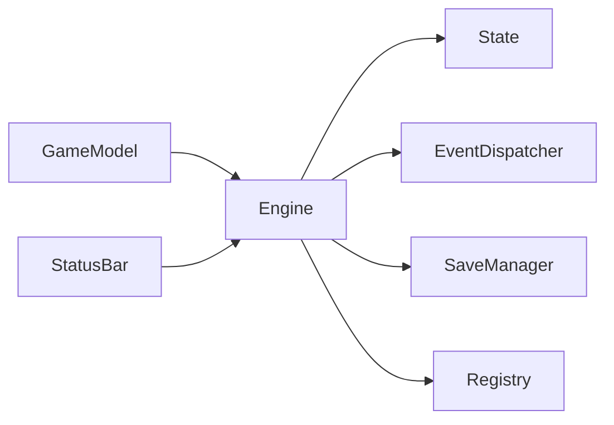
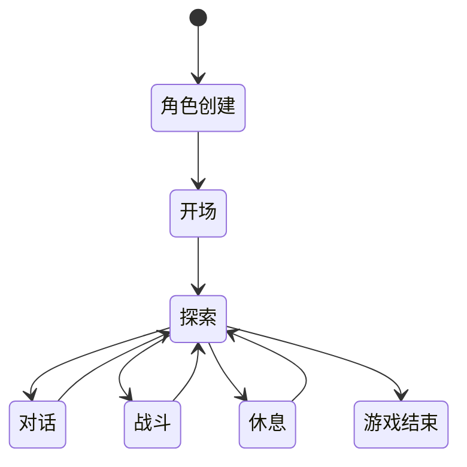

# 游戏阶段管理

<cite>
**本文引用的文件**
- [internal/game/state.go](file://internal/game/state.go)
- [internal/game/engine.go](file://internal/game/engine.go)
- [internal/game/types.go](file://internal/game/types.go)
- [internal/game/events.go](file://internal/game/events.go)
- [internal/save/types.go](file://internal/save/types.go)
- [internal/save/manager.go](file://internal/save/manager.go)
- [internal/tools/registry.go](file://internal/tools/registry.go)
- [internal/ui/statusbar.go](file://internal/ui/statusbar.go)
- [internal/ui/game.go](file://internal/ui/game.go)
- [internal/llm/prompt/templates.go](file://internal/llm/prompt/templates.go)
</cite>

## 目录
1. [简介](#简介)
2. [项目结构](#项目结构)
3. [核心组件](#核心组件)
4. [架构总览](#架构总览)
5. [详细组件分析](#详细组件分析)
6. [依赖分析](#依赖分析)
7. [性能考虑](#性能考虑)
8. [故障排查指南](#故障排查指南)
9. [结论](#结论)
10. [附录](#附录)

## 简介
本文件面向CDND游戏阶段管理系统，系统性梳理“游戏阶段”的概念、各阶段特性与转换条件，详解SetPhase方法的实现与通知机制，说明不同阶段对游戏行为的影响（可用工具、规则限制、叙事风格），记录阶段状态的持久化与恢复流程，并提供最佳实践与扩展指南。文中包含阶段转换图与状态机图，帮助开发者快速理解复杂的阶段逻辑与工具权限控制。

## 项目结构
围绕“阶段管理”的关键模块与文件如下：
- 游戏状态与引擎：State、Engine、事件分发器
- 阶段定义：GamePhase常量与字符串化
- 存档与恢复：SaveData、Manager
- 工具注册与阶段权限：Registry
- UI展示：状态栏与主界面模型

图表来源
- [internal/game/state.go:13-42](file://internal/game/state.go#L13-L42)
- [internal/game/engine.go:22-52](file://internal/game/engine.go#L22-L52)
- [internal/game/events.go:135-148](file://internal/game/events.go#L135-L148)
- [internal/save/types.go:11-44](file://internal/save/types.go#L11-L44)
- [internal/save/manager.go:20-55](file://internal/save/manager.go#L20-L55)
- [internal/tools/registry.go:9-21](file://internal/tools/registry.go#L9-L21)
- [internal/ui/statusbar.go:12-134](file://internal/ui/statusbar.go#L12-L134)
- [internal/ui/game.go:19-62](file://internal/ui/game.go#L19-L62)

章节来源
- [internal/game/state.go:13-42](file://internal/game/state.go#L13-L42)
- [internal/game/engine.go:22-52](file://internal/game/engine.go#L22-L52)
- [internal/save/types.go:11-44](file://internal/save/types.go#L11-L44)
- [internal/save/manager.go:20-55](file://internal/save/manager.go#L20-L55)
- [internal/tools/registry.go:9-21](file://internal/tools/registry.go#L9-L21)
- [internal/ui/statusbar.go:12-134](file://internal/ui/statusbar.go#L12-L134)
- [internal/ui/game.go:19-62](file://internal/ui/game.go#L19-L62)

## 核心组件
- 游戏状态State：持有SessionID、Phase、TurnCount、SubTurn、角色、场景、世界标志/计数器、任务、历史、战斗状态、时间戳等；提供SetPhase/GetPhase、StartCombat/EndCombat、NextTurn/GetCurrentCombatant等。
- 游戏引擎Engine：封装State、LLM、规则引擎、世界管理、存档、工具注册表、事件分发器；提供Start/LoadGame/SaveGame、SetPhase、SetScene、TakeDamage/Heal等；Process实现“调用LLM→执行工具→反馈→循环”的代理循环。
- 阶段定义GamePhase：包含角色创建、开场、探索、对话、战斗、休息、游戏结束等阶段，提供String()中文名称。
- 事件分发器EventDispatcher：统一派发角色、物品、场景、战斗、任务、工具、系统等事件，支持同步/异步分发与队列处理。
- 存档SaveData/Manager：保存/加载完整游戏状态，含阶段、回合、角色、场景、标志、计数器、任务、历史、战斗状态、版本等；支持槽位管理、快速保存/加载、导入导出。
- 工具注册表Registry：注册工具及其允许使用的阶段；执行工具时按阶段权限过滤。
- UI状态栏StatusBar：根据当前阶段渲染不同颜色与信息（如战斗阶段的动作指示器、先攻、法术槽分数；探索阶段的位置；非战斗阶段的金币等）。

章节来源
- [internal/game/state.go:60-68](file://internal/game/state.go#L60-L68)
- [internal/game/engine.go:353-357](file://internal/game/engine.go#L353-L357)
- [internal/game/types.go:152-162](file://internal/game/types.go#L152-L162)
- [internal/game/events.go:10-50](file://internal/game/events.go#L10-L50)
- [internal/save/types.go:110-147](file://internal/save/types.go#L110-L147)
- [internal/save/manager.go:57-86](file://internal/save/manager.go#L57-L86)
- [internal/tools/registry.go:23-29](file://internal/tools/registry.go#L23-L29)
- [internal/ui/statusbar.go:43-110](file://internal/ui/statusbar.go#L43-L110)

## 架构总览
阶段管理贯穿状态、引擎、事件、存档、工具与UI：
- State负责阶段的读写与战斗状态切换；
- Engine在关键节点调用SetPhase并分发事件；
- Registry通过“允许阶段”约束工具使用；
- SaveData/Manager持久化/恢复阶段与全局状态；
- UI基于当前阶段动态展示信息与样式。

图表来源
- [internal/ui/statusbar.go:97-110](file://internal/ui/statusbar.go#L97-L110)
- [internal/game/engine.go:353-357](file://internal/game/engine.go#L353-L357)
- [internal/game/events.go:171-180](file://internal/game/events.go#L171-L180)
- [internal/game/engine.go:152-178](file://internal/game/engine.go#L152-L178)
- [internal/save/manager.go:57-86](file://internal/save/manager.go#L57-L86)

## 详细组件分析

### 阶段定义与特性
- 阶段枚举与中文名称：角色创建、开场、探索、对话、战斗、休息、游戏结束。
- 各阶段特点与影响：
  - 角色创建：初始化阶段，通常由引擎Start时设置为开场。
  - 开场：引导叙事，LLM提示词强调引人入胜的开场与留白空间。
  - 探索：角色在场景间移动，状态栏显示位置；允许场景转换工具。
  - 对话：NPC交互，提示词强调NPC性格与直接对话标记。
  - 战斗：回合制先攻顺序，状态栏显示动作指示器、先攻、法术槽分数；战斗专用工具与规则生效。
  - 休息：描述休息地点与恢复，长休息恢复全部生命值与法术槽。
  - 游戏结束：终止流程，通常由外部逻辑触发。

章节来源
- [internal/save/types.go:14-44](file://internal/save/types.go#L14-L44)
- [internal/llm/prompt/templates.go:69-100](file://internal/llm/prompt/templates.go#L69-L100)
- [internal/ui/statusbar.go:43-95](file://internal/ui/statusbar.go#L43-L95)

### SetPhase方法实现与通知机制
- State.SetPhase仅更新内部阶段字段。
- Engine.SetPhase委托State.SetPhase后，立即分发“阶段变更”事件，消息包含阶段中文名称，便于UI与日志同步。

图表来源
- [internal/game/state.go:60-63](file://internal/game/state.go#L60-L63)
- [internal/game/engine.go:353-357](file://internal/game/engine.go#L353-L357)
- [internal/game/events.go:48](file://internal/game/events.go#L48)

章节来源
- [internal/game/state.go:60-63](file://internal/game/state.go#L60-L63)
- [internal/game/engine.go:353-357](file://internal/game/engine.go#L353-L357)
- [internal/game/events.go:171-180](file://internal/game/events.go#L171-L180)

### 阶段转换与战斗集成
- 开始战斗：State.StartCombat构建先攻顺序，激活战斗状态并将阶段设为战斗。
- 结束战斗：State.EndCombat清空战斗状态并将阶段切回探索。
- 战斗回合推进：State.NextTurn维护当前回合索引与一轮结束逻辑，返回当前行动者。

图表来源
- [internal/game/state.go:151-181](file://internal/game/state.go#L151-L181)
- [internal/game/state.go:183-224](file://internal/game/state.go#L183-L224)

章节来源
- [internal/game/state.go:151-181](file://internal/game/state.go#L151-L181)
- [internal/game/state.go:183-224](file://internal/game/state.go#L183-L224)

### 工具权限与阶段控制
- Registry.Register支持为工具声明允许使用的阶段列表；若未声明则默认允许。
- Registry.IsAllowedInPhase检查工具在当前阶段是否允许；Engine.Process中会将当前阶段传递给LLM提示，间接约束工具调用方向。
- UI状态栏根据阶段显示不同信息（如战斗阶段的动作指示器、先攻、法术槽分数；探索阶段的位置；非战斗阶段的金币）。

章节来源
- [internal/tools/registry.go:23-29](file://internal/tools/registry.go#L23-L29)
- [internal/tools/registry.go:83-97](file://internal/tools/registry.go#L83-L97)
- [internal/ui/statusbar.go:43-110](file://internal/ui/statusbar.go#L43-L110)

### 阶段对游戏行为的影响
- 可用工具：不同阶段允许的工具集合由Registry权限控制；例如场景转换、NPC生成/移除、状态增减、物品与金币操作等。
- 规则限制：战斗阶段启用先攻与回合制；非战斗阶段显示AC、金币等；对话阶段强调NPC语气与直接引述。
- 叙事风格：LLM提示词针对不同阶段给出风格化描述与标记，确保输出一致的D&D风格叙述。

章节来源
- [internal/llm/prompt/templates.go:58-100](file://internal/llm/prompt/templates.go#L58-L100)
- [internal/ui/statusbar.go:43-95](file://internal/ui/statusbar.go#L43-L95)

### 阶段状态的持久化与恢复
- SaveData包含SessionID、Phase、TurnCount、角色、场景、标志、计数器、任务、历史、战斗状态、版本等字段。
- SaveManager提供Save/Load/Delete/ListSlots/QuickSave/QuickLoad等能力，支持槽位管理与缓存。
- Engine.LoadGame在加载后将Phase写入现有State对象，保证工具持有的State引用有效；Engine.SaveGame将当前State打包为SaveData并保存。

图表来源
- [internal/save/types.go:110-147](file://internal/save/types.go#L110-L147)
- [internal/save/manager.go:57-86](file://internal/save/manager.go#L57-L86)
- [internal/game/engine.go:101-150](file://internal/game/engine.go#L101-L150)

章节来源
- [internal/save/types.go:110-147](file://internal/save/types.go#L110-L147)
- [internal/save/manager.go:57-86](file://internal/save/manager.go#L57-L86)
- [internal/game/engine.go:101-150](file://internal/game/engine.go#L101-L150)

### UI与阶段联动
- GameModel在每次处理输入后更新当前阶段，并刷新视口内容与状态栏。
- StatusBar根据阶段渲染不同颜色与信息，如战斗阶段的动作指示器、先攻、法术槽分数；探索阶段的位置；非战斗阶段的金币；阶段名称与回合数。

章节来源
- [internal/ui/game.go:214-218](file://internal/ui/game.go#L214-L218)
- [internal/ui/statusbar.go:43-110](file://internal/ui/statusbar.go#L43-L110)

## 依赖分析
- State与Engine：Engine持有State指针，所有阶段变更与状态读写均通过Engine.SetPhase/State.SetPhase完成。
- Engine与EventDispatcher：Engine在SetPhase后分发阶段变更事件，供UI与日志订阅。
- Engine与SaveManager：Engine在SaveGame/LoadGame中与SaveManager交互，保存/恢复完整阶段状态。
- Engine与Registry：Engine.Process中将当前阶段传递给LLM，间接约束工具调用；Registry控制工具在特定阶段的可用性。
- UI与Engine：GameModel依赖Engine获取当前阶段与状态，StatusBar根据阶段渲染不同信息。

图表来源
- [internal/game/engine.go:22-52](file://internal/game/engine.go#L22-L52)
- [internal/game/events.go:135-148](file://internal/game/events.go#L135-L148)
- [internal/save/manager.go:20-55](file://internal/save/manager.go#L20-L55)
- [internal/tools/registry.go:9-21](file://internal/tools/registry.go#L9-L21)
- [internal/ui/game.go:19-62](file://internal/ui/game.go#L19-L62)
- [internal/ui/statusbar.go:12-134](file://internal/ui/statusbar.go#L12-L134)

章节来源
- [internal/game/engine.go:22-52](file://internal/game/engine.go#L22-L52)
- [internal/game/events.go:135-148](file://internal/game/events.go#L135-L148)
- [internal/save/manager.go:20-55](file://internal/save/manager.go#L20-L55)
- [internal/tools/registry.go:9-21](file://internal/tools/registry.go#L9-L21)
- [internal/ui/game.go:19-62](file://internal/ui/game.go#L19-L62)
- [internal/ui/statusbar.go:12-134](file://internal/ui/statusbar.go#L12-L134)

## 性能考虑
- 事件分发：EventDispatcher采用RWMutex保护处理器列表，Dispatch为轻量级遍历；建议避免在事件处理器中执行重任务，必要时异步处理。
- 存档IO：Save/Load使用文件系统，建议在空闲时段或回合边界触发；QuickSave/QuickLoad按更新时间排序覆盖，减少磁盘碎片。
- LLM调用：Process中Agentic Loop最多10次迭代，避免过度工具调用导致延迟；可通过配置调整自动保存间隔与历史长度以平衡性能与体验。

## 故障排查指南
- 阶段未更新：确认Engine.SetPhase是否被调用且EventDispatcher已订阅EventPhaseChanged；检查UI是否正确读取State.Phase。
- 工具不可用：检查Registry中工具的阶段权限；确认当前阶段字符串与权限列表匹配；核对工具参数解析。
- 存档异常：检查SaveManager的槽位范围与文件权限；确认SaveData字段完整性；加载失败时检查角色数据与世界数据导入。
- 战斗状态异常：确认StartCombat/EndCombat调用时机；检查NextTurn的HasActed与轮数重置逻辑；核对先攻排序。

章节来源
- [internal/game/events.go:150-180](file://internal/game/events.go#L150-L180)
- [internal/tools/registry.go:83-97](file://internal/tools/registry.go#L83-L97)
- [internal/save/manager.go:88-122](file://internal/save/manager.go#L88-L122)
- [internal/game/state.go:151-181](file://internal/game/state.go#L151-L181)

## 结论
CDND的阶段管理体系以State为核心，Engine负责编排阶段变更与事件通知，Registry保障工具在阶段内的安全使用，SaveManager提供可靠的持久化与恢复能力，UI基于阶段动态呈现关键信息。通过明确的阶段语义、严格的工具权限与完善的事件机制，系统实现了可扩展、可观测、可维护的阶段驱动游戏体验。

## 附录

### 阶段转换图（基于代码行为）

图表来源
- [internal/save/types.go:14-22](file://internal/save/types.go#L14-L22)
- [internal/game/state.go:151-181](file://internal/game/state.go#L151-L181)

### 如何添加新的游戏阶段
- 在GamePhase中新增枚举值并实现String()中文名称。
- 在Engine.Start/LoadGame/SaveGame中确保新阶段参与序列化/反序列化。
- 在Registry中为涉及新阶段的工具声明权限；或在Process中通过提示词约束工具调用方向。
- 在UI中根据新阶段渲染相应信息与样式。
- 在事件系统中如需新增阶段相关事件，扩展EventType并在Engine.SetPhase后分发。

章节来源
- [internal/save/types.go:14-44](file://internal/save/types.go#L14-L44)
- [internal/game/engine.go:78-99](file://internal/game/engine.go#L78-L99)
- [internal/game/engine.go:101-150](file://internal/game/engine.go#L101-L150)
- [internal/tools/registry.go:23-29](file://internal/tools/registry.go#L23-L29)
- [internal/ui/statusbar.go:97-110](file://internal/ui/statusbar.go#L97-L110)