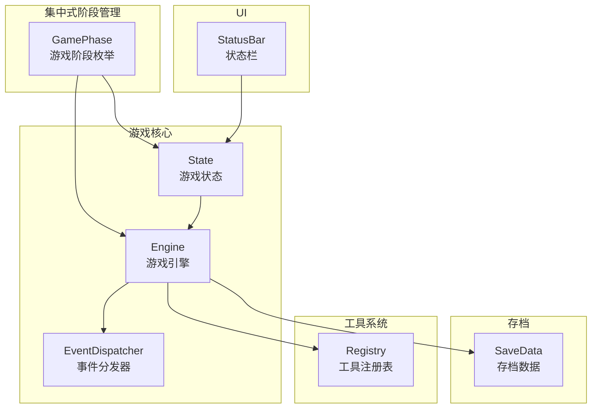
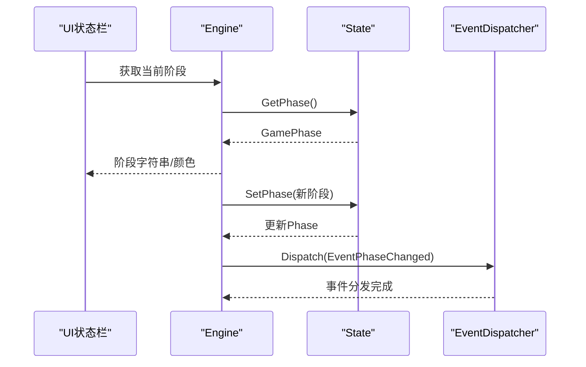
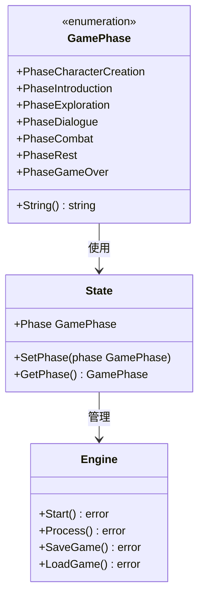
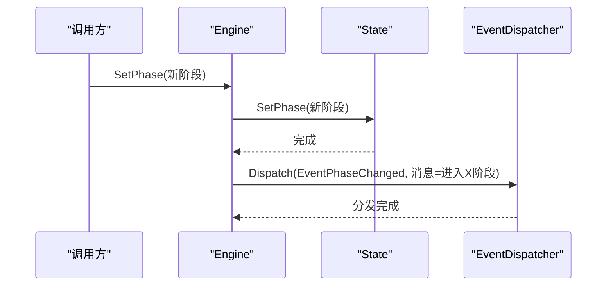
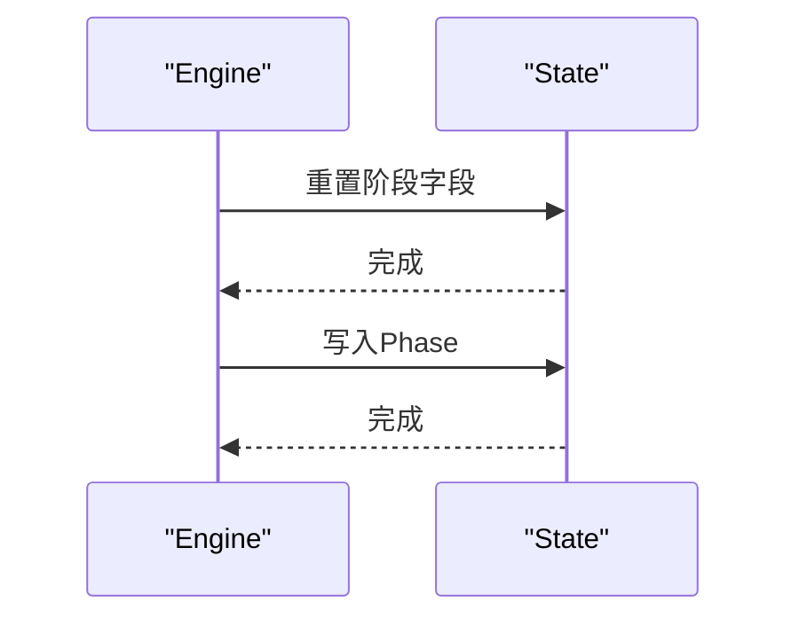
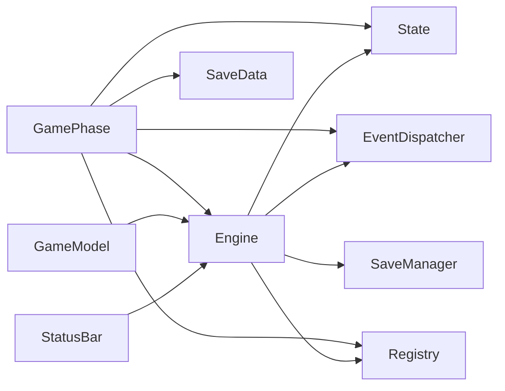
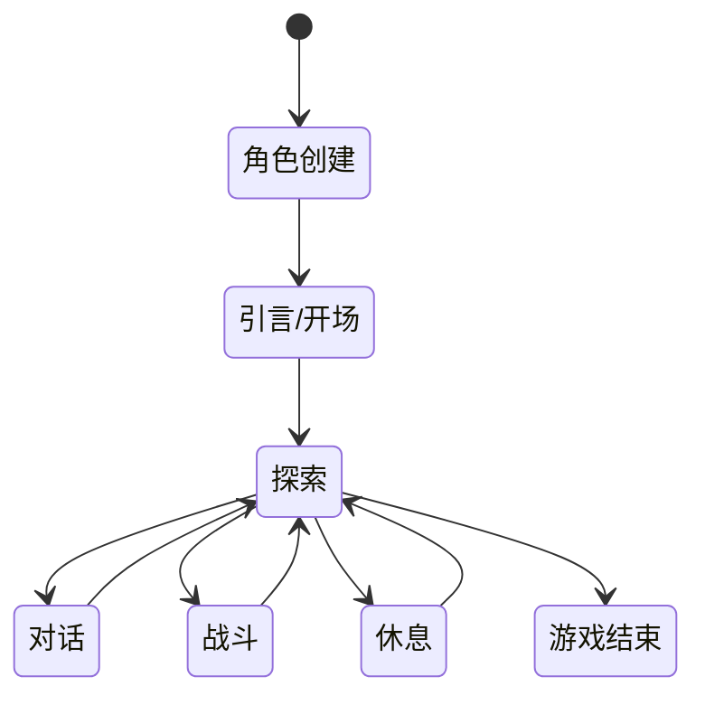

# 游戏阶段管理

<cite>
**本文引用的文件**
- [domain/game_phase.go](file://domain/game_phase.go)
- [application/state/state.go](file://application/state/state.go)
- [application/engine/engine.go](file://application/engine/engine.go)
- [application/engine/init.go](file://application/engine/init.go)
- [domain/events/events.go](file://domain/events/events.go)
- [infrastructure/storage/types.go](file://infrastructure/storage/types.go)
- [application/tools/registry.go](file://application/tools/registry.go)
- [interface/ui/statusbar.go](file://interface/ui/statusbar.go)
- [application/tools/types.go](file://application/tools/types.go)
</cite>

## 目录
1. [简介](#简介)
2. [项目结构](#项目结构)
3. [核心组件](#核心组件)
4. [架构总览](#架构总览)
5. [详细组件分析](#详细组件分析)
6. [依赖分析](#依赖分析)
7. [性能考虑](#性能考虑)
8. [故障排查指南](#故障排查指南)
9. [结论](#结论)
10. [附录](#附录)

## 简介
本文档面向CDND游戏阶段管理系统，系统性梳理"游戏阶段"的概念、各阶段特性与转换条件，详解SetPhase方法的实现与通知机制，说明不同阶段对游戏行为的影响（可用工具、规则限制、叙事风格），记录阶段状态的持久化与恢复流程，并提供最佳实践与扩展指南。文中包含阶段转换图与状态机图，帮助开发者快速理解复杂的阶段逻辑与工具权限控制。

**更新** 本版本反映了游戏阶段管理的重大改进：新增了完整的集中式GamePhase类型定义，包含七个明确的游戏阶段：角色创建、引言/开场、探索、对话、战斗、休息、游戏结束。系统现在提供统一的阶段管理方式，所有组件都使用这个集中的GamePhase类型进行状态管理和转换控制。

## 项目结构
围绕"阶段管理"的关键模块与文件如下：
- 集中式阶段定义：GamePhase类型与中文字符串表示
- 游戏状态与引擎：State、Engine、事件分发器
- 存档与恢复：SaveData、Manager
- 工具注册与阶段权限：Registry
- UI展示：状态栏与主界面模型
- 战斗状态管理：独立的CombatState结构

**图表来源**
- [domain/game_phase.go:3-36](file://domain/game_phase.go#L3-L36)
- [application/state/state.go:16-47](file://application/state/state.go#L16-L47)
- [application/engine/engine.go:29-44](file://application/engine/engine.go#L29-L44)
- [domain/events/events.go:10-50](file://domain/events/events.go#L10-L50)
- [infrastructure/storage/types.go:14-51](file://infrastructure/storage/types.go#L14-L51)
- [application/tools/registry.go:9-21](file://application/tools/registry.go#L9-L21)
- [interface/ui/statusbar.go:12-134](file://interface/ui/statusbar.go#L12-L134)

**章节来源**
- [domain/game_phase.go:3-36](file://domain/game_phase.go#L3-L36)
- [application/state/state.go:16-47](file://application/state/state.go#L16-L47)
- [application/engine/engine.go:29-44](file://application/engine/engine.go#L29-L44)
- [application/engine/init.go:13-17](file://application/engine/init.go#L13-L17)
- [domain/events/events.go:10-50](file://domain/events/events.go#L10-L50)
- [infrastructure/storage/types.go:14-51](file://infrastructure/storage/types.go#L14-L51)
- [application/tools/registry.go:9-21](file://application/tools/registry.go#L9-L21)
- [interface/ui/statusbar.go:12-134](file://interface/ui/statusbar.go#L12-L134)

## 核心组件
- **集中式GamePhase类型**：定义了七个标准游戏阶段，提供String()方法返回中文名称，确保在整个系统中的一致性和可读性。
- **游戏状态State**：持有SessionID、Phase（使用GamePhase类型）、TurnCount、角色、场景、世界标志/计数器、任务、历史、战斗状态、时间戳等；提供SetPhase/GetPhase、StartCombat/EndCombat、NextTurn/GetCurrentCombatant等方法。
- **游戏引擎Engine**：封装State、LLM、规则引擎、世界管理、存档、工具注册表、事件分发器；提供Start/LoadGame/SaveGame、SetPhase、SetScene、TakeDamage/Heal等；Process实现"调用LLM→执行工具→反馈→循环"的代理循环。
- **事件分发器EventDispatcher**：统一派发角色、物品、场景、战斗、任务、工具、系统等事件，支持同步/异步分发与队列处理。
- **存档SaveData**：保存/加载完整游戏状态，含阶段、回合、角色、场景、标志、计数器、任务、历史、战斗状态、版本等；支持槽位管理、快速保存/加载、导入导出。
- **工具注册表Registry**：注册工具及其允许使用的阶段；执行工具时按阶段权限过滤。
- **UI状态栏StatusBar**：根据当前阶段渲染不同颜色与信息（如战斗阶段的动作指示器、先攻、法术槽分数；探索阶段的位置；非战斗阶段的金币等）。

**章节来源**
- [domain/game_phase.go:3-36](file://domain/game_phase.go#L3-L36)
- [application/state/state.go:16-47](file://application/state/state.go#L16-L47)
- [application/state/state.go:65-73](file://application/state/state.go#L65-L73)
- [application/state/state.go:156-186](file://application/state/state.go#L156-L186)
- [application/engine/engine.go:29-44](file://application/engine/engine.go#L29-L44)
- [domain/events/events.go:10-50](file://domain/events/events.go#L10-L50)
- [infrastructure/storage/types.go:14-51](file://infrastructure/storage/types.go#L14-L51)
- [application/tools/registry.go:23-29](file://application/tools/registry.go#L23-L29)
- [interface/ui/statusbar.go:43-110](file://interface/ui/statusbar.go#L43-L110)

## 架构总览
阶段管理贯穿状态、引擎、事件、存档、工具与UI：
- GamePhase作为统一的阶段标识符，确保所有组件使用相同的标准；
- State负责阶段的读写与战斗状态切换；
- Engine在关键节点调用SetPhase并分发事件；
- Registry通过"允许阶段"约束工具使用；
- SaveData/Manager持久化/恢复阶段与全局状态；
- UI基于当前阶段动态展示信息与样式。

**图表来源**
- [interface/ui/statusbar.go:97-110](file://interface/ui/statusbar.go#L97-L110)
- [application/state/state.go:70-73](file://application/state/state.go#L70-L73)
- [domain/events/events.go:113](file://domain/events/events.go#L113)

## 详细组件分析

### 集中式阶段定义与特性
- **GamePhase类型**：定义了七个标准游戏阶段，使用iota自动递增，确保每个阶段都有唯一的整数值。
- **阶段枚举与中文名称**：角色创建、引言/开场、探索、对话、战斗、休息、游戏结束，每个阶段都有对应的中文字符串表示。
- **统一的阶段管理**：所有组件现在使用相同的GamePhase类型，确保阶段状态的一致性和可追踪性。

**图表来源**
- [domain/game_phase.go:6-14](file://domain/game_phase.go#L6-L14)
- [domain/game_phase.go:17-36](file://domain/game_phase.go#L17-L36)
- [application/state/state.go:19](file://application/state/state.go#L19)
- [application/state/state.go:66-73](file://application/state/state.go#L66-L73)

**章节来源**
- [domain/game_phase.go:3-36](file://domain/game_phase.go#L3-L36)
- [application/state/state.go:19](file://application/state/state.go#L19)
- [application/state/state.go:66-73](file://application/state/state.go#L66-L73)

### SetPhase方法实现与通知机制
- **State.SetPhase**：接收GamePhase类型的参数，直接更新内部阶段字段。
- **Engine.SetPhase委托**：Engine中的SetPhase方法委托State.SetPhase后，立即分发"阶段变更"事件，消息包含阶段中文名称，便于UI与日志同步。
- **事件通知**：使用EventDispatcher分发EventPhaseChanged事件，确保所有订阅者都能收到阶段变更通知。

**图表来源**
- [application/state/state.go:66-73](file://application/state/state.go#L66-L73)
- [domain/events/events.go:113](file://domain/events/events.go#L113)

**章节来源**
- [application/state/state.go:66-73](file://application/state/state.go#L66-L73)
- [domain/events/events.go:113](file://domain/events/events.go#L113)

### 阶段转换与战斗集成
- **开始战斗**：State.StartCombat构建先攻顺序，激活战斗状态并将阶段设为战斗。
- **结束战斗**：State.EndCombat清空战斗状态并将阶段切回探索。
- **战斗回合推进**：State.NextTurn维护当前回合索引与一轮结束逻辑，返回当前行动者。

**图表来源**
- [application/state/state.go:156-186](file://application/state/state.go#L156-L186)
- [application/state/state.go:188-217](file://application/state/state.go#L188-L217)

**章节来源**
- [application/state/state.go:156-186](file://application/state/state.go#L156-L186)
- [application/state/state.go:188-217](file://application/state/state.go#L188-L217)

### 工具权限与阶段控制
- **Registry.Register**：支持为工具声明允许使用的阶段列表；若未声明则默认允许。
- **Registry.IsAllowedInPhase**：检查工具在当前阶段是否允许；Engine.Process中会将当前阶段传递给LLM提示，间接约束工具调用方向。
- **UI状态栏**：根据阶段显示不同信息（如战斗阶段的动作指示器、先攻、法术槽分数；探索阶段的位置；非战斗阶段的金币）。

**章节来源**
- [application/tools/registry.go:23-29](file://application/tools/registry.go#L23-L29)
- [application/tools/registry.go:83-97](file://application/tools/registry.go#L83-L97)
- [interface/ui/statusbar.go:43-110](file://interface/ui/statusbar.go#L43-L110)

### 阶段对游戏行为的影响
- **可用工具**：不同阶段允许的工具集合由Registry权限控制；例如场景转换、NPC生成/移除、状态增减、物品与金币操作等。
- **规则限制**：战斗阶段启用先攻与回合制；非战斗阶段显示AC、金币等；对话阶段强调NPC语气与直接引述。
- **叙事风格**：LLM提示词针对不同阶段给出风格化描述与标记，确保输出一致的D&D风格叙述。

**章节来源**
- [interface/ui/statusbar.go:43-95](file://interface/ui/statusbar.go#L43-L95)

### 阶段状态的持久化与恢复
- **SaveData包含**：SessionID、Phase（使用GamePhase类型）、TurnCount、角色、场景、标志、计数器、任务、历史、战斗状态、版本等字段。
- **SaveManager提供**：Save/Load/QuickSave/QuickLoad等能力，支持槽位管理与缓存。
- **Engine.LoadGame**：在加载后将Phase写入现有State对象，保证工具持有的State引用有效；Engine.SaveGame将当前State打包为SaveData并保存。

**图表来源**
- [application/state/state.go:66-73](file://application/state/state.go#L66-L73)

**章节来源**
- [infrastructure/storage/types.go:14-51](file://infrastructure/storage/types.go#L14-L51)
- [application/engine/engine.go:197-223](file://application/engine/engine.go#L197-L223)
- [application/engine/engine.go:142-195](file://application/engine/engine.go#L142-L195)

### UI与阶段联动
- **GameModel**：在每次处理输入后更新当前阶段，并刷新视口内容与状态栏。
- **StatusBar**：根据阶段渲染不同颜色与信息，如战斗阶段的动作指示器、先攻、法术槽分数；探索阶段的位置；非战斗阶段的金币；阶段名称与回合数。

**章节来源**
- [interface/ui/statusbar.go:13-134](file://interface/ui/statusbar.go#L13-L134)

## 依赖分析
- **GamePhase与所有组件**：GamePhase作为统一的阶段标识符，被State、Engine、EventDispatcher、SaveData、Registry、UI等所有组件使用。
- **State与Engine**：Engine持有State指针，所有阶段变更与状态读写均通过Engine.SetPhase/State.SetPhase完成。
- **Engine与EventDispatcher**：Engine在SetPhase后分发阶段变更事件，供UI与日志订阅。
- **Engine与SaveManager**：Engine在SaveGame/LoadGame中与SaveManager交互，保存/恢复完整阶段状态。
- **Engine与Registry**：Engine.Process中将当前阶段传递给LLM，间接约束工具调用；Registry控制工具在特定阶段的可用性。
- **UI与Engine**：GameModel依赖Engine获取当前阶段与状态，StatusBar根据阶段渲染不同信息。

**图表来源**
- [domain/game_phase.go:3-36](file://domain/game_phase.go#L3-L36)
- [application/state/state.go:19](file://application/state/state.go#L19)
- [application/engine/engine.go:29-44](file://application/engine/engine.go#L29-L44)
- [domain/events/events.go:10-50](file://domain/events/events.go#L10-L50)
- [infrastructure/storage/types.go:25](file://infrastructure/storage/types.go#L25)
- [application/tools/registry.go:12](file://application/tools/registry.go#L12)
- [interface/ui/statusbar.go:12-134](file://interface/ui/statusbar.go#L12-L134)

**章节来源**
- [domain/game_phase.go:3-36](file://domain/game_phase.go#L3-L36)
- [application/state/state.go:19](file://application/state/state.go#L19)
- [application/engine/engine.go:29-44](file://application/engine/engine.go#L29-L44)
- [domain/events/events.go:10-50](file://domain/events/events.go#L10-L50)
- [infrastructure/storage/types.go:25](file://infrastructure/storage/types.go#L25)
- [application/tools/registry.go:12](file://application/tools/registry.go#L12)
- [interface/ui/statusbar.go:12-134](file://interface/ui/statusbar.go#L12-L134)

## 性能考虑
- **事件分发**：EventDispatcher采用RWMutex保护处理器列表，Dispatch为轻量级遍历；建议避免在事件处理器中执行重任务，必要时异步处理。
- **存档IO**：Save/Load使用文件系统，建议在空闲时段或回合边界触发；QuickSave/QuickLoad按更新时间排序覆盖，减少磁盘碎片。
- **LLM调用**：Process中Agentic Loop最多10次迭代，避免过度工具调用导致延迟；可通过配置调整自动保存间隔与历史长度以平衡性能与体验。

## 故障排查指南
- **阶段未更新**：确认Engine.SetPhase是否被调用且EventDispatcher已订阅EventPhaseChanged；检查UI是否正确读取State.Phase。
- **工具不可用**：检查Registry中工具的阶段权限；确认当前阶段字符串与权限列表匹配；核对工具参数解析。
- **存档异常**：检查SaveManager的槽位范围与文件权限；确认SaveData字段完整性；加载失败时检查角色数据与世界数据导入。
- **战斗状态异常**：确认StartCombat/EndCombat调用时机；检查NextTurn的HasActed与轮数重置逻辑；核对先攻排序。

**章节来源**
- [domain/events/events.go:150-180](file://domain/events/events.go#L150-L180)
- [application/tools/registry.go:83-97](file://application/tools/registry.go#L83-L97)
- [application/state/state.go:156-186](file://application/state/state.go#L156-L186)

## 结论
CDND的阶段管理体系以集中式的GamePhase类型为核心，确保了整个系统中阶段状态的一致性和可追踪性。State负责阶段的读写与战斗状态切换；Engine在关键节点调用SetPhase并分发事件；Registry保障工具在阶段内的安全使用；SaveManager提供可靠的持久化与恢复能力；UI基于阶段动态呈现关键信息。通过明确的阶段语义、严格的工具权限与完善的事件机制，系统实现了可扩展、可观测、可维护的阶段驱动游戏体验。

**更新** 新的集中式GamePhase类型提供了统一的阶段管理方式，所有组件都使用相同的GamePhase枚举值和String()方法，确保了系统内部的一致性和可维护性。

## 附录

### 阶段转换图（基于代码行为）

**图表来源**
- [domain/game_phase.go:18-32](file://domain/game_phase.go#L18-L32)

### 如何添加新的游戏阶段
- 在GamePhase中新增枚举值并实现String()中文名称。
- 在Engine.Start/LoadGame/SaveGame中确保新阶段参与序列化/反序列化。
- 在Registry中为涉及新阶段的工具声明权限；或在Process中通过提示词约束工具调用方向。
- 在UI中根据新阶段渲染相应信息与样式。
- 在事件系统中如需新增阶段相关事件，扩展EventType并在Engine.SetPhase后分发。

**章节来源**
- [domain/game_phase.go:6-14](file://domain/game_phase.go#L6-L14)
- [domain/game_phase.go:17-36](file://domain/game_phase.go#L17-L36)
- [application/engine/engine.go:115-140](file://application/engine/engine.go#L115-L140)
- [application/engine/engine.go:197-223](file://application/engine/engine.go#L197-L223)
- [application/engine/engine.go:142-195](file://application/engine/engine.go#L142-L195)
- [application/tools/registry.go:23-29](file://application/tools/registry.go#L23-L29)
- [interface/ui/statusbar.go:97-110](file://interface/ui/statusbar.go#L97-L110)

### 战斗状态管理最佳实践
- **独立存储**：战斗状态现在独立存储在State.Combat字段中，避免与其他游戏状态混淆。
- **生命周期管理**：使用StartCombat/EndCombat方法正确管理战斗状态的创建与销毁。
- **状态隔离**：战斗中的临时状态（如PlayerActionUsed）与永久状态（如角色属性）应分别处理。
- **序列化支持**：CombatState结构体实现了完整的JSON序列化支持，确保存档/恢复的完整性。

**章节来源**
- [application/state/state.go:38](file://application/state/state.go#L38)
- [application/state/state.go:156-186](file://application/state/state.go#L156-L186)
- [application/state/state.go:188-217](file://application/state/state.go#L188-L217)