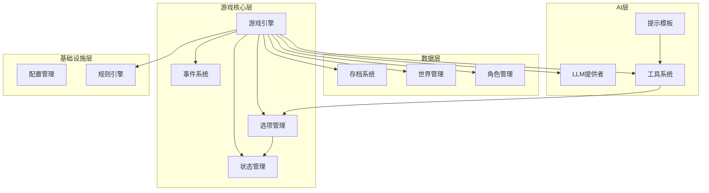
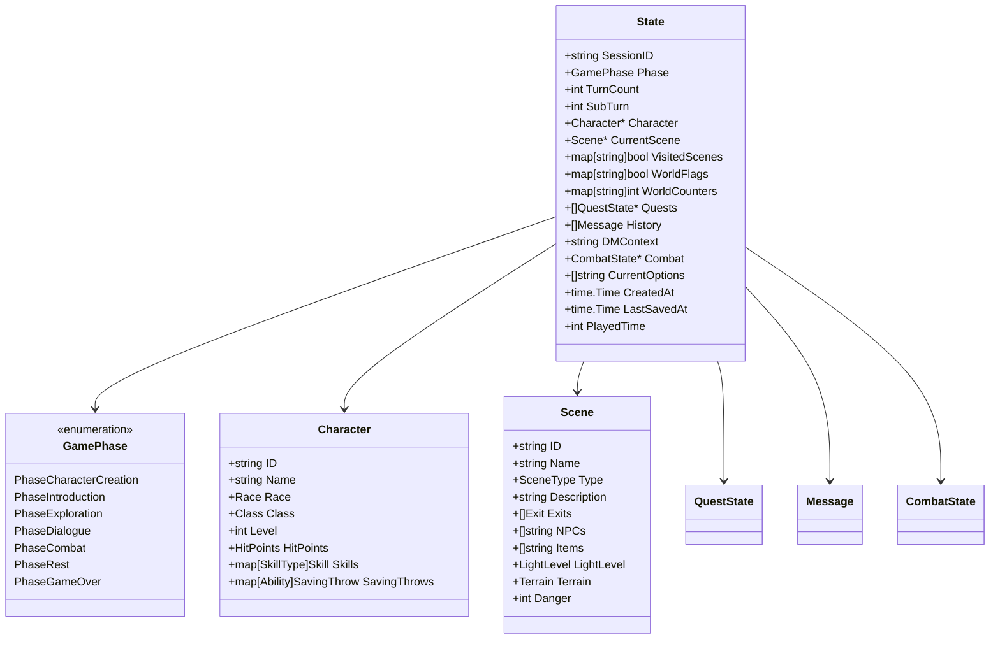
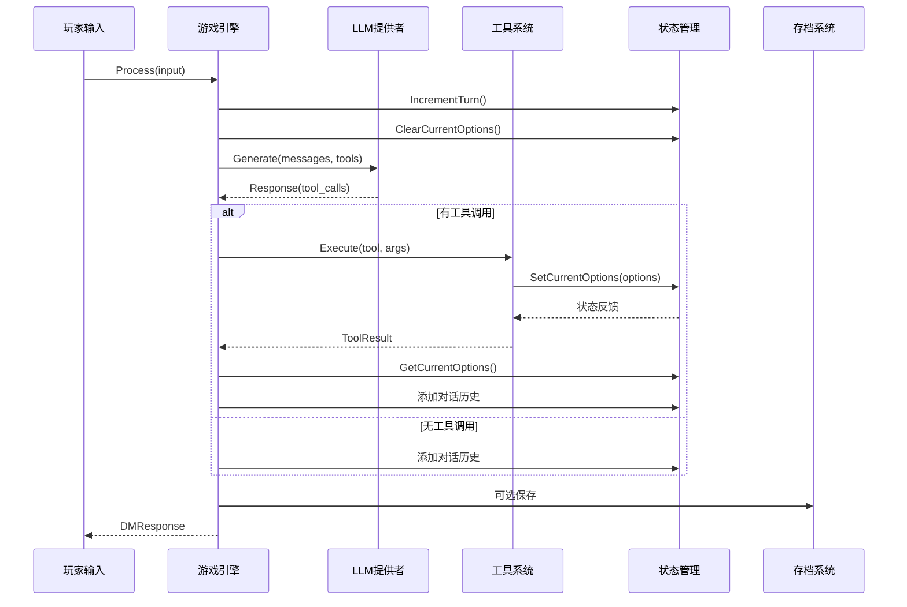
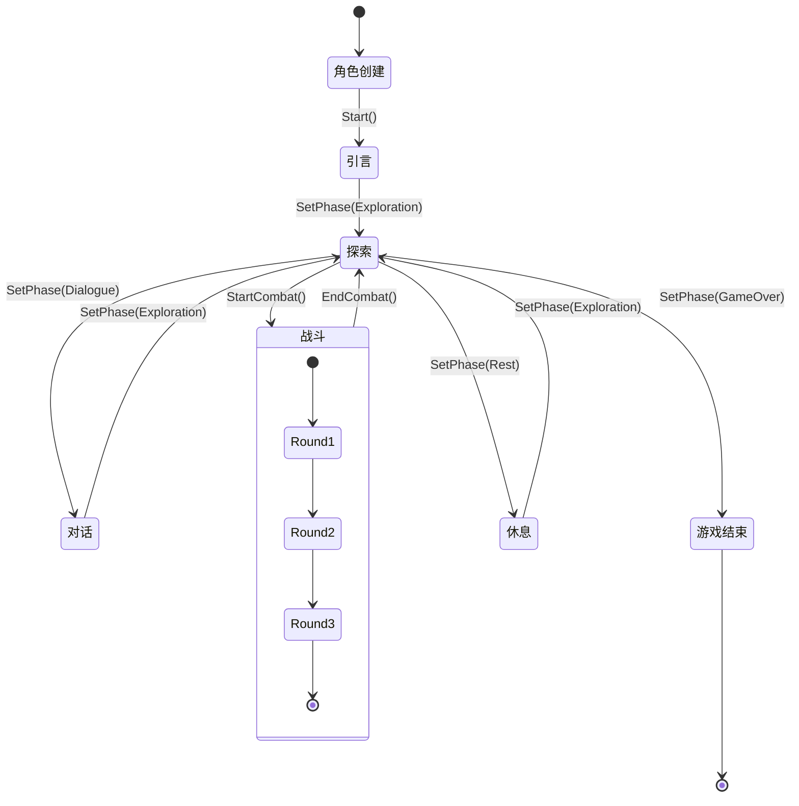
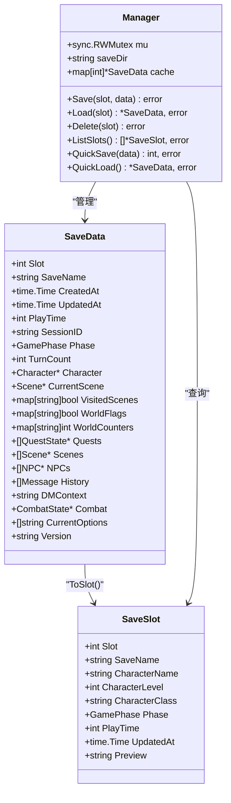
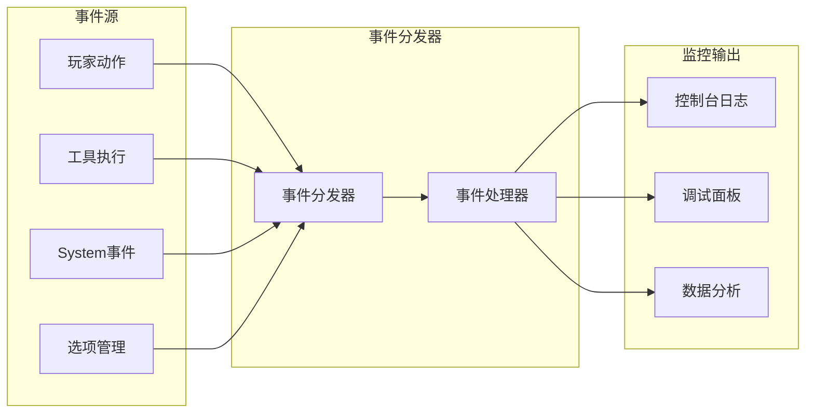
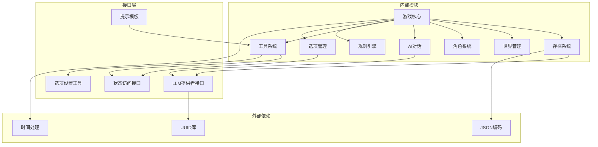

# 状态管理系统

<cite>
**本文档引用的文件**
- [state.go](file://internal/game/state.go)
- [types.go](file://internal/game/types.go)
- [engine.go](file://internal/game/engine.go)
- [events.go](file://internal/game/events.go)
- [init.go](file://internal/game/init.go)
- [types.go](file://internal/save/types.go)
- [manager.go](file://internal/save/manager.go)
- [character.go](file://internal/character/character.go)
- [scene.go](file://internal/world/scene.go)
- [provider.go](file://internal/llm/provider.go)
- [types.go](file://internal/tools/types.go)
- [registry.go](file://internal/tools/registry.go)
- [manager.go](file://internal/world/manager.go)
- [options_tool.go](file://internal/tools/options_tool.go)
- [templates.go](file://internal/llm/prompt/templates.go)
</cite>

## 更新摘要
**变更内容**
- 新增CurrentOptions字段用于存储玩家当前可用的操作选项
- 添加SetCurrentOptions、GetCurrentOptions和ClearCurrentOptions方法
- 增强AI工具调用系统，支持动态选项提供
- 更新引擎处理逻辑以支持选项管理

## 目录
1. [简介](#简介)
2. [项目结构](#项目结构)
3. [核心组件](#核心组件)
4. [架构概览](#架构概览)
5. [详细组件分析](#详细组件分析)
6. [依赖关系分析](#依赖关系分析)
7. [性能考虑](#性能考虑)
8. [故障排除指南](#故障排除指南)
9. [结论](#结论)
10. [附录](#附录)

## 简介

CDND游戏状态管理系统是一个基于Go语言构建的复杂游戏状态管理框架，专为桌面角色扮演游戏(Dungeons & Dragons 5e)设计。该系统实现了完整的回合制战斗、角色管理、世界构建、任务跟踪和持久化存储等功能。

系统的核心设计理念是通过统一的状态结构体(State)来管理游戏的所有动态数据，并通过事件驱动的方式实现各组件间的松耦合通信。状态管理不仅涵盖了传统的游戏数据，还包括AI对话历史、世界标志、计数器和**当前操作选项**等高级功能。

## 项目结构

项目采用模块化的架构设计，主要分为以下几个核心模块：



**图表来源**
- [engine.go:22-56](file://internal/game/engine.go#L22-L56)
- [state.go:13-42](file://internal/game/state.go#L13-L42)

**章节来源**
- [engine.go:1-797](file://internal/game/engine.go#L1-L797)
- [state.go:1-254](file://internal/game/state.go#L1-L254)

## 核心组件

### State结构体详解

State是整个游戏状态管理系统的核心数据结构，它将所有游戏相关的动态数据集中管理：



**更新** 新增CurrentOptions字段用于存储玩家当前可用的操作选项列表

**图表来源**
- [state.go:14-45](file://internal/game/state.go#L14-L45)
- [types.go:11-44](file://internal/save/types.go#L11-L44)
- [character.go:8-61](file://internal/character/character.go#L8-L61)
- [scene.go:19-44](file://internal/world/scene.go#L19-L44)

### 游戏阶段管理

系统实现了完整的七阶段游戏流程，每个阶段都有特定的功能和限制：

| 阶段 | 编号 | 描述 | 主要功能 |
|------|------|------|----------|
| 角色创建 | 0 | 角色创建阶段 | 角色属性分配、职业选择 |
| 引言 | 1 | 游戏开场介绍 | 故事背景、角色介绍 |
| 探索 | 2 | 地图探索 | 场景移动、环境交互 |
| 对话 | 3 | NPC交流 | 对话系统、信息获取 |
| 战斗 | 4 | 回合制战斗 | 战斗系统、先攻排序 |
| 休息 | 5 | 休息恢复 | 休整、恢复状态 |
| 游戏结束 | 6 | 游戏结局 | 结局展示、数据保存 |

**章节来源**
- [state.go:105-212](file://internal/game/state.go#L105-L212)
- [types.go:152-161](file://internal/game/types.go#L152-L161)

## 架构概览

系统采用事件驱动的架构模式，通过Engine作为中央协调器，管理各个子系统的交互：



**更新** 新增选项清理和获取流程，确保每次响应前清空之前的选项

**图表来源**
- [engine.go:197-316](file://internal/game/engine.go#L197-L316)
- [provider.go:27-46](file://internal/llm/provider.go#L27-L46)

**章节来源**
- [engine.go:1-797](file://internal/game/engine.go#L1-L797)

## 详细组件分析

### 状态转换逻辑

系统实现了复杂的阶段转换机制，确保游戏流程的连贯性和一致性：



**图表来源**
- [state.go:151-181](file://internal/game/state.go#L151-L181)
- [engine.go:353-357](file://internal/game/engine.go#L353-L357)

### 回合制系统实现

战斗系统采用标准的D&D回合制机制，实现了先攻排序和行动管理：


**图表来源**
- [state.go:183-212](file://internal/game/state.go#L183-L212)
- [state.go:226-235](file://internal/game/state.go#L226-L235)

**章节来源**
- [state.go:151-212](file://internal/game/state.go#L151-L212)

### 当前选项管理系统

**新增功能** 系统现在支持动态管理玩家当前可用的操作选项，这是AI工具调用的关键组成部分：

```mermaid
classDiagram
class CurrentOptionsManager {
+SetCurrentOptions(options []string)
+GetCurrentOptions() []string
+ClearCurrentOptions()
+validateOptions(options []string) bool
}
class SetOptionsTool {
+Execute(ctx, args) *ToolResult
+Parameters() map[string]interface{}
}
class Engine {
+Process(input) *DMResponse
+GetCurrentOptions() []string
}
CurrentOptionsManager --> SetOptionsTool : "被调用"
Engine --> CurrentOptionsManager : "管理状态"
SetOptionsTool --> CurrentOptionsManager : "设置选项"
```

**更新** 新增选项管理流程，支持AI工具动态提供玩家可选操作

**图表来源**
- [state.go:228-242](file://internal/game/state.go#L228-L242)
- [options_tool.go:38-66](file://internal/tools/options_tool.go#L38-L66)
- [engine.go:196-261](file://internal/game/engine.go#L196-L261)

**章节来源**
- [state.go:228-242](file://internal/game/state.go#L228-L242)
- [options_tool.go:38-66](file://internal/tools/options_tool.go#L38-L66)
- [engine.go:196-261](file://internal/game/engine.go#L196-L261)

### 状态持久化机制

系统提供了完整的存档和加载功能，支持多种存档格式和操作：



**更新** 新增CurrentOptions字段到存档数据结构中

**图表来源**
- [types.go:110-147](file://internal/save/types.go#L110-L147)
- [manager.go:20-55](file://internal/save/manager.go#L20-L55)
- [types.go:149-168](file://internal/save/types.go#L149-L168)

**章节来源**
- [manager.go:57-122](file://internal/save/manager.go#L57-L122)
- [types.go:170-186](file://internal/save/types.go#L170-L186)

### 事件监控系统

系统实现了完整的事件驱动架构，支持实时监控和调试：



**更新** 新增选项管理事件监控

**图表来源**
- [events.go:135-180](file://internal/game/events.go#L135-L180)
- [engine.go:389-392](file://internal/game/engine.go#L389-L392)

**章节来源**
- [events.go:1-244](file://internal/game/events.go#L1-L244)

## 依赖关系分析

系统采用了清晰的依赖层次结构，确保模块间的松耦合：



**更新** 新增选项管理模块及其依赖关系

**图表来源**
- [engine.go:3-20](file://internal/game/engine.go#L3-L20)
- [state.go:3-11](file://internal/game/state.go#L3-L11)

**章节来源**
- [engine.go:35-56](file://internal/game/engine.go#L35-L56)
- [state.go:44-58](file://internal/game/state.go#L44-L58)

## 性能考虑

### 内存优化策略

1. **状态共享**: 通过引用传递避免不必要的数据复制
2. **缓存机制**: 存档管理器使用内存缓存减少磁盘I/O
3. **延迟初始化**: 按需创建大型数据结构
4. **选项优化**: CurrentOptions使用nil表示无选项，节省内存

### 并发安全

系统在关键路径上实现了完善的并发控制：
- 使用RWMutex保护共享状态
- 事件分发器支持并发处理器
- 存档操作使用互斥锁保证原子性
- 选项管理支持并发访问

### 序列化优化

- 使用紧凑的JSON格式减少存储空间
- 智能的字段选择避免序列化无关数据
- 批量操作减少I/O往返次数
- CurrentOptions字段支持可选序列化

## 故障排除指南

### 常见问题及解决方案

#### 状态不同步问题
**症状**: 角色状态与UI显示不一致
**原因**: 工具执行后状态未正确更新
**解决**: 检查工具执行链路和事件分发

#### 存档加载失败
**症状**: 加载存档时报错"角色数据缺失"
**原因**: 存档文件损坏或版本不兼容
**解决**: 使用QuickSave进行备份，检查文件完整性

#### 战斗系统异常
**症状**: 先攻排序错误或回合跳过
**原因**: sortInitiative算法问题
**解决**: 验证先攻值计算和排序逻辑

#### 选项管理问题
**症状**: 玩家无法看到可用选项或选项重复出现
**原因**: ClearCurrentOptions未正确调用或SetCurrentOptions参数错误
**解决**: 检查引擎Process方法中的选项管理流程，验证工具参数格式

**章节来源**
- [engine.go:101-150](file://internal/game/engine.go#L101-L150)
- [state.go:226-235](file://internal/game/state.go#L226-L235)

### 调试技巧

1. **启用详细日志**: 监控事件分发和工具执行
2. **状态快照**: 定期保存状态用于问题重现
3. **单元测试**: 为关键状态转换编写测试用例
4. **选项追踪**: 监控SetCurrentOptions和ClearCurrentOptions的调用频率

## 结论

CDND游戏状态管理系统展现了现代游戏开发中状态管理的最佳实践。通过统一的状态结构、事件驱动的架构和完善的持久化机制，系统实现了高度的模块化和可扩展性。

系统的主要优势包括：
- **清晰的架构分离**: 各模块职责明确，便于维护和扩展
- **强大的事件系统**: 支持复杂的异步交互和状态同步
- **灵活的持久化**: 支持多种存档格式和操作模式
- **完善的监控**: 提供丰富的调试和诊断功能
- **智能的选项管理**: 支持AI工具动态提供玩家可选操作

**更新** 新增的CurrentOptions功能显著增强了系统的AI集成能力，使得玩家能够获得更加自然和直观的游戏体验。

未来可以考虑的改进方向：
- 增加状态版本控制和迁移机制
- 实现更细粒度的状态缓存策略
- 添加状态压缩和增量保存功能
- 扩展选项管理的复杂度，支持条件选项和动态过滤

## 附录

### API参考

#### 状态管理API
- `NewState()`: 创建新状态实例
- `SetPhase(phase)`: 设置游戏阶段
- `IncrementTurn()`: 增加回合数
- `AddHistory(message)`: 添加对话历史
- **新增**: `SetCurrentOptions(options)`: 设置当前可用选项
- **新增**: `GetCurrentOptions()`: 获取当前可用选项
- **新增**: `ClearCurrentOptions()`: 清除当前选项

#### 存档管理API
- `Save(slot, data)`: 保存游戏进度
- `Load(slot)`: 加载游戏进度
- `ListSlots()`: 列出所有存档槽位
- `QuickSave(data)`: 快速保存

#### 事件系统API
- `Subscribe(eventType, handler)`: 订阅事件
- `Dispatch(event)`: 分发事件
- `Queue(event)`: 队列化事件

#### 工具系统API
- `Register(tool, allowedPhases...)`: 注册工具
- `Execute(ctx, name, args)`: 执行工具
- `GetToolDefinitions()`: 获取工具定义

**更新** 新增选项管理相关的API方法

**章节来源**
- [state.go:44-242](file://internal/game/state.go#L44-L242)
- [manager.go:57-181](file://internal/save/manager.go#L57-L181)
- [events.go:150-219](file://internal/game/events.go#L150-L219)
- [options_tool.go:13-66](file://internal/tools/options_tool.go#L13-L66)