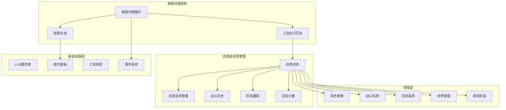
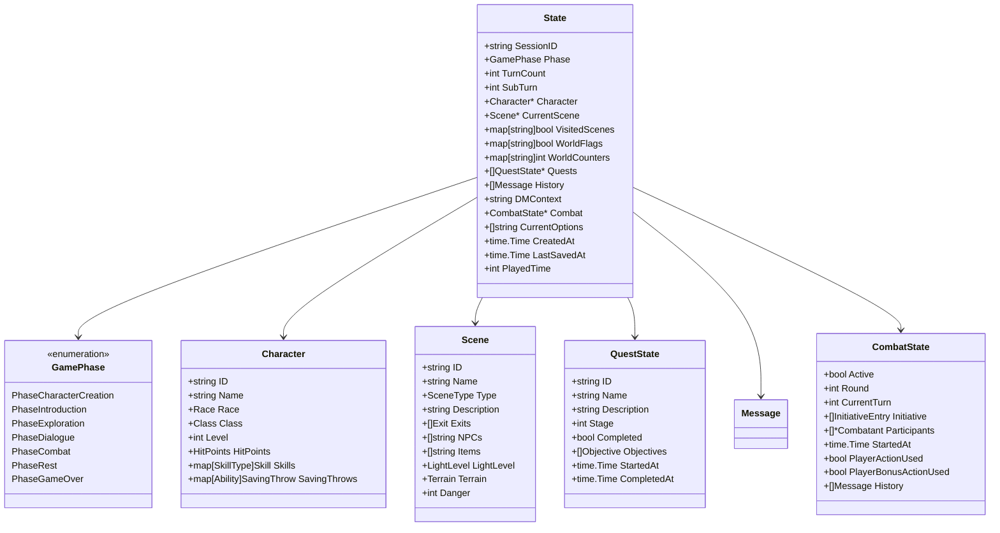
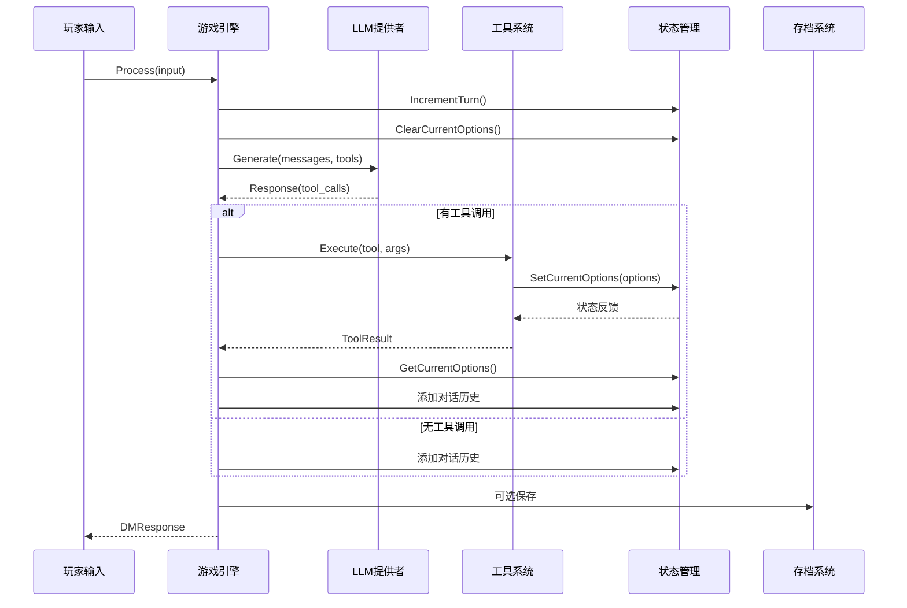
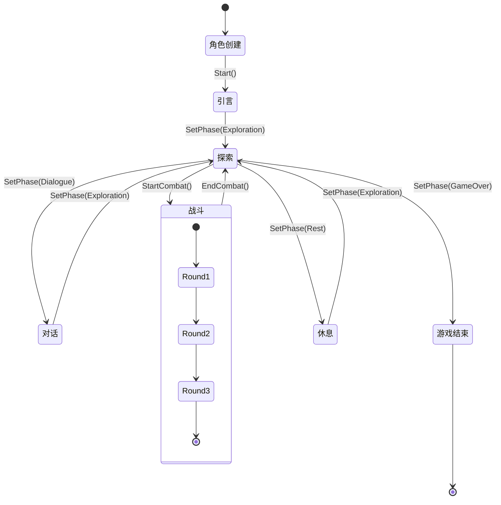
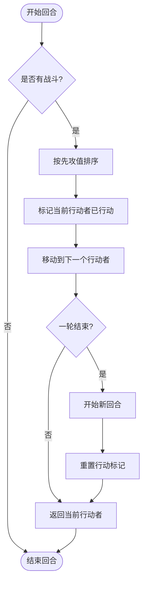
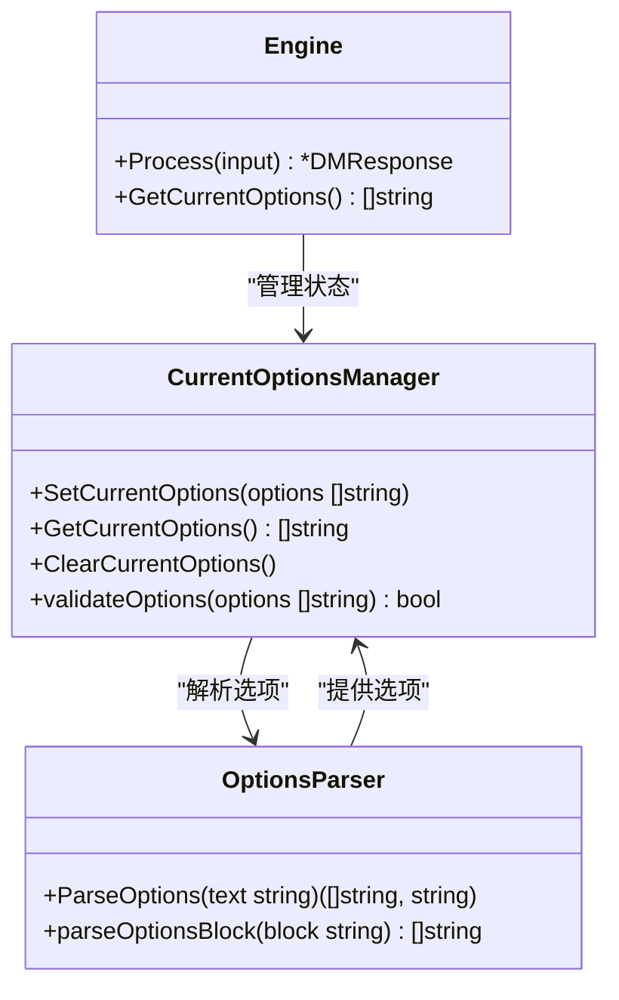
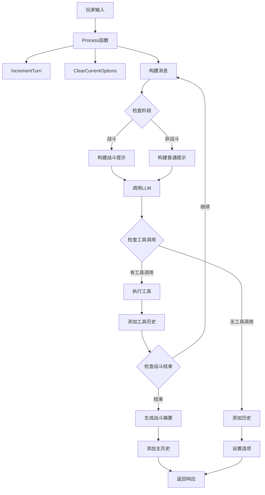
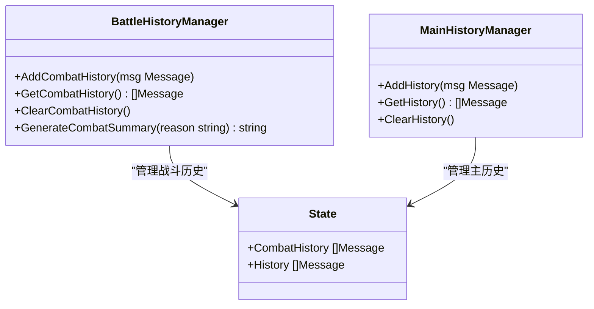
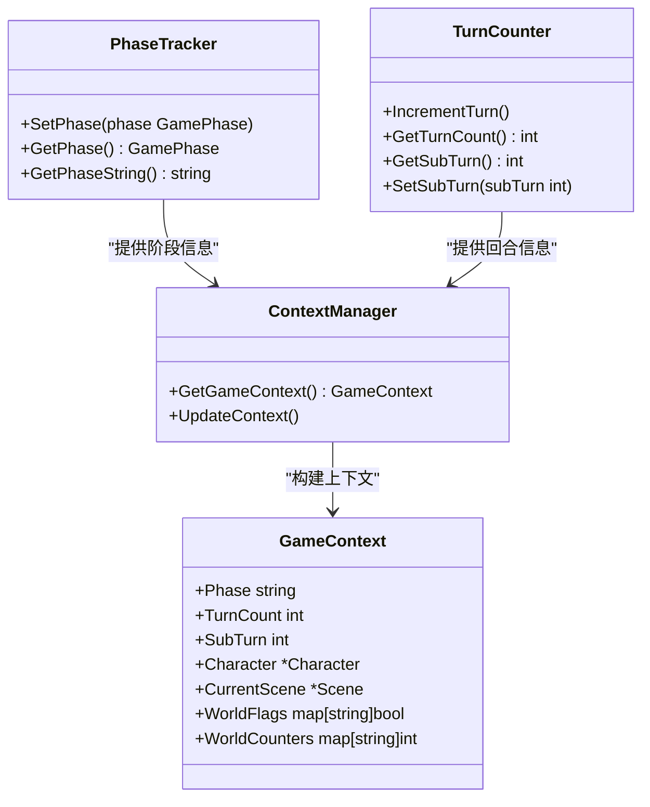
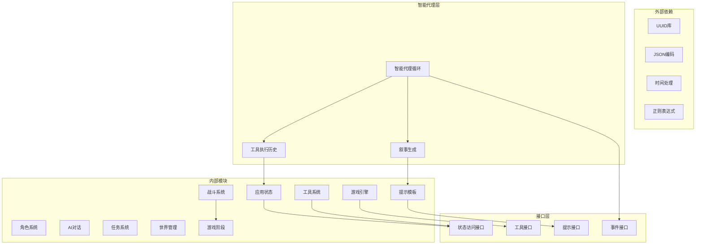

# 状态管理系统

<cite>
**本文档引用的文件**
- [state.go](file://application/state/state.go)
- [engine.go](file://application/engine/engine.go)
- [game_phase.go](file://domain/game_phase.go)
- [combat_state.go](file://domain/combat/combat_state.go)
- [types.go](file://domain/llm/types.go)
- [character.go](file://domain/character/character.go)
- [scene.go](file://domain/world/scene.go)
- [quest_state.go](file://domain/quest/quest_state.go)
- [types.go](file://application/tools/types.go)
- [registry.go](file://application/tools/registry.go)
- [templates.go](file://infrastructure/prompt/templates.go)
</cite>

## 更新摘要
**变更内容**
- 状态管理系统从单一state.go文件重构为模块化结构，包含游戏核心状态和应用层状态两个实现
- 引入了全新的State结构体，支持更复杂的战斗状态管理和任务系统集成
- 新增CurrentOptions字段用于存储玩家当前可用的操作选项
- 增强AI工具调用系统，支持动态选项提供和解析
- 更新引擎处理逻辑以支持选项管理和状态转换
- **新增** 智能代理架构支持，包含详细的阶段跟踪、回合计数、战斗状态、工具执行历史等
- **新增** 战斗和探索阶段的独立历史管理，支持上下文感知的叙事

## 目录
1. [简介](#简介)
2. [项目结构](#项目结构)
3. [核心组件](#核心组件)
4. [架构概览](#架构概览)
5. [详细组件分析](#详细组件分析)
6. [依赖关系分析](#依赖关系分析)
7. [性能考虑](#性能考虑)
8. [故障排除指南](#故障排除指南)
9. [结论](#结论)
10. [附录](#附录)

## 简介

CDND游戏状态管理系统是一个基于Go语言构建的复杂游戏状态管理框架，专为桌面角色扮演游戏(Dungeons & Dragons 5e)设计。该系统实现了完整的回合制战斗、角色管理、世界构建、任务跟踪和持久化存储等功能。

系统的核心设计理念是通过统一的状态结构体(State)来管理游戏的所有动态数据，并通过事件驱动的方式实现各组件间的松耦合通信。状态管理不仅涵盖了传统的游戏数据，还包括AI对话历史、世界标志、计数器和**当前操作选项**等高级功能。

**更新** 系统现已重构为模块化架构，包含游戏核心状态和应用层状态两个实现，提供更好的代码组织和可维护性。新增的智能代理架构支持上下文感知的叙事和动态选项管理。

## 项目结构

项目采用模块化的架构设计，主要分为以下几个核心模块：

**图表来源**
- [state.go:15-47](file://application/state/state.go#L15-L47)
- [engine.go:240-439](file://application/engine/engine.go#L240-L439)
- [templates.go:15-136](file://infrastructure/prompt/templates.go#L15-L136)

**章节来源**
- [state.go:1-414](file://application/state/state.go#L1-L414)
- [engine.go:240-439](file://application/engine/engine.go#L240-L439)

## 核心组件

### State结构体详解

State是整个游戏状态管理系统的核心数据结构，它将所有游戏相关的动态数据集中管理：

**更新** 新增CurrentOptions字段用于存储玩家当前可用的操作选项列表，增强AI工具调用系统

**图表来源**
- [state.go:15-47](file://application/state/state.go#L15-L47)
- [character.go:8-61](file://domain/character/character.go#L8-L61)
- [scene.go:19-44](file://domain/world/scene.go#L19-L44)
- [combat_state.go:41-52](file://domain/combat/combat_state.go#L41-L52)
- [quest_state.go:5-24](file://domain/quest/quest_state.go#L5-L24)

### 游戏阶段管理

系统实现了完整的七阶段游戏流程，每个阶段都有特定的功能和限制：

| 阶段 | 编号 | 描述 | 主要功能 |
|------|------|------|----------|
| 角色创建 | 0 | 角色创建阶段 | 角色属性分配、职业选择 |
| 引言 | 1 | 游戏开场介绍 | 故事背景、角色介绍 |
| 探索 | 2 | 地图探索 | 场景移动、环境交互 |
| 对话 | 3 | NPC交流 | 对话系统、信息获取 |
| 战斗 | 4 | 回合制战斗 | 战斗系统、先攻排序 |
| 休息 | 5 | 休息恢复 | 休整、恢复状态 |
| 游戏结束 | 6 | 游戏结局 | 结局展示、数据保存 |

**章节来源**
- [game_phase.go:6-14](file://domain/game_phase.go#L6-L14)

## 架构概览

系统采用事件驱动的架构模式，通过Engine作为中央协调器，管理各个子系统的交互：

**更新** 新增选项清理和获取流程，确保每次响应前清空之前的选项

**图表来源**
- [engine.go:240-439](file://application/engine/engine.go#L240-L439)

**章节来源**
- [engine.go:240-439](file://application/engine/engine.go#L240-L439)

## 详细组件分析

### 状态转换逻辑

系统实现了复杂的阶段转换机制，确保游戏流程的连贯性和一致性：

**图表来源**
- [state.go:156-186](file://application/state/state.go#L156-L186)
- [state.go:188-217](file://application/state/state.go#L188-L217)

### 回合制系统实现

战斗系统采用标准的D&D回合制机制，实现了先攻排序和行动管理：

**图表来源**
- [state.go:188-217](file://application/state/state.go#L188-L217)
- [state.go:400-409](file://application/state/state.go#L400-L409)

**章节来源**
- [state.go:156-217](file://application/state/state.go#L156-L217)

### 当前选项管理系统

**新增功能** 系统现在支持动态管理玩家当前可用的操作选项，这是AI工具调用的关键组成部分：

**更新** 新增选项管理流程，支持AI工具动态提供玩家可选操作，包含选项解析器

**图表来源**
- [state.go:384-398](file://application/state/state.go#L384-L398)
- [engine.go:326-330](file://application/engine/engine.go#L326-L330)

**章节来源**
- [state.go:384-398](file://application/state/state.go#L384-L398)
- [engine.go:326-330](file://application/engine/engine.go#L326-L330)

### 智能代理架构

**新增** 系统现在支持智能代理架构，实现了完整的工具调用循环和上下文感知的叙事：

**更新** 新增智能代理循环，支持工具调用、战斗历史管理和上下文感知的叙事生成

**图表来源**
- [engine.go:240-439](file://application/engine/engine.go#L240-L439)

**章节来源**
- [engine.go:240-439](file://application/engine/engine.go#L240-L439)

### 战斗历史管理系统

**新增** 系统现在支持战斗和探索阶段的独立历史管理：

**更新** 新增独立的战斗历史管理，支持战斗过程的完整记录和摘要生成

**图表来源**
- [state.go:338-362](file://application/state/state.go#L338-L362)
- [engine.go:426-439](file://application/engine/engine.go#L426-L439)

**章节来源**
- [state.go:338-362](file://application/state/state.go#L338-L362)
- [engine.go:426-439](file://application/engine/engine.go#L426-L439)

### 阶段跟踪和回合计数

**新增** 系统现在维护详细的阶段跟踪和回合计数：

**更新** 新增阶段跟踪和回合计数功能，支持上下文感知的叙事生成

**图表来源**
- [state.go:65-73](file://application/state/state.go#L65-L73)
- [state.go:110-113](file://application/state/state.go#L110-L113)
- [engine.go:279-288](file://application/engine/engine.go#L279-L288)

**章节来源**
- [state.go:65-73](file://application/state/state.go#L65-L73)
- [state.go:110-113](file://application/state/state.go#L110-L113)
- [engine.go:279-288](file://application/engine/engine.go#L279-L288)

## 依赖关系分析

系统采用了清晰的依赖层次结构，确保模块间的松耦合：

**更新** 新增智能代理架构及其依赖关系，包含状态访问接口和工具执行历史

**图表来源**
- [state.go:3-13](file://application/state/state.go#L3-L13)
- [engine.go:240-439](file://application/engine/engine.go#L240-L439)
- [types.go:12-43](file://application/tools/types.go#L12-L43)

**章节来源**
- [state.go:3-13](file://application/state/state.go#L3-L13)
- [engine.go:240-439](file://application/engine/engine.go#L240-L439)
- [types.go:12-43](file://application/tools/types.go#L12-L43)

## 性能考虑

### 内存优化策略

1. **状态共享**: 通过引用传递避免不必要的数据复制
2. **缓存机制**: 存档管理器使用内存缓存减少磁盘I/O
3. **延迟初始化**: 按需创建大型数据结构
4. **选项优化**: CurrentOptions使用nil表示无选项，节省内存
5. **模块化设计**: 游戏核心状态和应用层状态分离，减少相互影响
6. **智能代理缓存**: LLM响应和工具调用结果的缓存机制

### 并发安全

系统在关键路径上实现了完善的并发控制：
- 使用RWMutex保护共享状态
- 事件分发器支持并发处理器
- 存档操作使用互斥锁保证原子性
- 选项管理支持并发访问
- 正则表达式解析器线程安全
- 智能代理循环的异步处理

### 序列化优化

- 使用紧凑的JSON格式减少存储空间
- 智能的字段选择避免序列化无关数据
- 批量操作减少I/O往返次数
- CurrentOptions字段支持可选序列化
- 选项解析器缓存常用模式
- 战斗历史的增量更新机制

## 故障排除指南

### 常见问题及解决方案

#### 状态不同步问题
**症状**: 角色状态与UI显示不一致
**原因**: 工具执行后状态未正确更新
**解决**: 检查工具执行链路和事件分发

#### 存档加载失败
**症状**: 加载存档时报错"角色数据缺失"
**原因**: 存档文件损坏或版本不兼容
**解决**: 使用QuickSave进行备份，检查文件完整性

#### 战斗系统异常
**症状**: 先攻排序错误或回合跳过
**原因**: sortInitiative算法问题
**解决**: 验证先攻值计算和排序逻辑

#### 选项管理问题
**症状**: 玩家无法看到可用选项或选项重复出现
**原因**: ClearCurrentOptions未正确调用或SetCurrentOptions参数错误
**解决**: 检查引擎Process方法中的选项管理流程，验证工具参数格式

#### 选项解析失败
**症状**: AI回复中的选项无法正确提取
**原因**: 选项块格式不符合预期或正则表达式匹配失败
**解决**: 验证LLM输出格式，检查选项解析器的正则表达式

#### 智能代理循环问题
**症状**: 工具调用循环卡住或无限循环
**原因**: 工具执行失败或状态更新异常
**解决**: 检查工具执行结果，验证状态转换逻辑

**章节来源**
- [engine.go:240-439](file://application/engine/engine.go#L240-L439)
- [state.go:384-398](file://application/state/state.go#L384-L398)

### 调试技巧

1. **启用详细日志**: 监控事件分发和工具执行
2. **状态快照**: 定期保存状态用于问题重现
3. **单元测试**: 为关键状态转换编写测试用例
4. **选项追踪**: 监控SetCurrentOptions和ClearCurrentOptions的调用频率
5. **正则表达式调试**: 验证选项解析器的匹配模式
6. **智能代理调试**: 监控工具调用循环和状态转换

## 结论

CDND游戏状态管理系统展现了现代游戏开发中状态管理的最佳实践。通过统一的状态结构、事件驱动的架构和完善的持久化机制，系统实现了高度的模块化和可扩展性。

系统的主要优势包括：
- **清晰的架构分离**: 游戏核心状态和应用层状态职责明确，便于维护和扩展
- **强大的事件系统**: 支持复杂的异步交互和状态同步
- **灵活的持久化**: 支持多种存档格式和操作模式
- **完善的监控**: 提供丰富的调试和诊断功能
- **智能的选项管理**: 支持AI工具动态提供玩家可选操作
- **模块化设计**: 良好的代码组织和依赖管理
- **智能代理架构**: 支持上下文感知的叙事和工具调用循环
- **独立历史管理**: 战斗和探索阶段的分离历史记录

**更新** 新增的CurrentOptions功能、智能代理架构和独立历史管理显著增强了系统的AI集成能力和可维护性，使得玩家能够获得更加自然和直观的游戏体验。

未来可以考虑的改进方向：
- 增加状态版本控制和迁移机制
- 实现更细粒度的状态缓存策略
- 添加状态压缩和增量保存功能
- 扩展选项管理的复杂度，支持条件选项和动态过滤
- 优化正则表达式解析器的性能
- 实现智能代理的多轮对话管理
- 增强战斗历史的可视化和分析功能

## 附录

### API参考

#### 状态管理API
- `NewState()`: 创建新状态实例
- `SetPhase(phase)`: 设置游戏阶段
- `IncrementTurn()`: 增加回合数
- `AddHistory(message)`: 添加对话历史
- **新增**: `SetCurrentOptions(options)`: 设置当前可用选项
- **新增**: `GetCurrentOptions()`: 获取当前可用选项
- **新增**: `ClearCurrentOptions()`: 清除当前选项
- **新增**: `AddCombatHistory(message)`: 添加战斗历史
- **新增**: `GetCombatHistory()`: 获取战斗历史
- **新增**: `ClearCombatHistory()`: 清空战斗历史

#### 存档管理API
- `Save(slot, data)`: 保存游戏进度
- `Load(slot)`: 加载游戏进度
- `ListSlots()`: 列出所有存档槽位
- `QuickSave(data)`: 快速保存

#### 事件系统API
- `Subscribe(eventType, handler)`: 订阅事件
- `Dispatch(event)`: 分发事件
- `Queue(event)`: 队列化事件

#### 工具系统API
- `Register(tool, allowedPhases...)`: 注册工具
- `Execute(ctx, name, args)`: 执行工具
- `GetToolDefinitions()`: 获取工具定义
- **新增**: `StateAccessor`接口: 提供状态访问能力

#### 选项管理API
- `ParseOptions(text)`: 从文本解析选项列表
- `parseOptionsBlock(block)`: 解析选项块内容

#### 智能代理API
- `Process(input)`: 处理玩家输入的智能代理循环
- **新增**: `generateAndAddCombatSummary(ctx, reason)`: 生成战斗摘要
- **新增**: `triggerAutosaveByTurn()`: 触发回合级自动保存

**更新** 新增智能代理架构相关的API方法和选项解析器功能

**章节来源**
- [state.go:49-414](file://application/state/state.go#L49-L414)
- [engine.go:240-439](file://application/engine/engine.go#L240-L439)
- [types.go:12-126](file://application/tools/types.go#L12-L126)