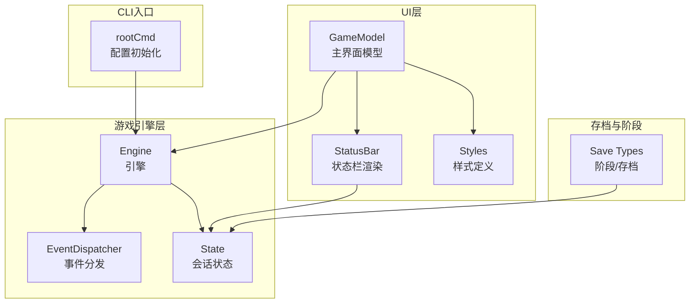
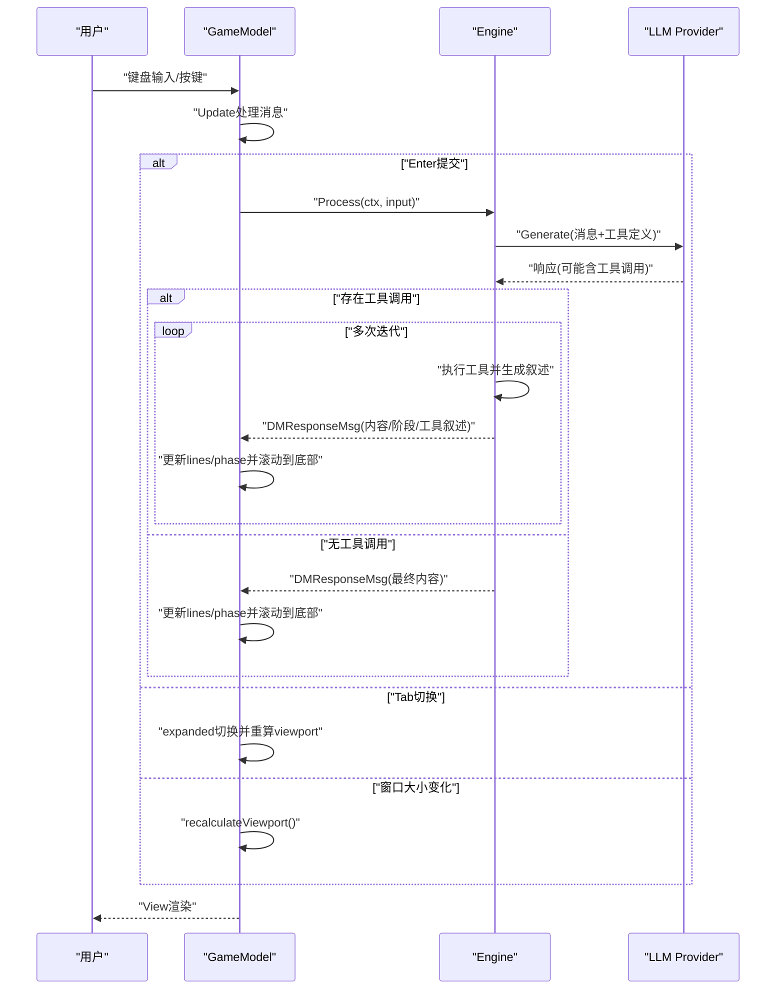
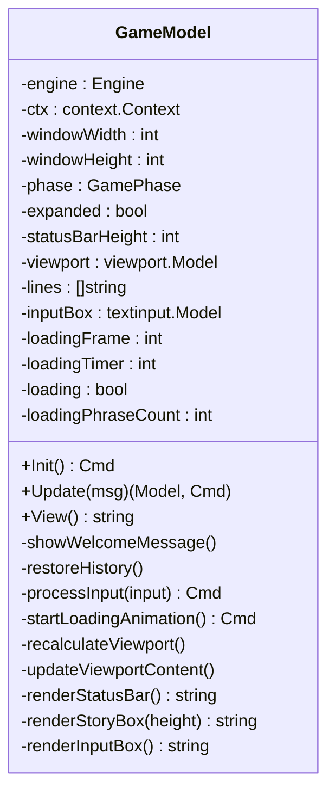
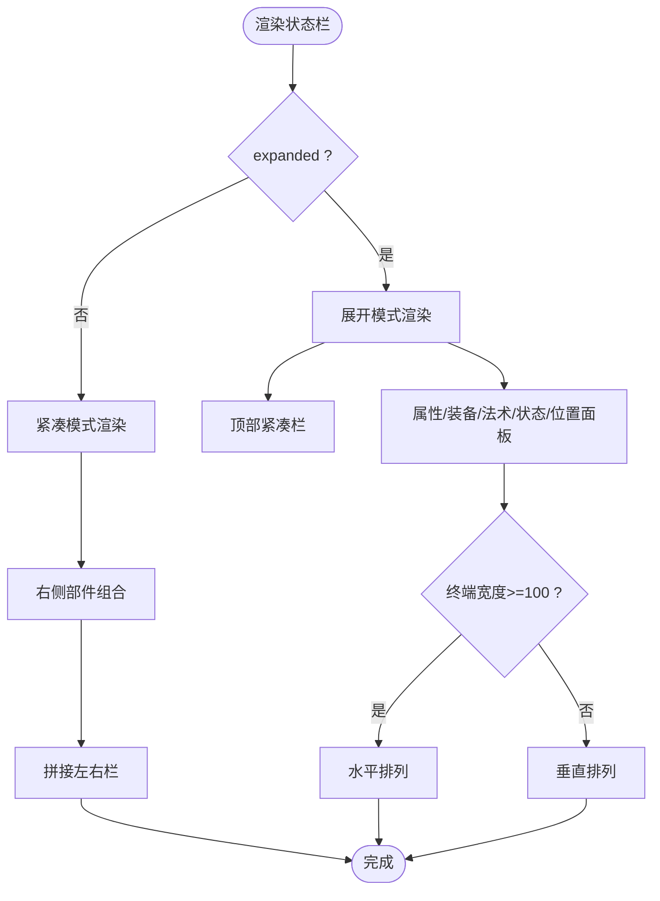
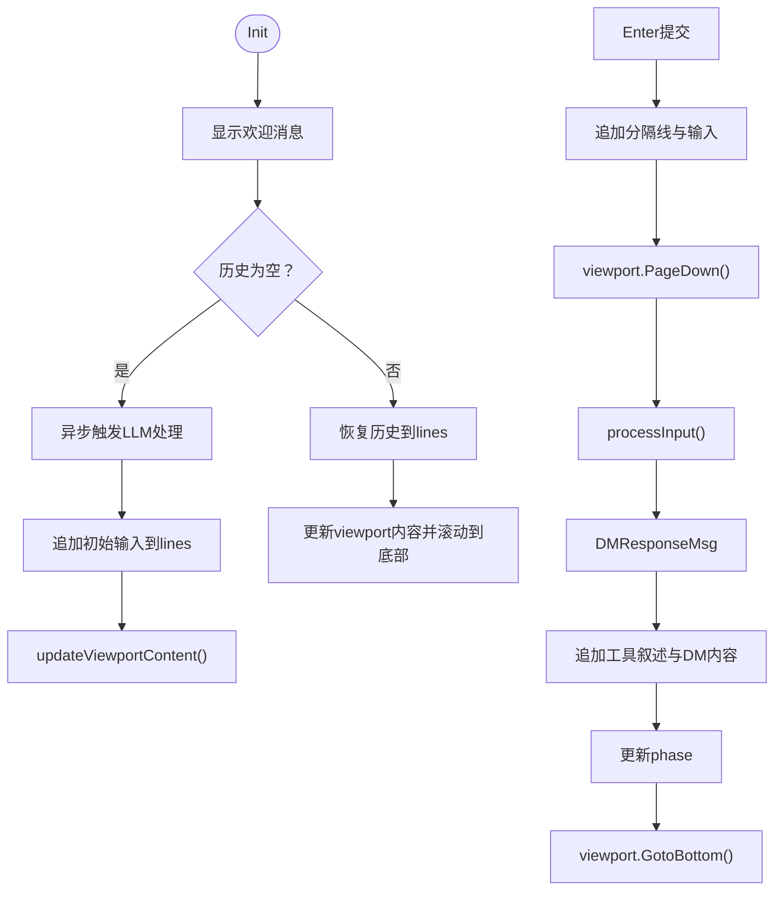
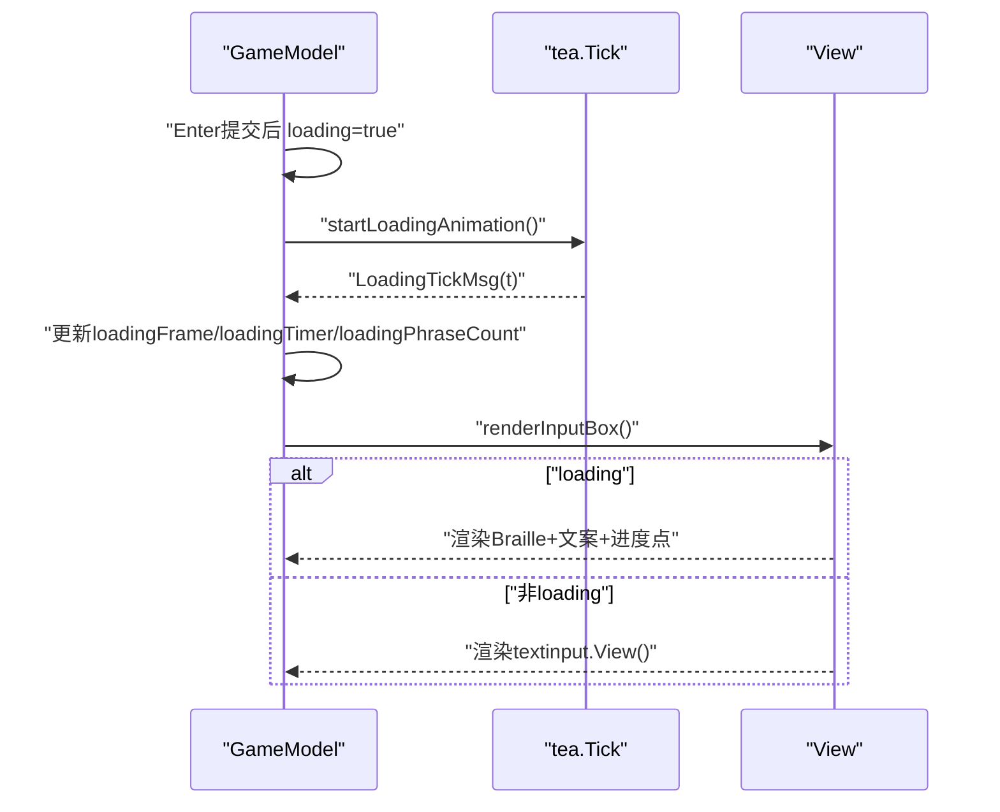
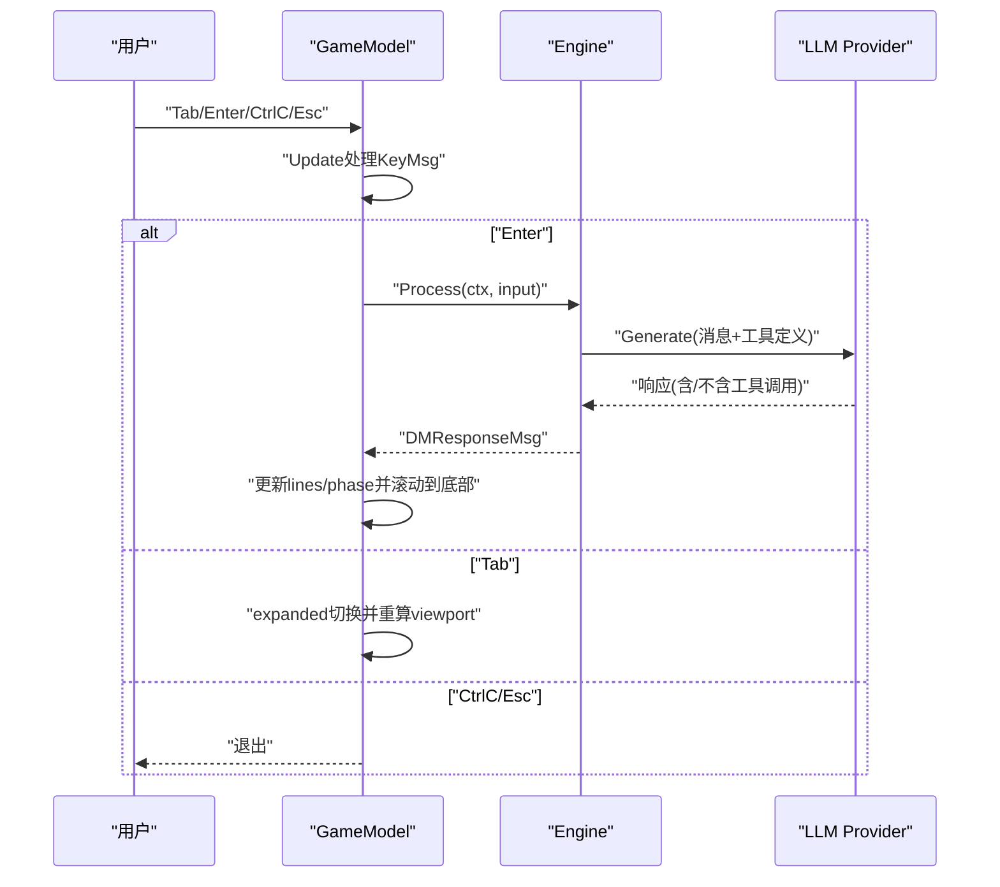
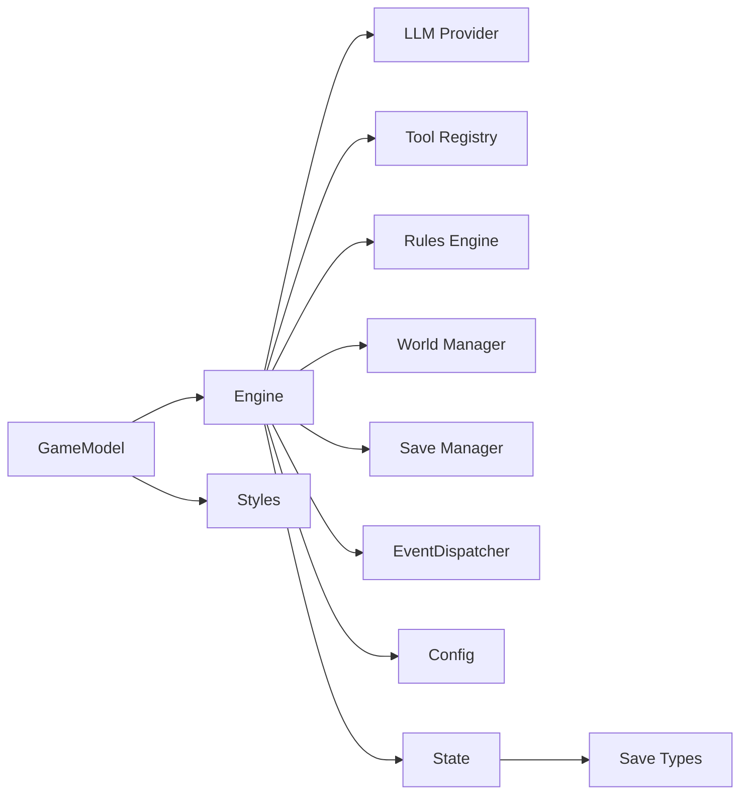

# 游戏主界面

<cite>
**本文引用的文件**
- [internal/ui/game.go](file://internal/ui/game.go)
- [internal/ui/statusbar.go](file://internal/ui/statusbar.go)
- [internal/ui/styles.go](file://internal/ui/styles.go)
- [internal/game/engine.go](file://internal/game/engine.go)
- [internal/game/state.go](file://internal/game/state.go)
- [internal/game/events.go](file://internal/game/events.go)
- [internal/save/types.go](file://internal/save/types.go)
- [cmd/root.go](file://cmd/root.go)
- [config.example.yaml](file://config.example.yaml)
</cite>

## 目录
1. [简介](#简介)
2. [项目结构](#项目结构)
3. [核心组件](#核心组件)
4. [架构总览](#架构总览)
5. [详细组件分析](#详细组件分析)
6. [依赖关系分析](#依赖关系分析)
7. [性能考量](#性能考量)
8. [故障排查指南](#故障排查指南)
9. [结论](#结论)
10. [附录](#附录)

## 简介
本文件面向CDND游戏主界面，围绕基于Bubble Tea框架的GameModel实现进行深入技术文档化，覆盖界面布局设计、组件状态管理、事件处理机制；状态栏渲染系统（角色信息展示、展开/折叠切换逻辑、动态高度调整）；剧情输出区域viewport实现（文本滚动、自动换行、内容更新机制）；输入框组件（实时输入处理、命令提交、加载动画效果）；用户交互流程（从键盘输入到LLM响应的完整数据流）；界面定制选项与样式配置；性能优化策略与内存管理；以及与游戏引擎的集成接口与数据同步机制。

## 项目结构
- UI层：GameModel负责主界面布局与交互，StatusBar负责角色信息面板渲染，Styles集中管理样式。
- 游戏引擎层：Engine封装LLM调用、工具注册与执行、事件分发、状态管理与持久化。
- 存档与阶段：Save包定义游戏阶段枚举与存档数据结构，State承载会话状态。
- CLI入口：cmd/root.go负责配置初始化与命令树组织。

**图表来源**
- [internal/ui/game.go:19-62](file://internal/ui/game.go#L19-L62)
- [internal/ui/statusbar.go:12-134](file://internal/ui/statusbar.go#L12-L134)
- [internal/ui/styles.go:121-175](file://internal/ui/styles.go#L121-L175)
- [internal/game/engine.go:22-56](file://internal/game/engine.go#L22-L56)
- [internal/game/state.go:13-42](file://internal/game/state.go#L13-L42)
- [internal/game/events.go:135-148](file://internal/game/events.go#L135-L148)
- [internal/save/types.go:11-44](file://internal/save/types.go#L11-L44)
- [cmd/root.go:31-37](file://cmd/root.go#L31-L37)

**章节来源**
- [internal/ui/game.go:19-62](file://internal/ui/game.go#L19-L62)
- [internal/ui/statusbar.go:12-134](file://internal/ui/statusbar.go#L12-L134)
- [internal/ui/styles.go:121-175](file://internal/ui/styles.go#L121-L175)
- [internal/game/engine.go:22-56](file://internal/game/engine.go#L22-L56)
- [internal/game/state.go:13-42](file://internal/game/state.go#L13-L42)
- [internal/game/events.go:135-148](file://internal/game/events.go#L135-L148)
- [internal/save/types.go:11-44](file://internal/save/types.go#L11-L44)
- [cmd/root.go:31-37](file://cmd/root.go#L31-L37)

## 核心组件
- GameModel：主界面模型，持有Engine实例与UI状态，负责布局、事件处理、viewport与textinput协调、加载动画与消息分发。
- StatusBar：状态栏渲染器，支持紧凑与展开双态，按阶段动态组合信息，计算左右栏宽度并拼接。
- Styles：集中样式定义，包含标题、状态栏、输入框、面板标题、正负向数值、法术槽分数、位置名、金币、状态徽章等。
- Engine：引擎核心，封装LLM调用、工具注册与执行、事件分发、状态管理、存档/读档、阶段切换。
- State：会话状态容器，包含角色、场景、历史、战斗、计时等。
- Save Types：定义游戏阶段枚举与存档数据结构。
- CLI入口：配置初始化与命令树组织。

**章节来源**
- [internal/ui/game.go:19-62](file://internal/ui/game.go#L19-L62)
- [internal/ui/statusbar.go:12-134](file://internal/ui/statusbar.go#L12-L134)
- [internal/ui/styles.go:121-175](file://internal/ui/styles.go#L121-L175)
- [internal/game/engine.go:22-56](file://internal/game/engine.go#L22-L56)
- [internal/game/state.go:13-42](file://internal/game/state.go#L13-L42)
- [internal/save/types.go:11-44](file://internal/save/types.go#L11-L44)
- [cmd/root.go:31-37](file://cmd/root.go#L31-L37)

## 架构总览
主界面采用Bubble Tea的Model/View/Update循环，GameModel作为顶层模型：
- Init：根据历史是否为空决定新游戏或恢复历史；新游戏时立即显示欢迎消息并异步触发LLM对话。
- Update：处理KeyMsg（Tab展开/折叠、Enter提交、CtrlC/Esc退出）、WindowSizeMsg（重算viewport）、DMResponseMsg（接收引擎响应）、LoadingTickMsg（加载动画tick）。
- View：按窗口尺寸动态计算三段布局（状态栏、剧情输出、输入框），分别渲染。

**图表来源**
- [internal/ui/game.go:85-175](file://internal/ui/game.go#L85-L175)
- [internal/ui/game.go:228-241](file://internal/ui/game.go#L228-L241)
- [internal/ui/game.go:246-251](file://internal/ui/game.go#L246-L251)
- [internal/game/engine.go:195-316](file://internal/game/engine.go#L195-L316)

**章节来源**
- [internal/ui/game.go:85-175](file://internal/ui/game.go#L85-L175)
- [internal/ui/game.go:228-241](file://internal/ui/game.go#L228-L241)
- [internal/ui/game.go:246-251](file://internal/ui/game.go#L246-L251)
- [internal/game/engine.go:195-316](file://internal/game/engine.go#L195-L316)

## 详细组件分析

### GameModel：主界面模型
- 关键字段
  - engine：引擎实例
  - ctx：上下文
  - windowWidth/windowHeight：窗口尺寸
  - phase：当前游戏阶段
  - expanded/statusBarHeight：状态栏展开/折叠与高度
  - viewport/lines：剧情输出viewport与内容行
  - inputBox/loadingFrame/loadingTimer/loading/phraseCount：输入框与加载动画
- 初始化
  - 新游戏：显示欢迎消息，追加初始输入到输出，启动异步LLM处理与加载动画。
  - 载入存档：恢复历史消息，更新phase并滚动到底部。
- 更新逻辑
  - viewport优先处理消息（滚动、鼠标滚轮等）
  - Tab：切换expanded并动态调整statusBarHeight，重算viewport并滚动到底部
  - Enter：若未loading且输入非空，追加分隔线与输入，滚动到底部；清空输入，设置loading并启动加载动画
  - WindowSize：重算viewport宽高与inputBox宽度
  - DMResponseMsg：接收引擎响应，追加工具叙述与DM内容，更新phase，滚动到底部
  - LoadingTickMsg：更新加载动画帧与进度点，周期性触发自身
- 渲染
  - renderStatusBar：根据expanded选择紧凑或展开渲染
  - renderStoryBox：使用viewport.View()渲染剧情输出区域
  - renderInputBox：若loading则渲染加载动画与文案池，否则渲染textinput
- 辅助方法
  - showWelcomeMessage：立即显示欢迎消息
  - restoreHistory：恢复历史到UI
  - processInput：异步调用engine.Process并返回消息
  - startLoadingAnimation：定时器tick消息
  - recalculateViewport：根据窗口尺寸与样式计算viewport/inputBox尺寸
  - updateViewportContent：将lines连接为字符串并设置viewport内容，**新增智能文本换行功能**

**图表来源**
- [internal/ui/game.go:19-62](file://internal/ui/game.go#L19-L62)
- [internal/ui/game.go:85-175](file://internal/ui/game.go#L85-L175)
- [internal/ui/game.go:228-241](file://internal/ui/game.go#L228-L241)
- [internal/ui/game.go:246-251](file://internal/ui/game.go#L246-L251)
- [internal/ui/game.go:253-282](file://internal/ui/game.go#L253-L282)
- [internal/ui/game.go:284-359](file://internal/ui/game.go#L284-L359)

**章节来源**
- [internal/ui/game.go:19-62](file://internal/ui/game.go#L19-L62)
- [internal/ui/game.go:85-175](file://internal/ui/game.go#L85-L175)
- [internal/ui/game.go:228-241](file://internal/ui/game.go#L228-L241)
- [internal/ui/game.go:246-251](file://internal/ui/game.go#L246-L251)
- [internal/ui/game.go:253-282](file://internal/ui/game.go#L253-L282)
- [internal/ui/game.go:284-359](file://internal/ui/game.go#L284-L359)

### 状态栏渲染系统
- 紧凑模式（expanded=false）
  - 左侧：角色名、种族、等级、职业（可选）
  - 右侧：HP（彩色）、战斗阶段动作指示器、先攻、法术槽分数（战斗）、AC（非战斗）、探索阶段位置（非战斗）、金币（非战斗）、阶段名称（彩色）、回合数
  - 计算左右栏渲染宽度与padding，使用JoinHorizontal拼接
- 展开模式（expanded=true）
  - 顶部：紧凑栏
  - 底部：多个面板（属性、装备、法术、状态、位置/时间），根据终端宽度选择水平或垂直排列
- 法术槽分数
  - 获取最高两个有槽位的法术环阶，格式化为Unicode分数
- 位置缩写
  - 根据最大长度截断并加省略号
- 时间格式化
  - 小于1小时显示分钟，否则显示小时与分钟

**图表来源**
- [internal/ui/statusbar.go:12-134](file://internal/ui/statusbar.go#L12-L134)
- [internal/ui/statusbar.go:202-225](file://internal/ui/statusbar.go#L202-L225)
- [internal/ui/statusbar.go:227-265](file://internal/ui/statusbar.go#L227-L265)
- [internal/ui/statusbar.go:267-294](file://internal/ui/statusbar.go#L267-L294)
- [internal/ui/statusbar.go:296-351](file://internal/ui/statusbar.go#L296-L351)
- [internal/ui/statusbar.go:353-375](file://internal/ui/statusbar.go#L353-L375)
- [internal/ui/statusbar.go:377-406](file://internal/ui/statusbar.go#L377-L406)
- [internal/ui/statusbar.go:408-416](file://internal/ui/statusbar.go#L408-L416)

**章节来源**
- [internal/ui/statusbar.go:12-134](file://internal/ui/statusbar.go#L12-L134)
- [internal/ui/statusbar.go:202-225](file://internal/ui/statusbar.go#L202-L225)
- [internal/ui/statusbar.go:227-265](file://internal/ui/statusbar.go#L227-L265)
- [internal/ui/statusbar.go:267-294](file://internal/ui/statusbar.go#L267-L294)
- [internal/ui/statusbar.go:296-351](file://internal/ui/statusbar.go#L296-L351)
- [internal/ui/statusbar.go:353-375](file://internal/ui/statusbar.go#L353-L375)
- [internal/ui/statusbar.go:377-406](file://internal/ui/statusbar.go#L377-L406)
- [internal/ui/statusbar.go:408-416](file://internal/ui/statusbar.go#L408-L416)

### 剧情输出区域viewport实现
- viewport初始化：宽度与水平步长设置
- 内容更新：updateViewportContent将lines以换行连接为字符串并设置viewport内容
- 尺寸计算：recalculateViewport根据窗口高度、状态栏高度、输入框高度、边框与padding计算viewport宽高
- 滚动控制：Enter提交后PageDown，DMResponseMsg后GotoBottom
- 文本滚动：viewport内部处理上下滚动与鼠标滚轮

**更新**：新增智能文本换行功能，使用lipgloss库对长文本进行自动换行处理，解决文本溢出问题

**图表来源**
- [internal/ui/game.go:64-83](file://internal/ui/game.go#L64-L83)
- [internal/ui/game.go:177-188](file://internal/ui/game.go#L177-L188)
- [internal/ui/game.go:190-218](file://internal/ui/game.go#L190-L218)
- [internal/ui/game.go:278-282](file://internal/ui/game.go#L278-L282)
- [internal/ui/game.go:253-276](file://internal/ui/game.go#L253-L276)
- [internal/ui/game.go:114-134](file://internal/ui/game.go#L114-L134)
- [internal/ui/game.go:147-161](file://internal/ui/game.go#L147-L161)

**章节来源**
- [internal/ui/game.go:64-83](file://internal/ui/game.go#L64-L83)
- [internal/ui/game.go:177-188](file://internal/ui/game.go#L177-L188)
- [internal/ui/game.go:190-218](file://internal/ui/game.go#L190-L218)
- [internal/ui/game.go:278-282](file://internal/ui/game.go#L278-L282)
- [internal/ui/game.go:253-276](file://internal/ui/game.go#L253-L276)
- [internal/ui/game.go:114-134](file://internal/ui/game.go#L114-L134)
- [internal/ui/game.go:147-161](file://internal/ui/game.go#L147-L161)

### 输入框组件与加载动画
- 输入框：textinput.New()，Prompt为"> "，Focus，宽度随窗口变化
- 加载动画：
  - Braille旋转器：6帧循环
  - 进度点：4帧循环
  - 文案池：15句D&D风格文案，每6帧切换一次
  - 启动：startLoadingAnimation使用tea.Tick(200ms)发送LoadingTickMsg
  - 更新：LoadingTickMsg中递增计数器并更新帧索引

**图表来源**
- [internal/ui/game.go:46-61](file://internal/ui/game.go#L46-L61)
- [internal/ui/game.go:114-134](file://internal/ui/game.go#L114-L134)
- [internal/ui/game.go:246-251](file://internal/ui/game.go#L246-L251)
- [internal/ui/game.go:163-171](file://internal/ui/game.go#L163-L171)
- [internal/ui/game.go:324-358](file://internal/ui/game.go#L324-L358)

**章节来源**
- [internal/ui/game.go:46-61](file://internal/ui/game.go#L46-L61)
- [internal/ui/game.go:114-134](file://internal/ui/game.go#L114-L134)
- [internal/ui/game.go:246-251](file://internal/ui/game.go#L246-L251)
- [internal/ui/game.go:163-171](file://internal/ui/game.go#L163-L171)
- [internal/ui/game.go:324-358](file://internal/ui/game.go#L324-L358)

### 用户交互流程：从键盘输入到LLM响应
- 键盘输入
  - Tab：切换状态栏展开/折叠，动态调整高度并重算viewport
  - Enter：若未loading且输入非空，追加分隔线与输入，滚动到底部；清空输入，设置loading并启动加载动画
  - CtrlC/Esc：退出
- LLM响应
  - Engine.Process：构建系统提示与历史上下文，调用LLM，若存在工具调用则循环执行工具并生成叙述，最终将DM内容与工具叙述合并返回
  - GameModel接收DMResponseMsg：更新lines与phase，滚动到底部
- 事件与阶段
  - Engine.SetPhase/SetScene等会通过EventDispatcher分发事件，便于UI联动

**图表来源**
- [internal/ui/game.go:96-134](file://internal/ui/game.go#L96-L134)
- [internal/ui/game.go:147-161](file://internal/ui/game.go#L147-L161)
- [internal/game/engine.go:195-316](file://internal/game/engine.go#L195-L316)

**章节来源**
- [internal/ui/game.go:96-134](file://internal/ui/game.go#L96-L134)
- [internal/ui/game.go:147-161](file://internal/ui/game.go#L147-L161)
- [internal/game/engine.go:195-316](file://internal/game/engine.go#L195-L316)

### 界面定制选项与样式配置
- 样式定义
  - 调色板：主色、辅色、危险色、警告色、强调色、边框色、文本色、次色、背景色
  - 基础样式：标题、统计、叙述区、输入区、菜单、状态面板、骰子结果、通用文本、游戏元素专用
  - GameStyles：标题、状态栏、盒子、输入框、高亮、面板标题、正负向数值、法术槽分数、位置名、金币、状态徽章
- 文本格式化
  - FormatDiceRoll：骰子结果格式化
  - FormatNarration：DM叙述格式化
  - FormatPlayerAction：玩家行动格式化
  - FormatCombat：战斗文本格式化
- CLI配置
  - 配置文件示例：包含LLM提供商、游戏设置、显示设置、高级设置等

**章节来源**
- [internal/ui/styles.go:5-16](file://internal/ui/styles.go#L5-L16)
- [internal/ui/styles.go:18-176](file://internal/ui/styles.go#L18-L176)
- [internal/ui/styles.go:178-209](file://internal/ui/styles.go#L178-L209)
- [config.example.yaml:1-72](file://config.example.yaml#L1-L72)

## 依赖关系分析
- GameModel依赖Engine获取角色、场景、阶段与处理输入；依赖lipgloss样式；依赖Bubble Tea组件viewport与textinput。
- Engine依赖LLM Provider、工具注册表、规则引擎、世界管理器、存档管理器、事件分发器、配置。
- State与Save.Types紧密耦合，Engine通过State管理会话状态，Save.Types定义阶段与存档结构。
- CLI入口通过viper读取配置，初始化配置后再启动引擎。

**图表来源**
- [internal/ui/game.go:20-22](file://internal/ui/game.go#L20-L22)
- [internal/game/engine.go:22-56](file://internal/game/engine.go#L22-L56)
- [internal/game/state.go:13-42](file://internal/game/state.go#L13-L42)
- [internal/save/types.go:11-44](file://internal/save/types.go#L11-L44)
- [cmd/root.go:31-37](file://cmd/root.go#L31-L37)

**章节来源**
- [internal/ui/game.go:20-22](file://internal/ui/game.go#L20-L22)
- [internal/game/engine.go:22-56](file://internal/game/engine.go#L22-L56)
- [internal/game/state.go:13-42](file://internal/game/state.go#L13-L42)
- [internal/save/types.go:11-44](file://internal/save/types.go#L11-L44)
- [cmd/root.go:31-37](file://cmd/root.go#L31-L37)

## 性能考量
- 内存管理
  - lines切片持续增长，建议在Engine层限制历史长度（如max_history_turns），避免无限增长导致内存膨胀。
  - viewport.SetContent每次都会重建内容字符串，建议在lines变更时才调用updateViewportContent，减少不必要的重绘。
- I/O与网络
  - LLM调用为阻塞操作，GameModel通过异步processInput与LoadingTickMsg避免UI阻塞，但需注意大量并发请求可能导致资源紧张。
- 渲染优化
  - recalculateViewport在窗口尺寸变化时频繁调用，建议节流或在尺寸稳定后再计算。
  - 状态栏展开模式下面板较多，建议在窄终端下采用垂直布局，减少水平拼接成本。
- 事件与工具
  - 工具执行可能产生大量叙述文本，建议在UI层做分页或延迟渲染，避免一次性渲染过多内容。
- **文本换行性能优化**
  - **新增**：updateViewportContent中的智能换行功能使用lipgloss.NewStyle().Width()对每行文本进行换行处理，性能开销主要来自逐行处理和样式应用。对于大量文本，建议考虑分批处理或缓存换行结果以提升性能。

## 故障排查指南
- 加载动画不更新
  - 检查startLoadingAnimation是否正常启动，LoadingTickMsg是否被Update处理。
  - 确认loading状态在DMResponseMsg后被重置。
- 剧情输出不滚动
  - Enter提交后是否调用PageDown；DMResponseMsg后是否调用GotoBottom。
  - recalculateViewport是否正确设置viewport宽高。
- 状态栏高度异常
  - Tab切换后是否更新statusBarHeight并调用recalculateViewport。
  - 展开模式下面板布局是否根据终端宽度选择水平或垂直排列。
- LLM响应未显示
  - Engine.Process是否正确返回DMResponseMsg；GameModel是否处理DMResponseMsg并更新lines与phase。
  - 颜色标记解析是否正确（Engine中ParseColorMarkers）。
- CLI配置问题
  - 确认配置文件路径与权限；检查viper读取配置是否成功。
- **文本换行问题**
  - **新增**：如果发现文本换行异常或性能问题，检查updateViewportContent方法中的lipgloss换行逻辑，确认viewportWidth计算正确且wrapStyle设置合理。

**章节来源**
- [internal/ui/game.go:163-171](file://internal/ui/game.go#L163-L171)
- [internal/ui/game.go:114-134](file://internal/ui/game.go#L114-L134)
- [internal/ui/game.go:147-161](file://internal/ui/game.go#L147-L161)
- [internal/ui/game.go:253-276](file://internal/ui/game.go#L253-L276)
- [internal/ui/game.go:103-112](file://internal/ui/game.go#L103-L112)
- [internal/game/engine.go:250-258](file://internal/game/engine.go#L250-L258)
- [config.example.yaml:1-72](file://config.example.yaml#L1-L72)

## 结论
本主界面以Bubble Tea为核心，结合自定义样式与viewport实现，提供了紧凑与展开两种状态栏模式、流畅的剧情输出滚动与**智能文本换行**、实时输入与加载动画反馈。通过Engine的工具执行与事件分发，实现了从键盘输入到LLM响应再到工具叙述的完整数据流。**新增的lipgloss智能换行功能有效解决了长文本溢出问题，提升了文本显示质量**。建议在历史长度、渲染频率与工具叙述量上进一步优化，以提升整体性能与用户体验。

## 附录
- 阶段枚举与存档结构参考：internal/save/types.go
- CLI配置示例：config.example.yaml
- 配置初始化入口：cmd/root.go

**章节来源**
- [internal/save/types.go:11-44](file://internal/save/types.go#L11-L44)
- [config.example.yaml:1-72](file://config.example.yaml#L1-L72)
- [cmd/root.go:31-37](file://cmd/root.go#L31-L37)