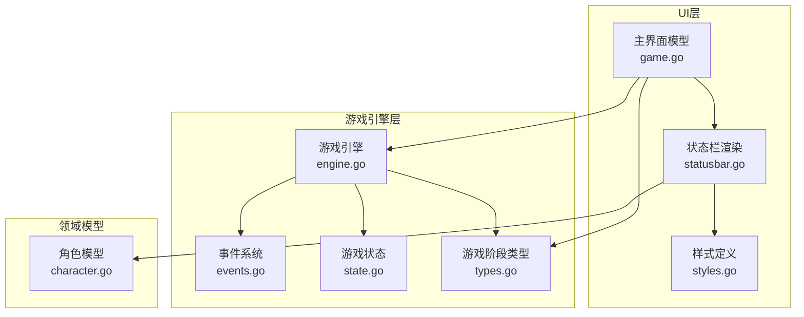
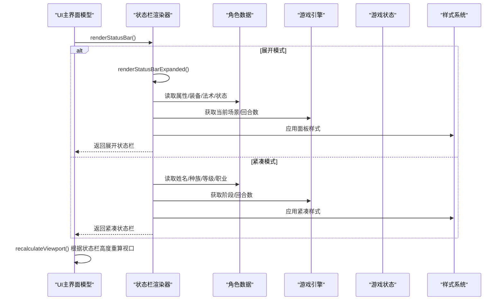
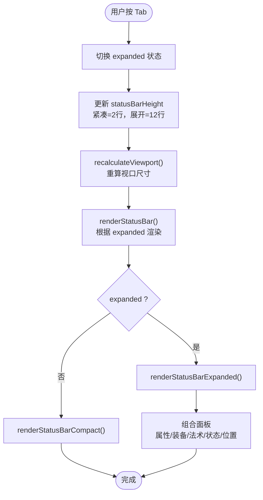
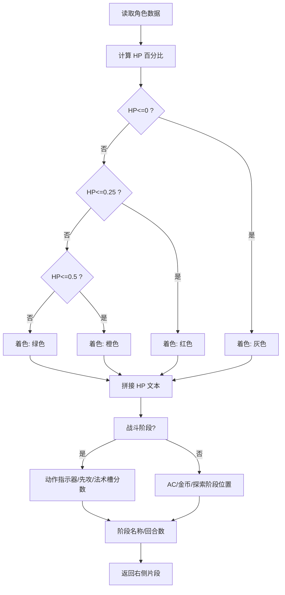
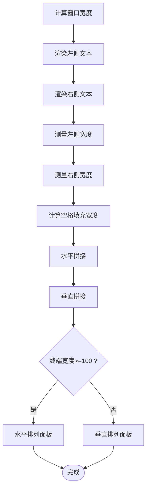
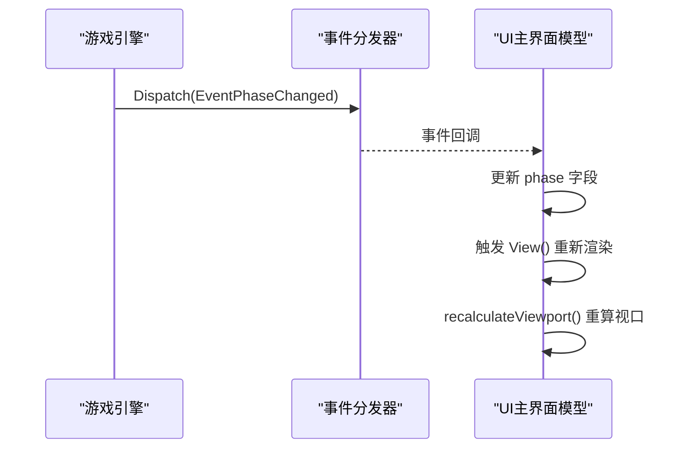
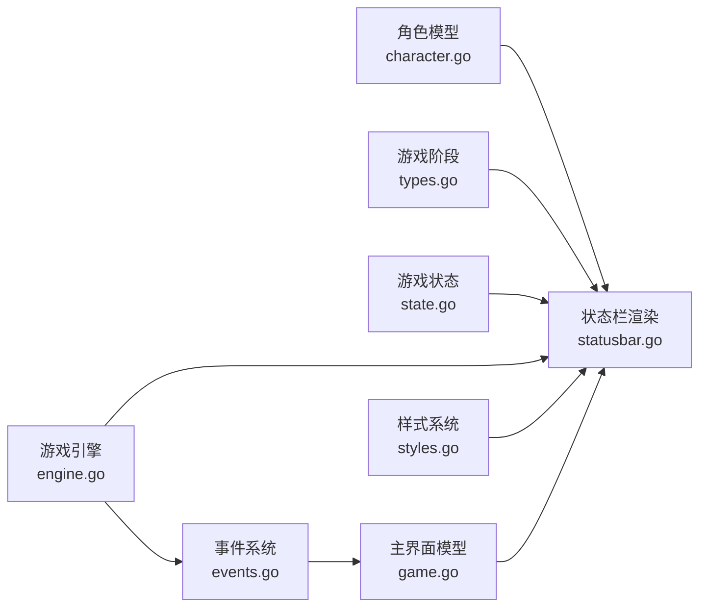

# 状态栏系统

<cite>
**本文档引用的文件**
- [statusbar.go](file://internal/ui/statusbar.go)
- [styles.go](file://internal/ui/styles.go)
- [game.go](file://internal/ui/game.go)
- [events.go](file://internal/game/events.go)
- [engine.go](file://internal/game/engine.go)
- [state.go](file://internal/game/state.go)
- [types.go](file://internal/save/types.go)
- [character.go](file://internal/character/character.go)
</cite>

## 目录
1. [简介](#简介)
2. [项目结构](#项目结构)
3. [核心组件](#核心组件)
4. [架构总览](#架构总览)
5. [详细组件分析](#详细组件分析)
6. [依赖关系分析](#依赖关系分析)
7. [性能考量](#性能考量)
8. [故障排除指南](#故障排除指南)
9. [结论](#结论)
10. [附录](#附录)

## 简介
本文件为 CDND 状态栏系统的技术文档，聚焦于状态栏的设计架构、紧凑/展开模式切换机制、角色状态信息展示逻辑、布局算法、与游戏引擎数据同步机制、样式系统、扩展指南、响应式设计与小屏适配策略，以及与其他 UI 组件的交互协议。

## 项目结构
状态栏系统位于 UI 层，核心文件如下：
- 状态栏渲染与面板：internal/ui/statusbar.go
- 样式定义：internal/ui/styles.go
- 主界面模型与视图：internal/ui/game.go
- 游戏事件系统：internal/game/events.go
- 游戏引擎与状态：internal/game/engine.go、internal/game/state.go
- 游戏阶段类型：internal/save/types.go
- 角色数据模型：internal/character/character.go

图表来源
- [statusbar.go:1-417](file://internal/ui/statusbar.go#L1-L417)
- [styles.go:1-209](file://internal/ui/styles.go#L1-L209)
- [game.go:1-359](file://internal/ui/game.go#L1-L359)
- [events.go:1-244](file://internal/game/events.go#L1-L244)
- [engine.go:1-797](file://internal/game/engine.go#L1-L797)
- [state.go:1-236](file://internal/game/state.go#L1-L236)
- [types.go:1-217](file://internal/save/types.go#L1-L217)
- [character.go:1-223](file://internal/character/character.go#L1-L223)

章节来源
- [statusbar.go:1-417](file://internal/ui/statusbar.go#L1-L417)
- [styles.go:1-209](file://internal/ui/styles.go#L1-L209)
- [game.go:1-359](file://internal/ui/game.go#L1-L359)

## 核心组件
- 状态栏渲染器：负责紧凑模式与展开模式的渲染，以及各面板的组合。
- 样式系统：集中定义颜色、字体、边框、间距等视觉样式。
- 主界面模型：持有窗口尺寸、展开状态、状态栏高度等 UI 状态，并协调视口与输入框。
- 游戏事件系统：提供事件订阅/分发能力，驱动状态栏的刷新。
- 游戏引擎与状态：提供角色、场景、回合、战斗等数据源，驱动状态栏内容更新。
- 游戏阶段类型：统一管理 Phase，影响状态栏显示内容与颜色。

章节来源
- [statusbar.go:12-134](file://internal/ui/statusbar.go#L12-L134)
- [statusbar.go:202-225](file://internal/ui/statusbar.go#L202-L225)
- [styles.go:121-176](file://internal/ui/styles.go#L121-L176)
- [game.go:19-62](file://internal/ui/game.go#L19-L62)
- [events.go:135-204](file://internal/game/events.go#L135-L204)
- [engine.go:22-56](file://internal/game/engine.go#L22-L56)
- [state.go:14-42](file://internal/game/state.go#L14-L42)
- [types.go:11-44](file://internal/save/types.go#L11-L44)

## 架构总览
状态栏系统采用“数据驱动 + 事件驱动”的架构：
- 数据来源：角色 Character、游戏状态 State、当前场景 Scene、回合 TurnCount、阶段 Phase。
- 渲染入口：GameModel.View 调用 renderStatusBar，再根据 expanded 切换紧凑/展开模式。
- 事件驱动：引擎通过事件分发器通知 UI 更新；UI 在 Update 中处理键盘事件（如 Tab 切换）并重算视口。
- 样式统一：GameStyles 集中管理所有 UI 样式，确保一致的视觉体验。

图表来源
- [game.go:284-315](file://internal/ui/game.go#L284-L315)
- [statusbar.go:12-134](file://internal/ui/statusbar.go#L12-L134)
- [statusbar.go:202-225](file://internal/ui/statusbar.go#L202-L225)
- [styles.go:121-176](file://internal/ui/styles.go#L121-L176)
- [engine.go:180-193](file://internal/game/engine.go#L180-L193)
- [state.go:14-42](file://internal/game/state.go#L14-L42)

## 详细组件分析

### 紧凑模式与展开模式切换机制
- 键盘事件：按 Tab 切换 expanded 状态，同时调整 statusBarHeight（紧凑=2行，展开=12行），并重新计算视口。
- 渲染策略：
  - 紧凑模式：左侧显示角色信息，右侧显示 HP、动作指示器（战斗）、先攻、法术槽分数（战斗）、AC（非战斗）、金币（非战斗）、阶段名称、回合数等。
  - 展开模式：顶部为紧凑栏，下方为多个面板（属性、装备、法术、状态、位置/时间），根据终端宽度选择水平或垂直布局。

图表来源
- [game.go:96-112](file://internal/ui/game.go#L96-L112)
- [game.go:253-276](file://internal/ui/game.go#L253-L276)
- [statusbar.go:12-134](file://internal/ui/statusbar.go#L12-L134)
- [statusbar.go:202-225](file://internal/ui/statusbar.go#L202-L225)

章节来源
- [game.go:96-112](file://internal/ui/game.go#L96-L112)
- [game.go:253-276](file://internal/ui/game.go#L253-L276)
- [statusbar.go:12-134](file://internal/ui/statusbar.go#L12-L134)
- [statusbar.go:202-225](file://internal/ui/statusbar.go#L202-L225)

### 角色状态信息展示逻辑
- 生命值（HP）：根据当前/最大值计算百分比，动态着色（绿色→橙色→红色→灰色）。
- 法术槽：仅在战斗阶段显示，取最高两个有槽的环阶，使用 Unicode 分数显示。
- 动作指示器：战斗阶段显示标准动作与附赠动作的使用状态。
- 先攻：根据敏捷调整值正负采用不同颜色。
- AC：非战斗阶段显示。
- 金币：非战斗阶段显示。
- 阶段名称与回合数：阶段名称按阶段着色，回合数显示在非战斗阶段可选。
- 位置：探索阶段显示场景名称（支持缩写）。

图表来源
- [statusbar.go:29-115](file://internal/ui/statusbar.go#L29-L115)
- [statusbar.go:136-142](file://internal/ui/statusbar.go#L136-L142)
- [statusbar.go:144-200](file://internal/ui/statusbar.go#L144-L200)

章节来源
- [statusbar.go:29-115](file://internal/ui/statusbar.go#L29-L115)
- [statusbar.go:136-142](file://internal/ui/statusbar.go#L136-L142)
- [statusbar.go:144-200](file://internal/ui/statusbar.go#L144-L200)

### 布局算法
- 水平对齐：紧凑模式下，左侧与右侧分别渲染后，计算宽度差，插入等宽空格进行居中对齐。
- 动态高度：紧凑=2行，展开=12行，视口高度据此减去相应行数。
- 响应式布局：展开模式下，若终端宽度≥100字符则水平排列面板，否则垂直排列。
- 边距与内边距：统一使用 GameStyles 的边框与内边距，保证面板边界一致性。

图表来源
- [statusbar.go:120-133](file://internal/ui/statusbar.go#L120-L133)
- [statusbar.go:216-224](file://internal/ui/statusbar.go#L216-L224)
- [game.go:253-276](file://internal/ui/game.go#L253-L276)

章节来源
- [statusbar.go:120-133](file://internal/ui/statusbar.go#L120-L133)
- [statusbar.go:216-224](file://internal/ui/statusbar.go#L216-L224)
- [game.go:253-276](file://internal/ui/game.go#L253-L276)

### 与游戏引擎数据的同步机制
- 数据来源：
  - 角色：character.Character（属性、生命值、护甲等级、速度、熟练加值、装备、物品、金币、法术、法术槽、状态效果等）。
  - 状态：game.State（阶段 Phase、回合数 TurnCount、当前场景 CurrentScene、战斗状态 Combat、已游玩时间 PlayedTime 等）。
- 同步方式：
  - 渲染时直接读取引擎状态，无需显式订阅。
  - 阶段变更通过引擎事件分发器通知，UI 在 Update 中更新 phase 并刷新视图。
  - 键盘事件（Tab）触发 UI 状态变更，进而触发重新渲染。

图表来源
- [engine.go:353-357](file://internal/game/engine.go#L353-L357)
- [events.go:171-180](file://internal/game/events.go#L171-L180)
- [game.go:147-161](file://internal/ui/game.go#L147-L161)
- [game.go:253-276](file://internal/ui/game.go#L253-L276)

章节来源
- [engine.go:353-357](file://internal/game/engine.go#L353-L357)
- [events.go:171-180](file://internal/game/events.go#L171-L180)
- [game.go:147-161](file://internal/ui/game.go#L147-L161)
- [game.go:253-276](file://internal/ui/game.go#L253-L276)

### 样式系统
- 调色板：定义主色、辅色、危险色、警告色、强调色、边框色、文字色、背景色等。
- 基础样式：标题、正文、输入框、菜单项、状态面板、骰子结果、通用文本样式。
- GameStyles：状态栏基础样式、面板标题、正负数值、法术槽、位置名、金币文本、状态徽章等。
- 面板样式：统一圆角边框、内边距、边框颜色，确保面板视觉一致性。

章节来源
- [styles.go:5-16](file://internal/ui/styles.go#L5-L16)
- [styles.go:18-99](file://internal/ui/styles.go#L18-L99)
- [styles.go:121-176](file://internal/ui/styles.go#L121-L176)

### 展开面板详解
- 属性面板：显示六大属性值与对应调整值，AC、先攻、速度、熟练加值。
- 装备面板：武器、护甲、金币、背包物品数量。
- 法术面板：施法属性、戏法数量、各级法术槽进度条（Unicode 方块）。
- 状态面板：状态效果列表，无状态时显示提示。
- 位置/时间面板：场景名称、类型、光照、地形、回合数、已游玩时间。

章节来源
- [statusbar.go:227-265](file://internal/ui/statusbar.go#L227-L265)
- [statusbar.go:267-294](file://internal/ui/statusbar.go#L267-L294)
- [statusbar.go:296-351](file://internal/ui/statusbar.go#L296-L351)
- [statusbar.go:353-375](file://internal/ui/statusbar.go#L353-L375)
- [statusbar.go:377-406](file://internal/ui/statusbar.go#L377-L406)

### 响应式设计与小屏适配
- 展开模式下的面板布局：宽度≥100字符时水平排列，否则垂直排列，避免小屏拥挤。
- 紧凑模式：固定2行高度，最大化信息密度。
- 面板统一边框与内边距：在小屏上保持清晰边界与可读性。
- 位置名称缩写：当场景名过长时自动截断并加省略号，提升可读性。

章节来源
- [statusbar.go:216-224](file://internal/ui/statusbar.go#L216-L224)
- [statusbar.go:136-142](file://internal/ui/statusbar.go#L136-L142)
- [game.go:253-276](file://internal/ui/game.go#L253-L276)

### 与其他 UI 组件的交互协议
- 键盘事件：Tab 切换状态栏展开/收起；Enter 提交输入；Esc/ Ctrl+C 退出。
- 视口联动：状态栏高度变化后，重新计算 viewport 高度与宽度，确保输出区域与输入框布局正确。
- 阶段变更：引擎通过事件分发器通知 UI，UI 更新 phase 并刷新视图。

章节来源
- [game.go:96-112](file://internal/ui/game.go#L96-L112)
- [game.go:142-146](file://internal/ui/game.go#L142-L146)
- [engine.go:353-357](file://internal/game/engine.go#L353-L357)

## 依赖关系分析
- 状态栏渲染依赖：
  - 角色模型：读取角色属性、生命值、护甲等级、速度、熟练加值、装备、物品、金币、法术、法术槽、状态效果。
  - 游戏阶段：根据 Phase 控制显示内容与颜色。
  - 引擎状态：读取回合数、当前场景、战斗状态。
  - 样式系统：统一应用 GameStyles。
- UI 模型依赖：
  - 窗口尺寸：根据窗口宽高计算布局。
  - 展开状态：控制状态栏高度与面板布局。
- 事件系统：
  - 阶段变更事件驱动 UI 更新 phase 并刷新视图。

图表来源
- [statusbar.go:1-10](file://internal/ui/statusbar.go#L1-L10)
- [character.go:8-61](file://internal/character/character.go#L8-L61)
- [types.go:11-44](file://internal/save/types.go#L11-L44)
- [state.go:14-42](file://internal/game/state.go#L14-L42)
- [engine.go:180-193](file://internal/game/engine.go#L180-L193)
- [styles.go:121-176](file://internal/ui/styles.go#L121-L176)
- [game.go:19-62](file://internal/ui/game.go#L19-L62)
- [events.go:135-204](file://internal/game/events.go#L135-L204)

章节来源
- [statusbar.go:1-10](file://internal/ui/statusbar.go#L1-L10)
- [character.go:8-61](file://internal/character/character.go#L8-L61)
- [types.go:11-44](file://internal/save/types.go#L11-L44)
- [state.go:14-42](file://internal/game/state.go#L14-L42)
- [engine.go:180-193](file://internal/game/engine.go#L180-L193)
- [styles.go:121-176](file://internal/ui/styles.go#L121-L176)
- [game.go:19-62](file://internal/ui/game.go#L19-L62)
- [events.go:135-204](file://internal/game/events.go#L135-L204)

## 性能考量
- 渲染路径短：状态栏渲染仅在 View 调用时发生，且使用 lipgloss 的 JoinHorizontal/JoinVertical，性能开销可控。
- 数据访问简单：渲染时直接读取引擎状态，避免额外缓存。
- 事件驱动：通过事件分发器减少 UI 主循环中的轮询成本。
- 布局计算轻量：仅涉及字符串拼接与宽度测量，复杂度低。

## 故障排除指南
- 状态栏不随阶段变化：确认引擎是否正确分发 EventPhaseChanged，UI 是否在 Update 中更新 phase 并触发 View 刷新。
- 展开/收起无效：检查 Tab 键事件处理与 statusBarHeight 更新逻辑。
- 面板布局异常：检查窗口尺寸消息与 recalculateViewport 的计算逻辑。
- 颜色/样式不一致：检查 GameStyles 定义与应用是否正确。

章节来源
- [engine.go:353-357](file://internal/game/engine.go#L353-L357)
- [game.go:96-112](file://internal/ui/game.go#L96-L112)
- [game.go:142-146](file://internal/ui/game.go#L142-L146)
- [game.go:253-276](file://internal/ui/game.go#L253-L276)
- [styles.go:121-176](file://internal/ui/styles.go#L121-L176)

## 结论
状态栏系统以简洁高效的渲染与样式体系为核心，结合事件驱动与数据直读的方式，实现了紧凑与展开两种模式的无缝切换，并针对不同阶段与场景提供了丰富的状态信息展示。其响应式布局与小屏适配策略确保了在各种终端环境下的良好体验。通过统一的样式系统与清晰的组件职责划分，状态栏具备良好的可维护性与扩展性。

## 附录

### 扩展指南
- 自定义字段添加
  - 在 renderStatusBarCompact 或面板渲染函数中添加所需字段读取与显示逻辑。
  - 若需跨阶段显示，请根据 Phase 条件分支控制。
  - 使用 GameStyles 保持视觉一致性。
- 样式定制
  - 修改 GameStyles 中的样式定义，或新增样式变量，以满足特定需求。
  - 面板边框与内边距建议保持统一，避免视觉割裂。
- 事件驱动刷新
  - 如需更精细的刷新控制，可在引擎中注册事件处理器，将事件映射到 UI 的局部刷新逻辑。
- 响应式优化
  - 针对极窄终端，可进一步优化面板最小宽度与文本截断策略。

章节来源
- [statusbar.go:12-134](file://internal/ui/statusbar.go#L12-L134)
- [statusbar.go:202-225](file://internal/ui/statusbar.go#L202-L225)
- [styles.go:121-176](file://internal/ui/styles.go#L121-L176)
- [engine.go:389-392](file://internal/game/engine.go#L389-L392)