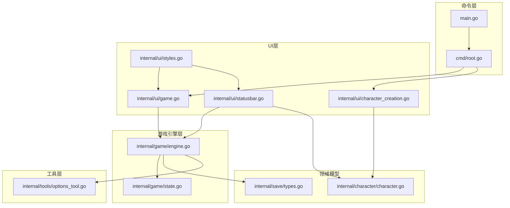
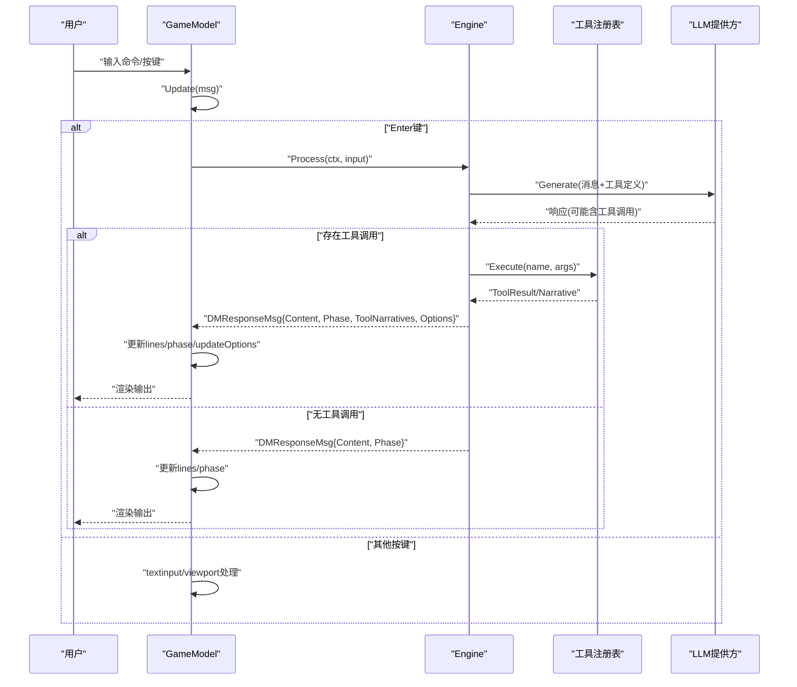
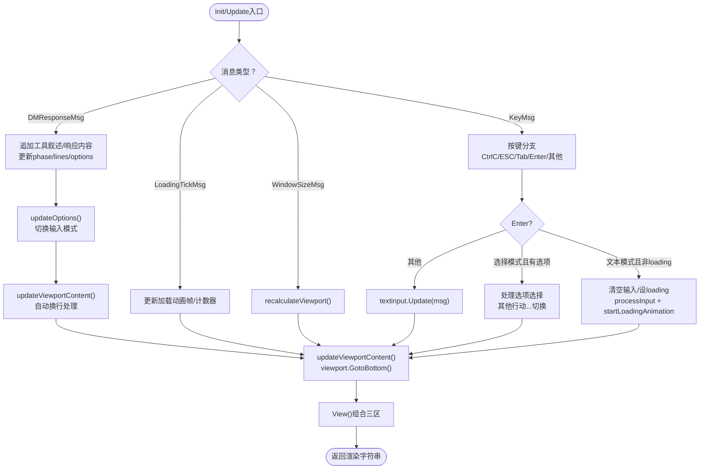
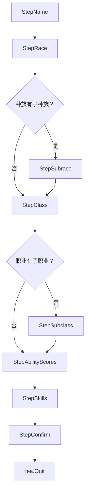
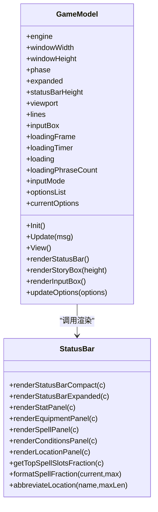
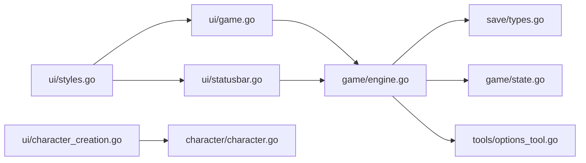

# 用户界面

<cite>
**本文引用的文件**
- [internal/ui/game.go](file://internal/ui/game.go)
- [internal/ui/character_creation.go](file://internal/ui/character_creation.go)
- [internal/ui/statusbar.go](file://internal/ui/statusbar.go)
- [internal/ui/styles.go](file://internal/ui/styles.go)
- [internal/game/engine.go](file://internal/game/engine.go)
- [internal/game/state.go](file://internal/game/state.go)
- [internal/character/character.go](file://internal/character/character.go)
- [internal/save/types.go](file://internal/save/types.go)
- [internal/tools/options_tool.go](file://internal/tools/options_tool.go)
- [cmd/root.go](file://cmd/root.go)
- [main.go](file://main.go)
</cite>

## 目录
1. [简介](#简介)
2. [项目结构](#项目结构)
3. [核心组件](#核心组件)
4. [架构总览](#架构总览)
5. [详细组件分析](#详细组件分析)
6. [依赖分析](#依赖分析)
7. [性能考量](#性能考量)
8. [故障排查指南](#故障排查指南)
9. [结论](#结论)
10. [附录](#附录)

## 简介
本文件面向CDND的用户界面系统，围绕基于Bubble Tea框架的TUI进行技术文档梳理。重点覆盖：
- 游戏主界面的布局、组件管理与事件处理
- 角色创建界面的交互流程与数据绑定
- 界面样式系统（颜色主题、字体与响应式布局）
- 用户输入处理与命令解析（含工具调用循环）
- 界面定制与扩展指南（样式、新组件）
- 无障碍与用户体验优化建议
- UI与游戏引擎的数据同步机制
- UI开发规范与最佳实践

## 项目结构
UI相关代码集中在internal/ui目录，配合internal/game与internal/character等模块实现TUI与游戏逻辑的解耦与协作。命令入口位于cmd与main.go，负责启动CLI与初始化配置。

**图表来源**
- [main.go:1-8](file://main.go#L1-L8)
- [cmd/root.go:1-95](file://cmd/root.go#L1-L95)
- [internal/ui/game.go:1-534](file://internal/ui/game.go#L1-L534)
- [internal/ui/character_creation.go:1-537](file://internal/ui/character_creation.go#L1-L537)
- [internal/ui/statusbar.go:1-417](file://internal/ui/statusbar.go#L1-L417)
- [internal/ui/styles.go:1-209](file://internal/ui/styles.go#L1-L209)
- [internal/game/engine.go:1-793](file://internal/game/engine.go#L1-L793)
- [internal/game/state.go:1-254](file://internal/game/state.go#L1-L254)
- [internal/character/character.go:1-223](file://internal/character/character.go#L1-L223)
- [internal/save/types.go:1-217](file://internal/save/types.go#L1-L217)
- [internal/tools/options_tool.go:1-67](file://internal/tools/options_tool.go#L1-L67)

**章节来源**
- [main.go:1-8](file://main.go#L1-L8)
- [cmd/root.go:1-95](file://cmd/root.go#L1-L95)

## 核心组件
- 游戏主界面模型（GameModel）：负责渲染状态栏、剧情输出区、输入框；处理键盘事件、窗口尺寸变化、加载动画；与游戏引擎交互以执行工具调用循环。
- 角色创建模型（CharacterCreationModel）：实现角色创建的多步骤向导，包含名称、种族、子种族、职业、子职业、属性分配、技能选择与确认。
- 状态栏渲染（renderStatusBar）：根据角色与阶段动态展示HP、AC、先攻、法术槽、金币、位置、回合数等信息，并支持展开/收起。
- 样式系统（styles.go）：集中定义颜色主题、字体与边框样式，提供统一的渲染风格与可扩展的样式接口。
- 游戏引擎（engine.go）：封装LLM调用、工具注册与执行、事件分发、状态管理与存档；对外暴露Process以驱动TUI更新。
- 选项列表系统：支持动态选项列表展示与键盘导航，提供"其他行动..."切换功能。
- **文本自动换行系统**：基于lipgloss的自动换行功能，确保长文本在视口宽度内正确换行显示。

**章节来源**
- [internal/ui/game.go:61-87](file://internal/ui/game.go#L61-L87)
- [internal/ui/character_creation.go:51-72](file://internal/ui/character_creation.go#L51-L72)
- [internal/ui/statusbar.go:12-134](file://internal/ui/statusbar.go#L12-L134)
- [internal/ui/styles.go:18-176](file://internal/ui/styles.go#L18-L176)
- [internal/game/engine.go:22-56](file://internal/game/engine.go#L22-L56)
- [internal/tools/options_tool.go:7-19](file://internal/tools/options_tool.go#L7-L19)

## 架构总览
TUI采用Bubble Tea的Model-View-Update模式，UI模型持有对游戏引擎的引用，通过消息驱动更新视图。引擎负责业务规则、LLM与工具链，UI仅关注呈现与交互。

**图表来源**
- [internal/ui/game.go:154-278](file://internal/ui/game.go#L154-L278)
- [internal/ui/game.go:332-346](file://internal/ui/game.go#L332-L346)
- [internal/game/engine.go:196-319](file://internal/game/engine.go#L196-L319)

## 详细组件分析

### 游戏主界面（GameModel）
- 布局与组件
  - 状态栏：紧凑/展开双态，动态展示角色与阶段信息。
  - 剧情输出区：基于viewport的滚动容器，支持水平步进。
  - 输入框：支持两种输入模式的动态切换。
- 事件处理
  - 键盘：Ctrl+C/ESC退出；Tab切换状态栏展开；Enter提交输入；其他键交由textinput处理。
  - 窗口尺寸：动态重算viewport与输入框宽度。
  - 加载动画：tea.Tick驱动Braille旋转器与进度点动画，配合文案池轮换。
- 数据流
  - Init：新游戏时显示欢迎语并触发异步LLM对话；载入存档时恢复历史。
  - Update：处理DMResponseMsg与LoadingTickMsg，更新lines与phase，滚动到底部。
  - View：组合状态栏、输出区、输入框三部分。
- 与引擎交互
  - processInput通过Engine.Process发起工具调用循环，接收DMResponseMsg更新UI。
- **文本换行优化**
  - 基于lipgloss的自动换行功能，确保长文本在视口宽度内正确换行。
  - 通过`updateViewportContent`函数实现逐行换行处理。
  - 当视口宽度不足时，自动调整内容显示，提升可读性。

**更新** 新增基于lipgloss的自动换行功能，显著改善长文本的可读性和用户体验。

**图表来源**
- [internal/ui/game.go:154-278](file://internal/ui/game.go#L154-L278)
- [internal/ui/game.go:364-384](file://internal/ui/game.go#L364-L384)
- [internal/ui/game.go:424-447](file://internal/ui/game.go#L424-L447)

**章节来源**
- [internal/ui/game.go:61-87](file://internal/ui/game.go#L61-L87)
- [internal/ui/game.go:154-278](file://internal/ui/game.go#L154-L278)
- [internal/ui/game.go:364-384](file://internal/ui/game.go#L364-L384)
- [internal/ui/game.go:424-447](file://internal/ui/game.go#L424-L447)

### 文本自动换行系统
- **实现原理**
  - 使用`lipgloss.NewStyle().Width(viewportWidth)`创建宽度样式。
  - 对每一行应用宽度样式，lipgloss自动处理换行逻辑。
  - 将换行后的行数组合并为最终内容。
- **性能优化**
  - 仅在视口宽度大于0时执行换行处理。
  - 宽度不足时直接连接文本，避免不必要的处理。
  - 使用`strings.Builder`优化字符串拼接性能。
- **用户体验提升**
  - 长文本自动适应视口宽度，无需水平滚动。
  - 保持原有格式和样式，不影响视觉效果。
  - 在窄终端上提供更好的可读性。

**新增** 基于lipgloss的自动换行功能显著改善了文本显示质量。

**章节来源**
- [internal/ui/game.go:424-447](file://internal/ui/game.go#L424-L447)

### 选项列表系统
- 选项数据结构
  - optionItem：字符串包装类型，实现list.Item接口。
  - optionDelegate：自定义委托，支持高度控制、样式渲染和键盘导航。
- 交互流程
  - Enter键：选择当前选项或切换到文本输入模式。
  - 方向键：在选项列表中导航，支持翻页。
  - ESC键：在有可用选项时切换到文本输入模式。
- 渲染特性
  - 数字编号前缀显示选项序号。
  - 选中项使用高亮样式和箭头指示。
  - 支持大量选项的翻页浏览。

**新增** 选项列表系统为用户提供了更直观的命令选择方式。

**章节来源**
- [internal/ui/game.go:31-58](file://internal/ui/game.go#L31-L58)
- [internal/ui/game.go:98-121](file://internal/ui/game.go#L98-L121)
- [internal/ui/game.go:192-232](file://internal/ui/game.go#L192-L232)
- [internal/ui/game.go:364-384](file://internal/ui/game.go#L364-L384)

### 输入模式切换机制
- 模式定义
  - inputModeText：标准文本输入模式。
  - inputModeSelect：选项列表选择模式。
- 切换条件
  - 引擎返回Options时自动切换到选择模式。
  - ESC键在有选项时切换到文本模式。
  - Enter键在选择模式下选择选项或切换到文本模式。
- 视觉反馈
  - 选择模式下输入框高度增加，显示选项列表。
  - 文本模式下输入框高度减少，显示标准输入框。

**新增** 动态输入模式切换提升了用户交互效率。

**章节来源**
- [internal/ui/game.go:22-26](file://internal/ui/game.go#L22-L26)
- [internal/ui/game.go:144-151](file://internal/ui/game.go#L144-L151)
- [internal/ui/game.go:171-179](file://internal/ui/game.go#L171-L179)
- [internal/ui/game.go:192-212](file://internal/ui/game.go#L192-L212)

### 角色创建界面（CharacterCreationModel）
- 步骤与数据
  - 步骤：名称、种族、子种族、职业、子职业、属性分配、技能选择、确认。
  - 数据：当前步骤、光标、可用选项、属性点、技能集合等。
- 交互流程
  - Enter键推进步骤；上下方向键移动光标；名称输入由textinput处理。
  - 到达属性分配时初始化基础属性并应用种族加成；到达技能选择时列出所有技能并支持光标导航。
  - 最终确认步骤生成角色对象（含HP上限、属性修正等）。
- 渲染
  - 标题、进度圆点、当前步骤内容、错误提示等，均通过CreationStyles统一风格。

**图表来源**
- [internal/ui/character_creation.go:16-49](file://internal/ui/character_creation.go#L16-L49)
- [internal/ui/character_creation.go:140-202](file://internal/ui/character_creation.go#L140-L202)
- [internal/ui/character_creation.go:231-264](file://internal/ui/character_creation.go#L231-L264)

**章节来源**
- [internal/ui/character_creation.go:51-72](file://internal/ui/character_creation.go#L51-L72)
- [internal/ui/character_creation.go:95-138](file://internal/ui/character_creation.go#L95-L138)
- [internal/ui/character_creation.go:266-486](file://internal/ui/character_creation.go#L266-L486)
- [internal/ui/character_creation.go:523-537](file://internal/ui/character_creation.go#L523-L537)

### 状态栏渲染（renderStatusBar）
- 紧凑模式：左侧角色信息，右侧按阶段展示不同指标（HP、动作/先攻/法术槽、AC、位置、金币、阶段、回合）。
- 展开模式：在紧凑基础上叠加多个面板（属性、装备、法术、状态、位置/时间），根据终端宽度选择水平或垂直布局。
- 动态缩写与分数：位置名缩写、法术槽分数使用Unicode字符表示。

**图表来源**
- [internal/ui/game.go:61-87](file://internal/ui/game.go#L61-L87)
- [internal/ui/statusbar.go:12-134](file://internal/ui/statusbar.go#L12-L134)
- [internal/ui/statusbar.go:202-225](file://internal/ui/statusbar.go#L202-L225)
- [internal/ui/statusbar.go:227-406](file://internal/ui/statusbar.go#L227-L406)

**章节来源**
- [internal/ui/statusbar.go:12-134](file://internal/ui/statusbar.go#L12-L134)
- [internal/ui/statusbar.go:202-406](file://internal/ui/statusbar.go#L202-L406)

### 样式系统（styles.go）
- 调色板：定义主色、辅色、危险色、强调色、边框色、文本色、背景色等。
- 基础样式：标题、统计、叙述区、输入区、菜单、状态面板、骰子结果、通用文本、游戏元素等。
- GameStyles：统一的状态栏、边框盒、输入框、高亮、面板标题、正负数值、法术槽、位置名、金币、状态徽章等。
- 辅助函数：FormatDiceRoll、FormatNarration、FormatPlayerAction、FormatCombat等，便于在UI中格式化文本。

**章节来源**
- [internal/ui/styles.go:5-176](file://internal/ui/styles.go#L5-L176)
- [internal/ui/styles.go:178-209](file://internal/ui/styles.go#L178-L209)

### 与游戏引擎的数据同步
- UI通过Engine.GetState()与Engine.GetCharacter()读取当前角色与状态；在Update中接收DMResponseMsg更新lines与phase。
- Engine.Process执行工具调用循环，将工具执行的叙述与结果注入历史，UI据此刷新输出。
- 状态栏根据GamePhase与角色属性动态展示不同信息，确保UI与引擎状态一致。
- 选项列表通过Engine.GetState().GetCurrentOptions()获取当前可用选项。

**更新** 新增选项列表系统与动态切换功能。

**章节来源**
- [internal/ui/game.go:247-263](file://internal/ui/game.go#L247-L263)
- [internal/ui/game.go:332-346](file://internal/ui/game.go#L332-L346)
- [internal/game/engine.go:196-319](file://internal/game/engine.go#L196-L319)
- [internal/game/state.go:229-242](file://internal/game/state.go#L229-L242)

## 依赖分析
- UI层依赖Bubble Tea（tea）与lipgloss进行渲染；依赖internal/game与internal/save进行状态读取与消息传递。
- 游戏引擎依赖工具注册表、规则引擎、世界管理器、LLM提供方与存档管理器；对外暴露Process与事件分发。
- 角色模型与存档类型定义清晰，便于UI与引擎间的数据交换。
- 选项工具提供动态选项设置能力，支持UI的智能命令选择。

**图表来源**
- [internal/ui/game.go:1-17](file://internal/ui/game.go#L1-L17)
- [internal/ui/statusbar.go:1-10](file://internal/ui/statusbar.go#L1-L10)
- [internal/ui/character_creation.go:1-11](file://internal/ui/character_creation.go#L1-L11)
- [internal/game/engine.go:1-33](file://internal/game/engine.go#L1-L33)
- [internal/game/state.go:1-11](file://internal/game/state.go#L1-L11)
- [internal/character/character.go:1-6](file://internal/character/character.go#L1-L6)
- [internal/save/types.go:1-9](file://internal/save/types.go#L1-L9)
- [internal/tools/options_tool.go:1-6](file://internal/tools/options_tool.go#L1-L6)

**章节来源**
- [internal/ui/game.go:1-17](file://internal/ui/game.go#L1-L17)
- [internal/ui/statusbar.go:1-10](file://internal/ui/statusbar.go#L1-L10)
- [internal/ui/character_creation.go:1-11](file://internal/ui/character_creation.go#L1-L11)
- [internal/game/engine.go:1-33](file://internal/game/engine.go#L1-L33)
- [internal/game/state.go:1-11](file://internal/game/state.go#L1-L11)
- [internal/character/character.go:1-6](file://internal/character/character.go#L1-L6)
- [internal/save/types.go:1-9](file://internal/save/types.go#L1-L9)
- [internal/tools/options_tool.go:1-6](file://internal/tools/options_tool.go#L1-L6)

## 性能考量
- 渲染优化
  - viewport按需重算尺寸，避免频繁全量重绘。
  - 文本拼接使用strings.Builder，减少内存分配。
  - **自动换行优化**：仅在视口宽度大于0时执行换行处理，避免不必要的计算。
- 事件与动画
  - 加载动画使用tea.Tick定时器，帧率可控，避免阻塞UI线程。
- 数据同步
  - UI仅在收到消息后更新，避免轮询；引擎侧聚合工具调用结果再一次性反馈。
- 字体与颜色
  - lipgloss样式复用，减少重复构造；颜色主题集中管理，便于批量调整。
- 选项列表优化
  - 使用自定义委托减少渲染开销。
  - 支持翻页浏览大量选项。

## 故障排查指南
- UI无法聚焦输入框
  - 检查NewGameModel初始化时是否调用Focus；确认Update中是否将未处理的消息传给textinput.Update。
- 状态栏显示异常
  - 确认GamePhase与角色属性是否为空；检查renderStatusBarCompact/Expanded的分支逻辑。
- 加载动画不更新
  - 确认startLoadingAnimation返回的LoadingTickMsg是否被Update接收；检查loading标志位切换。
- 工具调用无响应
  - 检查Engine.Process是否返回DMResponseMsg；确认工具注册是否正确；查看ToolCall执行结果与Narrative。
- 存档恢复后UI不刷新
  - 确认restoreHistory是否更新phase与lines并调用updateViewportContent与GotoBottom。
- 选项列表不显示
  - 检查引擎是否正确调用SetOptionsTool设置选项；确认updateOptions方法被调用。
- 输入模式切换异常
  - 确认ESC键在有选项时能正常切换到文本模式；检查Enter键在选择模式下的处理逻辑。
- **文本换行问题**
  - 检查viewportWidth是否正确计算；确认lipgloss样式宽度设置是否生效。
  - 确认updateViewportContent函数是否在正确的时机被调用。

**章节来源**
- [internal/ui/game.go:89-121](file://internal/ui/game.go#L89-L121)
- [internal/ui/game.go:171-179](file://internal/ui/game.go#L171-L179)
- [internal/ui/game.go:247-263](file://internal/ui/game.go#L247-L263)
- [internal/ui/game.go:332-346](file://internal/ui/game.go#L332-L346)
- [internal/ui/game.go:294-321](file://internal/ui/game.go#L294-L321)
- [internal/ui/game.go:364-384](file://internal/ui/game.go#L364-L384)
- [internal/ui/game.go:192-212](file://internal/ui/game.go#L192-L212)
- [internal/ui/game.go:424-447](file://internal/ui/game.go#L424-L447)

## 结论
CDND的UI系统以Bubble Tea为核心，实现了清晰的职责分离：UI专注呈现与交互，引擎专注业务与数据。通过统一的样式系统与工具调用循环，既保证了良好的用户体验，也为后续扩展提供了稳定基础。新增的双输入模式、选项列表系统、动态切换功能和**基于lipgloss的自动换行功能**进一步提升了用户交互效率和文本可读性。建议在新增界面组件时遵循现有样式与消息契约，确保一致性与可维护性。

## 附录

### 用户输入处理与命令解析
- Enter键：提交输入，触发processInput与加载动画；loading期间忽略输入。在选择模式下处理选项选择或切换到文本模式。
- Tab键：切换状态栏展开/收起，动态调整viewport高度。
- Ctrl+C/ESC：退出程序。在有可用选项时，ESC键切换到文本输入模式。
- 方向键：在选择模式下导航选项列表，支持翻页。
- 其他按键：交由textinput处理，如编辑文本、删除、复制粘贴等。

**更新** 新增选择模式下的键盘导航和动态切换功能。

**章节来源**
- [internal/ui/game.go:164-232](file://internal/ui/game.go#L164-L232)

### 界面定制与扩展指南
- 自定义样式
  - 在styles.go中扩展或修改GameStyles、CreationStyles中的样式定义；通过FormatDiceRoll/FormatNarration等辅助函数统一格式。
- 新界面组件
  - 新增Model需实现Init/Update/View方法；在root命令中注册启动逻辑；通过消息与引擎交互。
- 响应式布局
  - 根据windowWidth选择面板布局（水平/垂直）；viewport宽度减去边距与padding，确保内容适配。
- 选项列表扩展
  - 可以通过实现list.Item接口创建自定义选项类型。
  - 使用自定义delegate支持复杂的渲染需求。
- **文本换行定制**
  - 可以通过修改`updateViewportContent`函数调整换行策略。
  - 支持自定义宽度样式和换行行为。

**更新** 新增选项列表系统的扩展指南和文本换行定制指南。

**章节来源**
- [internal/ui/styles.go:121-176](file://internal/ui/styles.go#L121-L176)
- [internal/ui/statusbar.go:216-224](file://internal/ui/statusbar.go#L216-L224)
- [internal/ui/game.go:31-58](file://internal/ui/game.go#L31-L58)
- [internal/ui/game.go:424-447](file://internal/ui/game.go#L424-L447)

### 无障碍与用户体验优化
- 键盘友好：Tab切换、Enter确认、方向键导航；保持焦点明确。
- 视觉层次：使用颜色与粗体区分重要信息；状态栏按阶段展示关键指标。
- 反馈及时：加载动画与文案池提升等待体验；工具执行后提供叙述性反馈。
- 可读性：viewport滚动与分隔线增强阅读体验；**长文本自动换行提升可读性**。
- 选项导航：数字编号和箭头指示提升选项列表的可发现性。
- 模式切换：清晰的视觉反馈帮助用户理解当前输入模式。

### 开发规范与最佳实践
- Model职责单一：UI模型只负责渲染与事件；业务逻辑在引擎层。
- 消息契约：统一消息类型（如DMResponseMsg、LoadingTickMsg），便于测试与扩展。
- 样式集中：所有UI文本样式集中于styles.go，便于主题切换与一致性维护。
- 数据绑定：角色创建模型通过光标与可用选项驱动渲染，避免硬编码。
- 错误处理：UI对引擎错误进行捕获并显示，避免崩溃；工具执行错误通过Narrative反馈。
- 选项管理：通过SetOptionsTool提供动态选项设置，支持智能命令选择。
- 模式切换：合理使用inputMode常量，确保模式切换的一致性和可预测性。
- **文本处理**：利用lipgloss的自动换行功能提升文本可读性，避免手动换行逻辑。
- **性能优化**：在视口宽度不足时跳过换行处理，减少不必要的计算开销。