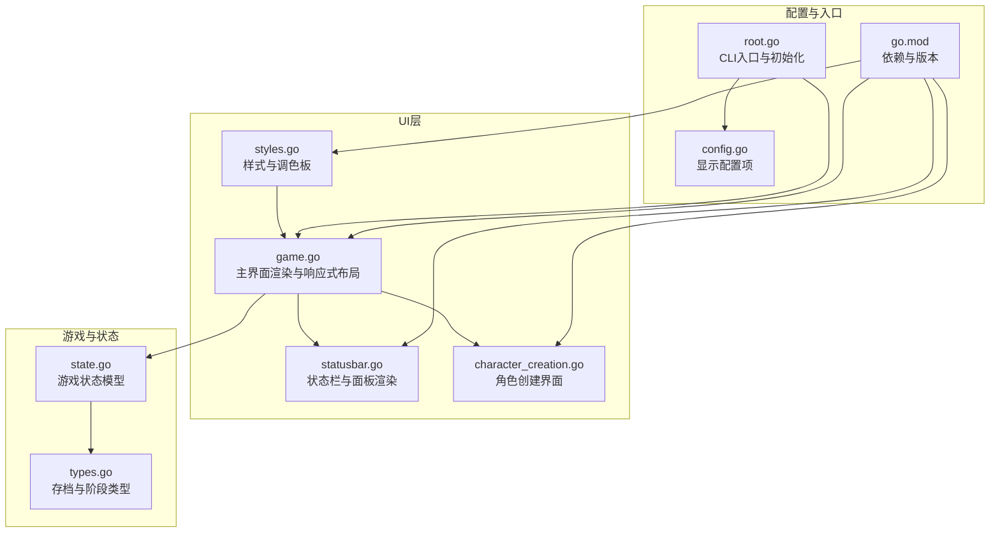
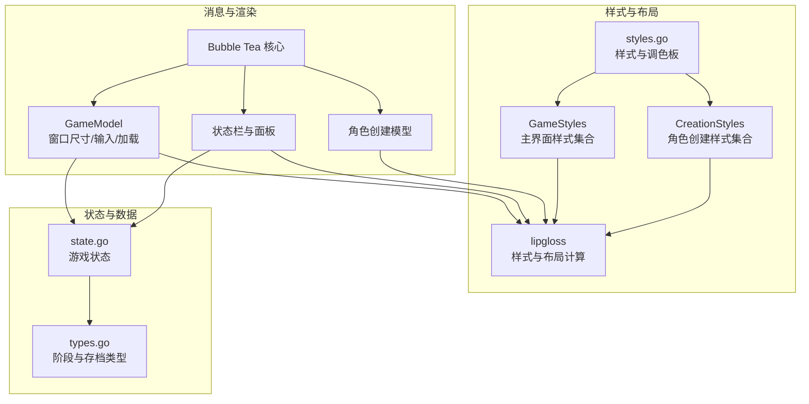
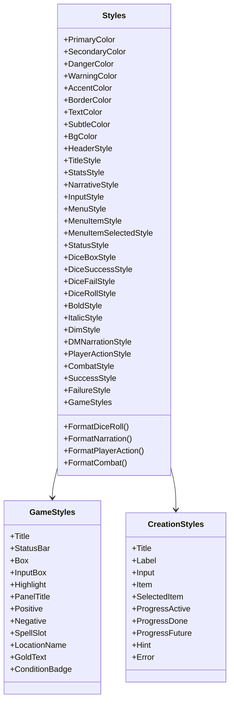
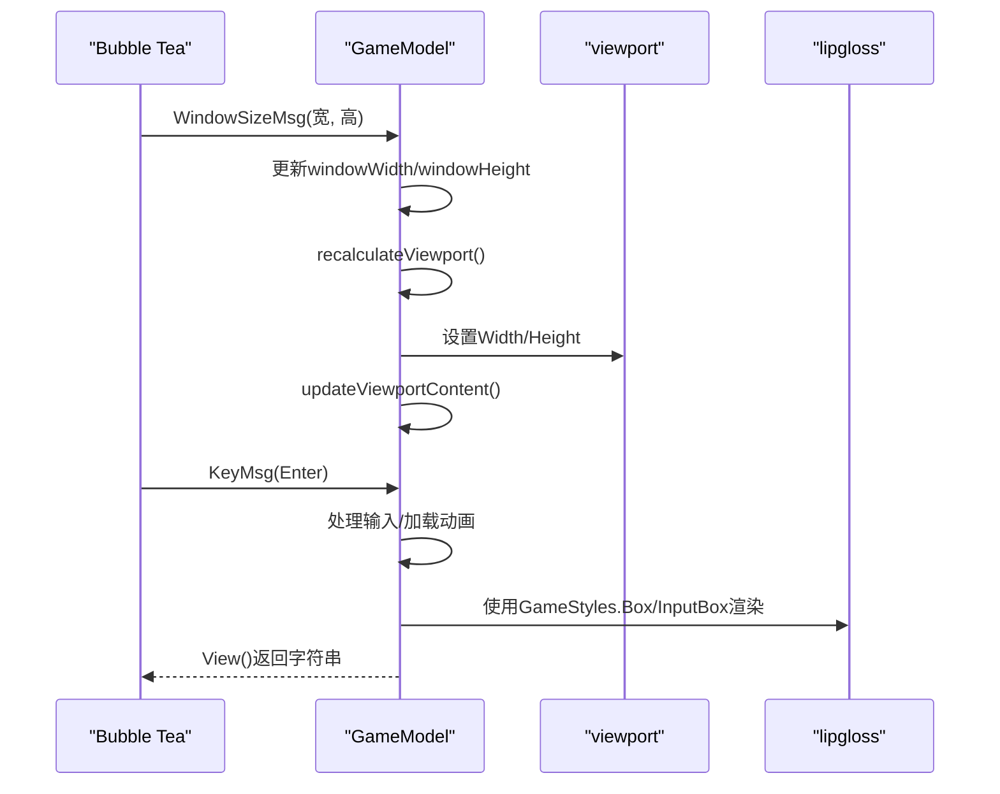
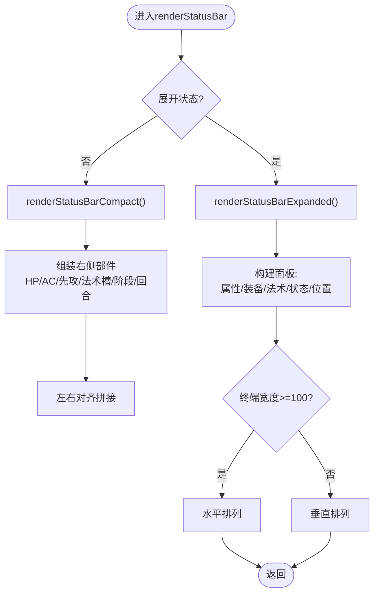
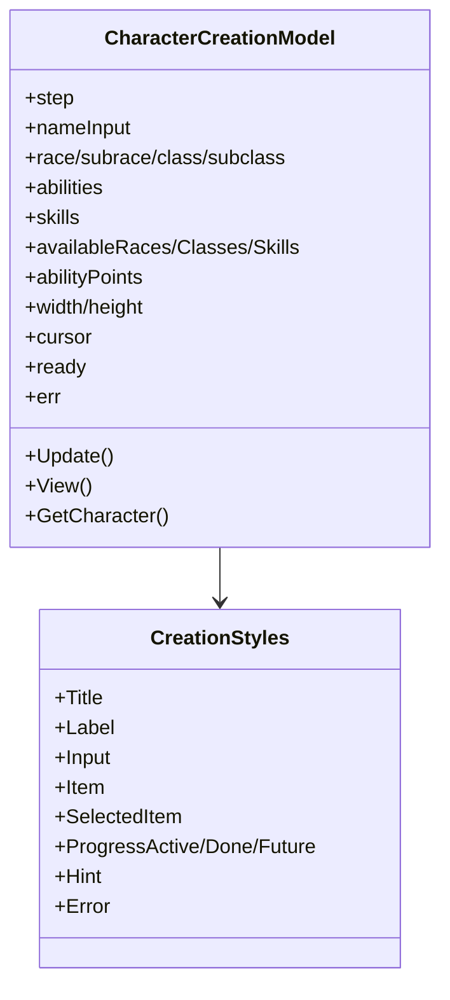
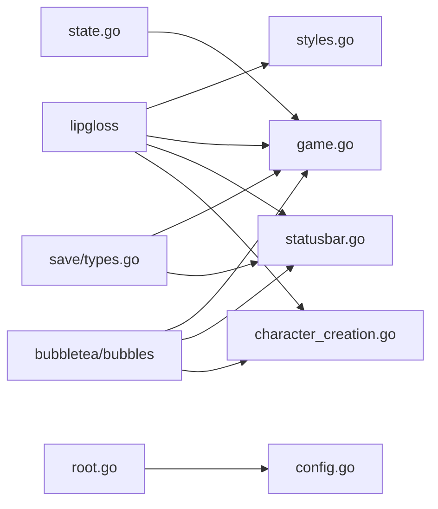

# 界面样式与主题

<cite>
**本文引用的文件**
- [styles.go](file://internal/ui/styles.go)
- [game.go](file://internal/ui/game.go)
- [statusbar.go](file://internal/ui/statusbar.go)
- [character_creation.go](file://internal/ui/character_creation.go)
- [root.go](file://cmd/root.go)
- [config.go](file://internal/config/config.go)
- [types.go](file://internal/save/types.go)
- [state.go](file://internal/game/state.go)
- [go.mod](file://go.mod)
</cite>

## 目录
1. [简介](#简介)
2. [项目结构](#项目结构)
3. [核心组件](#核心组件)
4. [架构总览](#架构总览)
5. [详细组件分析](#详细组件分析)
6. [依赖分析](#依赖分析)
7. [性能考量](#性能考量)
8. [故障排查指南](#故障排查指南)
9. [结论](#结论)
10. [附录](#附录)

## 简介
本文件面向CDND项目的界面样式与主题系统，围绕基于Bubble Tea的终端UI进行技术文档整理。重点涵盖：
- 样式定义与组织方式（调色板、基础样式、游戏专用样式）
- 主题切换与动态样式应用（当前以深色主题为主，未见显式主题切换逻辑）
- 颜色方案设计（D&D主题色彩、对比度与可访问性）
- 字体与排版系统（字符集支持、字号与文本渲染优化）
- 样式组件实现（边框、背景、装饰元素）
- 响应式样式（窗口尺寸适配与布局调整）
- 自定义样式开发指南（新增样式、主题扩展、品牌定制）
- 跨平台兼容性与终端特性检测
- 性能优化策略与缓存机制
- 样式与游戏内容的视觉映射关系

## 项目结构
UI样式与主题相关的核心代码集中在internal/ui包内，配合游戏状态与配置模块共同完成渲染与交互。

**图表来源**
- [styles.go:1-209](file://internal/ui/styles.go#L1-L209)
- [game.go:1-359](file://internal/ui/game.go#L1-L359)
- [statusbar.go:1-417](file://internal/ui/statusbar.go#L1-L417)
- [character_creation.go:1-537](file://internal/ui/character_creation.go#L1-L537)
- [state.go:1-236](file://internal/game/state.go#L1-L236)
- [types.go:1-217](file://internal/save/types.go#L1-L217)
- [root.go:1-95](file://cmd/root.go#L1-L95)
- [config.go:1-54](file://internal/config/config.go#L1-L54)
- [go.mod:1-55](file://go.mod#L1-L55)

**章节来源**
- [styles.go:1-209](file://internal/ui/styles.go#L1-L209)
- [game.go:1-359](file://internal/ui/game.go#L1-L359)
- [statusbar.go:1-417](file://internal/ui/statusbar.go#L1-L417)
- [character_creation.go:1-537](file://internal/ui/character_creation.go#L1-L537)
- [root.go:1-95](file://cmd/root.go#L1-L95)
- [config.go:1-54](file://internal/config/config.go#L1-L54)
- [types.go:1-217](file://internal/save/types.go#L1-L217)
- [state.go:1-236](file://internal/game/state.go#L1-L236)
- [go.mod:1-55](file://go.mod#L1-L55)

## 核心组件
- 调色板与基础样式：集中于styles.go，定义主色、辅色、危险/警告色、文本色、背景色及边框色；提供标题、统计、叙述、输入、菜单、状态面板、骰子结果、通用文本样式以及GameStyles集合。
- 主界面渲染：game.go负责窗口尺寸消息处理、视口高度/宽度计算、输入框与加载动画、故事输出区域渲染。
- 状态栏与面板：statusbar.go实现紧凑与展开两种状态栏布局，包含属性、装备、法术、状态、位置/时间面板，并根据终端宽度进行水平/垂直布局。
- 角色创建界面：character_creation.go定义角色创建流程与对应样式集合CreationStyles。
- 配置与显示：config.go中的DisplayConfig包含颜色输出开关、打字机效果等显示选项；根命令root.go负责配置初始化。
- 游戏状态：state.go与save/types.go定义游戏阶段、回合、战斗状态等，支撑UI渲染决策。

**章节来源**
- [styles.go:5-176](file://internal/ui/styles.go#L5-L176)
- [game.go:19-322](file://internal/ui/game.go#L19-L322)
- [statusbar.go:12-417](file://internal/ui/statusbar.go#L12-L417)
- [character_creation.go:498-522](file://internal/ui/character_creation.go#L498-L522)
- [config.go:39-45](file://internal/config/config.go#L39-L45)
- [root.go:31-37](file://cmd/root.go#L31-L37)
- [state.go:13-42](file://internal/game/state.go#L13-L42)
- [types.go:11-44](file://internal/save/types.go#L11-L44)

## 架构总览
样式系统采用“样式定义—组件渲染—响应式布局”的分层架构。Bubble Tea负责消息循环与渲染调度，lipgloss负责样式与布局计算，GameStyles与CreationStyles分别服务于主界面与角色创建界面。

**图表来源**
- [game.go:84-175](file://internal/ui/game.go#L84-L175)
- [statusbar.go:303-358](file://internal/ui/statusbar.go#L303-L358)
- [character_creation.go:95-138](file://internal/ui/character_creation.go#L95-L138)
- [styles.go:121-175](file://internal/ui/styles.go#L121-L175)
- [state.go:13-42](file://internal/game/state.go#L13-L42)
- [types.go:11-44](file://internal/save/types.go#L11-L44)

## 详细组件分析

### 样式定义与主题
- 调色板：定义主色、辅色、危险色、警告色、强调色、边框色、文本色、次级色与背景色，形成统一的D&D主题色彩体系。
- 基础样式：标题、统计、叙述、输入、菜单、状态面板、骰子结果、通用文本样式，满足不同UI区域的视觉需求。
- GameStyles：主界面样式集合，包含标题、状态栏、盒子容器、输入框、高亮、面板标题、正负反馈、法术槽、地点名、金币、条件徽章等，统一主界面视觉风格。
- CreationStyles：角色创建界面样式集合，包含标题、标签、输入、条目、选中条目、进度、提示、错误等，确保创建流程清晰易用。
- 文本格式化函数：FormatDiceRoll、FormatNarration、FormatPlayerAction、FormatCombat，将游戏内容映射到特定样式，增强可读性与辨识度。

**图表来源**
- [styles.go:5-176](file://internal/ui/styles.go#L5-L176)

**章节来源**
- [styles.go:5-176](file://internal/ui/styles.go#L5-L176)

### 主界面渲染与响应式布局
- 窗口尺寸消息：监听WindowSizeMsg，更新windowWidth/windowHeight并重新计算视口尺寸与输入框宽度。
- 视口高度/宽度计算：综合状态栏高度、输入框高度、分隔线高度与边框占用，确保内容区域最大化。
- 输出区域渲染：使用GameStyles.Box包裹viewport内容，支持圆角边框与内边距。
- 输入区域渲染：普通输入与加载动画（旋转符号、进度点、文案池），加载期间禁用输入提交。
- 响应式布局：根据终端宽度在展开状态栏时选择水平或垂直排列面板。

**图表来源**
- [game.go:142-175](file://internal/ui/game.go#L142-L175)
- [game.go:253-276](file://internal/ui/game.go#L253-L276)
- [game.go:317-358](file://internal/ui/game.go#L317-L358)

**章节来源**
- [game.go:142-175](file://internal/ui/game.go#L142-L175)
- [game.go:253-276](file://internal/ui/game.go#L253-L276)
- [game.go:317-358](file://internal/ui/game.go#L317-L358)

### 状态栏与面板渲染
- 紧凑状态栏：左侧角色信息，右侧核心D&D数据（HP、AC、先攻、法术槽、阶段、回合等），根据终端宽度自动对齐。
- 展开状态栏：在紧凑基础上叠加属性、装备、法术、状态、位置/时间面板，宽终端水平排列，窄终端垂直排列。
- 面板细节：属性面板按能力值与修正值着色；法术面板展示施法属性、戏法数量与法术槽占位；状态面板以徽章形式呈现；位置/时间面板展示场景与时间信息。
- Unicode分数与缩写：法术槽分数使用Unicode分数字符；位置名按宽度进行缩写。

**图表来源**
- [statusbar.go:12-134](file://internal/ui/statusbar.go#L12-L134)
- [statusbar.go:202-225](file://internal/ui/statusbar.go#L202-L225)
- [statusbar.go:227-406](file://internal/ui/statusbar.go#L227-L406)

**章节来源**
- [statusbar.go:12-134](file://internal/ui/statusbar.go#L12-L134)
- [statusbar.go:202-225](file://internal/ui/statusbar.go#L202-L225)
- [statusbar.go:227-406](file://internal/ui/statusbar.go#L227-L406)

### 角色创建界面样式
- 步骤化流程：名称、种族、子种族、职业、子职业、属性分配、技能选择、确认。
- 样式集合：标题、标签、输入、条目、选中条目、进度（进行中/已完成/未来）、提示、错误。
- 渲染策略：根据当前步骤渲染对应内容，错误信息以错误样式高亮。

**图表来源**
- [character_creation.go:51-88](file://internal/ui/character_creation.go#L51-L88)
- [character_creation.go:498-522](file://internal/ui/character_creation.go#L498-L522)

**章节来源**
- [character_creation.go:51-88](file://internal/ui/character_creation.go#L51-L88)
- [character_creation.go:266-282](file://internal/ui/character_creation.go#L266-L282)
- [character_creation.go:498-522](file://internal/ui/character_creation.go#L498-L522)

### 样式组件实现
- 边框样式：NormalBorder与RoundedBorder结合边框前景色，营造D&D风格容器。
- 背景与前景：统一使用GameStyles与CreationStyles的背景/前景色，保证一致性。
- 装饰元素：骰子结果使用圆角边框与强调色；徽章使用高对比背景与反色文字；法术槽使用块状字符表示占用比例。
- 文本格式化：针对不同游戏内容（叙述、玩家动作、战斗、骰子结果）应用专门样式，提升可读性。

**章节来源**
- [styles.go:71-88](file://internal/ui/styles.go#L71-L88)
- [statusbar.go:331-340](file://internal/ui/statusbar.go#L331-L340)
- [statusbar.go:332-342](file://internal/ui/statusbar.go#L332-L342)
- [statusbar.go:364-366](file://internal/ui/statusbar.go#L364-L366)

### 响应式样式机制
- 窗口尺寸适配：通过WindowSizeMsg实时更新布局参数，视口尺寸随终端变化而调整。
- 布局调整：状态栏展开时根据宽度选择面板水平/垂直排列，避免窄屏拥挤。
- 字体与字符集：依赖lipgloss与终端渲染能力，使用Unicode分数字符与块状字符进行可视化表达。

**章节来源**
- [game.go:142-146](file://internal/ui/game.go#L142-L146)
- [game.go:253-276](file://internal/ui/game.go#L253-L276)
- [statusbar.go:216-224](file://internal/ui/statusbar.go#L216-L224)
- [statusbar.go:184-200](file://internal/ui/statusbar.go#L184-L200)

### 自定义样式开发指南
- 新增样式：在styles.go中定义新的样式变量或扩展GameStyles字段，遵循现有命名与颜色规范。
- 主题扩展：当前未发现显式主题切换逻辑，建议在GameStyles基础上增加主题枚举与样式映射函数，以支持浅色/深色主题切换。
- 品牌定制：通过修改调色板与基础样式，替换主色、辅色与强调色，保持对比度与可读性。
- 视觉映射：将游戏阶段（探索/对话/战斗/休息）与颜色、字体权重绑定，增强情境识别。

**章节来源**
- [styles.go:5-176](file://internal/ui/styles.go#L5-L176)
- [types.go:11-44](file://internal/save/types.go#L11-L44)

### 跨平台兼容性与终端特性检测
- 依赖库：go.mod显示使用lipgloss、bubbletea、bubbles等跨平台终端UI库，具备良好的终端兼容性。
- 显示配置：config.go中的DisplayConfig包含颜色输出开关，可在不同终端环境下控制颜色渲染。
- 字符集：使用Unicode分数与块状字符，需确保终端支持相应字符集。

**章节来源**
- [go.mod:5-14](file://go.mod#L5-L14)
- [config.go:39-45](file://internal/config/config.go#L39-L45)

### 样式性能优化与缓存
- 渲染优化：通过视口（viewport）限制渲染区域，减少重复计算；在窗口尺寸变化时仅更新必要组件。
- 缓存机制：当前未发现显式样式缓存；可在GameStyles生成与拼接处引入轻量缓存，降低重复渲染成本。

**章节来源**
- [game.go:278-282](file://internal/ui/game.go#L278-L282)
- [statusbar.go:202-225](file://internal/ui/statusbar.go#L202-L225)

## 依赖分析
- 样式与渲染：styles.go依赖lipgloss；game.go、statusbar.go、character_creation.go均依赖lipgloss与Bubble Tea组件。
- 状态与数据：game.go依赖state.go与save/types.go；状态驱动UI渲染决策。
- 配置与入口：root.go负责配置初始化；config.go提供显示配置项。

**图表来源**
- [styles.go:3-3](file://internal/ui/styles.go#L3-L3)
- [game.go:3-14](file://internal/ui/game.go#L3-L14)
- [statusbar.go:3-10](file://internal/ui/statusbar.go#L3-L10)
- [character_creation.go:3-11](file://internal/ui/character_creation.go#L3-L11)
- [state.go:3-11](file://internal/game/state.go#L3-L11)
- [types.go:3-9](file://internal/save/types.go#L3-L9)
- [root.go:3-11](file://cmd/root.go#L3-L11)
- [config.go:3-13](file://internal/config/config.go#L3-L13)

**章节来源**
- [styles.go:3-3](file://internal/ui/styles.go#L3-L3)
- [game.go:3-14](file://internal/ui/game.go#L3-L14)
- [statusbar.go:3-10](file://internal/ui/statusbar.go#L3-L10)
- [character_creation.go:3-11](file://internal/ui/character_creation.go#L3-L11)
- [state.go:3-11](file://internal/game/state.go#L3-L11)
- [types.go:3-9](file://internal/save/types.go#L3-L9)
- [root.go:3-11](file://cmd/root.go#L3-L11)
- [config.go:3-13](file://internal/config/config.go#L3-L13)

## 性能考量
- 减少重绘：仅在窗口尺寸变化或状态变更时更新视口与布局参数。
- 控制字符串拼接：使用strings.Builder累积输出，避免频繁内存分配。
- 文本渲染：优先使用预设样式组合，避免在热路径中重复构造复杂样式链。
- 缓存策略：建议在GameStyles与面板渲染处引入轻量缓存，降低重复计算。

[本节为通用指导，无需具体文件引用]

## 故障排查指南
- 样式异常：检查styles.go中的颜色值与边框设置，确认终端支持的颜色深度。
- 布局错位：确认WindowSizeMsg是否正确传递，recalculateViewport参数是否合理。
- 面板显示问题：核对状态栏展开逻辑与终端宽度阈值，确保面板拼接正确。
- 配置影响：若出现颜色不显示，检查DisplayConfig中的颜色输出开关。

**章节来源**
- [styles.go:5-176](file://internal/ui/styles.go#L5-L176)
- [game.go:142-175](file://internal/ui/game.go#L142-L175)
- [statusbar.go:202-225](file://internal/ui/statusbar.go#L202-L225)
- [config.go:39-45](file://internal/config/config.go#L39-L45)

## 结论
CDND的样式系统以lipgloss为核心，结合Bubble Tea的消息循环，实现了清晰、一致且具有D&D主题风格的终端UI。当前以深色主题为主，具备良好的对比度与可读性；响应式布局在不同终端宽度下表现稳定。建议后续引入主题切换机制与样式缓存策略，进一步提升用户体验与性能表现。

[本节为总结性内容，无需具体文件引用]

## 附录
- 游戏阶段与视觉映射：探索/对话/战斗/休息等阶段可通过颜色与字体权重进行区分，便于用户快速识别当前情境。
- 字符集支持：使用Unicode分数与块状字符，需确保终端具备相应字符集支持。

**章节来源**
- [types.go:11-44](file://internal/save/types.go#L11-L44)
- [statusbar.go:184-200](file://internal/ui/statusbar.go#L184-L200)